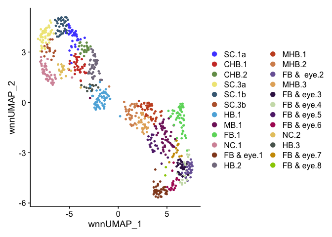
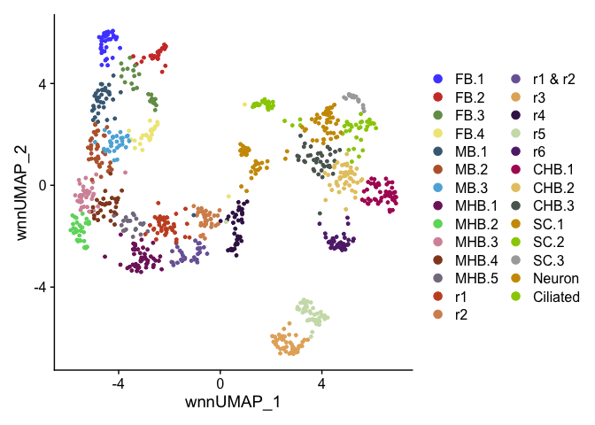
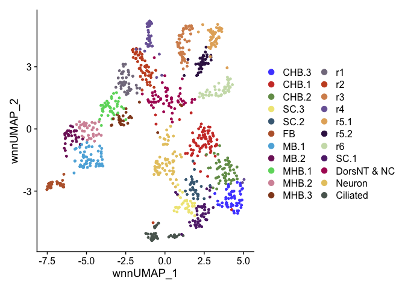

R draw unrooted cluster trees
================

Note because Seurat Object was made with Seurat 4.0 it doesn’t have
format needed (SCT feature models) for BuildClusterTree in Seurat v4.3.
So running in renv with Seurat v 4.0.5.

``` r
library(Seurat)
```

    ## Attaching SeuratObject

``` r
library(Signac)
library(dplyr)
```

    ## 
    ## Attaching package: 'dplyr'

    ## The following objects are masked from 'package:stats':
    ## 
    ##     filter, lag

    ## The following objects are masked from 'package:base':
    ## 
    ##     intersect, setdiff, setequal, union

``` r
library(ggplot2)
```

    ## Warning: package 'ggplot2' was built under R version 4.1.2

``` r
library(ggsci)
options(future.globals.maxSize = 4000 * 1024^2)
```

# Read data

``` r
E10hpf <- readRDS("~/Documents/Projects/Sagerstrom/CHB_SC_r6_manuscript/data/HB10hpf_neural.RDS")
Idents(E10hpf) <- "Clusters"
DefaultAssay(E10hpf) <- "SCT"
DimPlot(E10hpf, reduction = "wnn.umap") + scale_color_igv()
```

<!-- -->

Rename CHB and SC clusters to match HB13hpf and correct CHB.1 to SC. See
Match_CHB_SC_Cluster_Names.

``` r
Idents(E10hpf) <- "Clusters"
E10hpf <- RenameIdents(E10hpf,
                    "SC.1" = "oldSC.1",
                    "SC.2" = "oldSC.2",
                    "SC.3" = "oldSC.3")
E10hpf <- RenameIdents(E10hpf,
                    "CaudHB.1" = "SC.1a",
                    "CaudHB.2" = "CHB.1",
                    "CaudHB.3" = "CHB.2",
                    "oldSC.1" = "SC.3a",
                    "oldSC.2" = "SC.1b",
                    "oldSC.3" = "SC.3b")
DimPlot(E10hpf, reduction = "wnn.umap") + scale_color_igv()
```

<!-- -->

No need to rename HB13hpf clusters since CHB and SC cluster numbers
based on HB13hpf dataset.

``` r
HB13hpf <- readRDS("~/Documents/Projects/Sagerstrom/CHB_SC_r6_manuscript/data/HB13hpf_neural.RDS")
Idents(HB13hpf) <- "Clusters"
DimPlot(HB13hpf, reduction = "wnn.umap") + scale_color_igv()
```

<!-- -->

``` r
HB16hpf <- readRDS("~/Documents/Projects/Sagerstrom/CHB_SC_r6_manuscript/data/HB16hpf_neural.RDS")
Idents(HB16hpf) <- "Clusters"
DimPlot(HB16hpf, reduction = "wnn.umap") + scale_color_igv()
```

<!-- -->

Rename CHB and SC clusters to match HB13hpf. See
Match_CHB_SC_Cluster_Names

``` r
Idents(HB16hpf) <- "Clusters"
HB16hpf <- RenameIdents(HB16hpf,
                     "CHB.1" = "oldCHB.1",
                     "CHB.2" = "oldCHB.2",
                     "CHB.3" = "oldCHB.3",
                     "CHB.4" = "oldCHB.4",
                     "SC.2" = "oldSC.2",
                     "SC.3" = "oldSC.3")
HB16hpf <- RenameIdents(HB16hpf,
                     "oldCHB.1" = "CHB.3",
                     "oldCHB.2" = "CHB.1",
                     "oldCHB.3" = "CHB.2",
                     "oldCHB.4" = "CHB.1",
                     "oldSC.2" = "SC.3",
                     "oldSC.3" = "SC.2")
DimPlot(HB16hpf, reduction = "wnn.umap") + scale_color_igv()
```

<!-- -->

# Build and Plot Cluster Trees

``` r
E10hpf <- BuildClusterTree(E10hpf, graph = "wsnn", slot = "scale.data")
data.tree.10 <- Tool(object = E10hpf, slot = "BuildClusterTree")
png(filename = "Plots/E10hpf_dendogram.png",width = 8, height = 8, units = "in", res=1200)
p1 <- ape::plot.phylo(x = data.tree.10,  use.edge.length = FALSE, cex = 0.5, type = "u")
p1
```

    ## $type
    ## [1] "unrooted"
    ## 
    ## $use.edge.length
    ## [1] FALSE
    ## 
    ## $node.pos
    ## NULL
    ## 
    ## $node.depth
    ## [1] 1
    ## 
    ## $show.tip.label
    ## [1] TRUE
    ## 
    ## $show.node.label
    ## [1] FALSE
    ## 
    ## $font
    ## [1] 3
    ## 
    ## $cex
    ## [1] 0.5
    ## 
    ## $adj
    ## [1] 0
    ## 
    ## $srt
    ## [1] 0
    ## 
    ## $no.margin
    ## [1] FALSE
    ## 
    ## $label.offset
    ## [1] 0
    ## 
    ## $x.lim
    ## [1] -0.709033  9.968545
    ## 
    ## $y.lim
    ## [1] -0.709033  7.870982
    ## 
    ## $direction
    ## [1] "rightwards"
    ## 
    ## $tip.color
    ## [1] "black"
    ## 
    ## $Ntip
    ## [1] 24
    ## 
    ## $Nnode
    ## [1] 23
    ## 
    ## $root.time
    ## NULL
    ## 
    ## $align.tip.label
    ## [1] FALSE

``` r
dev.off()
```

    ## quartz_off_screen 
    ##                 2

``` r
png(filename = "Plots/E10hpf_dendogram_vs2.png",width = 8, height = 8, units = "in", res=1200)
p2 <- ape::plot.phylo(x = data.tree.10,  use.edge.length = FALSE, cex = 0.8, type = "u", lab4ut = "axial")
p2
```

    ## $type
    ## [1] "unrooted"
    ## 
    ## $use.edge.length
    ## [1] FALSE
    ## 
    ## $node.pos
    ## NULL
    ## 
    ## $node.depth
    ## [1] 1
    ## 
    ## $show.tip.label
    ## [1] TRUE
    ## 
    ## $show.node.label
    ## [1] FALSE
    ## 
    ## $font
    ##  [1] 3 3 3 3 3 3 3 3 3 3 3 3 3 3 3 3 3 3 3 3 3 3 3 3
    ## 
    ## $cex
    ##  [1] 0.8 0.8 0.8 0.8 0.8 0.8 0.8 0.8 0.8 0.8 0.8 0.8 0.8 0.8 0.8 0.8 0.8 0.8 0.8
    ## [20] 0.8 0.8 0.8 0.8 0.8
    ## 
    ## $adj
    ##  [1] 0 1 1 1 0 1 1 0 0 1 0 1 0 0 1 0 1 1 0 0 1 1 0 0
    ## 
    ## $srt
    ## [1] 0
    ## 
    ## $no.margin
    ## [1] FALSE
    ## 
    ## $label.offset
    ## [1] 0
    ## 
    ## $x.lim
    ## [1] -1.134453 10.393965
    ## 
    ## $y.lim
    ## [1] -1.134453  8.296402
    ## 
    ## $direction
    ## [1] "rightwards"
    ## 
    ## $tip.color
    ##  [1] "black" "black" "black" "black" "black" "black" "black" "black" "black"
    ## [10] "black" "black" "black" "black" "black" "black" "black" "black" "black"
    ## [19] "black" "black" "black" "black" "black" "black"
    ## 
    ## $Ntip
    ## [1] 24
    ## 
    ## $Nnode
    ## [1] 23
    ## 
    ## $root.time
    ## NULL
    ## 
    ## $align.tip.label
    ## [1] FALSE

``` r
dev.off()
```

    ## quartz_off_screen 
    ##                 2

``` r
HB13hpf <- BuildClusterTree(HB13hpf, graph = "wsnn", slot = "scale.data")
data.tree.13 <- Tool(object = HB13hpf, slot = "BuildClusterTree")
png(filename = "Plots/HB13hpf_dendogram.png",width = 8, height = 8, units = "in", res=1200)
p1 <- ape::plot.phylo(x = data.tree.13,  use.edge.length = FALSE, cex = 0.5, type = "u")
p1
```

    ## $type
    ## [1] "unrooted"
    ## 
    ## $use.edge.length
    ## [1] FALSE
    ## 
    ## $node.pos
    ## NULL
    ## 
    ## $node.depth
    ## [1] 1
    ## 
    ## $show.tip.label
    ## [1] TRUE
    ## 
    ## $show.node.label
    ## [1] FALSE
    ## 
    ## $font
    ## [1] 3
    ## 
    ## $cex
    ## [1] 0.5
    ## 
    ## $adj
    ## [1] 0
    ## 
    ## $srt
    ## [1] 0
    ## 
    ## $no.margin
    ## [1] FALSE
    ## 
    ## $label.offset
    ## [1] 0
    ## 
    ## $x.lim
    ## [1] -0.6959738  8.2014826
    ## 
    ## $y.lim
    ## [1] -0.6959738 10.3622772
    ## 
    ## $direction
    ## [1] "rightwards"
    ## 
    ## $tip.color
    ## [1] "black"
    ## 
    ## $Ntip
    ## [1] 27
    ## 
    ## $Nnode
    ## [1] 26
    ## 
    ## $root.time
    ## NULL
    ## 
    ## $align.tip.label
    ## [1] FALSE

``` r
dev.off()
```

    ## quartz_off_screen 
    ##                 2

``` r
png(filename = "Plots/HB13hpf_dendogram_vs2.png",width = 8, height = 8, units = "in", res=1200)
p2 <- ape::plot.phylo(x = data.tree.13,  use.edge.length = FALSE, cex = 0.8, type = "u", lab4ut = "axial")
p2
```

    ## $type
    ## [1] "unrooted"
    ## 
    ## $use.edge.length
    ## [1] FALSE
    ## 
    ## $node.pos
    ## NULL
    ## 
    ## $node.depth
    ## [1] 1
    ## 
    ## $show.tip.label
    ## [1] TRUE
    ## 
    ## $show.node.label
    ## [1] FALSE
    ## 
    ## $font
    ##  [1] 3 3 3 3 3 3 3 3 3 3 3 3 3 3 3 3 3 3 3 3 3 3 3 3 3 3 3
    ## 
    ## $cex
    ##  [1] 0.8 0.8 0.8 0.8 0.8 0.8 0.8 0.8 0.8 0.8 0.8 0.8 0.8 0.8 0.8 0.8 0.8 0.8 0.8
    ## [20] 0.8 0.8 0.8 0.8 0.8 0.8 0.8 0.8
    ## 
    ## $adj
    ##  [1] 0 0 0 0 0 1 1 1 1 1 1 1 0 1 1 1 1 1 0 0 0 0 1 0 1 0 0
    ## 
    ## $srt
    ## [1] 0
    ## 
    ## $no.margin
    ## [1] FALSE
    ## 
    ## $label.offset
    ## [1] 0
    ## 
    ## $x.lim
    ## [1] -1.113558  8.619067
    ## 
    ## $y.lim
    ## [1] -1.113558 10.779861
    ## 
    ## $direction
    ## [1] "rightwards"
    ## 
    ## $tip.color
    ##  [1] "black" "black" "black" "black" "black" "black" "black" "black" "black"
    ## [10] "black" "black" "black" "black" "black" "black" "black" "black" "black"
    ## [19] "black" "black" "black" "black" "black" "black" "black" "black" "black"
    ## 
    ## $Ntip
    ## [1] 27
    ## 
    ## $Nnode
    ## [1] 26
    ## 
    ## $root.time
    ## NULL
    ## 
    ## $align.tip.label
    ## [1] FALSE

``` r
dev.off()
```

    ## quartz_off_screen 
    ##                 2

``` r
HB16hpf <- BuildClusterTree(HB16hpf, graph = "wsnn", slot = "scale.data")
data.tree.16 <- Tool(object = HB16hpf, slot = "BuildClusterTree")
png(filename = "Plots/HB16hpf_dendogram.png",width = 8, height = 8, units = "in", res=1200)
p1 <- ape::plot.phylo(x = data.tree.16,  use.edge.length = FALSE, cex = 0.5, type = "u")
p1
```

    ## $type
    ## [1] "unrooted"
    ## 
    ## $use.edge.length
    ## [1] FALSE
    ## 
    ## $node.pos
    ## NULL
    ## 
    ## $node.depth
    ## [1] 1
    ## 
    ## $show.tip.label
    ## [1] TRUE
    ## 
    ## $show.node.label
    ## [1] FALSE
    ## 
    ## $font
    ## [1] 3
    ## 
    ## $cex
    ## [1] 0.5
    ## 
    ## $adj
    ## [1] 0
    ## 
    ## $srt
    ## [1] 0
    ## 
    ## $no.margin
    ## [1] FALSE
    ## 
    ## $label.offset
    ## [1] 0
    ## 
    ## $x.lim
    ## [1] -0.613833 10.658915
    ## 
    ## $y.lim
    ## [1] -0.613833  6.814167
    ## 
    ## $direction
    ## [1] "rightwards"
    ## 
    ## $tip.color
    ## [1] "black"
    ## 
    ## $Ntip
    ## [1] 22
    ## 
    ## $Nnode
    ## [1] 21
    ## 
    ## $root.time
    ## NULL
    ## 
    ## $align.tip.label
    ## [1] FALSE

``` r
dev.off()
```

    ## quartz_off_screen 
    ##                 2

``` r
png(filename = "Plots/HB16hpf_dendogram_vs2.png",width = 8, height = 8, units = "in", res=1200)
p2 <- ape::plot.phylo(x = data.tree.16,  use.edge.length = FALSE, cex = 0.8, type = "u", lab4ut = "axial")
p2
```

    ## $type
    ## [1] "unrooted"
    ## 
    ## $use.edge.length
    ## [1] FALSE
    ## 
    ## $node.pos
    ## NULL
    ## 
    ## $node.depth
    ## [1] 1
    ## 
    ## $show.tip.label
    ## [1] TRUE
    ## 
    ## $show.node.label
    ## [1] FALSE
    ## 
    ## $font
    ##  [1] 3 3 3 3 3 3 3 3 3 3 3 3 3 3 3 3 3 3 3 3 3 3
    ## 
    ## $cex
    ##  [1] 0.8 0.8 0.8 0.8 0.8 0.8 0.8 0.8 0.8 0.8 0.8 0.8 0.8 0.8 0.8 0.8 0.8 0.8 0.8
    ## [20] 0.8 0.8 0.8
    ## 
    ## $adj
    ##  [1] 0 0 0 1 1 1 1 1 0 1 1 0 0 1 0 1 0 0 1 0 0 0
    ## 
    ## $srt
    ## [1] 0
    ## 
    ## $no.margin
    ## [1] FALSE
    ## 
    ## $label.offset
    ## [1] 0
    ## 
    ## $x.lim
    ## [1] -0.9821329 11.0272149
    ## 
    ## $y.lim
    ## [1] -0.9821329  7.1824666
    ## 
    ## $direction
    ## [1] "rightwards"
    ## 
    ## $tip.color
    ##  [1] "black" "black" "black" "black" "black" "black" "black" "black" "black"
    ## [10] "black" "black" "black" "black" "black" "black" "black" "black" "black"
    ## [19] "black" "black" "black" "black"
    ## 
    ## $Ntip
    ## [1] 22
    ## 
    ## $Nnode
    ## [1] 21
    ## 
    ## $root.time
    ## NULL
    ## 
    ## $align.tip.label
    ## [1] FALSE

``` r
dev.off()
```

    ## quartz_off_screen 
    ##                 2

``` r
sessionInfo()
```

    ## R version 4.1.0 (2021-05-18)
    ## Platform: x86_64-apple-darwin17.0 (64-bit)
    ## Running under: macOS Big Sur 10.16
    ## 
    ## Matrix products: default
    ## BLAS:   /Library/Frameworks/R.framework/Versions/4.1/Resources/lib/libRblas.dylib
    ## LAPACK: /Library/Frameworks/R.framework/Versions/4.1/Resources/lib/libRlapack.dylib
    ## 
    ## locale:
    ## [1] en_US.UTF-8/en_US.UTF-8/en_US.UTF-8/C/en_US.UTF-8/en_US.UTF-8
    ## 
    ## attached base packages:
    ## [1] stats     graphics  grDevices datasets  utils     methods   base     
    ## 
    ## other attached packages:
    ## [1] ggsci_2.9          ggplot2_3.4.0      dplyr_1.0.7        Signac_1.4.0      
    ## [5] SeuratObject_4.0.4 Seurat_4.0.5      
    ## 
    ## loaded via a namespace (and not attached):
    ##   [1] fastmatch_1.1-3        plyr_1.8.6             igraph_1.2.8          
    ##   [4] lazyeval_0.2.2         splines_4.1.0          BiocParallel_1.28.0   
    ##   [7] listenv_0.8.0          scattermore_0.7        SnowballC_0.7.0       
    ##  [10] GenomeInfoDb_1.30.0    digest_0.6.28          htmltools_0.5.2       
    ##  [13] fansi_0.5.0            magrittr_2.0.1         tensor_1.5            
    ##  [16] cluster_2.1.2          ROCR_1.0-11            globals_0.15.1        
    ##  [19] Biostrings_2.62.0      matrixStats_0.61.0     docopt_0.7.1          
    ##  [22] spatstat.sparse_3.0-3  colorspace_2.0-2       ggrepel_0.9.1         
    ##  [25] xfun_0.27              sparsesvd_0.2          crayon_1.4.2          
    ##  [28] RCurl_1.98-1.5         jsonlite_1.7.2         spatstat.data_3.0-3   
    ##  [31] ape_5.6-2              survival_3.2-13        zoo_1.8-9             
    ##  [34] glue_1.6.2             polyclip_1.10-0        gtable_0.3.0          
    ##  [37] zlibbioc_1.40.0        XVector_0.34.0         leiden_0.3.9          
    ##  [40] future.apply_1.8.1     BiocGenerics_0.40.0    abind_1.4-5           
    ##  [43] scales_1.2.1           DBI_1.1.1              miniUI_0.1.1.1        
    ##  [46] Rcpp_1.0.11            viridisLite_0.4.0      xtable_1.8-4          
    ##  [49] reticulate_1.22        spatstat.core_2.3-0    stats4_4.1.0          
    ##  [52] htmlwidgets_1.5.4      httr_1.4.2             RColorBrewer_1.1-2    
    ##  [55] ellipsis_0.3.2         ica_1.0-2              pkgconfig_2.0.3       
    ##  [58] farver_2.1.0           ggseqlogo_0.1          uwot_0.1.10           
    ##  [61] deldir_1.0-6           utf8_1.2.2             labeling_0.4.2        
    ##  [64] tidyselect_1.1.1       rlang_1.0.6            reshape2_1.4.4        
    ##  [67] later_1.3.0            munsell_0.5.0          tools_4.1.0           
    ##  [70] cli_3.4.1              generics_0.1.1         ggridges_0.5.3        
    ##  [73] evaluate_0.14          stringr_1.4.0          fastmap_1.1.0         
    ##  [76] yaml_2.2.1             goftest_1.2-3          knitr_1.36            
    ##  [79] fitdistrplus_1.1-6     purrr_0.3.4            RANN_2.6.1            
    ##  [82] pbapply_1.5-0          future_1.26.1          nlme_3.1-153          
    ##  [85] mime_0.12              slam_0.1-48            RcppRoll_0.3.0        
    ##  [88] compiler_4.1.0         rstudioapi_0.14        plotly_4.10.0         
    ##  [91] png_0.1-7              spatstat.utils_3.0-4   tibble_3.1.6          
    ##  [94] tweenr_1.0.2           stringi_1.7.5          highr_0.9             
    ##  [97] lattice_0.20-45        Matrix_1.3-4           vctrs_0.5.0           
    ## [100] pillar_1.6.4           lifecycle_1.0.3        spatstat.geom_3.2-7   
    ## [103] lmtest_0.9-38          RcppAnnoy_0.0.19       data.table_1.14.2     
    ## [106] cowplot_1.1.1          bitops_1.0-7           irlba_2.3.3           
    ## [109] httpuv_1.6.3           patchwork_1.1.2        GenomicRanges_1.46.0  
    ## [112] R6_2.5.1               promises_1.2.0.1       renv_0.15.5           
    ## [115] KernSmooth_2.23-20     gridExtra_2.3          lsa_0.73.2            
    ## [118] IRanges_2.28.0         parallelly_1.32.0      codetools_0.2-18      
    ## [121] MASS_7.3-54            assertthat_0.2.1       withr_2.5.0           
    ## [124] qlcMatrix_0.9.7        sctransform_0.3.3      Rsamtools_2.10.0      
    ## [127] S4Vectors_0.32.4       GenomeInfoDbData_1.2.7 mgcv_1.8-38           
    ## [130] parallel_4.1.0         grid_4.1.0             rpart_4.1-15          
    ## [133] tidyr_1.1.4            rmarkdown_2.11         Rtsne_0.15            
    ## [136] ggforce_0.3.3          shiny_1.7.1
