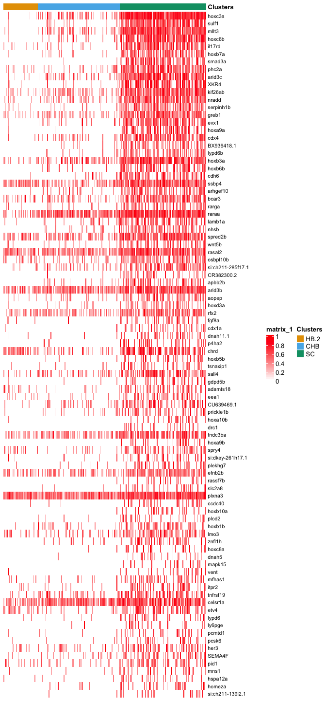
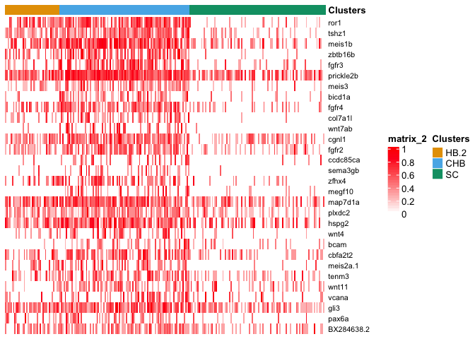
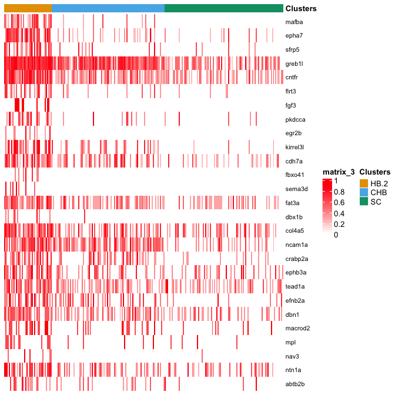
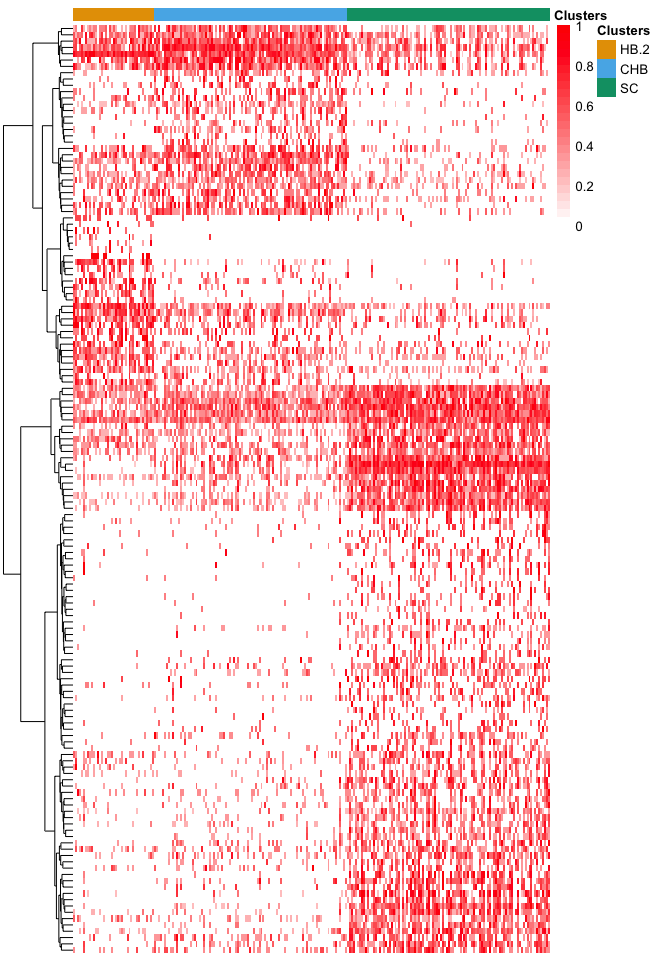
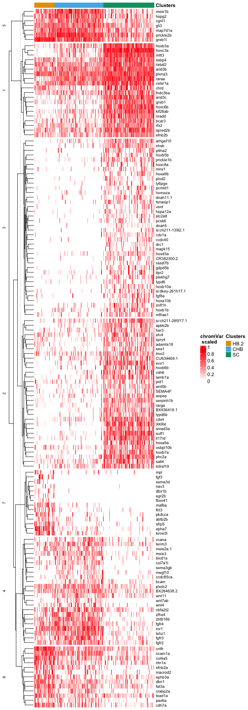

R E10hpf heatmaps of SC, CHB and HB.2
================

# 1 libraries

``` r
suppressPackageStartupMessages({
  library(Seurat)
  library(Signac)
  library(dplyr)
  library(ggplot2)
  library(ggsci)
  library(patchwork)
  library(dittoSeq)
  library(ComplexHeatmap)
})
options(future.globals.maxSize = 4000 * 1024^2)
```

# 2 read data

``` r
E10hpf <- readRDS("~/Documents/Projects/Sagerstrom/scRNA-seq_ATAC-seq_reanalysis_2021_07_12/InitialExploration/Neural_subsets/RDSfiles/HB10hpf_neural.RDS")
```

combine CaudHB clusters, SC clusters

``` r
E10hpf$Clusters <- as.character(E10hpf$Clusters)
E10hpf$Clusters[E10hpf$Clusters %in% c("SC.1","SC.2","SC.3")] <- "SC"
E10hpf$Clusters[E10hpf$Clusters %in% c("CaudHB.1","CaudHB.2","CaudHB.3")] <- "CHB"
E10hpf$Clusters <- as.factor(E10hpf$Clusters)
```

``` r
p1 <- DimPlot(E10hpf, reduction = "wnn.umap", group.by = "Clusters") + scale_color_igv()
p1
```

<!-- -->

``` r
Idents(E10hpf) <- "Clusters"
HB.subset <- subset(E10hpf, idents = c("HB.2","SC","CHB"))
HB.subset$Clusters <- factor(HB.subset$Clusters, levels = c("HB.2","CHB","SC"))
HB.subset$Sample <- HB.subset$orig.ident
cells.rhb = WhichCells(HB.subset, idents = c("HB.2","CHB","SC"))
```

# 3 Get DE gene lists for various clusters

## 3.1 SC from E10hpf

``` r
DefaultAssay(E10hpf) <- "SCT"
Idents(E10hpf) <- "Clusters"
SC.markers <- FindMarkers(E10hpf, ident.1 = "SC", ident.2 = c("CHB","HB.2"), only.pos = TRUE, verbose = F)  
SC.markers$gene <- rownames(SC.markers) 
sprintf("Total number of DE genes = %d",nrow(SC.markers))
```

    ## [1] "Total number of DE genes = 233"

``` r
sprintf("Number of DE genes with p_val_adj < 0.05 = %d",nrow(SC.markers[SC.markers$p_val_adj < 0.05,]))
```

    ## [1] "Number of DE genes with p_val_adj < 0.05 = 90"

## 3.2 CHB from E10hpf

``` r
CHB.markers <- FindMarkers(E10hpf, ident.1 = "CHB", ident.2 = c("SC","HB.2"), only.pos = TRUE, verbose = F)  
CHB.markers$gene <- rownames(CHB.markers) 
sprintf("Total number of DE genes = %d",nrow(CHB.markers))
```

    ## [1] "Total number of DE genes = 169"

``` r
sprintf("Number of DE genes with p_val_adj < 0.05 = %d",nrow(CHB.markers[CHB.markers$p_val_adj < 0.05,]))
```

    ## [1] "Number of DE genes with p_val_adj < 0.05 = 30"

## 3.3 HB.2 from E10hpf

``` r
HB2.markers <- FindMarkers(E10hpf, ident.1 = "HB.2", ident.2 = c("SC","CHB"), only.pos = TRUE, verbose = F)   
HB2.markers$gene <- rownames(HB2.markers) 
sprintf("Total number of DE genes = %d",nrow(HB2.markers))
```

    ## [1] "Total number of DE genes = 239"

``` r
sprintf("Number of DE genes with p_val_adj < 0.05 = %d",nrow(HB2.markers[HB2.markers$p_val_adj < 0.05,]))
```

    ## [1] "Number of DE genes with p_val_adj < 0.05 = 27"

# 4. Heatmaps

``` r
hm_list <- list()
```

## 4.1 SC DE genes

``` r
SCgenes <- SC.markers$gene[SC.markers$p_val_adj <0.05]
DefaultAssay(HB.subset) <- "SCT"
hm_SC <- dittoHeatmap(HB.subset, 
                             genes = SCgenes, 
                             cells = cells.rhb, 
                             assay = "SCT", #slot = "data", 
                             annot.by = c("Clusters"), 
                             scaled.to.max = T, 
                             show_rownames = T,
                             cluster_rows = F,
                             drop_levels = T,
                      complex = T)
hm_SC@row_names_param[["gp"]][["fontsize"]] = 8
hm_SC
```

<!-- -->

``` r
hm_list[["SC"]] <- hm_SC %>%
  draw(show_heatmap_legend = F, show_annotation_legend = F) %>%
  grid.grabExpr()
```

## 4.2 CHB DE genes

``` r
CHBgenes <- CHB.markers$gene[CHB.markers$p_val_adj <0.05]
DefaultAssay(HB.subset) <- "SCT"
hm_CHB <- dittoHeatmap(HB.subset, 
                             genes = CHBgenes, 
                             cells = cells.rhb, 
                             assay = "SCT", #slot = "data", 
                             annot.by = c("Clusters"), 
                             scaled.to.max = T, 
                             show_rownames = T,
                             cluster_rows = F,
                             drop_levels = T,
                       complex = T)
hm_CHB@row_names_param[["gp"]][["fontsize"]] = 8
hm_CHB
```

<!-- -->

``` r
hm_list[["CHB"]] <- hm_CHB %>%
  draw(show_heatmap_legend = F, show_annotation_legend = F) %>%
  grid.grabExpr()
```

## 4.3 r6 DE genes

``` r
HB2genes <- HB2.markers$gene[HB2.markers$p_val_adj <0.05]
DefaultAssay(HB.subset) <- "SCT"
hm_HB2 <- dittoHeatmap(HB.subset,
                             genes = HB2genes,
                             cells = cells.rhb,
                             assay = "SCT", #slot = "data",
                             annot.by = c("Clusters"),
                             scaled.to.max = T,
                             show_rownames = T,
                             cluster_rows = F,
                      complex = T)
hm_HB2@row_names_param[["gp"]][["fontsize"]] = 8
hm_HB2
```

<!-- -->

``` r
hm_list[["HB2"]] <- hm_HB2 %>%
  draw(show_heatmap_legend = F, show_annotation_legend = F) %>%
  grid.grabExpr()
```

## 4.4 all SC, CHB, r6 DE genes together

``` r
allgenes <- unique(c(SCgenes,CHBgenes,HB2genes))
```

``` r
DefaultAssay(HB.subset) <- "SCT"
comb_heatmap <- dittoHeatmap(HB.subset, 
                             genes = allgenes, 
                             cells = cells.rhb, 
                             assay = "SCT", #slot = "data", 
                             annot.by = c("Clusters"), 
                             scaled.to.max = T, 
                             show_rownames = F,
                             clustering_method = "ward.D2")
```

<!-- -->

Use h=14 clustering of genes

``` r
as.data.frame(sort(cutree(comb_heatmap$tree_row, h=10)))
```

    ##                   sort(cutree(comb_heatmap$tree_row, h = 10))
    ## hoxc3a                                                      1
    ## mllt3                                                       1
    ## hoxc6b                                                      1
    ## arid3c                                                      1
    ## kif26ab                                                     1
    ## nradd                                                       1
    ## greb1                                                       1
    ## hoxb3a                                                      1
    ## ssbp4                                                       1
    ## bcar3                                                       1
    ## raraa                                                       1
    ## spred2b                                                     1
    ## rasal2                                                      1
    ## arid3b                                                      1
    ## rfx2                                                        1
    ## chrd                                                        1
    ## fndc3ba                                                     1
    ## efnb2b                                                      1
    ## plxna3                                                      1
    ## celsr1a                                                     1
    ## sulf1                                                       2
    ## il17rd                                                      2
    ## hoxb7a                                                      2
    ## smad3a                                                      2
    ## phc2a                                                       2
    ## XKR4                                                        2
    ## serpinh1b                                                   2
    ## evx1                                                        2
    ## hoxa9a                                                      2
    ## cdx4                                                        2
    ## BX936418.1                                                  2
    ## lypd6b                                                      2
    ## hoxb6b                                                      2
    ## cdh6                                                        2
    ## rarga                                                       2
    ## lamb1a                                                      2
    ## wnt5b                                                       2
    ## osbpl10b                                                    2
    ## si:ch211-285f17.1                                           2
    ## apbb2b                                                      2
    ## aopep                                                       2
    ## sall4                                                       2
    ## adamts18                                                    2
    ## eea1                                                        2
    ## CU639469.1                                                  2
    ## spry4                                                       2
    ## lmo3                                                        2
    ## tnfrsf19                                                    2
    ## etv4                                                        2
    ## her3                                                        2
    ## SEMA4F                                                      2
    ## pid1                                                        2
    ## arhgef10                                                    3
    ## nhsb                                                        3
    ## CR382300.2                                                  3
    ## hoxd3a                                                      3
    ## fgf8a                                                       3
    ## cdx1a                                                       3
    ## dnah11.1                                                    3
    ## p4ha2                                                       3
    ## hoxb5b                                                      3
    ## tsnaxip1                                                    3
    ## gdpd5b                                                      3
    ## prickle1b                                                   3
    ## hoxa10b                                                     3
    ## drc1                                                        3
    ## hoxa9b                                                      3
    ## si:dkey-261h17.1                                            3
    ## plekhg7                                                     3
    ## rassf7b                                                     3
    ## slc2a8                                                      3
    ## ccdc40                                                      3
    ## hoxb10a                                                     3
    ## plod2                                                       3
    ## hoxb1b                                                      3
    ## znfl1h                                                      3
    ## hoxc8a                                                      3
    ## dnah5                                                       3
    ## mapk15                                                      3
    ## vent                                                        3
    ## mfhas1                                                      3
    ## itpr2                                                       3
    ## lypd6                                                       3
    ## ly6pge                                                      3
    ## pcmtd1                                                      3
    ## pcsk6                                                       3
    ## mns1                                                        3
    ## hspa12a                                                     3
    ## homeza                                                      3
    ## si:ch211-139l2.1                                            3
    ## ror1                                                        4
    ## tshz1                                                       4
    ## zbtb16b                                                     4
    ## fgfr3                                                       4
    ## meis3                                                       4
    ## bicd1a                                                      4
    ## fgfr4                                                       4
    ## col7a1l                                                     4
    ## wnt7ab                                                      4
    ## fgfr2                                                       4
    ## ccdc85ca                                                    4
    ## sema3gb                                                     4
    ## zfhx4                                                       4
    ## megf10                                                      4
    ## plxdc2                                                      4
    ## wnt4                                                        4
    ## bcam                                                        4
    ## cbfa2t2                                                     4
    ## meis2a.1                                                    4
    ## tenm3                                                       4
    ## wnt11                                                       4
    ## vcana                                                       4
    ## BX284638.2                                                  4
    ## meis1b                                                      5
    ## prickle2b                                                   5
    ## cgnl1                                                       5
    ## map7d1a                                                     5
    ## hspg2                                                       5
    ## gli3                                                        5
    ## greb1l                                                      5
    ## pax6a                                                       6
    ## cntfr                                                       6
    ## cdh7a                                                       6
    ## fat3a                                                       6
    ## col4a5                                                      6
    ## ncam1a                                                      6
    ## crabp2a                                                     6
    ## ephb3a                                                      6
    ## tead1a                                                      6
    ## efnb2a                                                      6
    ## dbn1                                                        6
    ## macrod2                                                     6
    ## ntn1a                                                       6
    ## mafba                                                       7
    ## epha7                                                       7
    ## sfrp5                                                       7
    ## flrt3                                                       7
    ## fgf3                                                        7
    ## pkdcca                                                      7
    ## egr2b                                                       7
    ## kirrel3l                                                    7
    ## fbxo41                                                      7
    ## sema3d                                                      7
    ## dbx1b                                                       7
    ## mpl                                                         7
    ## nav3                                                        7
    ## abtb2b                                                      7

``` r
comb.split = data.frame(cutree(comb_heatmap$tree_row, h=10)) %>%
  dplyr::rename("hm_cluster" = 1) 
```

``` r
hm_all <- dittoHeatmap(HB.subset, genes = allgenes,
             cells = cells.rhb, assay = "SCT", slot = "data",
             annot.by = c("Clusters"), scaled.to.max = T, show_rownames = T,
             row_split = comb.split,complex = T,name = "chromVar\n scaled",row_title_gp = gpar(fontsize = 8),
             height = 39*unit(5, "mm"))
```

    ## Warning: argument `height` is not supported in pheatmap -> Heatmap translation,
    ## skip it.

``` r
hm_all@row_names_param[["gp"]][["fontsize"]] = 8
hm_all
```

<!-- -->

``` r
hm_list[["all"]] <- hm_all %>%
  draw(align_heatmap_legend = "heatmap_top") %>%
  grid.grabExpr()
ggsave(hm_list[["all"]], file = "Plots/E10hpf_SC_CHB_HB2_genes_heatmap.png")
```

    ## Saving 7 x 20 in image

``` r
saveRDS(hm_list[["all"]], file = "Plots/E10_heatmap.RDS")
```

``` r
# p1 <- wrap_plots(hm_list[["HB2"]]) / plot_spacer() + plot_layout(heights = c(1,4.444))
# p2 <- wrap_plots(hm_list[["CHB"]]) / plot_spacer() + plot_layout(heights = c(1.111,4.333))
# p3 <- wrap_plots(hm_list[["SC"]]) / plot_spacer() + plot_layout(heights = c(3.333,2.111))
# p4 <- wrap_plots(hm_list[["all"]]) / plot_spacer() + plot_layout(heights = c(5.444,0.01))
# p <- plot_spacer() +  p1 + p2 + p3 + p4 + plot_layout(ncol = 5, widths = c(0.01,1,1,1.2,2), guides = 'collect')
# p
```

``` r
sessionInfo()
```

    ## R version 4.2.3 (2023-03-15)
    ## Platform: aarch64-apple-darwin20 (64-bit)
    ## Running under: macOS Monterey 12.6.2
    ## 
    ## Matrix products: default
    ## BLAS:   /Library/Frameworks/R.framework/Versions/4.2-arm64/Resources/lib/libRblas.0.dylib
    ## LAPACK: /Library/Frameworks/R.framework/Versions/4.2-arm64/Resources/lib/libRlapack.dylib
    ## 
    ## locale:
    ## [1] en_US.UTF-8/en_US.UTF-8/en_US.UTF-8/C/en_US.UTF-8/en_US.UTF-8
    ## 
    ## attached base packages:
    ## [1] grid      stats     graphics  grDevices utils     datasets  methods  
    ## [8] base     
    ## 
    ## other attached packages:
    ## [1] ComplexHeatmap_2.14.0 dittoSeq_1.10.0       patchwork_1.1.2      
    ## [4] ggsci_3.0.0           ggplot2_3.4.2         dplyr_1.1.2          
    ## [7] Signac_1.10.0         SeuratObject_4.1.3    Seurat_4.3.0.1       
    ## 
    ## loaded via a namespace (and not attached):
    ##   [1] circlize_0.4.15             fastmatch_1.1-3            
    ##   [3] systemfonts_1.0.4           plyr_1.8.8                 
    ##   [5] igraph_1.4.2                lazyeval_0.2.2             
    ##   [7] sp_1.6-0                    splines_4.2.3              
    ##   [9] BiocParallel_1.32.6         listenv_0.9.0              
    ##  [11] scattermore_1.0             GenomeInfoDb_1.34.9        
    ##  [13] digest_0.6.31               foreach_1.5.2              
    ##  [15] htmltools_0.5.5             fansi_1.0.4                
    ##  [17] magrittr_2.0.3              doParallel_1.0.17          
    ##  [19] tensor_1.5                  cluster_2.1.4              
    ##  [21] ROCR_1.0-11                 limma_3.54.2               
    ##  [23] globals_0.16.2              Biostrings_2.66.0          
    ##  [25] matrixStats_0.63.0          spatstat.sparse_3.0-1      
    ##  [27] colorspace_2.1-0            ggrepel_0.9.3              
    ##  [29] textshaping_0.3.6           xfun_0.39                  
    ##  [31] crayon_1.5.2                RCurl_1.98-1.12            
    ##  [33] jsonlite_1.8.4              progressr_0.13.0           
    ##  [35] spatstat.data_3.0-1         iterators_1.0.14           
    ##  [37] survival_3.5-5              zoo_1.8-12                 
    ##  [39] glue_1.6.2                  polyclip_1.10-4            
    ##  [41] gtable_0.3.3                zlibbioc_1.44.0            
    ##  [43] XVector_0.38.0              leiden_0.4.3               
    ##  [45] GetoptLong_1.0.5            DelayedArray_0.24.0        
    ##  [47] shape_1.4.6                 future.apply_1.10.0        
    ##  [49] SingleCellExperiment_1.20.1 BiocGenerics_0.44.0        
    ##  [51] abind_1.4-5                 scales_1.2.1               
    ##  [53] pheatmap_1.0.12             spatstat.random_3.1-4      
    ##  [55] miniUI_0.1.1.1              Rcpp_1.0.10                
    ##  [57] viridisLite_0.4.2           xtable_1.8-4               
    ##  [59] clue_0.3-64                 reticulate_1.28            
    ##  [61] stats4_4.2.3                htmlwidgets_1.6.2          
    ##  [63] httr_1.4.6                  RColorBrewer_1.1-3         
    ##  [65] ellipsis_0.3.2              ica_1.0-3                  
    ##  [67] farver_2.1.1                pkgconfig_2.0.3            
    ##  [69] uwot_0.1.14                 deldir_1.0-6               
    ##  [71] utf8_1.2.3                  labeling_0.4.2             
    ##  [73] tidyselect_1.2.0            rlang_1.1.1                
    ##  [75] reshape2_1.4.4              later_1.3.1                
    ##  [77] munsell_0.5.0               tools_4.2.3                
    ##  [79] cli_3.6.1                   generics_0.1.3             
    ##  [81] ggridges_0.5.4              evaluate_0.21              
    ##  [83] stringr_1.5.0               fastmap_1.1.1              
    ##  [85] ragg_1.2.5                  yaml_2.3.7                 
    ##  [87] goftest_1.2-3               knitr_1.42                 
    ##  [89] fitdistrplus_1.1-11         purrr_1.0.1                
    ##  [91] RANN_2.6.1                  pbapply_1.7-0              
    ##  [93] future_1.32.0               nlme_3.1-162               
    ##  [95] mime_0.12                   RcppRoll_0.3.0             
    ##  [97] compiler_4.2.3              rstudioapi_0.14            
    ##  [99] plotly_4.10.1               png_0.1-8                  
    ## [101] spatstat.utils_3.0-2        tibble_3.2.1               
    ## [103] stringi_1.7.12              highr_0.10                 
    ## [105] lattice_0.21-8              Matrix_1.6-1.1             
    ## [107] vctrs_0.6.2                 pillar_1.9.0               
    ## [109] lifecycle_1.0.3             GlobalOptions_0.1.2        
    ## [111] spatstat.geom_3.1-0         lmtest_0.9-40              
    ## [113] RcppAnnoy_0.0.20            data.table_1.14.8          
    ## [115] cowplot_1.1.1               bitops_1.0-7               
    ## [117] irlba_2.3.5.1               httpuv_1.6.9               
    ## [119] GenomicRanges_1.50.2        R6_2.5.1                   
    ## [121] promises_1.2.0.1            KernSmooth_2.23-21         
    ## [123] gridExtra_2.3               IRanges_2.32.0             
    ## [125] parallelly_1.35.0           codetools_0.2-19           
    ## [127] MASS_7.3-60                 SummarizedExperiment_1.28.0
    ## [129] rjson_0.2.21                withr_2.5.0                
    ## [131] sctransform_0.3.5           Rsamtools_2.14.0           
    ## [133] S4Vectors_0.36.2            GenomeInfoDbData_1.2.9     
    ## [135] parallel_4.2.3              tidyr_1.3.0                
    ## [137] rmarkdown_2.21              MatrixGenerics_1.10.0      
    ## [139] Cairo_1.6-0                 Rtsne_0.16                 
    ## [141] spatstat.explore_3.1-0      Biobase_2.58.0             
    ## [143] shiny_1.7.4
