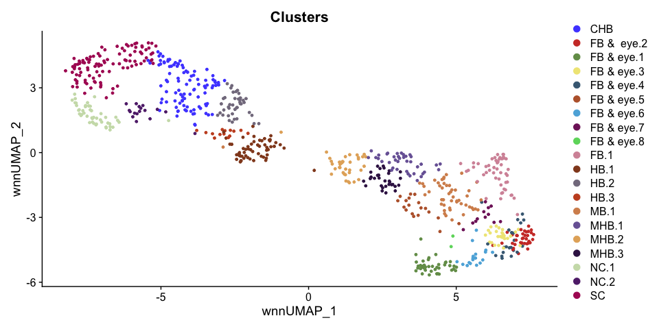

R E10hpf heatmaps of SC, CHB and HB.2
================

# 1 libraries

``` r
suppressPackageStartupMessages({
  library(Seurat)
  library(Signac)
  library(dplyr)
  library(ggplot2)
  library(ggsci)
  library(patchwork)
  library(dittoSeq)
  library(ComplexHeatmap)
  library(openxlsx)
})
```

    ## Warning: package 'dittoSeq' was built under R version 4.3.3

    ## Warning: package 'ComplexHeatmap' was built under R version 4.3.1

``` r
options(future.globals.maxSize = 4000 * 1024^2)
```

# 2 read data

``` r
E10hpf <- readRDS("~/Documents/Projects/Sagerstrom/scRNA-seq_ATAC-seq_reanalysis_2021_07_12/InitialExploration/Neural_subsets/RDSfiles/HB10hpf_neural.RDS")
```

combine CaudHB clusters, SC clusters

``` r
E10hpf$Clusters <- as.character(E10hpf$Clusters)
E10hpf$Clusters[E10hpf$Clusters %in% c("SC.1","SC.2","SC.3")] <- "SC"
E10hpf$Clusters[E10hpf$Clusters %in% c("CaudHB.1","CaudHB.2","CaudHB.3")] <- "CHB"
E10hpf$Clusters <- as.factor(E10hpf$Clusters)
```

``` r
p1 <- DimPlot(E10hpf, reduction = "wnn.umap", group.by = "Clusters") + scale_color_igv()
p1
```

<!-- -->

``` r
Idents(E10hpf) <- "Clusters"
HB.subset <- subset(E10hpf, idents = c("HB.2","SC","CHB"))
HB.subset$Clusters <- factor(HB.subset$Clusters, levels = c("HB.2","CHB","SC"))
HB.subset$Sample <- HB.subset$orig.ident
cells.rhb = WhichCells(HB.subset, idents = c("HB.2","CHB","SC"))
```

# 3 Get DE gene lists for various clusters

## 3.1 SC from E10hpf

``` r
DefaultAssay(E10hpf) <- "SCT"
Idents(E10hpf) <- "Clusters"
SC.markers <- FindMarkers(E10hpf, ident.1 = "SC", ident.2 = c("CHB","HB.2"), only.pos = TRUE, verbose = F)  
SC.markers$gene <- rownames(SC.markers) 
sprintf("Total number of DE genes = %d",nrow(SC.markers))
```

    ## [1] "Total number of DE genes = 233"

``` r
sprintf("Number of DE genes with p_val_adj < 0.05 = %d",nrow(SC.markers[SC.markers$p_val_adj < 0.05,]))
```

    ## [1] "Number of DE genes with p_val_adj < 0.05 = 90"

## 3.2 CHB from E10hpf

``` r
CHB.markers <- FindMarkers(E10hpf, ident.1 = "CHB", ident.2 = c("SC","HB.2"), only.pos = TRUE, verbose = F)  
CHB.markers$gene <- rownames(CHB.markers) 
sprintf("Total number of DE genes = %d",nrow(CHB.markers))
```

    ## [1] "Total number of DE genes = 169"

``` r
sprintf("Number of DE genes with p_val_adj < 0.05 = %d",nrow(CHB.markers[CHB.markers$p_val_adj < 0.05,]))
```

    ## [1] "Number of DE genes with p_val_adj < 0.05 = 30"

## 3.3 HB.2 from E10hpf

``` r
HB2.markers <- FindMarkers(E10hpf, ident.1 = "HB.2", ident.2 = c("SC","CHB"), only.pos = TRUE, verbose = F)   
HB2.markers$gene <- rownames(HB2.markers) 
sprintf("Total number of DE genes = %d",nrow(HB2.markers))
```

    ## [1] "Total number of DE genes = 239"

``` r
sprintf("Number of DE genes with p_val_adj < 0.05 = %d",nrow(HB2.markers[HB2.markers$p_val_adj < 0.05,]))
```

    ## [1] "Number of DE genes with p_val_adj < 0.05 = 27"

# 4. Heatmaps

``` r
hm_list <- list()
```

## 4.1 SC DE genes

``` r
SCgenes <- SC.markers$gene[SC.markers$p_val_adj <0.05]
DefaultAssay(HB.subset) <- "SCT"
hm_SC <- dittoHeatmap(HB.subset, 
                             genes = SCgenes, 
                             cells = cells.rhb, 
                             assay = "SCT", #slot = "data", 
                             annot.by = c("Clusters"), 
                             scaled.to.max = T, 
                             show_rownames = T,
                             cluster_rows = F,
                             drop_levels = T,
                      complex = T)
hm_SC@row_names_param[["gp"]][["fontsize"]] = 8
hm_SC
```

<!-- -->

``` r
hm_list[["SC"]] <- hm_SC %>%
  draw(show_heatmap_legend = F, show_annotation_legend = F) %>%
  grid.grabExpr()
```

## 4.2 CHB DE genes

``` r
CHBgenes <- CHB.markers$gene[CHB.markers$p_val_adj <0.05]
DefaultAssay(HB.subset) <- "SCT"
hm_CHB <- dittoHeatmap(HB.subset, 
                             genes = CHBgenes, 
                             cells = cells.rhb, 
                             assay = "SCT", #slot = "data", 
                             annot.by = c("Clusters"), 
                             scaled.to.max = T, 
                             show_rownames = T,
                             cluster_rows = F,
                             drop_levels = T,
                       complex = T)
hm_CHB@row_names_param[["gp"]][["fontsize"]] = 8
hm_CHB
```

<!-- -->

``` r
hm_list[["CHB"]] <- hm_CHB %>%
  draw(show_heatmap_legend = F, show_annotation_legend = F) %>%
  grid.grabExpr()
```

## 4.3 r6 DE genes

``` r
HB2genes <- HB2.markers$gene[HB2.markers$p_val_adj <0.05]
DefaultAssay(HB.subset) <- "SCT"
hm_HB2 <- dittoHeatmap(HB.subset,
                             genes = HB2genes,
                             cells = cells.rhb,
                             assay = "SCT", #slot = "data",
                             annot.by = c("Clusters"),
                             scaled.to.max = T,
                             show_rownames = T,
                             cluster_rows = F,
                      complex = T)
hm_HB2@row_names_param[["gp"]][["fontsize"]] = 8
hm_HB2
```

<!-- -->

``` r
hm_list[["HB2"]] <- hm_HB2 %>%
  draw(show_heatmap_legend = F, show_annotation_legend = F) %>%
  grid.grabExpr()
```

## 4.4 all SC, CHB, r6 DE genes together

``` r
allgenes <- unique(c(SCgenes,CHBgenes,HB2genes))
```

``` r
DefaultAssay(HB.subset) <- "SCT"
comb_heatmap <- dittoHeatmap(HB.subset, 
                             genes = allgenes, 
                             cells = cells.rhb, 
                             assay = "SCT", #slot = "data", 
                             annot.by = c("Clusters"), 
                             scaled.to.max = T, 
                             show_rownames = F,
                             clustering_method = "ward.D2")
```

<!-- -->

Use h=14 clustering of genes

``` r
as.data.frame(sort(cutree(comb_heatmap$tree_row, h=10)))
```

    ##                   sort(cutree(comb_heatmap$tree_row, h = 10))
    ## hoxc3a                                                      1
    ## mllt3                                                       1
    ## hoxc6b                                                      1
    ## arid3c                                                      1
    ## kif26ab                                                     1
    ## nradd                                                       1
    ## greb1                                                       1
    ## hoxb3a                                                      1
    ## ssbp4                                                       1
    ## bcar3                                                       1
    ## raraa                                                       1
    ## spred2b                                                     1
    ## rasal2                                                      1
    ## arid3b                                                      1
    ## rfx2                                                        1
    ## chrd                                                        1
    ## fndc3ba                                                     1
    ## efnb2b                                                      1
    ## plxna3                                                      1
    ## celsr1a                                                     1
    ## sulf1                                                       2
    ## il17rd                                                      2
    ## hoxb7a                                                      2
    ## smad3a                                                      2
    ## phc2a                                                       2
    ## XKR4                                                        2
    ## serpinh1b                                                   2
    ## evx1                                                        2
    ## hoxa9a                                                      2
    ## cdx4                                                        2
    ## BX936418.1                                                  2
    ## lypd6b                                                      2
    ## hoxb6b                                                      2
    ## cdh6                                                        2
    ## rarga                                                       2
    ## lamb1a                                                      2
    ## wnt5b                                                       2
    ## osbpl10b                                                    2
    ## si:ch211-285f17.1                                           2
    ## apbb2b                                                      2
    ## aopep                                                       2
    ## sall4                                                       2
    ## adamts18                                                    2
    ## eea1                                                        2
    ## CU639469.1                                                  2
    ## spry4                                                       2
    ## lmo3                                                        2
    ## tnfrsf19                                                    2
    ## etv4                                                        2
    ## her3                                                        2
    ## SEMA4F                                                      2
    ## pid1                                                        2
    ## arhgef10                                                    3
    ## nhsb                                                        3
    ## CR382300.2                                                  3
    ## hoxd3a                                                      3
    ## fgf8a                                                       3
    ## cdx1a                                                       3
    ## dnah11.1                                                    3
    ## p4ha2                                                       3
    ## hoxb5b                                                      3
    ## tsnaxip1                                                    3
    ## gdpd5b                                                      3
    ## prickle1b                                                   3
    ## hoxa10b                                                     3
    ## drc1                                                        3
    ## hoxa9b                                                      3
    ## si:dkey-261h17.1                                            3
    ## plekhg7                                                     3
    ## rassf7b                                                     3
    ## slc2a8                                                      3
    ## ccdc40                                                      3
    ## hoxb10a                                                     3
    ## plod2                                                       3
    ## hoxb1b                                                      3
    ## znfl1h                                                      3
    ## hoxc8a                                                      3
    ## dnah5                                                       3
    ## mapk15                                                      3
    ## vent                                                        3
    ## mfhas1                                                      3
    ## itpr2                                                       3
    ## lypd6                                                       3
    ## ly6pge                                                      3
    ## pcmtd1                                                      3
    ## pcsk6                                                       3
    ## mns1                                                        3
    ## hspa12a                                                     3
    ## homeza                                                      3
    ## si:ch211-139l2.1                                            3
    ## ror1                                                        4
    ## tshz1                                                       4
    ## zbtb16b                                                     4
    ## fgfr3                                                       4
    ## meis3                                                       4
    ## bicd1a                                                      4
    ## fgfr4                                                       4
    ## col7a1l                                                     4
    ## wnt7ab                                                      4
    ## fgfr2                                                       4
    ## ccdc85ca                                                    4
    ## sema3gb                                                     4
    ## zfhx4                                                       4
    ## megf10                                                      4
    ## plxdc2                                                      4
    ## wnt4                                                        4
    ## bcam                                                        4
    ## cbfa2t2                                                     4
    ## meis2a.1                                                    4
    ## tenm3                                                       4
    ## wnt11                                                       4
    ## vcana                                                       4
    ## BX284638.2                                                  4
    ## meis1b                                                      5
    ## prickle2b                                                   5
    ## cgnl1                                                       5
    ## map7d1a                                                     5
    ## hspg2                                                       5
    ## gli3                                                        5
    ## greb1l                                                      5
    ## pax6a                                                       6
    ## cntfr                                                       6
    ## cdh7a                                                       6
    ## fat3a                                                       6
    ## col4a5                                                      6
    ## ncam1a                                                      6
    ## crabp2a                                                     6
    ## ephb3a                                                      6
    ## tead1a                                                      6
    ## efnb2a                                                      6
    ## dbn1                                                        6
    ## macrod2                                                     6
    ## ntn1a                                                       6
    ## mafba                                                       7
    ## epha7                                                       7
    ## sfrp5                                                       7
    ## flrt3                                                       7
    ## fgf3                                                        7
    ## pkdcca                                                      7
    ## egr2b                                                       7
    ## kirrel3l                                                    7
    ## fbxo41                                                      7
    ## sema3d                                                      7
    ## dbx1b                                                       7
    ## mpl                                                         7
    ## nav3                                                        7
    ## abtb2b                                                      7

``` r
comb.split = data.frame(cutree(comb_heatmap$tree_row, h=10)) %>%
  dplyr::rename("hm_cluster" = 1) 
```

``` r
hm_all <- dittoHeatmap(HB.subset, genes = allgenes,
             cells = cells.rhb, assay = "SCT", slot = "data",
             annot.by = c("Clusters"), scaled.to.max = T, show_rownames = T,
             row_split = comb.split,complex = T,name = "chromVar\n scaled",row_title_gp = gpar(fontsize = 8),
             height = 39*unit(5, "mm"))
```

    ## Warning: argument `height` is not supported in pheatmap -> Heatmap translation,
    ## skip it.

``` r
hm_all@row_names_param[["gp"]][["fontsize"]] = 8
hm_all
```

<!-- -->

``` r
hm_list[["all"]] <- hm_all %>%
  draw(align_heatmap_legend = "heatmap_top") %>%
  grid.grabExpr()
ggsave(hm_list[["all"]], file = "Plots/E10hpf_SC_CHB_HB2_genes_heatmap.png")
```

    ## Saving 7 x 20 in image

``` r
saveRDS(hm_list[["all"]], file = "Plots/E10_heatmap.RDS")
```

``` r
# p1 <- wrap_plots(hm_list[["HB2"]]) / plot_spacer() + plot_layout(heights = c(1,4.444))
# p2 <- wrap_plots(hm_list[["CHB"]]) / plot_spacer() + plot_layout(heights = c(1.111,4.333))
# p3 <- wrap_plots(hm_list[["SC"]]) / plot_spacer() + plot_layout(heights = c(3.333,2.111))
# p4 <- wrap_plots(hm_list[["all"]]) / plot_spacer() + plot_layout(heights = c(5.444,0.01))
# p <- plot_spacer() +  p1 + p2 + p3 + p4 + plot_layout(ncol = 5, widths = c(0.01,1,1,1.2,2), guides = 'collect')
# p
```

``` r
DEgenelist <- list()
DEgenelist[["E10_SCvsCHBandHB.2"]] <- SC.markers[SC.markers$p_val_adj <0.05,]
DEgenelist[["E10_CHBvsSCandHB.2"]] <- CHB.markers[CHB.markers$p_val_adj <0.05,]
DEgenelist[["E10_HB.2vsSCandCHB"]] <- HB2.markers[HB2.markers$p_val_adj <0.05,]
write.xlsx(DEgenelist, file = "Markers/Fig6_SuppFig2_DEgenesTables_forHeatmaps.xlsx", rowNames = T)
```

``` r
sessionInfo()
```

    ## R version 4.3.0 (2023-04-21)
    ## Platform: x86_64-apple-darwin20 (64-bit)
    ## Running under: macOS Monterey 12.6.2
    ## 
    ## Matrix products: default
    ## BLAS:   /Library/Frameworks/R.framework/Versions/4.3-x86_64/Resources/lib/libRblas.0.dylib 
    ## LAPACK: /Library/Frameworks/R.framework/Versions/4.3-x86_64/Resources/lib/libRlapack.dylib;  LAPACK version 3.11.0
    ## 
    ## locale:
    ## [1] en_US.UTF-8/en_US.UTF-8/en_US.UTF-8/C/en_US.UTF-8/en_US.UTF-8
    ## 
    ## time zone: America/Denver
    ## tzcode source: internal
    ## 
    ## attached base packages:
    ## [1] grid      stats     graphics  grDevices utils     datasets  methods  
    ## [8] base     
    ## 
    ## other attached packages:
    ##  [1] openxlsx_4.2.5.2      ComplexHeatmap_2.18.0 dittoSeq_1.14.3      
    ##  [4] patchwork_1.2.0       ggsci_3.0.0           ggplot2_3.4.4        
    ##  [7] dplyr_1.1.4           Signac_1.10.0         SeuratObject_4.1.3   
    ## [10] Seurat_4.3.0.1       
    ## 
    ## loaded via a namespace (and not attached):
    ##   [1] RcppAnnoy_0.0.22            splines_4.3.0              
    ##   [3] later_1.3.2                 bitops_1.0-7               
    ##   [5] tibble_3.2.1                polyclip_1.10-6            
    ##   [7] lifecycle_1.0.4             doParallel_1.0.17          
    ##   [9] globals_0.16.2              lattice_0.22-5             
    ##  [11] MASS_7.3-60.0.1             magrittr_2.0.3             
    ##  [13] limma_3.58.1                plotly_4.10.4              
    ##  [15] rmarkdown_2.25              yaml_2.3.8                 
    ##  [17] httpuv_1.6.13               sctransform_0.4.1          
    ##  [19] zip_2.3.1                   sp_2.1-2                   
    ##  [21] spatstat.sparse_3.0-3       reticulate_1.34.0          
    ##  [23] cowplot_1.1.3               pbapply_1.7-2              
    ##  [25] RColorBrewer_1.1-3          abind_1.4-5                
    ##  [27] zlibbioc_1.48.0             Rtsne_0.17                 
    ##  [29] GenomicRanges_1.54.1        purrr_1.0.2                
    ##  [31] BiocGenerics_0.48.1         RCurl_1.98-1.14            
    ##  [33] circlize_0.4.16             GenomeInfoDbData_1.2.11    
    ##  [35] IRanges_2.36.0              S4Vectors_0.40.2           
    ##  [37] ggrepel_0.9.5               irlba_2.3.5.1              
    ##  [39] listenv_0.9.0               spatstat.utils_3.0-4       
    ##  [41] pheatmap_1.0.12             goftest_1.2-3              
    ##  [43] spatstat.random_3.2-2       fitdistrplus_1.1-11        
    ##  [45] parallelly_1.36.0           leiden_0.4.3.1             
    ##  [47] codetools_0.2-19            DelayedArray_0.28.0        
    ##  [49] RcppRoll_0.3.0              tidyselect_1.2.0           
    ##  [51] shape_1.4.6.1               farver_2.1.1               
    ##  [53] matrixStats_1.2.0           stats4_4.3.0               
    ##  [55] spatstat.explore_3.2-5      jsonlite_1.8.8             
    ##  [57] GetoptLong_1.0.5            ellipsis_0.3.2             
    ##  [59] progressr_0.14.0            ggridges_0.5.6             
    ##  [61] survival_3.5-7              iterators_1.0.14           
    ##  [63] systemfonts_1.0.6           foreach_1.5.2              
    ##  [65] tools_4.3.0                 ragg_1.3.0                 
    ##  [67] ica_1.0-3                   Rcpp_1.0.12                
    ##  [69] glue_1.7.0                  gridExtra_2.3              
    ##  [71] SparseArray_1.2.3           xfun_0.41                  
    ##  [73] MatrixGenerics_1.14.0       GenomeInfoDb_1.38.5        
    ##  [75] withr_3.0.0                 fastmap_1.1.1              
    ##  [77] fansi_1.0.6                 digest_0.6.34              
    ##  [79] R6_2.5.1                    mime_0.12                  
    ##  [81] textshaping_0.3.7           colorspace_2.1-0           
    ##  [83] scattermore_1.2             tensor_1.5                 
    ##  [85] spatstat.data_3.0-4         utf8_1.2.4                 
    ##  [87] tidyr_1.3.1                 generics_0.1.3             
    ##  [89] data.table_1.14.10          httr_1.4.7                 
    ##  [91] htmlwidgets_1.6.4           S4Arrays_1.2.0             
    ##  [93] uwot_0.1.16                 pkgconfig_2.0.3            
    ##  [95] gtable_0.3.4                lmtest_0.9-40              
    ##  [97] SingleCellExperiment_1.24.0 XVector_0.42.0             
    ##  [99] htmltools_0.5.7             clue_0.3-65                
    ## [101] scales_1.3.0                Biobase_2.62.0             
    ## [103] png_0.1-8                   knitr_1.45                 
    ## [105] rstudioapi_0.15.0           reshape2_1.4.4             
    ## [107] rjson_0.2.21                nlme_3.1-164               
    ## [109] zoo_1.8-12                  GlobalOptions_0.1.2        
    ## [111] stringr_1.5.1               KernSmooth_2.23-22         
    ## [113] parallel_4.3.0              miniUI_0.1.1.1             
    ## [115] pillar_1.9.0                vctrs_0.6.5                
    ## [117] RANN_2.6.1                  promises_1.2.1             
    ## [119] xtable_1.8-4                cluster_2.1.6              
    ## [121] evaluate_0.23               cli_3.6.2                  
    ## [123] compiler_4.3.0              Rsamtools_2.18.0           
    ## [125] rlang_1.1.3                 crayon_1.5.2               
    ## [127] future.apply_1.11.1         labeling_0.4.3             
    ## [129] plyr_1.8.9                  stringi_1.8.3              
    ## [131] viridisLite_0.4.2           deldir_2.0-2               
    ## [133] BiocParallel_1.36.0         munsell_0.5.0              
    ## [135] Biostrings_2.70.1           lazyeval_0.2.2             
    ## [137] spatstat.geom_3.2-7         Matrix_1.6-5               
    ## [139] future_1.33.1               statmod_1.5.0              
    ## [141] shiny_1.8.0                 highr_0.10                 
    ## [143] SummarizedExperiment_1.32.0 ROCR_1.0-11                
    ## [145] igraph_1.6.0                fastmatch_1.1-4
