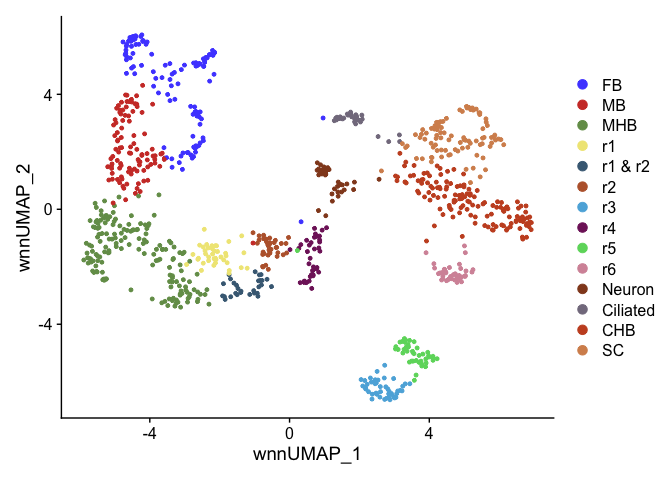
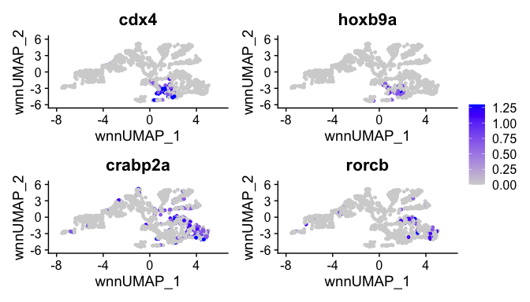
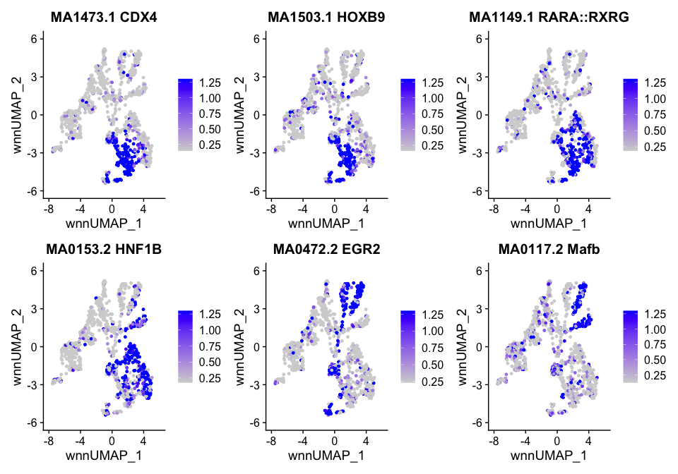

R Figure 1
================

``` r
suppressPackageStartupMessages({
  library(Seurat)
  library(Signac)
  library(BSgenome.Drerio.UCSC.danRer11)
  library(EnhancedVolcano)
  library(ggsci)
  library(patchwork)
  library(openxlsx)
})
```

    ## Warning: package 'Seurat' was built under R version 4.3.2

    ## Warning: package 'sp' was built under R version 4.3.2

    ## Warning: package 'Signac' was built under R version 4.3.2

    ## Warning: package 'BSgenome' was built under R version 4.3.2

    ## Warning: package 'BiocGenerics' was built under R version 4.3.1

    ## Warning: package 'S4Vectors' was built under R version 4.3.2

    ## Warning: package 'IRanges' was built under R version 4.3.1

    ## Warning: package 'GenomeInfoDb' was built under R version 4.3.3

    ## Warning: package 'GenomicRanges' was built under R version 4.3.1

    ## Warning: package 'Biostrings' was built under R version 4.3.3

    ## Warning: package 'XVector' was built under R version 4.3.1

    ## Warning: package 'BiocIO' was built under R version 4.3.1

    ## Warning: package 'rtracklayer' was built under R version 4.3.1

    ## Warning: package 'EnhancedVolcano' was built under R version 4.3.1

    ## Warning: package 'ggplot2' was built under R version 4.3.2

    ## Warning: package 'ggsci' was built under R version 4.3.2

# Read data

``` r
HB13 <- readRDS(file = "../data/HB13hpf_neural.RDS")
DefaultAssay(HB13) <- "SCT"
Idents(HB13) <- "Clusters"
```

``` r
HB16 <- readRDS(file = "../data/HB16hpf_neural.RDS")
DefaultAssay(HB16) <- "SCT"
Idents(HB16) <- "Clusters"
```

# Set up differntial table list

``` r
diff.list <- list()
myclusters <- c("CHB","SC","r6")
```

# Cluster names

## HB13hpf

Named clusters after clustering at resolution 8, needed to resolve all
rhombomeres into separate clusters.

``` r
DimPlot(HB13, reduction = "wnn.umap") + scale_color_igv()
```

<!-- --> Combining multiple
clusters of same cell type.

``` r
Idents(HB13) <- "Clusters"
HB13 <- RenameIdents(HB13,
                       "CHB.1" = "CHB",
                       "CHB.2" = "CHB",
                       "CHB.3" = "CHB",
                       "SC.1" = "SC",
                       "SC.2" = "SC",
                       "SC.3" = "SC",
                       "r5.1" = "r5",
                       "r5.2" = "r5",
                       "MB.1" = "MB",
                       "MB.2" = "MB",
                       "MB.3" = "MB",
                       "MHB.1" = "MHB",
                       "MHB.2" = "MHB",
                       "MHB.3" = "MHB",
                       "MHB.4" = "MHB",
                       "MHB.5" = "MHB",
                       "FB.1" = "FB",
                       "FB.2" = "FB",
                       "FB.3" = "FB",
                       "FB.4" = "FB")
```

    ## Warning: Cannot find identity r5.2

    ## Warning: Cannot find identity r5.1

``` r
levels(HB13) <- c("FB","MB","MHB","r1","r1 & r2","r2","r3","r4","r5","r6",
                    "low_expression","unknown","Neuron","Ciliated","CHB","SC")
umap.HB13 <- DimPlot(HB13, reduction = "wnn.umap") + scale_color_igv()
umap.HB13
```

<!-- -->

``` r
for(cluster in myclusters){
  diff.list[[paste0("HB13hpf_DEgenes_",cluster)]] <- FindMarkers(HB13, ident.1 = cluster, only.pos = T, verbose = F)
}
```

## HB16hpf

Named clusters after clustering at resolution 6, needed to resolve all
rhombomeres into separate clusters.

``` r
DimPlot(HB16, reduction = "wnn.umap") + scale_color_igv()
```

<!-- --> Combining multiple
clusters of same cell type.

``` r
Idents(HB16) <- "Clusters"
HB16 <- RenameIdents(HB16,
                       "CHB.1" = "CHB",
                       "CHB.2" = "CHB",
                       "CHB.3" = "CHB",
                       "CHB.4" = "CHB",
                       "SC.1" = "SC",
                       "SC.2" = "SC",
                       "SC.3" = "SC",
                       "r5.1" = "r5",
                       "r5.2" = "r5",
                       "MB.1" = "MB",
                       "MB.2" = "MB",
                       "MHB.1" = "MHB",
                       "MHB.2" = "MHB",
                       "MHB.3" = "MHB")
levels(HB16) <- c("FB","MB","MHB","r1","r2","r3","r4","r5","r6",
                    "DorsNT & NC","Neuron","Ciliated","CHB","SC")
umap.HB16 <- DimPlot(HB16, reduction = "wnn.umap") + scale_color_igv()
umap.HB16
```

<!-- -->

``` r
for(cluster in myclusters){
  diff.list[[paste0("HB16hpf_DEgenes_",cluster)]] <- FindMarkers(HB16, ident.1 = cluster, only.pos = T, verbose = F)
}
```

# Gene expression and chromvar activity plots

``` r
GetChromVarPlots <- function(object, motifs, reduction, max.cutoff){
  DefaultAssay(object) <- "chromvar"
  mylist <- list()
  for(motif in 1:length(motifs)){
    p <- FeaturePlot(
      object = object,
      reduction = reduction,
      features = motifs[[motif]],
      min.cutoff = 'q10',
      max.cutoff = max.cutoff,
      pt.size = 1)  +
      ggtitle(paste(motifs[[motif]],names(motifs[motif]), sep = " ")) +
      theme(plot.title = element_text(size = 15)) + NoLegend()
    mylist[[motifs[[motif]]]] <- p
  }
  
  return(mylist)
}
```

``` r
GetChromVarPlotsPlusLegend <- function(object, motifs, reduction, max.cutoff){
  DefaultAssay(object) <- "chromvar"
  mylist <- list()
  for(motif in 1:length(motifs)){
    p <- FeaturePlot(
      object = object,
      reduction = reduction,
      features = motifs[[motif]],
      min.cutoff = 'q10',
      max.cutoff = max.cutoff,
      pt.size = 1)  +
      ggtitle(paste(motifs[[motif]],names(motifs[motif]), sep = " ")) +
      theme(plot.title = element_text(size = 15))
    mylist[[motifs[[motif]]]] <- p
  }
  
  return(mylist)
}
```

only need to run once

``` r
# HB13 <- RunChromVAR(
#   object = HB13,
#   genome = BSgenome.Drerio.UCSC.danRer11,
#   assay = "peaks"
# )
# saveRDS(HB13, file = "../data/HB13hpf_neural.RDS")
```

``` r
# HB16 <- RunChromVAR(
#   object = HB16,
#   genome = BSgenome.Drerio.UCSC.danRer11,
#   assay = "peaks"
# )
# saveRDS(HB16, file = "../data/HB16hpf_neural.RDS")
```

## HB13hpf

``` r
motif1.names <- c("CDX4","HOXB9","RARA::RXRG","HNF1B","EGR2","Mafb")
motifs1 <- c("MA1473.1","MA1503.1","MA1149.1","MA0153.2","MA0472.2","MA0117.2")
names(motifs1) <- motif1.names
```

``` r
HB13.cdx4 <- FeaturePlot(HB13, features = "cdx4", reduction = "wnn.umap", max.cutoff = 1.3)
HB13.hoxb9a <- FeaturePlot(HB13, features = "hoxb9a", reduction = "wnn.umap", max.cutoff = 1.3)
HB13.crabp2a <- FeaturePlot(HB13, features = "crabp2a", reduction = "wnn.umap", max.cutoff = 1.3)
HB13.rorcb <- FeaturePlot(HB13, features = "rorcb", reduction = "wnn.umap", max.cutoff = 1.3)
HB13.egr2b <- FeaturePlot(HB13, features = "egr2b", reduction = "wnn.umap", max.cutoff = 1.3)
HB13.mafba <- FeaturePlot(HB13, features = "mafba", reduction = "wnn.umap", max.cutoff = 1.3)
```

``` r
HB13.cdx4 + HB13.hoxb9a + HB13.crabp2a + HB13.rorcb + HB13.egr2b + HB13.mafba + plot_layout(ncol = 3, guides = "collect")
```

<!-- --> rerun without
legends

``` r
HB13.cdx4 <- FeaturePlot(HB13, features = "cdx4", reduction = "wnn.umap", max.cutoff = 1.3) + NoLegend()
HB13.hoxb9a <- FeaturePlot(HB13, features = "hoxb9a", reduction = "wnn.umap", max.cutoff = 1.3) + NoLegend()
HB13.crabp2a <- FeaturePlot(HB13, features = "crabp2a", reduction = "wnn.umap", max.cutoff = 1.3) + NoLegend()
HB13.rorcb <- FeaturePlot(HB13, features = "rorcb", reduction = "wnn.umap", max.cutoff = 1.3) + NoLegend()
HB13.egr2b <- FeaturePlot(HB13, features = "egr2b", reduction = "wnn.umap", max.cutoff = 1.3) + NoLegend()
HB13.mafba <- FeaturePlot(HB13, features = "mafba", reduction = "wnn.umap", max.cutoff = 1.3) + NoLegend()
```

``` r
HB13.cv.motif.legend <- GetChromVarPlotsPlusLegend(HB13, motifs1, "wnn.umap", 1.3)
HB13.cv.list <- GetChromVarPlots(HB13, motifs1, "wnn.umap", 1.3)
wrap_plots(HB13.cv.motif.legend)
```

<!-- -->

## HB16hpf

``` r
HB16.cdx4 <- FeaturePlot(HB16, features = "cdx4", reduction = "wnn.umap", max.cutoff = 1.3)
HB16.hoxb9a <- FeaturePlot(HB16, features = "hoxb9a", reduction = "wnn.umap", max.cutoff = 1.3)
HB16.crabp2a <- FeaturePlot(HB16, features = "crabp2a", reduction = "wnn.umap", max.cutoff = 1.3)
HB16.rorcb <- FeaturePlot(HB16, features = "rorcb", reduction = "wnn.umap", max.cutoff = 1.3)
```

``` r
HB16.cdx4 + HB16.hoxb9a + HB16.crabp2a + HB16.rorcb + plot_layout(ncol = 2, guides = "collect")
```

<!-- --> rerun without
legends

``` r
HB16.cdx4 <- FeaturePlot(HB16, features = "cdx4", reduction = "wnn.umap", max.cutoff = 1.3) + NoLegend()
HB16.hoxb9a <- FeaturePlot(HB16, features = "hoxb9a", reduction = "wnn.umap", max.cutoff = 1.3) + NoLegend()
HB16.crabp2a <- FeaturePlot(HB16, features = "crabp2a", reduction = "wnn.umap", max.cutoff = 1.3) + NoLegend()
HB16.rorcb <- FeaturePlot(HB16, features = "rorcb", reduction = "wnn.umap", max.cutoff = 1.3) + NoLegend()
```

``` r
HB16.cv.motif.legend <- GetChromVarPlotsPlusLegend(HB16, motifs1, "wnn.umap", 1.3)
HB16.cv.list <- GetChromVarPlots(HB16, motifs1, "wnn.umap", 1.3)
wrap_plots(HB16.cv.motif.legend)
```

<!-- -->

# Differential accessibility

``` r
GetDiffAct <- function(object,cluster, assay){
  DefaultAssay(object) <- 'chromvar'
  DA <- FindMarkers(
    object = object,
    ident.1 = cluster,
    only.pos = TRUE,
    test.use = 'LR',
    latent.vars = 'nCount_peaks'
  )
  DA$motif <- rownames(DA)
  DA$motif.name <- "NA"
  for(motif in rownames(DA)){
    #print(motif)
    motif.name <- object@assays[[assay]]@motifs@motif.names[[motif]]
    #print(motif.name)
    DA[DA$motif == motif,]$motif.name <- motif.name
  }
  
  return(DA)
}
```

## HB13hpf

``` r
DefaultAssay(HB13) <- "chromvar"
for(cluster in myclusters){
  try({
    diff.list[[paste0("HB13hpf_DAmotif_",cluster)]] <- GetDiffAct(HB13, cluster, "peaks")
  })
}
```

    ## Warning in mean.fxn(object[features, cells.1, drop = FALSE]): NaNs produced

    ## Warning in mean.fxn(object[features, cells.1, drop = FALSE]): NaNs produced

    ## Warning in mean.fxn(object[features, cells.1, drop = FALSE]): NaNs produced

## HB16hpf

``` r
DefaultAssay(HB16) <- "chromvar"
for(cluster in myclusters){
  try({
    diff.list[[paste0("HB16hpf_DAmotif_",cluster)]] <- GetDiffAct(HB16, cluster, "peaks")
  })
}
```

    ## Warning in mean.fxn(object[features, cells.1, drop = FALSE]): NaNs produced

    ## Warning in mean.fxn(object[features, cells.1, drop = FALSE]): NaNs produced

    ## Warning in mean.fxn(object[features, cells.1, drop = FALSE]): NaNs produced

``` r
write.xlsx(diff.list, file = "Markers/Fig1_DEgene_DAmotif_byCluster.xlsx", rowNames = T)
```

# Figure 1 combined plots

``` r
layout <- "
AABC
AADE
FGHI
JKLM
NNOP
NNQR
STUV
"

combined1 <- umap.HB13 + HB13.cdx4 + HB13.cv.motif.legend[[1]] + 
  HB13.hoxb9a + HB13.cv.list[[2]] + 
  HB13.crabp2a + HB13.rorcb + HB13.cv.list[[3]] + HB13.cv.list[[4]] +
  HB13.egr2b + HB13.cv.list[[5]] + HB13.mafba + HB13.cv.list[[6]] +
  umap.HB16 + HB16.cdx4 + HB16.cv.list[[1]] + 
  HB16.hoxb9a + HB16.cv.list[[2]] +
  HB16.crabp2a + HB16.rorcb + HB16.cv.list[[3]] + plot_spacer() +
  plot_layout(design = layout)
combined1
```

<!-- -->

``` r
ggsave(filename = "Plots/Figure1.png", width = 15, height = 20, plot = combined1)
```

``` r
# layout <- "
# AAAAAABBBB
# CCCCCCDDDD
# EEEEEEEEEE
# FFFFFFFFFF
# GGGGGGHHHH
# IIIIIIHHHH"
# 
# combined2 <- umap.HB13 + umap.HB16 + 
#   HB13.exp + HB13.motif1 + 
#   HB13.exp2 + 
#   HB13.motif2 + 
#   HB16.exp + (HB16.motif + plot_layout(ncol = 1, guides = "collect")) + 
#   HB16.exp2 + 
#   plot_layout(design = layout, heights = c(2,1,1,1,1,1)) +
#   theme(title = element_text(size = 3))
# combined2
# ggsave(filename = "Plots/Figure1.png", width = 15, height = 20, plot = combined2)
```

``` r
sessionInfo()
```

    ## R version 4.3.0 (2023-04-21)
    ## Platform: x86_64-apple-darwin20 (64-bit)
    ## Running under: macOS Monterey 12.6.2
    ## 
    ## Matrix products: default
    ## BLAS:   /Library/Frameworks/R.framework/Versions/4.3-x86_64/Resources/lib/libRblas.0.dylib 
    ## LAPACK: /Library/Frameworks/R.framework/Versions/4.3-x86_64/Resources/lib/libRlapack.dylib;  LAPACK version 3.11.0
    ## 
    ## locale:
    ## [1] en_US.UTF-8/en_US.UTF-8/en_US.UTF-8/C/en_US.UTF-8/en_US.UTF-8
    ## 
    ## time zone: America/Denver
    ## tzcode source: internal
    ## 
    ## attached base packages:
    ## [1] stats4    stats     graphics  grDevices utils     datasets  methods  
    ## [8] base     
    ## 
    ## other attached packages:
    ##  [1] openxlsx_4.2.5.2                    patchwork_1.2.0                    
    ##  [3] ggsci_3.0.3                         EnhancedVolcano_1.20.0             
    ##  [5] ggrepel_0.9.5                       ggplot2_3.5.0                      
    ##  [7] BSgenome.Drerio.UCSC.danRer11_1.4.2 BSgenome_1.70.2                    
    ##  [9] rtracklayer_1.62.0                  BiocIO_1.12.0                      
    ## [11] Biostrings_2.70.3                   XVector_0.42.0                     
    ## [13] GenomicRanges_1.54.1                GenomeInfoDb_1.38.8                
    ## [15] IRanges_2.36.0                      S4Vectors_0.40.2                   
    ## [17] BiocGenerics_0.48.1                 Signac_1.13.0                      
    ## [19] Seurat_5.0.3                        SeuratObject_5.0.1                 
    ## [21] sp_2.1-3                           
    ## 
    ## loaded via a namespace (and not attached):
    ##   [1] RcppAnnoy_0.0.22            splines_4.3.0              
    ##   [3] later_1.3.2                 bitops_1.0-7               
    ##   [5] tibble_3.2.1                polyclip_1.10-6            
    ##   [7] XML_3.99-0.16.1             fastDummies_1.7.3          
    ##   [9] lifecycle_1.0.4             globals_0.16.3             
    ##  [11] lattice_0.22-6              MASS_7.3-60.0.1            
    ##  [13] magrittr_2.0.3              limma_3.58.1               
    ##  [15] plotly_4.10.4               rmarkdown_2.26             
    ##  [17] yaml_2.3.8                  httpuv_1.6.15              
    ##  [19] sctransform_0.4.1           spam_2.10-0                
    ##  [21] zip_2.3.1                   spatstat.sparse_3.0-3      
    ##  [23] reticulate_1.35.0           cowplot_1.1.3              
    ##  [25] pbapply_1.7-2               RColorBrewer_1.1-3         
    ##  [27] abind_1.4-5                 zlibbioc_1.48.2            
    ##  [29] Rtsne_0.17                  purrr_1.0.2                
    ##  [31] presto_1.0.0                RCurl_1.98-1.14            
    ##  [33] GenomeInfoDbData_1.2.11     irlba_2.3.5.1              
    ##  [35] listenv_0.9.1               spatstat.utils_3.0-4       
    ##  [37] goftest_1.2-3               RSpectra_0.16-1            
    ##  [39] spatstat.random_3.2-3       fitdistrplus_1.1-11        
    ##  [41] parallelly_1.37.1           leiden_0.4.3.1             
    ##  [43] codetools_0.2-20            DelayedArray_0.28.0        
    ##  [45] RcppRoll_0.3.0              tidyselect_1.2.1           
    ##  [47] farver_2.1.1                matrixStats_1.3.0          
    ##  [49] spatstat.explore_3.2-7      GenomicAlignments_1.38.2   
    ##  [51] jsonlite_1.8.8              progressr_0.14.0           
    ##  [53] ggridges_0.5.6              survival_3.5-8             
    ##  [55] systemfonts_1.0.6           tools_4.3.0                
    ##  [57] ragg_1.3.0                  ica_1.0-3                  
    ##  [59] Rcpp_1.0.12                 glue_1.7.0                 
    ##  [61] gridExtra_2.3               SparseArray_1.2.4          
    ##  [63] xfun_0.43                   MatrixGenerics_1.14.0      
    ##  [65] dplyr_1.1.4                 withr_3.0.0                
    ##  [67] fastmap_1.1.1               fansi_1.0.6                
    ##  [69] digest_0.6.35               R6_2.5.1                   
    ##  [71] mime_0.12                   textshaping_0.3.7          
    ##  [73] colorspace_2.1-0            scattermore_1.2            
    ##  [75] tensor_1.5                  spatstat.data_3.0-4        
    ##  [77] utf8_1.2.4                  tidyr_1.3.1                
    ##  [79] generics_0.1.3              data.table_1.15.4          
    ##  [81] httr_1.4.7                  htmlwidgets_1.6.4          
    ##  [83] S4Arrays_1.2.1              uwot_0.1.16                
    ##  [85] pkgconfig_2.0.3             gtable_0.3.4               
    ##  [87] lmtest_0.9-40               htmltools_0.5.8.1          
    ##  [89] dotCall64_1.1-1             scales_1.3.0               
    ##  [91] Biobase_2.62.0              png_0.1-8                  
    ##  [93] knitr_1.45                  rstudioapi_0.16.0          
    ##  [95] reshape2_1.4.4              rjson_0.2.21               
    ##  [97] nlme_3.1-164                zoo_1.8-12                 
    ##  [99] stringr_1.5.1               KernSmooth_2.23-22         
    ## [101] parallel_4.3.0              miniUI_0.1.1.1             
    ## [103] restfulr_0.0.15             pillar_1.9.0               
    ## [105] grid_4.3.0                  vctrs_0.6.5                
    ## [107] RANN_2.6.1                  promises_1.3.0             
    ## [109] xtable_1.8-4                cluster_2.1.6              
    ## [111] evaluate_0.23               cli_3.6.2                  
    ## [113] compiler_4.3.0              Rsamtools_2.18.0           
    ## [115] rlang_1.1.3                 crayon_1.5.2               
    ## [117] future.apply_1.11.2         labeling_0.4.3             
    ## [119] plyr_1.8.9                  stringi_1.8.3              
    ## [121] viridisLite_0.4.2           deldir_2.0-4               
    ## [123] BiocParallel_1.36.0         munsell_0.5.1              
    ## [125] lazyeval_0.2.2              spatstat.geom_3.2-9        
    ## [127] Matrix_1.6-5                RcppHNSW_0.6.0             
    ## [129] future_1.33.2               statmod_1.5.0              
    ## [131] shiny_1.8.1.1               SummarizedExperiment_1.32.0
    ## [133] highr_0.10                  ROCR_1.0-11                
    ## [135] igraph_2.0.3                fastmatch_1.1-4
