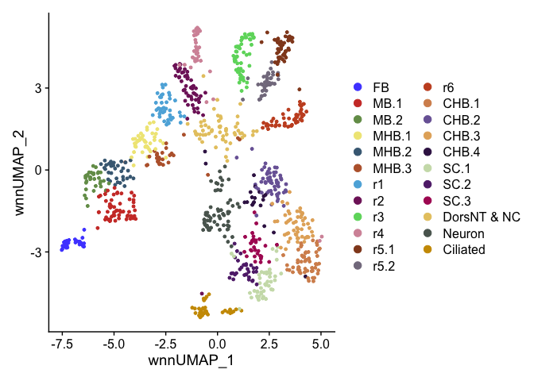
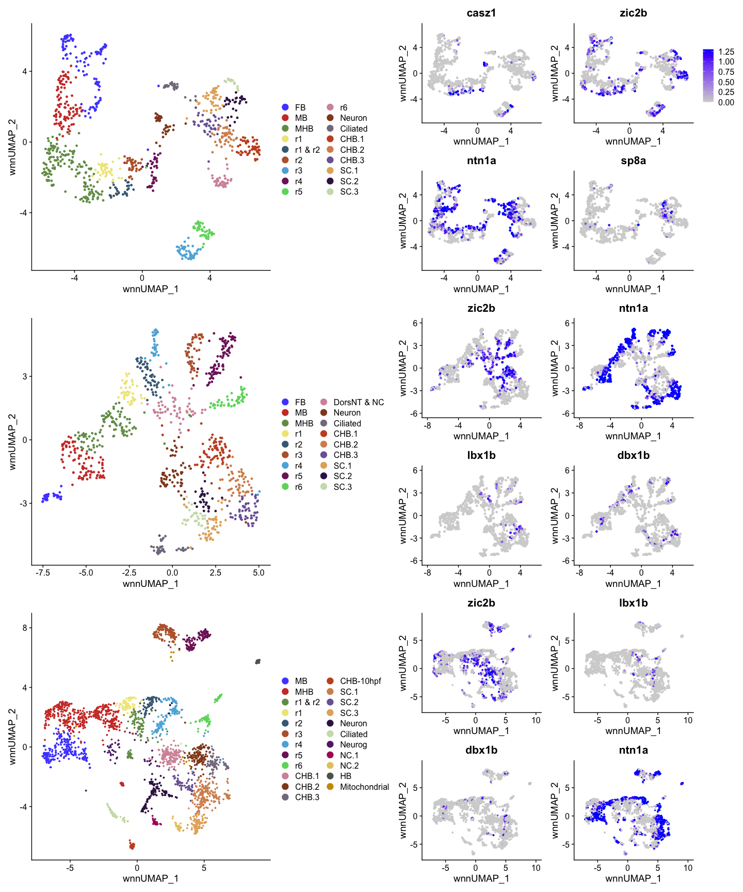

R Figure 2
================

``` r
suppressPackageStartupMessages({
  library(Seurat)
  library(Signac)
  library(BSgenome.Drerio.UCSC.danRer11)
  library(EnhancedVolcano)
  library(ggsci)
  library(patchwork)
})
```

# Read data

``` r
HB13 <- readRDS(file = "../data/HB13hpf_neural.RDS")
DefaultAssay(HB13) <- "SCT"
Idents(HB13) <- "Clusters"
```

``` r
HB16 <- readRDS(file = "../data/HB16hpf_neural.RDS")
DefaultAssay(HB16) <- "SCT"
Idents(HB16) <- "Clusters"
```

``` r
HB.int <- readRDS(file = "../data/int.neural.3WT.subset.RDS")
DefaultAssay(HB.int) <- "SCT"
Idents(HB.int) <- "intClusters"
```

# Cluster names

## HB13hpf

Named clusters after clustering at resolution 8, needed to resolve all
rhombomeres into separate clusters.

``` r
DimPlot(HB13, reduction = "wnn.umap") + scale_color_igv()
```

<!-- --> Combining multiple
clusters of same cell type.

``` r
Idents(HB13) <- "Clusters"
HB13 <- RenameIdents(HB13,
                       "r5.1" = "r5",
                       "r5.2" = "r5",
                       "MB.1" = "MB",
                       "MB.2" = "MB",
                       "MB.3" = "MB",
                       "MHB.1" = "MHB",
                       "MHB.2" = "MHB",
                       "MHB.3" = "MHB",
                       "MHB.4" = "MHB",
                       "MHB.5" = "MHB",
                       "FB.1" = "FB",
                       "FB.2" = "FB",
                       "FB.3" = "FB",
                       "FB.4" = "FB")
```

    ## Warning: Cannot find identity r5.2

    ## Warning: Cannot find identity r5.1

``` r
levels(HB13) <- c("FB","MB","MHB","r1","r1 & r2","r2","r3","r4","r5","r6",
                    "low_expression","unknown","Neuron","Ciliated","CHB.1","CHB.2","CHB.3","SC.1","SC.2","SC.3")
umap.HB13 <- DimPlot(HB13, reduction = "wnn.umap") + scale_color_igv() + 
  guides(color = guide_legend(override.aes = list(size=4), ncol=2) )
umap.HB13
```

<!-- -->

## HB16hpf

Named clusters after clustering at resolution 6, needed to resolve all
rhombomeres into separate clusters.

``` r
DimPlot(HB16, reduction = "wnn.umap") + scale_color_igv()
```

<!-- -->

Combining multiple clusters of same cell type, and renaming CHB and SC
subclusters to match HB13hpf subclusters as determined in
Match_CHB_SC_Cluster_Names.

``` r
Idents(HB16) <- "Clusters"
HB16 <- RenameIdents(HB16,
                     "CHB.1" = "oldCHB.1",
                     "CHB.2" = "oldCHB.2",
                     "CHB.3" = "oldCHB.3",
                     "CHB.4" = "oldCHB.4",
                     "SC.2" = "oldSC.2",
                     "SC.3" = "oldSC.3")
HB16 <- RenameIdents(HB16,
                       "r5.1" = "r5",
                       "r5.2" = "r5",
                       "MB.1" = "MB",
                       "MB.2" = "MB",
                       "MHB.1" = "MHB",
                       "MHB.2" = "MHB",
                       "MHB.3" = "MHB",
                     "oldCHB.1" = "CHB.3",
                     "oldCHB.2" = "CHB.1",
                     "oldCHB.3" = "CHB.2",
                     "oldCHB.4" = "CHB.1",
                     "oldSC.2" = "SC.3",
                     "oldSC.3" = "SC.2")
levels(HB16) <- c("FB","MB","MHB","r1","r2","r3","r4","r5","r6",
                    "DorsNT & NC","Neuron","Ciliated","CHB.1","CHB.2","CHB.3","CHB.4","SC.1","SC.2","SC.3")
umap.HB16 <- DimPlot(HB16, reduction = "wnn.umap") + scale_color_igv() + 
  guides(color = guide_legend(override.aes = list(size=4), ncol=2) )
umap.HB16
```

<!-- -->

## HB integrated

Combining multiple clusters of same cell type and renaming SC
subclusters to match HB13hpf subclusters, but CHB subcluster types match
HB13hpf so no need to rename. See Match_CHB_SC_Cluster_Names.

``` r
Idents(HB.int) <- "intClusters"
HB.int <- RenameIdents(HB.int,
                       "SC.2" = "oldSC.2",
                       "SC.3" = "oldSC.3",
                       "SC.4" = "oldSC.4")
HB.int <- RenameIdents(HB.int,
                       "r1&r2.1" = "r1 & r2",
                       "r1&r2.2" = "r1 & r2",
                       "r3.1" = "r3",
                       "r4.1" = "r4",
                       "r4.2" = "r4",
                       "r5.1" = "r5",
                       "r5.2" = "r5",
                       "r6.1" = "r6",
                       "r6.2" = "r6",
                       "MB.1" = "MB",
                       "MB.2" = "MB",
                       "MB.3" = "MB",
                       "MHB.1" = "MHB",
                       "MHB.2" = "MHB",
                       "MHB.3" = "MHB",
                       "MHB.4" = "MHB",
                       "MHB.5" = "MHB",
                       "MHB.6" = "MHB",
                       "Neuron.1" = "Neuron",
                       "Neuron.2" = "Neuron",
                       "CaudHB.1" = "CHB.1",
                       "CaudHB.2" = "CHB.2",
                       "CaudHB.3" = "CHB.3",
                       "CaudHB.4" = "CHB-10hpf",
                       "oldSC.2" = "SC.3",
                       "oldSC.3" = "SC.2",
                       "oldSC.4" = "SC.1")
levels(HB.int) <- c("MB","MHB","r1 & r2","r1","r2","r3","r4","r5","r6",           
                  "CHB.1","CHB.2","CHB.3","CHB-10hpf","SC.1","SC.2","SC.3",
                  "Neuron","Ciliated","Neurog","NC.1","NC.2","HB","Mitochondrial")
umap.HBint <- DimPlot(HB.int, reduction = "wnn.umap") + scale_color_igv() + 
  guides(color = guide_legend(override.aes = list(size=4), ncol=2) )
umap.HBint
```

<!-- -->

# Gene expression and chromvar activity plots

## HB13hpf

``` r
HB13.casz1 <- FeaturePlot(HB13, features = "casz1", reduction = "wnn.umap", max.cutoff = 1.3) + NoLegend()
HB13.zic2b <- FeaturePlot(HB13, features = "zic2b", reduction = "wnn.umap", max.cutoff = 1.3)
HB13.ntn1a <- FeaturePlot(HB13, features = "ntn1a", reduction = "wnn.umap", max.cutoff = 1.3) + NoLegend()
HB13.sp8a <- FeaturePlot(HB13, features = "sp8a", reduction = "wnn.umap", max.cutoff = 1.3) + NoLegend()
```

## HB16hpf

``` r
HB16.zic2b <- FeaturePlot(HB16, features = "zic2b", reduction = "wnn.umap", max.cutoff = 1.3) + NoLegend()
HB16.ntn1a <- FeaturePlot(HB16, features = "ntn1a", reduction = "wnn.umap", max.cutoff = 1.3) + NoLegend()
HB16.lbx1b <- FeaturePlot(HB16, features = "lbx1b", reduction = "wnn.umap", max.cutoff = 1.3) + NoLegend()
HB16.dbx1b <- FeaturePlot(HB16, features = "dbx1b", reduction = "wnn.umap", max.cutoff = 1.3) + NoLegend()
```

## HB integrated

``` r
HBint.zic2b <- FeaturePlot(HB.int, features = "zic2b", reduction = "wnn.umap", max.cutoff = 1.3) + NoLegend()
HBint.lbx1b <- FeaturePlot(HB.int, features = "lbx1b", reduction = "wnn.umap", max.cutoff = 1.3) + NoLegend()
HBint.dbx1b <- FeaturePlot(HB.int, features = "dbx1b", reduction = "wnn.umap", max.cutoff = 1.3) + NoLegend()
HBint.ntn1a <- FeaturePlot(HB.int, features = "ntn1a", reduction = "wnn.umap", max.cutoff = 1.3) + NoLegend()
```

# Figure 2 combined plots

``` r
layout <- "
AABC
AADE
FFGH
FFIJ
KKLM
KKNO"

combined <- umap.HB13 + HB13.casz1 + HB13.zic2b + 
  HB13.ntn1a + HB13.sp8a + 
  umap.HB16 + HB16.zic2b + HB16.ntn1a +
  HB16.lbx1b + HB16.dbx1b + 
  umap.HBint + HBint.zic2b + HBint.lbx1b +
  HBint.dbx1b + HBint.ntn1a +
  plot_layout(design = layout)
combined
```

<!-- -->

``` r
ggsave(filename = "Plots/Figure2.png", width = 15, height = 18, plot = combined)
```

``` r
# umap.HB13 <- umap.HB13 +
#   guides(color = guide_legend(override.aes = list(size=4), ncol=1) )
# umap.HB16 <- umap.HB16 +
#   guides(color = guide_legend(override.aes = list(size=4), ncol=1) )
# umap.HBint <-  umap.HBint +
#   guides(color = guide_legend(override.aes = list(size=4), ncol=1) )
# layout <- "
# AABC#
# AADEF
# GGHI#
# GGJK#
# LLMN#
# LLOP#"
# 
# combined2 <- umap.HB13 + HB13.casz1 + HB13.zic2b + 
#   HB13.ntn1a + HB13.sp8a + HB13.lbx1b +
#   umap.HB16 + HB16.zic2b + HB16.ntn1a +
#   HB16.lbx1b + HB16.dbx1b + 
#   umap.HBint + HBint.zic2b + HBint.lbx1b +
#   HBint.dbx1b + HBint.ntn1a +
#   plot_layout(design = layout)
# combined2
# ggsave(filename = "Plots/Figure2_vs2.png", width = 15, height = 20, plot = combined2)
```

``` r
sessionInfo()
```

    ## R version 4.2.3 (2023-03-15)
    ## Platform: aarch64-apple-darwin20 (64-bit)
    ## Running under: macOS Monterey 12.6.2
    ## 
    ## Matrix products: default
    ## BLAS:   /Library/Frameworks/R.framework/Versions/4.2-arm64/Resources/lib/libRblas.0.dylib
    ## LAPACK: /Library/Frameworks/R.framework/Versions/4.2-arm64/Resources/lib/libRlapack.dylib
    ## 
    ## locale:
    ## [1] en_US.UTF-8/en_US.UTF-8/en_US.UTF-8/C/en_US.UTF-8/en_US.UTF-8
    ## 
    ## attached base packages:
    ## [1] stats4    stats     graphics  grDevices utils     datasets  methods  
    ## [8] base     
    ## 
    ## other attached packages:
    ##  [1] patchwork_1.1.2                     ggsci_3.0.0                        
    ##  [3] EnhancedVolcano_1.16.0              ggrepel_0.9.3                      
    ##  [5] ggplot2_3.4.2                       BSgenome.Drerio.UCSC.danRer11_1.4.2
    ##  [7] BSgenome_1.66.3                     rtracklayer_1.58.0                 
    ##  [9] Biostrings_2.66.0                   XVector_0.38.0                     
    ## [11] GenomicRanges_1.50.2                GenomeInfoDb_1.34.9                
    ## [13] IRanges_2.32.0                      S4Vectors_0.36.2                   
    ## [15] BiocGenerics_0.44.0                 Signac_1.10.0                      
    ## [17] SeuratObject_4.1.3                  Seurat_4.3.0.1                     
    ## 
    ## loaded via a namespace (and not attached):
    ##   [1] fastmatch_1.1-3             systemfonts_1.0.4          
    ##   [3] plyr_1.8.8                  igraph_1.4.2               
    ##   [5] lazyeval_0.2.2              sp_1.6-0                   
    ##   [7] splines_4.2.3               BiocParallel_1.32.6        
    ##   [9] listenv_0.9.0               scattermore_1.0            
    ##  [11] digest_0.6.31               htmltools_0.5.5            
    ##  [13] fansi_1.0.4                 magrittr_2.0.3             
    ##  [15] tensor_1.5                  cluster_2.1.4              
    ##  [17] ROCR_1.0-11                 globals_0.16.2             
    ##  [19] matrixStats_0.63.0          spatstat.sparse_3.0-1      
    ##  [21] colorspace_2.1-0            textshaping_0.3.6          
    ##  [23] xfun_0.39                   dplyr_1.1.2                
    ##  [25] crayon_1.5.2                RCurl_1.98-1.12            
    ##  [27] jsonlite_1.8.4              progressr_0.13.0           
    ##  [29] spatstat.data_3.0-1         survival_3.5-5             
    ##  [31] zoo_1.8-12                  glue_1.6.2                 
    ##  [33] polyclip_1.10-4             gtable_0.3.3               
    ##  [35] zlibbioc_1.44.0             leiden_0.4.3               
    ##  [37] DelayedArray_0.24.0         future.apply_1.10.0        
    ##  [39] abind_1.4-5                 scales_1.2.1               
    ##  [41] spatstat.random_3.1-4       miniUI_0.1.1.1             
    ##  [43] Rcpp_1.0.10                 viridisLite_0.4.2          
    ##  [45] xtable_1.8-4                reticulate_1.28            
    ##  [47] htmlwidgets_1.6.2           httr_1.4.6                 
    ##  [49] RColorBrewer_1.1-3          ellipsis_0.3.2             
    ##  [51] ica_1.0-3                   farver_2.1.1               
    ##  [53] pkgconfig_2.0.3             XML_3.99-0.14              
    ##  [55] uwot_0.1.14                 deldir_1.0-6               
    ##  [57] utf8_1.2.3                  labeling_0.4.2             
    ##  [59] tidyselect_1.2.0            rlang_1.1.1                
    ##  [61] reshape2_1.4.4              later_1.3.1                
    ##  [63] munsell_0.5.0               tools_4.2.3                
    ##  [65] cli_3.6.1                   generics_0.1.3             
    ##  [67] ggridges_0.5.4              evaluate_0.21              
    ##  [69] stringr_1.5.0               fastmap_1.1.1              
    ##  [71] ragg_1.2.5                  yaml_2.3.7                 
    ##  [73] goftest_1.2-3               knitr_1.42                 
    ##  [75] fitdistrplus_1.1-11         purrr_1.0.1                
    ##  [77] RANN_2.6.1                  pbapply_1.7-0              
    ##  [79] future_1.32.0               nlme_3.1-162               
    ##  [81] mime_0.12                   RcppRoll_0.3.0             
    ##  [83] compiler_4.2.3              rstudioapi_0.14            
    ##  [85] plotly_4.10.1               png_0.1-8                  
    ##  [87] spatstat.utils_3.0-2        tibble_3.2.1               
    ##  [89] stringi_1.7.12              highr_0.10                 
    ##  [91] lattice_0.21-8              Matrix_1.6-1.1             
    ##  [93] vctrs_0.6.2                 pillar_1.9.0               
    ##  [95] lifecycle_1.0.3             spatstat.geom_3.1-0        
    ##  [97] lmtest_0.9-40               RcppAnnoy_0.0.20           
    ##  [99] data.table_1.14.8           cowplot_1.1.1              
    ## [101] bitops_1.0-7                irlba_2.3.5.1              
    ## [103] httpuv_1.6.9                R6_2.5.1                   
    ## [105] BiocIO_1.8.0                promises_1.2.0.1           
    ## [107] KernSmooth_2.23-21          gridExtra_2.3              
    ## [109] parallelly_1.35.0           codetools_0.2-19           
    ## [111] MASS_7.3-60                 SummarizedExperiment_1.28.0
    ## [113] rjson_0.2.21                withr_2.5.0                
    ## [115] GenomicAlignments_1.34.1    sctransform_0.3.5          
    ## [117] Rsamtools_2.14.0            GenomeInfoDbData_1.2.9     
    ## [119] parallel_4.2.3              grid_4.2.3                 
    ## [121] tidyr_1.3.0                 rmarkdown_2.21             
    ## [123] MatrixGenerics_1.10.0       Rtsne_0.16                 
    ## [125] spatstat.explore_3.1-0      Biobase_2.58.0             
    ## [127] shiny_1.7.4                 restfulr_0.0.15
