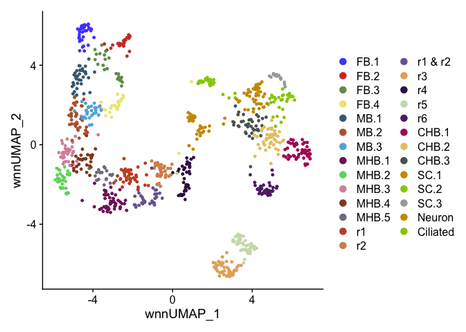
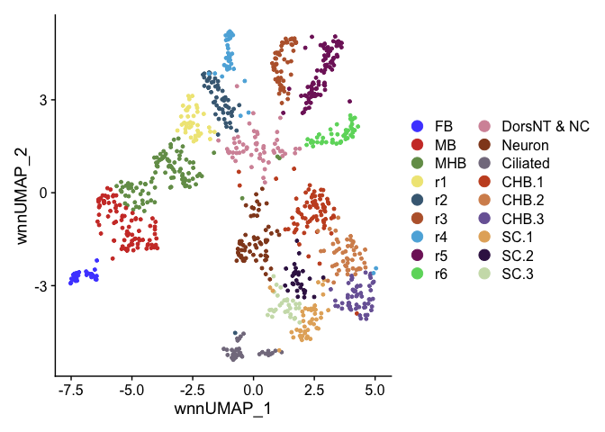
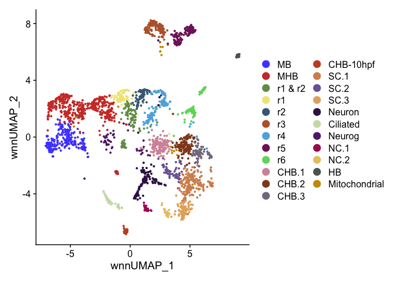

R Figure 2
================

``` r
suppressPackageStartupMessages({
  library(Seurat)
  library(Signac)
  library(BSgenome.Drerio.UCSC.danRer11)
  library(EnhancedVolcano)
  library(ggsci)
  library(patchwork)
  library(openxlsx)
})
```

    ## Warning: package 'BSgenome' was built under R version 4.3.1

    ## Warning: package 'BiocGenerics' was built under R version 4.3.1

    ## Warning: package 'S4Vectors' was built under R version 4.3.2

    ## Warning: package 'IRanges' was built under R version 4.3.1

    ## Warning: package 'GenomeInfoDb' was built under R version 4.3.2

    ## Warning: package 'GenomicRanges' was built under R version 4.3.1

    ## Warning: package 'Biostrings' was built under R version 4.3.1

    ## Warning: package 'XVector' was built under R version 4.3.1

    ## Warning: package 'BiocIO' was built under R version 4.3.1

    ## Warning: package 'rtracklayer' was built under R version 4.3.1

    ## Warning: package 'EnhancedVolcano' was built under R version 4.3.1

# Read data

``` r
HB13 <- readRDS(file = "../data/HB13hpf_neural.RDS")
DefaultAssay(HB13) <- "SCT"
Idents(HB13) <- "Clusters"
```

``` r
HB16 <- readRDS(file = "../data/HB16hpf_neural.RDS")
DefaultAssay(HB16) <- "SCT"
Idents(HB16) <- "Clusters"
```

``` r
HB.int <- readRDS(file = "../data/int.neural.3WT.subset.RDS")
DefaultAssay(HB.int) <- "SCT"
Idents(HB.int) <- "intClusters"
```

# Cluster names

## HB13hpf

Named clusters after clustering at resolution 8, needed to resolve all
rhombomeres into separate clusters.

``` r
DimPlot(HB13, reduction = "wnn.umap") + scale_color_igv()
```

<!-- --> Combining multiple
clusters of same cell type.

``` r
Idents(HB13) <- "Clusters"
HB13 <- RenameIdents(HB13,
                       "r5.1" = "r5",
                       "r5.2" = "r5",
                       "MB.1" = "MB",
                       "MB.2" = "MB",
                       "MB.3" = "MB",
                       "MHB.1" = "MHB",
                       "MHB.2" = "MHB",
                       "MHB.3" = "MHB",
                       "MHB.4" = "MHB",
                       "MHB.5" = "MHB",
                       "FB.1" = "FB",
                       "FB.2" = "FB",
                       "FB.3" = "FB",
                       "FB.4" = "FB")
```

    ## Warning: Cannot find identity r5.2

    ## Warning: Cannot find identity r5.1

``` r
levels(HB13) <- c("FB","MB","MHB","r1","r1 & r2","r2","r3","r4","r5","r6",
                    "low_expression","unknown","Neuron","Ciliated","CHB.1","CHB.2","CHB.3","SC.1","SC.2","SC.3")
umap.HB13 <- DimPlot(HB13, reduction = "wnn.umap") + scale_color_igv() + 
  guides(color = guide_legend(override.aes = list(size=4), ncol=2) )
umap.HB13
```

<!-- -->

``` r
HB13clusters <- c("CHB.1","CHB.2","CHB.3","SC.1","SC.2","SC.3")
DEgenelist.13 <- list()
for(cluster in HB13clusters){
  DEgenelist.13[[paste0("Cluster_",cluster)]] <- FindMarkers(HB13, ident.1 = cluster, only.pos = T, verbose = F)
}
write.xlsx(DEgenelist.13, file = "Markers/Fig2_HB13_cluster_DEgenes.xlsx", rowNames = T)
```

## HB16hpf

Named clusters after clustering at resolution 6, needed to resolve all
rhombomeres into separate clusters.

``` r
DimPlot(HB16, reduction = "wnn.umap") + scale_color_igv()
```

<!-- -->

Combining multiple clusters of same cell type, and renaming CHB and SC
subclusters to match HB13hpf subclusters as determined in
Match_CHB_SC_Cluster_Names.

``` r
Idents(HB16) <- "Clusters"
HB16 <- RenameIdents(HB16,
                     "CHB.1" = "oldCHB.1",
                     "CHB.2" = "oldCHB.2",
                     "CHB.3" = "oldCHB.3",
                     "CHB.4" = "oldCHB.4",
                     "SC.2" = "oldSC.2",
                     "SC.3" = "oldSC.3")
HB16 <- RenameIdents(HB16,
                       "r5.1" = "r5",
                       "r5.2" = "r5",
                       "MB.1" = "MB",
                       "MB.2" = "MB",
                       "MHB.1" = "MHB",
                       "MHB.2" = "MHB",
                       "MHB.3" = "MHB",
                     "oldCHB.1" = "CHB.3",
                     "oldCHB.2" = "CHB.1",
                     "oldCHB.3" = "CHB.2",
                     "oldCHB.4" = "CHB.1",
                     "oldSC.2" = "SC.3",
                     "oldSC.3" = "SC.2")
levels(HB16) <- c("FB","MB","MHB","r1","r2","r3","r4","r5","r6",
                    "DorsNT & NC","Neuron","Ciliated","CHB.1","CHB.2","CHB.3","CHB.4","SC.1","SC.2","SC.3")
umap.HB16 <- DimPlot(HB16, reduction = "wnn.umap") + scale_color_igv() + 
  guides(color = guide_legend(override.aes = list(size=4), ncol=2) )
umap.HB16
```

<!-- -->

``` r
HB16clusters <- c("CHB.1","CHB.2","CHB.3","SC.1","SC.2","SC.3")
DEgenelist.16 <- list()
for(cluster in HB16clusters){
  DEgenelist.16[[paste0("Cluster_",cluster)]] <- FindMarkers(HB16, ident.1 = cluster, only.pos = T, verbose = F)
}
write.xlsx(DEgenelist.16, file = "Markers/Fig2_HB16_cluster_DEgenes.xlsx", rowNames = T)
```

## HB integrated

Combining multiple clusters of same cell type and renaming SC
subclusters to match HB13hpf subclusters, but CHB subcluster types match
HB13hpf so no need to rename. See Match_CHB_SC_Cluster_Names.

``` r
Idents(HB.int) <- "intClusters"
HB.int <- RenameIdents(HB.int,
                       "SC.2" = "oldSC.2",
                       "SC.3" = "oldSC.3",
                       "SC.4" = "oldSC.4")
HB.int <- RenameIdents(HB.int,
                       "r1&r2.1" = "r1 & r2",
                       "r1&r2.2" = "r1 & r2",
                       "r3.1" = "r3",
                       "r4.1" = "r4",
                       "r4.2" = "r4",
                       "r5.1" = "r5",
                       "r5.2" = "r5",
                       "r6.1" = "r6",
                       "r6.2" = "r6",
                       "MB.1" = "MB",
                       "MB.2" = "MB",
                       "MB.3" = "MB",
                       "MHB.1" = "MHB",
                       "MHB.2" = "MHB",
                       "MHB.3" = "MHB",
                       "MHB.4" = "MHB",
                       "MHB.5" = "MHB",
                       "MHB.6" = "MHB",
                       "Neuron.1" = "Neuron",
                       "Neuron.2" = "Neuron",
                       "CaudHB.1" = "CHB.1",
                       "CaudHB.2" = "CHB.2",
                       "CaudHB.3" = "CHB.3",
                       "CaudHB.4" = "CHB-10hpf",
                       "oldSC.2" = "SC.3",
                       "oldSC.3" = "SC.2",
                       "oldSC.4" = "SC.1")
levels(HB.int) <- c("MB","MHB","r1 & r2","r1","r2","r3","r4","r5","r6",           
                  "CHB.1","CHB.2","CHB.3","CHB-10hpf","SC.1","SC.2","SC.3",
                  "Neuron","Ciliated","Neurog","NC.1","NC.2","HB","Mitochondrial")
umap.HBint <- DimPlot(HB.int, reduction = "wnn.umap") + scale_color_igv() + 
  guides(color = guide_legend(override.aes = list(size=4), ncol=2) )
umap.HBint
```

<!-- -->

``` r
HBintclusters <- c("CHB.1","CHB.2","CHB.3","CHB-10hpf","SC.1","SC.2","SC.3")
DEgenelist.int <- list()
for(cluster in HBintclusters){
  DEgenelist.int[[paste0("Cluster_",cluster)]] <- FindMarkers(HB.int, ident.1 = cluster, only.pos = T, verbose = F, recorrect_umi=F)
}
write.xlsx(DEgenelist.int, file = "Markers/Fig2_HBintegrated_cluster_DEgenes.xlsx", rowNames = T)
```

# Gene expression and chromvar activity plots

## HB13hpf

``` r
HB13.casz1 <- FeaturePlot(HB13, features = "casz1", reduction = "wnn.umap", max.cutoff = 1.3) + NoLegend()
HB13.zic2b <- FeaturePlot(HB13, features = "zic2b", reduction = "wnn.umap", max.cutoff = 1.3)
HB13.ntn1a <- FeaturePlot(HB13, features = "ntn1a", reduction = "wnn.umap", max.cutoff = 1.3) + NoLegend()
HB13.sp8a <- FeaturePlot(HB13, features = "sp8a", reduction = "wnn.umap", max.cutoff = 1.3) + NoLegend()
```

## HB16hpf

``` r
HB16.zic2b <- FeaturePlot(HB16, features = "zic2b", reduction = "wnn.umap", max.cutoff = 1.3) + NoLegend()
HB16.ntn1a <- FeaturePlot(HB16, features = "ntn1a", reduction = "wnn.umap", max.cutoff = 1.3) + NoLegend()
HB16.lbx1b <- FeaturePlot(HB16, features = "lbx1b", reduction = "wnn.umap", max.cutoff = 1.3) + NoLegend()
HB16.dbx1b <- FeaturePlot(HB16, features = "dbx1b", reduction = "wnn.umap", max.cutoff = 1.3) + NoLegend()
```

## HB integrated

``` r
HBint.zic2b <- FeaturePlot(HB.int, features = "zic2b", reduction = "wnn.umap", max.cutoff = 1.3) + NoLegend()
HBint.lbx1b <- FeaturePlot(HB.int, features = "lbx1b", reduction = "wnn.umap", max.cutoff = 1.3) + NoLegend()
HBint.dbx1b <- FeaturePlot(HB.int, features = "dbx1b", reduction = "wnn.umap", max.cutoff = 1.3) + NoLegend()
HBint.ntn1a <- FeaturePlot(HB.int, features = "ntn1a", reduction = "wnn.umap", max.cutoff = 1.3) + NoLegend()
```

# Figure 2 combined plots

``` r
layout <- "
AABC
AADE
FFGH
FFIJ
KKLM
KKNO"

combined <- umap.HB13 + HB13.casz1 + HB13.zic2b + 
  HB13.ntn1a + HB13.sp8a + 
  umap.HB16 + HB16.zic2b + HB16.ntn1a +
  HB16.lbx1b + HB16.dbx1b + 
  umap.HBint + HBint.zic2b + HBint.lbx1b +
  HBint.dbx1b + HBint.ntn1a +
  plot_layout(design = layout)
combined
```

<!-- -->

``` r
ggsave(filename = "Plots/Figure2.png", width = 15, height = 18, plot = combined)
```

``` r
sessionInfo()
```

    ## R version 4.3.0 (2023-04-21)
    ## Platform: x86_64-apple-darwin20 (64-bit)
    ## Running under: macOS Monterey 12.6.2
    ## 
    ## Matrix products: default
    ## BLAS:   /Library/Frameworks/R.framework/Versions/4.3-x86_64/Resources/lib/libRblas.0.dylib 
    ## LAPACK: /Library/Frameworks/R.framework/Versions/4.3-x86_64/Resources/lib/libRlapack.dylib;  LAPACK version 3.11.0
    ## 
    ## locale:
    ## [1] en_US.UTF-8/en_US.UTF-8/en_US.UTF-8/C/en_US.UTF-8/en_US.UTF-8
    ## 
    ## time zone: America/Denver
    ## tzcode source: internal
    ## 
    ## attached base packages:
    ## [1] stats4    stats     graphics  grDevices utils     datasets  methods  
    ## [8] base     
    ## 
    ## other attached packages:
    ##  [1] openxlsx_4.2.5.2                    patchwork_1.2.0                    
    ##  [3] ggsci_3.0.0                         EnhancedVolcano_1.20.0             
    ##  [5] ggrepel_0.9.5                       ggplot2_3.4.4                      
    ##  [7] BSgenome.Drerio.UCSC.danRer11_1.4.2 BSgenome_1.70.1                    
    ##  [9] rtracklayer_1.62.0                  BiocIO_1.12.0                      
    ## [11] Biostrings_2.70.1                   XVector_0.42.0                     
    ## [13] GenomicRanges_1.54.1                GenomeInfoDb_1.38.5                
    ## [15] IRanges_2.36.0                      S4Vectors_0.40.2                   
    ## [17] BiocGenerics_0.48.1                 Signac_1.10.0                      
    ## [19] SeuratObject_4.1.3                  Seurat_4.3.0.1                     
    ## 
    ## loaded via a namespace (and not attached):
    ##   [1] RcppAnnoy_0.0.22            splines_4.3.0              
    ##   [3] later_1.3.2                 bitops_1.0-7               
    ##   [5] tibble_3.2.1                polyclip_1.10-6            
    ##   [7] XML_3.99-0.16.1             lifecycle_1.0.4            
    ##   [9] globals_0.16.2              lattice_0.22-5             
    ##  [11] MASS_7.3-60.0.1             magrittr_2.0.3             
    ##  [13] limma_3.58.1                plotly_4.10.4              
    ##  [15] rmarkdown_2.25              yaml_2.3.8                 
    ##  [17] httpuv_1.6.13               sctransform_0.4.1          
    ##  [19] zip_2.3.1                   sp_2.1-2                   
    ##  [21] spatstat.sparse_3.0-3       reticulate_1.34.0          
    ##  [23] cowplot_1.1.3               pbapply_1.7-2              
    ##  [25] RColorBrewer_1.1-3          abind_1.4-5                
    ##  [27] zlibbioc_1.48.0             Rtsne_0.17                 
    ##  [29] purrr_1.0.2                 RCurl_1.98-1.14            
    ##  [31] GenomeInfoDbData_1.2.11     irlba_2.3.5.1              
    ##  [33] listenv_0.9.0               spatstat.utils_3.0-4       
    ##  [35] goftest_1.2-3               spatstat.random_3.2-2      
    ##  [37] fitdistrplus_1.1-11         parallelly_1.36.0          
    ##  [39] leiden_0.4.3.1              codetools_0.2-19           
    ##  [41] DelayedArray_0.28.0         RcppRoll_0.3.0             
    ##  [43] tidyselect_1.2.0            farver_2.1.1               
    ##  [45] matrixStats_1.2.0           spatstat.explore_3.2-5     
    ##  [47] GenomicAlignments_1.38.2    jsonlite_1.8.8             
    ##  [49] ellipsis_0.3.2              progressr_0.14.0           
    ##  [51] ggridges_0.5.6              survival_3.5-7             
    ##  [53] systemfonts_1.0.6           tools_4.3.0                
    ##  [55] ragg_1.3.0                  ica_1.0-3                  
    ##  [57] Rcpp_1.0.12                 glue_1.7.0                 
    ##  [59] gridExtra_2.3               SparseArray_1.2.3          
    ##  [61] xfun_0.41                   MatrixGenerics_1.14.0      
    ##  [63] dplyr_1.1.4                 withr_3.0.0                
    ##  [65] fastmap_1.1.1               fansi_1.0.6                
    ##  [67] digest_0.6.34               R6_2.5.1                   
    ##  [69] mime_0.12                   textshaping_0.3.7          
    ##  [71] colorspace_2.1-0            scattermore_1.2            
    ##  [73] tensor_1.5                  spatstat.data_3.0-4        
    ##  [75] utf8_1.2.4                  tidyr_1.3.1                
    ##  [77] generics_0.1.3              data.table_1.14.10         
    ##  [79] httr_1.4.7                  htmlwidgets_1.6.4          
    ##  [81] S4Arrays_1.2.0              uwot_0.1.16                
    ##  [83] pkgconfig_2.0.3             gtable_0.3.4               
    ##  [85] lmtest_0.9-40               htmltools_0.5.7            
    ##  [87] scales_1.3.0                Biobase_2.62.0             
    ##  [89] png_0.1-8                   knitr_1.45                 
    ##  [91] rstudioapi_0.15.0           reshape2_1.4.4             
    ##  [93] rjson_0.2.21                nlme_3.1-164               
    ##  [95] zoo_1.8-12                  stringr_1.5.1              
    ##  [97] KernSmooth_2.23-22          parallel_4.3.0             
    ##  [99] miniUI_0.1.1.1              restfulr_0.0.15            
    ## [101] pillar_1.9.0                grid_4.3.0                 
    ## [103] vctrs_0.6.5                 RANN_2.6.1                 
    ## [105] promises_1.2.1              xtable_1.8-4               
    ## [107] cluster_2.1.6               evaluate_0.23              
    ## [109] cli_3.6.2                   compiler_4.3.0             
    ## [111] Rsamtools_2.18.0            rlang_1.1.3                
    ## [113] crayon_1.5.2                future.apply_1.11.1        
    ## [115] labeling_0.4.3              plyr_1.8.9                 
    ## [117] stringi_1.8.3               viridisLite_0.4.2          
    ## [119] deldir_2.0-2                BiocParallel_1.36.0        
    ## [121] munsell_0.5.0               lazyeval_0.2.2             
    ## [123] spatstat.geom_3.2-7         Matrix_1.6-5               
    ## [125] future_1.33.1               statmod_1.5.0              
    ## [127] shiny_1.8.0                 SummarizedExperiment_1.32.0
    ## [129] highr_0.10                  ROCR_1.0-11                
    ## [131] igraph_1.6.0                fastmatch_1.1-4
