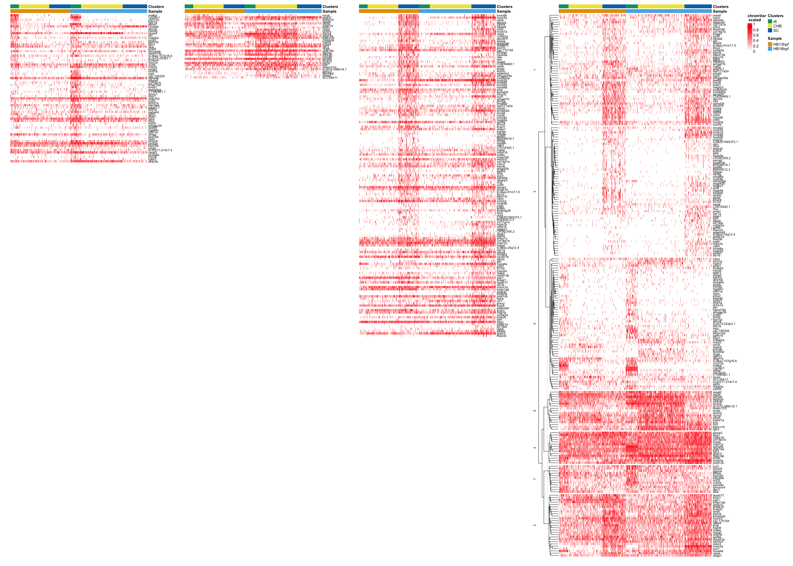

R Figure 4
================

# 1 libraries

``` r
suppressPackageStartupMessages({
  library(Seurat)
  library(Signac)
  library(dplyr)
  library(ggplot2)
  library(ggsci)
  library(patchwork)
  library(dittoSeq)
  library(ComplexHeatmap)
})
options(future.globals.maxSize = 4000 * 1024^2)
```

# 2 read data

``` r
HB16hpf <- readRDS("~/Documents/Projects/Sagerstrom/scRNA-seq_ATAC-seq_reanalysis_2021_07_12/Integratation/IntegrationOfIndependentNeuralSubsets/RDSfiles/HB16hpf.neural.int_peaks.assay.RDS")
HB13hpf <- readRDS("~/Documents/Projects/Sagerstrom/scRNA-seq_ATAC-seq_reanalysis_2021_07_12/Integratation/IntegrationOfIndependentNeuralSubsets/RDSfiles/HB13hpf.neural.int_peaks.assay.RDS")
```

``` r
DefaultAssay(HB13hpf) <- "chromvar"
DefaultAssay(HB16hpf) <- "chromvar"
HB13hpf@assays[["ATAC"]] <- NULL
HB13hpf@assays[["int_peaks"]] <- NULL
HB16hpf@assays[["ATAC"]] <- NULL
HB16hpf@assays[["int_peaks"]] <- NULL
```

combine CaudHB clusters, SC clusters and HB16hpf r5.1 and r5.2 clusters

``` r
HB13hpf$Clusters <- as.character(HB13hpf$Clusters)
HB13hpf$Clusters[HB13hpf$Clusters %in% c("SC.1","SC.2","SC.3")] <- "SC"
HB13hpf$Clusters[HB13hpf$Clusters %in% c("CaudHB.1","CaudHB.2","CaudHB.3")] <- "CHB"
HB13hpf$Clusters <- as.factor(HB13hpf$Clusters)

HB16hpf$Clusters <- as.character(HB16hpf$Clusters)
HB16hpf$Clusters[HB16hpf$Clusters %in% c("r5.1","r5.2")] <- "r5"
HB16hpf$Clusters[HB16hpf$Clusters %in% c("SC.1","SC.2","SC.3")] <- "SC"
HB16hpf$Clusters[HB16hpf$Clusters %in% c("CaudHB.1","CaudHB.2","CaudHB.3","CaudHB.4")] <- "CHB"
HB16hpf$Clusters <- as.factor(HB16hpf$Clusters)
```

``` r
p1 <- DimPlot(HB13hpf, reduction = "wnn.umap", group.by = "Clusters") + scale_color_igv() + ggtitle("HB13hpf")
p2 <- DimPlot(HB16hpf, reduction = "wnn.umap", group.by = "Clusters") + scale_color_igv() + ggtitle("HB16hpf")
p1 + p2 
```

<!-- -->

``` r
HB.comb <- merge(HB13hpf, HB16hpf, add.cell.ids = c("HB13hpf","HB16hpf"), project = "Merge_13_16")
```

    ## 
    ## Binding matrix rows
    ## 
    ## Binding matrix rows
    ## 
    ## Binding matrix rows
    ## 
    ## Binding matrix rows

``` r
Idents(HB.comb) <- "Clusters"
HB.comb <- subset(HB.comb, idents = c("r6","SC","CHB"))
HB.comb$Clusters <- factor(HB.comb$Clusters, levels = c("r6","CHB","SC"))
HB.comb$Sample <- HB.comb$orig.ident
cells.rhb = WhichCells(HB.comb, idents = c("r6","CHB","SC"))
```

# 3 Get DE gene lists for various clusters

## 3.1 SC from HB13hpf

``` r
DefaultAssay(HB13hpf) <- "SCT"
Idents(HB13hpf) <- "Clusters"
SC.13.markers <- FindMarkers(HB13hpf, ident.1 = "SC", ident.2 = c("CHB","r6"), only.pos = TRUE, verbose = F)  
SC.13.markers$gene <- rownames(SC.13.markers) 
sprintf("Total number of DE genes = %d",nrow(SC.13.markers))
```

    ## [1] "Total number of DE genes = 344"

``` r
sprintf("Number of DE genes with p_val_adj < 0.05 = %d",nrow(SC.13.markers[SC.13.markers$p_val_adj < 0.05,]))
```

    ## [1] "Number of DE genes with p_val_adj < 0.05 = 89"

## 3.2 CHB from HB13hpf

``` r
CHB.13.markers <- FindMarkers(HB13hpf, ident.1 = "CHB", ident.2 = c("SC","r6"), only.pos = TRUE, verbose = F)  
CHB.13.markers$gene <- rownames(CHB.13.markers) 
sprintf("Total number of DE genes = %d",nrow(CHB.13.markers))
```

    ## [1] "Total number of DE genes = 134"

``` r
sprintf("Number of DE genes with p_val_adj < 0.05 = %d",nrow(CHB.13.markers[CHB.13.markers$p_val_adj < 0.05,]))
```

    ## [1] "Number of DE genes with p_val_adj < 0.05 = 7"

## 3.3 r6 from HB13hpf

``` r
r6.13.markers <- FindMarkers(HB13hpf, ident.1 = "r6", ident.2 = c("SC","CHB"), only.pos = TRUE, verbose = F)   
r6.13.markers$gene <- rownames(r6.13.markers) 
sprintf("Total number of DE genes = %d",nrow(r6.13.markers))
```

    ## [1] "Total number of DE genes = 344"

``` r
sprintf("Number of DE genes with p_val_adj < 0.05 = %d",nrow(r6.13.markers[r6.13.markers$p_val_adj < 0.05,]))
```

    ## [1] "Number of DE genes with p_val_adj < 0.05 = 25"

## 3.4 SC from HB16hpf

``` r
DefaultAssay(HB16hpf) <- "SCT"
Idents(HB16hpf) <- "Clusters"
SC.16.markers <- FindMarkers(HB16hpf, ident.1 = "SC", ident.2 = c("CHB","r6"), only.pos = TRUE, verbose = F)   
SC.16.markers$gene <- rownames(SC.16.markers) 
sprintf("Total number of DE genes = %d",nrow(SC.16.markers))
```

    ## [1] "Total number of DE genes = 254"

``` r
sprintf("Number of DE genes with p_val_adj < 0.05 = %d",nrow(SC.16.markers[SC.16.markers$p_val_adj < 0.05,]))
```

    ## [1] "Number of DE genes with p_val_adj < 0.05 = 105"

## 3.5 CHB from HB16hpf

``` r
CHB.16.markers <- FindMarkers(HB16hpf, ident.1 = "CHB", ident.2 = c("SC","r6"), only.pos = TRUE, verbose = F)   
CHB.16.markers$gene <- rownames(CHB.16.markers) 
sprintf("Total number of DE genes = %d",nrow(CHB.16.markers))
```

    ## [1] "Total number of DE genes = 124"

``` r
sprintf("Number of DE genes with p_val_adj < 0.05 = %d",nrow(CHB.16.markers[CHB.16.markers$p_val_adj < 0.05,]))
```

    ## [1] "Number of DE genes with p_val_adj < 0.05 = 25"

## 3.6 r6 from HB16hpf

``` r
r6.16.markers <- FindMarkers(HB16hpf, ident.1 = "r6", ident.2 = c("SC","CHB"), only.pos = TRUE, verbose = F)   
r6.16.markers$gene <- rownames(r6.16.markers) 
sprintf("Total number of DE genes = %d",nrow(r6.16.markers))
```

    ## [1] "Total number of DE genes = 335"

``` r
sprintf("Number of DE genes with p_val_adj < 0.05 = %d",nrow(r6.16.markers[r6.16.markers$p_val_adj < 0.05,]))
```

    ## [1] "Number of DE genes with p_val_adj < 0.05 = 50"

# 4. Heatmaps

``` r
hm_list <- list()
```

## 4.1 SC DE genes

``` r
SCgenes <- unique(c(SC.13.markers$gene[SC.13.markers$p_val_adj <0.05], SC.16.markers$gene[SC.16.markers$p_val_adj <0.05]))
DefaultAssay(HB.comb) <- "SCT"
hm_SC <- dittoHeatmap(HB.comb, 
                             genes = SCgenes, 
                             cells = cells.rhb, 
                             assay = "SCT", #slot = "data", 
                             annot.by = c("Sample","Clusters"), 
                             order.by = c("Sample","Clusters"), 
                             scaled.to.max = T, 
                             show_rownames = T,
                             cluster_rows = F,
                             drop_levels = T,
                      complex = T)
hm_SC@row_names_param[["gp"]][["fontsize"]] = 8
hm_SC
```

<!-- -->

``` r
hm_list[["SC"]] <- hm_SC %>%
  draw(show_heatmap_legend = F, show_annotation_legend = F) %>%
  grid.grabExpr()
```

``` r
png(filename = "Plots/SC_heatmap_HB13_HB16.png", width=7,height=12.03,units="in",res=1200)
hm_SC <- dittoHeatmap(HB.comb, 
                      genes = SCgenes, 
                      cells = cells.rhb, 
                      assay = "SCT", #slot = "data", 
                      annot.by = c("Sample","Clusters"), 
                      order.by = c("Sample","Clusters"), 
                      scaled.to.max = T, 
                      show_rownames = T,
                      cluster_rows = F,
                      drop_levels = T,
                      complex = T)
hm_SC@row_names_param[["gp"]][["fontsize"]] = 8
hm_SC
dev.off()
```

    ## quartz_off_screen 
    ##                 2

## 4.2 CHB DE genes

``` r
CHBgenes <- unique(c(CHB.13.markers$gene[CHB.13.markers$p_val_adj <0.05],
                     CHB.16.markers$gene[CHB.16.markers$p_val_adj <0.05]))
DefaultAssay(HB.comb) <- "SCT"
hm_CHB <- dittoHeatmap(HB.comb, 
                             genes = CHBgenes, 
                             cells = cells.rhb, 
                             assay = "SCT", #slot = "data", 
                             annot.by = c("Sample","Clusters"), 
                             order.by = c("Sample","Clusters"), 
                             scaled.to.max = T, 
                             show_rownames = T,
                             cluster_rows = F,
                             drop_levels = T,
                       complex = T)
hm_CHB@row_names_param[["gp"]][["fontsize"]] = 8
hm_CHB
```

<!-- -->

``` r
hm_list[["CHB"]] <- hm_CHB %>%
  draw(show_heatmap_legend = F, show_annotation_legend = F) %>%
  grid.grabExpr()
```

``` r
png(filename = "Plots/CHB_heatmap_HB13_HB16.png", width=7,height=2.68,units="in",res=1200)
hm_CHB <- dittoHeatmap(HB.comb, 
                       genes = CHBgenes, 
                       cells = cells.rhb, 
                       assay = "SCT", #slot = "data", 
                       annot.by = c("Sample","Clusters"), 
                       order.by = c("Sample","Clusters"), 
                       scaled.to.max = T, 
                       show_rownames = T,
                       cluster_rows = F,
                       drop_levels = T,
                       complex = T)
hm_CHB@row_names_param[["gp"]][["fontsize"]] = 8
hm_CHB
dev.off()
```

    ## quartz_off_screen 
    ##                 2

## 4.3 r6 DE genes

``` r
r6genes <- unique(c(r6.13.markers$gene[r6.13.markers$p_val_adj <0.05], r6.16.markers$gene[r6.16.markers$p_val_adj <0.05]))
DefaultAssay(HB.comb) <- "SCT"
hm_r6 <- dittoHeatmap(HB.comb,
                             genes = r6genes,
                             cells = cells.rhb,
                             assay = "SCT", #slot = "data",
                             annot.by = c("Sample","Clusters"),
                             order.by = c("Sample","Clusters"),
                             scaled.to.max = T,
                             show_rownames = T,
                             cluster_rows = F,
                      complex = T)
hm_r6@row_names_param[["gp"]][["fontsize"]] = 8
hm_r6
```

<!-- -->

``` r
hm_list[["r6"]] <- hm_r6 %>%
  draw(show_heatmap_legend = F, show_annotation_legend = F) %>%
  grid.grabExpr()
```

``` r
png(filename = "Plots/r6_heatmap_HB13_HB16.png", width=7,height=5.71,units="in",res=1200)
hm_r6 <- dittoHeatmap(HB.comb,
                      genes = r6genes,
                      cells = cells.rhb,
                      assay = "SCT", #slot = "data",
                      annot.by = c("Sample","Clusters"),
                      order.by = c("Sample","Clusters"),
                      scaled.to.max = T,
                      show_rownames = T,
                      cluster_rows = F,
                      complex = T)
hm_r6@row_names_param[["gp"]][["fontsize"]] = 8
hm_r6
dev.off()
```

    ## quartz_off_screen 
    ##                 2

## 4.4 all SC, CHB, r6 DE genes together

``` r
allgenes <- unique(c(SC.13.markers$gene[SC.13.markers$p_val_adj <0.05], 
                     SC.16.markers$gene[SC.16.markers$p_val_adj <0.05],
                     CHB.13.markers$gene[CHB.13.markers$p_val_adj <0.05],
                     CHB.16.markers$gene[CHB.16.markers$p_val_adj <0.05],
                     r6.13.markers$gene[r6.13.markers$p_val_adj <0.05],
                     r6.16.markers$gene[r6.16.markers$p_val_adj <0.05]))
```

``` r
DefaultAssay(HB.comb) <- "SCT"
comb_heatmap <- dittoHeatmap(HB.comb, 
                             genes = allgenes, 
                             cells = cells.rhb, 
                             assay = "SCT", #slot = "data", 
                             annot.by = c("Sample","Clusters"), 
                             order.by = c("Sample","Clusters"), 
                             scaled.to.max = T, 
                             show_rownames = F,
                             clustering_method = "ward.D2")
```

<!-- -->

Use h=14 clustering of genes

``` r
as.data.frame(sort(cutree(comb_heatmap$tree_row, h=14)))
```

    ##                  sort(cutree(comb_heatmap$tree_row, h = 14))
    ## hoxc6b                                                     1
    ## cdx4                                                       1
    ## tanc2a                                                     1
    ## XKR4                                                       1
    ## ldlrad2                                                    1
    ## mllt3                                                      1
    ## col5a2a                                                    1
    ## apcdd1l                                                    1
    ## aopep                                                      1
    ## dnmt3ab                                                    1
    ## RIMBP2                                                     1
    ## nfia                                                       1
    ## nradd                                                      1
    ## CU639469.1                                                 1
    ## adamts3                                                    1
    ## arhgap29a                                                  1
    ## col28a2a                                                   1
    ## hoxd3a                                                     1
    ## spred2b                                                    1
    ## arhgef10                                                   1
    ## fam171a2a                                                  1
    ## pdzd2                                                      1
    ## ece2b                                                      1
    ## nrp2b                                                      1
    ## bcar3                                                      1
    ## madd                                                       1
    ## tnfrsf19                                                   1
    ## col14a1a                                                   1
    ## dachb                                                      1
    ## sox5                                                       1
    ## epha4a                                                     1
    ## rasgrp3                                                    1
    ## oc90                                                       1
    ## si:dkey-91m11.5                                            1
    ## bicc2                                                      1
    ## ptprz1b                                                    1
    ## pcdh2g28                                                   1
    ## col11a1a                                                   1
    ## ptprfa                                                     1
    ## abr                                                        1
    ## p3h2                                                       1
    ## map2                                                       1
    ## stard13b                                                   1
    ## tinagl1                                                    1
    ## hpca                                                       1
    ## itgb4                                                      1
    ## pax6b                                                      1
    ## adgrl3.1                                                   1
    ## hoxc3a                                                     2
    ## raraa                                                      2
    ## pkd1b                                                      2
    ## zgc:110158                                                 2
    ## wnt4                                                       2
    ## phip                                                       2
    ## evx1                                                       2
    ## prickle2b                                                  2
    ## igsf9a                                                     2
    ## ehbp1                                                      2
    ## mdka                                                       2
    ## serinc5                                                    2
    ## robo3                                                      2
    ## kaznb                                                      2
    ## phldb1b                                                    2
    ## notch3                                                     2
    ## antxr1c                                                    2
    ## hspg2                                                      2
    ## ssbp4                                                      2
    ## nectin1b                                                   2
    ## hoxa4a                                                     2
    ## yap1                                                       2
    ## tspan17                                                    2
    ## bmpr1ab                                                    2
    ## bcar1                                                      2
    ## nhsl1b                                                     2
    ## brsk2b                                                     2
    ## hoxb7a                                                     3
    ## kif26ab                                                    3
    ## hoxb9a                                                     3
    ## stm                                                        3
    ## plod2                                                      3
    ## arid3c                                                     3
    ## hoxb6b                                                     3
    ## hoxa9a                                                     3
    ## tcirg1b                                                    3
    ## phc2a                                                      3
    ## megf6b                                                     3
    ## hoxc8a                                                     3
    ## hoxb6a                                                     3
    ## kcnn3                                                      3
    ## esrrga                                                     3
    ## ly6pge                                                     3
    ## ppfia3                                                     3
    ## BX936418.1                                                 3
    ## rdh8a                                                      3
    ## lypd6b                                                     3
    ## cdkl1                                                      3
    ## LO018340.1                                                 3
    ## hoxa10b                                                    3
    ## angptl2b                                                   3
    ## itih6                                                      3
    ## rhoj                                                       3
    ## hoxb5b                                                     3
    ## pxdn                                                       3
    ## gdf6b                                                      3
    ## etv4                                                       3
    ## chrd                                                       3
    ## CABZ01060373.1                                             3
    ## BX640512.3                                                 3
    ## hoxb1b                                                     3
    ## nr6a1b                                                     3
    ## ralgps1                                                    3
    ## CR382300.2                                                 3
    ## skap1                                                      3
    ## si:dkey-25g12.4                                            3
    ## npr1a                                                      3
    ## necab2                                                     3
    ## dip2a                                                      3
    ## il17rd                                                     3
    ## mecom                                                      3
    ## stx1b                                                      3
    ## adgrd2                                                     3
    ## hoxb5a                                                     3
    ## prex2                                                      3
    ## adamts9                                                    3
    ## col5a3a                                                    3
    ## kdrl                                                       3
    ## phldb1a                                                    3
    ## kif13bb                                                    3
    ## thbs3b                                                     3
    ## sema3ga                                                    3
    ## rarga                                                      3
    ## hoxb3a                                                     4
    ## plxna3                                                     4
    ## col18a1a                                                   4
    ## macf1a                                                     4
    ## notch1b                                                    4
    ## jmjd1cb                                                    4
    ## foxp4                                                      4
    ## dag1                                                       4
    ## greb1l                                                     4
    ## zbtb16b                                                    4
    ## nr2f5                                                      4
    ## epha4b                                                     4
    ## zbtb16a                                                    4
    ## fgfr2                                                      4
    ## cdon                                                       5
    ## rorcb                                                      5
    ## dusp4                                                      5
    ## adgrl1a                                                    5
    ## mycn                                                       5
    ## crabp2a                                                    5
    ## nxph3                                                      5
    ## rxrgb                                                      5
    ## prkcdb                                                     5
    ## bicd1a                                                     5
    ## igdcc3                                                     5
    ## fam49al                                                    5
    ## meis3                                                      5
    ## SLC39A11                                                   5
    ## mafba                                                      5
    ## cyp26c1                                                    5
    ## cxcl12a                                                    5
    ## fgfrl1a                                                    5
    ## epha7                                                      5
    ## abcc8                                                      5
    ## csmd2                                                      5
    ## ptn                                                        5
    ## magi2a                                                     5
    ## prox2                                                      5
    ## palm1b                                                     5
    ## prdx6                                                      5
    ## samd10b                                                    5
    ## si:dkey-157g16.6                                           5
    ## si:ch73-252p3.1                                            5
    ## hoxb2a                                                     5
    ## fscn1a                                                     5
    ## mmp2                                                       5
    ## nhsl1a                                                     5
    ## mpz                                                        5
    ## zgc:158328                                                 5
    ## adgrg6                                                     5
    ## col15a1b                                                   5
    ## bmpr1ba                                                    5
    ## emid1                                                      5
    ## CT990561.1                                                 5
    ## smoc1                                                      5
    ## sfxn1                                                      5
    ## dchs1a                                                     5
    ## kif21b                                                     5
    ## igf2b                                                      5
    ## efnb1                                                      5
    ## lmf2b                                                      5
    ## arhgap39                                                   5
    ## zeb2b                                                      5
    ## mgat4c                                                     5
    ## olfm1a                                                     5
    ## wnt7bb                                                     5
    ## nppc                                                       5
    ## si:ch211-214c7.4                                           5
    ## slc4a4a                                                    5
    ## hcn2b                                                      5
    ## tgfbr3                                                     5
    ## ror1                                                       6
    ## hs6st1a                                                    6
    ## zfhx4                                                      6
    ## rxraa                                                      6
    ## tenm3                                                      6
    ## tenm4                                                      6
    ## adgrl2a                                                    6
    ## bahcc1b                                                    6
    ## ncoa3                                                      6
    ## fgfr3                                                      6
    ## efnb3b                                                     6
    ## jarid2b                                                    6
    ## jag2b                                                      6
    ## boc                                                        6
    ## tmem131l                                                   6
    ## si:ch73-386h18.1                                           6
    ## rasal2                                                     6
    ## ptprna                                                     7
    ## dbn1                                                       7
    ## skia                                                       7
    ## shroom4                                                    7
    ## nck2a                                                      7
    ## nr2f2                                                      7
    ## kdm5bb                                                     7
    ## sema4c                                                     7
    ## tox3                                                       7
    ## dtnba                                                      7
    ## kirrel3l                                                   7
    ## bach2b                                                     7

``` r
comb.split = data.frame(cutree(comb_heatmap$tree_row, h=14)) %>%
  dplyr::rename("hm_cluster" = 1) 
```

``` r
hm_all <- dittoHeatmap(HB.comb, genes = allgenes,
             cells = cells.rhb, assay = "SCT", slot = "data",
             annot.by = c("Sample","Clusters"), order.by = c("Sample","Clusters"), scaled.to.max = T, show_rownames = T,
             row_split = comb.split,complex = T,name = "chromVar\n scaled",row_title_gp = gpar(fontsize = 8),
             height = 39*unit(5, "mm"))
```

    ## Warning: argument `height` is not supported in pheatmap -> Heatmap translation,
    ## skip it.

``` r
hm_all@row_names_param[["gp"]][["fontsize"]] = 8
hm_all
```

<!-- -->

``` r
hm_list[["all"]] <- hm_all %>%
  draw(align_heatmap_legend = "heatmap_top") %>%
  grid.grabExpr()
```

``` r
png(filename = "Plots/SC_CHB_r6_heatmap_HB13_HB16.png", width=7,height=20,units="in",res=1200)
hm_all <- dittoHeatmap(HB.comb, genes = allgenes,
             cells = cells.rhb, assay = "SCT", slot = "data",
             annot.by = c("Sample","Clusters"), order.by = c("Sample","Clusters"), scaled.to.max = T, show_rownames = T,
             row_split = comb.split,complex = T,name = "chromVar\n scaled",row_title_gp = gpar(fontsize = 6),
             height = 39*unit(5, "mm"))
```

    ## Warning: argument `height` is not supported in pheatmap -> Heatmap translation,
    ## skip it.

``` r
hm_all@row_names_param[["gp"]][["fontsize"]] = 8
hm_all
dev.off()
```

    ## quartz_off_screen 
    ##                 2

``` r
#wrap_plots(hm_list, ncol = 4, heights = c(4.48,1,2.13,7.45))
p1 <- wrap_plots(hm_list[["SC"]]) / plot_spacer() + plot_layout(heights = c(4.48,2.97))
p2 <- wrap_plots(hm_list[["CHB"]]) / plot_spacer() + plot_layout(heights = c(1,6.45))
p3 <- wrap_plots(hm_list[["r6"]]) / plot_spacer() + plot_layout(heights = c(2.13,5.32))
p4 <- wrap_plots(hm_list[["all"]]) / plot_spacer() + plot_layout(heights = c(7.45,0.01))
plot_spacer() +  p1 + p2 + p3 + p4 + plot_layout(ncol = 5, widths = c(0.01,1,1,1,1.5), guides = 'collect')
```

<!-- -->

``` r
#p2 + p3 + plot_layout(ncol = 2)
```

``` r
HB13.vp <- readRDS(file = "../VolcanoPlots/Plots/HB13_volcanoPlots.RDS")
HB16.vp <- readRDS(file = "../VolcanoPlots/Plots/HB16_volcanoPlots.RDS")
```

``` r
p1 <- wrap_plots(hm_list[["SC"]]) / plot_spacer() + plot_layout(heights = c(4.48,0.01))
p2 <- wrap_plots(hm_list[["CHB"]]) / plot_spacer() + plot_layout(heights = c(1,3.48))
p3 <- wrap_plots(hm_list[["r6"]]) / plot_spacer() + plot_layout(heights = c(2.13,2.35))
p4 <- wrap_plots(hm_list[["all"]]) / plot_spacer() + plot_layout(heights = c(7.45,0.01))

layout = "
ABCDE
AFFFE
AGGGE"

combined_plot <- plot_spacer() + p1 + p2 + p3 + p4 + HB13.vp + HB16.vp + plot_layout(design = layout, heights = c(4.48,1.48,1.48), widths = c(0.01,1,1.1,0.7,1.6))
combined_plot
```

<!-- -->

``` r
ggsave(filename = "Plots/Figure4.png", width = 28, height = 30, plot = combined_plot)
```

``` r
sessionInfo()
```

    ## R version 4.2.3 (2023-03-15)
    ## Platform: aarch64-apple-darwin20 (64-bit)
    ## Running under: macOS Monterey 12.6.2
    ## 
    ## Matrix products: default
    ## BLAS:   /Library/Frameworks/R.framework/Versions/4.2-arm64/Resources/lib/libRblas.0.dylib
    ## LAPACK: /Library/Frameworks/R.framework/Versions/4.2-arm64/Resources/lib/libRlapack.dylib
    ## 
    ## locale:
    ## [1] en_US.UTF-8/en_US.UTF-8/en_US.UTF-8/C/en_US.UTF-8/en_US.UTF-8
    ## 
    ## attached base packages:
    ## [1] grid      stats     graphics  grDevices utils     datasets  methods  
    ## [8] base     
    ## 
    ## other attached packages:
    ## [1] ComplexHeatmap_2.14.0 dittoSeq_1.10.0       patchwork_1.1.2      
    ## [4] ggsci_3.0.0           ggplot2_3.4.2         dplyr_1.1.2          
    ## [7] Signac_1.10.0         SeuratObject_4.1.3    Seurat_4.3.0.1       
    ## 
    ## loaded via a namespace (and not attached):
    ##   [1] circlize_0.4.15             fastmatch_1.1-3            
    ##   [3] systemfonts_1.0.4           plyr_1.8.8                 
    ##   [5] igraph_1.4.2                lazyeval_0.2.2             
    ##   [7] sp_1.6-0                    splines_4.2.3              
    ##   [9] BiocParallel_1.32.6         listenv_0.9.0              
    ##  [11] scattermore_1.0             GenomeInfoDb_1.34.9        
    ##  [13] digest_0.6.31               foreach_1.5.2              
    ##  [15] htmltools_0.5.5             fansi_1.0.4                
    ##  [17] magrittr_2.0.3              doParallel_1.0.17          
    ##  [19] tensor_1.5                  cluster_2.1.4              
    ##  [21] ROCR_1.0-11                 limma_3.54.2               
    ##  [23] globals_0.16.2              Biostrings_2.66.0          
    ##  [25] matrixStats_0.63.0          spatstat.sparse_3.0-1      
    ##  [27] colorspace_2.1-0            ggrepel_0.9.3              
    ##  [29] textshaping_0.3.6           xfun_0.39                  
    ##  [31] crayon_1.5.2                RCurl_1.98-1.12            
    ##  [33] jsonlite_1.8.4              progressr_0.13.0           
    ##  [35] spatstat.data_3.0-1         iterators_1.0.14           
    ##  [37] survival_3.5-5              zoo_1.8-12                 
    ##  [39] glue_1.6.2                  polyclip_1.10-4            
    ##  [41] gtable_0.3.3                zlibbioc_1.44.0            
    ##  [43] XVector_0.38.0              leiden_0.4.3               
    ##  [45] GetoptLong_1.0.5            DelayedArray_0.24.0        
    ##  [47] shape_1.4.6                 future.apply_1.10.0        
    ##  [49] SingleCellExperiment_1.20.1 BiocGenerics_0.44.0        
    ##  [51] abind_1.4-5                 scales_1.2.1               
    ##  [53] pheatmap_1.0.12             spatstat.random_3.1-4      
    ##  [55] miniUI_0.1.1.1              Rcpp_1.0.10                
    ##  [57] viridisLite_0.4.2           xtable_1.8-4               
    ##  [59] clue_0.3-64                 reticulate_1.28            
    ##  [61] stats4_4.2.3                htmlwidgets_1.6.2          
    ##  [63] httr_1.4.6                  RColorBrewer_1.1-3         
    ##  [65] ellipsis_0.3.2              ica_1.0-3                  
    ##  [67] farver_2.1.1                pkgconfig_2.0.3            
    ##  [69] uwot_0.1.14                 deldir_1.0-6               
    ##  [71] utf8_1.2.3                  labeling_0.4.2             
    ##  [73] tidyselect_1.2.0            rlang_1.1.1                
    ##  [75] reshape2_1.4.4              later_1.3.1                
    ##  [77] munsell_0.5.0               tools_4.2.3                
    ##  [79] cli_3.6.1                   generics_0.1.3             
    ##  [81] ggridges_0.5.4              evaluate_0.21              
    ##  [83] stringr_1.5.0               fastmap_1.1.1              
    ##  [85] ragg_1.2.5                  yaml_2.3.7                 
    ##  [87] goftest_1.2-3               knitr_1.42                 
    ##  [89] fitdistrplus_1.1-11         purrr_1.0.1                
    ##  [91] RANN_2.6.1                  pbapply_1.7-0              
    ##  [93] future_1.32.0               nlme_3.1-162               
    ##  [95] mime_0.12                   RcppRoll_0.3.0             
    ##  [97] compiler_4.2.3              rstudioapi_0.14            
    ##  [99] plotly_4.10.1               png_0.1-8                  
    ## [101] spatstat.utils_3.0-2        tibble_3.2.1               
    ## [103] stringi_1.7.12              highr_0.10                 
    ## [105] lattice_0.21-8              Matrix_1.6-1.1             
    ## [107] vctrs_0.6.2                 pillar_1.9.0               
    ## [109] lifecycle_1.0.3             GlobalOptions_0.1.2        
    ## [111] spatstat.geom_3.1-0         lmtest_0.9-40              
    ## [113] RcppAnnoy_0.0.20            data.table_1.14.8          
    ## [115] cowplot_1.1.1               bitops_1.0-7               
    ## [117] irlba_2.3.5.1               httpuv_1.6.9               
    ## [119] GenomicRanges_1.50.2        R6_2.5.1                   
    ## [121] promises_1.2.0.1            KernSmooth_2.23-21         
    ## [123] gridExtra_2.3               IRanges_2.32.0             
    ## [125] parallelly_1.35.0           codetools_0.2-19           
    ## [127] MASS_7.3-60                 SummarizedExperiment_1.28.0
    ## [129] rjson_0.2.21                withr_2.5.0                
    ## [131] sctransform_0.3.5           Rsamtools_2.14.0           
    ## [133] EnhancedVolcano_1.16.0      S4Vectors_0.36.2           
    ## [135] GenomeInfoDbData_1.2.9      parallel_4.2.3             
    ## [137] tidyr_1.3.0                 rmarkdown_2.21             
    ## [139] MatrixGenerics_1.10.0       Cairo_1.6-0                
    ## [141] Rtsne_0.16                  spatstat.explore_3.1-0     
    ## [143] Biobase_2.58.0              shiny_1.7.4
