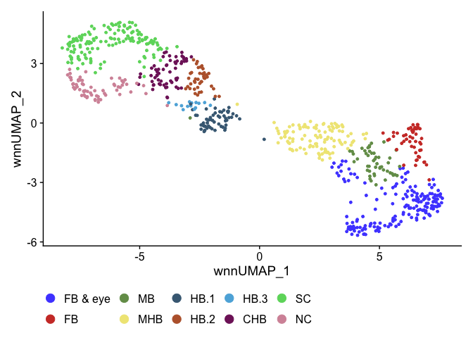

R Figure 6
================

``` r
suppressPackageStartupMessages({
  library(Seurat)
  library(Signac)
  library(BSgenome.Drerio.UCSC.danRer11)
  library(EnhancedVolcano)
  library(ggsci)
  library(patchwork)
})
```

    ## Warning: package 'BSgenome' was built under R version 4.3.1

    ## Warning: package 'BiocGenerics' was built under R version 4.3.1

    ## Warning: package 'S4Vectors' was built under R version 4.3.2

    ## Warning: package 'IRanges' was built under R version 4.3.1

    ## Warning: package 'GenomeInfoDb' was built under R version 4.3.2

    ## Warning: package 'GenomicRanges' was built under R version 4.3.1

    ## Warning: package 'Biostrings' was built under R version 4.3.1

    ## Warning: package 'XVector' was built under R version 4.3.1

    ## Warning: package 'BiocIO' was built under R version 4.3.1

    ## Warning: package 'rtracklayer' was built under R version 4.3.1

    ## Warning: package 'EnhancedVolcano' was built under R version 4.3.1

# Read data

``` r
E10 <- readRDS("../data/HB10hpf_neural.RDS")
Idents(E10) <- "Clusters"
DefaultAssay(E10) <- "SCT"
DimPlot(E10, reduction = "wnn.umap") + scale_color_igv()
```

<!-- -->

``` r
hm_all <- readRDS(file = "Plots/E10_heatmap.RDS")
```

Rename CHB and SC clusters to match HB13hpf and correct CHB.1 to SC. See
Match_CHB_SC_Cluster_Names.

``` r
Idents(E10) <- "Clusters"
E10 <- RenameIdents(E10,
                    "FB & eye.1" = "FB & eye",
                    "FB &  eye.2" = "FB & eye",
                    "FB & eye.3" = "FB & eye",
                    "FB & eye.4" = "FB & eye",
                    "FB & eye.5" = "FB & eye",
                    "FB & eye.6" = "FB & eye",
                    "FB & eye.7" = "FB & eye",
                    "FB & eye.8" = "FB & eye",
                    "FB.1" = "FB",
                    "MB.1" = "MB",
                    "MHB.1" = "MHB",
                    "MHB.2" = "MHB",
                    "MHB.3" = "MHB",
                    "CaudHB.1" = "SC",
                    "CaudHB.2" = "CHB",
                    "CaudHB.3" = "CHB",
                    "SC.1" = "SC",
                    "SC.2" = "SC",
                    "SC.3" = "SC",
                    "NC.1" = "NC",
                    "NC.2" = "NC")
levels(E10) <- c("FB & eye","FB","MB","MHB","HB.1","HB.2","HB.3","CHB","SC","NC")
umap.A <- DimPlot(E10, reduction = "wnn.umap") + scale_color_igv() + 
  guides(color = guide_legend(override.aes = list(size=4))) + 
  theme(legend.position = "bottom")
umap.A
```

<!-- --> Rename CHB and
SC clusters to match HB13hpf and correct CHB.1 to SC. See
Match_CHB_SC_Cluster_Names.

``` r
Idents(E10) <- "Clusters"
E10 <- RenameIdents(E10,
                    "SC.1" = "oldSC.1",
                    "SC.2" = "oldSC.2",
                    "SC.3" = "oldSC.3",
                    "FB.1" = "FB",
                    "MB.1" = "MB")
E10 <- RenameIdents(E10,
                    "CaudHB.1" = "SC.1a",
                    "CaudHB.2" = "CHB.1",
                    "CaudHB.3" = "CHB.2",
                    "oldSC.1" = "SC.3a",
                    "oldSC.2" = "SC.1b",
                    "oldSC.3" = "SC.3b")
levels(E10) <- c("NC.1","NC.2","SC.1a","SC.1b","SC.3a","SC.3b","CHB.1","CHB.2",
                 "HB.1","HB.2","HB.3","MHB.1","MHB.2","MHB.3","MB","FB",
                 "FB & eye.1","FB &  eye.2","FB & eye.3","FB & eye.4","FB & eye.5",
                 "FB & eye.6","FB & eye.7","FB & eye.8")
umap.B <- DimPlot(E10, reduction = "wnn.umap") + scale_color_igv() + 
  guides(color = guide_legend(override.aes = list(size=4), ncol = 5)) + 
  theme(legend.position = "bottom")
umap.B
```

<!-- -->

# Gene expression and chromvar activity plots

``` r
E10.cdx4 <- FeaturePlot(E10, features = "cdx4", reduction = "wnn.umap", 
                        max.cutoff = 1.3
                        ) 
E10.hoxb9a <- FeaturePlot(E10, features = "hoxb9a", reduction = "wnn.umap", 
                         max.cutoff = 1.3
                         ) + NoLegend()
E10.tfap2a <- FeaturePlot(E10, features = "tfap2a", reduction = "wnn.umap", 
                         max.cutoff = 1.3
                         ) + NoLegend()
E10.hnf1ba <- FeaturePlot(E10, features = "hnf1ba", reduction = "wnn.umap", 
                        max.cutoff = 1.3
                        ) + NoLegend()
E10.col7a1l <- FeaturePlot(E10, features = "col7a1l", reduction = "wnn.umap", 
                        max.cutoff = 1.3
                        ) + NoLegend()
E10.wnt7ab <- FeaturePlot(E10, features = "wnt7ab", reduction = "wnn.umap", 
                        max.cutoff = 1.3
                        ) + NoLegend()
E10.mafba <- FeaturePlot(E10, features = "mafba", reduction = "wnn.umap", 
                        max.cutoff = 1.3
                        ) + NoLegend()
E10.ntn1a <- FeaturePlot(E10, features = "ntn1a", reduction = "wnn.umap", 
                        max.cutoff = 1.3
                        ) + NoLegend()
E10.zic2b <- FeaturePlot(E10, features = "zic2b", reduction = "wnn.umap", 
                        max.cutoff = 1.3
                        ) + NoLegend()
```

``` r
#wrap_plots(list(E10.cdx4,E10.hoxb9a,E10.tfap2a,E10.hnf1ba,E10.col7a1l,E10.wnt7ab,E10.mafba,E10.ntn1a,E10.zic2b), guides = "collect")
```

``` r
GetChromVarPlots <- function(object, motifs, reduction, max.cutoff){
  DefaultAssay(object) <- "chromvar"
  mylist <- list()
  for(motif in 1:length(motifs)){
    p <- FeaturePlot(
      object = object,
      reduction = reduction,
      features = motifs[[motif]],
      min.cutoff = 'q10',
      max.cutoff = max.cutoff,
      pt.size = 1)  +
      ggtitle(paste(motifs[[motif]],names(motifs[motif]), sep = " ")) +
      theme(plot.title = element_text(size = 15)) + NoLegend()
    mylist[[motifs[[motif]]]] <- p
  }
  
  return(mylist)
}
```

``` r
GetChromVarPlotsPlusLegend <- function(object, motifs, reduction, max.cutoff){
  DefaultAssay(object) <- "chromvar"
  mylist <- list()
  for(motif in 1:length(motifs)){
    p <- FeaturePlot(
      object = object,
      reduction = reduction,
      features = motifs[[motif]],
      min.cutoff = 'q10',
      max.cutoff = max.cutoff,
      pt.size = 1)  +
      ggtitle(paste(motifs[[motif]],names(motifs[motif]), sep = " ")) +
      theme(plot.title = element_text(size = 15))
    mylist[[motifs[[motif]]]] <- p
  }
  
  return(mylist)
}
```

only need to run once

``` r
# E10 <- RunChromVAR(
#   object = E10,
#   genome = BSgenome.Drerio.UCSC.danRer11,
#   assay = "peaks"
# )
# saveRDS(E10, file = "../data/HB10hpf_neural.RDS")
```

``` r
motif1.names <- c("CDX4","HOXB9","TFAP2A","HNF1B","Mafb")
motifs1 <- c("MA1473.1","MA1503.1","MA0003.4","MA0153.2","MA0117.2")
names(motifs1) <- motif1.names
```

``` r
cv.motif.legend <- GetChromVarPlotsPlusLegend(E10, motifs1, "wnn.umap", 3)
cv.list <- GetChromVarPlots(E10, motifs1, "wnn.umap", 3)
wrap_plots(cv.motif.legend)
```

<!-- -->

``` r
layout <- "
AABC
AADC
EFGC
HIJC
KLMC
NNOC
NNOC
PQOC
"

combined1 <- umap.A + E10.cdx4 + hm_all + 
  cv.motif.legend[[1]] +  
  E10.hoxb9a + E10.tfap2a + E10.hnf1ba +
  cv.list[[2]] + cv.list[[3]] + cv.list[[4]] +
  E10.col7a1l + E10.wnt7ab + E10.mafba + 
  umap.B + plot_spacer() +
  E10.ntn1a + E10.zic2b +
  plot_layout(design = layout, widths = c(1,1,1,3))
combined1
```

<!-- -->

``` r
ggsave(filename = "Plots/Figure6.png", width = 15, height = 25, plot = combined1)
```

``` r
sessionInfo()
```

    ## R version 4.3.0 (2023-04-21)
    ## Platform: x86_64-apple-darwin20 (64-bit)
    ## Running under: macOS Monterey 12.6.2
    ## 
    ## Matrix products: default
    ## BLAS:   /Library/Frameworks/R.framework/Versions/4.3-x86_64/Resources/lib/libRblas.0.dylib 
    ## LAPACK: /Library/Frameworks/R.framework/Versions/4.3-x86_64/Resources/lib/libRlapack.dylib;  LAPACK version 3.11.0
    ## 
    ## locale:
    ## [1] en_US.UTF-8/en_US.UTF-8/en_US.UTF-8/C/en_US.UTF-8/en_US.UTF-8
    ## 
    ## time zone: America/Denver
    ## tzcode source: internal
    ## 
    ## attached base packages:
    ## [1] stats4    stats     graphics  grDevices utils     datasets  methods  
    ## [8] base     
    ## 
    ## other attached packages:
    ##  [1] patchwork_1.2.0                     ggsci_3.0.0                        
    ##  [3] EnhancedVolcano_1.20.0              ggrepel_0.9.5                      
    ##  [5] ggplot2_3.4.4                       BSgenome.Drerio.UCSC.danRer11_1.4.2
    ##  [7] BSgenome_1.70.1                     rtracklayer_1.62.0                 
    ##  [9] BiocIO_1.12.0                       Biostrings_2.70.1                  
    ## [11] XVector_0.42.0                      GenomicRanges_1.54.1               
    ## [13] GenomeInfoDb_1.38.5                 IRanges_2.36.0                     
    ## [15] S4Vectors_0.40.2                    BiocGenerics_0.48.1                
    ## [17] Signac_1.10.0                       SeuratObject_4.1.3                 
    ## [19] Seurat_4.3.0.1                     
    ## 
    ## loaded via a namespace (and not attached):
    ##   [1] RColorBrewer_1.1-3          rstudioapi_0.15.0          
    ##   [3] jsonlite_1.8.8              magrittr_2.0.3             
    ##   [5] spatstat.utils_3.0-4        farver_2.1.1               
    ##   [7] rmarkdown_2.25              ragg_1.3.0                 
    ##   [9] zlibbioc_1.48.0             vctrs_0.6.5                
    ##  [11] ROCR_1.0-11                 Rsamtools_2.18.0           
    ##  [13] spatstat.explore_3.2-5      RCurl_1.98-1.14            
    ##  [15] RcppRoll_0.3.0              S4Arrays_1.2.0             
    ##  [17] htmltools_0.5.7             SparseArray_1.2.3          
    ##  [19] sctransform_0.4.1           parallelly_1.36.0          
    ##  [21] KernSmooth_2.23-22          htmlwidgets_1.6.4          
    ##  [23] ica_1.0-3                   plyr_1.8.9                 
    ##  [25] plotly_4.10.4               zoo_1.8-12                 
    ##  [27] GenomicAlignments_1.38.2    igraph_1.6.0               
    ##  [29] mime_0.12                   lifecycle_1.0.4            
    ##  [31] pkgconfig_2.0.3             Matrix_1.6-5               
    ##  [33] R6_2.5.1                    fastmap_1.1.1              
    ##  [35] MatrixGenerics_1.14.0       GenomeInfoDbData_1.2.11    
    ##  [37] fitdistrplus_1.1-11         future_1.33.1              
    ##  [39] shiny_1.8.0                 digest_0.6.34              
    ##  [41] colorspace_2.1-0            tensor_1.5                 
    ##  [43] irlba_2.3.5.1               textshaping_0.3.7          
    ##  [45] labeling_0.4.3              progressr_0.14.0           
    ##  [47] fansi_1.0.6                 spatstat.sparse_3.0-3      
    ##  [49] httr_1.4.7                  polyclip_1.10-6            
    ##  [51] abind_1.4-5                 compiler_4.3.0             
    ##  [53] withr_3.0.0                 BiocParallel_1.36.0        
    ##  [55] highr_0.10                  MASS_7.3-60.0.1            
    ##  [57] DelayedArray_0.28.0         rjson_0.2.21               
    ##  [59] tools_4.3.0                 lmtest_0.9-40              
    ##  [61] httpuv_1.6.13               future.apply_1.11.1        
    ##  [63] goftest_1.2-3               glue_1.7.0                 
    ##  [65] restfulr_0.0.15             nlme_3.1-164               
    ##  [67] promises_1.2.1              grid_4.3.0                 
    ##  [69] Rtsne_0.17                  cluster_2.1.6              
    ##  [71] reshape2_1.4.4              generics_0.1.3             
    ##  [73] gtable_0.3.4                spatstat.data_3.0-4        
    ##  [75] tidyr_1.3.1                 data.table_1.14.10         
    ##  [77] sp_2.1-2                    utf8_1.2.4                 
    ##  [79] spatstat.geom_3.2-7         RcppAnnoy_0.0.22           
    ##  [81] RANN_2.6.1                  pillar_1.9.0               
    ##  [83] stringr_1.5.1               later_1.3.2                
    ##  [85] splines_4.3.0               dplyr_1.1.4                
    ##  [87] lattice_0.22-5              survival_3.5-7             
    ##  [89] deldir_2.0-2                tidyselect_1.2.0           
    ##  [91] miniUI_0.1.1.1              pbapply_1.7-2              
    ##  [93] knitr_1.45                  gridExtra_2.3              
    ##  [95] SummarizedExperiment_1.32.0 scattermore_1.2            
    ##  [97] xfun_0.41                   Biobase_2.62.0             
    ##  [99] matrixStats_1.2.0           stringi_1.8.3              
    ## [101] lazyeval_0.2.2              yaml_2.3.8                 
    ## [103] evaluate_0.23               codetools_0.2-19           
    ## [105] tibble_3.2.1                cli_3.6.2                  
    ## [107] uwot_0.1.16                 systemfonts_1.0.6          
    ## [109] xtable_1.8-4                reticulate_1.34.0          
    ## [111] munsell_0.5.0               Rcpp_1.0.12                
    ## [113] globals_0.16.2              spatstat.random_3.2-2      
    ## [115] png_0.1-8                   XML_3.99-0.16.1            
    ## [117] parallel_4.3.0              ellipsis_0.3.2             
    ## [119] bitops_1.0-7                listenv_0.9.0              
    ## [121] viridisLite_0.4.2           scales_1.3.0               
    ## [123] ggridges_0.5.6              crayon_1.5.2               
    ## [125] leiden_0.4.3.1              purrr_1.0.2                
    ## [127] rlang_1.1.3                 fastmatch_1.1-4            
    ## [129] cowplot_1.1.3
