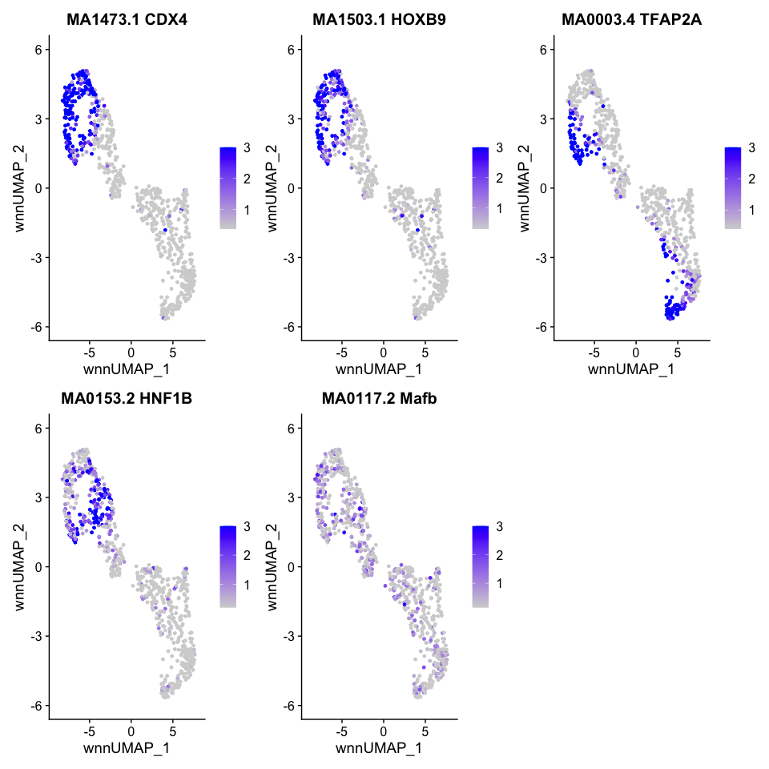

R Figure 6
================

``` r
suppressPackageStartupMessages({
  library(Seurat)
  library(Signac)
  library(BSgenome.Drerio.UCSC.danRer11)
  library(EnhancedVolcano)
  library(ggsci)
  library(patchwork)
})
```

# Read data

``` r
E10 <- readRDS("../data/HB10hpf_neural.RDS")
Idents(E10) <- "Clusters"
DefaultAssay(E10) <- "SCT"
DimPlot(E10, reduction = "wnn.umap") + scale_color_igv()
```

<!-- -->

``` r
hm_all <- readRDS(file = "Plots/E10_heatmap.RDS")
```

Rename CHB and SC clusters to match HB13hpf and correct CHB.1 to SC. See
Match_CHB_SC_Cluster_Names.

``` r
Idents(E10) <- "Clusters"
E10 <- RenameIdents(E10,
                    "FB & eye.1" = "FB & eye",
                    "FB &  eye.2" = "FB & eye",
                    "FB & eye.3" = "FB & eye",
                    "FB & eye.4" = "FB & eye",
                    "FB & eye.5" = "FB & eye",
                    "FB & eye.6" = "FB & eye",
                    "FB & eye.7" = "FB & eye",
                    "FB & eye.8" = "FB & eye",
                    "FB.1" = "FB",
                    "MB.1" = "MB",
                    "MHB.1" = "MHB",
                    "MHB.2" = "MHB",
                    "MHB.3" = "MHB",
                    "CaudHB.1" = "SC",
                    "CaudHB.2" = "CHB",
                    "CaudHB.3" = "CHB",
                    "SC.1" = "SC",
                    "SC.2" = "SC",
                    "SC.3" = "SC",
                    "NC.1" = "NC",
                    "NC.2" = "NC")
levels(E10) <- c("FB & eye","FB","MB","MHB","HB.1","HB.2","HB.3","CHB","SC","NC")
umap.A <- DimPlot(E10, reduction = "wnn.umap") + scale_color_igv() + 
  guides(color = guide_legend(override.aes = list(size=4))) + 
  theme(legend.position = "bottom")
umap.A
```

<!-- --> Rename CHB and
SC clusters to match HB13hpf and correct CHB.1 to SC. See
Match_CHB_SC_Cluster_Names.

``` r
Idents(E10) <- "Clusters"
E10 <- RenameIdents(E10,
                    "SC.1" = "oldSC.1",
                    "SC.2" = "oldSC.2",
                    "SC.3" = "oldSC.3",
                    "FB.1" = "FB",
                    "MB.1" = "MB")
E10 <- RenameIdents(E10,
                    "CaudHB.1" = "SC.1a",
                    "CaudHB.2" = "CHB.1",
                    "CaudHB.3" = "CHB.2",
                    "oldSC.1" = "SC.3a",
                    "oldSC.2" = "SC.1b",
                    "oldSC.3" = "SC.3b")
levels(E10) <- c("NC.1","NC.2","SC.1a","SC.1b","SC.3a","SC.3b","CHB.1","CHB.2",
                 "HB.1","HB.2","HB.3","MHB.1","MHB.2","MHB.3","MB","FB",
                 "FB & eye.1","FB &  eye.2","FB & eye.3","FB & eye.4","FB & eye.5",
                 "FB & eye.6","FB & eye.7","FB & eye.8")
umap.B <- DimPlot(E10, reduction = "wnn.umap") + scale_color_igv() + 
  guides(color = guide_legend(override.aes = list(size=4), ncol = 5)) + 
  theme(legend.position = "bottom")
umap.B
```

<!-- -->

# Gene expression and chromvar activity plots

``` r
E10.cdx4 <- FeaturePlot(E10, features = "cdx4", reduction = "wnn.umap", 
                        max.cutoff = 1.3
                        ) 
E10.hoxb9a <- FeaturePlot(E10, features = "hoxb9a", reduction = "wnn.umap", 
                         max.cutoff = 1.3
                         ) + NoLegend()
E10.tfap2a <- FeaturePlot(E10, features = "tfap2a", reduction = "wnn.umap", 
                         max.cutoff = 1.3
                         ) + NoLegend()
E10.hnf1ba <- FeaturePlot(E10, features = "hnf1ba", reduction = "wnn.umap", 
                        max.cutoff = 1.3
                        ) + NoLegend()
E10.col7a1l <- FeaturePlot(E10, features = "col7a1l", reduction = "wnn.umap", 
                        max.cutoff = 1.3
                        ) + NoLegend()
E10.wnt7ab <- FeaturePlot(E10, features = "wnt7ab", reduction = "wnn.umap", 
                        max.cutoff = 1.3
                        ) + NoLegend()
E10.mafba <- FeaturePlot(E10, features = "mafba", reduction = "wnn.umap", 
                        max.cutoff = 1.3
                        ) + NoLegend()
E10.ntn1a <- FeaturePlot(E10, features = "ntn1a", reduction = "wnn.umap", 
                        max.cutoff = 1.3
                        ) + NoLegend()
E10.zic2b <- FeaturePlot(E10, features = "zic2b", reduction = "wnn.umap", 
                        max.cutoff = 1.3
                        ) + NoLegend()
```

``` r
#wrap_plots(list(E10.cdx4,E10.hoxb9a,E10.tfap2a,E10.hnf1ba,E10.col7a1l,E10.wnt7ab,E10.mafba,E10.ntn1a,E10.zic2b), guides = "collect")
```

``` r
GetChromVarPlots <- function(object, motifs, reduction, max.cutoff){
  DefaultAssay(object) <- "chromvar"
  mylist <- list()
  for(motif in 1:length(motifs)){
    p <- FeaturePlot(
      object = object,
      reduction = reduction,
      features = motifs[[motif]],
      min.cutoff = 'q10',
      max.cutoff = max.cutoff,
      pt.size = 1)  +
      ggtitle(paste(motifs[[motif]],names(motifs[motif]), sep = " ")) +
      theme(plot.title = element_text(size = 15)) + NoLegend()
    mylist[[motifs[[motif]]]] <- p
  }
  
  return(mylist)
}
```

``` r
GetChromVarPlotsPlusLegend <- function(object, motifs, reduction, max.cutoff){
  DefaultAssay(object) <- "chromvar"
  mylist <- list()
  for(motif in 1:length(motifs)){
    p <- FeaturePlot(
      object = object,
      reduction = reduction,
      features = motifs[[motif]],
      min.cutoff = 'q10',
      max.cutoff = max.cutoff,
      pt.size = 1)  +
      ggtitle(paste(motifs[[motif]],names(motifs[motif]), sep = " ")) +
      theme(plot.title = element_text(size = 15))
    mylist[[motifs[[motif]]]] <- p
  }
  
  return(mylist)
}
```

only need to run once

``` r
# E10 <- RunChromVAR(
#   object = E10,
#   genome = BSgenome.Drerio.UCSC.danRer11,
#   assay = "peaks"
# )
# saveRDS(E10, file = "../data/HB10hpf_neural.RDS")
```

``` r
motif1.names <- c("CDX4","HOXB9","TFAP2A","HNF1B","Mafb")
motifs1 <- c("MA1473.1","MA1503.1","MA0003.4","MA0153.2","MA0117.2")
names(motifs1) <- motif1.names
```

``` r
cv.motif.legend <- GetChromVarPlotsPlusLegend(E10, motifs1, "wnn.umap", 3)
cv.list <- GetChromVarPlots(E10, motifs1, "wnn.umap", 3)
wrap_plots(cv.motif.legend)
```

<!-- -->

``` r
layout <- "
AABC
AADC
EFGC
HIJC
KLMC
NNOC
NNOC
PQOC
"

combined1 <- umap.A + E10.cdx4 + hm_all + 
  cv.motif.legend[[1]] +  
  E10.hoxb9a + E10.tfap2a + E10.hnf1ba +
  cv.list[[2]] + cv.list[[3]] + cv.list[[3]] +
  E10.col7a1l + E10.wnt7ab + E10.mafba + 
  umap.B + plot_spacer() +
  E10.ntn1a + E10.zic2b +
  plot_layout(design = layout, widths = c(1,1,1,3))
combined1
```

<!-- -->

``` r
ggsave(filename = "Plots/Figure6.png", width = 15, height = 25, plot = combined1)
```

``` r
sessionInfo()
```

    ## R version 4.2.3 (2023-03-15)
    ## Platform: aarch64-apple-darwin20 (64-bit)
    ## Running under: macOS Monterey 12.6.2
    ## 
    ## Matrix products: default
    ## BLAS:   /Library/Frameworks/R.framework/Versions/4.2-arm64/Resources/lib/libRblas.0.dylib
    ## LAPACK: /Library/Frameworks/R.framework/Versions/4.2-arm64/Resources/lib/libRlapack.dylib
    ## 
    ## locale:
    ## [1] en_US.UTF-8/en_US.UTF-8/en_US.UTF-8/C/en_US.UTF-8/en_US.UTF-8
    ## 
    ## attached base packages:
    ## [1] stats4    stats     graphics  grDevices utils     datasets  methods  
    ## [8] base     
    ## 
    ## other attached packages:
    ##  [1] patchwork_1.1.2                     ggsci_3.0.0                        
    ##  [3] EnhancedVolcano_1.16.0              ggrepel_0.9.3                      
    ##  [5] ggplot2_3.4.2                       BSgenome.Drerio.UCSC.danRer11_1.4.2
    ##  [7] BSgenome_1.66.3                     rtracklayer_1.58.0                 
    ##  [9] Biostrings_2.66.0                   XVector_0.38.0                     
    ## [11] GenomicRanges_1.50.2                GenomeInfoDb_1.34.9                
    ## [13] IRanges_2.32.0                      S4Vectors_0.36.2                   
    ## [15] BiocGenerics_0.44.0                 Signac_1.10.0                      
    ## [17] SeuratObject_4.1.3                  Seurat_4.3.0.1                     
    ## 
    ## loaded via a namespace (and not attached):
    ##   [1] fastmatch_1.1-3             systemfonts_1.0.4          
    ##   [3] plyr_1.8.8                  igraph_1.4.2               
    ##   [5] lazyeval_0.2.2              sp_1.6-0                   
    ##   [7] splines_4.2.3               BiocParallel_1.32.6        
    ##   [9] listenv_0.9.0               scattermore_1.0            
    ##  [11] digest_0.6.31               htmltools_0.5.5            
    ##  [13] fansi_1.0.4                 magrittr_2.0.3             
    ##  [15] tensor_1.5                  cluster_2.1.4              
    ##  [17] ROCR_1.0-11                 globals_0.16.2             
    ##  [19] matrixStats_0.63.0          spatstat.sparse_3.0-1      
    ##  [21] colorspace_2.1-0            textshaping_0.3.6          
    ##  [23] xfun_0.39                   dplyr_1.1.2                
    ##  [25] crayon_1.5.2                RCurl_1.98-1.12            
    ##  [27] jsonlite_1.8.4              progressr_0.13.0           
    ##  [29] spatstat.data_3.0-1         survival_3.5-5             
    ##  [31] zoo_1.8-12                  glue_1.6.2                 
    ##  [33] polyclip_1.10-4             gtable_0.3.3               
    ##  [35] zlibbioc_1.44.0             leiden_0.4.3               
    ##  [37] DelayedArray_0.24.0         future.apply_1.10.0        
    ##  [39] abind_1.4-5                 scales_1.2.1               
    ##  [41] spatstat.random_3.1-4       miniUI_0.1.1.1             
    ##  [43] Rcpp_1.0.10                 viridisLite_0.4.2          
    ##  [45] xtable_1.8-4                reticulate_1.28            
    ##  [47] htmlwidgets_1.6.2           httr_1.4.6                 
    ##  [49] RColorBrewer_1.1-3          ellipsis_0.3.2             
    ##  [51] ica_1.0-3                   farver_2.1.1               
    ##  [53] pkgconfig_2.0.3             XML_3.99-0.14              
    ##  [55] uwot_0.1.14                 deldir_1.0-6               
    ##  [57] utf8_1.2.3                  labeling_0.4.2             
    ##  [59] tidyselect_1.2.0            rlang_1.1.1                
    ##  [61] reshape2_1.4.4              later_1.3.1                
    ##  [63] munsell_0.5.0               tools_4.2.3                
    ##  [65] cli_3.6.1                   generics_0.1.3             
    ##  [67] ggridges_0.5.4              evaluate_0.21              
    ##  [69] stringr_1.5.0               fastmap_1.1.1              
    ##  [71] ragg_1.2.5                  yaml_2.3.7                 
    ##  [73] goftest_1.2-3               knitr_1.42                 
    ##  [75] fitdistrplus_1.1-11         purrr_1.0.1                
    ##  [77] RANN_2.6.1                  pbapply_1.7-0              
    ##  [79] future_1.32.0               nlme_3.1-162               
    ##  [81] mime_0.12                   RcppRoll_0.3.0             
    ##  [83] compiler_4.2.3              rstudioapi_0.14            
    ##  [85] plotly_4.10.1               png_0.1-8                  
    ##  [87] spatstat.utils_3.0-2        tibble_3.2.1               
    ##  [89] stringi_1.7.12              highr_0.10                 
    ##  [91] lattice_0.21-8              Matrix_1.6-1.1             
    ##  [93] vctrs_0.6.2                 pillar_1.9.0               
    ##  [95] lifecycle_1.0.3             spatstat.geom_3.1-0        
    ##  [97] lmtest_0.9-40               RcppAnnoy_0.0.20           
    ##  [99] data.table_1.14.8           cowplot_1.1.1              
    ## [101] bitops_1.0-7                irlba_2.3.5.1              
    ## [103] httpuv_1.6.9                R6_2.5.1                   
    ## [105] BiocIO_1.8.0                promises_1.2.0.1           
    ## [107] KernSmooth_2.23-21          gridExtra_2.3              
    ## [109] parallelly_1.35.0           codetools_0.2-19           
    ## [111] MASS_7.3-60                 SummarizedExperiment_1.28.0
    ## [113] rjson_0.2.21                withr_2.5.0                
    ## [115] GenomicAlignments_1.34.1    sctransform_0.3.5          
    ## [117] Rsamtools_2.14.0            GenomeInfoDbData_1.2.9     
    ## [119] parallel_4.2.3              grid_4.2.3                 
    ## [121] tidyr_1.3.0                 rmarkdown_2.21             
    ## [123] MatrixGenerics_1.10.0       Rtsne_0.16                 
    ## [125] spatstat.explore_3.1-0      Biobase_2.58.0             
    ## [127] shiny_1.7.4                 restfulr_0.0.15
