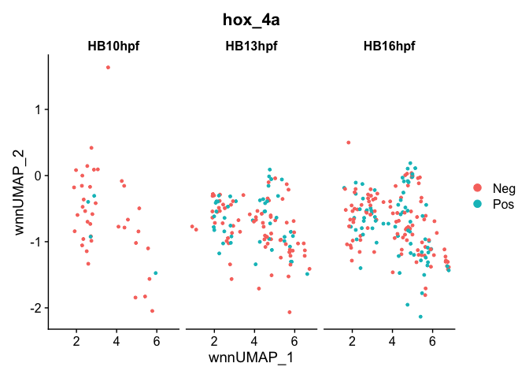

CHB subset hox gene comparisons R Notebook
================

# 1. libraries and functions

``` r
suppressPackageStartupMessages({
  library(Seurat)
#  library(org.Dr.eg.db)
#  library(BSgenome.Drerio.UCSC.danRer11)
  library(Signac)
#  library(knitr)
#  library(kableExtra)
  library(dplyr)
  library(ggplot2)
  library(ggsci)
#  library(limma)
#  library(JASPAR2020)
  library(patchwork)
#  library(TFBSTools)
#  library(motifmatchr)
#  library(harmony)
  library(EnhancedVolcano)
})
options(future.globals.maxSize = 4000 * 1024^2)
```

# 2. Read data and CHB subset

``` r
neural <- readRDS(file = "../data/int.neural.3WT.subset.RDS")
```

``` r
DimPlot(neural, group.by = "intClusters", reduction = "wnn.umap") + scale_color_igv()
```

<!-- -->

``` r
Idents(neural) <- "intClusters"
CHB.subset <- subset(neural, idents = c("CaudHB.1","CaudHB.2","CaudHB.3"))
DimPlot(CHB.subset, reduction = "wnn.umap",split.by = "orig.ident")
```

<!-- -->

# 3. hoxb4a, hoxc4a or hoxd4a expressing vs non-expressing cells

``` r
DefaultAssay(CHB.subset) <- "SCT"
FeaturePlot(CHB.subset, features = c("hoxb4a","hoxc4a","hoxd4a"), reduction = "wnn.umap", split.by = "orig.ident")
```

    ## Warning in FeaturePlot(CHB.subset, features = c("hoxb4a", "hoxc4a", "hoxd4a"),
    ## : All cells have the same value (0) of hoxb4a.

    ## Warning in FeaturePlot(CHB.subset, features = c("hoxb4a", "hoxc4a", "hoxd4a"),
    ## : All cells have the same value (0) of hoxc4a.

    ## Warning in FeaturePlot(CHB.subset, features = c("hoxb4a", "hoxc4a", "hoxd4a"),
    ## : All cells have the same value (0) of hoxb4a.

<!-- -->

``` r
## Make subset of cells expressing FOXP3
hox.subset <- subset(CHB.subset, subset = hoxb4a > 0 | hoxc4a >0 | hoxd4a > 0)

## Get cell names
cellNames <- rownames(hox.subset@meta.data)

## Mutate a column in original SO metadata
CHB.subset$barcode <- rownames(CHB.subset@meta.data)
CHB.subset@meta.data <- CHB.subset@meta.data %>% mutate(hox_4a = ifelse((CHB.subset$barcode %in% cellNames), "Pos",  "Neg"))

DimPlot(CHB.subset, group.by = "hox_4a", split.by = "orig.ident",reduction = "wnn.umap")
```

<!-- -->

# 4. DE genes between hox+/- cells

## 4.1 HB13hpf hox+/- DE genes

``` r
Idents(CHB.subset) <- "orig.ident"
CHB.HB13 <- subset(CHB.subset, idents = "HB13hpf")
Idents(CHB.HB13) <- "hox_4a"
HB13.genes <- FindMarkers(CHB.HB13, ident.1 = "Pos", ident.2 = "Neg", recorrect_umi = FALSE)
head(HB13.genes)
```

    ##                   p_val avg_log2FC pct.1 pct.2   p_val_adj
    ## hoxd4a     5.530871e-23  1.0780025 0.889 0.000 1.07863e-18
    ## zgc:162730 8.973665e-05  0.4064900 0.289 0.039 1.00000e+00
    ## trnau1apb  1.590437e-04  0.4648431 0.511 0.184 1.00000e+00
    ## abraxas1   1.180878e-03  0.3155018 0.133 0.000 1.00000e+00
    ## zgc:162472 1.408831e-03  0.3935043 0.422 0.171 1.00000e+00
    ## wnt8b      1.504535e-03  0.2851837 0.200 0.026 1.00000e+00

``` r
write.table(HB13.genes, file = "Markers/HB13hpf.hoxDEgenes.txt", sep = "\t", quote = F, col.names = NA)
```

``` r
p.HB13 <- EnhancedVolcano(HB13.genes,
                         lab = rownames(HB13.genes),
                         x = "avg_log2FC",
                         y = "p_val",
                         title = "HB13hpf hox Pos/Neg cells Volcano plot",
                         subtitle = NULL)
p.HB13
```

<!-- -->

``` r
saveRDS(p.HB13, file = "Plots/HB13_hox_vol.RDS")
```

## 4.1 HB16hpf hox+/- DE genes

``` r
Idents(CHB.subset) <- "orig.ident"
CHB.HB16 <- subset(CHB.subset, idents = "HB16hpf")
Idents(CHB.HB16) <- "hox_4a"
HB16.genes <- FindMarkers(CHB.HB16, ident.1 = "Pos", ident.2 = "Neg", recorrect_umi = FALSE)
head(HB16.genes)
```

    ##                 p_val avg_log2FC pct.1 pct.2    p_val_adj
    ## hoxd4a   9.305799e-28  1.0886576 0.817 0.000 1.814817e-23
    ## hoxc4a   1.003777e-07  0.3580475 0.254 0.000 1.957565e-03
    ## tmem30ab 6.414057e-06  0.3333777 0.282 0.040 1.250869e-01
    ## asxl2    1.399443e-04  0.3234325 0.268 0.059 1.000000e+00
    ## tktb     1.785401e-04  0.2860719 0.225 0.040 1.000000e+00
    ## ncam1b   2.881919e-04  0.4771787 0.958 0.861 1.000000e+00

``` r
write.table(HB16.genes, file = "Markers/HB16hpf.hoxDEgenes.txt", sep = "\t", quote = F, col.names = NA)
```

``` r
p.HB16 <- EnhancedVolcano(HB16.genes,
                         lab = rownames(HB16.genes),
                         x = "avg_log2FC",
                         y = "p_val",
                         title = "HB16hpf hox Pos/Neg cells Volcano plot",
                         subtitle = NULL)
p.HB16
```

<!-- -->

``` r
saveRDS(p.HB16, file = "Plots/HB16_hox_vol.RDS")
```

``` r
sessionInfo()
```

    ## R version 4.2.3 (2023-03-15)
    ## Platform: aarch64-apple-darwin20 (64-bit)
    ## Running under: macOS Monterey 12.6.2
    ## 
    ## Matrix products: default
    ## BLAS:   /Library/Frameworks/R.framework/Versions/4.2-arm64/Resources/lib/libRblas.0.dylib
    ## LAPACK: /Library/Frameworks/R.framework/Versions/4.2-arm64/Resources/lib/libRlapack.dylib
    ## 
    ## locale:
    ## [1] en_US.UTF-8/en_US.UTF-8/en_US.UTF-8/C/en_US.UTF-8/en_US.UTF-8
    ## 
    ## attached base packages:
    ## [1] stats     graphics  grDevices utils     datasets  methods   base     
    ## 
    ## other attached packages:
    ## [1] EnhancedVolcano_1.16.0 ggrepel_0.9.3          patchwork_1.1.2       
    ## [4] ggsci_3.0.0            ggplot2_3.4.2          dplyr_1.1.2           
    ## [7] Signac_1.10.0          SeuratObject_4.1.3     Seurat_4.3.0.1        
    ## 
    ## loaded via a namespace (and not attached):
    ##   [1] Rtsne_0.16             colorspace_2.1-0       deldir_1.0-6          
    ##   [4] ellipsis_0.3.2         ggridges_0.5.4         XVector_0.38.0        
    ##   [7] GenomicRanges_1.50.2   rstudioapi_0.14        spatstat.data_3.0-1   
    ##  [10] farver_2.1.1           leiden_0.4.3           listenv_0.9.0         
    ##  [13] fansi_1.0.4            codetools_0.2-19       splines_4.2.3         
    ##  [16] knitr_1.42             RcppRoll_0.3.0         polyclip_1.10-4       
    ##  [19] jsonlite_1.8.4         Rsamtools_2.14.0       ica_1.0-3             
    ##  [22] cluster_2.1.4          png_0.1-8              uwot_0.1.14           
    ##  [25] shiny_1.7.4            sctransform_0.3.5      spatstat.sparse_3.0-1 
    ##  [28] compiler_4.2.3         httr_1.4.6             Matrix_1.6-1.1        
    ##  [31] fastmap_1.1.1          lazyeval_0.2.2         limma_3.54.2          
    ##  [34] cli_3.6.1              later_1.3.1            htmltools_0.5.5       
    ##  [37] tools_4.2.3            igraph_1.4.2           GenomeInfoDbData_1.2.9
    ##  [40] gtable_0.3.3           glue_1.6.2             RANN_2.6.1            
    ##  [43] reshape2_1.4.4         fastmatch_1.1-3        Rcpp_1.0.10           
    ##  [46] scattermore_1.0        Biostrings_2.66.0      vctrs_0.6.2           
    ##  [49] spatstat.explore_3.1-0 nlme_3.1-162           progressr_0.13.0      
    ##  [52] lmtest_0.9-40          spatstat.random_3.1-4  xfun_0.39             
    ##  [55] stringr_1.5.0          globals_0.16.2         mime_0.12             
    ##  [58] miniUI_0.1.1.1         lifecycle_1.0.3        irlba_2.3.5.1         
    ##  [61] goftest_1.2-3          future_1.32.0          zlibbioc_1.44.0       
    ##  [64] MASS_7.3-60            zoo_1.8-12             scales_1.2.1          
    ##  [67] promises_1.2.0.1       spatstat.utils_3.0-2   parallel_4.2.3        
    ##  [70] RColorBrewer_1.1-3     yaml_2.3.7             reticulate_1.28       
    ##  [73] pbapply_1.7-0          gridExtra_2.3          stringi_1.7.12        
    ##  [76] highr_0.10             S4Vectors_0.36.2       BiocGenerics_0.44.0   
    ##  [79] BiocParallel_1.32.6    GenomeInfoDb_1.34.9    bitops_1.0-7          
    ##  [82] rlang_1.1.1            pkgconfig_2.0.3        matrixStats_0.63.0    
    ##  [85] evaluate_0.21          lattice_0.21-8         ROCR_1.0-11           
    ##  [88] purrr_1.0.1            tensor_1.5             labeling_0.4.2        
    ##  [91] htmlwidgets_1.6.2      cowplot_1.1.1          tidyselect_1.2.0      
    ##  [94] parallelly_1.35.0      RcppAnnoy_0.0.20       plyr_1.8.8            
    ##  [97] magrittr_2.0.3         R6_2.5.1               IRanges_2.32.0        
    ## [100] generics_0.1.3         withr_2.5.0            pillar_1.9.0          
    ## [103] fitdistrplus_1.1-11    RCurl_1.98-1.12        survival_3.5-5        
    ## [106] abind_1.4-5            sp_1.6-0               tibble_3.2.1          
    ## [109] future.apply_1.10.0    crayon_1.5.2           KernSmooth_2.23-21    
    ## [112] utf8_1.2.3             spatstat.geom_3.1-0    plotly_4.10.1         
    ## [115] rmarkdown_2.21         grid_4.2.3             data.table_1.14.8     
    ## [118] digest_0.6.31          xtable_1.8-4           tidyr_1.3.0           
    ## [121] httpuv_1.6.9           stats4_4.2.3           munsell_0.5.0         
    ## [124] viridisLite_0.4.2
