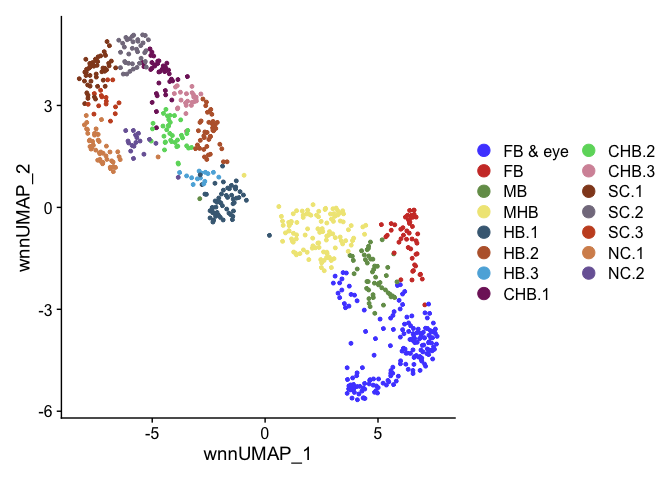

R Match CHB cluster names between samples so CHB.1 et al are the same
cell type in each
================

``` r
suppressPackageStartupMessages({
  library(Seurat)
  library(Signac)
  library(BSgenome.Drerio.UCSC.danRer11)
  library(EnhancedVolcano)
  library(ggsci)
  library(patchwork)
  library(dplyr)
})
```

# Read data

``` r
E10 <- readRDS(file = "../data/HB10hpf_neural.RDS")
DefaultAssay(E10) <- "SCT"
Idents(E10) <- "Clusters"
```

``` r
HB13 <- readRDS(file = "../data/HB13hpf_neural.RDS")
DefaultAssay(HB13) <- "SCT"
Idents(HB13) <- "Clusters"
```

``` r
HB16 <- readRDS(file = "../data/HB16hpf_neural.RDS")
DefaultAssay(HB16) <- "SCT"
Idents(HB16) <- "Clusters"
```

``` r
HB.int <- readRDS(file = "../data/int.neural.3WT.subset.RDS")
DefaultAssay(HB.int) <- "SCT"
Idents(HB.int) <- "intClusters"
```

# Cluster names

## E10hpf

Named clusters after clustering at resolution 8, needed to resolve all
rhombomeres into separate clusters.

``` r
DimPlot(E10, reduction = "wnn.umap") + scale_color_igv()
```

<!-- -->
Combining multiple clusters of same cell type.

``` r
Idents(E10) <- "Clusters"
E10 <- RenameIdents(E10,
                    "FB & eye.1" = "FB & eye",
                    "FB &  eye.2" = "FB & eye",
                    "FB & eye.3" = "FB & eye",
                    "FB & eye.4" = "FB & eye",
                    "FB & eye.5" = "FB & eye",
                    "FB & eye.6" = "FB & eye",
                    "FB & eye.7" = "FB & eye",
                    "FB & eye.8" = "FB & eye",
                    "FB.1" = "FB",
                    "MB.1" = "MB",
                    "CaudHB.1" = "CHB.1",
                    "CaudHB.2" = "CHB.2",
                    "CaudHB.3" = "CHB.3",
                    "MHB.1" = "MHB",
                    "MHB.2" = "MHB",
                    "MHB.3" = "MHB")
levels(E10) <- c("FB & eye","FB","MB","MHB","HB.1","HB.2","HB.3","CHB.1","CHB.2","CHB.3",
                 "SC.1","SC.2","SC.3","NC.1","NC.2")
umap.E10 <- DimPlot(E10, reduction = "wnn.umap") + scale_color_igv() + 
  guides(color = guide_legend(override.aes = list(size=4), ncol=2) )
umap.E10
```

<!-- -->

## HB13hpf

Named clusters after clustering at resolution 8, needed to resolve all
rhombomeres into separate clusters.

``` r
DimPlot(HB13, reduction = "wnn.umap") + scale_color_igv()
```

<!-- -->
Combining multiple clusters of same cell type.

``` r
Idents(HB13) <- "Clusters"
HB13 <- RenameIdents(HB13,
                       "r5.1" = "r5",
                       "r5.2" = "r5",
                       "MB.1" = "MB",
                       "MB.2" = "MB",
                       "MB.3" = "MB",
                       "MHB.1" = "MHB",
                       "MHB.2" = "MHB",
                       "MHB.3" = "MHB",
                       "MHB.4" = "MHB",
                       "MHB.5" = "MHB",
                       "FB.1" = "FB",
                       "FB.2" = "FB",
                       "FB.3" = "FB",
                       "FB.4" = "FB")
```

    ## Warning: Cannot find identity r5.2

    ## Warning: Cannot find identity r5.1

``` r
levels(HB13) <- c("FB","MB","MHB","r1","r1 & r2","r2","r3","r4","r5","r6",
                    "low_expression","unknown","Neuron","Ciliated","CHB.1","CHB.2","CHB.3","SC.1","SC.2","SC.3")
umap.HB13 <- DimPlot(HB13, reduction = "wnn.umap") + scale_color_igv() + 
  guides(color = guide_legend(override.aes = list(size=4), ncol=2) )
umap.HB13
```

<!-- -->

## HB16hpf

Named clusters after clustering at resolution 6, needed to resolve all
rhombomeres into separate clusters.

``` r
DimPlot(HB16, reduction = "wnn.umap") + scale_color_igv()
```

<!-- -->
Combining multiple clusters of same cell type.

``` r
Idents(HB16) <- "Clusters"
HB16 <- RenameIdents(HB16,
                       "r5.1" = "r5",
                       "r5.2" = "r5",
                       "MB.1" = "MB",
                       "MB.2" = "MB",
                       "MHB.1" = "MHB",
                       "MHB.2" = "MHB",
                       "MHB.3" = "MHB")
levels(HB16) <- c("FB","MB","MHB","r1","r2","r3","r4","r5","r6",
                    "DorsNT & NC","Neuron","Ciliated","CHB.1","CHB.2","CHB.3","CHB.4","SC.1","SC.2","SC.3")
umap.HB16 <- DimPlot(HB16, reduction = "wnn.umap") + scale_color_igv() + 
  guides(color = guide_legend(override.aes = list(size=4), ncol=2) )
umap.HB16
```

<!-- -->
\## HB integrated

``` r
table(HB.int$intClusters, HB.int$orig.ident)
```

    ##                
    ##                 HB10hpf HB13hpf HB16hpf
    ##   CaudHB.1           27      46      62
    ##   SC.1               43      38      52
    ##   r3.1               19      45      62
    ##   CaudHB.2           10      44      66
    ##   MB.1               20      61      38
    ##   MHB.1              39      39      34
    ##   MHB.2              18      50      37
    ##   Neuron.1            7      26      51
    ##   CaudHB.3            5      31      44
    ##   MHB.3              22      37      19
    ##   SC.2               55      12      10
    ##   r1&r2.1             9      26      38
    ##   r4.1               15      24      33
    ##   MB.2               31      32       8
    ##   r1                  7      27      35
    ##   r2                  2      35      30
    ##   r5.1                1      20      45
    ##   SC.3               10      22      30
    ##   r4.2               11      23      26
    ##   r5.2                4      20      36
    ##   SC.4               21      14      22
    ##   MHB.4              10      20      24
    ##   MHB.5              15      22      15
    ##   r6.1                4      24      23
    ##   Ciliated            3      24      22
    ##   Neurog             19       8      17
    ##   MB.3                6      21      13
    ##   r6.2                1      16      22
    ##   r1&r2.2             1      10      27
    ##   CaudHB.4           36       0       1
    ##   Neuron.2            2      18      16
    ##   NC.1               22       7       1
    ##   HB                 27       1       1
    ##   NC.2               23       2       2
    ##   MHB.6              16       0       1
    ##   Mitochondrial       5      10       2

``` r
Idents(HB.int) <- "intClusters"
HB.int <- RenameIdents(HB.int,
                       "r1&r2.1" = "r1 & r2",
                       "r1&r2.2" = "r1 & r2",
                       "r3.1" = "r3",
                       "r4.1" = "r4",
                       "r4.2" = "r4",
                       "r5.1" = "r5",
                       "r5.2" = "r5",
                       "r6.1" = "r6",
                       "r6.2" = "r6",
                       "MB.1" = "MB",
                       "MB.2" = "MB",
                       "MB.3" = "MB",
                       "MHB.1" = "MHB",
                       "MHB.2" = "MHB",
                       "MHB.3" = "MHB",
                       "MHB.4" = "MHB",
                       "MHB.5" = "MHB",
                       "MHB.6" = "MHB",
                       "Neuron.1" = "Neuron",
                       "Neuron.2" = "Neuron",
                       "CaudHB.1" = "CHB.1",
                       "CaudHB.2" = "CHB.2",
                       "CaudHB.3" = "CHB.3",
                       "CaudHB.4" = "CHB-10hpf")
levels(HB.int) <- c("MB","MHB","r1 & r2","r1","r2","r3","r4","r5","r6",           
                  "CHB.1","CHB.2","CHB.3","CHB-10hpf","SC.1","SC.2","SC.3","SC.4",
                  "Neuron","Ciliated","Neurog","NC.1","NC.2","HB","Mitochondrial")
umap.HBint <- DimPlot(HB.int, reduction = "wnn.umap") + scale_color_igv() #+ 
  #guides(color = guide_legend(override.aes = list(size=4), ncol=2) )
umap.HBint
```

<!-- -->

``` r
DimPlot(HB.int, reduction = "wnn.umap", cells.highlight = WhichCells(HB.int, idents = "CHB-10hpf"))
```

<!-- -->

CaudHB.4 is a mix of E10hpf CaudHB cells

``` r
df <- as.data.frame(table(HB.int$intClusters, HB.int$Clusters))
df[df$Var1 == "CaudHB.4" & df$Freq > 0,]
```

    ##          Var1  Var2 Freq
    ## 30   CaudHB.4 CHB.1    6
    ## 66   CaudHB.4 CHB.2   14
    ## 102  CaudHB.4 CHB.3   14
    ## 570  CaudHB.4  HB.2    1
    ## 1002 CaudHB.4  NC.2    1
    ## 1434 CaudHB.4  SC.2    1

Get cell counts of original identities of HB.int CHB and SC cells.

``` r
HB.int$sample_cluster <- paste(HB.int$orig.ident, HB.int$Clusters, sep = "_")
df2 <- as.data.frame(table(HB.int$intClusters, HB.int$sample_cluster))
df2 <- dplyr::filter(df2[df2$Freq > 0,], grepl('CaudHB|SC',Var1)) %>%
  arrange(Var1,desc(Freq))
df2
```

    ##        Var1             Var2 Freq
    ## 1  CaudHB.1    HB16hpf_CHB.2   53
    ## 2  CaudHB.1    HB13hpf_CHB.1   46
    ## 3  CaudHB.1    HB10hpf_CHB.2   18
    ## 4  CaudHB.1    HB16hpf_CHB.4    8
    ## 5  CaudHB.1     HB10hpf_NC.2    6
    ## 6  CaudHB.1     HB10hpf_HB.3    2
    ## 7  CaudHB.1     HB10hpf_HB.2    1
    ## 8  CaudHB.1       HB16hpf_r6    1
    ## 9      SC.1     HB13hpf_SC.1   31
    ## 10     SC.1     HB16hpf_SC.1   31
    ## 11     SC.1     HB16hpf_SC.2   19
    ## 12     SC.1    HB10hpf_CHB.1   18
    ## 13     SC.1     HB10hpf_SC.2   16
    ## 14     SC.1     HB10hpf_SC.1    6
    ## 15     SC.1     HB13hpf_SC.2    5
    ## 16     SC.1     HB10hpf_SC.3    3
    ## 17     SC.1    HB13hpf_CHB.3    2
    ## 18     SC.1    HB16hpf_CHB.1    1
    ## 19     SC.1     HB16hpf_SC.3    1
    ## 20 CaudHB.2    HB16hpf_CHB.3   51
    ## 21 CaudHB.2    HB13hpf_CHB.2   39
    ## 22 CaudHB.2    HB16hpf_CHB.1   13
    ## 23 CaudHB.2    HB10hpf_CHB.3    7
    ## 24 CaudHB.2     HB13hpf_SC.2    3
    ## 25 CaudHB.2     HB10hpf_HB.2    2
    ## 26 CaudHB.2    HB13hpf_CHB.3    2
    ## 27 CaudHB.2    HB16hpf_CHB.2    2
    ## 28 CaudHB.2    HB10hpf_CHB.1    1
    ## 29 CaudHB.3    HB16hpf_CHB.1   42
    ## 30 CaudHB.3    HB13hpf_CHB.3   27
    ## 31 CaudHB.3    HB10hpf_CHB.1    3
    ## 32 CaudHB.3    HB13hpf_CHB.2    3
    ## 33 CaudHB.3    HB10hpf_CHB.3    1
    ## 34 CaudHB.3     HB10hpf_SC.2    1
    ## 35 CaudHB.3     HB13hpf_SC.1    1
    ## 36 CaudHB.3    HB16hpf_CHB.3    1
    ## 37 CaudHB.3       HB16hpf_r4    1
    ## 38     SC.2     HB10hpf_SC.1   42
    ## 39     SC.2     HB13hpf_SC.3   12
    ## 40     SC.2     HB16hpf_SC.2    9
    ## 41     SC.2     HB10hpf_SC.3    8
    ## 42     SC.2     HB10hpf_SC.2    2
    ## 43     SC.2       HB10hpf_FB    1
    ## 44     SC.2       HB10hpf_MB    1
    ## 45     SC.2     HB10hpf_NC.1    1
    ## 46     SC.2     HB16hpf_SC.3    1
    ## 47     SC.3     HB16hpf_SC.3   28
    ## 48     SC.3     HB13hpf_SC.2   21
    ## 49     SC.3     HB10hpf_NC.2    4
    ## 50     SC.3    HB10hpf_CHB.1    3
    ## 51     SC.3     HB10hpf_SC.3    2
    ## 52     SC.3    HB10hpf_CHB.2    1
    ## 53     SC.3    HB13hpf_CHB.1    1
    ## 54     SC.3    HB16hpf_CHB.2    1
    ## 55     SC.3     HB16hpf_SC.1    1
    ## 56     SC.4     HB10hpf_SC.2   16
    ## 57     SC.4     HB16hpf_SC.1   12
    ## 58     SC.4 HB16hpf_Ciliated   10
    ## 59     SC.4     HB13hpf_SC.1    9
    ## 60     SC.4    HB10hpf_CHB.1    4
    ## 61     SC.4 HB13hpf_Ciliated    4
    ## 62     SC.4     HB10hpf_NC.2    1
    ## 63     SC.4    HB13hpf_CHB.3    1
    ## 64 CaudHB.4    HB10hpf_CHB.2   14
    ## 65 CaudHB.4    HB10hpf_CHB.3   14
    ## 66 CaudHB.4    HB10hpf_CHB.1    6
    ## 67 CaudHB.4     HB10hpf_HB.2    1
    ## 68 CaudHB.4     HB10hpf_NC.2    1
    ## 69 CaudHB.4     HB16hpf_SC.2    1

``` r
write.csv(df2, file = "Markers/HB_integrated_CHB_SC_cell_counts.csv", row.names = F)
```

``` r
E10.plotlist <- list()
for(cluster in c("CHB.1","CHB.2","CHB.3")){
  E10.plotlist[[cluster]] <- DimPlot(HB.int, reduction = "wnn.umap", 
                           cells.highlight = paste0(WhichCells(E10, idents = cluster),"_1")) +
    scale_color_igv() + 
    NoLegend() + 
    ggtitle(paste("E10", cluster, "cells"))
}
```

    ## Scale for colour is already present.
    ## Adding another scale for colour, which will replace the existing scale.
    ## Scale for colour is already present.
    ## Adding another scale for colour, which will replace the existing scale.
    ## Scale for colour is already present.
    ## Adding another scale for colour, which will replace the existing scale.

``` r
HB13.plotlist <- list()
for(cluster in c("CHB.1","CHB.2","CHB.3")){
  HB13.plotlist[[cluster]] <- DimPlot(HB.int, reduction = "wnn.umap", 
                           cells.highlight = paste0(WhichCells(HB13, idents = cluster),"_2")) +
    scale_color_igv() + 
    NoLegend() + 
    ggtitle(paste("HB13", cluster, "cells"))
}
```

    ## Scale for colour is already present.
    ## Adding another scale for colour, which will replace the existing scale.
    ## Scale for colour is already present.
    ## Adding another scale for colour, which will replace the existing scale.
    ## Scale for colour is already present.
    ## Adding another scale for colour, which will replace the existing scale.

``` r
HB16.plotlist <- list()
for(cluster in c("CHB.1","CHB.2","CHB.3","CHB.4")){
  HB16.plotlist[[cluster]] <- DimPlot(HB.int, reduction = "wnn.umap", 
                           cells.highlight = paste0(WhichCells(HB16, idents = cluster),"_3")) +
    scale_color_igv() + 
    NoLegend() + 
    ggtitle(paste("HB16", cluster, "cells"))
}
```

    ## Scale for colour is already present.
    ## Adding another scale for colour, which will replace the existing scale.
    ## Scale for colour is already present.
    ## Adding another scale for colour, which will replace the existing scale.
    ## Scale for colour is already present.
    ## Adding another scale for colour, which will replace the existing scale.
    ## Scale for colour is already present.
    ## Adding another scale for colour, which will replace the existing scale.

``` r
HB16.plotlist[["spacer"]] <- plot_spacer()
HB16.plotlist[["umap"]] <- umap.HBint 
wrap_plots(c(E10.plotlist,HB13.plotlist,HB16.plotlist), ncol = 3)
```

<!-- -->

The CHB clusters in each sample were originally numbered based on order
of most cells in the cluster (following Seurat convention). But to
prevent confusion, we will base all cluster numbers to match the HB13hpf
cluster numbers.

Note: E10hpf CHB.1 cells correspond to SC cluster not CHB

| HB13hpf Cluster | Sample | Cluster |
|-----------------|--------|---------|
| CHB.1           | E10    | CHB.2   |
|                 | HB16   | CHB.2/4 |
|                 | HBint  | CHB.1   |
| CHB.2           | E10    | CHB.3   |
|                 | HB16   | CHB.3   |
|                 | HBint  | CHB.2   |
| CHB.3           | E10    | none    |
|                 | HB16   | CHB.1   |
|                 | HBint  | CHB.3   |

``` r
E10.plotlist <- list()
for(cluster in c("SC.1","SC.2","SC.3")){
  E10.plotlist[[cluster]] <- DimPlot(HB.int, reduction = "wnn.umap", 
                           cells.highlight = paste0(WhichCells(E10, idents = cluster),"_1")) +
    scale_color_igv() + 
    NoLegend() + 
    ggtitle(paste("E10", cluster, "cells"))
}
```

    ## Scale for colour is already present.
    ## Adding another scale for colour, which will replace the existing scale.
    ## Scale for colour is already present.
    ## Adding another scale for colour, which will replace the existing scale.
    ## Scale for colour is already present.
    ## Adding another scale for colour, which will replace the existing scale.

``` r
HB13.plotlist <- list()
for(cluster in c("SC.1","SC.2","SC.3")){
  HB13.plotlist[[cluster]] <- DimPlot(HB.int, reduction = "wnn.umap", 
                           cells.highlight = paste0(WhichCells(HB13, idents = cluster),"_2")) +
    scale_color_igv() + 
    NoLegend() + 
    ggtitle(paste("HB13", cluster, "cells"))
}
```

    ## Scale for colour is already present.
    ## Adding another scale for colour, which will replace the existing scale.
    ## Scale for colour is already present.
    ## Adding another scale for colour, which will replace the existing scale.
    ## Scale for colour is already present.
    ## Adding another scale for colour, which will replace the existing scale.

``` r
HB16.plotlist <- list()
for(cluster in c("SC.1","SC.2","SC.3")){
  HB16.plotlist[[cluster]] <- DimPlot(HB.int, reduction = "wnn.umap", 
                           cells.highlight = paste0(WhichCells(HB16, idents = cluster),"_3")) +
    scale_color_igv() + 
    NoLegend() + 
    ggtitle(paste("HB16", cluster, "cells"))
}
```

    ## Scale for colour is already present.
    ## Adding another scale for colour, which will replace the existing scale.
    ## Scale for colour is already present.
    ## Adding another scale for colour, which will replace the existing scale.
    ## Scale for colour is already present.
    ## Adding another scale for colour, which will replace the existing scale.

``` r
HB16.plotlist[["spacer"]] <- plot_spacer()
HB16.plotlist[["spacer2"]] <- plot_spacer()
HB16.plotlist[["umap"]] <- umap.HBint 
wrap_plots(c(E10.plotlist,HB13.plotlist,HB16.plotlist), ncol = 3)
```

<!-- -->

The SC clusters in each sample were originally numbered based on order
of most cells in the cluster (following Seurat convention). But to
prevent confusion, we will base all cluster numbers to match the HB13hpf
cluster numbers.

| HB13hpf Cluster | Sample | Cluster |
|-----------------|--------|---------|
| SC .1           | E10    | SC.2    |
|                 | HB16   | SC.1    |
|                 | HBint  | SC.1/4  |
| SC .2           | E10    | none    |
|                 | HB16   | SC.3    |
|                 | HBint  | SC.3    |
| SC .3           | E10    | SC.1/3  |
|                 | HB16   | SC.2    |
|                 | HBint  | SC.2    |

``` r
sessionInfo()
```

    ## R version 4.2.3 (2023-03-15)
    ## Platform: aarch64-apple-darwin20 (64-bit)
    ## Running under: macOS Monterey 12.6.2
    ## 
    ## Matrix products: default
    ## BLAS:   /Library/Frameworks/R.framework/Versions/4.2-arm64/Resources/lib/libRblas.0.dylib
    ## LAPACK: /Library/Frameworks/R.framework/Versions/4.2-arm64/Resources/lib/libRlapack.dylib
    ## 
    ## locale:
    ## [1] en_US.UTF-8/en_US.UTF-8/en_US.UTF-8/C/en_US.UTF-8/en_US.UTF-8
    ## 
    ## attached base packages:
    ## [1] stats4    stats     graphics  grDevices utils     datasets  methods  
    ## [8] base     
    ## 
    ## other attached packages:
    ##  [1] dplyr_1.1.2                         patchwork_1.1.2                    
    ##  [3] ggsci_3.0.0                         EnhancedVolcano_1.16.0             
    ##  [5] ggrepel_0.9.3                       ggplot2_3.4.2                      
    ##  [7] BSgenome.Drerio.UCSC.danRer11_1.4.2 BSgenome_1.66.3                    
    ##  [9] rtracklayer_1.58.0                  Biostrings_2.66.0                  
    ## [11] XVector_0.38.0                      GenomicRanges_1.50.2               
    ## [13] GenomeInfoDb_1.34.9                 IRanges_2.32.0                     
    ## [15] S4Vectors_0.36.2                    BiocGenerics_0.44.0                
    ## [17] Signac_1.10.0                       SeuratObject_4.1.3                 
    ## [19] Seurat_4.3.0.1                     
    ## 
    ## loaded via a namespace (and not attached):
    ##   [1] fastmatch_1.1-3             plyr_1.8.8                 
    ##   [3] igraph_1.4.2                lazyeval_0.2.2             
    ##   [5] sp_1.6-0                    splines_4.2.3              
    ##   [7] BiocParallel_1.32.6         listenv_0.9.0              
    ##   [9] scattermore_1.0             digest_0.6.31              
    ##  [11] htmltools_0.5.5             fansi_1.0.4                
    ##  [13] magrittr_2.0.3              tensor_1.5                 
    ##  [15] cluster_2.1.4               ROCR_1.0-11                
    ##  [17] globals_0.16.2              matrixStats_0.63.0         
    ##  [19] spatstat.sparse_3.0-1       colorspace_2.1-0           
    ##  [21] xfun_0.39                   crayon_1.5.2               
    ##  [23] RCurl_1.98-1.12             jsonlite_1.8.4             
    ##  [25] progressr_0.13.0            spatstat.data_3.0-1        
    ##  [27] survival_3.5-5              zoo_1.8-12                 
    ##  [29] glue_1.6.2                  polyclip_1.10-4            
    ##  [31] gtable_0.3.3                zlibbioc_1.44.0            
    ##  [33] leiden_0.4.3                DelayedArray_0.24.0        
    ##  [35] future.apply_1.10.0         abind_1.4-5                
    ##  [37] scales_1.2.1                spatstat.random_3.1-4      
    ##  [39] miniUI_0.1.1.1              Rcpp_1.0.10                
    ##  [41] viridisLite_0.4.2           xtable_1.8-4               
    ##  [43] reticulate_1.28             htmlwidgets_1.6.2          
    ##  [45] httr_1.4.6                  RColorBrewer_1.1-3         
    ##  [47] ellipsis_0.3.2              ica_1.0-3                  
    ##  [49] farver_2.1.1                pkgconfig_2.0.3            
    ##  [51] XML_3.99-0.14               uwot_0.1.14                
    ##  [53] deldir_1.0-6                utf8_1.2.3                 
    ##  [55] labeling_0.4.2              tidyselect_1.2.0           
    ##  [57] rlang_1.1.1                 reshape2_1.4.4             
    ##  [59] later_1.3.1                 munsell_0.5.0              
    ##  [61] tools_4.2.3                 cli_3.6.1                  
    ##  [63] generics_0.1.3              ggridges_0.5.4             
    ##  [65] evaluate_0.21               stringr_1.5.0              
    ##  [67] fastmap_1.1.1               yaml_2.3.7                 
    ##  [69] goftest_1.2-3               knitr_1.42                 
    ##  [71] fitdistrplus_1.1-11         purrr_1.0.1                
    ##  [73] RANN_2.6.1                  pbapply_1.7-0              
    ##  [75] future_1.32.0               nlme_3.1-162               
    ##  [77] mime_0.12                   RcppRoll_0.3.0             
    ##  [79] compiler_4.2.3              rstudioapi_0.14            
    ##  [81] plotly_4.10.1               png_0.1-8                  
    ##  [83] spatstat.utils_3.0-2        tibble_3.2.1               
    ##  [85] stringi_1.7.12              highr_0.10                 
    ##  [87] lattice_0.21-8              Matrix_1.6-1.1             
    ##  [89] vctrs_0.6.2                 pillar_1.9.0               
    ##  [91] lifecycle_1.0.3             spatstat.geom_3.1-0        
    ##  [93] lmtest_0.9-40               RcppAnnoy_0.0.20           
    ##  [95] data.table_1.14.8           cowplot_1.1.1              
    ##  [97] bitops_1.0-7                irlba_2.3.5.1              
    ##  [99] httpuv_1.6.9                R6_2.5.1                   
    ## [101] BiocIO_1.8.0                promises_1.2.0.1           
    ## [103] KernSmooth_2.23-21          gridExtra_2.3              
    ## [105] parallelly_1.35.0           codetools_0.2-19           
    ## [107] MASS_7.3-60                 SummarizedExperiment_1.28.0
    ## [109] rjson_0.2.21                withr_2.5.0                
    ## [111] GenomicAlignments_1.34.1    sctransform_0.3.5          
    ## [113] Rsamtools_2.14.0            GenomeInfoDbData_1.2.9     
    ## [115] parallel_4.2.3              grid_4.2.3                 
    ## [117] tidyr_1.3.0                 rmarkdown_2.21             
    ## [119] MatrixGenerics_1.10.0       Rtsne_0.16                 
    ## [121] spatstat.explore_3.1-0      Biobase_2.58.0             
    ## [123] shiny_1.7.4                 restfulr_0.0.15
