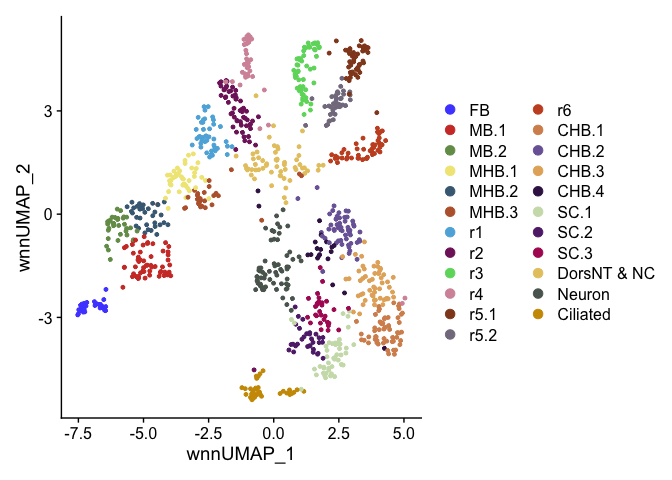
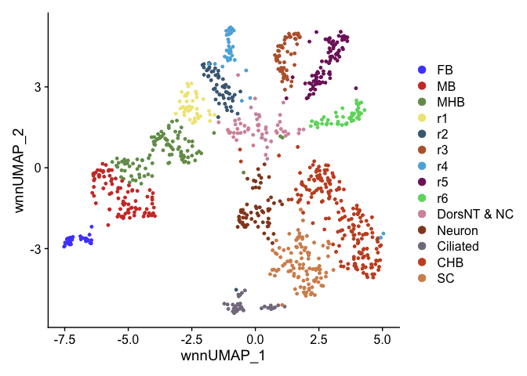
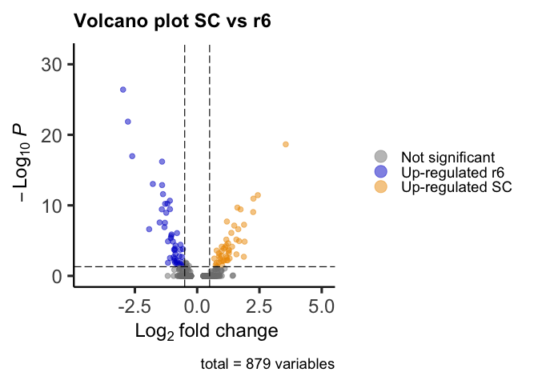
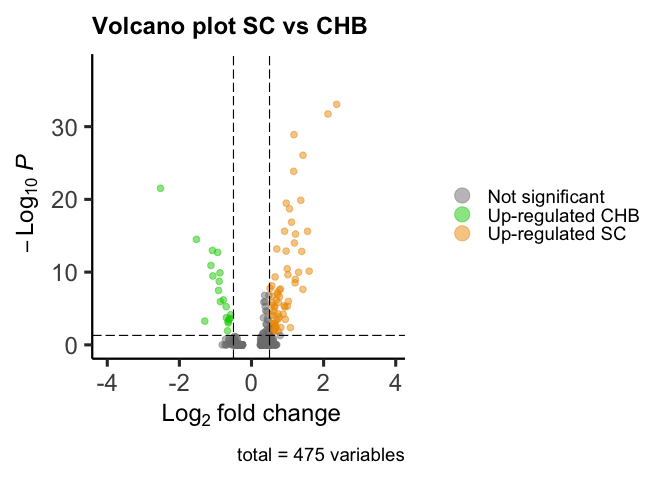
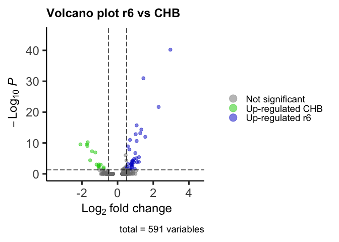
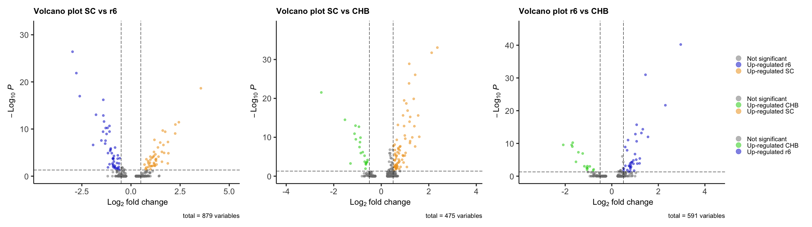

R Notebook
================

``` r
suppressPackageStartupMessages({
  library(Seurat)
  library(Signac)
  library(EnhancedVolcano)
  library(ggsci)
})
```

``` r
seurat <- readRDS(file = "~/Documents/Projects/Sagerstrom/Sagerstrom_zebrafish_hindbrain/workspace/notebooks/RDSfiles/HB16hpf_neural.RDS")
DefaultAssay(seurat) <- "SCT"
Idents(seurat) <- "Clusters"
```

Named clusters after clustering at resolution 6, needed to resolve all
rhombomeres into separate clusters.

``` r
DimPlot(seurat, reduction = "wnn.umap") + scale_color_igv()
```

<!-- -->
Combining multiple clusters of same cell type.

``` r
Idents(seurat) <- "Clusters"
seurat <- RenameIdents(seurat,
                       "CHB.1" = "CHB",
                       "CHB.2" = "CHB",
                       "CHB.3" = "CHB",
                       "CHB.4" = "CHB",
                       "SC.1" = "SC",
                       "SC.2" = "SC",
                       "SC.3" = "SC",
                       "r5.1" = "r5",
                       "r5.2" = "r5",
                       "MB.1" = "MB",
                       "MB.2" = "MB",
                       "MHB.1" = "MHB",
                       "MHB.2" = "MHB",
                       "MHB.3" = "MHB")
levels(seurat) <- c("FB","MB","MHB","r1","r2","r3","r4","r5","r6",
                    "DorsNT & NC","Neuron","Ciliated","CHB","SC")
DimPlot(seurat, reduction = "wnn.umap") + scale_color_igv()
```

<!-- -->

``` r
markers.SCvsr6 <- FindMarkers(seurat, ident.1 = "SC", ident.2 = "r6", verbose = F, recorrect_umi = F)
markers.SCvsr6
```

    ##                          p_val avg_log2FC pct.1 pct.2    p_val_adj
    ## cyp26c1           2.177094e-31 -2.9735278 0.019 0.958 3.930743e-27
    ## epha7             7.513430e-27 -2.7785665 0.148 0.979 1.356550e-22
    ## hoxc3a            1.240612e-23  3.5557253 0.991 0.000 2.239926e-19
    ## tenm4             5.868890e-22 -2.6061301 0.648 1.000 1.059628e-17
    ## mafba             3.491572e-21 -1.4089321 0.028 0.729 6.304034e-17
    ## zgc:158328        5.143303e-18 -1.7787342 0.102 0.750 9.286233e-14
    ## nhsl1a            7.411640e-18 -1.4069642 0.028 0.646 1.338172e-13
    ## epha4b            1.423491e-16 -1.3710446 0.889 1.000 2.570113e-12
    ## pkd1b             1.986515e-16  2.4363480 0.833 0.125 3.586653e-12
    ## prickle2b         6.141850e-16  2.2587689 0.898 0.292 1.108911e-11
    ## mpz               1.216903e-15 -1.0939761 0.074 0.667 2.197118e-11
    ## cxcl12a           3.194895e-15 -1.1933840 0.056 0.625 5.768382e-11
    ## bmpr1ba           3.395072e-15 -1.2854022 0.093 0.688 6.129802e-11
    ## evx1              1.151363e-14  1.6147098 0.861 0.333 2.078786e-10
    ## rgs3b             1.931767e-14 -1.0912130 0.037 0.562 3.487806e-10
    ## jarid2b           2.031230e-14 -1.4192253 0.778 1.000 3.667386e-10
    ## tshz1             2.074691e-14  1.7410526 0.907 0.458 3.745855e-10
    ## mllt3             4.936710e-14  2.2483876 0.750 0.042 8.913229e-10
    ## efnb3b            6.245411e-14 -1.2416760 0.593 1.000 1.127609e-09
    ## hoxb6b            1.092258e-12  1.1934797 0.648 0.000 1.972072e-08
    ## CT990561.1        1.486233e-12 -1.5055280 0.111 0.625 2.683393e-08
    ## col15a1b          1.629848e-12 -1.2943724 0.028 0.479 2.942691e-08
    ## dnmt3ab           3.123952e-12  1.8811793 0.694 0.083 5.640295e-08
    ## hoxc6b            4.105170e-12  1.4882865 0.630 0.000 7.411885e-08
    ## nck2a             6.851411e-12 -1.3130120 0.574 0.875 1.237022e-07
    ## adgrl1a           1.323004e-11 -1.9264308 0.102 0.583 2.388683e-07
    ## dacha             1.338243e-11  1.6502540 0.898 0.562 2.416198e-07
    ## arhgap29a         4.434977e-11  1.3717337 0.759 0.229 8.007351e-07
    ## celf2             4.726638e-11 -0.8091777 0.046 0.479 8.533945e-07
    ## emid1             7.485163e-11 -1.0287489 0.074 0.521 1.351446e-06
    ## rasal2            1.259641e-10 -1.0402897 0.630 0.938 2.274282e-06
    ## ptprna            2.383372e-10 -1.0588937 0.139 0.604 4.303178e-06
    ## epha4a            3.860412e-10  1.5722772 0.648 0.104 6.969973e-06
    ## hoxb7a            3.982453e-10  1.1699250 0.546 0.000 7.190319e-06
    ## ror1              6.433800e-10  1.6859524 0.741 0.292 1.161623e-05
    ## epha4l            7.032475e-10 -1.1699250 0.111 0.542 1.269713e-05
    ## zbtb16a           7.369816e-10 -0.9746875 0.991 1.000 1.330620e-05
    ## col14a1a          7.663171e-10  1.9033240 0.639 0.104 1.383585e-05
    ## nfia              1.286557e-09  1.2432712 0.546 0.021 2.322879e-05
    ## adgrg6            2.138205e-09 -0.6685272 0.009 0.333 3.860530e-05
    ## aopep             2.679248e-09  1.1656780 0.694 0.167 4.837383e-05
    ## dhx32b            2.831048e-09 -0.8673622 0.028 0.375 5.111457e-05
    ## cdx4              3.949099e-09  0.9865795 0.500 0.000 7.130098e-05
    ## col11a1a          4.010596e-09  1.4016170 0.593 0.083 7.241130e-05
    ## col5a2a           4.758924e-09  1.1291932 0.565 0.062 8.592238e-05
    ## bahcc1b           7.269290e-09  1.0691462 0.815 0.438 1.312470e-04
    ## si:dkey-157g16.6  7.809653e-09 -0.8969065 0.241 0.708 1.410033e-04
    ## prox2             8.753655e-09 -0.5716657 0.009 0.312 1.580472e-04
    ## samd10b           1.026812e-08 -0.9266539 0.056 0.417 1.853908e-04
    ## sfxn1             1.086496e-08 -0.6773265 0.111 0.521 1.961668e-04
    ## tmem108           1.190143e-08  1.2807364 0.648 0.188 2.148803e-04
    ## efnb1             1.312903e-08 -0.8989637 0.167 0.604 2.370446e-04
    ## hoxb5b            1.426980e-08  0.7842713 0.472 0.000 2.576412e-04
    ## p3h2              1.655449e-08  1.2507370 0.472 0.000 2.988914e-04
    ## notch1b           1.773499e-08  0.9876163 0.935 0.792 3.202053e-04
    ## col28a2a          3.087680e-08  1.2748598 0.583 0.125 5.574807e-04
    ## hoxb3a            3.516804e-08  0.8726464 0.981 0.875 6.349589e-04
    ## nav2a             4.416504e-08 -0.8703647 0.204 0.625 7.973998e-04
    ## bcam              4.834147e-08  1.5763184 0.593 0.125 8.728052e-04
    ## bcar1             7.553704e-08  0.9675785 0.676 0.208 1.363821e-03
    ## hoxb1b            8.634088e-08  0.8807011 0.463 0.021 1.558885e-03
    ## raraa             8.637954e-08  1.1638124 0.759 0.354 1.559583e-03
    ## fsta              8.966542e-08 -0.7104934 0.093 0.458 1.618909e-03
    ## adamts3           1.078897e-07  1.8737019 0.574 0.146 1.947949e-03
    ## kif21b            1.127338e-07 -0.6086138 0.093 0.458 2.035409e-03
    ## jag2b             1.185376e-07 -0.9447121 0.574 0.896 2.140197e-03
    ## robo3             1.477800e-07  1.1914115 0.676 0.312 2.668168e-03
    ## dchs1a            1.603769e-07 -1.0904905 0.028 0.312 2.895604e-03
    ## ptprfa            1.844681e-07  1.3018269 0.509 0.083 3.330572e-03
    ## hoxd4a            1.925828e-07  0.6880560 0.417 0.000 3.477083e-03
    ## ldlrad2           2.046021e-07  0.9245926 0.417 0.000 3.694092e-03
    ## vat1              2.051817e-07 -0.9046863 0.167 0.542 3.704556e-03
    ## wnt11             3.246217e-07  1.1871449 0.713 0.354 5.861045e-03
    ## wnt4              3.539122e-07  1.2238534 0.787 0.521 6.389885e-03
    ## sema4c            3.618437e-07 -0.8176233 0.463 0.771 6.533089e-03
    ## ncam1b            3.624146e-07  1.0877046 0.898 0.667 6.543396e-03
    ## pax7b             4.072417e-07 -0.9116130 0.083 0.417 7.352748e-03
    ## nectin1b          4.144609e-07  1.0437817 0.843 0.583 7.483092e-03
    ## zgc:92107         4.553222e-07  0.9769164 0.685 0.312 8.220842e-03
    ## znf516            5.884074e-07 -0.6189098 0.139 0.500 1.062370e-02
    ## bach2b            6.509843e-07 -0.8227596 0.417 0.750 1.175352e-02
    ## col18a1a          6.849196e-07  0.8708548 0.944 0.854 1.236622e-02
    ## pcdh11            7.298294e-07 -0.4546545 0.019 0.271 1.317707e-02
    ## dtnba             7.523925e-07 -0.8857816 0.426 0.750 1.358445e-02
    ## kirrel3l          7.594188e-07 -1.1699250 0.435 0.771 1.371131e-02
    ## foxp4             8.244499e-07  0.7756272 0.954 0.854 1.488544e-02
    ## wnt7bb            9.611460e-07 -0.4199033 0.028 0.292 1.735349e-02
    ## fgfr2             1.018848e-06 -0.6902702 0.907 0.958 1.839531e-02
    ## rarga             1.081822e-06 -0.4707915 0.120 0.500 1.953230e-02
    ## tox3              1.168454e-06 -0.8073549 0.556 0.854 2.109643e-02
    ## plekhg7           1.403782e-06 -0.7301044 0.194 0.562 2.534528e-02
    ## fam189a1          1.479335e-06 -0.6355886 0.130 0.479 2.670939e-02
    ## hoxc1a            1.501676e-06  0.7449584 0.370 0.000 2.711277e-02
    ## rhbdl3            1.845346e-06  0.9969723 0.435 0.042 3.331773e-02
    ## arhgap39          2.094348e-06 -0.3324780 0.009 0.229 3.781346e-02
    ## rassf8b           2.521199e-06  0.7878468 0.463 0.083 4.552025e-02
    ## abcc8             2.671865e-06 -0.5973462 0.065 0.354 4.824051e-02
    ## lmf2b             2.915104e-06 -0.3885653 0.019 0.250 5.263219e-02
    ## smoc1             4.207060e-06 -0.4694853 0.065 0.354 7.595847e-02
    ## mff               4.377103e-06 -0.7075818 0.130 0.438 7.902859e-02
    ## zic5              4.568510e-06 -0.3849379 0.028 0.271 8.248446e-02
    ## negr1             4.949816e-06 -0.7095892 0.815 0.958 8.936892e-02
    ## tanc2a            5.051678e-06  1.1045559 0.546 0.167 9.120805e-02
    ## pcdh11.1          5.161289e-06 -0.6128685 0.102 0.417 9.318708e-02
    ## nr6a1b            5.266665e-06  0.8078222 0.370 0.021 9.508964e-02
    ## tns1b             5.808607e-06  0.7560744 0.398 0.042 1.048744e-01
    ## kdm5bb            6.619791e-06 -0.7114949 0.398 0.708 1.195203e-01
    ## meis1a            6.704987e-06  0.7369656 0.426 0.062 1.210585e-01
    ## slc4a4a           7.519787e-06 -0.3559370 0.009 0.208 1.357697e-01
    ## nr2f2             7.579067e-06 -0.9183862 0.435 0.729 1.368401e-01
    ## nradd             7.979646e-06  0.8245155 0.630 0.250 1.440725e-01
    ## spsb4a            8.449500e-06  0.9540637 0.657 0.354 1.525557e-01
    ## nxph3             8.651508e-06 -0.7192636 0.074 0.354 1.562030e-01
    ## ssbp4             1.005086e-05  0.6787810 0.880 0.667 1.814683e-01
    ## pax6b             1.025935e-05  0.9841086 0.620 0.271 1.852326e-01
    ## smad1             1.082613e-05 -0.4520682 0.093 0.396 1.954659e-01
    ## adcy7             1.183498e-05  0.5462820 0.352 0.021 2.136806e-01
    ## jmjd1cb           1.214909e-05  0.7360989 0.843 0.562 2.193518e-01
    ## hspg2             1.226580e-05  0.9513379 0.824 0.542 2.214590e-01
    ## si:ch211-269k10.2 1.282383e-05 -0.5849625 0.222 0.583 2.315342e-01
    ## CR936977.2        1.349972e-05 -0.3297054 0.019 0.229 2.437374e-01
    ## FQ377603.1        1.453218e-05 -0.2730185 0.000 0.167 2.623785e-01
    ## hoxb6a            1.981728e-05  0.6026645 0.306 0.000 3.578010e-01
    ## igf2b             2.112194e-05 -0.4943600 0.065 0.312 3.813567e-01
    ## fgfr1b            2.279491e-05 -0.5849625 0.731 0.917 4.115621e-01
    ## ip6k2a            2.498641e-05 -0.4493074 0.074 0.333 4.511296e-01
    ## cntn3a.1          2.602271e-05 -0.6111940 0.009 0.188 4.698400e-01
    ## oat               3.703476e-05 -0.4741821 0.056 0.292 6.686626e-01
    ## ptprfb            3.756126e-05 -0.4953253 0.991 1.000 6.781685e-01
    ## si:ch211-66k16.28 3.925293e-05 -0.4043903 0.074 0.333 7.087117e-01
    ## fgfr3             3.950706e-05  0.8614702 0.787 0.604 7.133000e-01
    ## si:dkey-91m11.5   4.022543e-05  0.5488932 0.287 0.000 7.262702e-01
    ## ephb3a            4.035831e-05 -0.6511962 0.259 0.562 7.286693e-01
    ## meis1b            4.143732e-05  0.5768438 0.963 0.917 7.481508e-01
    ## hcn2b             4.175445e-05 -0.4286593 0.037 0.250 7.538767e-01
    ## zic2a             4.437342e-05 -0.4709273 0.111 0.396 8.011622e-01
    ## XKR4              4.634134e-05  1.4410998 0.500 0.188 8.366928e-01
    ## hoxa4a            4.718306e-05  0.7203827 0.917 0.688 8.518902e-01
    ## acsl2             4.805933e-05 -0.6577188 0.324 0.604 8.677113e-01
    ## ptprz1b           4.810627e-05  0.6374299 0.324 0.021 8.685587e-01
    ## creb5b            4.872185e-05 -0.3870231 0.065 0.312 8.796729e-01
    ## nr2f1b            4.891338e-05 -0.4893848 0.046 0.271 8.831310e-01
    ## apcdd1l           5.141670e-05  0.5462820 0.315 0.021 9.283286e-01
    ## ppap2d            5.406622e-05 -0.3398500 0.028 0.229 9.761656e-01
    ## npr1a             5.415765e-05  0.6456504 0.343 0.042 9.778163e-01
    ## chl1a             5.875174e-05  1.4189420 0.667 0.458 1.000000e+00
    ## greb1l            6.053429e-05  0.7858218 0.926 0.833 1.000000e+00
    ## lrig1             6.206305e-05 -0.9442122 0.787 0.854 1.000000e+00
    ## lmo3              6.250312e-05  0.9026436 0.472 0.125 1.000000e+00
    ## ralgps1           6.279333e-05  0.5642635 0.380 0.062 1.000000e+00
    ## lrp5              6.341345e-05 -0.6577188 0.667 0.833 1.000000e+00
    ## usp4              6.568118e-05  0.5509209 0.444 0.125 1.000000e+00
    ## adgrl2a           6.831994e-05 -0.6150645 0.694 0.875 1.000000e+00
    ## lbx1b             6.912601e-05 -0.2804834 0.028 0.229 1.000000e+00
    ## map7d1a           7.576411e-05 -0.6336568 0.815 0.896 1.000000e+00
    ## irx1b             7.894327e-05 -0.4594316 0.120 0.396 1.000000e+00
    ## rfx4              8.412162e-05 -0.4823340 0.917 0.958 1.000000e+00
    ## si:ch211-214c7.4  8.915875e-05 -0.4260234 0.213 0.521 1.000000e+00
    ## oc90              8.919403e-05  0.5405684 0.398 0.083 1.000000e+00
    ## cd99l2            9.727856e-05 -0.5228060 0.343 0.667 1.000000e+00
    ## CU639469.1        9.799246e-05  0.6795834 0.389 0.083 1.000000e+00
    ## sema5bb           1.074056e-04  0.5499671 0.333 0.042 1.000000e+00
    ## fhod3b            1.116269e-04 -1.1818976 0.472 0.688 1.000000e+00
    ## tgfbr3            1.137163e-04 -0.5668152 0.093 0.333 1.000000e+00
    ## gabra3            1.162631e-04 -0.2954559 0.009 0.167 1.000000e+00
    ## sema3ga           1.167785e-04 -0.4257639 0.148 0.438 1.000000e+00
    ## yap1              1.286627e-04  0.7184296 0.741 0.500 1.000000e+00
    ## antxr1c           1.289185e-04  0.6659556 0.759 0.521 1.000000e+00
    ## tox               1.310417e-04 -0.5411808 0.824 0.958 1.000000e+00
    ## scml2             1.443482e-04  0.6648526 0.593 0.292 1.000000e+00
    ## skap1             1.527028e-04  0.3952742 0.287 0.021 1.000000e+00
    ## cntfr             1.533850e-04 -0.7046143 0.861 0.938 1.000000e+00
    ## gulp1a            1.590578e-04 -0.5288194 0.148 0.417 1.000000e+00
    ## epha3             1.602270e-04  0.7764940 0.250 0.000 1.000000e+00
    ## dclk2a            1.605663e-04 -0.6882165 0.269 0.542 1.000000e+00
    ## fgfrl1a           1.612173e-04 -0.2823997 0.019 0.188 1.000000e+00
    ## qdpra             1.619581e-04 -0.2823997 0.028 0.208 1.000000e+00
    ## xylt1             1.619729e-04  0.7062688 0.657 0.396 1.000000e+00
    ## dennd5a           1.712569e-04 -0.4730696 0.417 0.750 1.000000e+00
    ## zmiz1a            1.882191e-04 -0.5763494 0.630 0.812 1.000000e+00
    ## rps6ka3b          1.926921e-04 -0.2976805 0.000 0.125 1.000000e+00
    ## zgc:153935        1.995212e-04 -0.3126652 0.111 0.375 1.000000e+00
    ## nkain4            2.082110e-04 -0.3710649 0.111 0.375 1.000000e+00
    ## brd2a             2.163464e-04 -0.4226911 0.694 0.896 1.000000e+00
    ## nfasca            2.210557e-04  0.6780719 0.426 0.125 1.000000e+00
    ## dip2a             2.398928e-04  0.4991018 0.306 0.042 1.000000e+00
    ## si:dkey-89b17.4   2.643908e-04 -0.3359350 0.139 0.396 1.000000e+00
    ## nbeaa             2.667679e-04 -0.5368682 0.417 0.667 1.000000e+00
    ## mex3b             2.739549e-04 -0.4226911 0.241 0.542 1.000000e+00
    ## pcdh2g28          2.824784e-04  0.8244284 0.537 0.271 1.000000e+00
    ## mcama             2.846668e-04  0.7152110 0.269 0.021 1.000000e+00
    ## hoxd3a            2.857853e-04  0.6013105 0.843 0.667 1.000000e+00
    ## celsr1a           2.883540e-04 -0.4719535 0.426 0.729 1.000000e+00
    ## hoxb9a            2.999514e-04  0.3640536 0.231 0.000 1.000000e+00
    ## pcdh1b            3.033185e-04  0.7501067 0.324 0.062 1.000000e+00
    ## hoxa9a            3.068709e-04  0.4835172 0.231 0.000 1.000000e+00
    ## dnmt3aa           3.224404e-04  0.6700346 0.296 0.042 1.000000e+00
    ## slc9a3r1a         3.263254e-04 -0.3625701 0.074 0.292 1.000000e+00
    ## brsk2b            3.578921e-04  0.6337449 0.796 0.500 1.000000e+00
    ## gpr161            3.649737e-04 -0.3538878 0.111 0.354 1.000000e+00
    ## csmd2             3.938315e-04 -0.4500329 0.037 0.208 1.000000e+00
    ## bmpr1ab           4.164675e-04  0.6921957 0.731 0.542 1.000000e+00
    ## sox13             4.177664e-04 -0.7890202 0.731 0.896 1.000000e+00
    ## tsnaxip1          4.223507e-04  0.3743955 0.222 0.000 1.000000e+00
    ## fgd6              4.297622e-04 -0.4706791 0.259 0.542 1.000000e+00
    ## sall4             4.363820e-04  0.5343364 0.435 0.146 1.000000e+00
    ## zfand6            4.455773e-04 -0.3270260 0.046 0.229 1.000000e+00
    ## si:ch211-137a8.4  4.465280e-04 -0.4621058 0.287 0.562 1.000000e+00
    ## phldb1b           4.573691e-04  0.5994621 0.685 0.479 1.000000e+00
    ## cxxc5a            4.600554e-04 -0.3171510 0.074 0.292 1.000000e+00
    ## mrps36            4.829019e-04 -0.2786313 0.056 0.250 1.000000e+00
    ## irx1a             4.869342e-04 -0.2712083 0.019 0.167 1.000000e+00
    ## mgat4c            4.869342e-04 -0.2712083 0.019 0.167 1.000000e+00
    ## plp1a             5.073056e-04 -0.5993178 0.639 0.854 1.000000e+00
    ## rbx1              5.191644e-04 -0.2912313 0.046 0.229 1.000000e+00
    ## kdm7ab            5.264743e-04 -0.5251531 0.528 0.792 1.000000e+00
    ## magi1b            5.275379e-04  0.5392169 0.750 0.458 1.000000e+00
    ## olfm1a            5.332529e-04 -0.3062465 0.028 0.188 1.000000e+00
    ## pcdh19            5.356260e-04 -0.5632674 0.787 0.958 1.000000e+00
    ## tmem198a          5.430112e-04  0.6495028 0.546 0.292 1.000000e+00
    ## dgkh              5.486742e-04 -0.3823333 0.213 0.500 1.000000e+00
    ## tox2              5.573262e-04 -0.4992326 0.565 0.750 1.000000e+00
    ## si:dkey-42i9.4    5.585505e-04 -0.2995603 0.056 0.250 1.000000e+00
    ## marcksl1b         5.679834e-04 -0.4150375 0.324 0.625 1.000000e+00
    ## nolc1             5.739125e-04 -0.3681511 0.167 0.417 1.000000e+00
    ## CR382300.2        5.817861e-04  0.3431446 0.213 0.000 1.000000e+00
    ## syne1a            6.216422e-04  0.5284193 0.343 0.083 1.000000e+00
    ## tinagl1           6.256224e-04  0.5390262 0.333 0.083 1.000000e+00
    ## znrf3             6.266096e-04 -0.5814308 0.852 0.938 1.000000e+00
    ## fam102aa          6.347680e-04  0.6506657 0.481 0.208 1.000000e+00
    ## zgc:110158        6.351181e-04  0.5765477 0.824 0.708 1.000000e+00
    ## zeb2b             6.488956e-04 -0.6084980 0.296 0.542 1.000000e+00
    ## phip              6.551065e-04  0.6525368 0.722 0.458 1.000000e+00
    ## asap2a            6.675641e-04 -0.4686871 0.593 0.771 1.000000e+00
    ## rnd3a             6.810576e-04 -0.4823928 0.306 0.562 1.000000e+00
    ## gria3a            6.953007e-04 -0.2730185 0.000 0.104 1.000000e+00
    ## znf827            7.007419e-04  0.4813107 0.667 0.354 1.000000e+00
    ## adgrl3.1          7.044506e-04 -0.5849625 0.463 0.688 1.000000e+00
    ## fam117bb          7.087837e-04 -0.4537180 0.065 0.250 1.000000e+00
    ## tnfrsf19          7.305338e-04  0.6925715 0.509 0.229 1.000000e+00
    ## mdkb              7.389064e-04 -0.4881010 0.269 0.521 1.000000e+00
    ## map2              7.695240e-04  0.9201072 0.481 0.250 1.000000e+00
    ## fstl1b            7.839555e-04 -0.5404438 0.454 0.688 1.000000e+00
    ## macf1a            7.865595e-04  0.5124500 0.981 0.958 1.000000e+00
    ## si:ch211-126j24.1 7.892343e-04 -0.3823333 0.241 0.500 1.000000e+00
    ## prex2             8.000113e-04  0.6547911 0.417 0.146 1.000000e+00
    ## si:dkey-178e17.3  8.020699e-04  0.3952742 0.241 0.021 1.000000e+00
    ## fhdc2             8.046237e-04  0.3743955 0.204 0.000 1.000000e+00
    ## ptprnb            8.069585e-04 -0.5330909 0.574 0.792 1.000000e+00
    ## grb10a            8.070499e-04  0.6092100 0.833 0.646 1.000000e+00
    ## prmt3             8.154964e-04 -0.4441000 0.194 0.417 1.000000e+00
    ## med8              8.390011e-04 -0.2995603 0.074 0.271 1.000000e+00
    ## ptmab             8.692429e-04 -0.4465485 0.741 0.938 1.000000e+00
    ## wnk1b             9.065490e-04 -0.6868421 0.120 0.333 1.000000e+00
    ## crybg1a           9.077462e-04 -0.3244350 0.065 0.250 1.000000e+00
    ## pxdn              9.133166e-04  0.5922779 0.296 0.062 1.000000e+00
    ## ypel1             9.356447e-04 -0.2523872 0.083 0.292 1.000000e+00
    ## dusp1             9.468493e-04 -0.3459554 0.167 0.417 1.000000e+00
    ## itgb4             9.722963e-04  0.4150375 0.306 0.062 1.000000e+00
    ## rhoj              9.777520e-04  0.3956722 0.269 0.042 1.000000e+00
    ## myh11b            9.839906e-04 -0.2786313 0.065 0.250 1.000000e+00
    ## rimkla            1.021889e-03 -0.3935970 0.315 0.583 1.000000e+00
    ## nectin3b          1.052960e-03  0.6982096 0.667 0.438 1.000000e+00
    ## foxp1b            1.076962e-03  0.6954705 0.667 0.458 1.000000e+00
    ## hoxb5a            1.098651e-03  0.3536370 0.194 0.000 1.000000e+00
    ## ppfia3            1.101314e-03  0.4914896 0.231 0.021 1.000000e+00
    ## sp8a              1.108372e-03  0.3846639 0.194 0.000 1.000000e+00
    ## mecom             1.110840e-03  0.4349371 0.194 0.000 1.000000e+00
    ## etv4              1.126095e-03  0.3651123 0.231 0.021 1.000000e+00
    ## fam13a            1.140329e-03 -0.2687032 0.120 0.354 1.000000e+00
    ## MYO1D             1.150099e-03 -0.4178525 0.148 0.375 1.000000e+00
    ## si:ch211-212k18.5 1.162522e-03 -0.4918531 0.407 0.604 1.000000e+00
    ## xpr1b             1.169674e-03 -0.3263266 0.157 0.396 1.000000e+00
    ## RIMBP2            1.213186e-03  0.8769416 0.315 0.083 1.000000e+00
    ## nhsl1b            1.213209e-03  0.5106728 0.815 0.667 1.000000e+00
    ## cadm3             1.237503e-03  0.7426122 0.528 0.292 1.000000e+00
    ## lamb2             1.255547e-03 -0.3244350 0.056 0.229 1.000000e+00
    ## si:ch211-51a6.2   1.260256e-03 -0.6326592 0.102 0.292 1.000000e+00
    ## CABZ01053976.1    1.261730e-03 -0.2645619 0.065 0.250 1.000000e+00
    ## agap3             1.265253e-03  0.7677907 0.546 0.312 1.000000e+00
    ## tiparp            1.268299e-03  0.5244487 0.370 0.125 1.000000e+00
    ## plxna2            1.293483e-03  0.6374299 0.389 0.146 1.000000e+00
    ## sh3pxd2aa         1.300693e-03 -0.4066253 0.130 0.354 1.000000e+00
    ## ephb4a            1.309175e-03 -0.4387418 0.611 0.812 1.000000e+00
    ## snx9b             1.318884e-03 -0.2537566 0.065 0.250 1.000000e+00
    ## msi1              1.322280e-03 -0.4426909 0.796 0.896 1.000000e+00
    ## plekhg4           1.323545e-03  0.4150375 0.352 0.104 1.000000e+00
    ## rybpb             1.351987e-03  0.3858912 0.259 0.042 1.000000e+00
    ## sp5a              1.384825e-03 -0.3148733 0.093 0.292 1.000000e+00
    ## sox6              1.412460e-03  0.6960577 0.444 0.188 1.000000e+00
    ## pax3b             1.444415e-03 -0.3126652 0.102 0.312 1.000000e+00
    ## mapk12b           1.502449e-03 -0.3240959 0.194 0.438 1.000000e+00
    ## ackr3b            1.509235e-03 -0.3871557 0.278 0.542 1.000000e+00
    ## adgrd2            1.514707e-03  0.4349371 0.185 0.000 1.000000e+00
    ## gdf6b             1.517230e-03  0.4349371 0.185 0.000 1.000000e+00
    ## sox4a             1.517923e-03 -0.2995603 0.056 0.229 1.000000e+00
    ## lamb1a            1.563869e-03  0.4051897 0.222 0.021 1.000000e+00
    ## nppc              1.577246e-03 -0.3427616 0.019 0.146 1.000000e+00
    ## ncam1a            1.636528e-03 -0.4574407 0.944 0.958 1.000000e+00
    ## palm1b            1.656063e-03 -0.4996304 0.241 0.479 1.000000e+00
    ## draxin            1.656487e-03  0.7331133 0.250 0.042 1.000000e+00
    ## sall1a            1.738240e-03  0.3671030 0.259 0.042 1.000000e+00
    ## lgr4              1.740082e-03  0.4789097 0.676 0.458 1.000000e+00
    ## hmgb3a            1.783042e-03 -0.3494744 0.352 0.646 1.000000e+00
    ## zeb2a             1.791184e-03 -0.4012505 0.852 0.958 1.000000e+00
    ## CR356242.1        1.796448e-03 -0.2510618 0.083 0.271 1.000000e+00
    ## cnksr3            1.851705e-03 -0.4412270 0.361 0.604 1.000000e+00
    ## pspc1             1.890180e-03 -0.3083718 0.676 0.896 1.000000e+00
    ## adam19a           2.002193e-03  0.3964218 0.306 0.083 1.000000e+00
    ## si:dkey-25g12.4   2.074194e-03  0.5488932 0.176 0.000 1.000000e+00
    ## dennd6aa          2.125117e-03 -0.4464426 0.241 0.458 1.000000e+00
    ## zgc:110796        2.146326e-03 -0.3814291 0.287 0.542 1.000000e+00
    ## nrp1a             2.147224e-03  0.7827693 0.444 0.229 1.000000e+00
    ## tspan17           2.162711e-03  0.4828276 0.769 0.521 1.000000e+00
    ## abr               2.176819e-03  0.3238896 0.213 0.021 1.000000e+00
    ## DST               2.193397e-03 -0.3987437 0.157 0.375 1.000000e+00
    ## midn              2.269147e-03 -0.4121259 0.444 0.688 1.000000e+00
    ## cygb1             2.271229e-03  0.3671030 0.250 0.042 1.000000e+00
    ## sox21a            2.310254e-03 -0.2630344 0.083 0.271 1.000000e+00
    ## dennd5b           2.382821e-03 -0.7779711 0.657 0.708 1.000000e+00
    ## tlcd3a            2.385418e-03 -0.6334240 0.333 0.542 1.000000e+00
    ## tet3              2.429717e-03 -0.4552363 0.843 0.896 1.000000e+00
    ## igf2bp1           2.497687e-03 -0.4500329 0.972 1.000 1.000000e+00
    ## stard13b          2.497882e-03  0.6655810 0.380 0.146 1.000000e+00
    ## dnm2a             2.504601e-03 -0.4207331 0.287 0.521 1.000000e+00
    ## tlcd4a            2.578070e-03 -0.3684707 0.120 0.312 1.000000e+00
    ## zeb1b             2.607292e-03  0.5846347 0.889 0.833 1.000000e+00
    ## wnt3a             2.611195e-03 -0.3729120 0.111 0.312 1.000000e+00
    ## myt1a             2.670264e-03  0.7476128 0.213 0.021 1.000000e+00
    ## sf3b2             2.693978e-03 -0.3695340 0.352 0.562 1.000000e+00
    ## uck2a             2.706378e-03 -0.2974751 0.074 0.250 1.000000e+00
    ## adamts9           2.788330e-03  0.3219281 0.167 0.000 1.000000e+00
    ## her12             2.790596e-03  0.4941091 0.509 0.250 1.000000e+00
    ## phldb1a           2.807409e-03  0.4049838 0.167 0.000 1.000000e+00
    ## angptl2b          2.873069e-03  0.5115455 0.296 0.083 1.000000e+00
    ## camsap1b          2.939207e-03 -0.3025628 0.222 0.458 1.000000e+00
    ## tmem106ba         3.044187e-03 -0.2661403 0.065 0.229 1.000000e+00
    ## cib2              3.087108e-03 -0.3017149 0.056 0.208 1.000000e+00
    ## magi2a            3.125700e-03 -0.7548875 0.444 0.604 1.000000e+00
    ## cpeb4b            3.136580e-03 -0.4199033 0.269 0.500 1.000000e+00
    ## vwa7              3.151264e-03 -0.3007116 0.194 0.417 1.000000e+00
    ## rnf7              3.227829e-03 -0.2954559 0.120 0.312 1.000000e+00
    ## lrrfip2           3.264401e-03 -0.3938210 0.222 0.438 1.000000e+00
    ## pax6a             3.293946e-03 -0.6442017 0.287 0.500 1.000000e+00
    ## bicc2             3.343707e-03  0.3073968 0.241 0.042 1.000000e+00
    ## ppp1r13ba         3.378122e-03  0.4436067 0.231 0.042 1.000000e+00
    ## ranbp9            3.390724e-03 -0.2645619 0.065 0.229 1.000000e+00
    ## stm               3.438675e-03  0.8228434 0.231 0.042 1.000000e+00
    ## rpn1              3.511786e-03 -0.3547647 0.213 0.438 1.000000e+00
    ## fscn1a            3.546773e-03 -0.2523872 0.065 0.229 1.000000e+00
    ## plxna3            3.571922e-03  0.4668399 0.889 0.812 1.000000e+00
    ## si:ch211-210g13.5 3.615084e-03 -0.3958064 0.083 0.250 1.000000e+00
    ## sos2              3.654840e-03  0.3051599 0.204 0.021 1.000000e+00
    ## fhdc1             3.658270e-03  0.5908873 0.583 0.354 1.000000e+00
    ## col7a1l           3.723330e-03  0.9888471 0.676 0.562 1.000000e+00
    ## cdh23.1           3.763966e-03 -0.2934997 0.120 0.312 1.000000e+00
    ## her6              3.781027e-03 -0.3651813 0.185 0.396 1.000000e+00
    ## mast2             3.812363e-03 -0.4307416 0.565 0.729 1.000000e+00
    ## celf1             3.832064e-03 -0.3139353 0.426 0.667 1.000000e+00
    ## epha2b            3.846171e-03 -0.3434613 0.148 0.354 1.000000e+00
    ## spred2b           3.848891e-03  0.5290727 0.620 0.458 1.000000e+00
    ## aff4              3.867239e-03 -0.3577850 0.259 0.479 1.000000e+00
    ## tiam1a            3.887618e-03 -0.3663222 0.417 0.688 1.000000e+00
    ## gna13b            3.963844e-03 -0.3153554 0.148 0.354 1.000000e+00
    ## stx1b             4.003216e-03  0.3446482 0.194 0.021 1.000000e+00
    ## abca2             4.047356e-03 -0.3316761 0.056 0.208 1.000000e+00
    ## psip1a            4.048411e-03 -0.4802651 0.296 0.500 1.000000e+00
    ## mn1b              4.076918e-03 -0.2566366 0.046 0.188 1.000000e+00
    ## arrb1             4.079435e-03 -0.3398500 0.037 0.167 1.000000e+00
    ## socs5a            4.092553e-03 -0.3107875 0.324 0.562 1.000000e+00
    ## fras1             4.154383e-03  0.4059353 0.269 0.062 1.000000e+00
    ## bcar3             4.171352e-03  0.5565099 0.333 0.125 1.000000e+00
    ## sec63             4.275541e-03 -0.3274663 0.287 0.521 1.000000e+00
    ## srgap1a           4.359805e-03 -0.3211862 0.750 0.917 1.000000e+00
    ## plpp3             4.372292e-03  0.5849625 0.574 0.396 1.000000e+00
    ## znf536            4.498087e-03  0.3956722 0.194 0.021 1.000000e+00
    ## si:zfos-2326c3.2  4.500136e-03 -0.3492487 0.204 0.417 1.000000e+00
    ## inavaa            4.562367e-03 -0.4988059 0.324 0.542 1.000000e+00
    ## u2surp            4.643967e-03 -0.3782422 0.556 0.771 1.000000e+00
    ## arrdc2            4.662816e-03 -0.2510618 0.093 0.271 1.000000e+00
    ## atp1b3a           4.684572e-03 -0.4939274 0.222 0.417 1.000000e+00
    ## mindy1            4.685608e-03 -0.4178525 0.167 0.354 1.000000e+00
    ## trps1             4.787774e-03 -0.4315526 0.787 0.854 1.000000e+00
    ## coro1ca           4.833256e-03 -0.4758149 0.519 0.688 1.000000e+00
    ## neo1a             4.879613e-03 -0.4145702 0.944 0.979 1.000000e+00
    ## syne1b            5.147931e-03  0.3536370 0.148 0.000 1.000000e+00
    ## dhrs3b            5.149458e-03  0.3536370 0.148 0.000 1.000000e+00
    ## myo3b             5.298986e-03 -0.2954559 0.019 0.125 1.000000e+00
    ## adam22            5.441549e-03  0.3549165 0.185 0.021 1.000000e+00
    ## si:ch73-265d7.2   5.527808e-03  0.3028280 0.185 0.021 1.000000e+00
    ## erfl3             5.540706e-03  0.3948596 0.546 0.292 1.000000e+00
    ## atxn7l2a          5.665875e-03 -0.3326545 0.194 0.396 1.000000e+00
    ## ece2b             5.668911e-03  0.4755790 0.500 0.292 1.000000e+00
    ## e2f1              5.723954e-03 -0.3423922 0.130 0.312 1.000000e+00
    ## dck               5.754363e-03  0.4057597 0.222 0.042 1.000000e+00
    ## slc6a9            5.808086e-03 -0.5245899 0.315 0.542 1.000000e+00
    ## rbm24a            5.817297e-03 -0.3625701 0.019 0.125 1.000000e+00
    ## lzts2a            5.866411e-03 -0.4054131 0.222 0.417 1.000000e+00
    ## sorbs2b           5.996005e-03 -0.5165755 0.269 0.479 1.000000e+00
    ## TTC28             6.025999e-03  0.5612582 0.213 0.042 1.000000e+00
    ## plekha5           6.071319e-03  0.4882865 0.472 0.271 1.000000e+00
    ## sesn3             6.130922e-03 -0.3439544 0.028 0.146 1.000000e+00
    ## nsa2              6.195138e-03 -0.3096498 0.074 0.229 1.000000e+00
    ## serbp1b           6.213023e-03 -0.2973043 0.176 0.375 1.000000e+00
    ## wwtr1             6.257559e-03 -0.3355111 0.250 0.458 1.000000e+00
    ## ZNF335            6.287935e-03  0.2961601 0.370 0.146 1.000000e+00
    ## sumo2b            6.476195e-03 -0.3044671 0.176 0.375 1.000000e+00
    ## clpxa             6.481981e-03  0.3194598 0.250 0.062 1.000000e+00
    ## gli2b             6.805080e-03 -0.4555461 0.352 0.542 1.000000e+00
    ## slc30a7           6.866028e-03  0.3500821 0.296 0.104 1.000000e+00
    ## ppargc1b          6.909783e-03 -0.3485223 0.148 0.333 1.000000e+00
    ## prdm13            6.929140e-03  0.2674803 0.139 0.000 1.000000e+00
    ## LO018340.1        7.195250e-03  0.5181310 0.398 0.188 1.000000e+00
    ## metrn             7.195615e-03 -0.5045891 0.509 0.688 1.000000e+00
    ## fynb              7.241349e-03 -0.3195014 0.093 0.250 1.000000e+00
    ## vta1              7.300697e-03 -0.3011695 0.296 0.521 1.000000e+00
    ## zeb1a             7.321363e-03 -0.3153554 0.185 0.375 1.000000e+00
    ## cass4             7.372554e-03  0.3343062 0.176 0.021 1.000000e+00
    ## madd              7.554133e-03  0.5038468 0.472 0.292 1.000000e+00
    ## acss1             7.568966e-03 -0.3240959 0.148 0.333 1.000000e+00
    ## bcorl1            7.969434e-03 -0.2573878 0.148 0.333 1.000000e+00
    ## eif4g2a           8.038954e-03 -0.3885653 0.361 0.562 1.000000e+00
    ## dnajc21           8.101862e-03 -0.2560816 0.148 0.333 1.000000e+00
    ## psme4b            8.147218e-03 -0.3711832 0.370 0.562 1.000000e+00
    ## ajuba             8.194154e-03 -0.2768402 0.148 0.333 1.000000e+00
    ## slit3             8.245109e-03 -0.6540041 0.157 0.333 1.000000e+00
    ## sema3gb           8.250836e-03  0.4150375 0.361 0.146 1.000000e+00
    ## ripor2            8.280239e-03  0.5323944 0.380 0.188 1.000000e+00
    ## pou2f2a.1         8.397539e-03  0.3661279 0.176 0.021 1.000000e+00
    ## fkbp9             8.398384e-03  0.2820636 0.296 0.104 1.000000e+00
    ## tbl1xr1a          8.433818e-03 -0.4077888 0.898 0.917 1.000000e+00
    ## yeats2            8.543540e-03 -0.2534484 0.259 0.479 1.000000e+00
    ## saal1             8.755821e-03 -0.2551723 0.056 0.188 1.000000e+00
    ## knop1             8.761248e-03 -0.3965174 0.259 0.458 1.000000e+00
    ## gli1              8.824717e-03  0.5260688 0.556 0.333 1.000000e+00
    ## thsd7ba           8.945258e-03 -0.6406719 0.120 0.271 1.000000e+00
    ## maml3             9.166743e-03  0.4377576 0.750 0.646 1.000000e+00
    ## nrp2b             9.187784e-03  0.6096849 0.389 0.229 1.000000e+00
    ## nlk2              9.254242e-03  0.2995603 0.241 0.062 1.000000e+00
    ## hmcn2.1           9.271363e-03  0.3573220 0.231 0.062 1.000000e+00
    ## tusc3             9.302884e-03 -0.3912814 0.519 0.688 1.000000e+00
    ## nrp1b             9.349100e-03  0.3003949 0.130 0.000 1.000000e+00
    ## kaznb             9.393596e-03  0.4502269 0.731 0.542 1.000000e+00
    ## syne2b            9.468835e-03  0.4598254 0.509 0.312 1.000000e+00
    ## cep170aa          9.584557e-03 -0.2784495 0.157 0.333 1.000000e+00
    ## mtmr11            9.620221e-03  0.3915785 0.454 0.250 1.000000e+00
    ## ppp1cab           9.749593e-03 -0.3319818 0.231 0.438 1.000000e+00
    ## parga             1.016420e-02 -0.3286227 0.157 0.333 1.000000e+00
    ## adgrv1            1.018175e-02 -0.3482622 0.833 0.917 1.000000e+00
    ## arvcfb            1.029617e-02  0.4113618 0.815 0.646 1.000000e+00
    ## cgnl1             1.030734e-02  0.4842211 0.639 0.500 1.000000e+00
    ## ythdf2            1.041471e-02 -0.3341544 0.241 0.438 1.000000e+00
    ## daam1b            1.051040e-02 -0.4358191 0.333 0.521 1.000000e+00
    ## reep3b            1.051083e-02 -0.2939137 0.352 0.542 1.000000e+00
    ## col5a1            1.057730e-02  0.6087186 0.361 0.167 1.000000e+00
    ## pdcd10a           1.061814e-02 -0.2934997 0.111 0.271 1.000000e+00
    ## rca2.1            1.065733e-02 -0.2601228 0.120 0.292 1.000000e+00
    ## necab2            1.068355e-02  0.4730431 0.435 0.250 1.000000e+00
    ## otud5a            1.079848e-02 -0.3037807 0.259 0.458 1.000000e+00
    ## zdhhc8b           1.100201e-02  0.3926697 0.463 0.250 1.000000e+00
    ## FRMD1             1.104916e-02  0.3018269 0.241 0.062 1.000000e+00
    ## wasla             1.116523e-02 -0.3867364 0.269 0.458 1.000000e+00
    ## notch1a           1.176513e-02  0.3484003 0.926 0.854 1.000000e+00
    ## eef2b             1.215228e-02 -0.3755091 0.824 0.958 1.000000e+00
    ## acvr2bb           1.215903e-02 -0.4191536 0.417 0.604 1.000000e+00
    ## sema4bb           1.218636e-02 -0.3625701 0.278 0.458 1.000000e+00
    ## atp2b1a           1.222255e-02  0.2706476 0.259 0.083 1.000000e+00
    ## plxnb3            1.226047e-02 -0.3729120 0.204 0.375 1.000000e+00
    ## col5a3a           1.227325e-02  0.3359659 0.194 0.042 1.000000e+00
    ## mtss1             1.229144e-02 -0.3705188 0.426 0.604 1.000000e+00
    ## CABZ01058261.1    1.239662e-02 -0.3994068 0.269 0.458 1.000000e+00
    ## pcdh1g32          1.246344e-02  0.2842509 0.194 0.042 1.000000e+00
    ## thbs3b            1.256203e-02  0.2674803 0.120 0.000 1.000000e+00
    ## neurod4           1.256355e-02  0.2895066 0.120 0.000 1.000000e+00
    ## nup50             1.265033e-02  0.3009657 0.343 0.146 1.000000e+00
    ## nrip1b            1.271350e-02  0.3768182 0.222 0.062 1.000000e+00
    ## fut8a             1.282269e-02 -0.3901911 0.444 0.667 1.000000e+00
    ## tex10             1.290387e-02 -0.2722867 0.194 0.375 1.000000e+00
    ## slc29a1a          1.330043e-02 -0.3180236 0.250 0.438 1.000000e+00
    ## lpl               1.333966e-02 -0.3025628 0.194 0.375 1.000000e+00
    ## irs1              1.345663e-02 -0.4063652 0.213 0.375 1.000000e+00
    ## zbtb16b           1.345991e-02 -0.3186980 0.917 0.979 1.000000e+00
    ## plcb3             1.358684e-02  0.2765907 0.222 0.062 1.000000e+00
    ## plekhh1           1.359849e-02  0.4663387 0.898 0.750 1.000000e+00
    ## iqgap3            1.370261e-02 -0.2630344 0.176 0.354 1.000000e+00
    ## eef2a.1           1.370786e-02 -0.3894914 0.269 0.458 1.000000e+00
    ## fat3a             1.407757e-02 -0.4134820 0.787 0.833 1.000000e+00
    ## si:ch73-386h18.1  1.410668e-02 -0.3820224 0.546 0.729 1.000000e+00
    ## itga9             1.428465e-02  0.2661741 0.194 0.042 1.000000e+00
    ## man1a2            1.430335e-02 -0.3833286 0.491 0.708 1.000000e+00
    ## smc5              1.436415e-02  0.2872820 0.370 0.167 1.000000e+00
    ## hnrpkl            1.479370e-02  0.4341463 0.574 0.417 1.000000e+00
    ## ctnnd2b           1.495317e-02  0.4867733 0.630 0.500 1.000000e+00
    ## u2af1             1.497853e-02 -0.3257959 0.315 0.500 1.000000e+00
    ## nlgn3a            1.512008e-02 -0.3170293 0.204 0.396 1.000000e+00
    ## gas1a             1.526260e-02 -0.3367441 0.269 0.458 1.000000e+00
    ## tuba1a            1.532517e-02  0.3095444 0.222 0.062 1.000000e+00
    ## sptan1            1.533881e-02 -0.2730185 0.528 0.729 1.000000e+00
    ## her3              1.538176e-02 -0.3370350 0.028 0.125 1.000000e+00
    ## atp2a2b           1.540012e-02 -0.3439544 0.444 0.646 1.000000e+00
    ## dachb             1.544911e-02  0.2748598 0.259 0.083 1.000000e+00
    ## LO018148.1        1.546997e-02 -0.3944853 0.472 0.625 1.000000e+00
    ## arhgef10          1.550714e-02  0.4798886 0.343 0.167 1.000000e+00
    ## tet2              1.561718e-02 -0.3477121 0.583 0.771 1.000000e+00
    ## nop56             1.584472e-02 -0.3031915 0.741 0.812 1.000000e+00
    ## tcf12             1.585484e-02 -0.2954559 0.315 0.542 1.000000e+00
    ## rpl22l1           1.591054e-02 -0.3113974 0.324 0.542 1.000000e+00
    ## chd2              1.632112e-02 -0.4392457 0.611 0.729 1.000000e+00
    ## foxn2b            1.635886e-02 -0.3511653 0.157 0.312 1.000000e+00
    ## megf6b            1.644975e-02  0.3460901 0.185 0.042 1.000000e+00
    ## dla               1.657041e-02  0.5449178 0.583 0.375 1.000000e+00
    ## ldb1b             1.660406e-02  0.3923174 0.463 0.292 1.000000e+00
    ## SLC39A11          1.695988e-02  0.2523080 0.185 0.042 1.000000e+00
    ## sptbn2            1.729004e-02 -0.2885695 0.241 0.417 1.000000e+00
    ## bcl2a             1.737005e-02 -0.3434613 0.176 0.333 1.000000e+00
    ## setbp1            1.746850e-02  0.3900335 0.713 0.500 1.000000e+00
    ## rbm14a            1.763202e-02 -0.2535829 0.194 0.375 1.000000e+00
    ## gpc4              1.770157e-02  0.2938239 0.657 0.479 1.000000e+00
    ## frmpd1b           1.793565e-02  0.2820636 0.269 0.104 1.000000e+00
    ## hyal2b            1.811131e-02  0.3960544 0.213 0.062 1.000000e+00
    ## fabp3             1.814866e-02 -0.4297921 0.278 0.438 1.000000e+00
    ## mfhas1            1.821710e-02  0.2793824 0.241 0.083 1.000000e+00
    ## ncoa3             1.844494e-02  0.4260505 0.639 0.396 1.000000e+00
    ## man2a1            1.916544e-02 -0.3803448 0.093 0.229 1.000000e+00
    ## LO018154.1        1.920990e-02 -0.2995603 0.083 0.208 1.000000e+00
    ## ptprua            1.953388e-02 -0.2645619 0.065 0.188 1.000000e+00
    ## il17rd            1.968341e-02  0.4150375 0.352 0.167 1.000000e+00
    ## ADAMTS7           1.981152e-02 -0.2919155 0.204 0.375 1.000000e+00
    ## arfgef1           1.998748e-02 -0.3757857 0.343 0.521 1.000000e+00
    ## asns              2.004506e-02 -0.2523872 0.093 0.229 1.000000e+00
    ## efcc1             2.018163e-02  0.4812278 0.509 0.333 1.000000e+00
    ## rgmb              2.020830e-02 -0.2587343 0.120 0.271 1.000000e+00
    ## nos1apa.1         2.036368e-02 -0.3978769 0.787 0.875 1.000000e+00
    ## grb2a             2.067546e-02 -0.2534484 0.269 0.458 1.000000e+00
    ## slc1a3a           2.073532e-02  0.5538652 0.398 0.229 1.000000e+00
    ## mcu               2.075248e-02 -0.2919155 0.185 0.354 1.000000e+00
    ## zgc:113149        2.084644e-02 -0.2784495 0.157 0.312 1.000000e+00
    ## hmga2             2.092735e-02  0.4739312 0.324 0.167 1.000000e+00
    ## CR626874.1        2.095251e-02  0.2630344 0.148 0.021 1.000000e+00
    ## sb:cb81           2.120097e-02  0.4876828 0.519 0.396 1.000000e+00
    ## mybbp1a           2.135299e-02 -0.4087119 0.481 0.625 1.000000e+00
    ## mdka              2.166111e-02  0.4881010 0.852 0.667 1.000000e+00
    ## wdr62             2.175919e-02 -0.3157759 0.204 0.375 1.000000e+00
    ## ptch1             2.177247e-02  0.3779243 0.694 0.562 1.000000e+00
    ## arfip1            2.196022e-02  0.2523080 0.176 0.042 1.000000e+00
    ## cercam            2.218201e-02 -0.4053031 0.352 0.521 1.000000e+00
    ## wsb1              2.220311e-02 -0.3409112 0.296 0.479 1.000000e+00
    ## FO704772.3        2.230534e-02 -0.2545372 0.296 0.479 1.000000e+00
    ## pvrl2l            2.231869e-02  0.4275719 0.889 0.833 1.000000e+00
    ## alcamb            2.251711e-02  0.4541071 0.620 0.500 1.000000e+00
    ## lypd6b            2.255968e-02  0.2785355 0.102 0.000 1.000000e+00
    ## si:dkey-261h17.1  2.261935e-02  0.3536370 0.102 0.000 1.000000e+00
    ## hiat1a            2.288764e-02 -0.2630344 0.185 0.354 1.000000e+00
    ## flrt3             2.297764e-02 -0.3286227 0.139 0.292 1.000000e+00
    ## smarcad1a         2.311645e-02 -0.2992080 0.185 0.333 1.000000e+00
    ## hmgn2             2.368133e-02 -0.3472709 0.620 0.771 1.000000e+00
    ## rb1               2.438951e-02  0.3812492 0.491 0.312 1.000000e+00
    ## BX901962.4        2.451040e-02 -0.2630344 0.083 0.208 1.000000e+00
    ## sf1               2.469915e-02 -0.2840960 0.361 0.542 1.000000e+00
    ## elmo3             2.486892e-02  0.3119440 0.333 0.167 1.000000e+00
    ## nap1l4b           2.489986e-02 -0.3543496 0.185 0.333 1.000000e+00
    ## khdrbs1a          2.523547e-02 -0.2527379 0.880 0.938 1.000000e+00
    ## rnf165b           2.541963e-02 -0.2974751 0.102 0.229 1.000000e+00
    ## cdh2              2.560497e-02 -0.3241332 0.926 0.958 1.000000e+00
    ## metap1            2.574664e-02 -0.2806285 0.324 0.500 1.000000e+00
    ## med1              2.589981e-02 -0.2588587 0.398 0.583 1.000000e+00
    ## kpnb1             2.604041e-02  0.3208222 0.352 0.188 1.000000e+00
    ## casz1             2.616330e-02 -0.4158352 0.046 0.146 1.000000e+00
    ## sfrp1a            2.632858e-02  0.2842509 0.139 0.021 1.000000e+00
    ## plxnb1a           2.681037e-02  0.2919791 0.231 0.083 1.000000e+00
    ## flot2a            2.700922e-02 -0.2971602 0.259 0.417 1.000000e+00
    ## kpnb3             2.709132e-02 -0.3140012 0.509 0.708 1.000000e+00
    ## llgl1             2.709534e-02 -0.4369448 0.602 0.729 1.000000e+00
    ## plxna1a           2.747152e-02 -0.3911783 0.741 0.792 1.000000e+00
    ## micu1             2.753502e-02 -0.3298659 0.259 0.417 1.000000e+00
    ## ndnf              2.766326e-02  0.3155018 0.333 0.167 1.000000e+00
    ## smad6b            2.768917e-02 -0.3362834 0.389 0.562 1.000000e+00
    ## nat8l             2.811370e-02 -0.3940483 0.602 0.708 1.000000e+00
    ## tra2b             2.813499e-02 -0.2642524 0.324 0.500 1.000000e+00
    ## camkmt            2.822957e-02  0.2846409 0.278 0.125 1.000000e+00
    ## hpca              2.866316e-02  0.3485421 0.481 0.292 1.000000e+00
    ## tmem131l          2.889526e-02 -0.3923174 0.398 0.562 1.000000e+00
    ## mpp6b             2.891922e-02 -0.2573878 0.130 0.271 1.000000e+00
    ## myo9aa            2.955380e-02 -0.3821456 0.417 0.583 1.000000e+00
    ## adam10a           2.990610e-02  0.3018269 0.250 0.104 1.000000e+00
    ## wdfy3             3.010841e-02 -0.2667865 0.231 0.396 1.000000e+00
    ## ncor2             3.023381e-02 -0.3432566 0.824 0.875 1.000000e+00
    ## ext1b             3.054765e-02  0.3706434 0.583 0.438 1.000000e+00
    ## gnao1a            3.073233e-02  0.8125876 0.546 0.438 1.000000e+00
    ## znf1015           3.081850e-02 -0.2573878 0.167 0.312 1.000000e+00
    ## kalrna            3.087254e-02  0.2720795 0.250 0.104 1.000000e+00
    ## sema6dl           3.092598e-02 -0.3468028 0.333 0.479 1.000000e+00
    ## pcf11             3.159253e-02 -0.3234703 0.519 0.625 1.000000e+00
    ## btbd9             3.172050e-02 -0.2872820 0.093 0.208 1.000000e+00
    ## si:dkey-34d22.1   3.205083e-02  0.2921808 0.130 0.021 1.000000e+00
    ## cacna1ba          3.233890e-02  0.2814543 0.130 0.021 1.000000e+00
    ## auts2b            3.235980e-02 -0.3036764 0.333 0.521 1.000000e+00
    ## usp45             3.271615e-02 -0.2601228 0.120 0.250 1.000000e+00
    ## zgc:154058        3.277539e-02  0.3436024 0.481 0.333 1.000000e+00
    ## si:ch211-261n11.5 3.289288e-02 -0.2573878 0.139 0.271 1.000000e+00
    ## rassf2a           3.295029e-02 -0.3011695 0.296 0.500 1.000000e+00
    ## pgs1              3.306374e-02  0.2895066 0.380 0.208 1.000000e+00
    ## chico             3.388563e-02  0.2918057 0.306 0.146 1.000000e+00
    ## uba1              3.406197e-02 -0.2549808 0.667 0.833 1.000000e+00
    ## ncalda            3.450938e-02 -0.3169274 0.676 0.750 1.000000e+00
    ## rbm39a            3.502560e-02 -0.2639685 0.481 0.688 1.000000e+00
    ## crkl              3.526604e-02 -0.2601228 0.139 0.271 1.000000e+00
    ## si:ch211-13k12.2  3.568451e-02  0.2878455 0.528 0.333 1.000000e+00
    ## eif3s10           3.571271e-02 -0.2781779 0.759 0.812 1.000000e+00
    ## nucks1b           3.575290e-02  0.3155018 0.519 0.354 1.000000e+00
    ## utrn              3.586499e-02 -0.2642524 0.306 0.458 1.000000e+00
    ## ash1l             3.634656e-02  0.4016170 0.491 0.354 1.000000e+00
    ## cables2a          3.667581e-02 -0.2676217 0.269 0.438 1.000000e+00
    ## stox2b            3.680634e-02 -0.3695340 0.343 0.458 1.000000e+00
    ## oxct1a            3.681796e-02 -0.3031915 0.306 0.458 1.000000e+00
    ## odc1              3.704602e-02  0.3536370 0.491 0.354 1.000000e+00
    ## ehbp1             3.707136e-02  0.4282129 0.731 0.667 1.000000e+00
    ## sipa1l2           3.777935e-02 -0.2821345 0.657 0.812 1.000000e+00
    ## kif13bb           3.814192e-02  0.2523080 0.157 0.042 1.000000e+00
    ## ccnd2a            3.817012e-02 -0.2545372 0.250 0.417 1.000000e+00
    ## si:ch211-266o15.1 3.848661e-02 -0.3795632 0.565 0.646 1.000000e+00
    ## mt-nd4            3.921251e-02  0.3736967 0.315 0.167 1.000000e+00
    ## focad             3.986386e-02 -0.3475679 0.269 0.417 1.000000e+00
    ## arid5b            3.988475e-02 -0.3219281 0.194 0.333 1.000000e+00
    ## CU856539.2        3.994493e-02  0.2630344 0.157 0.042 1.000000e+00
    ## esrrga            3.994590e-02  0.4053873 0.157 0.042 1.000000e+00
    ## EPB41L2           4.005610e-02  0.2621860 0.398 0.229 1.000000e+00
    ## hapln1a           4.026181e-02  0.4061044 0.241 0.104 1.000000e+00
    ## cert1b            4.051972e-02 -0.2708539 0.231 0.375 1.000000e+00
    ## klhl3             4.082418e-02  0.2556817 0.185 0.062 1.000000e+00
    ## gtpbp4            4.093889e-02 -0.2642524 0.296 0.438 1.000000e+00
    ## uqcrc2b           4.095105e-02  0.2581687 0.250 0.104 1.000000e+00
    ## kirrel1a          4.096010e-02 -0.3119440 0.611 0.792 1.000000e+00
    ## slka              4.096447e-02 -0.2664330 0.324 0.479 1.000000e+00
    ## ttyh2             4.107256e-02  0.4094348 0.620 0.479 1.000000e+00
    ## pola2             4.126546e-02  0.2589183 0.213 0.083 1.000000e+00
    ## rnd2              4.176057e-02 -0.2835818 0.111 0.229 1.000000e+00
    ## rplp0             4.181554e-02 -0.2731943 0.750 0.833 1.000000e+00
    ## CT027815.1        4.184867e-02 -0.2854022 0.407 0.542 1.000000e+00
    ## zdhhc14           4.228991e-02  0.2647032 0.435 0.250 1.000000e+00
    ## chn1              4.252686e-02 -0.3045745 0.435 0.583 1.000000e+00
    ## apex1             4.259098e-02 -0.2734296 0.111 0.229 1.000000e+00
    ## phf2              4.307971e-02  0.2623905 0.593 0.375 1.000000e+00
    ## igdcc3            4.319191e-02  0.2706476 0.120 0.021 1.000000e+00
    ## lin28b            4.342941e-02 -0.3496310 0.472 0.583 1.000000e+00
    ## phf21aa           4.360757e-02  0.4045451 0.667 0.521 1.000000e+00
    ## sulf2a            4.382517e-02  0.5568448 0.361 0.208 1.000000e+00
    ## tp53bp1           4.412351e-02  0.3422812 0.343 0.188 1.000000e+00
    ## rgmd              4.418405e-02  0.2541013 0.361 0.208 1.000000e+00
    ## ewsr1a            4.431848e-02 -0.2954559 0.648 0.750 1.000000e+00
    ## UNC13B            4.445797e-02  0.2519017 0.213 0.083 1.000000e+00
    ## dcbld1            4.486072e-02 -0.2982491 0.380 0.542 1.000000e+00
    ## lrrn1             4.517699e-02 -0.2606905 0.306 0.458 1.000000e+00
    ## rrm2.1            4.573834e-02  0.4067935 0.694 0.562 1.000000e+00
    ## svild             4.645961e-02 -0.3201676 0.361 0.500 1.000000e+00
    ## fam193a           4.668339e-02  0.2568897 0.370 0.208 1.000000e+00
    ## pde3b             4.690078e-02 -0.2954559 0.380 0.521 1.000000e+00
    ## col11a1b          4.727453e-02 -0.2747674 0.361 0.521 1.000000e+00
    ## pdzd2             4.729425e-02  0.2803272 0.556 0.375 1.000000e+00
    ## ubr3              4.735447e-02 -0.2937967 0.250 0.396 1.000000e+00
    ## axin2             4.749672e-02 -0.2718046 0.324 0.458 1.000000e+00
    ## rapgefl1          4.776844e-02 -0.3398500 0.028 0.104 1.000000e+00
    ## csk               4.801644e-02  0.2730185 0.370 0.208 1.000000e+00
    ## tnfsf10l          4.823518e-02  0.3095444 0.204 0.083 1.000000e+00
    ## tctn2             4.883863e-02  0.2581687 0.259 0.125 1.000000e+00
    ## ctbp2a            4.909270e-02  0.3316818 0.630 0.438 1.000000e+00
    ## ncoa2             4.985730e-02 -0.3204847 0.870 0.917 1.000000e+00
    ## ttyh3a            5.030176e-02  0.2978540 0.667 0.500 1.000000e+00
    ## mt-atp6           5.091633e-02  0.3040062 0.583 0.438 1.000000e+00
    ## urb2              5.105401e-02 -0.2708539 0.222 0.354 1.000000e+00
    ## pknox2            5.145192e-02 -0.3485223 0.148 0.271 1.000000e+00
    ## pik3c2b           5.184257e-02  0.2734834 0.713 0.562 1.000000e+00
    ## zgc:153405        5.192044e-02  0.2519017 0.231 0.104 1.000000e+00
    ## wu:fj59g11        5.209832e-02 -0.2754181 0.231 0.375 1.000000e+00
    ## phgdh             5.217451e-02  0.2574962 0.315 0.167 1.000000e+00
    ## ift46             5.247672e-02 -0.2892239 0.056 0.146 1.000000e+00
    ## thrab             5.316254e-02  0.3214634 0.454 0.312 1.000000e+00
    ## strbp             5.338371e-02 -0.2889777 0.454 0.625 1.000000e+00
    ## wnt5b             5.346260e-02  0.4573483 0.259 0.125 1.000000e+00
    ## sox5              5.379006e-02  0.3638987 0.398 0.250 1.000000e+00
    ## sept3             5.404798e-02 -0.2523872 0.083 0.188 1.000000e+00
    ## zc3h14            5.452284e-02 -0.2986583 0.296 0.438 1.000000e+00
    ## yy1a              5.473505e-02 -0.3341544 0.213 0.375 1.000000e+00
    ## ccdc102a          5.536125e-02  0.5029103 0.435 0.312 1.000000e+00
    ## chd6              5.561285e-02  0.2722973 0.648 0.500 1.000000e+00
    ## ccdc85ca          5.580049e-02  0.3128571 0.731 0.521 1.000000e+00
    ## srgap2            5.639025e-02 -0.2736578 0.833 0.917 1.000000e+00
    ## kdrl              5.686533e-02  0.2519017 0.204 0.083 1.000000e+00
    ## mcm5              5.723312e-02  0.3219281 0.500 0.333 1.000000e+00
    ## atrnl1a           5.747872e-02 -0.2551723 0.056 0.146 1.000000e+00
    ## hspa12a           5.758611e-02  0.2921808 0.111 0.021 1.000000e+00
    ## eif4h             5.783314e-02 -0.3666169 0.444 0.542 1.000000e+00
    ## rpl24             5.795043e-02  0.2623023 0.500 0.354 1.000000e+00
    ## ndst2b            5.807870e-02 -0.2591923 0.213 0.354 1.000000e+00
    ## gfra1b            5.809772e-02  0.3133972 0.111 0.021 1.000000e+00
    ## vps52             5.819777e-02 -0.2512251 0.250 0.375 1.000000e+00
    ## auts2a            5.839509e-02 -0.4850211 0.676 0.688 1.000000e+00
    ## zc3h3             5.923995e-02  0.3557983 0.306 0.167 1.000000e+00
    ## rps15             5.997411e-02 -0.3114791 0.509 0.604 1.000000e+00
    ## ahcyl2b           6.008925e-02 -0.2688400 0.352 0.479 1.000000e+00
    ## usp47             6.011939e-02 -0.2664330 0.324 0.479 1.000000e+00
    ## epha2a            6.012622e-02 -0.3606805 0.361 0.500 1.000000e+00
    ## znf704            6.027659e-02  0.3339659 0.333 0.188 1.000000e+00
    ## prkcbb            6.042255e-02 -0.2579812 0.213 0.354 1.000000e+00
    ## scube2            6.299651e-02 -0.2823997 0.537 0.667 1.000000e+00
    ## brd7              6.337740e-02  0.2872820 0.306 0.167 1.000000e+00
    ## elavl1a           6.369647e-02  0.3248397 0.620 0.500 1.000000e+00
    ## si:ch211-194k22.8 6.371308e-02 -0.2754181 0.287 0.417 1.000000e+00
    ## afdna             6.401159e-02  0.3441540 0.861 0.792 1.000000e+00
    ## efnb2b            6.429361e-02  0.3384162 0.315 0.188 1.000000e+00
    ## ripor1            6.431893e-02 -0.3095311 0.454 0.583 1.000000e+00
    ## fbxo16            6.442853e-02  0.2834406 0.398 0.250 1.000000e+00
    ## nuak1b            6.504010e-02  0.3081223 0.250 0.125 1.000000e+00
    ## rif1              6.566882e-02  0.3185747 0.417 0.292 1.000000e+00
    ## kif2c             6.638089e-02 -0.2726846 0.250 0.375 1.000000e+00
    ## cyth1a.1          6.674459e-02 -0.2548139 0.491 0.625 1.000000e+00
    ## ptbp1b            6.825908e-02 -0.2964135 0.620 0.771 1.000000e+00
    ## rnd1b             6.867701e-02 -0.2862491 0.204 0.312 1.000000e+00
    ## ssr3              6.882698e-02  0.2758748 0.333 0.208 1.000000e+00
    ## dag1              6.886228e-02  0.3356395 0.917 0.938 1.000000e+00
    ## sppl3             6.921479e-02 -0.3104062 0.491 0.562 1.000000e+00
    ## si:dkey-35m8.1    7.113138e-02  0.3829763 0.565 0.438 1.000000e+00
    ## meis2a            7.194612e-02  0.3028280 0.630 0.479 1.000000e+00
    ## rnf165a           7.264384e-02 -0.2907794 0.574 0.750 1.000000e+00
    ## trip12            7.328773e-02  0.2542147 0.583 0.458 1.000000e+00
    ## pik3r2            7.399532e-02  0.4540316 0.500 0.396 1.000000e+00
    ## si:ch211-285f17.1 7.405235e-02  0.3422812 0.324 0.188 1.000000e+00
    ## eya3              7.422564e-02  0.2801079 0.287 0.167 1.000000e+00
    ## vti1a             7.456812e-02 -0.3759285 0.593 0.667 1.000000e+00
    ## tnikb             7.476768e-02 -0.3157759 0.611 0.708 1.000000e+00
    ## appb              7.488940e-02  0.2532864 0.398 0.250 1.000000e+00
    ## mpp3a             7.708028e-02  0.2918057 0.269 0.146 1.000000e+00
    ## msh3              7.721044e-02  0.2650121 0.241 0.125 1.000000e+00
    ## cdc45             7.828948e-02  0.2743771 0.324 0.188 1.000000e+00
    ## eef1db            7.867724e-02 -0.2641403 0.380 0.500 1.000000e+00
    ## fam49a            8.103768e-02  0.2574962 0.315 0.188 1.000000e+00
    ## tnksb             8.188541e-02  0.2830420 0.352 0.229 1.000000e+00
    ## si:ch211-286o17.1 8.252972e-02 -0.3643634 0.435 0.562 1.000000e+00
    ## ddr1              8.320638e-02 -0.2665270 0.796 0.875 1.000000e+00
    ## nop53             8.360169e-02 -0.2630344 0.352 0.479 1.000000e+00
    ## nkain2            8.381219e-02  0.4999264 0.370 0.250 1.000000e+00
    ## syncripl          8.537835e-02 -0.3143149 0.333 0.438 1.000000e+00
    ## FRMD5             8.650048e-02 -0.2847890 0.370 0.500 1.000000e+00
    ## chrd              8.694256e-02  0.3964218 0.185 0.083 1.000000e+00
    ## cad               8.873117e-02 -0.2569083 0.352 0.500 1.000000e+00
    ## hk1               8.967592e-02 -0.2618475 0.287 0.417 1.000000e+00
    ## enox1             8.985711e-02 -0.2579812 0.213 0.333 1.000000e+00
    ## dolpp1            9.066650e-02 -0.2845676 0.194 0.312 1.000000e+00
    ## e2f8              9.095334e-02  0.3489483 0.352 0.229 1.000000e+00
    ## arid3c            9.234022e-02  0.4833435 0.231 0.125 1.000000e+00
    ## fbrsl1            9.313179e-02  0.3528427 0.509 0.396 1.000000e+00
    ## tmcc3             9.377554e-02 -0.2992080 0.491 0.604 1.000000e+00
    ## si:ch211-67e16.11 9.468036e-02  0.4150375 0.213 0.104 1.000000e+00
    ## zfhx4             9.470215e-02 -0.2863345 0.519 0.646 1.000000e+00
    ## ccnb3             9.493502e-02 -0.2768402 0.259 0.375 1.000000e+00
    ## tbc1d22b          9.501378e-02  0.2656599 0.352 0.229 1.000000e+00
    ## rps23             9.678594e-02  0.3181760 0.556 0.438 1.000000e+00
    ## pcif1             9.884227e-02  0.2825872 0.278 0.167 1.000000e+00
    ## si:ch211-272n13.3 9.973004e-02  0.2523080 0.537 0.396 1.000000e+00
    ## rnf19a            9.978397e-02 -0.2563398 0.333 0.458 1.000000e+00
    ## cdc42bpab         1.031464e-01 -0.2573878 0.167 0.271 1.000000e+00
    ## rpl18a            1.043769e-01 -0.2594766 0.537 0.625 1.000000e+00
    ## abcb5             1.045491e-01  0.3204006 0.361 0.250 1.000000e+00
    ## pbx1a             1.048944e-01  0.2918057 0.250 0.146 1.000000e+00
    ## jupa              1.063848e-01 -0.2556549 0.269 0.375 1.000000e+00
    ## cspg5a            1.076583e-01  0.3034458 0.667 0.604 1.000000e+00
    ## GK3P              1.079863e-01 -0.2699208 0.509 0.625 1.000000e+00
    ## sema6e            1.084421e-01  0.2768751 0.398 0.250 1.000000e+00
    ## igsf9b            1.085532e-01 -0.3435731 0.417 0.521 1.000000e+00
    ## slbp              1.088858e-01  0.2694967 0.435 0.333 1.000000e+00
    ## pole              1.094660e-01  0.4289097 0.398 0.292 1.000000e+00
    ## prpf19            1.099341e-01 -0.2523872 0.296 0.417 1.000000e+00
    ## edc3              1.111482e-01 -0.2568025 0.287 0.375 1.000000e+00
    ## tead1a            1.120963e-01 -0.3048546 0.611 0.667 1.000000e+00
    ## fndc3ba           1.124909e-01  0.2614143 0.833 0.667 1.000000e+00
    ## rps6              1.138806e-01  0.2863042 0.611 0.521 1.000000e+00
    ## ipo13             1.155645e-01 -0.2601228 0.463 0.583 1.000000e+00
    ## arhgap33          1.167655e-01  0.2716733 0.509 0.375 1.000000e+00
    ## abi2b             1.173600e-01  0.2706476 0.454 0.333 1.000000e+00
    ## nkain1            1.181261e-01 -0.2784495 0.157 0.250 1.000000e+00
    ## eps15l1a          1.187383e-01  0.2572463 0.500 0.396 1.000000e+00
    ## sema4ba           1.188167e-01  0.2621860 0.315 0.208 1.000000e+00
    ## si:ch211-266k8.4  1.190327e-01  0.2650121 0.222 0.125 1.000000e+00
    ## dnah5             1.214349e-01  0.3018269 0.176 0.083 1.000000e+00
    ## cdh11             1.246459e-01  0.4608412 0.259 0.167 1.000000e+00
    ## ppan              1.249381e-01 -0.3101027 0.269 0.375 1.000000e+00
    ## pnisr             1.252057e-01  0.2769614 0.574 0.500 1.000000e+00
    ## si:dkey-219c3.2   1.300756e-01  0.3544111 0.546 0.458 1.000000e+00
    ## nipa2             1.310715e-01 -0.2751072 0.093 0.167 1.000000e+00
    ## rps5              1.310975e-01 -0.2864390 0.519 0.625 1.000000e+00
    ## usp36             1.354439e-01  0.2915230 0.389 0.292 1.000000e+00
    ## rxraa             1.356819e-01  0.5565099 0.194 0.104 1.000000e+00
    ## rpl21             1.387138e-01 -0.2779077 0.509 0.583 1.000000e+00
    ## rps6kb1b          1.406151e-01  0.2630344 0.472 0.375 1.000000e+00
    ## mrpl39            1.427122e-01 -0.2667865 0.231 0.333 1.000000e+00
    ## si:dkey-67c22.2   1.482290e-01 -0.3022323 0.444 0.521 1.000000e+00
    ## nrxn3a            1.486264e-01  0.2876582 0.324 0.208 1.000000e+00
    ## tead3b            1.490382e-01  0.3188222 0.602 0.479 1.000000e+00
    ## id1               1.496844e-01  0.2972010 0.676 0.625 1.000000e+00
    ## mast3b            1.504180e-01 -0.2655027 0.278 0.375 1.000000e+00
    ## ildr2             1.507633e-01  0.3197305 0.500 0.417 1.000000e+00
    ## tnc               1.517370e-01 -0.3266505 0.093 0.167 1.000000e+00
    ## kbtbd8            1.532950e-01 -0.2921808 0.269 0.354 1.000000e+00
    ## mt-co3            1.535953e-01  0.3852902 0.676 0.562 1.000000e+00
    ## zic2b             1.544029e-01 -0.3219281 0.204 0.292 1.000000e+00
    ## clasp2            1.544648e-01  0.2957386 0.602 0.542 1.000000e+00
    ## notch3            1.553216e-01  0.3074844 0.741 0.688 1.000000e+00
    ## tcf7l2            1.557788e-01 -0.2595622 0.278 0.375 1.000000e+00
    ## dbn1              1.583337e-01 -0.4051415 0.481 0.562 1.000000e+00
    ## tanc1b            1.596104e-01  0.2938239 0.583 0.500 1.000000e+00
    ## mrps9             1.612480e-01  0.2694967 0.407 0.312 1.000000e+00
    ## gkap1             1.619352e-01 -0.2754181 0.287 0.375 1.000000e+00
    ## ints8             1.623992e-01 -0.2548139 0.852 0.917 1.000000e+00
    ## ehmt1b            1.626500e-01  0.2553808 0.463 0.375 1.000000e+00
    ## ints6l            1.666921e-01  0.2730185 0.380 0.292 1.000000e+00
    ## smad2             1.670226e-01  0.3121376 0.602 0.521 1.000000e+00
    ## kcnc2             1.710644e-01 -0.2548139 0.185 0.271 1.000000e+00
    ## palld             1.717459e-01 -0.2813463 0.213 0.292 1.000000e+00
    ## lrp8              1.725791e-01 -0.4007052 0.417 0.479 1.000000e+00
    ## trim105           1.726552e-01 -0.2500954 0.222 0.312 1.000000e+00
    ## dna2              1.735910e-01 -0.3257959 0.324 0.375 1.000000e+00
    ## cdk5rap1          1.745994e-01 -0.2757197 0.454 0.521 1.000000e+00
    ## cdh6              1.751992e-01 -0.4364400 0.148 0.229 1.000000e+00
    ## jag1a             1.756711e-01  0.3807676 0.259 0.167 1.000000e+00
    ## cbfa2t2           1.760133e-01  0.2944786 0.491 0.354 1.000000e+00
    ## arid3b            1.784504e-01  0.2881812 0.602 0.458 1.000000e+00
    ## her15.1           1.787362e-01 -0.3195014 0.565 0.646 1.000000e+00
    ## pcdh17            1.845413e-01 -0.5079215 0.120 0.188 1.000000e+00
    ## stk24b            1.880403e-01 -0.2676217 0.361 0.438 1.000000e+00
    ## tdrd3             1.933582e-01  0.2717804 0.426 0.354 1.000000e+00
    ## sept9a            1.956565e-01  0.2523080 0.102 0.042 1.000000e+00
    ## ifrd1             1.971682e-01 -0.2587343 0.157 0.229 1.000000e+00
    ## dusp19b           2.031627e-01  0.2530177 0.602 0.500 1.000000e+00
    ## nid2a             2.050196e-01  0.2681961 0.296 0.208 1.000000e+00
    ## ndst3             2.065625e-01  0.3536370 0.463 0.375 1.000000e+00
    ## ralgapa2          2.078311e-01 -0.2563398 0.324 0.396 1.000000e+00
    ## ebna1bp2          2.134397e-01 -0.2543172 0.343 0.417 1.000000e+00
    ## mta1              2.147639e-01  0.3466505 0.704 0.646 1.000000e+00
    ## ccne2             2.151994e-01  0.2658439 0.472 0.354 1.000000e+00
    ## trit1             2.174746e-01 -0.2817158 0.583 0.625 1.000000e+00
    ## nup210            2.204730e-01 -0.2679002 0.435 0.500 1.000000e+00
    ## cadm4             2.211773e-01 -0.2768402 0.157 0.229 1.000000e+00
    ## stag1b            2.228442e-01  0.2644778 0.472 0.417 1.000000e+00
    ## usp7              2.247453e-01 -0.2787385 0.593 0.625 1.000000e+00
    ## arhgap10          2.261020e-01  0.2583120 0.398 0.333 1.000000e+00
    ## si:dkey-286j15.1  2.321435e-01  0.2526070 0.454 0.396 1.000000e+00
    ## qkia              2.341989e-01  0.2870299 0.731 0.750 1.000000e+00
    ## ptpn4a            2.372671e-01  0.3092428 0.343 0.271 1.000000e+00
    ## brip1             2.445545e-01  0.2812861 0.361 0.292 1.000000e+00
    ## dph1              2.631882e-01 -0.2553165 0.333 0.396 1.000000e+00
    ## efna5a            2.702179e-01  0.3821729 0.389 0.312 1.000000e+00
    ## sulf1             2.778671e-01  0.5284193 0.139 0.083 1.000000e+00
    ## phactr4b          2.793248e-01 -0.2737608 0.463 0.542 1.000000e+00
    ## shoc2             2.821553e-01  0.2671388 0.352 0.292 1.000000e+00
    ## ebf2              3.280224e-01  0.4289097 0.306 0.250 1.000000e+00
    ## cdh7a             3.285650e-01  0.5542887 0.454 0.438 1.000000e+00
    ## ptch2             3.371618e-01  0.2542147 0.407 0.333 1.000000e+00
    ## gspt1l            3.399956e-01  0.2763312 0.509 0.500 1.000000e+00
    ## frmd4ba           3.440893e-01  0.2650121 0.500 0.438 1.000000e+00
    ## cemip2            3.463043e-01 -0.2613480 0.528 0.542 1.000000e+00
    ## fam171a2a         3.486082e-01  0.3107008 0.546 0.562 1.000000e+00
    ## thsd7aa           3.542897e-01  0.3370350 0.176 0.125 1.000000e+00
    ## her4.2            3.543298e-01 -0.4020984 0.491 0.542 1.000000e+00
    ## zc3h10            3.565334e-01 -0.2973043 0.157 0.208 1.000000e+00
    ## daam1a            3.697870e-01 -0.2615555 0.102 0.146 1.000000e+00
    ## spag9a            4.270171e-01  0.2657720 0.454 0.438 1.000000e+00
    ## ek1               4.591915e-01  0.2982238 0.167 0.125 1.000000e+00
    ## chl1b             4.971204e-01 -0.2986583 0.509 0.500 1.000000e+00
    ## mt-co2            4.988147e-01  0.3559024 0.667 0.688 1.000000e+00
    ## elavl3            5.031678e-01  0.4317162 0.417 0.396 1.000000e+00
    ## dld               5.155789e-01  0.2775340 0.259 0.229 1.000000e+00
    ## htr2aa            5.199195e-01 -0.2694607 0.231 0.250 1.000000e+00
    ## gdf11             5.499418e-01  0.4150375 0.176 0.229 1.000000e+00
    ## myo6b             6.093135e-01 -0.2512251 0.185 0.229 1.000000e+00
    ## hs3st3b1b         6.262205e-01  0.4075038 0.602 0.646 1.000000e+00
    ## BX548028.1        6.586805e-01 -0.2754181 0.231 0.250 1.000000e+00
    ## si:ch211-216b21.2 7.559429e-01  0.3364277 0.250 0.250 1.000000e+00
    ## gadd45gb.1        7.908997e-01  0.2558389 0.176 0.167 1.000000e+00
    ## kif26ab           8.897681e-01  0.5590033 0.120 0.125 1.000000e+00

``` r
markers.SCvsCHB <- FindMarkers(seurat, ident.1 = "SC", ident.2 = "CHB", verbose = F, recorrect_umi = F)
markers.SCvsCHB
```

    ##                          p_val avg_log2FC pct.1 pct.2    p_val_adj
    ## mllt3             4.762108e-38  2.3614565 0.750 0.038 8.597986e-34
    ## hoxc3a            1.011979e-36  2.1213225 0.991 0.605 1.827128e-32
    ## hoxb6b            7.037782e-34  1.1779667 0.648 0.011 1.270672e-29
    ## hoxc6b            4.765485e-31  1.4272109 0.630 0.022 8.604083e-27
    ## hoxb7a            7.750962e-29  1.1699250 0.546 0.000 1.399436e-24
    ## tenm4             1.647804e-26 -2.5228378 0.648 0.924 2.975110e-22
    ## evx1              7.333570e-25  1.3663719 0.861 0.341 1.324076e-20
    ## cdx4              1.840000e-24  0.9633721 0.500 0.011 3.322119e-20
    ## col5a2a           1.094073e-23  1.0545506 0.565 0.049 1.975349e-19
    ## hoxd3a            7.602965e-22  1.1086178 0.843 0.351 1.372715e-17
    ## ldlrad2           1.323653e-20  0.9168152 0.417 0.005 2.389855e-16
    ## pkd1b             1.362769e-20  1.5534973 0.833 0.422 2.460480e-16
    ## aopep             3.228622e-20  1.2190122 0.694 0.211 5.829277e-16
    ## rxraa             1.749728e-19 -1.5278887 0.194 0.746 3.159135e-15
    ## arhgap29a         5.398999e-19  1.1901999 0.759 0.303 9.747892e-15
    ## hoxb5b            3.667477e-18  0.7009429 0.472 0.049 6.621630e-14
    ## jarid2b           5.756220e-18 -1.0846972 0.778 0.951 1.039285e-13
    ## nradd             7.189074e-18  0.9604122 0.630 0.151 1.297987e-13
    ## dnmt3ab           7.804773e-18  1.3936117 0.694 0.222 1.409152e-13
    ## efnb3b            1.075933e-17 -0.9386465 0.593 0.951 1.942597e-13
    ## tenm3             6.698452e-16 -1.1253256 0.380 0.805 1.209405e-11
    ## nfia              1.920889e-15  0.9906188 0.546 0.124 3.468165e-11
    ## XKR4              4.122431e-15  1.5996162 0.500 0.114 7.443049e-11
    ## tanc2a            5.887658e-15  1.3055477 0.546 0.151 1.063017e-10
    ## ptprna            6.867335e-15 -0.8746109 0.139 0.611 1.239897e-10
    ## col11a1a          1.262211e-14  1.0101663 0.593 0.162 2.278922e-10
    ## adgrl2a           1.856574e-14 -1.0700537 0.694 0.930 3.352044e-10
    ## oc90              2.565601e-14  0.6536372 0.398 0.049 4.632193e-10
    ## prickle2b         5.471394e-14  1.2156803 0.898 0.676 9.878603e-10
    ## nxph3             1.007520e-13 -0.8957014 0.074 0.514 1.819077e-09
    ## epha4a            1.652888e-13  1.2072988 0.648 0.265 2.984288e-09
    ## hoxb6a            4.229002e-13  0.5641904 0.306 0.016 7.635464e-09
    ## apcdd1l           9.432856e-13  0.5149538 0.315 0.022 1.703102e-08
    ## antxr1c           1.134408e-12  0.8028052 0.759 0.395 2.048174e-08
    ## col14a1a          1.290089e-12  1.4257167 0.639 0.286 2.329256e-08
    ## spred2b           1.634810e-12  0.7764940 0.620 0.238 2.951650e-08
    ## jag2b             1.817831e-12 -0.9152496 0.574 0.876 3.282094e-08
    ## hoxb1b            3.398652e-12  0.7139094 0.463 0.114 6.136267e-08
    ## nr6a1b            6.273173e-12  0.7250948 0.370 0.059 1.132621e-07
    ## hoxb9a            8.756491e-12  0.3640536 0.231 0.000 1.580984e-07
    ## hoxa9a            8.936344e-12  0.4835172 0.231 0.000 1.613457e-07
    ## ralgps1           1.102920e-11  0.5744976 0.380 0.065 1.991321e-07
    ## macf1a            1.276612e-11  0.7781475 0.981 0.876 2.304922e-07
    ## rgs3b             3.627417e-11 -0.7783665 0.037 0.389 6.549302e-07
    ## necab2            3.636673e-11  0.6869424 0.435 0.108 6.566014e-07
    ## wnt4              5.742040e-11  1.0244215 0.787 0.508 1.036725e-06
    ## zfhx4             6.351589e-11 -0.8620180 0.519 0.838 1.146779e-06
    ## CR382300.2        6.948186e-11  0.3431446 0.213 0.000 1.254495e-06
    ## skap1             7.128500e-11  0.3789742 0.287 0.027 1.287051e-06
    ## col18a1a          7.801108e-11  0.7462543 0.944 0.892 1.408490e-06
    ## angptl2b          8.661027e-11  0.5859721 0.296 0.032 1.563748e-06
    ## ptprz1b           2.092386e-10  0.5694936 0.324 0.049 3.777803e-06
    ## hspg2             2.350659e-10  0.9058543 0.824 0.503 4.244115e-06
    ## il17rd            2.765220e-10  0.6483376 0.352 0.070 4.992605e-06
    ## ptprfa            2.775693e-10  0.9931727 0.509 0.189 5.011514e-06
    ## etv4              2.889469e-10  0.3793466 0.231 0.011 5.216936e-06
    ## crabp2a           3.090118e-10 -0.7030563 0.093 0.449 5.579208e-06
    ## mdka              3.476513e-10  0.9265194 0.852 0.600 6.276844e-06
    ## ssbp4             4.181238e-10  0.6315978 0.880 0.665 7.549226e-06
    ## spry4             1.154200e-09  0.3972065 0.204 0.005 2.083907e-05
    ## gdf6b             1.470097e-09  0.4349371 0.185 0.000 2.654260e-05
    ## CU639469.1        1.535510e-09  0.6260023 0.389 0.097 2.772363e-05
    ## hoxa4a            2.967579e-09  0.7380930 0.917 0.659 5.357964e-05
    ## col28a2a          3.322590e-09  0.8781342 0.583 0.259 5.998936e-05
    ## si:dkey-25g12.4   4.016413e-09  0.5488932 0.176 0.000 7.251635e-05
    ## zbtb16b           4.023743e-09 -0.5782448 0.917 0.989 7.264867e-05
    ## npr1a             4.684387e-09  0.5777141 0.343 0.081 8.457660e-05
    ## nectin1b          8.059850e-09  0.7660773 0.843 0.627 1.455206e-04
    ## celf2             1.039370e-08 -0.6979478 0.046 0.330 1.876583e-04
    ## abr               1.064588e-08  0.3304296 0.213 0.016 1.922114e-04
    ## dhx32b            1.274227e-08 -0.5939971 0.028 0.303 2.300617e-04
    ## dip2a             1.439745e-08  0.4383252 0.306 0.059 2.599460e-04
    ## tnfrsf19          1.577563e-08  0.7350173 0.509 0.216 2.848290e-04
    ## map2              1.706171e-08  0.9393767 0.481 0.216 3.080492e-04
    ## tmem131l          1.714532e-08 -0.6234366 0.398 0.714 3.095588e-04
    ## LO018340.1        2.309276e-08  0.6869424 0.398 0.135 4.169398e-04
    ## ppfia3            2.546369e-08  0.4676559 0.231 0.027 4.597470e-04
    ## adgrl1a           3.038539e-08 -1.2954559 0.102 0.400 5.486082e-04
    ## si:ch73-386h18.1  3.181478e-08 -0.6499226 0.546 0.800 5.744158e-04
    ## epha4l            5.405985e-08 -0.6455708 0.111 0.411 9.760506e-04
    ## stard13b          5.726497e-08  0.6370909 0.380 0.114 1.033919e-03
    ## ece2b             6.048847e-08  0.6504142 0.500 0.227 1.092119e-03
    ## tspan17           6.619678e-08  0.5656350 0.769 0.481 1.195183e-03
    ## mecom             7.852269e-08  0.4040761 0.194 0.016 1.417727e-03
    ## si:dkey-91m11.5   9.263892e-08  0.4220632 0.287 0.059 1.672596e-03
    ## yap1              1.371514e-07  0.6533834 0.741 0.514 2.476268e-03
    ## hpca              1.534518e-07  0.5915251 0.481 0.211 2.770573e-03
    ## ndst3             1.827021e-07  0.6853461 0.463 0.189 3.298686e-03
    ## pxdn              1.938419e-07  0.5672660 0.296 0.076 3.499815e-03
    ## stm               2.268870e-07  0.8132057 0.231 0.038 4.096445e-03
    ## plxna3            2.374177e-07  0.5626788 0.889 0.768 4.286577e-03
    ## adamts3           2.417879e-07  1.0793637 0.574 0.286 4.365480e-03
    ## ddr1              2.576805e-07  0.5308820 0.796 0.600 4.652422e-03
    ## gli2a             2.858384e-07  0.4789664 0.991 0.935 5.160813e-03
    ## dag1              3.551552e-07  0.6646315 0.917 0.886 6.412327e-03
    ## bmpr1ab           5.392539e-07  0.6125524 0.731 0.476 9.736229e-03
    ## tinagl1           5.458673e-07  0.4243337 0.333 0.097 9.855634e-03
    ## ehbp1             6.510742e-07  0.6389904 0.731 0.514 1.175514e-02
    ## boc               6.553424e-07 -0.6644868 0.750 0.903 1.183221e-02
    ## robo3             7.966216e-07  0.7550568 0.676 0.481 1.438300e-02
    ## esrrga            8.771623e-07  0.4487680 0.157 0.011 1.583716e-02
    ## p3h2              8.912963e-07  0.6121935 0.472 0.200 1.609235e-02
    ## etv5a             9.573032e-07  0.3743955 0.398 0.146 1.728411e-02
    ## kdrl              1.414234e-06  0.3337840 0.204 0.032 2.553399e-02
    ## stx1b             1.472489e-06  0.3133199 0.194 0.027 2.658578e-02
    ## nhsl1b            1.701235e-06  0.4877523 0.815 0.632 3.071579e-02
    ## chrd              2.353917e-06  0.4734249 0.185 0.027 4.249997e-02
    ## arhgef10          2.380915e-06  0.5360957 0.343 0.124 4.298741e-02
    ## RIMBP2            2.934677e-06  0.7963935 0.315 0.108 5.298559e-02
    ## prex2             3.359073e-06  0.5238512 0.417 0.168 6.064807e-02
    ## col5a3a           3.501352e-06  0.3412786 0.194 0.032 6.321691e-02
    ## slc29a1a          3.814905e-06 -0.4693799 0.250 0.514 6.887811e-02
    ## kif13bb           4.044244e-06  0.2727275 0.157 0.016 7.301883e-02
    ## mn1a              4.521388e-06 -0.4278645 0.046 0.259 8.163366e-02
    ## pdzd2             4.992051e-06  0.5497231 0.556 0.308 9.013148e-02
    ## rasgef1ba         5.250504e-06  0.4176393 0.574 0.335 9.479784e-02
    ## jmjd1cb           5.701771e-06  0.5140377 0.843 0.724 1.029455e-01
    ## kcnh5a            5.977265e-06  0.2519673 0.139 0.011 1.079195e-01
    ## rhoj              6.790308e-06  0.3206114 0.269 0.076 1.225990e-01
    ## ncoa3             6.824081e-06 -0.5177424 0.639 0.789 1.232088e-01
    ## prkcdb            6.860834e-06 -0.3961454 0.056 0.270 1.238724e-01
    ## iffo2a            6.947454e-06  0.3449414 0.269 0.076 1.254363e-01
    ## dachb             7.133985e-06  0.3179548 0.259 0.070 1.288041e-01
    ## nop56             8.023688e-06 -0.4569367 0.741 0.876 1.448677e-01
    ## adgrd2            8.086343e-06  0.3738615 0.185 0.032 1.459989e-01
    ## pcdh2g28          8.112043e-06  0.6109761 0.537 0.297 1.464629e-01
    ## vat1              8.303018e-06 -0.5165125 0.167 0.405 1.499110e-01
    ## qki2              8.464064e-06  0.5726216 0.509 0.281 1.528187e-01
    ## megf6b            8.508915e-06  0.3514028 0.185 0.032 1.536285e-01
    ## adgrl3.1          8.568608e-06  0.4122807 0.463 0.216 1.547062e-01
    ## brsk2b            8.934904e-06  0.5295378 0.796 0.611 1.613197e-01
    ## bicd1a            9.284135e-06 -0.6258325 0.259 0.524 1.676251e-01
    ## lgr4              9.556387e-06  0.4387492 0.676 0.459 1.725406e-01
    ## hs6st1a           9.984715e-06 -0.7223119 0.556 0.719 1.802740e-01
    ## rasal2            1.184266e-05 -0.6243855 0.630 0.768 2.138193e-01
    ## hoxb5a            1.193991e-05  0.2776881 0.194 0.038 2.155751e-01
    ## hoxb3a            1.208287e-05  0.4267479 0.981 0.892 2.181562e-01
    ## nkain4            1.224198e-05 -0.4827489 0.111 0.341 2.210289e-01
    ## notch1b           1.351825e-05  0.4762861 0.935 0.914 2.440720e-01
    ## fam117bb          1.399349e-05 -0.4441052 0.065 0.265 2.526524e-01
    ## prdm11            1.412522e-05  0.2510325 0.157 0.022 2.550309e-01
    ## mtmr11            1.595524e-05  0.3793045 0.454 0.216 2.880718e-01
    ## col5a1            1.661479e-05  0.6122187 0.361 0.146 2.999800e-01
    ## cacna1ba          1.722189e-05  0.2727275 0.130 0.011 3.109413e-01
    ## kaznb             1.848506e-05  0.5442031 0.731 0.568 3.337478e-01
    ## pvrl2l            1.856032e-05  0.5251549 0.889 0.816 3.351065e-01
    ## adamts9           1.876126e-05  0.2683471 0.167 0.027 3.387345e-01
    ## rxrgb             1.999817e-05 -0.5193963 0.120 0.335 3.610669e-01
    ## foxp4             2.016559e-05  0.4601254 0.954 0.919 3.640898e-01
    ## greb1l            2.102966e-05  0.5609805 0.926 0.941 3.796905e-01
    ## cdh11             2.110399e-05  0.5735539 0.259 0.081 3.810325e-01
    ## itga9             2.454067e-05  0.2851056 0.194 0.043 4.430819e-01
    ## dkc1              2.667993e-05 -0.4449740 0.602 0.773 4.817062e-01
    ## itgb4             2.671502e-05  0.3476507 0.306 0.114 4.823396e-01
    ## sox4a             2.689330e-05 -0.3643686 0.056 0.254 4.855585e-01
    ## bmp1b             2.706511e-05 -0.4350101 0.056 0.243 4.886605e-01
    ## kalrna            2.788617e-05  0.2953673 0.250 0.076 5.034848e-01
    ## wnt7ab            2.885548e-05 -0.5658982 0.222 0.438 5.209857e-01
    ## fndc3ba           2.941294e-05  0.6026119 0.833 0.686 5.310506e-01
    ## si:ch211-286o17.1 3.083680e-05 -0.6358494 0.435 0.643 5.567584e-01
    ## flrt3             3.781746e-05 -0.3971541 0.139 0.368 6.827942e-01
    ## meis3             3.822010e-05 -0.5161136 0.361 0.578 6.900639e-01
    ## thbs3b            3.836045e-05  0.2519673 0.120 0.011 6.925979e-01
    ## greb1             3.846302e-05  0.4164049 0.861 0.692 6.944498e-01
    ## zgc:110158        3.879612e-05  0.4818279 0.824 0.724 7.004640e-01
    ## bahcc1b           4.194350e-05 -0.6080187 0.815 0.919 7.572899e-01
    ## tnrc18            4.199731e-05 -0.4865404 0.444 0.632 7.582615e-01
    ## CU856539.2        4.394182e-05  0.2758807 0.157 0.027 7.933696e-01
    ## phldb1a           4.508941e-05  0.3514028 0.167 0.032 8.140894e-01
    ## ndst1a            4.560678e-05  0.2925614 0.157 0.027 8.234305e-01
    ## rorcb             4.819555e-05 -0.3539027 0.019 0.178 8.701707e-01
    ## FRMD1             5.126710e-05  0.2896658 0.241 0.070 9.256275e-01
    ## uck2a             5.152741e-05 -0.3116819 0.074 0.270 9.303274e-01
    ## gnao1a            5.154765e-05  0.6994177 0.546 0.319 9.306927e-01
    ## abcb5             5.423239e-05  0.3923505 0.361 0.157 9.791658e-01
    ## pax6b             5.681008e-05  0.6208431 0.620 0.438 1.000000e+00
    ## cass4             5.763771e-05  0.2955222 0.176 0.038 1.000000e+00
    ## nlk2              5.863362e-05  0.2739936 0.241 0.076 1.000000e+00
    ## lypd6b            5.987076e-05  0.2707581 0.102 0.005 1.000000e+00
    ## negr1             6.159746e-05 -0.5403631 0.815 0.924 1.000000e+00
    ## syne1a            6.279276e-05  0.4213990 0.343 0.151 1.000000e+00
    ## zfhx3             6.613037e-05 -0.3625250 0.333 0.562 1.000000e+00
    ## fam49al           7.072196e-05 -0.4428191 0.130 0.346 1.000000e+00
    ## chrm4a            7.572482e-05  0.3504351 0.343 0.151 1.000000e+00
    ## hs3st3b1a         7.773402e-05  0.6514365 0.463 0.254 1.000000e+00
    ## nr6a1a            7.972435e-05  0.4106225 0.481 0.270 1.000000e+00
    ## dennd1b           8.226332e-05  0.2717018 0.278 0.097 1.000000e+00
    ## atxn7l2a          8.925559e-05 -0.3472414 0.194 0.416 1.000000e+00
    ## sema3ga           9.039157e-05  0.2727275 0.148 0.027 1.000000e+00
    ## bcar1             9.185198e-05  0.4728409 0.676 0.465 1.000000e+00
    ## ptprub            1.094758e-04  0.3731383 0.250 0.092 1.000000e+00
    ## cadm3             1.098323e-04  0.5097074 0.528 0.319 1.000000e+00
    ## bmpr1ba           1.117160e-04 -0.3555344 0.093 0.281 1.000000e+00
    ## nrp2b             1.139264e-04  0.4350885 0.389 0.195 1.000000e+00
    ## si:ch211-67e16.11 1.235640e-04  0.4797193 0.213 0.065 1.000000e+00
    ## ptprnb            1.302357e-04 -0.5270831 0.574 0.805 1.000000e+00
    ## ror1              1.345349e-04  0.6247716 0.741 0.654 1.000000e+00
    ## ctnna2            1.383983e-04  0.5034755 0.519 0.297 1.000000e+00
    ## si:ch73-265d7.2   1.429760e-04  0.2566265 0.185 0.049 1.000000e+00
    ## dnmt3aa           1.462260e-04  0.5256001 0.296 0.130 1.000000e+00
    ## nolc1             1.482194e-04 -0.3260210 0.167 0.373 1.000000e+00
    ## arid3c            1.515546e-04  0.5529107 0.231 0.081 1.000000e+00
    ## axin2             1.564217e-04 -0.3895160 0.324 0.541 1.000000e+00
    ## fsta              1.644862e-04 -0.4287641 0.093 0.270 1.000000e+00
    ## nav2a             1.662463e-04 -0.3203676 0.204 0.422 1.000000e+00
    ## rap1gap           1.695382e-04 -0.4095180 0.009 0.141 1.000000e+00
    ## pcdh1b            1.756726e-04  0.5487720 0.324 0.151 1.000000e+00
    ## elavl3            1.789577e-04  0.6802786 0.417 0.238 1.000000e+00
    ## rundc3b           1.904643e-04 -0.2667592 0.065 0.232 1.000000e+00
    ## nectin3b          1.967365e-04  0.5318279 0.667 0.486 1.000000e+00
    ## sema5ba           2.016370e-04  0.6484198 0.796 0.719 1.000000e+00
    ## alcamb            2.076850e-04  0.4305386 0.620 0.449 1.000000e+00
    ## igdcc3            2.087938e-04 -0.3727948 0.120 0.319 1.000000e+00
    ## adam19a           2.597379e-04  0.2950876 0.306 0.135 1.000000e+00
    ## zeb1a             3.015798e-04 -0.3639873 0.185 0.378 1.000000e+00
    ## smarcad1a         3.017192e-04 -0.3732532 0.185 0.362 1.000000e+00
    ## iqca1             3.127578e-04  0.2896658 0.222 0.076 1.000000e+00
    ## qkia              3.235304e-04  0.4106225 0.731 0.535 1.000000e+00
    ## fryb              3.330585e-04  0.3097943 0.185 0.054 1.000000e+00
    ## wnk1b             3.359765e-04 -0.3631406 0.120 0.297 1.000000e+00
    ## slc6a9            3.385188e-04 -0.4559991 0.315 0.530 1.000000e+00
    ## bcor              3.423711e-04 -0.4032121 0.278 0.459 1.000000e+00
    ## gfra1b            3.435652e-04  0.3199372 0.111 0.016 1.000000e+00
    ## glsl              3.443474e-04 -0.2803373 0.028 0.168 1.000000e+00
    ## ncam1a            3.460804e-04 -0.3872452 0.944 0.968 1.000000e+00
    ## CU862020.1        3.579643e-04 -0.2613081 0.046 0.195 1.000000e+00
    ## bahcc1a           3.814967e-04  0.4020984 0.648 0.476 1.000000e+00
    ## col11a1b          3.938489e-04  0.5243753 0.361 0.189 1.000000e+00
    ## sall4             4.176794e-04  0.3275091 0.435 0.254 1.000000e+00
    ## plp1a             4.274389e-04 -0.3522394 0.639 0.843 1.000000e+00
    ## lamb1a            4.293733e-04  0.3152668 0.222 0.081 1.000000e+00
    ## prkd3             4.432481e-04  0.3415569 0.296 0.135 1.000000e+00
    ## fabp3             4.470511e-04 -0.4018433 0.278 0.476 1.000000e+00
    ## TTC28             4.500391e-04  0.4304342 0.213 0.076 1.000000e+00
    ## myo16             4.665235e-04  0.2872319 0.306 0.135 1.000000e+00
    ## si:dkey-34d22.1   4.686985e-04  0.2834539 0.130 0.027 1.000000e+00
    ## pprc1             4.940997e-04 -0.3572304 0.231 0.416 1.000000e+00
    ## acsl2             5.049347e-04 -0.3197214 0.324 0.519 1.000000e+00
    ## si:ch211-137a8.4  5.146423e-04 -0.3945211 0.287 0.465 1.000000e+00
    ## rnd1b             5.220103e-04 -0.4708538 0.204 0.368 1.000000e+00
    ## fgfr3             5.247631e-04 -0.3887179 0.787 0.935 1.000000e+00
    ## fam171a2a         5.307285e-04  0.4402106 0.546 0.389 1.000000e+00
    ## zgc:109889        5.396460e-04  0.2628284 0.343 0.162 1.000000e+00
    ## hoxc10a           5.477703e-04  0.2651543 0.139 0.032 1.000000e+00
    ## ssbp3a            5.598691e-04  0.2764204 0.185 0.059 1.000000e+00
    ## tmem108           5.693591e-04  0.4938010 0.648 0.514 1.000000e+00
    ## npm1a             5.908269e-04 -0.4325006 0.398 0.573 1.000000e+00
    ## si:dkey-239h2.3   5.940441e-04 -0.3759213 0.444 0.595 1.000000e+00
    ## nhp2              5.947073e-04 -0.3075703 0.148 0.324 1.000000e+00
    ## SLC39A11          6.822471e-04 -0.2763579 0.185 0.373 1.000000e+00
    ## fgfr4             6.938574e-04 -0.3914005 0.333 0.508 1.000000e+00
    ## gli1              7.334879e-04  0.4112876 0.556 0.378 1.000000e+00
    ## zgc:92107         8.121988e-04  0.4123734 0.685 0.573 1.000000e+00
    ## ptprfb            8.541923e-04 -0.3150529 0.991 0.995 1.000000e+00
    ## kif1b             8.723545e-04  0.3551427 0.343 0.178 1.000000e+00
    ## pax3b             8.773726e-04 -0.3291841 0.102 0.265 1.000000e+00
    ## ldb1b             9.547888e-04  0.3387364 0.463 0.292 1.000000e+00
    ## ptprn2            9.597518e-04 -0.4018433 0.333 0.508 1.000000e+00
    ## pbx2              9.811835e-04 -0.3339300 0.157 0.330 1.000000e+00
    ## pcdh7b            1.011473e-03  0.2910671 0.111 0.022 1.000000e+00
    ## cpne5b            1.043694e-03 -0.6889414 0.009 0.114 1.000000e+00
    ## zgc:112332        1.074063e-03 -0.3468885 0.037 0.162 1.000000e+00
    ## atp1b3a           1.102832e-03 -0.4354818 0.222 0.389 1.000000e+00
    ## si:dkey-154b15.1  1.106073e-03 -0.3186633 0.176 0.351 1.000000e+00
    ## phip              1.112510e-03  0.4545659 0.722 0.649 1.000000e+00
    ## ier5l             1.120504e-03 -0.2775009 0.083 0.232 1.000000e+00
    ## tox               1.122695e-03 -0.3456025 0.824 0.903 1.000000e+00
    ## thsd7ba           1.181717e-03 -0.4147304 0.120 0.276 1.000000e+00
    ## FO082779.1        1.184185e-03 -0.3088975 0.130 0.286 1.000000e+00
    ## wnt5b             1.215357e-03  0.4832017 0.259 0.119 1.000000e+00
    ## rpl21             1.290685e-03 -0.2999340 0.509 0.659 1.000000e+00
    ## si:dkey-67c22.2   1.355895e-03 -0.3446151 0.444 0.611 1.000000e+00
    ## epha3             1.394356e-03  0.4876965 0.250 0.108 1.000000e+00
    ## myo1b             1.435140e-03  0.3364798 0.639 0.470 1.000000e+00
    ## peli2             1.577005e-03  0.3062269 0.519 0.351 1.000000e+00
    ## eef2a.1           1.589289e-03 -0.3237003 0.269 0.449 1.000000e+00
    ## adam10a           1.597252e-03  0.2688072 0.250 0.114 1.000000e+00
    ## ccnd1             1.643745e-03 -0.3477390 0.657 0.795 1.000000e+00
    ## strbp             1.674092e-03  0.3269681 0.454 0.297 1.000000e+00
    ## BX908388.3        1.683921e-03 -0.3825427 0.111 0.265 1.000000e+00
    ## ek1               1.713076e-03  0.5368235 0.167 0.059 1.000000e+00
    ## prmt3             1.718085e-03 -0.3467051 0.194 0.346 1.000000e+00
    ## pax7a             1.769067e-03 -0.8120002 0.083 0.222 1.000000e+00
    ## qkib              1.771431e-03  0.4301424 0.685 0.497 1.000000e+00
    ## skia              1.855756e-03  0.3797352 0.648 0.481 1.000000e+00
    ## daam1b            1.899380e-03 -0.3468885 0.333 0.508 1.000000e+00
    ## s1pr2             1.912096e-03 -0.3244350 0.176 0.351 1.000000e+00
    ## rassf2a           2.125863e-03 -0.3270436 0.296 0.492 1.000000e+00
    ## dnah5             2.166562e-03  0.3251146 0.176 0.065 1.000000e+00
    ## cgnl1             2.198055e-03  0.3747868 0.639 0.514 1.000000e+00
    ## fam117aa          2.204769e-03 -0.2767481 0.139 0.303 1.000000e+00
    ## pax7b             2.206054e-03 -0.7357122 0.083 0.211 1.000000e+00
    ## hmgn2             2.280481e-03 -0.3431914 0.620 0.789 1.000000e+00
    ## phldb1b           2.316055e-03  0.3435346 0.685 0.595 1.000000e+00
    ## zyx               2.418304e-03  0.2529320 0.241 0.114 1.000000e+00
    ## serinc5           2.450565e-03  0.3029780 0.722 0.551 1.000000e+00
    ## fgfr1b            2.454953e-03 -0.2642155 0.731 0.816 1.000000e+00
    ## dgkh              2.487920e-03 -0.2772166 0.213 0.384 1.000000e+00
    ## ttyh2             2.490876e-03  0.3600537 0.620 0.470 1.000000e+00
    ## si:dkey-40c11.2   2.498836e-03  0.2638457 0.250 0.114 1.000000e+00
    ## fam222ba          2.518253e-03  0.2807252 0.157 0.054 1.000000e+00
    ## pde12             2.528319e-03 -0.2520752 0.139 0.292 1.000000e+00
    ## zic3              2.548165e-03 -0.2700486 0.083 0.222 1.000000e+00
    ## BX284638.2        2.715711e-03 -0.3558663 0.657 0.778 1.000000e+00
    ## irx1b             2.723927e-03 -0.2630344 0.120 0.270 1.000000e+00
    ## ank2b             2.811766e-03  0.2610895 0.787 0.654 1.000000e+00
    ## rpl8              2.855776e-03 -0.2802204 0.593 0.719 1.000000e+00
    ## col12a1a          2.932442e-03  0.4920406 0.565 0.432 1.000000e+00
    ## pcna              2.977062e-03 -0.3200793 0.444 0.600 1.000000e+00
    ## scml2             3.009816e-03  0.3375108 0.593 0.454 1.000000e+00
    ## lzts2a            3.065833e-03 -0.3877354 0.222 0.378 1.000000e+00
    ## thsd7aa           3.072751e-03  0.4652923 0.176 0.070 1.000000e+00
    ## llgl1             3.231573e-03 -0.2878966 0.602 0.757 1.000000e+00
    ## mapk14a           3.360330e-03 -0.3053578 0.500 0.670 1.000000e+00
    ## epha7             3.369569e-03 -0.4762721 0.148 0.297 1.000000e+00
    ## adam22            3.497201e-03  0.2721891 0.185 0.076 1.000000e+00
    ## pcf11             3.515859e-03 -0.3525686 0.519 0.649 1.000000e+00
    ## myh10             3.554151e-03 -0.2527706 0.648 0.768 1.000000e+00
    ## pcdh11.1          3.611144e-03 -0.3681643 0.102 0.238 1.000000e+00
    ## si:ch211-284f22.3 3.695462e-03  0.3339757 0.380 0.227 1.000000e+00
    ## fam222a           3.759557e-03  0.3636709 0.278 0.146 1.000000e+00
    ## mki67             3.769214e-03 -0.3266780 0.713 0.805 1.000000e+00
    ## znf536            3.818979e-03  0.2785882 0.194 0.081 1.000000e+00
    ## CT990561.1        3.832714e-03 -0.3123153 0.111 0.243 1.000000e+00
    ## bcam              3.856107e-03  0.6825178 0.593 0.514 1.000000e+00
    ## ipo7              3.906866e-03 -0.2729358 0.880 0.951 1.000000e+00
    ## slc12a4           4.010148e-03  0.2521578 0.333 0.184 1.000000e+00
    ## vezf1a            4.042042e-03 -0.3261917 0.444 0.595 1.000000e+00
    ## nr2f1b            4.118227e-03 -0.3304212 0.046 0.157 1.000000e+00
    ## zic2b             4.211119e-03 -0.3712597 0.204 0.357 1.000000e+00
    ## znf516            4.496623e-03 -0.2796491 0.139 0.276 1.000000e+00
    ## grb10a            4.726639e-03  0.3428750 0.833 0.735 1.000000e+00
    ## plpp3             5.028875e-03  0.3525783 0.574 0.427 1.000000e+00
    ## zgc:110796        5.045345e-03 -0.3109689 0.287 0.449 1.000000e+00
    ## fbrsl1            5.097713e-03  0.3598685 0.509 0.368 1.000000e+00
    ## meis1a            5.231830e-03  0.2545413 0.426 0.270 1.000000e+00
    ## nkain1            5.301245e-03 -0.2624250 0.157 0.297 1.000000e+00
    ## crtc3             5.324923e-03  0.2565873 0.444 0.286 1.000000e+00
    ## si:dkey-261h17.1  5.363712e-03  0.3151628 0.102 0.027 1.000000e+00
    ## mcm4              5.439449e-03 -0.3653991 0.324 0.486 1.000000e+00
    ## rcc2              5.653376e-03 -0.2539713 0.343 0.514 1.000000e+00
    ## kmt2e             6.112865e-03 -0.2961098 0.296 0.454 1.000000e+00
    ## ndnf              6.256081e-03  0.2619208 0.333 0.200 1.000000e+00
    ## setbp1            6.284139e-03  0.2781538 0.713 0.562 1.000000e+00
    ## zgc:153631        6.392529e-03 -0.2581522 0.250 0.411 1.000000e+00
    ## pnn               6.405624e-03 -0.2868320 0.306 0.470 1.000000e+00
    ## si:ch211-168f7.5  6.744821e-03 -0.2731368 0.491 0.605 1.000000e+00
    ## psip1b            6.848734e-03 -0.2961513 0.509 0.670 1.000000e+00
    ## rpl10a            7.019487e-03 -0.3286495 0.769 0.822 1.000000e+00
    ## fgd6              7.112783e-03 -0.2612257 0.259 0.416 1.000000e+00
    ## rpl3              7.195078e-03 -0.2737403 0.704 0.757 1.000000e+00
    ## gcn1              7.321286e-03 -0.2668335 0.380 0.524 1.000000e+00
    ## si:ch211-212k18.5 7.402228e-03 -0.2741321 0.407 0.546 1.000000e+00
    ## grk3              7.514444e-03  0.3061740 0.454 0.324 1.000000e+00
    ## nkain2            7.538492e-03  0.4683717 0.370 0.238 1.000000e+00
    ## nat8l             7.645853e-03 -0.3812563 0.602 0.719 1.000000e+00
    ## eif4h             8.221127e-03 -0.3176282 0.444 0.578 1.000000e+00
    ## ZNF423            8.233566e-03 -0.4605452 0.417 0.562 1.000000e+00
    ## sema6ba           8.277463e-03  0.4185376 0.231 0.124 1.000000e+00
    ## pcca              8.305568e-03 -0.3249513 0.269 0.405 1.000000e+00
    ## meis2a.1          8.317449e-03 -0.2575870 0.639 0.735 1.000000e+00
    ## rhocb             8.418030e-03  0.2533475 0.259 0.141 1.000000e+00
    ## gak               8.466421e-03  0.2880688 0.509 0.357 1.000000e+00
    ## sh2d3ca           8.584938e-03 -0.3194305 0.315 0.459 1.000000e+00
    ## pias1b            8.643597e-03 -0.2737792 0.259 0.400 1.000000e+00
    ## pcdh19            8.959859e-03 -0.3359039 0.787 0.859 1.000000e+00
    ## tmpoa             9.049251e-03 -0.3549122 0.546 0.616 1.000000e+00
    ## LO018022.1        9.214698e-03  0.2647158 0.287 0.168 1.000000e+00
    ## dab2ipb           9.219441e-03  0.3040062 0.278 0.162 1.000000e+00
    ## ranbp10           1.019523e-02  0.2628702 0.259 0.146 1.000000e+00
    ## pax3a             1.024927e-02 -0.2913487 0.491 0.681 1.000000e+00
    ## plekhh1           1.080701e-02 -0.2861748 0.898 0.914 1.000000e+00
    ## wdr33             1.096542e-02 -0.2611437 0.639 0.762 1.000000e+00
    ## eef2b             1.097023e-02 -0.3419795 0.824 0.881 1.000000e+00
    ## lpp               1.122806e-02  0.3144930 0.444 0.335 1.000000e+00
    ## cbfa2t2           1.213153e-02  0.3206766 0.491 0.335 1.000000e+00
    ## hnrpkl            1.311524e-02  0.3010449 0.574 0.465 1.000000e+00
    ## cd99l2            1.319037e-02 -0.2955498 0.343 0.470 1.000000e+00
    ## lig1              1.319916e-02 -0.2587569 0.611 0.724 1.000000e+00
    ## cfl1              1.368652e-02 -0.2522378 0.389 0.546 1.000000e+00
    ## rassf8b           1.415444e-02  0.2900472 0.463 0.341 1.000000e+00
    ## eda               1.421740e-02 -0.3328895 0.269 0.384 1.000000e+00
    ## tfap4             1.505508e-02 -0.2800896 0.593 0.714 1.000000e+00
    ## hmga2             1.522029e-02  0.3088418 0.324 0.205 1.000000e+00
    ## efnb2b            1.654393e-02  0.2848352 0.315 0.200 1.000000e+00
    ## sema6dl           1.685295e-02 -0.3313810 0.333 0.449 1.000000e+00
    ## rps12             1.723886e-02 -0.2955837 0.685 0.751 1.000000e+00
    ## ddx5              1.851100e-02 -0.2849066 0.611 0.719 1.000000e+00
    ## fmnl3             1.866565e-02  0.2735672 0.435 0.314 1.000000e+00
    ## letm1             1.978317e-02 -0.3616855 0.491 0.568 1.000000e+00
    ## unc5b             1.999414e-02 -0.3504540 0.380 0.508 1.000000e+00
    ## nfasca            2.080418e-02  0.2645949 0.426 0.281 1.000000e+00
    ## sh3rf1            2.089310e-02  0.2584625 0.648 0.497 1.000000e+00
    ## wnk1a             2.113930e-02 -0.2576543 0.407 0.514 1.000000e+00
    ## marcksl1a         2.135933e-02 -0.2627655 0.231 0.351 1.000000e+00
    ## hyal2b            2.149938e-02  0.2801891 0.213 0.114 1.000000e+00
    ## efnb3a            2.167598e-02 -0.2934403 0.269 0.384 1.000000e+00
    ## asap1b            2.182255e-02  0.2579003 0.528 0.395 1.000000e+00
    ## tcf7l2            2.210497e-02 -0.2509868 0.278 0.405 1.000000e+00
    ## ppp2r5d           2.238700e-02 -0.3192650 0.352 0.438 1.000000e+00
    ## lmo3              2.363198e-02  0.4999130 0.472 0.373 1.000000e+00
    ## shroom3           2.376962e-02  0.2674803 0.481 0.368 1.000000e+00
    ## adka              2.454794e-02 -0.2680444 0.750 0.795 1.000000e+00
    ## suds3             2.493564e-02 -0.2523033 0.148 0.249 1.000000e+00
    ## sox6              2.533744e-02  0.3970006 0.444 0.335 1.000000e+00
    ## uhrf1             2.760669e-02 -0.3019551 0.417 0.497 1.000000e+00
    ## map7d1a           2.764184e-02 -0.3413003 0.815 0.789 1.000000e+00
    ## her12             2.766792e-02  0.2728625 0.509 0.378 1.000000e+00
    ## si:ch211-13k12.2  2.809610e-02  0.2712587 0.528 0.389 1.000000e+00
    ## gas1a             2.825774e-02 -0.2738111 0.269 0.389 1.000000e+00
    ## kif26ab           2.841071e-02  0.6455999 0.120 0.054 1.000000e+00
    ## tead1b            3.028997e-02  0.2700334 0.472 0.362 1.000000e+00
    ## tle3b             3.063302e-02  0.2646846 0.463 0.341 1.000000e+00
    ## nr2f2             3.093689e-02  0.2859238 0.435 0.335 1.000000e+00
    ## rps5              3.183738e-02 -0.2601162 0.519 0.654 1.000000e+00
    ## msi2a             3.237848e-02 -0.2911448 0.111 0.205 1.000000e+00
    ## DST               3.243280e-02 -0.2569290 0.157 0.254 1.000000e+00
    ## nrxn3a            3.335227e-02  0.3070087 0.324 0.222 1.000000e+00
    ## arhgap35a         3.360430e-02  0.2856206 0.870 0.876 1.000000e+00
    ## pid1              3.432696e-02  0.2923721 0.259 0.162 1.000000e+00
    ## magi2a            3.492315e-02  0.2787160 0.444 0.335 1.000000e+00
    ## arid3b            3.564361e-02  0.3403948 0.602 0.519 1.000000e+00
    ## srsf11            3.604655e-02 -0.2736627 0.620 0.686 1.000000e+00
    ## myt1a             3.760061e-02  0.5847332 0.213 0.130 1.000000e+00
    ## srgap1a           3.793231e-02  0.3466973 0.750 0.724 1.000000e+00
    ## srgap3            3.803791e-02 -0.2882117 0.602 0.659 1.000000e+00
    ## krt92             3.894725e-02  0.2619208 0.333 0.232 1.000000e+00
    ## mat2aa            3.990976e-02 -0.2566729 0.361 0.470 1.000000e+00
    ## wnt11             4.159563e-02  0.3838092 0.713 0.670 1.000000e+00
    ## rplp2l            4.242844e-02 -0.3024574 0.685 0.735 1.000000e+00
    ## arglu1a           4.285446e-02 -0.2568261 0.611 0.670 1.000000e+00
    ## ptprga            4.354891e-02  0.3518704 0.417 0.341 1.000000e+00
    ## nid2a             4.701459e-02  0.2922944 0.296 0.200 1.000000e+00
    ## dclk2a            4.894602e-02 -0.2602646 0.269 0.378 1.000000e+00
    ## gtpbp4            4.940746e-02 -0.2619802 0.296 0.384 1.000000e+00
    ## sdk1b             4.960344e-02 -0.2895952 0.278 0.378 1.000000e+00
    ## nxn               5.489110e-02 -0.2779538 0.565 0.611 1.000000e+00
    ## trps1             5.882964e-02 -0.3094793 0.787 0.800 1.000000e+00
    ## rarab             6.056278e-02  0.3409091 0.731 0.741 1.000000e+00
    ## hs3st3b1b         6.097014e-02  0.4774058 0.602 0.541 1.000000e+00
    ## robo4             6.561623e-02 -0.3950827 0.296 0.395 1.000000e+00
    ## cdk17             6.694515e-02  0.2612172 0.472 0.400 1.000000e+00
    ## ccdc102a          6.701158e-02  0.3779446 0.435 0.362 1.000000e+00
    ## adamts18          7.003807e-02  0.2984467 0.102 0.049 1.000000e+00
    ## mcm2              7.095845e-02 -0.2668736 0.426 0.503 1.000000e+00
    ## cdh7a             8.285047e-02  0.3658296 0.454 0.373 1.000000e+00
    ## gab1              8.380494e-02 -0.3175352 0.657 0.681 1.000000e+00
    ## stox2b            8.411206e-02 -0.3049336 0.343 0.405 1.000000e+00
    ## robo1             8.982980e-02 -0.2604512 0.926 0.951 1.000000e+00
    ## cyt1              9.043233e-02  0.2543143 0.528 0.459 1.000000e+00
    ## sema5bb           9.112619e-02 -0.2532534 0.333 0.427 1.000000e+00
    ## srrm4             9.206248e-02  0.2939935 0.111 0.059 1.000000e+00
    ## spsb4a            9.506016e-02  0.3247980 0.657 0.632 1.000000e+00
    ## nbeaa             9.544253e-02 -0.3261917 0.417 0.470 1.000000e+00
    ## ebf2              9.705652e-02  0.3391948 0.306 0.222 1.000000e+00
    ## cdon              1.002318e-01 -0.7125731 0.417 0.465 1.000000e+00
    ## scube2            1.025107e-01  0.2619208 0.537 0.449 1.000000e+00
    ## mt-co1            1.040683e-01  0.4350433 0.611 0.524 1.000000e+00
    ## numbl             1.065857e-01  0.3440534 0.389 0.319 1.000000e+00
    ## hapln1a           1.193080e-01  0.2682070 0.241 0.173 1.000000e+00
    ## nck2a             1.263597e-01 -0.2639581 0.574 0.600 1.000000e+00
    ## slc1a3a           1.415691e-01  0.2825834 0.398 0.346 1.000000e+00
    ## lrp8              1.653689e-01 -0.3367167 0.417 0.481 1.000000e+00
    ## rnf165a           1.709192e-01  0.3969053 0.574 0.551 1.000000e+00
    ## col7a1l           1.794011e-01  0.3243509 0.676 0.632 1.000000e+00
    ## mt-co3            1.870121e-01  0.3292576 0.676 0.600 1.000000e+00
    ## sulf1             2.150372e-01  0.4612917 0.139 0.097 1.000000e+00
    ## neo1a             2.546650e-01 -0.2688814 0.944 0.962 1.000000e+00
    ## agap3             2.697578e-01  0.2941012 0.546 0.535 1.000000e+00
    ## mt-co2            4.215715e-01  0.3220097 0.667 0.670 1.000000e+00
    ## cntfr             4.406972e-01 -0.2564764 0.861 0.870 1.000000e+00
    ## si:ch211-216b21.2 4.509554e-01  0.4568760 0.250 0.227 1.000000e+00
    ## kcnab1a           5.460083e-01 -0.3074073 0.241 0.254 1.000000e+00
    ## kirrel3l          6.448454e-01 -0.3236562 0.435 0.432 1.000000e+00
    ## lef1              9.489969e-01  0.2561615 0.231 0.232 1.000000e+00

``` r
markers.r6vsCHB <- FindMarkers(seurat, ident.1 = "r6", ident.2 = "CHB", verbose = F, recorrect_umi = F)
markers.r6vsCHB
```

    ##                          p_val avg_log2FC pct.1 pct.2    p_val_adj
    ## cyp26c1           3.368711e-45  2.9615259 0.958 0.027 6.082207e-41
    ## mafba             5.817332e-36  1.4484605 0.729 0.000 1.050319e-31
    ## epha7             1.202456e-26  2.3022944 0.979 0.297 2.171034e-22
    ## mpz               1.085910e-20  1.0684095 0.667 0.076 1.960611e-16
    ## nhsl1a            2.573669e-19  1.3326016 0.646 0.086 4.646760e-15
    ## epha4b            3.672860e-18  1.2725320 1.000 0.908 6.631348e-14
    ## samd10b           7.885107e-18  1.0142343 0.417 0.011 1.423656e-13
    ## zgc:158328        5.584224e-17  1.5552282 0.750 0.195 1.008232e-12
    ## sema3ga           5.303620e-16  0.6984914 0.438 0.027 9.575685e-12
    ## cxcl12a           1.239475e-15  1.0677253 0.625 0.108 2.237872e-11
    ## bahcc1b           3.182192e-15 -1.6771648 0.438 0.919 5.745448e-11
    ## rxraa             1.523527e-14 -2.0843986 0.104 0.746 2.750728e-10
    ## tshz1             1.585501e-14 -1.7241996 0.458 0.903 2.862622e-10
    ## dacha             5.077668e-14 -1.6933093 0.562 0.919 9.167730e-10
    ## prox2             6.909486e-14  0.5771852 0.312 0.005 1.247508e-09
    ## adgrg6            6.846584e-13  0.6586166 0.333 0.016 1.236151e-08
    ## hoxc3a            2.779913e-12 -1.4344028 0.000 0.605 5.019133e-08
    ## fgfr3             6.547863e-12 -1.2501881 0.604 0.935 1.182217e-07
    ## adgrl3.1          1.002811e-11  0.9972432 0.688 0.216 1.810575e-07
    ## spry4             4.984692e-11  0.4516543 0.250 0.005 8.999862e-07
    ## nr2f2             2.196271e-10  1.2043101 0.729 0.335 3.965368e-06
    ## nck2a             5.112308e-10  1.0490539 0.875 0.600 9.230272e-06
    ## emid1             8.673194e-10  0.9263347 0.521 0.146 1.565945e-05
    ## chl1a             2.326942e-09 -1.5383794 0.458 0.827 4.201294e-05
    ## smoc1             2.528448e-09  0.4942921 0.354 0.049 4.565113e-05
    ## kdm5bb            2.812769e-09  0.8660998 0.708 0.314 5.078454e-05
    ## zeb2b             3.345792e-09  0.8450169 0.542 0.168 6.040828e-05
    ## CT990561.1        6.892375e-09  1.1932127 0.625 0.243 1.244418e-04
    ## zbtb16a           7.141481e-09  0.7899006 1.000 0.995 1.289394e-04
    ## col15a1b          8.315362e-09  1.0970979 0.479 0.135 1.501339e-04
    ## bmpr1ba           9.014777e-09  0.9298678 0.688 0.281 1.627618e-04
    ## si:dkey-157g16.6  1.991028e-08  0.8143906 0.708 0.319 3.594801e-04
    ## fgfr2             3.646748e-08  0.7343040 0.958 0.886 6.584203e-04
    ## sfxn1             3.738030e-08  0.5847812 0.521 0.157 6.749013e-04
    ## tenm3             4.936631e-08 -1.0495228 0.479 0.805 8.913087e-04
    ## raraa             5.161055e-08 -1.1789060 0.354 0.719 9.318285e-04
    ## sema4c            5.513077e-08  0.7685577 0.771 0.395 9.953860e-04
    ## ncoa3             5.779517e-08 -0.9437929 0.396 0.789 1.043492e-03
    ## tox3              7.928786e-08  0.8321618 0.854 0.562 1.431542e-03
    ## ddr1              1.154063e-07  0.7974090 0.875 0.600 2.083661e-03
    ## ncam1b            1.536592e-07 -1.0787916 0.667 0.897 2.774317e-03
    ## igf2b             1.802595e-07  0.4869873 0.312 0.054 3.254586e-03
    ## prickle2b         1.976682e-07 -1.0430887 0.292 0.676 3.568900e-03
    ## bcl2a             2.921196e-07  0.5170262 0.333 0.065 5.274219e-03
    ## col11a1b          3.260559e-07  0.7991427 0.521 0.189 5.886940e-03
    ## hoxc1a            4.600273e-07 -0.7769576 0.000 0.384 8.305792e-03
    ## ror1              6.127168e-07 -1.0611809 0.292 0.654 1.106260e-02
    ## srgap1a           7.630003e-07  0.6678835 0.917 0.724 1.377597e-02
    ## etv5b             9.025990e-07  0.3825181 0.312 0.059 1.629642e-02
    ## galnt18b          9.112467e-07  0.3763297 0.229 0.027 1.645256e-02
    ## sema5bb           1.036550e-06 -0.8032205 0.042 0.427 1.871491e-02
    ## kif21b            1.102418e-06  0.5030711 0.458 0.146 1.990416e-02
    ## dchs1a            1.159859e-06  0.9600939 0.312 0.070 2.094126e-02
    ## olfm1a            1.678410e-06  0.3225674 0.188 0.016 3.030369e-02
    ## dtnba             1.871455e-06  0.7973632 0.750 0.481 3.378912e-02
    ## nppc              1.957962e-06  0.3614565 0.146 0.005 3.535100e-02
    ## efnb1             2.336756e-06  0.7308559 0.604 0.281 4.219013e-02
    ## mgat4c            2.409084e-06  0.2668196 0.167 0.011 4.349602e-02
    ## si:ch211-214c7.4  2.728452e-06  0.4634774 0.521 0.189 4.926220e-02
    ## rhbdl3            3.018237e-06 -1.0226281 0.042 0.405 5.449426e-02
    ## strbp             3.226341e-06  0.6159458 0.625 0.297 5.825160e-02
    ## bcam              3.721973e-06 -0.8938006 0.125 0.514 6.720023e-02
    ## ephb4a            3.967654e-06  0.5978088 0.812 0.551 7.163599e-02
    ## ptprub            4.020524e-06  0.4368639 0.354 0.092 7.259057e-02
    ## rxrgb             4.034263e-06 -0.7070233 0.000 0.335 7.283861e-02
    ## csmd2             4.609953e-06  0.4414248 0.208 0.027 8.323271e-02
    ## hoxd4a            4.820185e-06 -0.5400809 0.000 0.330 8.702844e-02
    ## kirrel3l          4.995200e-06  0.8462689 0.771 0.432 9.018834e-02
    ## magi2a            5.484888e-06  1.0336035 0.604 0.335 9.902965e-02
    ## dennd5a           6.518911e-06  0.5474684 0.750 0.454 1.176989e-01
    ## wnt11             6.864846e-06 -0.8033357 0.354 0.670 1.239448e-01
    ## greb1             7.971093e-06  0.5863299 0.896 0.692 1.439181e-01
    ## SLC39A11          9.418007e-06 -0.5286659 0.042 0.373 1.700421e-01
    ## sox13             9.664231e-06  0.8583457 0.896 0.627 1.744877e-01
    ## bach2b            1.024334e-05  0.6076170 0.750 0.432 1.849435e-01
    ## lmf2b             1.167553e-05  0.3390886 0.250 0.049 2.108017e-01
    ## cpeb4b            1.221434e-05  0.5232075 0.500 0.195 2.205299e-01
    ## tlcd3a            1.295864e-05  0.7692913 0.542 0.265 2.339683e-01
    ## plekhh1           1.315347e-05 -0.7525135 0.750 0.914 2.374859e-01
    ## hoxd3a            1.368067e-05  0.5073073 0.667 0.351 2.470046e-01
    ## tgfbr3            1.695039e-05  0.5020069 0.333 0.092 3.060392e-01
    ## tmem108           1.971843e-05 -0.7869354 0.188 0.514 3.560163e-01
    ## eif2s1b           2.191020e-05  0.2712587 0.271 0.059 3.955887e-01
    ## tmem198a          2.213880e-05 -0.7441953 0.292 0.605 3.997161e-01
    ## arhgap39          2.425354e-05  0.2846993 0.229 0.043 4.378976e-01
    ## igdcc3            2.767984e-05 -0.6434423 0.021 0.319 4.997595e-01
    ## zeb2a             3.234020e-05  0.5092877 0.958 0.805 5.839023e-01
    ## rarga             3.287509e-05  0.4670666 0.500 0.205 5.935597e-01
    ## si:ch211-269k10.2 3.488906e-05  0.5332228 0.583 0.297 6.299220e-01
    ## spsb4a            3.723450e-05 -0.6292657 0.354 0.632 6.722688e-01
    ## tns1b             3.778432e-05 -0.5441512 0.042 0.341 6.821959e-01
    ## slit3             3.905125e-05  0.8869860 0.333 0.108 7.050704e-01
    ## ephb3a            4.139740e-05  0.6024646 0.562 0.297 7.474300e-01
    ## serinc5           4.407189e-05  0.5338710 0.792 0.551 7.957180e-01
    ## nrp1a             4.407570e-05 -0.7030111 0.229 0.546 7.957867e-01
    ## wnt7bb            4.613752e-05  0.3183877 0.292 0.076 8.330130e-01
    ## zgc:109889        4.883034e-05  0.4052727 0.438 0.162 8.816318e-01
    ## fstl1b            5.261324e-05  0.5453207 0.688 0.373 9.499321e-01
    ## iqca1             5.690596e-05  0.3260076 0.292 0.076 1.000000e+00
    ## hcn2b             6.721325e-05  0.3758835 0.250 0.059 1.000000e+00
    ## pkd1b             6.775534e-05 -0.8828507 0.125 0.422 1.000000e+00
    ## ackr3b            7.304058e-05  0.4466588 0.542 0.249 1.000000e+00
    ## vta1              7.567889e-05  0.4476131 0.521 0.243 1.000000e+00
    ## oat               9.099273e-05  0.4308302 0.292 0.086 1.000000e+00
    ## creb5b            9.709992e-05  0.3265227 0.312 0.092 1.000000e+00
    ## bicd1a            9.814892e-05 -0.8737600 0.250 0.524 1.000000e+00
    ## plekhg7           1.093010e-04  0.5171676 0.562 0.276 1.000000e+00
    ## dennd5b           1.109603e-04  0.8612030 0.708 0.541 1.000000e+00
    ## rnd3a             1.160375e-04  0.4341255 0.562 0.270 1.000000e+00
    ## tusc3             1.197724e-04  0.5236292 0.688 0.432 1.000000e+00
    ## sema5ba           1.222072e-04  0.5674773 0.896 0.719 1.000000e+00
    ## ADAMTS7           1.323286e-04  0.3745126 0.375 0.135 1.000000e+00
    ## prdm13            1.328401e-04 -0.5130127 0.000 0.249 1.000000e+00
    ## erfl3             1.391850e-04 -0.4946808 0.292 0.632 1.000000e+00
    ## ctnna2            1.398299e-04  0.7058219 0.583 0.297 1.000000e+00
    ## lrig1             1.400933e-04  0.7790818 0.854 0.735 1.000000e+00
    ## foxp1b            1.508568e-04 -0.7347589 0.458 0.681 1.000000e+00
    ## mrps36            1.602363e-04  0.2712587 0.250 0.065 1.000000e+00
    ## fam189a1          1.744591e-04  0.4235782 0.479 0.205 1.000000e+00
    ## lamb2             1.848485e-04  0.3025628 0.229 0.054 1.000000e+00
    ## notch1b           1.895442e-04 -0.5113302 0.792 0.914 1.000000e+00
    ## rfx4              2.131712e-04  0.4478897 0.958 0.881 1.000000e+00
    ## iffo2a            2.182931e-04  0.2669389 0.271 0.076 1.000000e+00
    ## fam49al           2.188792e-04 -0.6385435 0.083 0.346 1.000000e+00
    ## meis3             2.314645e-04 -0.6385435 0.312 0.578 1.000000e+00
    ## abcc8             2.398861e-04  0.4116422 0.354 0.130 1.000000e+00
    ## fgfr4             2.503788e-04 -0.5945189 0.250 0.508 1.000000e+00
    ## slc4a4a           2.569447e-04  0.2932850 0.208 0.049 1.000000e+00
    ## mff               2.574114e-04  0.5556290 0.438 0.211 1.000000e+00
    ## mdkb              2.614095e-04  0.4869873 0.521 0.270 1.000000e+00
    ## rassf8b           3.288619e-04 -0.4977996 0.083 0.341 1.000000e+00
    ## si:ch211-51a6.2   3.515380e-04  0.5490835 0.292 0.097 1.000000e+00
    ## ssh1a             3.564133e-04  0.2599184 0.292 0.092 1.000000e+00
    ## fhod3b            3.642143e-04  1.0010961 0.688 0.514 1.000000e+00
    ## xylt1             4.363839e-04 -0.8000070 0.396 0.605 1.000000e+00
    ## si:ch211-126j24.1 4.507500e-04  0.3845401 0.500 0.249 1.000000e+00
    ## adcy7             4.702040e-04 -0.3636837 0.021 0.249 1.000000e+00
    ## gli2a             4.778682e-04  0.4034445 0.979 0.935 1.000000e+00
    ## sema3gb           6.196440e-04 -0.5449085 0.146 0.427 1.000000e+00
    ## cdh23.1           6.322958e-04  0.2982626 0.312 0.114 1.000000e+00
    ## hibch             6.710179e-04  0.2551045 0.188 0.043 1.000000e+00
    ## zgc:92107         6.899846e-04 -0.5645430 0.312 0.573 1.000000e+00
    ## mcu               7.095905e-04  0.3614565 0.354 0.141 1.000000e+00
    ## crabp2a           7.096153e-04 -0.5687552 0.188 0.449 1.000000e+00
    ## tox2              7.124385e-04  0.4701343 0.750 0.584 1.000000e+00
    ## tet3              7.565725e-04  0.5169110 0.896 0.822 1.000000e+00
    ## prkcdb            7.931188e-04 -0.4364381 0.042 0.270 1.000000e+00
    ## p3h2              7.973385e-04 -0.6385435 0.000 0.200 1.000000e+00
    ## rasal2            8.218672e-04  0.4159042 0.938 0.768 1.000000e+00
    ## nav2a             8.482354e-04  0.5499971 0.625 0.422 1.000000e+00
    ## zfhx4             8.494800e-04 -0.5756835 0.646 0.838 1.000000e+00
    ## bcorl1            8.503122e-04  0.2856890 0.333 0.130 1.000000e+00
    ## arrb1             8.746365e-04  0.3387364 0.167 0.038 1.000000e+00
    ## gmnn              9.822956e-04 -0.3906160 0.146 0.405 1.000000e+00
    ## meis1b            9.836552e-04 -0.4047211 0.917 0.957 1.000000e+00
    ## scube2            9.852139e-04  0.5443205 0.667 0.449 1.000000e+00
    ## magi1b            1.000293e-03 -0.5834722 0.458 0.703 1.000000e+00
    ## cyth1a.1          1.033610e-03  0.3938779 0.625 0.373 1.000000e+00
    ## grk3              1.034460e-03  0.3668700 0.562 0.324 1.000000e+00
    ## bcar1             1.038337e-03 -0.4947376 0.208 0.465 1.000000e+00
    ## tiam1a            1.074037e-03  0.3879287 0.688 0.427 1.000000e+00
    ## ankrd11           1.075903e-03  0.3870963 0.938 0.827 1.000000e+00
    ## grb2b             1.094429e-03  0.2541224 0.542 0.270 1.000000e+00
    ## mindy1            1.104458e-03  0.3741675 0.354 0.151 1.000000e+00
    ## znrf3             1.130529e-03  0.4526812 0.938 0.870 1.000000e+00
    ## ppp1r13ba         1.151406e-03 -0.4376308 0.042 0.254 1.000000e+00
    ## nrip1b            1.168230e-03 -0.5000968 0.062 0.281 1.000000e+00
    ## brd2a             1.168582e-03  0.2888878 0.896 0.773 1.000000e+00
    ## sardh             1.187236e-03  0.3301603 0.396 0.178 1.000000e+00
    ## arfgef1           1.194880e-03  0.4511593 0.521 0.292 1.000000e+00
    ## si:ch211-66k16.28 1.336191e-03  0.3342350 0.333 0.141 1.000000e+00
    ## ncor2             1.404962e-03  0.4098968 0.875 0.789 1.000000e+00
    ## palm1b            1.461010e-03  0.4466588 0.479 0.254 1.000000e+00
    ## usp4              1.470688e-03 -0.4331199 0.125 0.351 1.000000e+00
    ## mcama             1.472330e-03 -0.5049604 0.021 0.216 1.000000e+00
    ## usp45             1.599633e-03  0.3043126 0.250 0.086 1.000000e+00
    ## cntfr             1.616036e-03  0.4481379 0.938 0.870 1.000000e+00
    ## nlgn3a            1.688566e-03  0.5332228 0.396 0.200 1.000000e+00
    ## man2a1            1.696456e-03  0.4246503 0.229 0.076 1.000000e+00
    ## kdm7ab            1.730888e-03  0.4119462 0.792 0.546 1.000000e+00
    ## CT027815.1        1.751672e-03  0.3456891 0.542 0.314 1.000000e+00
    ## rnf165a           1.825662e-03  0.6876847 0.750 0.551 1.000000e+00
    ## LO018148.1        1.854877e-03  0.5024301 0.625 0.427 1.000000e+00
    ## tp53bp1           1.856034e-03 -0.3849385 0.188 0.438 1.000000e+00
    ## arap3             1.890506e-03 -0.2984681 0.042 0.243 1.000000e+00
    ## zeb1b             1.926307e-03 -0.5550397 0.833 0.876 1.000000e+00
    ## znf654            1.964333e-03  0.3228352 0.562 0.324 1.000000e+00
    ## fras1             1.969758e-03 -0.3917498 0.062 0.281 1.000000e+00
    ## arhgap35a         1.993856e-03  0.3739474 0.979 0.876 1.000000e+00
    ## irx3b             2.007015e-03 -0.2695184 0.000 0.173 1.000000e+00
    ## inavaa            2.080979e-03  0.5551588 0.542 0.341 1.000000e+00
    ## meis1a            2.096565e-03 -0.4824243 0.062 0.270 1.000000e+00
    ## znf827            2.156754e-03 -0.4335147 0.354 0.611 1.000000e+00
    ## tbl1xr1a          2.271384e-03  0.4243632 0.917 0.897 1.000000e+00
    ## lrp5              2.287459e-03  0.4593038 0.833 0.784 1.000000e+00
    ## draxin            2.324998e-03 -0.6142960 0.042 0.232 1.000000e+00
    ## sh3pxd2aa         2.431189e-03  0.3934466 0.354 0.168 1.000000e+00
    ## skia              2.446111e-03  0.4751132 0.708 0.481 1.000000e+00
    ## nos1apa.1         2.458251e-03  0.4590118 0.875 0.800 1.000000e+00
    ## atf6              2.480898e-03 -0.3602424 0.146 0.378 1.000000e+00
    ## epha2b            2.485708e-03  0.3297476 0.354 0.162 1.000000e+00
    ## nvl               2.502154e-03  0.3548838 0.354 0.173 1.000000e+00
    ## fam102aa          2.570245e-03 -0.5214495 0.208 0.432 1.000000e+00
    ## rarab             2.594340e-03  0.3788385 0.875 0.741 1.000000e+00
    ## lmo3              2.746069e-03 -0.4027306 0.125 0.373 1.000000e+00
    ## boc               2.751678e-03 -0.5418675 0.833 0.903 1.000000e+00
    ## znf516            2.845392e-03  0.3392607 0.500 0.276 1.000000e+00
    ## rapgefl1          2.855612e-03  0.3691100 0.104 0.016 1.000000e+00
    ## ncalda            2.881696e-03  0.4739312 0.750 0.632 1.000000e+00
    ## CABZ01020455.1    2.921046e-03 -0.2695184 0.000 0.162 1.000000e+00
    ## pde4d             2.964558e-03  0.2834539 0.250 0.092 1.000000e+00
    ## si:dkey-261m9.12  3.004485e-03  0.2683471 0.271 0.108 1.000000e+00
    ## agap3             3.032943e-03 -0.4736895 0.312 0.535 1.000000e+00
    ## jupa              3.080566e-03  0.3738402 0.375 0.189 1.000000e+00
    ## numbl             3.196122e-03  0.4421877 0.521 0.319 1.000000e+00
    ## coro1ca           3.238107e-03  0.4377224 0.688 0.476 1.000000e+00
    ## arhgap17a         3.381031e-03  0.2844154 0.458 0.238 1.000000e+00
    ## abca2             3.393332e-03  0.3469569 0.208 0.070 1.000000e+00
    ## meis2a            3.428419e-03 -0.4017672 0.479 0.719 1.000000e+00
    ## plxna2            3.465588e-03 -0.6663267 0.146 0.346 1.000000e+00
    ## plxnb1a           3.539572e-03 -0.4855319 0.083 0.281 1.000000e+00
    ## sox5              3.576018e-03 -0.4221201 0.250 0.481 1.000000e+00
    ## fhdc1             3.585458e-03 -0.5202807 0.354 0.557 1.000000e+00
    ## hoxb3a            3.586789e-03 -0.4458985 0.875 0.892 1.000000e+00
    ## myo9aa            3.659196e-03  0.4169516 0.583 0.373 1.000000e+00
    ## birc5a            3.844567e-03  0.2670409 0.333 0.151 1.000000e+00
    ## sipa1l2           3.884606e-03  0.3614565 0.812 0.627 1.000000e+00
    ## fut8a             3.896839e-03  0.4312076 0.667 0.470 1.000000e+00
    ## zgc:161973        4.030827e-03 -0.2968522 0.021 0.189 1.000000e+00
    ## jarid2b           4.058738e-03  0.3345281 1.000 0.951 1.000000e+00
    ## pspc1             4.069546e-03  0.2819659 0.896 0.681 1.000000e+00
    ## tsnaxip1          4.236836e-03 -0.2759735 0.000 0.151 1.000000e+00
    ## ppp1r9ba          4.324706e-03  0.2951140 0.479 0.259 1.000000e+00
    ## cldn5a            4.344022e-03  0.3397614 0.500 0.303 1.000000e+00
    ## cygb1             4.369634e-03 -0.3979640 0.042 0.222 1.000000e+00
    ## tnc               4.383381e-03  0.3972572 0.167 0.049 1.000000e+00
    ## cpsf1             4.515851e-03 -0.3755091 0.188 0.395 1.000000e+00
    ## igf2bp1           4.557338e-03  0.3916295 1.000 0.941 1.000000e+00
    ## rb1               4.627313e-03 -0.4761131 0.312 0.524 1.000000e+00
    ## cercam            4.676027e-03  0.3928206 0.521 0.303 1.000000e+00
    ## myo6b             4.798952e-03  0.4288844 0.229 0.081 1.000000e+00
    ## sptan1            5.000352e-03  0.3573167 0.729 0.524 1.000000e+00
    ## pcdh11            5.019980e-03  0.2576206 0.271 0.114 1.000000e+00
    ## u2surp            5.061905e-03  0.3413908 0.771 0.578 1.000000e+00
    ## tonsl             5.261606e-03 -0.3943067 0.208 0.416 1.000000e+00
    ## meis2a.1          5.352830e-03 -0.3867802 0.562 0.735 1.000000e+00
    ## ndst3             5.396889e-03  0.3317091 0.375 0.189 1.000000e+00
    ## sptbn1            5.419313e-03  0.3406979 0.562 0.357 1.000000e+00
    ## aff2              5.431157e-03  0.3249306 0.583 0.384 1.000000e+00
    ## myh14             5.473642e-03 -0.4277053 0.354 0.568 1.000000e+00
    ## otud5a            5.493757e-03  0.2844154 0.458 0.249 1.000000e+00
    ## tspan18b          5.615677e-03  0.2599184 0.229 0.086 1.000000e+00
    ## phactr4b          5.695384e-03  0.4676868 0.542 0.330 1.000000e+00
    ## frmpd1b           5.743531e-03 -0.2798569 0.104 0.297 1.000000e+00
    ## zmiz1a            5.802177e-03  0.3585797 0.812 0.703 1.000000e+00
    ## slc9a3r1a         5.818184e-03  0.2924148 0.292 0.130 1.000000e+00
    ## socs5a            5.888001e-03  0.2641593 0.562 0.346 1.000000e+00
    ## adgrl1a           5.914220e-03  0.6309749 0.583 0.400 1.000000e+00
    ## flot2a            6.019946e-03  0.2648383 0.417 0.216 1.000000e+00
    ## pole              6.200384e-03 -0.4085810 0.292 0.508 1.000000e+00
    ## epha2a            6.223397e-03  0.4017203 0.500 0.297 1.000000e+00
    ## MPRIP             6.483191e-03  0.2893067 0.229 0.092 1.000000e+00
    ## sorbs2b           6.835489e-03  0.5087982 0.479 0.308 1.000000e+00
    ## efnb2a            6.841299e-03 -0.3590836 0.083 0.265 1.000000e+00
    ## si:ch211-194k22.8 6.856024e-03  0.3309544 0.417 0.232 1.000000e+00
    ## ctbp2a            6.911735e-03 -0.4610054 0.438 0.686 1.000000e+00
    ## mindy3            7.068691e-03  0.3781352 0.458 0.270 1.000000e+00
    ## ptbp1b            7.291022e-03  0.4223992 0.771 0.638 1.000000e+00
    ## qki2              7.332773e-03  0.3781352 0.458 0.281 1.000000e+00
    ## epha4l            7.623428e-03  0.5243542 0.542 0.411 1.000000e+00
    ## hs3st3b1a         8.093544e-03  0.5605972 0.417 0.254 1.000000e+00
    ## MYO1D             8.094306e-03  0.2934797 0.375 0.195 1.000000e+00
    ## ikbkb             8.105205e-03  0.2583630 0.229 0.092 1.000000e+00
    ## sec63             8.163613e-03  0.3125469 0.521 0.346 1.000000e+00
    ## nap1l4b           8.312092e-03  0.3808218 0.333 0.178 1.000000e+00
    ## peli2             8.314180e-03  0.3202338 0.521 0.351 1.000000e+00
    ## rerea             8.331213e-03  0.3025628 0.896 0.730 1.000000e+00
    ## cdh2              8.659673e-03  0.3482961 0.958 0.914 1.000000e+00
    ## ccdc85ca          8.807965e-03 -0.3506345 0.521 0.773 1.000000e+00
    ## hs2st1b           8.808372e-03  0.3415569 0.542 0.346 1.000000e+00
    ## pard6gb           8.901389e-03  0.2899771 0.583 0.389 1.000000e+00
    ## utrn              9.042713e-03  0.2729198 0.458 0.270 1.000000e+00
    ## wu:fj59g11        9.099897e-03  0.3189318 0.375 0.200 1.000000e+00
    ## col14a1a          9.272657e-03 -0.4776073 0.104 0.286 1.000000e+00
    ## pcna              9.276484e-03 -0.4355565 0.438 0.600 1.000000e+00
    ## robo3             9.295534e-03 -0.4363547 0.312 0.481 1.000000e+00
    ## elavl1a           9.603613e-03 -0.3689365 0.500 0.676 1.000000e+00
    ## rhoca             9.640441e-03  0.2654874 0.208 0.081 1.000000e+00
    ## dclk2a            9.742991e-03  0.4279519 0.542 0.378 1.000000e+00
    ## cdc42bpab         9.853985e-03  0.3059613 0.271 0.124 1.000000e+00
    ## wnt7ab            9.950293e-03 -0.4167318 0.250 0.438 1.000000e+00
    ## bora              9.994697e-03 -0.2590502 0.021 0.162 1.000000e+00
    ## eif4g2a           1.008699e-02  0.3415569 0.562 0.368 1.000000e+00
    ## ajuba             1.033119e-02  0.2683471 0.333 0.173 1.000000e+00
    ## ssbp3b            1.047603e-02  0.3556741 0.438 0.259 1.000000e+00
    ## ptprn2            1.062288e-02 -0.3459900 0.271 0.508 1.000000e+00
    ## nuak1b            1.066319e-02 -0.3495139 0.125 0.308 1.000000e+00
    ## e2f1              1.075501e-02  0.3082635 0.312 0.157 1.000000e+00
    ## cntn3a.1          1.080704e-02  0.4485132 0.188 0.070 1.000000e+00
    ## wdr33             1.082224e-02 -0.3328047 0.583 0.762 1.000000e+00
    ## efnb3b            1.085503e-02  0.3030295 1.000 0.951 1.000000e+00
    ## gpr161            1.088328e-02  0.2632761 0.354 0.189 1.000000e+00
    ## strc1             1.111856e-02  0.2639906 0.188 0.070 1.000000e+00
    ## tead1a            1.116051e-02  0.4210659 0.667 0.514 1.000000e+00
    ## ip6k2a            1.142161e-02  0.2696176 0.333 0.173 1.000000e+00
    ## amot              1.150046e-02  0.2532036 0.375 0.200 1.000000e+00
    ## ptprua            1.159058e-02  0.2798427 0.188 0.070 1.000000e+00
    ## adgrv1            1.160641e-02  0.3337647 0.917 0.838 1.000000e+00
    ## hmgb3a            1.166838e-02  0.2721891 0.646 0.422 1.000000e+00
    ## mast2             1.201001e-02  0.3321622 0.729 0.600 1.000000e+00
    ## slc7a3a           1.210534e-02 -0.3435999 0.208 0.400 1.000000e+00
    ## foxp4             1.241871e-02 -0.3155018 0.854 0.919 1.000000e+00
    ## rgl1              1.243084e-02 -0.3473122 0.229 0.422 1.000000e+00
    ## dusp1             1.260464e-02  0.2610546 0.417 0.243 1.000000e+00
    ## nono              1.301892e-02  0.2630528 0.542 0.346 1.000000e+00
    ## gli2b             1.304500e-02  0.3521487 0.542 0.357 1.000000e+00
    ## plxnb3            1.323437e-02  0.3554577 0.375 0.222 1.000000e+00
    ## rpl35a            1.330413e-02 -0.3586353 0.458 0.670 1.000000e+00
    ## parga             1.333027e-02  0.2771402 0.333 0.173 1.000000e+00
    ## plekhg4           1.337754e-02 -0.2759735 0.104 0.276 1.000000e+00
    ## mcm2              1.369183e-02 -0.4918082 0.333 0.503 1.000000e+00
    ## dennd6aa          1.412339e-02  0.3392607 0.458 0.308 1.000000e+00
    ## ddx42             1.413067e-02  0.2888112 0.354 0.200 1.000000e+00
    ## eme1              1.424588e-02 -0.2977070 0.417 0.605 1.000000e+00
    ## rasgef1ba         1.431713e-02  0.3245299 0.500 0.335 1.000000e+00
    ## ppp1cab           1.435358e-02  0.2739936 0.438 0.249 1.000000e+00
    ## sntb1             1.435416e-02 -0.2614739 0.042 0.184 1.000000e+00
    ## fsta              1.450021e-02  0.2817293 0.458 0.270 1.000000e+00
    ## nup50             1.459405e-02 -0.2705396 0.146 0.330 1.000000e+00
    ## dnm2a             1.471706e-02  0.3461897 0.521 0.351 1.000000e+00
    ## exoc6b            1.474363e-02  0.2561035 0.542 0.351 1.000000e+00
    ## msi1              1.484378e-02  0.2924148 0.896 0.881 1.000000e+00
    ## ctcf              1.490198e-02 -0.3516624 0.250 0.422 1.000000e+00
    ## rbmx              1.515095e-02 -0.3261345 0.646 0.762 1.000000e+00
    ## her6              1.515180e-02  0.2558463 0.396 0.222 1.000000e+00
    ## u2af1             1.515636e-02  0.2935524 0.500 0.319 1.000000e+00
    ## nasp              1.529626e-02 -0.3373740 0.333 0.508 1.000000e+00
    ## rgs3b             1.533564e-02  0.3128465 0.562 0.389 1.000000e+00
    ## hs6st1a           1.538683e-02 -0.6385435 0.646 0.719 1.000000e+00
    ## arid5b            1.542479e-02  0.2864944 0.333 0.173 1.000000e+00
    ## lig1              1.543948e-02 -0.3386724 0.500 0.724 1.000000e+00
    ## taf15             1.545247e-02 -0.3220699 0.542 0.686 1.000000e+00
    ## pola2             1.571207e-02 -0.2897793 0.083 0.238 1.000000e+00
    ## rrm1              1.575110e-02 -0.3365150 0.438 0.665 1.000000e+00
    ## tiparp            1.578248e-02 -0.4521304 0.125 0.286 1.000000e+00
    ## uba1              1.578917e-02  0.2759384 0.833 0.611 1.000000e+00
    ## cables2a          1.585423e-02  0.3108304 0.438 0.259 1.000000e+00
    ## pbx1b             1.593286e-02 -0.3490369 0.104 0.270 1.000000e+00
    ## foxn2b            1.613822e-02  0.3089890 0.312 0.168 1.000000e+00
    ## mcm5              1.620473e-02 -0.3352793 0.333 0.541 1.000000e+00
    ## odc1              1.628739e-02 -0.3954087 0.354 0.524 1.000000e+00
    ## lrrfip2           1.636563e-02  0.2968035 0.438 0.270 1.000000e+00
    ## pax6a             1.639380e-02  0.4077952 0.500 0.324 1.000000e+00
    ## epha4a            1.668720e-02 -0.3649785 0.104 0.265 1.000000e+00
    ## vwa8              1.686777e-02  0.3018996 0.500 0.341 1.000000e+00
    ## ZNF423            1.702321e-02 -0.4350101 0.375 0.562 1.000000e+00
    ## slc6a22.1         1.712499e-02 -0.2552149 0.042 0.178 1.000000e+00
    ## unc5b             1.716734e-02 -0.4821847 0.333 0.508 1.000000e+00
    ## map7d1a           1.724176e-02  0.2923564 0.896 0.789 1.000000e+00
    ## nbn               1.729891e-02  0.2951832 0.417 0.254 1.000000e+00
    ## tspan9b           1.743662e-02  0.2697139 0.271 0.135 1.000000e+00
    ## psip1a            1.750863e-02  0.3257064 0.500 0.324 1.000000e+00
    ## epha3             1.768205e-02 -0.2887975 0.000 0.108 1.000000e+00
    ## micu1             1.801536e-02  0.3320727 0.417 0.265 1.000000e+00
    ## ppp1r9ala         1.809091e-02  0.3346895 0.500 0.346 1.000000e+00
    ## rbm24a            1.828461e-02  0.3465061 0.125 0.038 1.000000e+00
    ## arhgef12b         1.833720e-02  0.4079990 0.729 0.643 1.000000e+00
    ## rif1              1.856256e-02 -0.3317878 0.292 0.449 1.000000e+00
    ## snw1              1.866835e-02  0.2610546 0.375 0.222 1.000000e+00
    ## tnika             1.913946e-02  0.3170623 0.771 0.616 1.000000e+00
    ## nxn               1.914329e-02 -0.5026601 0.500 0.611 1.000000e+00
    ## auts2a            1.918905e-02  0.5053659 0.688 0.600 1.000000e+00
    ## robo2.1           2.021524e-02  0.3791585 0.333 0.189 1.000000e+00
    ## nfasca            2.050632e-02 -0.4134770 0.125 0.281 1.000000e+00
    ## smc5              2.117224e-02 -0.2846802 0.167 0.341 1.000000e+00
    ## dnmt3ab           2.130529e-02 -0.4875676 0.083 0.222 1.000000e+00
    ## pcdh17            2.191089e-02  0.5428406 0.188 0.081 1.000000e+00
    ## hk1               2.231408e-02  0.2975843 0.417 0.254 1.000000e+00
    ## zbtb16b           2.248254e-02 -0.2595468 0.979 0.989 1.000000e+00
    ## gnas              2.281926e-02  0.3076852 0.375 0.222 1.000000e+00
    ## kcnab2a           2.354511e-02  0.3614565 0.375 0.232 1.000000e+00
    ## hcfc1b            2.383084e-02 -0.3437368 0.667 0.746 1.000000e+00
    ## fam120c           2.406139e-02  0.2921084 0.500 0.335 1.000000e+00
    ## tnrc18            2.433016e-02 -0.3990776 0.562 0.632 1.000000e+00
    ## adamts3           2.452625e-02 -0.7943382 0.146 0.286 1.000000e+00
    ## rpl36             2.462814e-02 -0.3280202 0.646 0.789 1.000000e+00
    ## ptprsa.1          2.472352e-02  0.3331674 0.896 0.789 1.000000e+00
    ## glsl              2.494084e-02 -0.2739110 0.042 0.168 1.000000e+00
    ## svild             2.499534e-02  0.2893067 0.500 0.341 1.000000e+00
    ## trim3b            2.569604e-02 -0.2722213 0.104 0.254 1.000000e+00
    ## uhrf1             2.618012e-02 -0.3515965 0.333 0.497 1.000000e+00
    ## col7a1l           2.626648e-02 -0.6644962 0.562 0.632 1.000000e+00
    ## rbm39a            2.631936e-02  0.2753675 0.688 0.530 1.000000e+00
    ## tead1b            2.645046e-02  0.3567029 0.521 0.362 1.000000e+00
    ## fgfr1b            2.662631e-02  0.3207470 0.917 0.816 1.000000e+00
    ## ythdf2            2.684162e-02  0.2844154 0.438 0.286 1.000000e+00
    ## pfn2              2.686656e-02 -0.3859007 0.479 0.616 1.000000e+00
    ## rps27.2           2.732026e-02 -0.3108397 0.396 0.546 1.000000e+00
    ## unc119b           2.732638e-02  0.2501997 0.438 0.276 1.000000e+00
    ## shroom3           2.784292e-02  0.3663222 0.500 0.368 1.000000e+00
    ## cntln             2.785364e-02  0.3155069 0.583 0.443 1.000000e+00
    ## cdc45             2.786473e-02 -0.2572700 0.188 0.368 1.000000e+00
    ## mdka              2.824982e-02  0.4384184 0.667 0.600 1.000000e+00
    ## zgc:112332        2.829678e-02 -0.3404622 0.042 0.162 1.000000e+00
    ## met               2.866039e-02 -0.2759735 0.083 0.227 1.000000e+00
    ## asap1a            2.902872e-02  0.3410502 0.646 0.530 1.000000e+00
    ## dag1              2.905985e-02  0.3289921 0.938 0.886 1.000000e+00
    ## ccnd2a            2.911565e-02  0.2786562 0.417 0.259 1.000000e+00
    ## asap1b            2.938674e-02  0.4210994 0.521 0.395 1.000000e+00
    ## chd2              2.967838e-02  0.3338442 0.729 0.622 1.000000e+00
    ## col28a2a          3.014270e-02 -0.3967256 0.125 0.259 1.000000e+00
    ## eif4g3b           3.036082e-02  0.2661315 0.729 0.643 1.000000e+00
    ## bcar3             3.039433e-02 -0.3911624 0.125 0.265 1.000000e+00
    ## metrn             3.059267e-02  0.3727718 0.688 0.568 1.000000e+00
    ## prpf39            3.063193e-02 -0.2618524 0.271 0.454 1.000000e+00
    ## sf1               3.070128e-02  0.2950552 0.542 0.400 1.000000e+00
    ## dusp19b           3.113940e-02 -0.4314828 0.500 0.638 1.000000e+00
    ## btf3              3.126915e-02 -0.2592561 0.229 0.389 1.000000e+00
    ## gnl3l             3.231499e-02 -0.2702371 0.125 0.265 1.000000e+00
    ## lrch2             3.236847e-02 -0.2650851 0.104 0.249 1.000000e+00
    ## si:ch211-266o15.1 3.241725e-02  0.3614565 0.646 0.568 1.000000e+00
    ## ubtfl             3.243162e-02 -0.3015086 0.208 0.362 1.000000e+00
    ## cnksr3            3.289510e-02  0.2726472 0.604 0.449 1.000000e+00
    ## ptp4a1            3.299583e-02  0.3179001 0.479 0.324 1.000000e+00
    ## ATP8A1            3.325325e-02  0.2943423 0.417 0.276 1.000000e+00
    ## phf14             3.331415e-02  0.2525221 0.667 0.481 1.000000e+00
    ## krt5              3.356352e-02  0.2770643 0.479 0.335 1.000000e+00
    ## celsr1a           3.371884e-02  0.2616833 0.729 0.568 1.000000e+00
    ## pax6b             3.377653e-02 -0.3632655 0.271 0.438 1.000000e+00
    ## ubqln4            3.420251e-02 -0.3026086 0.354 0.508 1.000000e+00
    ## nfia              3.427770e-02 -0.2526524 0.021 0.124 1.000000e+00
    ## pdik1l            3.455069e-02  0.3253227 0.500 0.373 1.000000e+00
    ## ptch1             3.485327e-02 -0.3477641 0.562 0.676 1.000000e+00
    ## scml2             3.491734e-02 -0.3273419 0.292 0.454 1.000000e+00
    ## btbd9             3.501254e-02  0.2529320 0.208 0.103 1.000000e+00
    ## si:ch211-210g13.5 3.621268e-02  0.2735837 0.250 0.130 1.000000e+00
    ## scube3            3.703370e-02 -0.4413112 0.208 0.351 1.000000e+00
    ## tcf12             3.719728e-02  0.2599184 0.542 0.405 1.000000e+00
    ## nop53             3.761785e-02  0.3183877 0.479 0.341 1.000000e+00
    ## crtc3             3.769222e-02  0.3072134 0.417 0.286 1.000000e+00
    ## kank1a            3.772794e-02 -0.3946180 0.229 0.368 1.000000e+00
    ## spag9a            3.789454e-02 -0.4406042 0.438 0.541 1.000000e+00
    ## fam117aa          3.805810e-02 -0.3292155 0.167 0.303 1.000000e+00
    ## vat1              3.890670e-02  0.3881738 0.542 0.405 1.000000e+00
    ## rps23             3.939379e-02 -0.2985472 0.438 0.573 1.000000e+00
    ## adgrl2a           3.952236e-02 -0.4549892 0.875 0.930 1.000000e+00
    ## rpl10a            3.954038e-02 -0.3101769 0.750 0.822 1.000000e+00
    ## bcor              4.022831e-02 -0.2630344 0.292 0.459 1.000000e+00
    ## mtss1             4.046642e-02  0.2893067 0.604 0.476 1.000000e+00
    ## her3              4.056159e-02  0.3317091 0.125 0.049 1.000000e+00
    ## asap2a            4.116719e-02  0.2709442 0.771 0.665 1.000000e+00
    ## wsb1              4.171769e-02  0.3114158 0.479 0.346 1.000000e+00
    ## myo16             4.176035e-02  0.2961650 0.250 0.135 1.000000e+00
    ## ptprga            4.266780e-02  0.2929767 0.500 0.341 1.000000e+00
    ## pknox2            4.332966e-02  0.3353436 0.271 0.157 1.000000e+00
    ## grip1             4.355950e-02  0.2792879 0.500 0.351 1.000000e+00
    ## nfyc              4.515732e-02 -0.2732591 0.417 0.535 1.000000e+00
    ## zfr               4.534137e-02 -0.3026086 0.375 0.508 1.000000e+00
    ## ctnnd2b           4.591704e-02 -0.4353530 0.500 0.616 1.000000e+00
    ## ripor1            4.608986e-02  0.2841913 0.583 0.443 1.000000e+00
    ## sox6              4.776207e-02 -0.2990571 0.188 0.335 1.000000e+00
    ## dennd2da          4.777572e-02 -0.2512268 0.208 0.357 1.000000e+00
    ## rps6              4.858051e-02 -0.3253857 0.521 0.638 1.000000e+00
    ## phf21aa           4.863799e-02 -0.3341501 0.521 0.638 1.000000e+00
    ## rorcb             4.938697e-02 -0.2504731 0.062 0.178 1.000000e+00
    ## zmynd19           4.944598e-02 -0.2653262 0.292 0.438 1.000000e+00
    ## acsl2             4.974433e-02  0.3379975 0.604 0.519 1.000000e+00
    ## supt16h           5.143752e-02 -0.2845355 0.333 0.476 1.000000e+00
    ## col12a1a          5.148155e-02  0.3073007 0.562 0.432 1.000000e+00
    ## ska2              5.232359e-02  0.2696176 0.292 0.178 1.000000e+00
    ## sin3aa            5.243871e-02 -0.2705396 0.188 0.314 1.000000e+00
    ## kbtbd8            5.258842e-02  0.2683471 0.354 0.227 1.000000e+00
    ## pax7a             5.300673e-02 -0.7988007 0.104 0.222 1.000000e+00
    ## macf1a            5.339407e-02  0.2656975 0.958 0.876 1.000000e+00
    ## psip1b            5.417707e-02 -0.2910804 0.521 0.670 1.000000e+00
    ## brip1             5.500058e-02 -0.2775827 0.292 0.427 1.000000e+00
    ## pik3r2            5.519849e-02 -0.3067000 0.396 0.530 1.000000e+00
    ## si:dkey-219c3.2   5.589113e-02 -0.3247558 0.458 0.600 1.000000e+00
    ## acvr2bb           5.610709e-02  0.3159418 0.604 0.508 1.000000e+00
    ## efna5a            5.663237e-02 -0.4734843 0.312 0.449 1.000000e+00
    ## ift46             5.717017e-02  0.2798427 0.146 0.065 1.000000e+00
    ## prkcbb            5.813629e-02  0.2636091 0.354 0.227 1.000000e+00
    ## ppp2r5eb          5.819852e-02  0.2795453 0.521 0.389 1.000000e+00
    ## disp1             5.899284e-02 -0.2609060 0.125 0.249 1.000000e+00
    ## lmnb1             6.087385e-02  0.2704214 0.479 0.362 1.000000e+00
    ## ptenb             6.119555e-02 -0.2759735 0.333 0.481 1.000000e+00
    ## chn1              6.178403e-02  0.2827023 0.583 0.459 1.000000e+00
    ## ripor2            6.473085e-02 -0.3257561 0.188 0.314 1.000000e+00
    ## rap1gap           6.534243e-02 -0.2798569 0.042 0.141 1.000000e+00
    ## sart1             6.601541e-02 -0.2542784 0.312 0.454 1.000000e+00
    ## timeless          6.605111e-02 -0.2872007 0.250 0.378 1.000000e+00
    ## sema3fb           6.710199e-02 -0.2637987 0.062 0.162 1.000000e+00
    ## gulp1a            6.727696e-02  0.2888878 0.417 0.297 1.000000e+00
    ## pclaf             6.785784e-02 -0.2530870 0.208 0.330 1.000000e+00
    ## zgc:158689        6.812693e-02 -0.2604326 0.229 0.346 1.000000e+00
    ## chl1b             6.989548e-02  0.3305128 0.500 0.373 1.000000e+00
    ## ptprfa            7.042781e-02 -0.3086542 0.083 0.189 1.000000e+00
    ## man1a2            7.140002e-02  0.2834539 0.708 0.584 1.000000e+00
    ## arhgap33          7.142728e-02 -0.2829195 0.375 0.508 1.000000e+00
    ## cct3              7.202690e-02 -0.2642917 0.229 0.357 1.000000e+00
    ## kmt2ca            7.225211e-02  0.2638457 0.583 0.459 1.000000e+00
    ## pbx4              7.622729e-02 -0.2643249 0.771 0.886 1.000000e+00
    ## myo10l3           7.677650e-02 -0.2867802 0.146 0.265 1.000000e+00
    ## vti1a             7.704401e-02  0.2932850 0.667 0.551 1.000000e+00
    ## dnmbp             7.726045e-02 -0.2849066 0.292 0.438 1.000000e+00
    ## igsf3             7.795650e-02 -0.3041245 0.583 0.719 1.000000e+00
    ## zfhx3             7.832330e-02 -0.3053001 0.479 0.562 1.000000e+00
    ## si:ch73-386h18.1  7.905582e-02 -0.2679002 0.729 0.800 1.000000e+00
    ## smad6b            7.981905e-02  0.2647804 0.562 0.454 1.000000e+00
    ## dla               8.032739e-02 -0.3629091 0.375 0.530 1.000000e+00
    ## rps19             8.033306e-02 -0.2795225 0.542 0.638 1.000000e+00
    ## sorbs3            8.051614e-02 -0.3418260 0.062 0.157 1.000000e+00
    ## rgmd              8.056304e-02 -0.2913487 0.208 0.319 1.000000e+00
    ## rplp2l            8.312848e-02 -0.2979560 0.583 0.735 1.000000e+00
    ## madd              8.431773e-02 -0.3242286 0.292 0.400 1.000000e+00
    ## phldb1b           8.532620e-02 -0.2559275 0.479 0.595 1.000000e+00
    ## btg1              8.541421e-02  0.2605276 0.500 0.384 1.000000e+00
    ## arhgap42a         8.695512e-02 -0.3420122 0.250 0.351 1.000000e+00
    ## ppp2r5d           8.827638e-02 -0.2569807 0.312 0.438 1.000000e+00
    ## recql             8.834077e-02  0.2782625 0.292 0.189 1.000000e+00
    ## tead3b            8.851288e-02 -0.2558892 0.479 0.632 1.000000e+00
    ## btg3              8.865808e-02 -0.2990571 0.271 0.373 1.000000e+00
    ## usp47             9.266369e-02  0.2577778 0.479 0.368 1.000000e+00
    ## kcnc2             9.402924e-02  0.2619208 0.271 0.173 1.000000e+00
    ## cnsta             9.473951e-02  0.2656975 0.250 0.162 1.000000e+00
    ## dkc1              9.501303e-02 -0.2557699 0.729 0.773 1.000000e+00
    ## mnd1              9.504276e-02 -0.2616892 0.188 0.297 1.000000e+00
    ## tmpoa             9.577914e-02 -0.2930470 0.542 0.616 1.000000e+00
    ## maml3             9.645367e-02 -0.2671135 0.646 0.751 1.000000e+00
    ## ncoa2             1.031275e-01  0.2896237 0.917 0.886 1.000000e+00
    ## EML5              1.039890e-01  0.3189318 0.333 0.222 1.000000e+00
    ## cstf3             1.076772e-01 -0.2811818 0.417 0.541 1.000000e+00
    ## efnb3a            1.110039e-01 -0.2958309 0.271 0.384 1.000000e+00
    ## nck2b             1.175070e-01 -0.2648651 0.938 0.854 1.000000e+00
    ## letm1             1.197133e-01 -0.2998202 0.458 0.568 1.000000e+00
    ## atp13a3           1.199934e-01 -0.2552149 0.271 0.378 1.000000e+00
    ## ccnd1             1.200607e-01 -0.2633320 0.750 0.795 1.000000e+00
    ## qrich1            1.210722e-01  0.2650520 0.417 0.330 1.000000e+00
    ## efna3b            1.211337e-01 -0.3595382 0.604 0.665 1.000000e+00
    ## cpne5b            1.225816e-01 -0.6433445 0.042 0.114 1.000000e+00
    ## fat3a             1.238926e-01  0.2665973 0.833 0.849 1.000000e+00
    ## slbp              1.251486e-01 -0.3129677 0.333 0.416 1.000000e+00
    ## clgn              1.253715e-01 -0.2872007 0.271 0.362 1.000000e+00
    ## dtx4a             1.268772e-01 -0.2535186 0.354 0.470 1.000000e+00
    ## slc1a3a           1.324595e-01 -0.2712818 0.229 0.346 1.000000e+00
    ## xbp1              1.344342e-01  0.2509569 0.250 0.157 1.000000e+00
    ## tle3a             1.345544e-01 -0.2721518 0.375 0.486 1.000000e+00
    ## trim105           1.368644e-01  0.2550055 0.312 0.227 1.000000e+00
    ## plekha5           1.380696e-01 -0.2775827 0.271 0.368 1.000000e+00
    ## sulf2a            1.385797e-01 -0.3755091 0.208 0.303 1.000000e+00
    ## tmcc3             1.388957e-01  0.2640597 0.604 0.514 1.000000e+00
    ## irs1              1.401754e-01  0.3012214 0.375 0.297 1.000000e+00
    ## grb10a            1.415406e-01 -0.2663350 0.646 0.735 1.000000e+00
    ## col11a1a          1.447204e-01 -0.3914507 0.083 0.162 1.000000e+00
    ## hat1              1.455626e-01 -0.2600319 0.333 0.411 1.000000e+00
    ## cdon              1.471300e-01 -0.9407758 0.396 0.465 1.000000e+00
    ## stag1b            1.474353e-01 -0.2745802 0.417 0.486 1.000000e+00
    ## pwp2h             1.508224e-01 -0.2630344 0.562 0.638 1.000000e+00
    ## tnikb             1.512745e-01  0.2579803 0.708 0.611 1.000000e+00
    ## dolpp1            1.527750e-01  0.2521578 0.312 0.222 1.000000e+00
    ## jag1a             1.542894e-01 -0.5111642 0.167 0.254 1.000000e+00
    ## galnt1            1.556938e-01  0.2638457 0.521 0.449 1.000000e+00
    ## sh3rf1            1.566993e-01  0.2699581 0.583 0.497 1.000000e+00
    ## MYO9B             1.576334e-01 -0.2650851 0.458 0.530 1.000000e+00
    ## rhocb             1.597168e-01  0.2723306 0.208 0.141 1.000000e+00
    ## cdh6              1.782371e-01  0.2716098 0.229 0.151 1.000000e+00
    ## si:ch211-286o17.1 1.838994e-01 -0.2714861 0.562 0.643 1.000000e+00
    ## tfdp2             1.851079e-01 -0.2815631 0.479 0.573 1.000000e+00
    ## ccne2             1.877164e-01 -0.2585125 0.354 0.465 1.000000e+00
    ## dot1l             1.925090e-01 -0.2507275 0.354 0.432 1.000000e+00
    ## dhx32b            1.933959e-01  0.2733651 0.375 0.303 1.000000e+00
    ## si:dkey-35m8.1    2.010160e-01 -0.3563580 0.438 0.508 1.000000e+00
    ## robo4             2.047701e-01 -0.3988058 0.312 0.395 1.000000e+00
    ## gab1              2.181391e-01 -0.3028885 0.688 0.681 1.000000e+00
    ## kpna2             2.331590e-01 -0.3258340 0.292 0.346 1.000000e+00
    ## BX908388.3        2.362057e-01 -0.2906202 0.188 0.265 1.000000e+00
    ## syne2b            2.438887e-01 -0.2870712 0.312 0.378 1.000000e+00
    ## kcnab1a           2.480773e-01 -0.4767925 0.188 0.254 1.000000e+00
    ## fndc3ba           2.647173e-01  0.3411976 0.667 0.686 1.000000e+00
    ## si:ch211-156j22.4 2.690123e-01 -0.2665748 0.250 0.319 1.000000e+00
    ## srcap             2.697680e-01 -0.2646359 0.438 0.470 1.000000e+00
    ## nectin1b          2.764140e-01 -0.2777043 0.583 0.627 1.000000e+00
    ## pdzd2             2.764607e-01  0.2693959 0.375 0.308 1.000000e+00
    ## ext1b             3.161749e-01 -0.3024943 0.438 0.476 1.000000e+00
    ## pho               3.594384e-01  0.2683471 0.333 0.286 1.000000e+00
    ## id1               3.905583e-01 -0.3261814 0.625 0.649 1.000000e+00
    ## gdf11             4.557871e-01 -0.2648329 0.229 0.270 1.000000e+00
    ## wnk1b             5.218646e-01  0.3237015 0.333 0.297 1.000000e+00
    ## gadd45gb.1        6.014367e-01 -0.4428191 0.167 0.189 1.000000e+00
    ## cenpf             6.313126e-01 -0.2552149 0.417 0.405 1.000000e+00
    ## mt-co1            9.396183e-01  0.3141507 0.479 0.524 1.000000e+00

``` r
keyvals <- ifelse(
   markers.SCvsr6$avg_log2FC < -0.5 & markers.SCvsr6$p_val_adj < 0.05, 'blue3',
   ifelse(markers.SCvsr6$avg_log2FC > 0.5 & markers.SCvsr6$p_val_adj < 0.05, 'orange2',
   'grey50'))
keyvals[is.na(keyvals)]<-'grey50'
names(keyvals)[keyvals == 'blue3'] <- 'Up-regulated r6'
names(keyvals)[keyvals == 'orange2'] <- 'Up-regulated SC'
names(keyvals)[keyvals == 'grey50'] <- 'Not significant'

p1 <- EnhancedVolcano(markers.SCvsr6 , 
                rownames(markers.SCvsr6 ),
                x ="avg_log2FC", 
                y ="p_val_adj",
                pCutoff = 0.05,
                FCcutoff = 0.5,
                title = "Volcano plot SC vs r6",
                legendPosition = "right",
                lab = NA,
                subtitle = NULL,
                gridlines.minor = FALSE, gridlines.major = FALSE,
                #selectLab = rownames(markers.SCvsr6[which(names(keyvals) %in% c('Down-regulated','Up-regulated'))]),
                colCustom = keyvals)
p1
```

<!-- -->

``` r
keyvals <- ifelse(
   markers.SCvsCHB$avg_log2FC < -0.5 & markers.SCvsCHB$p_val_adj < 0.05, 'green3',
   ifelse(markers.SCvsCHB$avg_log2FC > 0.5 & markers.SCvsCHB$p_val_adj < 0.05, 'orange2',
   'grey50'))
keyvals[is.na(keyvals)]<-'grey50'
names(keyvals)[keyvals == 'orange2'] <- 'Up-regulated SC'
names(keyvals)[keyvals == 'green3'] <- 'Up-regulated CHB'
names(keyvals)[keyvals == 'grey50'] <- 'Not significant'

p2 <- EnhancedVolcano(markers.SCvsCHB , 
                rownames(markers.SCvsCHB ),
                x ="avg_log2FC", 
                y ="p_val_adj",
                pCutoff = 0.05,
                FCcutoff = 0.5,
                title = "Volcano plot SC vs CHB",
                legendPosition = "right",
                lab = NA,
                subtitle = NULL,
                gridlines.minor = FALSE, gridlines.major = FALSE,
                #selectLab = rownames(markers.SCvsr6[which(names(keyvals) %in% c('Down-regulated','Up-regulated'))]),
                colCustom = keyvals)
p2
```

<!-- -->

``` r
keyvals <- ifelse(
   markers.r6vsCHB$avg_log2FC < -0.5 & markers.r6vsCHB$p_val_adj < 0.05, 'green3',
   ifelse(markers.r6vsCHB$avg_log2FC > 0.5 & markers.r6vsCHB$p_val_adj < 0.05, 'blue3',
   'grey50'))
keyvals[is.na(keyvals)]<-'grey50'
names(keyvals)[keyvals == 'blue3'] <- 'Up-regulated r6'
names(keyvals)[keyvals == 'green3'] <- 'Up-regulated CHB'
names(keyvals)[keyvals == 'grey50'] <- 'Not significant'

p3 <- EnhancedVolcano(markers.r6vsCHB , 
                rownames(markers.r6vsCHB ),
                x ="avg_log2FC", 
                y ="p_val_adj",
                pCutoff = 0.05,
                FCcutoff = 0.5,
                title = "Volcano plot r6 vs CHB",
                legendPosition = "right",
                lab = NA,
                subtitle = NULL,
                gridlines.minor = FALSE, gridlines.major = FALSE,
                #selectLab = rownames(markers.SCvsr6[which(names(keyvals) %in% c('Down-regulated','Up-regulated'))]),
                colCustom = keyvals)
p3
```

<!-- -->

``` r
p <- p1 + p2 + p3 + patchwork::plot_layout(guides = "collect")
p
```

<!-- -->

``` r
ggsave(filename = "MarkersandPlots/HB16hpf_SCvsCHBvsR6_volcanoPlots.png", width = 25, height = 7, plot = p)
saveRDS(p, file = "MarkersandPlots/HB16_volcanoPlots.RDS")
```

``` r
sessionInfo()
```

    ## R version 4.2.3 (2023-03-15)
    ## Platform: aarch64-apple-darwin20 (64-bit)
    ## Running under: macOS Monterey 12.6.2
    ## 
    ## Matrix products: default
    ## BLAS:   /Library/Frameworks/R.framework/Versions/4.2-arm64/Resources/lib/libRblas.0.dylib
    ## LAPACK: /Library/Frameworks/R.framework/Versions/4.2-arm64/Resources/lib/libRlapack.dylib
    ## 
    ## locale:
    ## [1] en_US.UTF-8/en_US.UTF-8/en_US.UTF-8/C/en_US.UTF-8/en_US.UTF-8
    ## 
    ## attached base packages:
    ## [1] stats     graphics  grDevices utils     datasets  methods   base     
    ## 
    ## other attached packages:
    ## [1] ggsci_3.0.0            EnhancedVolcano_1.16.0 ggrepel_0.9.3         
    ## [4] ggplot2_3.4.2          Signac_1.10.0          SeuratObject_4.1.3    
    ## [7] Seurat_4.3.0.1        
    ## 
    ## loaded via a namespace (and not attached):
    ##   [1] fastmatch_1.1-3        systemfonts_1.0.4      plyr_1.8.8            
    ##   [4] igraph_1.4.2           lazyeval_0.2.2         sp_1.6-0              
    ##   [7] splines_4.2.3          BiocParallel_1.32.6    listenv_0.9.0         
    ##  [10] scattermore_1.0        GenomeInfoDb_1.34.9    digest_0.6.31         
    ##  [13] htmltools_0.5.5        fansi_1.0.4            magrittr_2.0.3        
    ##  [16] tensor_1.5             cluster_2.1.4          ROCR_1.0-11           
    ##  [19] limma_3.54.2           globals_0.16.2         Biostrings_2.66.0     
    ##  [22] matrixStats_0.63.0     spatstat.sparse_3.0-1  colorspace_2.1-0      
    ##  [25] textshaping_0.3.6      xfun_0.39              dplyr_1.1.2           
    ##  [28] crayon_1.5.2           RCurl_1.98-1.12        jsonlite_1.8.4        
    ##  [31] progressr_0.13.0       spatstat.data_3.0-1    survival_3.5-5        
    ##  [34] zoo_1.8-12             glue_1.6.2             polyclip_1.10-4       
    ##  [37] gtable_0.3.3           zlibbioc_1.44.0        XVector_0.38.0        
    ##  [40] leiden_0.4.3           future.apply_1.10.0    BiocGenerics_0.44.0   
    ##  [43] abind_1.4-5            scales_1.2.1           spatstat.random_3.1-4 
    ##  [46] miniUI_0.1.1.1         Rcpp_1.0.10            viridisLite_0.4.2     
    ##  [49] xtable_1.8-4           reticulate_1.28        stats4_4.2.3          
    ##  [52] htmlwidgets_1.6.2      httr_1.4.6             RColorBrewer_1.1-3    
    ##  [55] ellipsis_0.3.2         ica_1.0-3              pkgconfig_2.0.3       
    ##  [58] farver_2.1.1           uwot_0.1.14            deldir_1.0-6          
    ##  [61] utf8_1.2.3             tidyselect_1.2.0       labeling_0.4.2        
    ##  [64] rlang_1.1.1            reshape2_1.4.4         later_1.3.1           
    ##  [67] munsell_0.5.0          tools_4.2.3            cli_3.6.1             
    ##  [70] generics_0.1.3         ggridges_0.5.4         evaluate_0.21         
    ##  [73] stringr_1.5.0          fastmap_1.1.1          yaml_2.3.7            
    ##  [76] ragg_1.2.5             goftest_1.2-3          knitr_1.42            
    ##  [79] fitdistrplus_1.1-11    purrr_1.0.1            RANN_2.6.1            
    ##  [82] pbapply_1.7-0          future_1.32.0          nlme_3.1-162          
    ##  [85] mime_0.12              RcppRoll_0.3.0         compiler_4.2.3        
    ##  [88] rstudioapi_0.14        plotly_4.10.1          png_0.1-8             
    ##  [91] spatstat.utils_3.0-2   tibble_3.2.1           stringi_1.7.12        
    ##  [94] highr_0.10             lattice_0.21-8         Matrix_1.6-1.1        
    ##  [97] vctrs_0.6.2            pillar_1.9.0           lifecycle_1.0.3       
    ## [100] spatstat.geom_3.1-0    lmtest_0.9-40          RcppAnnoy_0.0.20      
    ## [103] data.table_1.14.8      cowplot_1.1.1          bitops_1.0-7          
    ## [106] irlba_2.3.5.1          httpuv_1.6.9           patchwork_1.1.2       
    ## [109] GenomicRanges_1.50.2   R6_2.5.1               promises_1.2.0.1      
    ## [112] KernSmooth_2.23-21     gridExtra_2.3          IRanges_2.32.0        
    ## [115] parallelly_1.35.0      codetools_0.2-19       MASS_7.3-60           
    ## [118] withr_2.5.0            sctransform_0.3.5      Rsamtools_2.14.0      
    ## [121] S4Vectors_0.36.2       GenomeInfoDbData_1.2.9 parallel_4.2.3        
    ## [124] grid_4.2.3             tidyr_1.3.0            rmarkdown_2.21        
    ## [127] Rtsne_0.16             spatstat.explore_3.1-0 shiny_1.7.4
