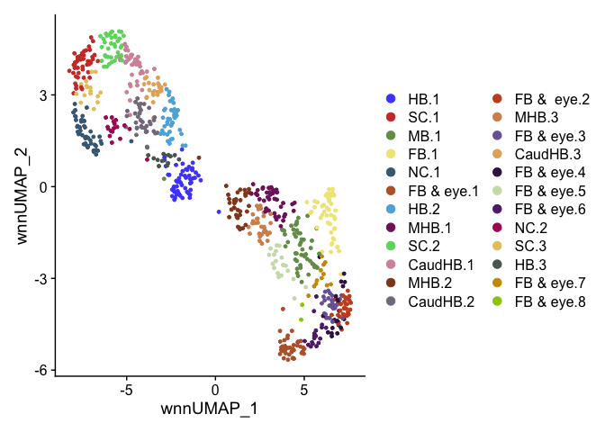
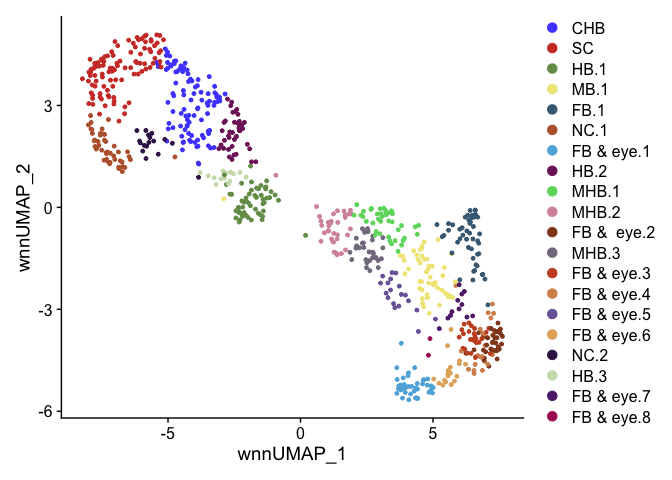
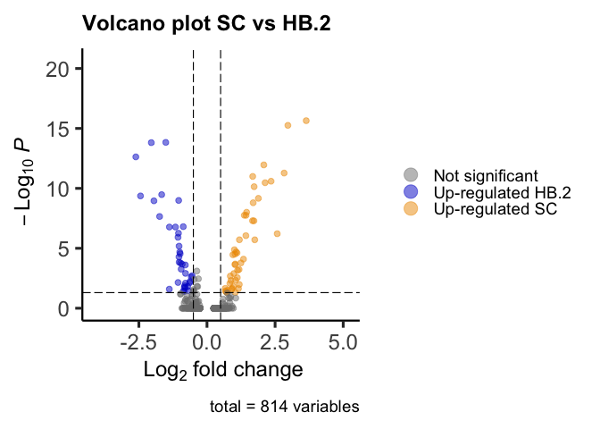
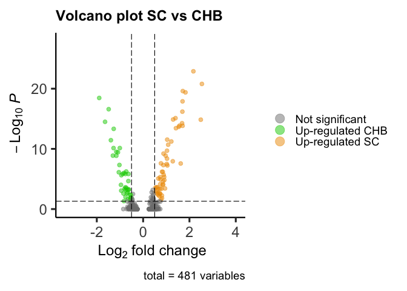
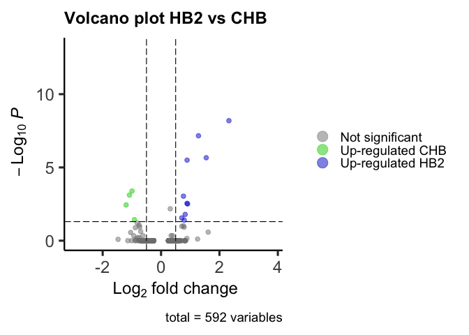
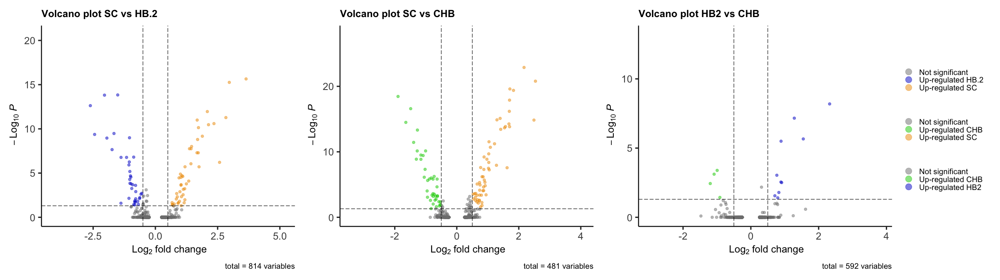

R E10 Volcano plots
================

``` r
suppressPackageStartupMessages({
  library(Seurat)
  library(Signac)
  library(EnhancedVolcano)
  library(ggsci)
  library(openxlsx)
})
```

    ## Warning: package 'EnhancedVolcano' was built under R version 4.3.1

``` r
seurat <- readRDS(file = "../data/HB10hpf_neural.RDS")
DefaultAssay(seurat) <- "SCT"
Idents(seurat) <- "Clusters"
DimPlot(seurat, reduction = "wnn.umap") + scale_color_igv()
```

<!-- -->

``` r
Idents(seurat) <- "Clusters"
seurat <- RenameIdents(seurat,
                       "CaudHB.1" = "CHB",
                       "CaudHB.2" = "CHB",
                       "CaudHB.3" = "CHB",
                       "SC.1" = "SC",
                       "SC.2" = "SC",
                       "SC.3" = "SC")
DimPlot(seurat, reduction = "wnn.umap") + scale_color_igv()
```

<!-- -->

``` r
markers.SCvsHB2 <- FindMarkers(seurat, ident.1 = "SC", ident.2 = "HB.2", verbose = F, recorrect_umi = F)
markers.SCvsHB2
```

    ##                           p_val avg_log2FC pct.1 pct.2    p_val_adj
    ## hoxc3a             1.484800e-20  3.6422431 0.990 0.073 2.251550e-16
    ## mllt3              3.648284e-20  2.9687320 0.981 0.073 5.532258e-16
    ## mafba              9.620320e-19 -1.5128127 0.000 0.634 1.458825e-14
    ## greb1l             1.010613e-18 -2.0435463 0.612 1.000 1.532493e-14
    ## epha7              1.560701e-17 -2.6121731 0.097 0.780 2.366647e-13
    ## hoxc6b             7.279657e-17  2.0860890 0.874 0.024 1.103887e-12
    ## sulf1              3.482337e-16  2.8316265 0.854 0.024 5.280615e-12
    ## raraa              6.664321e-16  1.6780605 0.961 0.488 1.010578e-11
    ## kif26ab            1.671373e-15  2.3528755 0.913 0.268 2.534469e-11
    ## arid3c             2.233775e-15  2.1332709 0.864 0.098 3.387296e-11
    ## hoxb3a             4.785053e-15  1.7299452 0.932 0.244 7.256055e-11
    ## ncam1a             2.196110e-14 -1.6630660 0.252 0.902 3.330181e-10
    ## kirrel3l           2.815967e-14 -2.4404568 0.039 0.585 4.270132e-10
    ## nradd              4.474214e-14  1.8864911 0.864 0.171 6.784698e-10
    ## sfrp5              6.699645e-14 -1.0394419 0.049 0.610 1.015934e-09
    ## cntfr              7.238630e-14 -1.9475941 0.505 0.976 1.097666e-09
    ## greb1              1.049752e-13  1.6952990 0.903 0.341 1.591844e-09
    ## hoxb7a             6.494595e-13  1.4536597 0.738 0.024 9.848403e-09
    ## cdx4               1.157680e-12  1.3690229 0.767 0.049 1.755505e-08
    ## evx1               1.162758e-12  1.4335522 0.728 0.024 1.763206e-08
    ## cdh7a              1.462252e-12 -1.7394133 0.243 0.829 2.217359e-08
    ## il17rd             3.320216e-12  1.6710515 0.806 0.171 5.034776e-08
    ## phc2a              3.369874e-12  1.7225818 0.835 0.268 5.110076e-08
    ## efnb2a             1.034349e-11 -0.8710979 0.068 0.585 1.568486e-07
    ## crabp2a            1.110882e-11 -1.1574681 0.107 0.634 1.684542e-07
    ## ror1               1.111456e-11 -1.3799325 0.155 0.707 1.685412e-07
    ## flrt3              3.637208e-11 -1.0469132 0.039 0.488 5.515462e-07
    ## XKR4               4.029832e-11  2.5779421 0.709 0.073 6.110837e-07
    ## smad3a             5.837627e-11  1.4272416 0.641 0.000 8.852178e-07
    ## dtnba              7.968272e-11 -1.0637098 0.204 0.732 1.208309e-06
    ## lypd6b             1.281174e-10  1.1900164 0.621 0.000 1.942772e-06
    ## serpinh1b          1.289897e-10  1.7533092 0.738 0.146 1.956000e-06
    ## fat3a              4.350905e-10 -1.0251678 0.359 0.854 6.597712e-06
    ## BX936418.1         8.664068e-10  1.0069864 0.583 0.000 1.313819e-05
    ## zgc:110158         1.312988e-09  1.0685712 1.000 0.805 1.991015e-05
    ## bmpr1ba            1.363761e-09 -1.0008943 0.058 0.488 2.068007e-05
    ## nhsb               1.586049e-09  1.1014020 0.573 0.000 2.405085e-05
    ## pkdcca             1.876015e-09 -0.9845030 0.049 0.463 2.844788e-05
    ## arhgef10           2.026276e-09  1.0269269 0.592 0.024 3.072645e-05
    ## hoxb6b             2.293568e-09  0.9501241 0.563 0.000 3.477966e-05
    ## zbtb16b            3.449889e-09 -1.0293882 0.058 0.463 5.231412e-05
    ## cdh6               5.301681e-09  1.3394300 0.573 0.024 8.039469e-05
    ## col4a5             9.552434e-09 -1.0211646 0.388 0.878 1.448531e-04
    ## tshz1              1.088781e-08 -0.9753116 0.223 0.707 1.651027e-04
    ## lamb1a             1.093787e-08  1.2450429 0.602 0.073 1.658619e-04
    ## hoxa9a             1.348001e-08  1.0336216 0.553 0.024 2.044109e-04
    ## skia               1.381297e-08 -0.9101194 0.136 0.585 2.094598e-04
    ## arid3b             1.535440e-08  1.0276853 0.961 0.756 2.328341e-04
    ## dbn1               1.624957e-08 -0.7952665 0.301 0.780 2.464084e-04
    ## robo1              3.632624e-08 -0.9486286 0.903 0.951 5.508511e-04
    ## celsr1a            3.889413e-08  1.1782588 0.913 0.707 5.897906e-04
    ## si:ch211-285f17.1  4.497647e-08  1.1224308 0.641 0.146 6.820232e-04
    ## adgrl1a            5.191311e-08 -0.3703684 0.000 0.268 7.872104e-04
    ## hs3st3b1b          8.193288e-08 -0.7876473 0.301 0.805 1.242430e-03
    ## apbb2b             8.460579e-08  0.9859248 0.485 0.000 1.282962e-03
    ## macrod2            1.273445e-07 -0.5439614 0.068 0.439 1.931052e-03
    ## prickle1a          1.365728e-07  0.8554760 0.553 0.073 2.070990e-03
    ## col7a1l            1.589023e-07 -0.5783080 0.019 0.317 2.409594e-03
    ## CU639469.1         1.856148e-07  1.1124867 0.544 0.073 2.814663e-03
    ## fgf3               2.306888e-07 -0.3148733 0.000 0.244 3.498165e-03
    ## meis2a.1           2.649652e-07 -0.4676548 0.039 0.366 4.017933e-03
    ## arhgap29a          3.082936e-07  1.0474274 0.631 0.146 4.674964e-03
    ## sall4              3.206294e-07  0.8812692 0.660 0.195 4.862024e-03
    ## abtb2b             3.883213e-07 -0.6239553 0.039 0.366 5.888504e-03
    ## col4a6             4.715302e-07 -1.0622338 0.563 0.878 7.150283e-03
    ## CT990561.1         5.001158e-07 -0.6370708 0.019 0.293 7.583756e-03
    ## tead1a             5.325610e-07 -0.7905286 0.456 0.805 8.075755e-03
    ## rarga              5.640234e-07  0.8409765 0.544 0.073 8.552850e-03
    ## fndc3ba            6.912076e-07  1.1856247 0.806 0.561 1.048147e-02
    ## ephb3a             8.843551e-07 -0.8214648 0.252 0.659 1.341036e-02
    ## znf710a            9.775928e-07 -0.3688412 0.029 0.317 1.482422e-02
    ## sema5ba            1.024914e-06 -0.3428877 0.000 0.220 1.554180e-02
    ## bcar3              1.025373e-06  0.9682117 0.796 0.390 1.554876e-02
    ## egr2b              1.031175e-06 -0.7085372 0.000 0.220 1.563674e-02
    ## meis2a             1.194440e-06 -0.8327149 0.194 0.585 1.811249e-02
    ## ptprn2             1.265407e-06 -0.8010170 0.146 0.512 1.918863e-02
    ## hoxd3a             1.451756e-06  0.6710515 0.447 0.024 2.201443e-02
    ## tnfrsf19           1.476145e-06  0.9220131 0.573 0.122 2.238427e-02
    ## aopep              1.513072e-06  1.1553816 0.544 0.122 2.294423e-02
    ## ntn1a              1.697017e-06 -1.3831406 0.291 0.659 2.573356e-02
    ## wnt5b              1.748754e-06  0.9090408 0.515 0.073 2.651810e-02
    ## si:ch211-216b21.2  1.811783e-06 -0.4864898 0.010 0.244 2.747388e-02
    ## rasal2             2.062197e-06  0.7600024 0.942 0.780 3.127115e-02
    ## nbeaa              2.309924e-06 -0.6820583 0.136 0.488 3.502768e-02
    ## FP102911.1         2.349854e-06 -0.4943721 0.039 0.317 3.563319e-02
    ## hoxb1b             2.351459e-06  0.6794150 0.466 0.049 3.565752e-02
    ## sox13              2.457829e-06 -0.8714007 0.621 0.854 3.727051e-02
    ## ogdha              2.526074e-06 -0.4943721 0.039 0.317 3.830538e-02
    ## asap2a             2.630593e-06 -0.8314489 0.252 0.634 3.989031e-02
    ## megf6b             2.696355e-06  0.6972038 0.398 0.000 4.088753e-02
    ## prickle1b          3.165074e-06  1.0392026 0.456 0.049 4.799518e-02
    ## spred2b            3.186115e-06  0.7192188 0.854 0.634 4.831425e-02
    ## itgb4              3.527207e-06  0.7399466 0.524 0.098 5.348656e-02
    ## adgrl3.1           4.178459e-06 -0.9723834 0.214 0.561 6.336216e-02
    ## dbx1b              4.433718e-06 -0.3703684 0.000 0.195 6.723290e-02
    ## nr2f5              4.466800e-06 -0.9732896 0.078 0.390 6.773456e-02
    ## spock1             6.094109e-06 -0.7375883 0.058 0.341 9.241106e-02
    ## lamb2l             6.366681e-06 -0.5475888 0.058 0.341 9.654435e-02
    ## efemp2b            6.517573e-06 -0.5404526 0.078 0.390 9.883248e-02
    ## rfx2               7.013015e-06  0.8710965 0.825 0.585 1.063454e-01
    ## ssbp4              9.221711e-06  0.7974998 0.942 0.854 1.398380e-01
    ## notum1a            9.410306e-06  1.0563416 0.534 0.146 1.426979e-01
    ## p3h4               9.528517e-06  0.8434405 0.709 0.293 1.444904e-01
    ## entpd1             1.087325e-05 -0.4203716 0.039 0.293 1.648819e-01
    ## znfl1h             1.133977e-05  0.5896239 0.359 0.000 1.719562e-01
    ## meis3              1.157600e-05 -0.6096849 0.126 0.463 1.755385e-01
    ## magi1b             1.163849e-05 -0.7828053 0.417 0.756 1.764861e-01
    ## rfx4               1.517926e-05 -0.7294865 0.816 0.976 2.301784e-01
    ## myh14              1.668734e-05 -0.8046820 0.165 0.488 2.530469e-01
    ## mpl                1.674449e-05 -0.3019815 0.039 0.293 2.539135e-01
    ## cemip2             1.762893e-05 -0.7027634 0.252 0.610 2.673251e-01
    ## fbxo41             1.891924e-05 -0.3428877 0.000 0.171 2.868914e-01
    ## gria4b             1.894292e-05 -0.3973355 0.000 0.171 2.872505e-01
    ## sema3d             1.895609e-05 -0.3973355 0.000 0.171 2.874502e-01
    ## hoxa4a             2.275000e-05  0.5708873 0.340 0.000 3.449810e-01
    ## pvrl2l             2.294214e-05  0.8385082 0.709 0.415 3.478946e-01
    ## si:dkey-157g16.6   2.331303e-05 -0.4988735 0.068 0.341 3.535188e-01
    ## si:ch211-191i18.2  2.478087e-05 -0.8386229 0.097 0.390 3.757771e-01
    ## zfhx3              2.777532e-05 -0.4235854 0.117 0.439 4.211850e-01
    ## CR382300.2         3.250503e-05  0.6444164 0.330 0.000 4.929062e-01
    ## lrrn1              3.519760e-05 -0.5404526 0.078 0.341 5.337363e-01
    ## jun                3.584096e-05 -0.2723650 0.010 0.195 5.434923e-01
    ## pkdccb             3.876808e-05 -0.4475930 0.019 0.220 5.878792e-01
    ## gli1               3.881746e-05 -0.5482616 0.175 0.512 5.886280e-01
    ## nlgn4xa            3.953451e-05 -0.5454403 0.010 0.195 5.995013e-01
    ## sobpb              3.997450e-05 -0.6530775 0.214 0.537 6.061733e-01
    ## tsnaxip1           4.231543e-05  0.6710515 0.359 0.024 6.416712e-01
    ## hmcn2.1            4.300084e-05  0.7705872 0.359 0.024 6.520647e-01
    ## kat6b              4.374927e-05 -0.3960627 0.019 0.220 6.634139e-01
    ## rhbdl3             4.433866e-05  0.9248081 0.495 0.122 6.723515e-01
    ## mn1b               4.546532e-05 -0.3426235 0.019 0.220 6.894362e-01
    ## si:dkey-195m11.8   4.832408e-05 -0.6035709 0.155 0.463 7.327864e-01
    ## blmh               5.631410e-05 -0.5855852 0.602 0.878 8.539470e-01
    ## adgrl2a            5.898782e-05 -0.5270757 0.932 1.000 8.944913e-01
    ## sema6bb            6.049728e-05 -0.3423690 0.029 0.244 9.173808e-01
    ## efnb2b             6.240710e-05  0.7555850 0.816 0.512 9.463413e-01
    ## hoxb5b             6.276118e-05  0.5033240 0.311 0.000 9.517105e-01
    ## mllt10             7.310753e-05 -0.7349409 0.689 0.780 1.000000e+00
    ## spsb4a             7.362467e-05  0.5899147 0.922 0.683 1.000000e+00
    ## nectin1b           7.582293e-05  0.8072559 0.864 0.659 1.000000e+00
    ## nova2              8.994878e-05 -0.6061271 0.796 0.976 1.000000e+00
    ## nckap5l            1.201719e-04  0.5425367 0.398 0.073 1.000000e+00
    ## plekhg7            1.209380e-04  0.5455206 0.330 0.024 1.000000e+00
    ## plxnb3             1.271115e-04 -0.5101888 0.155 0.463 1.000000e+00
    ## zfhx4              1.405263e-04 -0.5153616 0.107 0.366 1.000000e+00
    ## atxn7              1.409374e-04  0.5705246 0.553 0.220 1.000000e+00
    ## gli3               1.574367e-04 -0.6711807 0.660 0.829 1.000000e+00
    ## plxdc2             1.585481e-04 -0.6942330 0.388 0.683 1.000000e+00
    ## efnb3b             1.590646e-04 -0.8734968 0.408 0.659 1.000000e+00
    ## ldlrad2            1.659346e-04  0.5033240 0.282 0.000 1.000000e+00
    ## p4ha2              1.719952e-04  0.4386054 0.320 0.024 1.000000e+00
    ## her6               1.832310e-04 -0.5513409 0.029 0.220 1.000000e+00
    ## mdkb               1.854204e-04 -0.4848194 0.272 0.610 1.000000e+00
    ## ier2b              1.883446e-04 -0.2585592 0.019 0.195 1.000000e+00
    ## phldb1b            1.888503e-04  0.6411809 0.660 0.293 1.000000e+00
    ## tead1b             1.895516e-04 -0.8042865 0.350 0.634 1.000000e+00
    ## mn1a               2.007389e-04 -0.3814159 0.029 0.220 1.000000e+00
    ## dnah11.1           2.071017e-04  0.5301889 0.350 0.049 1.000000e+00
    ## rnf220a            2.177591e-04 -0.7956793 0.573 0.829 1.000000e+00
    ## gdpd5b             2.295222e-04  0.6710515 0.311 0.024 1.000000e+00
    ## plod2              2.319302e-04  0.5802860 0.272 0.000 1.000000e+00
    ## cdx1a              2.344488e-04  0.6362861 0.311 0.024 1.000000e+00
    ## s1pr2              2.367292e-04 -0.6581082 0.485 0.780 1.000000e+00
    ## fgfr1b             2.494829e-04 -0.6359263 0.680 0.878 1.000000e+00
    ## SEMA4F             2.525949e-04  0.6631894 0.408 0.098 1.000000e+00
    ## sp5l               2.585884e-04  0.7351818 0.369 0.073 1.000000e+00
    ## serinc5            2.598066e-04  0.6563550 0.718 0.463 1.000000e+00
    ## znfl1k             2.617793e-04  0.5987006 0.427 0.122 1.000000e+00
    ## homeza             3.071012e-04  0.4009623 0.262 0.000 1.000000e+00
    ## slc2a8             3.142138e-04  0.4632466 0.262 0.000 1.000000e+00
    ## necab2             3.248144e-04  0.9105174 0.534 0.220 1.000000e+00
    ## ATP9A              3.358146e-04  0.5101153 0.398 0.098 1.000000e+00
    ## fzd3a              3.473324e-04  0.6351319 0.680 0.390 1.000000e+00
    ## jarid2b            3.490582e-04 -0.5469758 0.981 1.000 1.000000e+00
    ## her3               3.544064e-04  0.7400931 0.476 0.171 1.000000e+00
    ## lmo3               3.982759e-04  0.6657377 0.660 0.341 1.000000e+00
    ## ulk1b              4.002856e-04 -0.5215936 0.243 0.585 1.000000e+00
    ## osbpl10b           4.086721e-04  0.6508736 0.709 0.341 1.000000e+00
    ## znfl1l             4.389281e-04  0.4831915 0.301 0.024 1.000000e+00
    ## fgfr4              4.421963e-04 -0.5919829 0.223 0.488 1.000000e+00
    ## slc29a1a           4.772763e-04 -0.5498575 0.252 0.537 1.000000e+00
    ## adgrv1             5.242709e-04 -0.8685311 0.388 0.610 1.000000e+00
    ## foxp4              5.473014e-04 -0.5802876 0.748 0.902 1.000000e+00
    ## map7d1a            5.524768e-04 -0.7379873 0.592 0.829 1.000000e+00
    ## ece2b              5.569842e-04  0.6046241 0.476 0.171 1.000000e+00
    ## ZNF335             5.608162e-04  0.5173421 0.417 0.122 1.000000e+00
    ## rhpn1              5.919145e-04 -0.2624531 0.049 0.244 1.000000e+00
    ## nav3               5.953945e-04 -0.2723650 0.010 0.146 1.000000e+00
    ## cdip1              5.953945e-04 -0.2723650 0.010 0.146 1.000000e+00
    ## synrg              6.240909e-04 -0.5246730 0.117 0.341 1.000000e+00
    ## eif1axa            6.361604e-04 -0.3829884 0.233 0.512 1.000000e+00
    ## adam15             6.440399e-04 -0.3289485 0.039 0.220 1.000000e+00
    ## CT573817.1         7.301441e-04 -0.2585592 0.019 0.171 1.000000e+00
    ## hoxc8a             7.753970e-04  0.3578936 0.233 0.000 1.000000e+00
    ## ttyh2              7.832263e-04  0.6006621 0.660 0.463 1.000000e+00
    ## drc1               7.855131e-04  0.4220239 0.233 0.000 1.000000e+00
    ## rassf7b            7.858328e-04  0.4324405 0.233 0.000 1.000000e+00
    ## zic3               8.316432e-04 -0.3549437 0.068 0.268 1.000000e+00
    ## tns1b              8.316737e-04 -0.4055698 0.068 0.268 1.000000e+00
    ## si:dkey-261h17.1   8.423618e-04  0.6782470 0.320 0.049 1.000000e+00
    ## celsr1b            8.766956e-04 -0.5029779 0.553 0.805 1.000000e+00
    ## nrp2b              9.186054e-04  0.9693006 0.612 0.390 1.000000e+00
    ## mex3b              9.386734e-04 -0.3544836 0.068 0.268 1.000000e+00
    ## adarb1a            9.585369e-04 -0.3418876 0.068 0.268 1.000000e+00
    ## plxna3             9.970356e-04  0.4784064 0.981 0.976 1.000000e+00
    ## dlg1l              1.004086e-03  0.6352508 0.456 0.171 1.000000e+00
    ## scube2             1.027593e-03 -0.5157170 0.155 0.390 1.000000e+00
    ## hoxb10a            1.031001e-03  0.3134995 0.223 0.000 1.000000e+00
    ## hoxa9b             1.042725e-03  0.3358673 0.223 0.000 1.000000e+00
    ## si:dkey-91m11.5    1.063996e-03  0.4427825 0.223 0.000 1.000000e+00
    ## pdzd2              1.077721e-03  0.5065574 0.583 0.293 1.000000e+00
    ## pappab             1.110957e-03 -0.5430733 0.553 0.805 1.000000e+00
    ## tcf7l1a            1.117167e-03 -0.3611289 0.184 0.463 1.000000e+00
    ## xk                 1.124530e-03  0.4170059 0.388 0.098 1.000000e+00
    ## large2             1.142058e-03  0.6609978 0.670 0.415 1.000000e+00
    ## ccdc40             1.167307e-03  0.3872585 0.262 0.024 1.000000e+00
    ## meis1b             1.181232e-03 -0.6116787 0.417 0.659 1.000000e+00
    ## tfb2m              1.186271e-03  0.3448232 0.262 0.024 1.000000e+00
    ## fbrsl1             1.202499e-03 -0.3982112 0.146 0.390 1.000000e+00
    ## prpf18             1.341480e-03 -0.2612039 0.058 0.244 1.000000e+00
    ## arhgef10lb         1.409189e-03 -0.3554207 0.049 0.220 1.000000e+00
    ## wwtr1              1.413803e-03 -0.3047010 0.146 0.390 1.000000e+00
    ## nrg1               1.415504e-03  0.3578936 0.214 0.000 1.000000e+00
    ## dnah5              1.424940e-03  0.4934086 0.214 0.000 1.000000e+00
    ## ek1                1.430792e-03  0.8302501 0.340 0.098 1.000000e+00
    ## itga9              1.431819e-03  0.5301889 0.291 0.049 1.000000e+00
    ## fgf8a              1.443386e-03  0.5483690 0.359 0.098 1.000000e+00
    ## plekhh1            1.502224e-03 -0.8908274 0.505 0.732 1.000000e+00
    ## si:ch1073-186i23.1 1.538299e-03 -0.3289485 0.136 0.366 1.000000e+00
    ## apoc1              1.544831e-03  0.5758942 0.388 0.122 1.000000e+00
    ## wls                1.574099e-03  0.5746217 0.583 0.317 1.000000e+00
    ## pax6a              1.574269e-03 -0.5598324 0.087 0.293 1.000000e+00
    ## hoxa10b            1.617741e-03  0.3340165 0.252 0.024 1.000000e+00
    ## galnt2             1.627966e-03  0.5133120 0.680 0.415 1.000000e+00
    ## eea1               1.646222e-03  0.7345544 0.456 0.220 1.000000e+00
    ## cux1a              1.681456e-03  0.5017704 0.670 0.366 1.000000e+00
    ## nsd2               1.792541e-03 -0.4519594 0.495 0.780 1.000000e+00
    ## qkib               1.792966e-03 -0.5314414 0.311 0.561 1.000000e+00
    ## CHST13             1.793585e-03  0.4915021 0.408 0.146 1.000000e+00
    ## si:ch211-269k10.2  1.794795e-03 -0.5384019 0.184 0.415 1.000000e+00
    ## cgnl1              1.822710e-03 -0.4569561 0.466 0.732 1.000000e+00
    ## kdm7aa             1.850069e-03  0.5427274 0.398 0.146 1.000000e+00
    ## hoxb9a             1.867793e-03  0.2907794 0.204 0.000 1.000000e+00
    ## ptprfb             1.877572e-03 -0.5186097 0.922 0.927 1.000000e+00
    ## ly6pge             1.884782e-03  0.3247267 0.204 0.000 1.000000e+00
    ## tsen54             1.898348e-03  0.4115316 0.204 0.000 1.000000e+00
    ## hmg20b             1.916448e-03 -0.3163485 0.107 0.317 1.000000e+00
    ## itpr2              1.942927e-03  0.6710515 0.340 0.098 1.000000e+00
    ## crnkl1             1.943830e-03 -0.3058649 0.165 0.415 1.000000e+00
    ## adamts3            1.968164e-03  0.6628310 0.311 0.073 1.000000e+00
    ## ndst3              1.992793e-03 -0.4235854 0.107 0.317 1.000000e+00
    ## lmo4a              2.035648e-03 -0.5067356 0.126 0.341 1.000000e+00
    ## pcmtd1             2.082368e-03  0.3976751 0.243 0.024 1.000000e+00
    ## pcsk6              2.084105e-03  0.4182854 0.243 0.024 1.000000e+00
    ## mta1               2.152750e-03 -0.3595801 0.592 0.805 1.000000e+00
    ## mknk2b             2.312010e-03  0.4080171 0.427 0.171 1.000000e+00
    ## zgc:66474          2.379221e-03  0.3670453 0.427 0.146 1.000000e+00
    ## LHFPL6             2.389450e-03 -0.2723650 0.010 0.122 1.000000e+00
    ## fgfr2              2.393126e-03 -0.3546352 0.340 0.585 1.000000e+00
    ## smarce1            2.435806e-03 -0.3480573 0.359 0.634 1.000000e+00
    ## bcar1              2.461157e-03  0.4909699 0.388 0.122 1.000000e+00
    ## creb3l2            2.520114e-03  0.3021842 0.194 0.000 1.000000e+00
    ## si:dkey-35m8.1     2.534576e-03 -0.3423690 0.029 0.171 1.000000e+00
    ## kpnb3              2.607141e-03 -0.4444257 0.621 0.829 1.000000e+00
    ## cox8a              2.677846e-03 -0.2939016 0.146 0.390 1.000000e+00
    ## FOXK2              2.696038e-03 -0.3537519 0.456 0.732 1.000000e+00
    ## foxb1a             2.709181e-03 -0.3414395 0.078 0.268 1.000000e+00
    ## efnb1              2.715237e-03 -0.9212906 0.194 0.390 1.000000e+00
    ## ston2              2.787462e-03 -0.5598324 0.117 0.317 1.000000e+00
    ## ankrd12            2.859094e-03  0.4288506 0.515 0.244 1.000000e+00
    ## blm                2.899715e-03 -0.3520321 0.184 0.415 1.000000e+00
    ## cyp26c1            2.902332e-03 -0.3559156 0.019 0.146 1.000000e+00
    ## rfx1b              2.976040e-03  0.2787341 0.233 0.024 1.000000e+00
    ## cadm1a             3.107367e-03  0.5420650 0.854 0.610 1.000000e+00
    ## epb41l5            3.113501e-03  0.4259390 0.398 0.146 1.000000e+00
    ## aff4               3.131833e-03 -0.4018800 0.214 0.463 1.000000e+00
    ## lypd6              3.248903e-03  0.4639552 0.262 0.049 1.000000e+00
    ## mapk15             3.348656e-03  0.2792838 0.184 0.000 1.000000e+00
    ## ccne2              3.366412e-03 -0.5567544 0.204 0.463 1.000000e+00
    ## si:ch211-139l2.1   3.376413e-03  0.3247267 0.184 0.000 1.000000e+00
    ## pkd1b              3.400952e-03  0.5131718 0.184 0.000 1.000000e+00
    ## nr6a1a             3.419249e-03 -0.4709675 0.427 0.683 1.000000e+00
    ## cachd1             3.489763e-03 -0.3346849 0.680 0.902 1.000000e+00
    ## pald1a             3.563770e-03  0.3945338 0.262 0.049 1.000000e+00
    ## ctnnd2b            3.627867e-03  0.5059922 0.670 0.390 1.000000e+00
    ## pxdn               3.628707e-03  0.4927142 0.262 0.049 1.000000e+00
    ## lef1               3.715571e-03  0.5910832 0.417 0.171 1.000000e+00
    ## nkain4             3.761570e-03  0.3935175 0.534 0.244 1.000000e+00
    ## mfhas1             3.839490e-03  0.4170059 0.388 0.146 1.000000e+00
    ## sun1               3.857584e-03  0.5290325 0.602 0.366 1.000000e+00
    ## jazf1a             3.927369e-03  0.3011019 0.223 0.024 1.000000e+00
    ## arfgef1            4.014633e-03 -0.5017851 0.398 0.610 1.000000e+00
    ## tnika              4.111284e-03 -0.4242964 0.330 0.585 1.000000e+00
    ## lrp2a              4.169942e-03 -0.4305467 0.553 0.756 1.000000e+00
    ## map3k21            4.225827e-03  0.4365862 0.320 0.098 1.000000e+00
    ## itga6a             4.272253e-03  0.4105910 0.505 0.244 1.000000e+00
    ## ttyh3a             4.357414e-03  0.4415696 0.845 0.707 1.000000e+00
    ## znfl2a             4.437624e-03  0.2560140 0.175 0.000 1.000000e+00
    ## hoxb6a             4.437745e-03  0.2676958 0.175 0.000 1.000000e+00
    ## bmpr1ab            4.575474e-03  0.5590249 0.738 0.585 1.000000e+00
    ## mns1               4.660382e-03  0.3915289 0.262 0.049 1.000000e+00
    ## srsf6b             4.674325e-03 -0.3497071 0.291 0.537 1.000000e+00
    ## prpf4bb            4.709967e-03  0.3773203 0.524 0.268 1.000000e+00
    ## lztfl1             5.108151e-03  0.3491234 0.505 0.244 1.000000e+00
    ## scrib              5.164878e-03 -0.4295809 0.738 0.902 1.000000e+00
    ## ift52              5.210141e-03  0.3121571 0.214 0.024 1.000000e+00
    ## NAV1               5.259305e-03 -0.3835549 0.709 0.951 1.000000e+00
    ## map9               5.283420e-03  0.2899613 0.214 0.024 1.000000e+00
    ## zgc:92107          5.314504e-03  0.4129833 0.505 0.244 1.000000e+00
    ## si:ch211-113a14.18 5.316573e-03  0.2674187 0.214 0.024 1.000000e+00
    ## msx1b              5.355416e-03  0.6321625 0.340 0.122 1.000000e+00
    ## sh3bgrl2           5.582764e-03 -0.3156517 0.049 0.195 1.000000e+00
    ## rreb1b             5.736029e-03  0.4048774 0.320 0.098 1.000000e+00
    ## pak6a              5.749383e-03  0.3968765 0.388 0.146 1.000000e+00
    ## prex2              5.818933e-03  0.4293456 0.320 0.098 1.000000e+00
    ## lhfpl2b            5.835640e-03 -0.3038575 0.126 0.317 1.000000e+00
    ## nhsl1b             5.934257e-03  0.4131149 0.845 0.707 1.000000e+00
    ## fam117ab           6.041154e-03 -0.3527953 0.126 0.317 1.000000e+00
    ## arhgef10la         6.046015e-03  0.5311938 0.311 0.098 1.000000e+00
    ## pbx4               6.075351e-03 -0.3529940 0.621 0.805 1.000000e+00
    ## prkd3              6.180285e-03  0.6017888 0.320 0.098 1.000000e+00
    ## gpc4               6.190458e-03 -0.4718206 0.748 0.878 1.000000e+00
    ## RSBN1              6.226288e-03  0.3714912 0.398 0.171 1.000000e+00
    ## pid1               6.338809e-03  0.3918974 0.456 0.220 1.000000e+00
    ## tfdp2              6.403999e-03 -0.5168815 0.553 0.756 1.000000e+00
    ## alcamb             6.499965e-03  0.5327721 0.951 0.878 1.000000e+00
    ## ppp3cca            6.511677e-03  0.2815491 0.485 0.195 1.000000e+00
    ## sulf2b             6.685506e-03 -0.3154020 0.039 0.171 1.000000e+00
    ## nol4la             6.823855e-03  0.3448232 0.204 0.024 1.000000e+00
    ## eif2s2             6.961527e-03  0.3748502 0.660 0.439 1.000000e+00
    ## ankrd11            6.987638e-03  0.4715657 0.883 0.854 1.000000e+00
    ## itga5              6.994719e-03  0.4080171 0.301 0.098 1.000000e+00
    ## rab30              7.040149e-03 -0.2939016 0.165 0.366 1.000000e+00
    ## ptp4a2b            7.117033e-03  0.3300146 0.485 0.220 1.000000e+00
    ## trim71             7.217838e-03 -0.3544836 0.845 0.902 1.000000e+00
    ## vat1               7.254455e-03 -0.4809516 0.097 0.268 1.000000e+00
    ## jmjd1cb            7.340987e-03  0.5171388 0.757 0.610 1.000000e+00
    ## bcor               7.539832e-03  0.3670453 0.379 0.146 1.000000e+00
    ## clocka             7.593285e-03 -0.5065914 0.282 0.488 1.000000e+00
    ## lamc1              7.619873e-03  0.5313995 0.748 0.610 1.000000e+00
    ## si:dkeyp-120h9.1   7.660726e-03 -0.3397553 0.194 0.415 1.000000e+00
    ## si:ch211-199g17.2  7.827549e-03  0.2676958 0.155 0.000 1.000000e+00
    ## usf2               8.053842e-03  0.2870409 0.282 0.073 1.000000e+00
    ## znfl1              8.067693e-03  0.3096519 0.272 0.073 1.000000e+00
    ## fbxw7              8.088425e-03 -0.3852994 0.932 0.951 1.000000e+00
    ## exoc6b             8.134983e-03 -0.3833963 0.379 0.585 1.000000e+00
    ## eef2k              8.323873e-03 -0.2734534 0.029 0.146 1.000000e+00
    ## ptk7a              8.398255e-03  0.5252006 0.456 0.268 1.000000e+00
    ## sbf2               8.446342e-03 -0.3400891 0.184 0.390 1.000000e+00
    ## actn4              8.531426e-03  0.4080171 0.864 0.707 1.000000e+00
    ## fam107b            8.539554e-03  0.5019932 0.417 0.195 1.000000e+00
    ## zeb1a              8.642294e-03 -0.2565400 0.214 0.439 1.000000e+00
    ## dab2ipb            8.673478e-03 -0.3054895 0.165 0.366 1.000000e+00
    ## nudt4a             8.748058e-03  0.4743596 0.359 0.146 1.000000e+00
    ## fbxo16             8.793924e-03  0.2932469 0.379 0.146 1.000000e+00
    ## hspa12a            8.860361e-03  0.3637278 0.233 0.049 1.000000e+00
    ## si:ch211-288g17.3  8.923731e-03 -0.3289485 0.243 0.463 1.000000e+00
    ## vent               8.998632e-03  0.2777090 0.204 0.024 1.000000e+00
    ## LO018340.1         9.000094e-03  0.2560140 0.243 0.049 1.000000e+00
    ## rnd1b              9.071949e-03 -0.3648681 0.136 0.317 1.000000e+00
    ## jag1a              9.122185e-03  0.3231282 0.194 0.024 1.000000e+00
    ## slc15a2            9.122185e-03  0.3011019 0.194 0.024 1.000000e+00
    ## sipa1l1            9.130593e-03 -0.5043905 0.621 0.780 1.000000e+00
    ## oaz1a              9.148330e-03  0.3216023 0.233 0.049 1.000000e+00
    ## arcn1a             9.198271e-03  0.3011019 0.194 0.024 1.000000e+00
    ## arglu1a            9.276445e-03  0.4311007 0.592 0.390 1.000000e+00
    ## bud23              9.340313e-03  0.2560140 0.194 0.024 1.000000e+00
    ## ifrd2              9.430477e-03  0.2671545 0.233 0.049 1.000000e+00
    ## selenon            9.483145e-03  0.3073609 0.330 0.122 1.000000e+00
    ## negr1              9.494021e-03 -0.4369312 0.485 0.683 1.000000e+00
    ## unc5b              9.574891e-03  0.5436722 0.553 0.341 1.000000e+00
    ## cwc27              9.954622e-03  0.4052400 0.466 0.268 1.000000e+00
    ## tcerg1a            1.007456e-02 -0.3173605 0.194 0.390 1.000000e+00
    ## si:ch211-212k18.5  1.013119e-02 -0.3171714 0.175 0.366 1.000000e+00
    ## ARHGEF17           1.020049e-02 -0.2800389 0.155 0.341 1.000000e+00
    ## gpm6bb             1.029591e-02 -0.3051018 0.155 0.341 1.000000e+00
    ## scg3               1.030443e-02  0.2560140 0.146 0.000 1.000000e+00
    ## larp7              1.034062e-02 -0.2612039 0.058 0.195 1.000000e+00
    ## ipo11              1.036037e-02 -0.4575327 0.612 0.805 1.000000e+00
    ## tle3b              1.037692e-02  0.4160099 0.447 0.220 1.000000e+00
    ## cox4i1             1.040762e-02 -0.2573953 0.165 0.366 1.000000e+00
    ## gli2a              1.047867e-02  0.3827060 0.903 0.732 1.000000e+00
    ## nrarpb             1.050672e-02 -0.4695469 0.233 0.415 1.000000e+00
    ## ncalda             1.051207e-02 -0.4679249 0.408 0.634 1.000000e+00
    ## igdcc4             1.057140e-02  0.6325773 0.515 0.341 1.000000e+00
    ## tcf7l1b            1.058388e-02 -0.2939016 0.175 0.366 1.000000e+00
    ## si:ch211-170d8.2   1.059698e-02  0.3738505 0.330 0.122 1.000000e+00
    ## igsf3              1.065643e-02  0.4704576 0.388 0.171 1.000000e+00
    ## prc1a              1.074521e-02  0.3073609 0.301 0.098 1.000000e+00
    ## ccdc171            1.092661e-02 -0.2536604 0.136 0.317 1.000000e+00
    ## xpo1b              1.097728e-02  0.3591075 0.466 0.244 1.000000e+00
    ## stard13b           1.163444e-02  0.5171388 0.184 0.024 1.000000e+00
    ## sox5               1.169091e-02  0.4188645 0.447 0.220 1.000000e+00
    ## wnt3a              1.189881e-02  0.3322496 0.223 0.049 1.000000e+00
    ## zcchc7             1.192325e-02 -0.3289485 0.563 0.780 1.000000e+00
    ## ctdsplb            1.193498e-02 -0.2822553 0.340 0.585 1.000000e+00
    ## notch1a            1.198723e-02  0.3552384 0.796 0.610 1.000000e+00
    ## sb:cb81            1.214417e-02  0.3024069 0.369 0.146 1.000000e+00
    ## fbxo11a            1.238662e-02  0.4821488 0.505 0.293 1.000000e+00
    ## nr2c1              1.277116e-02  0.3409029 0.252 0.073 1.000000e+00
    ## per2               1.284865e-02 -0.2774182 0.087 0.244 1.000000e+00
    ## zgc:77158          1.306549e-02 -0.3701712 0.214 0.415 1.000000e+00
    ## cxadr              1.312142e-02  0.4155903 0.515 0.293 1.000000e+00
    ## vdrb               1.316204e-02  0.3555497 0.456 0.244 1.000000e+00
    ## specc1la           1.321066e-02  0.3440105 0.447 0.220 1.000000e+00
    ## ccng2              1.358258e-02  0.3358673 0.136 0.000 1.000000e+00
    ## oc90               1.359541e-02  0.3469225 0.136 0.000 1.000000e+00
    ## dmd                1.379815e-02  0.3821911 0.612 0.415 1.000000e+00
    ## itm2ba             1.409929e-02  0.3548674 0.340 0.146 1.000000e+00
    ## cnot10             1.413433e-02 -0.3065807 0.214 0.415 1.000000e+00
    ## lin54              1.420454e-02  0.3591075 0.282 0.098 1.000000e+00
    ## cxcr4a             1.437224e-02  0.3305609 0.252 0.073 1.000000e+00
    ## cx43.4             1.456343e-02  0.4215319 0.728 0.610 1.000000e+00
    ## dclk2a             1.460862e-02 -0.3642816 0.126 0.293 1.000000e+00
    ## mak                1.501935e-02  0.2777090 0.252 0.073 1.000000e+00
    ## prickle2b          1.502196e-02 -0.3865360 0.699 0.927 1.000000e+00
    ## PHF21B             1.523064e-02  0.3491234 0.466 0.244 1.000000e+00
    ## nrip1b             1.541379e-02  0.3843381 0.214 0.049 1.000000e+00
    ## plk3               1.566671e-02  0.3216023 0.214 0.049 1.000000e+00
    ## pard6gb            1.575227e-02  0.3231282 0.175 0.024 1.000000e+00
    ## mibp               1.607714e-02 -0.4452726 0.214 0.390 1.000000e+00
    ## pfkfb1             1.617221e-02  0.2560140 0.175 0.024 1.000000e+00
    ## adam8a             1.630324e-02  0.2560140 0.175 0.024 1.000000e+00
    ## ccdc93             1.642612e-02  0.2560140 0.214 0.049 1.000000e+00
    ## nop56              1.671138e-02 -0.2518723 0.835 0.902 1.000000e+00
    ## pax3b              1.672799e-02 -0.3289485 0.049 0.171 1.000000e+00
    ## atrnl1b            1.695251e-02  0.2877228 0.709 0.488 1.000000e+00
    ## abhd17c            1.698878e-02  0.3099528 0.660 0.439 1.000000e+00
    ## aspm               1.746709e-02  0.4390440 0.592 0.341 1.000000e+00
    ## eya3               1.754179e-02 -0.2933246 0.165 0.341 1.000000e+00
    ## fscn1a             1.765586e-02 -0.3416596 0.078 0.220 1.000000e+00
    ## afdna              1.771298e-02 -0.4700408 0.748 0.829 1.000000e+00
    ## chrd               1.845923e-02  0.7961467 0.718 0.732 1.000000e+00
    ## smad5              1.858310e-02  0.3356311 0.311 0.122 1.000000e+00
    ## si:dkey-23f9.4     1.889593e-02  0.3073609 0.282 0.098 1.000000e+00
    ## cdk16              1.890452e-02  0.3872585 0.505 0.293 1.000000e+00
    ## hif1ab             1.895330e-02  0.4545597 0.563 0.390 1.000000e+00
    ## prim2              1.909040e-02 -0.5013126 0.495 0.634 1.000000e+00
    ## adamts18           1.919789e-02  0.3575520 0.466 0.268 1.000000e+00
    ## zmiz1a             1.923779e-02  0.4863116 0.786 0.732 1.000000e+00
    ## lrrfip1a           1.925168e-02  0.2990827 0.243 0.073 1.000000e+00
    ## dag1               1.963781e-02 -0.3823878 0.845 0.951 1.000000e+00
    ## pcdh2g28           1.991147e-02  0.3356311 0.330 0.146 1.000000e+00
    ## fam171a1           1.992182e-02 -0.2607770 0.204 0.390 1.000000e+00
    ## fasn               2.008227e-02  0.2968863 0.505 0.293 1.000000e+00
    ## kat14              2.009308e-02 -0.2774182 0.097 0.244 1.000000e+00
    ## phgdh              2.018870e-02  0.2560140 0.320 0.122 1.000000e+00
    ## gigyf1a            2.024942e-02  0.2981395 0.272 0.098 1.000000e+00
    ## spry4              2.051754e-02  0.3462118 0.515 0.293 1.000000e+00
    ## panx1a             2.054569e-02  0.2891808 0.204 0.049 1.000000e+00
    ## zic2b              2.064457e-02  0.3909436 0.408 0.220 1.000000e+00
    ## dnmt3bb.1          2.071315e-02  0.3121571 0.165 0.024 1.000000e+00
    ## col5a1             2.090139e-02  0.2899613 0.165 0.024 1.000000e+00
    ## bckdk              2.097196e-02 -0.3497071 0.214 0.390 1.000000e+00
    ## tuba8l4            2.116749e-02 -0.3203865 0.427 0.585 1.000000e+00
    ## hoxd4a             2.126833e-02  0.2674187 0.165 0.024 1.000000e+00
    ## ppp2r2d            2.145236e-02 -0.3478075 0.350 0.537 1.000000e+00
    ## rps12              2.163530e-02 -0.3229498 0.738 0.780 1.000000e+00
    ## ppp2r1ba           2.185815e-02  0.3052575 0.330 0.146 1.000000e+00
    ## setd5              2.191148e-02 -0.2760966 0.262 0.463 1.000000e+00
    ## atp11c             2.231043e-02  0.3670453 0.340 0.146 1.000000e+00
    ## prtfdc1            2.238172e-02  0.3201443 0.233 0.073 1.000000e+00
    ## eif4g3a            2.248862e-02  0.3543161 0.417 0.220 1.000000e+00
    ## tnfsf10l           2.272160e-02  0.2560140 0.311 0.122 1.000000e+00
    ## fam222a            2.284197e-02  0.3622134 0.301 0.122 1.000000e+00
    ## ppp1r14c           2.335103e-02  0.3134995 0.117 0.000 1.000000e+00
    ## kiz                2.339909e-02  0.3777593 0.408 0.220 1.000000e+00
    ## sept12             2.453946e-02 -0.3808763 0.466 0.683 1.000000e+00
    ## cbfa2t2            2.455329e-02 -0.4317081 0.311 0.488 1.000000e+00
    ## hsdl2              2.499814e-02  0.2662097 0.272 0.098 1.000000e+00
    ## pknox1.1           2.510079e-02  0.2560140 0.233 0.073 1.000000e+00
    ## sh3bp4a            2.512846e-02  0.4896046 0.466 0.293 1.000000e+00
    ## ash1l              2.551394e-02  0.3268353 0.437 0.244 1.000000e+00
    ## mylk3              2.565481e-02 -0.3081900 0.214 0.415 1.000000e+00
    ## larp1b             2.569283e-02 -0.3799325 0.214 0.390 1.000000e+00
    ## dusp2              2.570628e-02 -0.3289485 0.029 0.122 1.000000e+00
    ## edil3a             2.613605e-02  0.5455206 0.155 0.024 1.000000e+00
    ## anapc1             2.629211e-02 -0.3448901 0.476 0.610 1.000000e+00
    ## ephb1              2.634744e-02 -0.3163485 0.087 0.220 1.000000e+00
    ## ndst2b             2.655473e-02 -0.3047010 0.136 0.293 1.000000e+00
    ## arid1b             2.664941e-02  0.2877228 0.563 0.366 1.000000e+00
    ## aebp1              2.684375e-02  0.2891808 0.194 0.049 1.000000e+00
    ## rpl10a             2.689874e-02 -0.3118750 0.699 0.805 1.000000e+00
    ## chsy1              2.702142e-02  0.3982855 0.854 0.707 1.000000e+00
    ## draxin             2.715664e-02  0.3231282 0.155 0.024 1.000000e+00
    ## bmpr2a             2.728316e-02  0.2782097 0.194 0.049 1.000000e+00
    ## lama1              2.745975e-02  0.4028554 0.485 0.317 1.000000e+00
    ## cdh2               2.747785e-02 -0.3255817 0.903 0.927 1.000000e+00
    ## zfand5a            2.750480e-02 -0.3524075 0.165 0.317 1.000000e+00
    ## ssbp3a             2.772142e-02  0.2560140 0.194 0.049 1.000000e+00
    ## fnbp1l             2.794629e-02  0.4896046 0.456 0.293 1.000000e+00
    ## kmt2e              2.806982e-02  0.3115091 0.388 0.195 1.000000e+00
    ## safb               2.885432e-02  0.3773203 0.485 0.317 1.000000e+00
    ## rpl8               2.896089e-02 -0.2723650 0.583 0.756 1.000000e+00
    ## man1a2             2.914912e-02  0.2914628 0.583 0.366 1.000000e+00
    ## rps14              2.999519e-02 -0.4327843 0.592 0.659 1.000000e+00
    ## auts2a             3.007608e-02 -0.3870515 0.282 0.439 1.000000e+00
    ## kdm6a              3.024553e-02  0.3676593 0.728 0.512 1.000000e+00
    ## nectin3b           3.025235e-02  0.4080171 0.408 0.244 1.000000e+00
    ## rapgef2            3.034020e-02 -0.3289485 0.369 0.561 1.000000e+00
    ## dctd               3.041716e-02 -0.2659387 0.107 0.244 1.000000e+00
    ## ldb1a              3.053662e-02  0.2560140 0.592 0.366 1.000000e+00
    ## gfra1b             3.054276e-02  0.2907794 0.107 0.000 1.000000e+00
    ## pnx                3.055065e-02  0.3578936 0.107 0.000 1.000000e+00
    ## ppp2r5ea           3.079185e-02  0.3052575 0.340 0.171 1.000000e+00
    ## nsun2              3.080415e-02  0.3006830 0.417 0.220 1.000000e+00
    ## igsf9b             3.104767e-02  0.2657950 0.350 0.171 1.000000e+00
    ## kif20ba            3.116023e-02  0.3201443 0.223 0.073 1.000000e+00
    ## RANBP2             3.154720e-02 -0.2536604 0.126 0.268 1.000000e+00
    ## zeb2b              3.168774e-02  0.3400782 0.369 0.195 1.000000e+00
    ## prdm11             3.257579e-02  0.2777090 0.223 0.073 1.000000e+00
    ## kansl3             3.257618e-02  0.2669023 0.223 0.073 1.000000e+00
    ## snd1               3.261819e-02  0.4576478 0.786 0.659 1.000000e+00
    ## tax1bp1b           3.295776e-02  0.3640737 0.544 0.390 1.000000e+00
    ## sp5a               3.298487e-02  0.2877228 0.252 0.098 1.000000e+00
    ## hyal2b             3.300295e-02 -0.3870515 0.282 0.463 1.000000e+00
    ## znf281b            3.310886e-02 -0.2708456 0.359 0.561 1.000000e+00
    ## lsm3               3.311838e-02 -0.2858798 0.272 0.439 1.000000e+00
    ## clmn               3.352277e-02 -0.2607770 0.204 0.366 1.000000e+00
    ## usp36              3.393754e-02  0.3714912 0.398 0.244 1.000000e+00
    ## nfasca             3.434933e-02 -0.2845544 0.175 0.341 1.000000e+00
    ## sbf1               3.483059e-02  0.2872086 0.534 0.341 1.000000e+00
    ## adcy7              3.515038e-02  0.3666580 0.252 0.098 1.000000e+00
    ## si:dkey-258f14.2   3.537186e-02  0.3174145 0.282 0.122 1.000000e+00
    ## tcirg1b            3.571270e-02  0.3033197 0.291 0.122 1.000000e+00
    ## wu:fi36a10         3.584875e-02  0.2674187 0.146 0.024 1.000000e+00
    ## znf1153.1          3.655554e-02  0.2560140 0.282 0.122 1.000000e+00
    ## api5               3.677140e-02  0.3193399 0.417 0.244 1.000000e+00
    ## acin1a             3.689868e-02  0.4557458 0.796 0.659 1.000000e+00
    ## tuba8l             3.710447e-02 -0.3368106 0.534 0.683 1.000000e+00
    ## letm1              3.726236e-02 -0.3516686 0.650 0.732 1.000000e+00
    ## tlk1b              3.739838e-02  0.3052575 0.311 0.146 1.000000e+00
    ## rpl37.1            3.741670e-02 -0.3569629 0.689 0.854 1.000000e+00
    ## lpcat1             3.756833e-02  0.2870409 0.252 0.098 1.000000e+00
    ## kansl1a            3.770300e-02  0.2836262 0.621 0.415 1.000000e+00
    ## mapk11             3.778959e-02 -0.2536604 0.107 0.244 1.000000e+00
    ## apela              3.785506e-02  0.3676593 0.456 0.268 1.000000e+00
    ## tnrc18             3.788064e-02  0.3002138 0.680 0.537 1.000000e+00
    ## BX284638.2         3.843518e-02 -0.3124604 0.388 0.537 1.000000e+00
    ## edc3               3.853976e-02  0.2641419 0.447 0.244 1.000000e+00
    ## arvcfb             3.975228e-02 -0.3527953 0.117 0.244 1.000000e+00
    ## uxs1               4.005815e-02 -0.3385987 0.320 0.488 1.000000e+00
    ## si:ch211-271b14.1  4.013574e-02  0.2763340 0.282 0.122 1.000000e+00
    ## mbd1a              4.034244e-02 -0.2576898 0.427 0.634 1.000000e+00
    ## creb1b             4.088753e-02  0.2740479 0.379 0.195 1.000000e+00
    ## dhrs11a            4.090880e-02 -0.3038575 0.117 0.244 1.000000e+00
    ## fhl3a              4.112104e-02  0.2560140 0.184 0.049 1.000000e+00
    ## uvrag              4.113441e-02  0.2815491 0.408 0.220 1.000000e+00
    ## atl2               4.116396e-02  0.2560140 0.214 0.073 1.000000e+00
    ## poc5               4.118756e-02  0.2772305 0.243 0.098 1.000000e+00
    ## cpm                4.120093e-02  0.2981395 0.243 0.098 1.000000e+00
    ## brd2a              4.125802e-02  0.2759135 0.786 0.634 1.000000e+00
    ## trip12             4.125926e-02  0.2862286 0.563 0.390 1.000000e+00
    ## ncam1b             4.156057e-02  0.4603725 0.243 0.098 1.000000e+00
    ## peli1b             4.163590e-02  0.3084814 0.398 0.220 1.000000e+00
    ## espl1              4.167762e-02  0.2560140 0.311 0.146 1.000000e+00
    ## khdrbs1b           4.168402e-02 -0.2790233 0.301 0.488 1.000000e+00
    ## tasor2             4.190603e-02 -0.3918798 0.369 0.512 1.000000e+00
    ## ptprga             4.204720e-02  0.3696708 0.466 0.293 1.000000e+00
    ## ddx23              4.217554e-02 -0.2554864 0.301 0.463 1.000000e+00
    ## sh3gl1b            4.237334e-02  0.2666612 0.243 0.098 1.000000e+00
    ## ddr1               4.247257e-02  0.4007855 0.485 0.317 1.000000e+00
    ## elmo1              4.310594e-02 -0.2768600 0.262 0.415 1.000000e+00
    ## neo1a              4.316327e-02  0.3401600 0.816 0.780 1.000000e+00
    ## agbl4.1            4.334359e-02 -0.2877259 0.184 0.341 1.000000e+00
    ## tuba1a             4.357675e-02  0.2560140 0.243 0.098 1.000000e+00
    ## zeb1b              4.364062e-02 -0.4463055 0.913 0.902 1.000000e+00
    ## sema3aa            4.386204e-02  0.3428188 0.175 0.049 1.000000e+00
    ## nr3c1              4.501728e-02  0.3281638 0.583 0.415 1.000000e+00
    ## smad6b             4.532539e-02  0.2891808 0.175 0.049 1.000000e+00
    ## kdm3b              4.535771e-02  0.2657950 0.330 0.171 1.000000e+00
    ## wdr18              4.548857e-02 -0.3954439 0.553 0.683 1.000000e+00
    ## sash1a             4.576121e-02  0.3360133 0.670 0.537 1.000000e+00
    ## hspa8              4.609682e-02 -0.2729145 0.563 0.732 1.000000e+00
    ## asxl1              4.662856e-02 -0.2684070 0.320 0.488 1.000000e+00
    ## frmd4ba            4.671355e-02  0.2620885 0.660 0.537 1.000000e+00
    ## pola1              4.674339e-02 -0.3809432 0.534 0.659 1.000000e+00
    ## bmpr1aa            4.681835e-02  0.2691295 0.641 0.439 1.000000e+00
    ## pcna               4.793422e-02 -0.2509460 0.408 0.585 1.000000e+00
    ## st8sia2            4.850981e-02 -0.3289485 0.087 0.195 1.000000e+00
    ## rtn4a              4.894549e-02  0.2770756 0.544 0.341 1.000000e+00
    ## fzd7a              4.947414e-02 -0.2921118 0.136 0.268 1.000000e+00
    ## rabl2              4.975044e-02  0.2877228 0.233 0.098 1.000000e+00
    ## cstf3              5.078229e-02  0.2997354 0.553 0.390 1.000000e+00
    ## lrrc8c             5.096196e-02  0.2657950 0.330 0.171 1.000000e+00
    ## sptbn2             5.122178e-02  0.3084814 0.233 0.098 1.000000e+00
    ## ppig               5.196426e-02  0.3326353 0.456 0.341 1.000000e+00
    ## dcbld1             5.203642e-02 -0.2648182 0.583 0.732 1.000000e+00
    ## uhrf1              5.276387e-02 -0.3664232 0.301 0.439 1.000000e+00
    ## tyw1               5.361978e-02  0.2635085 0.544 0.366 1.000000e+00
    ## bmp2k              5.402782e-02  0.3623660 0.485 0.341 1.000000e+00
    ## fkbp9              5.412165e-02  0.2755102 0.340 0.195 1.000000e+00
    ## sulf2a             5.425725e-02 -0.3787016 0.087 0.195 1.000000e+00
    ## tiparp             5.441125e-02 -0.2858798 0.243 0.390 1.000000e+00
    ## rps6               5.499276e-02  0.2753793 0.660 0.512 1.000000e+00
    ## phf21aa            5.530830e-02  0.2632820 0.524 0.341 1.000000e+00
    ## myo1b              5.590447e-02  0.2654127 0.330 0.171 1.000000e+00
    ## upf1               5.645851e-02  0.2872086 0.524 0.366 1.000000e+00
    ## rnf19a             5.704905e-02 -0.2730953 0.350 0.512 1.000000e+00
    ## XPO5               5.776457e-02  0.2829810 0.408 0.244 1.000000e+00
    ## cacna1bb           5.820289e-02 -0.3019815 0.039 0.122 1.000000e+00
    ## ncln               5.858523e-02  0.2560140 0.165 0.049 1.000000e+00
    ## lmnb1              5.912484e-02  0.3243200 0.437 0.293 1.000000e+00
    ## zic2a              5.953612e-02  0.2560140 0.165 0.049 1.000000e+00
    ## hira               5.965326e-02  0.2857613 0.505 0.317 1.000000e+00
    ## tle3a              5.986467e-02  0.3434768 0.515 0.390 1.000000e+00
    ## ncoa3              6.008171e-02  0.3591075 0.592 0.439 1.000000e+00
    ## pax3a              6.011344e-02  0.6750095 0.456 0.317 1.000000e+00
    ## fgfr3              6.025895e-02 -0.2628593 0.175 0.317 1.000000e+00
    ## prkacaa            6.031680e-02  0.2560140 0.233 0.098 1.000000e+00
    ## pyroxd2            6.048449e-02  0.2560140 0.165 0.049 1.000000e+00
    ## rpl13a             6.111656e-02 -0.3118750 0.437 0.585 1.000000e+00
    ## tmtc2b             6.152350e-02 -0.2783224 0.087 0.195 1.000000e+00
    ## rbbp6              6.194692e-02  0.2615950 0.709 0.512 1.000000e+00
    ## tspan7             6.216447e-02  0.2737160 0.417 0.244 1.000000e+00
    ## ppp1r14bb          6.232477e-02  0.2755102 0.340 0.195 1.000000e+00
    ## llgl1              6.258746e-02 -0.3442153 0.495 0.610 1.000000e+00
    ## mycbp2             6.295335e-02  0.2560140 0.670 0.537 1.000000e+00
    ## nid2a              6.340459e-02  0.3187497 0.223 0.098 1.000000e+00
    ## shroom2a           6.340968e-02  0.2755102 0.301 0.146 1.000000e+00
    ## arhgef37           6.344074e-02  0.2777090 0.194 0.073 1.000000e+00
    ## dync1li2           6.429457e-02 -0.2690771 0.184 0.317 1.000000e+00
    ## clybl              6.445390e-02  0.2990827 0.165 0.049 1.000000e+00
    ## cep350             6.481285e-02  0.3231282 0.330 0.195 1.000000e+00
    ## tesk2              6.487546e-02  0.2669023 0.194 0.073 1.000000e+00
    ## tmem131l           6.540739e-02 -0.3208662 0.398 0.561 1.000000e+00
    ## wdr33              6.585638e-02  0.3250556 0.563 0.415 1.000000e+00
    ## hp1bp3             6.713883e-02  0.2747505 0.359 0.220 1.000000e+00
    ## rplp2l             6.760771e-02 -0.2984464 0.670 0.756 1.000000e+00
    ## trit1              6.819005e-02  0.3847473 0.631 0.610 1.000000e+00
    ## hnrnpl             6.890383e-02  0.2628676 0.612 0.463 1.000000e+00
    ## ect2               6.948034e-02 -0.2529997 0.320 0.488 1.000000e+00
    ## hpca               6.955407e-02 -0.4277267 0.194 0.317 1.000000e+00
    ## CT009620.1         6.963484e-02 -0.2708456 0.330 0.488 1.000000e+00
    ## numbl              6.972174e-02 -0.3437455 0.466 0.585 1.000000e+00
    ## st3gal5            6.999119e-02  0.2560140 0.282 0.146 1.000000e+00
    ## hnrnpaba           7.043317e-02 -0.2789078 0.456 0.585 1.000000e+00
    ## znf976             7.056028e-02  0.2654127 0.340 0.195 1.000000e+00
    ## ptp4a1             7.082476e-02 -0.2576898 0.427 0.585 1.000000e+00
    ## caprin1a           7.124698e-02  0.2560140 0.524 0.366 1.000000e+00
    ## apc                7.125921e-02 -0.3075749 0.272 0.390 1.000000e+00
    ## ranbp10            7.266222e-02  0.2560140 0.252 0.122 1.000000e+00
    ## maml3              7.283951e-02  0.2829810 0.806 0.610 1.000000e+00
    ## luc7l3             7.420460e-02  0.2652325 0.369 0.220 1.000000e+00
    ## qrich1             7.481594e-02 -0.3090490 0.311 0.463 1.000000e+00
    ## slc25a18           7.509044e-02  0.2657950 0.311 0.171 1.000000e+00
    ## ep300b             7.547405e-02 -0.2502916 0.699 0.805 1.000000e+00
    ## maml1              7.598489e-02  0.3006830 0.379 0.244 1.000000e+00
    ## agap3              7.598947e-02  0.3696708 0.476 0.366 1.000000e+00
    ## pde3b              7.624768e-02  0.2654127 0.340 0.195 1.000000e+00
    ## swt1               7.645887e-02  0.2725021 0.437 0.268 1.000000e+00
    ## bahcc1a            7.651384e-02  0.2560140 0.524 0.366 1.000000e+00
    ## wnt11              7.652929e-02  0.4313811 0.301 0.171 1.000000e+00
    ## zc3h18             7.674925e-02  0.2817771 0.670 0.585 1.000000e+00
    ## si:ch73-1a9.3      7.712986e-02  0.2916379 0.699 0.585 1.000000e+00
    ## si:dkey-286j15.1   7.717981e-02  0.3417439 0.320 0.195 1.000000e+00
    ## dennd5b            7.753349e-02  0.3057670 0.417 0.268 1.000000e+00
    ## patj               7.804409e-02  0.2845831 0.330 0.195 1.000000e+00
    ## cmip               7.821285e-02 -0.2536604 0.126 0.244 1.000000e+00
    ## cdc14b             7.908999e-02  0.2714440 0.505 0.341 1.000000e+00
    ## foxj1a             7.930907e-02  0.3011019 0.117 0.024 1.000000e+00
    ## supt6h             7.955829e-02  0.2747505 0.330 0.195 1.000000e+00
    ## hnf1ba             7.960351e-02 -0.4544794 0.233 0.341 1.000000e+00
    ## slc39a10           7.985180e-02 -0.3289485 0.233 0.366 1.000000e+00
    ## snx33              8.030267e-02  0.2560140 0.252 0.122 1.000000e+00
    ## srgap2             8.089975e-02 -0.2700548 0.641 0.756 1.000000e+00
    ## rhebl1             8.153996e-02 -0.3163485 0.117 0.220 1.000000e+00
    ## rangap1b           8.157460e-02 -0.3385987 0.330 0.463 1.000000e+00
    ## tbc1d23            8.199834e-02 -0.3167738 0.136 0.244 1.000000e+00
    ## grk4               8.312395e-02  0.3714912 0.534 0.439 1.000000e+00
    ## aplp2              8.432490e-02 -0.2850052 0.573 0.683 1.000000e+00
    ## si:ch211-266k8.4   8.453521e-02  0.2669023 0.184 0.073 1.000000e+00
    ## ell                8.466635e-02 -0.2738070 0.379 0.512 1.000000e+00
    ## glceb              8.578006e-02  0.2870409 0.243 0.122 1.000000e+00
    ## hnrnpl2            8.671949e-02 -0.2726803 0.495 0.610 1.000000e+00
    ## inavaa             8.758126e-02 -0.2648182 0.078 0.171 1.000000e+00
    ## si:ch211-212g7.6   8.766144e-02  0.2560140 0.272 0.146 1.000000e+00
    ## fign               8.784366e-02  0.3231282 0.583 0.463 1.000000e+00
    ## trmt44             8.785425e-02  0.3309760 0.340 0.220 1.000000e+00
    ## rad18              8.838548e-02 -0.4207410 0.272 0.390 1.000000e+00
    ## dnmt3ba            8.876753e-02  0.3110553 0.495 0.366 1.000000e+00
    ## clstn1             8.982506e-02  0.2656000 0.330 0.195 1.000000e+00
    ## acin1b             9.069264e-02 -0.2571578 0.583 0.732 1.000000e+00
    ## abca1a             9.130436e-02  0.2560140 0.243 0.122 1.000000e+00
    ## ndnl2              9.184462e-02  0.2560140 0.214 0.098 1.000000e+00
    ## C7H20orf27         9.186881e-02  0.3504296 0.524 0.415 1.000000e+00
    ## bmpr2b             9.219180e-02  0.3802721 0.466 0.366 1.000000e+00
    ## atp2b4             9.227845e-02 -0.4485301 0.427 0.512 1.000000e+00
    ## tenm3              9.278142e-02 -0.4544794 0.330 0.463 1.000000e+00
    ## med25              9.497205e-02  0.2662097 0.243 0.122 1.000000e+00
    ## gtf2f1             9.661089e-02  0.2560140 0.320 0.195 1.000000e+00
    ## bin3               9.662232e-02  0.2560140 0.301 0.171 1.000000e+00
    ## stau2              9.703378e-02 -0.3029533 0.621 0.756 1.000000e+00
    ## ucp2               9.744079e-02 -0.2760966 0.252 0.390 1.000000e+00
    ## rin2               9.792510e-02  0.3211090 0.524 0.415 1.000000e+00
    ## rnf111             9.901098e-02  0.2640068 0.495 0.341 1.000000e+00
    ## tmsb4x             9.989813e-02 -0.4610521 0.350 0.463 1.000000e+00
    ## prpf3              9.991009e-02  0.2560140 0.456 0.317 1.000000e+00
    ## bcam               1.018645e-01  0.2560140 0.146 0.049 1.000000e+00
    ## si:ch211-160f23.5  1.035979e-01  0.2560140 0.330 0.195 1.000000e+00
    ## prkcbb             1.047919e-01  0.2751228 0.272 0.146 1.000000e+00
    ## vaspb              1.050165e-01  0.2834947 0.388 0.268 1.000000e+00
    ## epb41a             1.057458e-01 -0.3897026 0.456 0.561 1.000000e+00
    ## sipa1l3            1.061015e-01  0.3454131 0.563 0.512 1.000000e+00
    ## asap1b             1.067397e-01  0.2780403 0.524 0.390 1.000000e+00
    ## nfia               1.115526e-01  0.2560140 0.466 0.317 1.000000e+00
    ## epha4b             1.120611e-01 -0.2965270 0.175 0.293 1.000000e+00
    ## nup98              1.122213e-01 -0.2914738 0.388 0.488 1.000000e+00
    ## hmgb2b             1.141071e-01 -0.2509460 0.243 0.366 1.000000e+00
    ## wasf3b             1.148501e-01  0.3054020 0.573 0.463 1.000000e+00
    ## metrnla            1.157872e-01 -0.3062284 0.184 0.293 1.000000e+00
    ## nid1b              1.158100e-01  0.2834947 0.340 0.220 1.000000e+00
    ## ssrp1a             1.162333e-01 -0.2621795 0.524 0.683 1.000000e+00
    ## caskin1            1.169563e-01 -0.3029533 0.068 0.146 1.000000e+00
    ## atp5f1d            1.190891e-01  0.2657950 0.311 0.195 1.000000e+00
    ## cenpf              1.203585e-01  0.3478528 0.485 0.366 1.000000e+00
    ## iqca1              1.218304e-01  0.3471619 0.223 0.122 1.000000e+00
    ## lmnb2              1.256559e-01 -0.2561922 0.495 0.610 1.000000e+00
    ## rptor              1.270593e-01  0.2840284 0.544 0.439 1.000000e+00
    ## zmynd11            1.273871e-01 -0.3075749 0.233 0.341 1.000000e+00
    ## urb1               1.282253e-01 -0.2933246 0.398 0.512 1.000000e+00
    ## fut8a              1.284494e-01 -0.2816428 0.379 0.488 1.000000e+00
    ## robo3              1.286096e-01  0.3375793 0.845 0.878 1.000000e+00
    ## etv4               1.310604e-01  0.3591075 0.553 0.463 1.000000e+00
    ## clip2              1.325183e-01  0.2722242 0.456 0.341 1.000000e+00
    ## mcmbp              1.333580e-01 -0.2561922 0.146 0.244 1.000000e+00
    ## si:ch211-155k24.9  1.340085e-01  0.2840284 0.330 0.220 1.000000e+00
    ## ldlrad4a           1.354575e-01  0.2560140 0.165 0.073 1.000000e+00
    ## zranb2             1.357664e-01 -0.2565400 0.262 0.366 1.000000e+00
    ## kmt2bb             1.381599e-01  0.2599504 0.854 0.829 1.000000e+00
    ## cdon               1.383308e-01  0.3340165 0.417 0.317 1.000000e+00
    ## nat8l              1.395017e-01  0.3698819 0.553 0.439 1.000000e+00
    ## esrrga             1.398178e-01  0.2863876 0.223 0.122 1.000000e+00
    ## fnbp4              1.403024e-01 -0.2576898 0.408 0.537 1.000000e+00
    ## ift140             1.416322e-01  0.2652325 0.340 0.220 1.000000e+00
    ## ptch2              1.422847e-01 -0.2686480 0.340 0.463 1.000000e+00
    ## pank2              1.427012e-01  0.2759135 0.272 0.171 1.000000e+00
    ## camk2g2            1.432644e-01 -0.2983602 0.301 0.415 1.000000e+00
    ## selenof            1.439231e-01  0.2845831 0.301 0.195 1.000000e+00
    ## slc12a2            1.445185e-01  0.2618667 0.670 0.585 1.000000e+00
    ## diaph2             1.449265e-01  0.2663190 0.680 0.610 1.000000e+00
    ## pkn1a              1.451598e-01  0.2740479 0.379 0.268 1.000000e+00
    ## atad5a             1.494030e-01 -0.2509460 0.359 0.463 1.000000e+00
    ## ubr1               1.509976e-01 -0.2939016 0.175 0.268 1.000000e+00
    ## aff2               1.513001e-01 -0.2639931 0.272 0.390 1.000000e+00
    ## ttc17              1.521458e-01 -0.2607770 0.214 0.317 1.000000e+00
    ## cdk6               1.527448e-01 -0.2569987 0.495 0.610 1.000000e+00
    ## tlk1a              1.533790e-01 -0.2803683 0.359 0.463 1.000000e+00
    ## eif4g3b            1.552154e-01 -0.2600534 0.621 0.659 1.000000e+00
    ## lrig2              1.556955e-01 -0.2692423 0.340 0.439 1.000000e+00
    ## adka               1.567392e-01 -0.2854469 0.757 0.780 1.000000e+00
    ## ildr2              1.580929e-01  0.2560140 0.340 0.244 1.000000e+00
    ## qki2               1.603117e-01  0.4749090 0.417 0.317 1.000000e+00
    ## ap3d1              1.604940e-01  0.3062872 0.243 0.146 1.000000e+00
    ## znf106b            1.624083e-01 -0.3065807 0.252 0.341 1.000000e+00
    ## sppl3              1.636746e-01  0.2716956 0.485 0.390 1.000000e+00
    ## trib2              1.637345e-01 -0.2939016 0.184 0.268 1.000000e+00
    ## dyrk1b             1.637508e-01  0.2963717 0.718 0.610 1.000000e+00
    ## gnai1              1.645689e-01  0.2647312 0.417 0.317 1.000000e+00
    ## fth1a              1.690157e-01 -0.2919543 0.369 0.488 1.000000e+00
    ## slc12a4            1.714133e-01 -0.2539865 0.359 0.439 1.000000e+00
    ## kdm5c              1.717062e-01  0.2780403 0.505 0.415 1.000000e+00
    ## setbp1             1.725402e-01  0.2560140 0.553 0.463 1.000000e+00
    ## rab10              1.763383e-01  0.2645760 0.417 0.317 1.000000e+00
    ## fndc3bb            1.784495e-01  0.3252766 0.417 0.317 1.000000e+00
    ## trpc6b             1.786398e-01 -0.2636571 0.097 0.171 1.000000e+00
    ## slc12a7a           1.803414e-01 -0.2521329 0.243 0.341 1.000000e+00
    ## elavl3             1.805765e-01  0.2947464 0.243 0.146 1.000000e+00
    ## dpy19l3            1.805859e-01  0.3252766 0.476 0.366 1.000000e+00
    ## nav2a              1.820964e-01 -0.2565400 0.204 0.317 1.000000e+00
    ## notch1b            1.834132e-01  0.3541944 0.534 0.463 1.000000e+00
    ## tia1l              1.838444e-01 -0.2858798 0.272 0.366 1.000000e+00
    ## zgc:161969         1.840985e-01  0.2560140 0.311 0.220 1.000000e+00
    ## si:ch211-152c2.3   1.843902e-01 -0.3379937 0.379 0.439 1.000000e+00
    ## lrp1ab             1.864273e-01 -0.2793665 0.748 0.805 1.000000e+00
    ## ankhd1             1.916380e-01 -0.2849413 0.689 0.780 1.000000e+00
    ## dnmt3bb.2          1.926325e-01  0.2560140 0.456 0.366 1.000000e+00
    ## znf609b            1.934622e-01 -0.2651961 0.835 0.854 1.000000e+00
    ## phrf1              1.935061e-01 -0.3198463 0.388 0.488 1.000000e+00
    ## tll1               1.948761e-01  0.3216023 0.117 0.049 1.000000e+00
    ## mylipa             2.043088e-01 -0.2753106 0.214 0.293 1.000000e+00
    ## eef2a.1            2.048011e-01 -0.3053617 0.573 0.585 1.000000e+00
    ## slc4a10a           2.069874e-01 -0.2628593 0.223 0.317 1.000000e+00
    ## rrm1               2.119273e-01 -0.3192334 0.291 0.366 1.000000e+00
    ## zbtb16a            2.147657e-01 -0.3972178 0.621 0.634 1.000000e+00
    ## btg1               2.184237e-01  0.3025566 0.437 0.366 1.000000e+00
    ## cep290             2.208275e-01  0.2560140 0.350 0.268 1.000000e+00
    ## mybl2a             2.216840e-01 -0.2753106 0.252 0.341 1.000000e+00
    ## kdm2aa             2.328771e-01 -0.2638535 0.243 0.317 1.000000e+00
    ## LIN28A             2.395454e-01  0.2932469 0.301 0.220 1.000000e+00
    ## CU928117.1         2.487816e-01  0.2733961 0.350 0.268 1.000000e+00
    ## sema3fb            2.497929e-01  0.3887692 0.524 0.463 1.000000e+00
    ## snx29              2.498209e-01 -0.2865133 0.282 0.366 1.000000e+00
    ## prkd2              2.504360e-01 -0.2987866 0.301 0.366 1.000000e+00
    ## gnao1a             2.527889e-01  0.4269468 0.320 0.244 1.000000e+00
    ## sema3fa            2.666969e-01  0.3066401 0.252 0.171 1.000000e+00
    ## ccdc85b            2.692983e-01 -0.3503222 0.214 0.293 1.000000e+00
    ## arhgap17a          2.787275e-01 -0.2736661 0.223 0.293 1.000000e+00
    ## brwd1              3.051769e-01 -0.2686480 0.408 0.439 1.000000e+00
    ## ackr3b             3.098513e-01 -0.7092206 0.175 0.220 1.000000e+00
    ## cdc14ab            3.121237e-01 -0.2914738 0.369 0.415 1.000000e+00
    ## ccdc6b             3.516885e-01 -0.2871283 0.282 0.317 1.000000e+00
    ## oxct1a             3.935637e-01  0.2888039 0.398 0.390 1.000000e+00
    ## midn               3.997845e-01 -0.2633602 0.417 0.488 1.000000e+00
    ## ZNF423             4.003514e-01  0.2560140 0.437 0.439 1.000000e+00
    ## klf7a              4.056818e-01  0.2716956 0.350 0.293 1.000000e+00
    ## wdr62              4.758123e-01 -0.2877259 0.311 0.341 1.000000e+00
    ## top2a              5.365466e-01  0.2560140 0.417 0.415 1.000000e+00
    ## rrm2.1             5.780105e-01 -0.2577875 0.388 0.439 1.000000e+00
    ## clic4              5.902849e-01 -0.3135185 0.515 0.488 1.000000e+00
    ## add3a              6.255154e-01 -0.2902681 0.476 0.488 1.000000e+00
    ## epha4a             6.414633e-01 -0.7331793 0.485 0.390 1.000000e+00
    ## hipk3b             7.993551e-01 -0.2666642 0.456 0.488 1.000000e+00
    ## gdf11              9.076125e-01  0.2755102 0.165 0.171 1.000000e+00

``` r
markers.SCvsCHB <- FindMarkers(seurat, ident.1 = "SC", ident.2 = "CHB", verbose = F, recorrect_umi = F)
markers.SCvsCHB
```

    ##                          p_val avg_log2FC pct.1 pct.2    p_val_adj
    ## hoxc3a            8.594207e-28  2.1698149 0.990 0.418 1.303226e-23
    ## sulf1             1.072306e-25  2.5377692 0.854 0.163 1.626044e-21
    ## hoxc6b            1.652384e-24  1.7131964 0.874 0.173 2.505676e-20
    ## mllt3             2.721994e-24  1.8289997 0.981 0.398 4.127631e-20
    ## ror1              2.311692e-23 -1.8953641 0.155 0.837 3.505450e-19
    ## il17rd            8.406605e-23  1.7017008 0.806 0.112 1.274778e-18
    ## tshz1             1.690626e-21 -1.4868282 0.223 0.857 2.563665e-17
    ## phc2a             4.315049e-21  1.6950101 0.835 0.204 6.543341e-17
    ## smad3a            5.186600e-20  1.3980953 0.641 0.020 7.864960e-16
    ## hoxb7a            8.680035e-20  1.2957801 0.738 0.102 1.316240e-15
    ## XKR4              9.368580e-20  2.4893251 0.709 0.082 1.420651e-15
    ## zbtb16b           2.106016e-19 -1.6438141 0.058 0.663 3.193563e-15
    ## serpinh1b         3.617197e-19  1.6826623 0.738 0.092 5.485117e-15
    ## arid3c            9.105060e-19  1.5699782 0.864 0.296 1.380691e-14
    ## kif26ab           9.657573e-19  1.7031428 0.913 0.480 1.464474e-14
    ## nradd             1.434346e-18  1.5403079 0.864 0.347 2.175043e-14
    ## greb1             2.422325e-18  1.4172474 0.903 0.398 3.673214e-14
    ## meis1b            3.130247e-18 -1.2695394 0.417 0.929 4.746706e-14
    ## hoxa9a            1.922088e-16  1.0392406 0.553 0.020 2.914655e-12
    ## meis3             2.398990e-16 -1.3915799 0.126 0.694 3.637829e-12
    ## ssbp4             3.906377e-16  1.2177159 0.942 0.633 5.923630e-12
    ## evx1              1.338321e-15  1.0830274 0.728 0.163 2.029431e-11
    ## fgfr4             4.807811e-15 -1.0062023 0.223 0.765 7.290565e-11
    ## greb1l            4.837609e-15 -1.2766377 0.612 0.949 7.335750e-11
    ## cdx4              1.348586e-14  1.0305710 0.767 0.245 2.044995e-10
    ## col7a1l           2.066519e-14 -1.1576514 0.019 0.490 3.133670e-10
    ## prickle2b         2.430364e-14 -1.0864045 0.699 0.980 3.685404e-10
    ## BX936418.1        4.021931e-14  0.8802293 0.583 0.082 6.098856e-10
    ## fgfr3             8.816005e-14 -1.3049095 0.175 0.663 1.336859e-09
    ## lypd6b            8.933550e-14  0.9718362 0.621 0.112 1.354683e-09
    ## ncam1a            9.146965e-14 -1.1566796 0.252 0.776 1.387046e-09
    ## hoxb3a            2.770309e-13  1.0320905 0.932 0.510 4.200896e-09
    ## bcar3             7.536165e-13  1.2801125 0.796 0.367 1.142784e-08
    ## hoxb6b            1.678037e-12  0.7704181 0.563 0.082 2.544575e-08
    ## chrd              1.783300e-12  1.6226702 0.718 0.286 2.704196e-08
    ## osbpl10b          2.145558e-12  1.0226740 0.709 0.235 3.253524e-08
    ## cgnl1             3.126368e-12 -1.0226246 0.466 0.847 4.740825e-08
    ## spred2b           3.251735e-12  0.8732831 0.854 0.480 4.930932e-08
    ## cdh6              3.752204e-12  1.0463907 0.573 0.102 5.689843e-08
    ## zfhx4             3.778856e-11 -0.7295095 0.107 0.531 5.730257e-07
    ## rarga             4.168072e-11  0.8143414 0.544 0.112 6.320465e-07
    ## rasal2            4.234032e-11  0.8500503 0.942 0.806 6.420487e-07
    ## fgfr2             5.018898e-11 -1.0500302 0.340 0.704 7.610657e-07
    ## map7d1a           6.539227e-11 -0.8242373 0.592 0.918 9.916083e-07
    ## bicd1a            9.394317e-11 -0.8826346 0.087 0.510 1.424554e-06
    ## meis2a.1          9.695564e-11 -0.6345232 0.039 0.429 1.470235e-06
    ## dtnba             9.802587e-11 -0.7662881 0.204 0.643 1.486464e-06
    ## adamts18          1.333567e-10  0.8867894 0.466 0.071 2.022221e-06
    ## plxdc2            1.567744e-10 -0.9395755 0.388 0.776 2.377328e-06
    ## wnt5b             3.016431e-10  0.9084008 0.515 0.122 4.574116e-06
    ## arhgef10          3.279287e-10  0.7338877 0.592 0.153 4.972711e-06
    ## fgf8a             5.501938e-10  0.6566634 0.359 0.010 8.343139e-06
    ## spry4             7.657409e-10  0.7502110 0.515 0.122 1.161170e-05
    ## lamb1a            9.886574e-10  0.9172382 0.602 0.184 1.499200e-05
    ## wnt7ab            1.472551e-09 -0.6381375 0.010 0.327 2.232977e-05
    ## rfx2              1.592314e-09  0.8621794 0.825 0.561 2.414585e-05
    ## nhsb              4.790253e-09  0.7388320 0.573 0.184 7.263939e-05
    ## eea1              5.527193e-09  0.8673841 0.456 0.102 8.381435e-05
    ## etv4              5.794854e-09  0.8436758 0.553 0.163 8.787317e-05
    ## gli3              6.260784e-09 -0.9565501 0.660 0.878 9.493852e-05
    ## cdx1a             1.519578e-08  0.6133360 0.311 0.010 2.304289e-04
    ## magi1b            1.607584e-08 -0.7661644 0.417 0.735 2.437741e-04
    ## CR382300.2        1.609445e-08  0.5726257 0.330 0.020 2.440563e-04
    ## dnah11.1          1.971314e-08  0.5271110 0.350 0.031 2.989300e-04
    ## cbfa2t2           1.974700e-08 -0.7229869 0.311 0.653 2.994436e-04
    ## aopep             2.457622e-08  0.9447605 0.544 0.184 3.726738e-04
    ## arid3b            2.668265e-08  0.7337284 0.961 0.878 4.046157e-04
    ## hspg2             2.726792e-08 -0.7995538 0.456 0.898 4.134907e-04
    ## si:ch211-285f17.1 2.779803e-08  0.7946262 0.641 0.286 4.215293e-04
    ## plxna3            2.902531e-08  0.6497035 0.981 0.959 4.401398e-04
    ## sema3gb           3.439939e-08 -0.6243317 0.010 0.286 5.216324e-04
    ## pax6a             3.803664e-08 -0.6843089 0.087 0.429 5.767876e-04
    ## asap2a            4.101216e-08 -0.6229649 0.252 0.643 6.219084e-04
    ## wnt4              4.294912e-08 -0.7594064 0.078 0.398 6.512805e-04
    ## p4ha2             4.381174e-08  0.4156553 0.320 0.020 6.643613e-04
    ## hs3st3b1b         5.684490e-08 -0.9455269 0.301 0.663 8.619960e-04
    ## raraa             6.007006e-08  0.5946746 0.961 0.857 9.109024e-04
    ## hoxd3a            1.075523e-07  0.5391670 0.447 0.112 1.630924e-03
    ## hoxa10b           1.097348e-07  0.3687819 0.252 0.000 1.664019e-03
    ## skia              1.116190e-07 -0.6680685 0.136 0.490 1.692590e-03
    ## gdpd5b            1.320451e-07  0.6623153 0.311 0.031 2.002332e-03
    ## plekhh1           1.584642e-07 -0.7018411 0.505 0.755 2.402951e-03
    ## apbb2b            1.621569e-07  0.7302699 0.485 0.163 2.458948e-03
    ## tenm3             1.712591e-07 -0.8493983 0.330 0.633 2.596973e-03
    ## tsnaxip1          1.818379e-07  0.6062812 0.359 0.061 2.757389e-03
    ## efnb2b            1.988232e-07  0.7277659 0.816 0.490 3.014954e-03
    ## hoxb5b            2.034529e-07  0.4456085 0.311 0.031 3.085159e-03
    ## bmpr1ba           2.091053e-07 -0.4370751 0.058 0.357 3.170873e-03
    ## BX284638.2        2.701837e-07 -0.5781433 0.388 0.735 4.097066e-03
    ## ccdc85ca          2.863791e-07 -0.5288357 0.039 0.316 4.342653e-03
    ## sall4             3.009124e-07  0.6509810 0.660 0.337 4.563035e-03
    ## si:dkey-261h17.1  3.675325e-07  0.8110767 0.320 0.041 5.573262e-03
    ## drc1              4.019576e-07  0.4220239 0.233 0.000 6.095285e-03
    ## lmo3              4.454806e-07  0.6974754 0.660 0.296 6.755268e-03
    ## ptprn2            6.240771e-07 -0.7614506 0.146 0.449 9.463505e-03
    ## hoxa9b            7.375996e-07  0.3358673 0.223 0.000 1.118496e-02
    ## ulk1b             8.298226e-07 -0.5417737 0.243 0.643 1.258343e-02
    ## si:dkey-195m11.8  8.726713e-07 -0.5184738 0.155 0.469 1.323319e-02
    ## fndc3ba           1.027644e-06  0.8147513 0.806 0.612 1.558320e-02
    ## mfhas1            1.046816e-06  0.4517713 0.388 0.092 1.587392e-02
    ## ccdc40            1.071566e-06  0.3928776 0.262 0.020 1.624923e-02
    ## zfhx3             1.107401e-06 -0.4837684 0.117 0.418 1.679262e-02
    ## fgfr1b            1.231135e-06 -0.5593407 0.680 0.949 1.866894e-02
    ## pax3b             1.578209e-06 -0.6567532 0.049 0.306 2.393197e-02
    ## prickle1b         1.754413e-06  0.7684289 0.456 0.153 2.660392e-02
    ## rassf7b           1.771836e-06  0.4177938 0.233 0.010 2.686812e-02
    ## CT990561.1        1.836066e-06 -0.4555772 0.019 0.245 2.784211e-02
    ## plekhg7           2.046527e-06  0.4670754 0.330 0.061 3.103353e-02
    ## vent              2.571005e-06  0.3795887 0.204 0.000 3.898672e-02
    ## kirrel3l          3.075502e-06 -0.8266782 0.039 0.276 4.663691e-02
    ## hoxb10a           3.404422e-06  0.2988527 0.223 0.010 5.162466e-02
    ## megf10            3.502184e-06 -0.6867658 0.078 0.327 5.310712e-02
    ## efnb2a            3.512027e-06 -0.4677194 0.068 0.327 5.325638e-02
    ## slc2a8            3.639786e-06  0.4197450 0.262 0.031 5.519371e-02
    ## itpr2             3.675185e-06  0.6704116 0.340 0.082 5.573050e-02
    ## CU639469.1        3.893065e-06  0.7416133 0.544 0.255 5.903444e-02
    ## si:ch73-386h18.1  5.266777e-06 -0.5177342 0.204 0.480 7.986541e-02
    ## pid1              6.311335e-06  0.5335780 0.456 0.184 9.570508e-02
    ## crabp2a           6.475486e-06 -0.5801319 0.107 0.367 9.819426e-02
    ## apela             6.489958e-06  0.5759076 0.456 0.173 9.841372e-02
    ## pkdccb            7.090865e-06 -0.3687724 0.019 0.224 1.075259e-01
    ## hoxc8a            7.111488e-06  0.3287472 0.233 0.020 1.078386e-01
    ## dnah5             7.331302e-06  0.4642622 0.214 0.010 1.111719e-01
    ## myh14             7.362031e-06 -0.5064189 0.165 0.459 1.116378e-01
    ## mapk15            8.516629e-06  0.2792838 0.184 0.000 1.291462e-01
    ## arl5c             8.777054e-06  0.3888437 0.330 0.071 1.330952e-01
    ## adgrl2a           9.084247e-06 -0.4702559 0.932 0.990 1.377535e-01
    ## col18a1a          9.229753e-06 -0.4601166 0.864 0.990 1.399600e-01
    ## lypd6             9.446779e-06  0.4749525 0.262 0.041 1.432510e-01
    ## plod2             9.462985e-06  0.4807503 0.272 0.041 1.434967e-01
    ## vcana             1.012610e-05 -0.4381129 0.146 0.429 1.535522e-01
    ## kcnab1a           1.592354e-05 -0.3462299 0.010 0.194 2.414645e-01
    ## scube2            1.610721e-05 -0.5386671 0.155 0.418 2.442497e-01
    ## cyp2aa2           2.063222e-05 -0.3041534 0.000 0.163 3.128670e-01
    ## hspa12a           2.357474e-05  0.3889389 0.233 0.031 3.574874e-01
    ## tox               2.443295e-05 -0.4868282 0.660 0.837 3.705013e-01
    ## ttyh3a            2.496765e-05  0.4763350 0.845 0.694 3.786094e-01
    ## jun               2.500583e-05 -0.3486309 0.010 0.184 3.791884e-01
    ## sema3fa           2.523207e-05  0.6569073 0.252 0.041 3.826191e-01
    ## hoxb1b            2.816094e-05  0.3970533 0.466 0.194 4.270325e-01
    ## bcam              2.819122e-05 -0.6784483 0.146 0.408 4.274916e-01
    ## nbeaa             2.882669e-05 -0.4249004 0.136 0.388 4.371279e-01
    ## her3              2.902430e-05  0.5928607 0.476 0.214 4.401244e-01
    ## CT027815.1        2.994512e-05 -0.5599813 0.301 0.571 4.540878e-01
    ## irx1b             3.094923e-05 -0.2882825 0.010 0.184 4.693141e-01
    ## bmpr1ab           3.263199e-05  0.6152700 0.738 0.520 4.948315e-01
    ## nsd2              3.305322e-05 -0.6028863 0.495 0.714 5.012190e-01
    ## znfl1h            3.384971e-05  0.3969788 0.359 0.112 5.132970e-01
    ## foxp1b            3.427833e-05 -0.5021412 0.359 0.633 5.197966e-01
    ## mns1              3.448216e-05  0.4216179 0.262 0.051 5.228874e-01
    ## myo10l3           3.575924e-05 -0.5093708 0.136 0.398 5.422531e-01
    ## pcmtd1            3.658199e-05  0.3747250 0.243 0.041 5.547293e-01
    ## pcsk6             3.660544e-05  0.3953353 0.243 0.041 5.550849e-01
    ## efnb3b            3.934491e-05 -0.6272272 0.408 0.633 5.966263e-01
    ## esrrga            3.967359e-05  0.4399228 0.223 0.031 6.016104e-01
    ## nr6a1a            4.312211e-05 -0.4680510 0.427 0.673 6.539037e-01
    ## cspg5a            4.353297e-05 -0.3238540 0.049 0.255 6.601340e-01
    ## sox3              4.426020e-05 -0.3984412 0.117 0.367 6.711617e-01
    ## syne2b            4.496387e-05 -0.6376948 0.136 0.378 6.818322e-01
    ## nova2             4.901917e-05 -0.5097426 0.796 0.949 7.433268e-01
    ## si:dkey-240h12.3  4.997484e-05  0.4743526 0.359 0.122 7.578184e-01
    ## ly6pge            5.536644e-05  0.2670112 0.204 0.020 8.395767e-01
    ## chsy1             6.408424e-05  0.4949787 0.854 0.704 9.717734e-01
    ## adgrl1a           7.464892e-05 -0.7072183 0.000 0.143 1.000000e+00
    ## cxcr4a            8.585121e-05  0.3329049 0.252 0.051 1.000000e+00
    ## blmh              8.597964e-05 -0.4512841 0.602 0.806 1.000000e+00
    ## SEMA4F            9.203737e-05  0.5370186 0.408 0.173 1.000000e+00
    ## nudt4a            9.263051e-05  0.5335780 0.359 0.122 1.000000e+00
    ## si:ch211-212k18.5 9.453757e-05 -0.3960627 0.175 0.418 1.000000e+00
    ## mycn              9.899860e-05 -0.5027697 0.223 0.469 1.000000e+00
    ## tnfrsf19          9.916061e-05  0.5656392 0.573 0.357 1.000000e+00
    ## itga5             1.002186e-04  0.3626121 0.301 0.082 1.000000e+00
    ## rreb1b            1.063354e-04  0.4174128 0.320 0.102 1.000000e+00
    ## hoxc10a           1.078375e-04  0.2771045 0.252 0.051 1.000000e+00
    ## wnt11             1.089643e-04 -0.3832518 0.301 0.582 1.000000e+00
    ## nr2f5             1.108702e-04 -0.3864263 0.078 0.296 1.000000e+00
    ## inavaa            1.159428e-04 -0.6356916 0.078 0.276 1.000000e+00
    ## her15.1           1.175448e-04 -0.2693906 0.039 0.224 1.000000e+00
    ## zbtb16a           1.231114e-04 -0.5895381 0.621 0.765 1.000000e+00
    ## cdh11             1.234227e-04  0.7401370 0.631 0.378 1.000000e+00
    ## robo1             1.256152e-04 -0.5320435 0.903 0.980 1.000000e+00
    ## tiam2a            1.298805e-04 -0.5016035 0.398 0.612 1.000000e+00
    ## nol4la            1.367752e-04  0.3360870 0.204 0.031 1.000000e+00
    ## si:ch211-139l2.1  1.379835e-04  0.2955804 0.184 0.020 1.000000e+00
    ## meis2a            1.473945e-04 -0.4895173 0.194 0.429 1.000000e+00
    ## adam12            1.763460e-04  0.2557840 0.204 0.031 1.000000e+00
    ## tfdp2             2.031294e-04 -0.4694746 0.553 0.786 1.000000e+00
    ## ptp4a2b           2.097415e-04  0.4088352 0.485 0.255 1.000000e+00
    ## alcamb            2.125988e-04  0.5281889 0.951 0.888 1.000000e+00
    ## sun1              2.151026e-04  0.4915696 0.602 0.378 1.000000e+00
    ## lef1              2.213234e-04  0.5899290 0.417 0.204 1.000000e+00
    ## cachd1            2.387879e-04 -0.3717102 0.680 0.857 1.000000e+00
    ## gli2b             2.421013e-04 -0.3870958 0.175 0.408 1.000000e+00
    ## tax1bp1b          2.548777e-04  0.4195977 0.544 0.306 1.000000e+00
    ## rfx4              2.591198e-04 -0.4503023 0.816 0.969 1.000000e+00
    ## celsr1a           2.789295e-04  0.5536795 0.913 0.918 1.000000e+00
    ## st8sia1           2.942112e-04 -0.3074189 0.155 0.388 1.000000e+00
    ## si:ch211-216b21.2 3.122682e-04 -0.4481666 0.010 0.143 1.000000e+00
    ## homeza            3.159394e-04  0.2877517 0.262 0.071 1.000000e+00
    ## efemp2b           3.300929e-04 -0.2612685 0.078 0.276 1.000000e+00
    ## tcirg1b           3.309768e-04  0.4099179 0.291 0.092 1.000000e+00
    ## itga9             3.483088e-04  0.4191957 0.291 0.092 1.000000e+00
    ## mn1b              3.553626e-04 -0.2644358 0.019 0.163 1.000000e+00
    ## tmem108           3.721687e-04 -0.4593474 0.282 0.531 1.000000e+00
    ## wnt8a.1           4.345723e-04  0.4369059 0.379 0.163 1.000000e+00
    ## actn4             4.362580e-04  0.4427825 0.864 0.724 1.000000e+00
    ## qki2              4.559647e-04  0.5923420 0.417 0.194 1.000000e+00
    ## si:ch211-222l21.1 4.728384e-04 -0.4028166 0.922 0.969 1.000000e+00
    ## sh3bp4a           4.863930e-04  0.5168949 0.466 0.255 1.000000e+00
    ## maml3             4.995641e-04  0.4671594 0.806 0.653 1.000000e+00
    ## hs6st1a           5.058038e-04 -0.4114831 0.087 0.265 1.000000e+00
    ## kdm7aa            5.123936e-04  0.4119596 0.398 0.184 1.000000e+00
    ## notum1a           5.357729e-04  0.6802818 0.534 0.357 1.000000e+00
    ## ptk7a             5.482376e-04  0.4604304 0.456 0.255 1.000000e+00
    ## oga               5.657855e-04 -0.3605882 0.466 0.714 1.000000e+00
    ## lrrn1             5.842635e-04 -0.3578417 0.078 0.255 1.000000e+00
    ## ttyh2             5.884568e-04  0.4427825 0.660 0.490 1.000000e+00
    ## mllt10            6.029390e-04 -0.4456709 0.689 0.796 1.000000e+00
    ## cep290            6.439794e-04  0.3732416 0.350 0.143 1.000000e+00
    ## mta1              6.465318e-04 -0.3265456 0.592 0.755 1.000000e+00
    ## arhgef37          6.644681e-04  0.3218732 0.194 0.041 1.000000e+00
    ## bmpr2b            6.663598e-04  0.5486207 0.466 0.265 1.000000e+00
    ## sox13             6.989790e-04 -0.3622110 0.621 0.857 1.000000e+00
    ## cdh7a             7.439101e-04 -0.8554728 0.243 0.429 1.000000e+00
    ## cpm               7.733284e-04  0.3192299 0.243 0.071 1.000000e+00
    ## GPATCH2           7.832183e-04  0.3077027 0.330 0.133 1.000000e+00
    ## necab2            8.003782e-04  0.6557762 0.534 0.327 1.000000e+00
    ## sox5              8.630513e-04  0.3927155 0.447 0.224 1.000000e+00
    ## fasn              9.327333e-04  0.2827421 0.505 0.265 1.000000e+00
    ## per1b             9.836686e-04  0.3315650 0.437 0.224 1.000000e+00
    ## fkbp9             9.860559e-04  0.3018878 0.340 0.143 1.000000e+00
    ## tet3              1.065692e-03 -0.3026746 0.087 0.265 1.000000e+00
    ## zmynd11           1.134790e-03 -0.3418798 0.233 0.449 1.000000e+00
    ## DDX17             1.153508e-03 -0.3514763 0.534 0.776 1.000000e+00
    ## col4a6            1.170776e-03 -0.5118796 0.563 0.765 1.000000e+00
    ## si:ch211-152c2.3  1.175831e-03 -0.4383878 0.379 0.561 1.000000e+00
    ## epb41a            1.254800e-03 -0.3843809 0.456 0.684 1.000000e+00
    ## ek1               1.386127e-03  0.6134767 0.340 0.163 1.000000e+00
    ## phf21aa           1.441704e-03 -0.3599786 0.524 0.755 1.000000e+00
    ## col11a1b          1.500199e-03 -0.4146784 0.117 0.296 1.000000e+00
    ## nup210            1.526050e-03 -0.3612973 0.320 0.541 1.000000e+00
    ## rps9              1.550065e-03 -0.3395321 0.699 0.867 1.000000e+00
    ## sp5l              1.583782e-03  0.5329080 0.369 0.194 1.000000e+00
    ## notch1a           1.693942e-03 -0.3770603 0.796 0.888 1.000000e+00
    ## tmem131l          1.698920e-03 -0.4145234 0.398 0.602 1.000000e+00
    ## dlg1l             1.713489e-03  0.4987447 0.456 0.276 1.000000e+00
    ## cntfr             1.715203e-03 -0.4005186 0.505 0.745 1.000000e+00
    ## skib              1.726596e-03 -0.2659632 0.107 0.286 1.000000e+00
    ## efnb1             1.848473e-03 -0.5251563 0.194 0.367 1.000000e+00
    ## fat1a             1.968076e-03 -0.3778212 0.757 0.888 1.000000e+00
    ## ubtf              1.975878e-03  0.2501374 0.505 0.276 1.000000e+00
    ## hmcn2.1           2.102047e-03  0.4893251 0.359 0.173 1.000000e+00
    ## ppp1r14c          2.138867e-03  0.2988527 0.117 0.010 1.000000e+00
    ## foxj1a            2.158749e-03  0.3212205 0.117 0.010 1.000000e+00
    ## p3h4              2.172647e-03  0.4647547 0.709 0.582 1.000000e+00
    ## ncam1b            2.299548e-03 -0.4099594 0.243 0.449 1.000000e+00
    ## sp5a              2.359829e-03  0.2685494 0.252 0.092 1.000000e+00
    ## mapk11            2.359971e-03 -0.2766105 0.107 0.276 1.000000e+00
    ## pald1a            2.362327e-03  0.3097721 0.262 0.102 1.000000e+00
    ## rps3              2.389470e-03 -0.3262558 0.583 0.745 1.000000e+00
    ## FOXN2             2.404356e-03 -0.2909592 0.184 0.378 1.000000e+00
    ## cux1a             2.459903e-03  0.3725114 0.670 0.459 1.000000e+00
    ## itgb4             2.532813e-03  0.3308418 0.524 0.296 1.000000e+00
    ## edil3a            2.559861e-03  0.4670754 0.155 0.031 1.000000e+00
    ## smo               2.627849e-03  0.3350263 0.437 0.255 1.000000e+00
    ## pvrl2l            2.649766e-03  0.3236180 0.709 0.510 1.000000e+00
    ## ncoa1             2.758086e-03  0.3091141 0.505 0.286 1.000000e+00
    ## hs3st3b1a         2.845351e-03 -0.5331218 0.214 0.388 1.000000e+00
    ## nid1b             2.847382e-03  0.3584492 0.340 0.163 1.000000e+00
    ## agrn              2.877522e-03 -0.3670426 0.796 0.908 1.000000e+00
    ## mcama             3.000437e-03 -0.4171778 0.117 0.276 1.000000e+00
    ## ankrd11           3.110955e-03  0.3709386 0.883 0.898 1.000000e+00
    ## dhrs11a           3.138014e-03 -0.3012725 0.117 0.276 1.000000e+00
    ## zmiz1a            3.144507e-03  0.4271009 0.786 0.673 1.000000e+00
    ## cdk5rap1          3.188268e-03  0.2981589 0.437 0.245 1.000000e+00
    ## lamb2l            3.281653e-03 -0.2677109 0.058 0.194 1.000000e+00
    ## hif1al            3.366516e-03  0.3049299 0.408 0.224 1.000000e+00
    ## gdf11             3.390578e-03  0.4608773 0.165 0.041 1.000000e+00
    ## dnah11            3.412682e-03  0.2611926 0.184 0.051 1.000000e+00
    ## llgl1             3.425442e-03 -0.3564056 0.495 0.663 1.000000e+00
    ## rsrp1             3.514673e-03 -0.3412107 0.699 0.837 1.000000e+00
    ## ebf2              3.516241e-03 -0.4149353 0.029 0.143 1.000000e+00
    ## dbn1              3.541423e-03 -0.3076789 0.301 0.520 1.000000e+00
    ## zic2a             3.600132e-03  0.2670112 0.165 0.041 1.000000e+00
    ## prex2             3.644112e-03  0.3222290 0.320 0.143 1.000000e+00
    ## rplp2l            3.670798e-03 -0.3508330 0.670 0.806 1.000000e+00
    ## dla               3.732851e-03 -0.4583998 0.495 0.622 1.000000e+00
    ## eif4a3            3.743328e-03 -0.2509595 0.155 0.327 1.000000e+00
    ## znfl1l            3.749492e-03  0.3464351 0.301 0.143 1.000000e+00
    ## gfra1b            3.790945e-03  0.2761326 0.107 0.010 1.000000e+00
    ## ppp6r3            3.814090e-03  0.3378536 0.466 0.286 1.000000e+00
    ## igf1ra            3.970877e-03 -0.3375242 0.641 0.786 1.000000e+00
    ## arhgef1a          4.002463e-03  0.2990470 0.301 0.133 1.000000e+00
    ## cdc14ab           4.030997e-03 -0.3099504 0.369 0.571 1.000000e+00
    ## trim71            4.103598e-03 -0.4175655 0.845 0.898 1.000000e+00
    ## ift140            4.133485e-03  0.3401870 0.340 0.173 1.000000e+00
    ## cct4              4.192091e-03 -0.3430927 0.330 0.510 1.000000e+00
    ## dact2             4.271591e-03 -0.2516998 0.184 0.367 1.000000e+00
    ## RASA2             4.425364e-03  0.2725438 0.311 0.143 1.000000e+00
    ## C7H20orf27        4.427275e-03  0.4032289 0.524 0.367 1.000000e+00
    ## znf609a           4.542702e-03 -0.2884146 0.505 0.694 1.000000e+00
    ## large2            4.604390e-03  0.4807503 0.670 0.541 1.000000e+00
    ## hspa8             4.642918e-03 -0.3854512 0.563 0.724 1.000000e+00
    ## zic2b             4.730329e-03  0.2981589 0.408 0.224 1.000000e+00
    ## rfc5              4.940133e-03 -0.2501279 0.097 0.245 1.000000e+00
    ## med13b            5.118975e-03  0.3381936 0.534 0.357 1.000000e+00
    ## gli1              5.244588e-03 -0.2724880 0.175 0.347 1.000000e+00
    ## CHST13            5.253570e-03  0.2920215 0.408 0.224 1.000000e+00
    ## pxdn              5.424546e-03  0.3687819 0.262 0.112 1.000000e+00
    ## mylk3             5.581436e-03 -0.2734245 0.214 0.398 1.000000e+00
    ## etv5a             5.606648e-03  0.2943372 0.456 0.286 1.000000e+00
    ## jmjd1cb           5.638057e-03  0.3721982 0.757 0.653 1.000000e+00
    ## abcb5             6.006097e-03  0.3020242 0.427 0.235 1.000000e+00
    ## bahcc1a           6.067892e-03  0.2940033 0.524 0.337 1.000000e+00
    ## cep131            6.149464e-03 -0.6265529 0.388 0.551 1.000000e+00
    ## sema4c            6.157668e-03  0.3454444 0.583 0.418 1.000000e+00
    ## zgc:100829        6.176072e-03  0.3007635 0.272 0.122 1.000000e+00
    ## prickle1a         6.182606e-03  0.3241380 0.553 0.388 1.000000e+00
    ## rps29             6.212668e-03 -0.2734245 0.689 0.786 1.000000e+00
    ## arvcfb            6.330500e-03 -0.3044514 0.117 0.265 1.000000e+00
    ## mast2             6.452132e-03  0.2688646 0.728 0.531 1.000000e+00
    ## slc29a1a          6.465824e-03 -0.2657326 0.252 0.439 1.000000e+00
    ## ccng2             6.615828e-03  0.2923656 0.136 0.031 1.000000e+00
    ## hephl1a           6.644536e-03 -0.2710995 0.049 0.163 1.000000e+00
    ## ccnjl             6.668690e-03  0.3674944 0.631 0.469 1.000000e+00
    ## epha2a            6.727102e-03  0.3432468 0.718 0.510 1.000000e+00
    ## fat3a             6.851588e-03 -0.3149044 0.359 0.541 1.000000e+00
    ## dag1              6.875126e-03 -0.3937188 0.845 0.929 1.000000e+00
    ## zranb2            6.879126e-03 -0.2782416 0.262 0.449 1.000000e+00
    ## ulk4              6.902433e-03  0.3306468 0.301 0.153 1.000000e+00
    ## zgc:161969        7.176014e-03  0.3241380 0.311 0.163 1.000000e+00
    ## tll1              7.180353e-03  0.3468134 0.117 0.020 1.000000e+00
    ## btg2              7.332852e-03 -0.2828456 0.282 0.459 1.000000e+00
    ## plxna2            7.503832e-03 -0.4057916 0.087 0.224 1.000000e+00
    ## prkd3             7.606862e-03  0.4439092 0.320 0.163 1.000000e+00
    ## crebbpa           7.607319e-03  0.3026048 0.621 0.500 1.000000e+00
    ## sorl1             7.625824e-03  0.3246311 0.320 0.163 1.000000e+00
    ## xk                7.696449e-03  0.3049299 0.388 0.224 1.000000e+00
    ## kdm2bb            7.926558e-03 -0.2738961 0.194 0.357 1.000000e+00
    ## smarcad1a         8.087052e-03  0.2717963 0.350 0.194 1.000000e+00
    ## tiam1a            8.582552e-03 -0.2993914 0.291 0.480 1.000000e+00
    ## antxr1c           8.625918e-03 -0.3937188 0.243 0.418 1.000000e+00
    ## ago1              8.659439e-03 -0.2859155 0.340 0.510 1.000000e+00
    ## tead3b            8.796754e-03 -0.2664381 0.408 0.602 1.000000e+00
    ## sf3a2             9.282103e-03 -0.2585592 0.155 0.306 1.000000e+00
    ## ctnnal1           9.376980e-03 -0.4498866 0.689 0.786 1.000000e+00
    ## map3k21           9.391069e-03  0.3029541 0.320 0.173 1.000000e+00
    ## clul1             9.505044e-03 -0.2954167 0.447 0.602 1.000000e+00
    ## epha4b            9.626684e-03 -0.3437032 0.175 0.337 1.000000e+00
    ## clmn              9.634327e-03 -0.3623058 0.204 0.347 1.000000e+00
    ## ptprga            1.001926e-02  0.3001781 0.466 0.276 1.000000e+00
    ## ZNF423            1.029911e-02  0.2781518 0.437 0.286 1.000000e+00
    ## gne               1.040521e-02  0.3184434 0.408 0.255 1.000000e+00
    ## appb              1.054225e-02 -0.2862952 0.223 0.367 1.000000e+00
    ## xpo7              1.058028e-02 -0.2582038 0.291 0.469 1.000000e+00
    ## asxl1             1.091962e-02 -0.2742835 0.320 0.490 1.000000e+00
    ## picalma           1.101160e-02 -0.2681879 0.301 0.469 1.000000e+00
    ## ca9               1.128270e-02  0.2761326 0.204 0.082 1.000000e+00
    ## si:ch211-168f7.5  1.138966e-02 -0.3874778 0.233 0.398 1.000000e+00
    ## rpl7a             1.144687e-02 -0.2932060 0.631 0.745 1.000000e+00
    ## vox               1.194136e-02  0.2692462 0.175 0.061 1.000000e+00
    ## nxn               1.222391e-02 -0.4197140 0.544 0.653 1.000000e+00
    ## LO018148.1        1.258194e-02 -0.3236630 0.427 0.582 1.000000e+00
    ## phrf1             1.262140e-02 -0.2980665 0.388 0.541 1.000000e+00
    ## arhgef12a         1.288772e-02  0.3162020 0.602 0.469 1.000000e+00
    ## traf3ip1          1.300667e-02  0.2945315 0.388 0.235 1.000000e+00
    ## aff4              1.344117e-02 -0.2523629 0.214 0.378 1.000000e+00
    ## kpnb3             1.348991e-02 -0.3169032 0.621 0.694 1.000000e+00
    ## unc5b             1.381494e-02  0.4114183 0.553 0.398 1.000000e+00
    ## sirt6             1.393944e-02  0.3126388 0.398 0.245 1.000000e+00
    ## si:ch211-212k18.4 1.394886e-02 -0.2623966 0.505 0.633 1.000000e+00
    ## hnf1ba            1.409938e-02 -0.3493247 0.233 0.367 1.000000e+00
    ## dld               1.442526e-02 -0.4088257 0.097 0.214 1.000000e+00
    ## oc90              1.479761e-02  0.2892070 0.136 0.041 1.000000e+00
    ## mbd1a             1.484284e-02 -0.2513401 0.427 0.582 1.000000e+00
    ## atp2b4            1.510776e-02 -0.3685653 0.427 0.541 1.000000e+00
    ## pbx4              1.531399e-02 -0.2802607 0.621 0.745 1.000000e+00
    ## baiap2a           1.597556e-02  0.3516103 0.340 0.194 1.000000e+00
    ## epha7             1.692876e-02 -0.2881086 0.097 0.224 1.000000e+00
    ## adgrl3.1          1.721198e-02 -0.3487980 0.214 0.357 1.000000e+00
    ## kaznb             1.759552e-02  0.2755930 0.641 0.500 1.000000e+00
    ## dpy19l3           1.771545e-02  0.3233473 0.476 0.316 1.000000e+00
    ## srgap2            1.772614e-02 -0.3038932 0.641 0.806 1.000000e+00
    ## anapc1            1.816947e-02 -0.3348251 0.476 0.592 1.000000e+00
    ## daam1b            1.826431e-02 -0.2703364 0.136 0.265 1.000000e+00
    ## sept12            1.935113e-02 -0.2625462 0.466 0.622 1.000000e+00
    ## rnd3a             1.953802e-02 -0.2690921 0.117 0.235 1.000000e+00
    ## aurka             1.960278e-02  0.2770131 0.301 0.173 1.000000e+00
    ## orc6              1.974478e-02 -0.3119247 0.194 0.327 1.000000e+00
    ## sema3aa           2.005307e-02  0.3119959 0.175 0.071 1.000000e+00
    ## dyrk1b            2.060039e-02  0.3801980 0.718 0.592 1.000000e+00
    ## arl13b            2.066043e-02  0.2647348 0.320 0.184 1.000000e+00
    ## adka              2.119130e-02 -0.2962222 0.757 0.837 1.000000e+00
    ## map3k7            2.144074e-02  0.2575169 0.291 0.163 1.000000e+00
    ## igsf9a            2.147429e-02 -0.2657326 0.262 0.398 1.000000e+00
    ## cadm1a            2.200912e-02  0.2967225 0.854 0.673 1.000000e+00
    ## itga6a            2.203235e-02  0.2852792 0.505 0.367 1.000000e+00
    ## lin54             2.306467e-02  0.2501374 0.282 0.153 1.000000e+00
    ## adarb1b           2.306971e-02 -0.2610162 0.699 0.796 1.000000e+00
    ## cdh2              2.332126e-02 -0.3353855 0.903 0.990 1.000000e+00
    ## hpca              2.354616e-02 -0.3215107 0.194 0.316 1.000000e+00
    ## eef1g             2.395764e-02 -0.2904310 0.602 0.694 1.000000e+00
    ## igf2bp1           2.406478e-02 -0.2506815 0.806 0.857 1.000000e+00
    ## rps26l            2.406787e-02 -0.2675777 0.437 0.561 1.000000e+00
    ## sash1a            2.444050e-02  0.2636698 0.670 0.531 1.000000e+00
    ## nckap1            2.461382e-02  0.2577106 0.563 0.418 1.000000e+00
    ## fhl3a             2.515909e-02  0.2635579 0.184 0.082 1.000000e+00
    ## ctdspl2b          2.528588e-02  0.2933419 0.311 0.184 1.000000e+00
    ## med23             2.551153e-02  0.2501374 0.340 0.214 1.000000e+00
    ## fam222a           2.567411e-02  0.2854705 0.301 0.173 1.000000e+00
    ## chl1b             2.635024e-02  0.2607847 0.175 0.071 1.000000e+00
    ## cemip2            2.723962e-02 -0.2795956 0.252 0.388 1.000000e+00
    ## tanc2a            2.793276e-02 -0.2893821 0.165 0.296 1.000000e+00
    ## tiparp            2.946049e-02 -0.3418798 0.243 0.367 1.000000e+00
    ## tle3b             2.988256e-02  0.2581302 0.447 0.306 1.000000e+00
    ## hif1ab            3.122741e-02  0.3026048 0.563 0.439 1.000000e+00
    ## gadd45gb.1        3.130381e-02 -0.6167868 0.068 0.163 1.000000e+00
    ## notch1b           3.147376e-02 -0.2612685 0.534 0.673 1.000000e+00
    ## mtss1la           3.204835e-02 -0.2895442 0.447 0.571 1.000000e+00
    ## clip2             3.248464e-02  0.2622780 0.456 0.316 1.000000e+00
    ## ndst3             3.251025e-02 -0.2659632 0.107 0.214 1.000000e+00
    ## pclaf             3.275939e-02 -0.2629322 0.165 0.276 1.000000e+00
    ## mbd3b             3.386173e-02 -0.2818762 0.495 0.612 1.000000e+00
    ## s1pr2             3.406605e-02 -0.2806561 0.485 0.643 1.000000e+00
    ## ubap2l            3.452365e-02 -0.2510152 0.524 0.643 1.000000e+00
    ## kif18a            3.561120e-02  0.2642585 0.311 0.194 1.000000e+00
    ## rps7              3.628078e-02 -0.2677109 0.427 0.551 1.000000e+00
    ## tmeff1b           3.699962e-02 -0.3348251 0.466 0.571 1.000000e+00
    ## rps15a            3.818942e-02 -0.2510152 0.505 0.622 1.000000e+00
    ## cx43.4            3.965036e-02  0.2742995 0.728 0.684 1.000000e+00
    ## col11a1a          3.989346e-02  0.2557840 0.117 0.041 1.000000e+00
    ## rhbdl3            4.095873e-02 -0.2724125 0.495 0.612 1.000000e+00
    ## tmsb4x            4.145278e-02 -0.2742835 0.350 0.459 1.000000e+00
    ## nid2a             4.329672e-02  0.2604057 0.223 0.122 1.000000e+00
    ## ccnd1             4.358265e-02 -0.2941831 0.641 0.704 1.000000e+00
    ## rpl10a            4.427670e-02 -0.2917564 0.699 0.755 1.000000e+00
    ## wls               4.458592e-02  0.2888811 0.583 0.480 1.000000e+00
    ## arhgef7a          4.546262e-02 -0.3067466 0.369 0.480 1.000000e+00
    ## hmgb2b            4.559341e-02 -0.2549130 0.243 0.357 1.000000e+00
    ## stard13b          4.703928e-02  0.3852543 0.184 0.092 1.000000e+00
    ## foxp4             5.065547e-02 -0.2588088 0.748 0.816 1.000000e+00
    ## msx1b             5.192472e-02  0.2840378 0.340 0.224 1.000000e+00
    ## rbms2b            5.247416e-02  0.2793746 0.359 0.245 1.000000e+00
    ## ell               5.378318e-02 -0.2576572 0.379 0.500 1.000000e+00
    ## rpl37.1           5.491605e-02 -0.2523629 0.689 0.827 1.000000e+00
    ## CT009620.1        5.966453e-02 -0.2750743 0.330 0.449 1.000000e+00
    ## flvcr1            6.088254e-02 -0.2675152 0.117 0.204 1.000000e+00
    ## acin1a            6.874583e-02  0.3193377 0.796 0.765 1.000000e+00
    ## cables2a          7.202348e-02  0.2607847 0.388 0.276 1.000000e+00
    ## fam107b           7.880147e-02  0.3200394 0.417 0.316 1.000000e+00
    ## ipo11             7.960908e-02 -0.3028898 0.612 0.714 1.000000e+00
    ## bmp2k             8.230853e-02  0.2556404 0.485 0.398 1.000000e+00
    ## ptch2             8.565373e-02  0.2692462 0.340 0.235 1.000000e+00
    ## sf3b3             8.628749e-02 -0.2661123 0.621 0.673 1.000000e+00
    ## ttyh3b            8.647191e-02 -0.2516998 0.194 0.286 1.000000e+00
    ## CR388132.2        8.710947e-02 -0.2630151 0.223 0.306 1.000000e+00
    ## il1rapl1a         8.833963e-02  0.3238294 0.544 0.469 1.000000e+00
    ## fam120a           8.899296e-02  0.2919576 0.379 0.296 1.000000e+00
    ## mapkapk2a         9.924883e-02 -0.2659632 0.680 0.755 1.000000e+00
    ## hipk3b            9.997925e-02  0.3500360 0.456 0.388 1.000000e+00
    ## rad18             1.022507e-01 -0.2683793 0.272 0.357 1.000000e+00
    ## tnikb             1.068447e-01 -0.3027962 0.456 0.490 1.000000e+00
    ## grb10a            1.104116e-01 -0.2502473 0.796 0.806 1.000000e+00
    ## nphp4             1.114481e-01  0.2657102 0.311 0.224 1.000000e+00
    ## inavab            1.117098e-01 -0.2750743 0.369 0.449 1.000000e+00
    ## myt1a             1.174073e-01 -0.2509595 0.107 0.184 1.000000e+00
    ## rpl23             1.201002e-01 -0.2839439 0.592 0.643 1.000000e+00
    ## fn1a              1.201493e-01 -0.2739795 0.068 0.133 1.000000e+00
    ## ches1             1.282020e-01 -0.2634108 0.495 0.551 1.000000e+00
    ## RIMBP2            1.369023e-01 -0.3226845 0.311 0.408 1.000000e+00
    ## fndc3bb           1.404119e-01  0.3332627 0.417 0.337 1.000000e+00
    ## map3k4            1.407695e-01 -0.2889427 0.544 0.612 1.000000e+00
    ## tiam1b            1.409982e-01  0.3200394 0.398 0.327 1.000000e+00
    ## boc               1.422280e-01 -0.2547955 0.592 0.684 1.000000e+00
    ## nfasca            1.507547e-01 -0.3761247 0.175 0.255 1.000000e+00
    ## bach2b            1.826803e-01  0.2552503 0.476 0.398 1.000000e+00
    ## wdr75             1.957408e-01 -0.2548568 0.466 0.500 1.000000e+00
    ## atp13a3           1.969111e-01 -0.2523629 0.223 0.296 1.000000e+00
    ## pcdh1b            2.058281e-01  0.2549119 0.524 0.480 1.000000e+00
    ## cdon              2.673640e-01 -0.3284836 0.417 0.449 1.000000e+00
    ## pappab            7.771109e-01  0.2928419 0.553 0.571 1.000000e+00

``` r
markers.HB2vsCHB <- FindMarkers(seurat, ident.1 = "HB.2", ident.2 = "CHB", verbose = F, recorrect_umi = F)
markers.HB2vsCHB
```

    ##                          p_val avg_log2FC pct.1 pct.2    p_val_adj
    ## epha7             4.262670e-13  2.3240645 0.780 0.224 6.463913e-09
    ## mafba             4.551402e-12  1.2820325 0.634 0.082 6.901747e-08
    ## cntfr             1.440083e-10  1.5470755 0.976 0.745 2.183742e-06
    ## sfrp5             2.099797e-10  0.8910299 0.610 0.092 3.184131e-06
    ## zgc:110158        2.694750e-08 -0.9933856 0.805 0.980 4.086318e-04
    ## raraa             5.069057e-08 -1.0833859 0.488 0.857 7.686718e-04
    ## greb1l            6.046768e-08  0.7669086 1.000 0.949 9.169318e-04
    ## pkdcca            1.871241e-07  0.8874012 0.463 0.082 2.837550e-03
    ## flrt3             2.055093e-07  0.9092345 0.488 0.102 3.116343e-03
    ## rhbdl3            2.401311e-07 -1.1972206 0.122 0.612 3.641347e-03
    ## fgf3              4.382990e-07  0.3148733 0.244 0.000 6.646367e-03
    ## chrd              1.061832e-06  0.8265235 0.732 0.286 1.610162e-02
    ## egr2b             1.840623e-06  0.7085372 0.220 0.000 2.791121e-02
    ## bicd1a            2.417151e-06 -0.9127672 0.073 0.510 3.665368e-02
    ## col4a5            2.604721e-06  0.7945309 0.878 0.480 3.949800e-02
    ## wnt11             4.092904e-06 -0.8146328 0.171 0.582 6.206480e-02
    ## spsb4a            5.728027e-06 -0.7484667 0.683 0.918 8.685980e-02
    ## tead1a            6.411343e-06  0.7668322 0.805 0.520 9.722161e-02
    ## fat3a             6.902625e-06  0.7102634 0.854 0.541 1.046714e-01
    ## notch1a           7.685221e-06 -0.7322987 0.610 0.888 1.165387e-01
    ## ephb3a            7.924516e-06  0.7900318 0.659 0.296 1.201674e-01
    ## arhgap29a         8.539942e-06 -0.8816062 0.146 0.561 1.294997e-01
    ## prickle2b         1.543952e-05 -0.6998685 0.927 0.980 2.341249e-01
    ## kirrel3l          1.725543e-05  1.6137787 0.585 0.276 2.616613e-01
    ## fgfr3             1.809742e-05 -1.0420502 0.317 0.663 2.744293e-01
    ## phf21aa           2.955847e-05 -0.6232605 0.341 0.755 4.482246e-01
    ## fbxo41            2.978478e-05  0.3428877 0.171 0.000 4.516565e-01
    ## sema3d            2.984434e-05  0.3973355 0.171 0.000 4.525596e-01
    ## bcam              3.060187e-05 -0.9344622 0.049 0.408 4.640468e-01
    ## megf10            3.964423e-05 -0.7946811 0.000 0.327 6.011651e-01
    ## fzd3a             4.251325e-05 -0.7428422 0.390 0.694 6.446709e-01
    ## cdh7a             4.642201e-05  0.8839405 0.829 0.429 7.039434e-01
    ## ntn1a             5.085703e-05  1.2505247 0.659 0.378 7.711959e-01
    ## ncam1b            5.158237e-05 -0.8703319 0.098 0.449 7.821950e-01
    ## hoxc3a            5.331278e-05 -1.4724282 0.073 0.418 8.084349e-01
    ## dbx1b             6.578711e-05  0.3412221 0.195 0.010 9.975957e-01
    ## jarid2b           7.054299e-05  0.6709468 1.000 0.959 1.000000e+00
    ## phldb1b           9.261784e-05 -0.6194597 0.293 0.684 1.000000e+00
    ## mllt3             9.931882e-05 -1.1397323 0.073 0.398 1.000000e+00
    ## megf6b            1.075505e-04 -0.5947435 0.000 0.296 1.000000e+00
    ## meis1b            1.173726e-04 -0.6578606 0.659 0.929 1.000000e+00
    ## nav3              1.180638e-04  0.2863042 0.146 0.000 1.000000e+00
    ## mpl               1.199393e-04  0.2708328 0.293 0.051 1.000000e+00
    ## dbn1              1.241317e-04  0.4875876 0.780 0.520 1.000000e+00
    ## zeb1a             1.285788e-04  0.4498029 0.439 0.133 1.000000e+00
    ## ZNF335            1.579935e-04 -0.5976442 0.122 0.449 1.000000e+00
    ## prickle1a         1.730025e-04 -0.5313381 0.073 0.388 1.000000e+00
    ## pappab            1.895079e-04  0.8359152 0.805 0.571 1.000000e+00
    ## celsr1a           2.056776e-04 -0.6245793 0.707 0.918 1.000000e+00
    ## lmo4a             2.074923e-04  0.5974980 0.341 0.092 1.000000e+00
    ## tead1b            2.208044e-04  0.8421203 0.634 0.367 1.000000e+00
    ## si:ch211-191i18.2 2.417417e-04  0.7914943 0.390 0.122 1.000000e+00
    ## znfl1k            2.435301e-04 -0.6455450 0.122 0.429 1.000000e+00
    ## mn1a              2.465482e-04  0.4063013 0.220 0.031 1.000000e+00
    ## scrib             2.676305e-04  0.5829280 0.902 0.653 1.000000e+00
    ## FOXK2             2.732795e-04  0.4219687 0.732 0.367 1.000000e+00
    ## etv4              3.260051e-04  0.4845683 0.463 0.163 1.000000e+00
    ## prpf18            3.416338e-04  0.2710970 0.244 0.041 1.000000e+00
    ## mdkb              3.539293e-04  0.5341652 0.610 0.316 1.000000e+00
    ## macrod2           4.051568e-04  0.4091609 0.439 0.163 1.000000e+00
    ## wnt7ab            4.317067e-04 -0.5833639 0.049 0.327 1.000000e+00
    ## CR936363.1        4.643672e-04  0.2863042 0.122 0.000 1.000000e+00
    ## eif1b             4.666420e-04  0.3230458 0.317 0.082 1.000000e+00
    ## blm               5.115177e-04  0.3640730 0.415 0.143 1.000000e+00
    ## sorl1             5.389125e-04  0.4311872 0.439 0.163 1.000000e+00
    ## ldlrad2           5.558651e-04 -0.4727530 0.000 0.245 1.000000e+00
    ## ARHGEF17          6.096848e-04  0.3337791 0.341 0.102 1.000000e+00
    ## nrp2b             6.908136e-04 -1.0100644 0.390 0.643 1.000000e+00
    ## igsf9a            7.631584e-04 -0.4707626 0.098 0.398 1.000000e+00
    ## hoxa4a            7.649870e-04 -0.4727530 0.000 0.235 1.000000e+00
    ## ccdc85ca          8.335558e-04 -0.5218153 0.049 0.316 1.000000e+00
    ## cyp26c1           8.375290e-04  0.3826887 0.146 0.010 1.000000e+00
    ## robo3             8.919456e-04 -0.5707976 0.878 0.949 1.000000e+00
    ## zcchc7            8.999880e-04  0.4418977 0.780 0.490 1.000000e+00
    ## nckap5l           1.033232e-03 -0.4331577 0.073 0.337 1.000000e+00
    ## FOXN2             1.038581e-03 -0.4384487 0.098 0.378 1.000000e+00
    ## vcana             1.126785e-03 -0.4944545 0.146 0.429 1.000000e+00
    ## tshz1             1.240045e-03 -0.5115166 0.707 0.857 1.000000e+00
    ## chl1b             1.248228e-03  0.4564666 0.268 0.071 1.000000e+00
    ## rnf220a           1.269011e-03  0.8132877 0.829 0.755 1.000000e+00
    ## tet3              1.322076e-03 -0.4663245 0.024 0.265 1.000000e+00
    ## adamts18          1.326588e-03  0.5292374 0.268 0.071 1.000000e+00
    ## DDX17             1.353602e-03 -0.4256520 0.488 0.776 1.000000e+00
    ## pkd1b             1.431707e-03 -0.7162070 0.000 0.214 1.000000e+00
    ## onecut2           1.444020e-03 -0.4798078 0.024 0.255 1.000000e+00
    ## ldb1b             1.504165e-03 -0.4023516 0.073 0.327 1.000000e+00
    ## ssbp4             1.504813e-03  0.4202161 0.854 0.633 1.000000e+00
    ## aph1b             1.683101e-03 -0.3278047 0.073 0.347 1.000000e+00
    ## lrp2a             1.684256e-03  0.5155830 0.756 0.571 1.000000e+00
    ## wnt8a.1           1.761104e-03  0.5625708 0.390 0.163 1.000000e+00
    ## si:ch211-170d8.2  1.767555e-03 -0.4736555 0.122 0.388 1.000000e+00
    ## nectin3b          1.769461e-03 -0.5542326 0.244 0.490 1.000000e+00
    ## hoxb3a            1.817584e-03 -0.6978547 0.244 0.510 1.000000e+00
    ## crabp2a           1.833931e-03  0.5773362 0.634 0.367 1.000000e+00
    ## adamts3           1.867491e-03 -0.7428422 0.073 0.306 1.000000e+00
    ## clocka            1.911437e-03  0.5923420 0.488 0.245 1.000000e+00
    ## kdm2bb            1.976025e-03 -0.4766680 0.098 0.357 1.000000e+00
    ## hs3st3b1a         1.995116e-03 -0.6688416 0.122 0.388 1.000000e+00
    ## fgfr2             2.054024e-03 -0.6953950 0.585 0.704 1.000000e+00
    ## tfb2m             2.056919e-03 -0.3617520 0.024 0.245 1.000000e+00
    ## dnmt3bb.1         2.057720e-03 -0.3949189 0.024 0.245 1.000000e+00
    ## ephb1             2.072042e-03  0.4035473 0.220 0.051 1.000000e+00
    ## cgnl1             2.119817e-03 -0.5656685 0.732 0.847 1.000000e+00
    ## rps6              2.207870e-03 -0.4817560 0.512 0.755 1.000000e+00
    ## dla               2.210139e-03 -0.7004069 0.415 0.622 1.000000e+00
    ## nrip1b            2.241075e-03 -0.4458604 0.049 0.276 1.000000e+00
    ## plxnb3            2.351115e-03  0.4158556 0.463 0.204 1.000000e+00
    ## cox4i1            2.363819e-03  0.2943108 0.366 0.133 1.000000e+00
    ## ece2b             2.412690e-03 -0.5083769 0.171 0.439 1.000000e+00
    ## tox               2.415746e-03 -0.4769481 0.659 0.837 1.000000e+00
    ## gramd4b           2.423276e-03  0.2841249 0.244 0.061 1.000000e+00
    ## apoc1             2.472286e-03 -0.4920341 0.122 0.378 1.000000e+00
    ## abtb2b            2.595386e-03  0.5400918 0.366 0.143 1.000000e+00
    ## invs              2.679469e-03  0.2703332 0.244 0.061 1.000000e+00
    ## notch1b           2.704730e-03 -0.6154629 0.463 0.673 1.000000e+00
    ## nlgn4xa           2.760958e-03  0.5154698 0.195 0.041 1.000000e+00
    ## col4a6            2.787527e-03  0.5503542 0.878 0.765 1.000000e+00
    ## adcy7             2.961313e-03 -0.5768322 0.098 0.337 1.000000e+00
    ## ctnnd2b           3.017064e-03 -0.4759033 0.390 0.684 1.000000e+00
    ## sox13             3.080934e-03  0.5091898 0.854 0.857 1.000000e+00
    ## entpd1            3.087829e-03  0.2956320 0.293 0.092 1.000000e+00
    ## usf2              3.098296e-03 -0.3173123 0.073 0.316 1.000000e+00
    ## adgrv1            3.113177e-03  0.8046456 0.610 0.459 1.000000e+00
    ## meis3             3.263821e-03 -0.7818949 0.463 0.694 1.000000e+00
    ## igsf3             3.423451e-03 -0.6862586 0.171 0.418 1.000000e+00
    ## nhsb              3.498277e-03 -0.3625701 0.000 0.184 1.000000e+00
    ## si:dkey-91m11.5   3.515984e-03 -0.4833222 0.000 0.184 1.000000e+00
    ## gtf2ird1          3.567989e-03 -0.3057784 0.049 0.276 1.000000e+00
    ## ccdc43            3.580884e-03  0.2571578 0.146 0.020 1.000000e+00
    ## adgrl3.1          3.662447e-03  0.6235854 0.561 0.357 1.000000e+00
    ## crim1             3.816597e-03  0.2710970 0.171 0.031 1.000000e+00
    ## cct4              3.837808e-03 -0.4661328 0.268 0.510 1.000000e+00
    ## negr1             3.958464e-03  0.4818641 0.683 0.469 1.000000e+00
    ## snd1              3.968567e-03 -0.5083769 0.659 0.857 1.000000e+00
    ## robo1             4.025608e-03  0.4165851 0.951 0.980 1.000000e+00
    ## arfgef1           4.315247e-03  0.4925359 0.610 0.388 1.000000e+00
    ## igdcc4            4.336838e-03 -0.4873810 0.341 0.561 1.000000e+00
    ## qkib              4.383013e-03  0.5099239 0.561 0.337 1.000000e+00
    ## ptch2             4.567209e-03  0.5378942 0.463 0.235 1.000000e+00
    ## kdm3b             4.962452e-03 -0.4227531 0.171 0.408 1.000000e+00
    ## dusp1             5.199083e-03 -0.3047210 0.024 0.214 1.000000e+00
    ## sobpb             5.257095e-03  0.4751585 0.537 0.306 1.000000e+00
    ## syne2b            5.267255e-03 -0.6250057 0.146 0.378 1.000000e+00
    ## serinc1           5.278360e-03 -0.2812621 0.024 0.214 1.000000e+00
    ## bcar1             5.309552e-03 -0.3665371 0.122 0.367 1.000000e+00
    ## efnb2a            5.348989e-03  0.4033786 0.585 0.327 1.000000e+00
    ## prtfdc1           5.372759e-03 -0.3386930 0.073 0.286 1.000000e+00
    ## spock1            5.509315e-03  0.5911588 0.341 0.153 1.000000e+00
    ## sptbn2            5.530996e-03 -0.3802721 0.098 0.316 1.000000e+00
    ## serinc5           5.788439e-03 -0.4875851 0.463 0.684 1.000000e+00
    ## eif2s2            5.804594e-03 -0.4732351 0.439 0.663 1.000000e+00
    ## PHF21B            5.857080e-03 -0.4372159 0.244 0.490 1.000000e+00
    ## trim8b            5.870462e-03  0.2705784 0.268 0.092 1.000000e+00
    ## pdzd2             6.022717e-03 -0.5287174 0.293 0.541 1.000000e+00
    ## zgc:92107         6.150243e-03 -0.4084231 0.244 0.510 1.000000e+00
    ## apbb2b            6.256059e-03 -0.2556549 0.000 0.163 1.000000e+00
    ## pop4              6.272565e-03 -0.2556549 0.000 0.163 1.000000e+00
    ## CABZ01060373.1    6.307361e-03 -0.3041534 0.000 0.163 1.000000e+00
    ## gadd45gb.1        6.335005e-03 -0.8610236 0.000 0.163 1.000000e+00
    ## atp11c            6.380292e-03 -0.3657725 0.146 0.398 1.000000e+00
    ## sema3gb           6.458775e-03 -0.4550398 0.073 0.286 1.000000e+00
    ## sbf2              6.744344e-03  0.3968826 0.390 0.194 1.000000e+00
    ## gse1              6.799653e-03 -0.3643305 0.366 0.612 1.000000e+00
    ## FP102911.1        6.895226e-03  0.2936837 0.317 0.122 1.000000e+00
    ## p3h4              6.907427e-03 -0.3786858 0.293 0.582 1.000000e+00
    ## arglu1a           6.940986e-03 -0.4033557 0.390 0.602 1.000000e+00
    ## eif3i             7.028177e-03 -0.2590919 0.049 0.245 1.000000e+00
    ## tnfrsf19          7.238542e-03 -0.3563738 0.122 0.357 1.000000e+00
    ## lmtk2             7.246533e-03  0.3502672 0.390 0.184 1.000000e+00
    ## nectin1b          7.347315e-03 -0.6392195 0.659 0.786 1.000000e+00
    ## RSBN1             7.744535e-03 -0.3866984 0.171 0.388 1.000000e+00
    ## maml1             7.815212e-03 -0.3724737 0.244 0.469 1.000000e+00
    ## tle3a             7.871870e-03 -0.4363291 0.390 0.602 1.000000e+00
    ## lamc1             8.091146e-03 -0.4326738 0.610 0.745 1.000000e+00
    ## st8sia1           8.156925e-03 -0.2888105 0.146 0.388 1.000000e+00
    ## agrn              8.221950e-03 -0.5092747 0.951 0.908 1.000000e+00
    ## cdx4              8.254678e-03 -0.3384519 0.049 0.245 1.000000e+00
    ## pax3a             8.345414e-03 -0.8932590 0.317 0.520 1.000000e+00
    ## ncam1a            8.352707e-03  0.5063864 0.902 0.776 1.000000e+00
    ## prkd2             8.422123e-03  0.5120872 0.366 0.184 1.000000e+00
    ## LO018340.1        8.584976e-03 -0.2844121 0.049 0.245 1.000000e+00
    ## grb10b            8.643262e-03  0.2571578 0.317 0.122 1.000000e+00
    ## haus4             8.786991e-03  0.2985778 0.171 0.041 1.000000e+00
    ## prc1a             8.893084e-03 -0.3791515 0.098 0.306 1.000000e+00
    ## ifrd2             9.040173e-03 -0.2938573 0.049 0.235 1.000000e+00
    ## galnt2            9.161731e-03 -0.3278047 0.415 0.653 1.000000e+00
    ## ncln              9.184258e-03 -0.2707737 0.049 0.235 1.000000e+00
    ## kif26ab           9.193366e-03 -0.6497328 0.268 0.480 1.000000e+00
    ## crabp2b           9.233987e-03 -0.3170783 0.073 0.276 1.000000e+00
    ## trpc6b            9.303564e-03  0.3255448 0.171 0.041 1.000000e+00
    ## oaz1a             9.327157e-03 -0.2590919 0.049 0.235 1.000000e+00
    ## tcf7l1a           9.386823e-03  0.3111977 0.463 0.235 1.000000e+00
    ## rictorb           9.504185e-03 -0.2693880 0.024 0.194 1.000000e+00
    ## tjp2a             9.615285e-03  0.2826929 0.293 0.112 1.000000e+00
    ## ints6l            9.767852e-03  0.3784641 0.317 0.133 1.000000e+00
    ## usp54a            9.833830e-03  0.3584412 0.829 0.643 1.000000e+00
    ## hspg2             9.866341e-03 -0.5565053 0.805 0.898 1.000000e+00
    ## arid3c            9.898333e-03 -0.5632927 0.098 0.296 1.000000e+00
    ## sh2b3             9.920894e-03  0.2698689 0.293 0.112 1.000000e+00
    ## sema3fa           1.000365e-02  0.3502672 0.171 0.041 1.000000e+00
    ## kat6b             1.028070e-02  0.3242720 0.220 0.071 1.000000e+00
    ## itgb4             1.028161e-02 -0.4091048 0.098 0.296 1.000000e+00
    ## zgc:66433         1.034808e-02  0.3640730 0.439 0.224 1.000000e+00
    ## spry4             1.062492e-02  0.4039992 0.293 0.122 1.000000e+00
    ## fgfr4             1.080211e-02 -0.4142194 0.488 0.765 1.000000e+00
    ## slc20a2           1.123506e-02 -0.3344684 0.415 0.673 1.000000e+00
    ## ror1              1.129157e-02 -0.5154317 0.707 0.837 1.000000e+00
    ## baiap2a           1.166907e-02  0.4357551 0.390 0.194 1.000000e+00
    ## ptpra             1.183316e-02  0.3311584 0.610 0.378 1.000000e+00
    ## naa10             1.186085e-02  0.2703332 0.268 0.102 1.000000e+00
    ## adarb1a           1.192956e-02  0.2831530 0.268 0.102 1.000000e+00
    ## CU639469.1        1.202678e-02 -0.3708734 0.073 0.255 1.000000e+00
    ## LHFPL6            1.224295e-02  0.2571578 0.122 0.020 1.000000e+00
    ## lmbrd1            1.225162e-02  0.2571578 0.317 0.133 1.000000e+00
    ## zbtb16b           1.235336e-02 -0.6144259 0.463 0.663 1.000000e+00
    ## myt1a             1.239985e-02 -0.4485568 0.024 0.184 1.000000e+00
    ## spred2a           1.243101e-02  0.3242720 0.585 0.367 1.000000e+00
    ## hoxd4a            1.273333e-02 -0.2574153 0.024 0.184 1.000000e+00
    ## nup88             1.285361e-02  0.2700969 0.293 0.122 1.000000e+00
    ## cemip2            1.289976e-02  0.4231678 0.610 0.388 1.000000e+00
    ## esco2             1.293975e-02  0.3086881 0.268 0.102 1.000000e+00
    ## dcbld1            1.296798e-02  0.4091609 0.732 0.571 1.000000e+00
    ## kdm6a             1.313348e-02 -0.3111259 0.512 0.776 1.000000e+00
    ## slc25a44a         1.321158e-02  0.2571578 0.268 0.102 1.000000e+00
    ## agbl4.1           1.338496e-02  0.4349450 0.341 0.163 1.000000e+00
    ## arhgef6           1.358328e-02  0.3424051 0.317 0.143 1.000000e+00
    ## atxn7             1.400130e-02 -0.4517934 0.220 0.418 1.000000e+00
    ## pno1              1.411872e-02 -0.3278047 0.098 0.286 1.000000e+00
    ## mycbp2            1.437156e-02 -0.4402794 0.537 0.673 1.000000e+00
    ## gpc4              1.444466e-02  0.4322445 0.878 0.816 1.000000e+00
    ## notum1a           1.444673e-02 -0.3760598 0.146 0.357 1.000000e+00
    ## nav2a             1.453989e-02  0.4866397 0.317 0.143 1.000000e+00
    ## dld               1.455057e-02 -0.4865024 0.049 0.214 1.000000e+00
    ## si:dkey-240h12.3  1.458145e-02  0.2698689 0.293 0.122 1.000000e+00
    ## cdh11             1.479340e-02  0.7039042 0.561 0.378 1.000000e+00
    ## enpp1             1.495350e-02 -0.2679332 0.000 0.133 1.000000e+00
    ## nfia              1.505165e-02 -0.4094184 0.317 0.551 1.000000e+00
    ## tiam2a            1.514189e-02 -0.3922214 0.463 0.612 1.000000e+00
    ## htt               1.541890e-02  0.3473556 0.366 0.184 1.000000e+00
    ## psmb5             1.553345e-02 -0.3681624 0.146 0.337 1.000000e+00
    ## wapla             1.588933e-02 -0.3175363 0.122 0.316 1.000000e+00
    ## kansl3            1.597305e-02 -0.3494997 0.073 0.245 1.000000e+00
    ## prpf40a           1.610386e-02 -0.3126978 0.293 0.551 1.000000e+00
    ## eif1axa           1.611847e-02  0.2571578 0.512 0.296 1.000000e+00
    ## ash1l             1.636108e-02 -0.4243126 0.244 0.429 1.000000e+00
    ## hoxc6b            1.638352e-02 -0.3728926 0.024 0.173 1.000000e+00
    ## hsdl2             1.642082e-02 -0.3278047 0.098 0.286 1.000000e+00
    ## ucp2              1.663796e-02  0.3232470 0.390 0.194 1.000000e+00
    ## hmcn2.1           1.669848e-02 -0.2812621 0.024 0.173 1.000000e+00
    ## jazf1a            1.669848e-02 -0.2812621 0.024 0.173 1.000000e+00
    ## si:ch211-271b14.1 1.699109e-02 -0.3071944 0.122 0.316 1.000000e+00
    ## fbxo11a           1.721224e-02 -0.4044259 0.293 0.490 1.000000e+00
    ## zgc:66447         1.721473e-02 -0.2946378 0.073 0.245 1.000000e+00
    ## akirin1           1.754283e-02 -0.2871627 0.146 0.347 1.000000e+00
    ## rpl21             1.759001e-02 -0.3101027 0.463 0.765 1.000000e+00
    ## sema6bb           1.802416e-02  0.2571578 0.244 0.092 1.000000e+00
    ## mprip             1.812825e-02 -0.3003239 0.171 0.398 1.000000e+00
    ## fam117ab          1.814685e-02  0.3052521 0.317 0.143 1.000000e+00
    ## znf281b           1.836537e-02  0.2571578 0.561 0.316 1.000000e+00
    ## tenm3             1.883329e-02 -0.3949189 0.463 0.633 1.000000e+00
    ## ubr1              1.891340e-02  0.3677162 0.268 0.112 1.000000e+00
    ## si:ch211-212k18.4 1.913542e-02 -0.3135908 0.390 0.633 1.000000e+00
    ## gria4b            1.915560e-02  0.2977998 0.171 0.051 1.000000e+00
    ## snx33             1.964285e-02 -0.3481246 0.122 0.306 1.000000e+00
    ## rpl22             1.970134e-02 -0.3404047 0.488 0.714 1.000000e+00
    ## chaf1a            2.009005e-02  0.3483057 0.683 0.459 1.000000e+00
    ## wnt4              2.034164e-02 -0.5501971 0.220 0.398 1.000000e+00
    ## tbpl1             2.109796e-02 -0.2590919 0.049 0.204 1.000000e+00
    ## gcna              2.129612e-02 -0.3481246 0.146 0.327 1.000000e+00
    ## yap1              2.135854e-02  0.3268668 0.683 0.490 1.000000e+00
    ## smad6b            2.145862e-02 -0.2707737 0.049 0.204 1.000000e+00
    ## prpf19            2.170690e-02  0.3212882 0.488 0.286 1.000000e+00
    ## gigyf1a           2.171967e-02 -0.3384519 0.098 0.265 1.000000e+00
    ## evx1              2.201816e-02 -0.3505247 0.024 0.163 1.000000e+00
    ## si:ch211-113e8.10 2.212900e-02 -0.2967778 0.122 0.306 1.000000e+00
    ## hephl1a           2.222921e-02 -0.3047210 0.024 0.163 1.000000e+00
    ## col7a1l           2.228021e-02 -0.5793434 0.317 0.490 1.000000e+00
    ## mapkapk2a         2.252787e-02 -0.4102668 0.561 0.755 1.000000e+00
    ## tbcb              2.341275e-02  0.3044636 0.366 0.194 1.000000e+00
    ## fam120a           2.378206e-02  0.4176225 0.463 0.296 1.000000e+00
    ## znf1183           2.443232e-02 -0.2720952 0.073 0.235 1.000000e+00
    ## hspd1             2.445285e-02 -0.2720952 0.049 0.204 1.000000e+00
    ## bcor              2.447575e-02 -0.3084393 0.146 0.337 1.000000e+00
    ## sulf1             2.528590e-02 -0.2938573 0.024 0.163 1.000000e+00
    ## si:dkeyp-120h9.1  2.554507e-02  0.2571578 0.415 0.224 1.000000e+00
    ## acsl2             2.569138e-02  0.3015520 0.390 0.204 1.000000e+00
    ## si:dkey-286j15.1  2.623324e-02 -0.2980573 0.195 0.378 1.000000e+00
    ## mycn              2.631001e-02 -0.3679938 0.268 0.469 1.000000e+00
    ## rac1a             2.646498e-02 -0.2788951 0.171 0.367 1.000000e+00
    ## tanc1a            2.695024e-02 -0.3588316 0.122 0.286 1.000000e+00
    ## srcap             2.714546e-02 -0.3054368 0.366 0.582 1.000000e+00
    ## cnot10            2.780836e-02  0.2913736 0.415 0.235 1.000000e+00
    ## wnt3a             2.791348e-02 -0.3052621 0.049 0.194 1.000000e+00
    ## BX511028.2        2.810384e-02 -0.2733569 0.073 0.235 1.000000e+00
    ## taf6              2.824342e-02 -0.2827168 0.317 0.500 1.000000e+00
    ## nup85             2.826156e-02  0.3324460 0.293 0.143 1.000000e+00
    ## RIMBP2            2.826646e-02 -0.3076268 0.195 0.408 1.000000e+00
    ## kbtbd2            2.835226e-02  0.2826929 0.268 0.122 1.000000e+00
    ## hoxb1b            2.838472e-02 -0.2823617 0.049 0.194 1.000000e+00
    ## ptp4a1            2.878034e-02  0.3225338 0.585 0.398 1.000000e+00
    ## arid4a            2.905307e-02 -0.3617520 0.561 0.724 1.000000e+00
    ## arhgef10          2.921596e-02 -0.2930392 0.024 0.153 1.000000e+00
    ## mff               2.949940e-02 -0.2574153 0.024 0.153 1.000000e+00
    ## ptprk             2.963114e-02 -0.2527032 0.098 0.265 1.000000e+00
    ## tanc2a            2.990161e-02 -0.3866984 0.122 0.296 1.000000e+00
    ## csnk1a1           2.991454e-02 -0.3278047 0.512 0.724 1.000000e+00
    ## col18a1a          2.991861e-02 -0.3486450 0.951 0.990 1.000000e+00
    ## cep131            3.062751e-02 -0.6154629 0.341 0.551 1.000000e+00
    ## hyal2b            3.069802e-02  0.3452140 0.463 0.265 1.000000e+00
    ## s1pr2             3.080189e-02  0.3774521 0.780 0.643 1.000000e+00
    ## cspg5a            3.213429e-02 -0.2844121 0.098 0.255 1.000000e+00
    ## NAV1              3.229063e-02  0.2695771 0.951 0.837 1.000000e+00
    ## arhgef10la        3.258072e-02 -0.3588316 0.098 0.255 1.000000e+00
    ## cdon              3.268788e-02 -0.6625001 0.317 0.449 1.000000e+00
    ## ilf3b             3.331258e-02 -0.3460093 0.756 0.816 1.000000e+00
    ## ep300b            3.334789e-02  0.3077839 0.805 0.694 1.000000e+00
    ## rps10             3.339890e-02 -0.2630990 0.463 0.653 1.000000e+00
    ## tpt1              3.425769e-02 -0.3397773 0.610 0.735 1.000000e+00
    ## arid3b            3.428074e-02 -0.2939569 0.756 0.878 1.000000e+00
    ## foxp4             3.437111e-02  0.3214788 0.902 0.816 1.000000e+00
    ## nradd             3.550657e-02 -0.3461832 0.171 0.347 1.000000e+00
    ## metrnla           3.563638e-02  0.4015477 0.293 0.153 1.000000e+00
    ## ddx21             3.569588e-02  0.3052521 0.341 0.194 1.000000e+00
    ## BX323448.1        3.572459e-02  0.2710970 0.122 0.031 1.000000e+00
    ## slc25a12          3.597774e-02  0.2956320 0.268 0.133 1.000000e+00
    ## ncalda            3.605905e-02  0.3880519 0.634 0.439 1.000000e+00
    ## mtss1la           3.664222e-02 -0.3702399 0.415 0.571 1.000000e+00
    ## si:ch211-207i20.2 3.674290e-02  0.2963284 0.220 0.092 1.000000e+00
    ## ogdha             3.697601e-02  0.2692307 0.317 0.163 1.000000e+00
    ## pclaf             3.764358e-02 -0.3173123 0.122 0.276 1.000000e+00
    ## pcdh2g28          3.764583e-02 -0.4361808 0.146 0.296 1.000000e+00
    ## agpat2            3.765927e-02 -0.2636743 0.098 0.255 1.000000e+00
    ## dennd5a           3.780004e-02 -0.4044259 0.244 0.429 1.000000e+00
    ## neo1a             3.810215e-02 -0.3704911 0.780 0.837 1.000000e+00
    ## znf106b           3.895876e-02  0.3623401 0.341 0.194 1.000000e+00
    ## etv5a             3.896240e-02  0.3502672 0.439 0.286 1.000000e+00
    ## cbfa2t2           3.901952e-02 -0.2912788 0.488 0.653 1.000000e+00
    ## edc3              3.902466e-02 -0.2864639 0.244 0.439 1.000000e+00
    ## fut8a             3.931293e-02  0.3160515 0.488 0.306 1.000000e+00
    ## serpine2          3.938634e-02 -0.2953832 0.098 0.245 1.000000e+00
    ## tasor2            3.967799e-02  0.4052565 0.512 0.367 1.000000e+00
    ## nat8l             3.968502e-02 -0.3690273 0.439 0.571 1.000000e+00
    ## hnrnpa1a          3.974783e-02 -0.2627096 0.488 0.653 1.000000e+00
    ## ppp3cca           3.977517e-02 -0.2664041 0.195 0.398 1.000000e+00
    ## si:dkey-20i20.15  4.032839e-02 -0.2675042 0.268 0.469 1.000000e+00
    ## man2a2            4.045273e-02 -0.2762744 0.293 0.480 1.000000e+00
    ## foxp1b            4.045424e-02 -0.3212914 0.488 0.633 1.000000e+00
    ## myo10l3           4.075645e-02 -0.4142194 0.220 0.398 1.000000e+00
    ## olig4             4.092882e-02 -0.3384519 0.049 0.184 1.000000e+00
    ## rfx4              4.152349e-02  0.2791841 0.976 0.969 1.000000e+00
    ## grk4              4.248719e-02 -0.3352992 0.439 0.592 1.000000e+00
    ## bmpr1ba           4.273514e-02  0.5638192 0.488 0.357 1.000000e+00
    ## snu13b            4.319531e-02 -0.3091890 0.244 0.408 1.000000e+00
    ## vdrb              4.336216e-02 -0.2664041 0.244 0.418 1.000000e+00
    ## plxna1a           4.352295e-02 -0.2880037 0.122 0.286 1.000000e+00
    ## clul1             4.379000e-02 -0.2840833 0.439 0.602 1.000000e+00
    ## arhgap35b         4.520722e-02 -0.3098828 0.244 0.418 1.000000e+00
    ## pabpc1a           4.527502e-02  0.2903247 0.878 0.796 1.000000e+00
    ## ccdc85b           4.556808e-02  0.4866397 0.293 0.153 1.000000e+00
    ## fbxw7             4.563955e-02  0.2571578 0.951 0.949 1.000000e+00
    ## rab10             4.578290e-02 -0.3448782 0.317 0.469 1.000000e+00
    ## antxr1c           4.616659e-02 -0.3039579 0.220 0.418 1.000000e+00
    ## zgc:161973        4.687603e-02 -0.3485632 0.122 0.265 1.000000e+00
    ## eif4a3            4.723087e-02 -0.2559117 0.171 0.327 1.000000e+00
    ## hsp90ab1          4.766658e-02 -0.2622163 0.854 0.908 1.000000e+00
    ## auts2a            4.833964e-02  0.3351604 0.439 0.286 1.000000e+00
    ## rexo4             4.874618e-02  0.2810046 0.317 0.173 1.000000e+00
    ## mcm3              4.900526e-02 -0.2930392 0.268 0.439 1.000000e+00
    ## upf1              4.930549e-02 -0.2633159 0.366 0.541 1.000000e+00
    ## cstf3             4.974454e-02 -0.3278047 0.390 0.551 1.000000e+00
    ## lamb2l            4.975394e-02  0.2798779 0.341 0.194 1.000000e+00
    ## bmpr1aa           5.018820e-02 -0.2741168 0.439 0.622 1.000000e+00
    ## jag1a             5.060039e-02 -0.3163090 0.024 0.133 1.000000e+00
    ## aff2              5.090009e-02  0.4716624 0.390 0.255 1.000000e+00
    ## man1a2            5.098219e-02 -0.3349645 0.366 0.531 1.000000e+00
    ## ptprfb            5.114367e-02  0.2969040 0.927 0.949 1.000000e+00
    ## senp7b            5.127050e-02  0.2806168 0.341 0.194 1.000000e+00
    ## arhgef10lb        5.140254e-02  0.2703332 0.220 0.102 1.000000e+00
    ## marcksl1a         5.156043e-02 -0.3076268 0.146 0.296 1.000000e+00
    ## her6              5.199723e-02  0.4015477 0.220 0.102 1.000000e+00
    ## igsf5a            5.204819e-02 -0.3067430 0.122 0.265 1.000000e+00
    ## pard6gb           5.260914e-02 -0.2812621 0.024 0.133 1.000000e+00
    ## celsr1b           5.290430e-02  0.2903247 0.805 0.673 1.000000e+00
    ## ston2             5.338191e-02  0.4182203 0.317 0.173 1.000000e+00
    ## slc4a1ap          5.384554e-02 -0.2527032 0.122 0.265 1.000000e+00
    ## cxadr             5.406149e-02 -0.4177468 0.293 0.439 1.000000e+00
    ## zgc:163098        5.528961e-02  0.3212882 0.390 0.235 1.000000e+00
    ## espl1             5.533397e-02 -0.2778794 0.146 0.296 1.000000e+00
    ## hnrpkl            5.564056e-02  0.2571578 0.610 0.439 1.000000e+00
    ## pfdn1             5.638358e-02 -0.2880037 0.146 0.296 1.000000e+00
    ## tmem108           5.714784e-02 -0.3771927 0.390 0.531 1.000000e+00
    ## rpn1              5.766970e-02 -0.2871627 0.171 0.316 1.000000e+00
    ## rbb4l             5.783529e-02  0.2863042 0.512 0.378 1.000000e+00
    ## si:ch73-386h18.1  5.785454e-02 -0.3194894 0.341 0.480 1.000000e+00
    ## ago1              5.860522e-02 -0.2788951 0.366 0.510 1.000000e+00
    ## acin1b            5.881414e-02  0.2645374 0.732 0.561 1.000000e+00
    ## gli2a             5.903974e-02 -0.2709423 0.732 0.878 1.000000e+00
    ## kdm4b             6.022564e-02  0.2571578 0.366 0.224 1.000000e+00
    ## larp4b            6.051531e-02 -0.2503259 0.220 0.378 1.000000e+00
    ## jag2b             6.053870e-02  0.2789622 0.683 0.531 1.000000e+00
    ## tiam1a            6.097805e-02 -0.2518558 0.317 0.480 1.000000e+00
    ## tnfsf10l          6.107567e-02 -0.2559117 0.122 0.265 1.000000e+00
    ## zeb1b             6.225280e-02  0.2942618 0.902 0.888 1.000000e+00
    ## ATP9A             6.370706e-02 -0.2733569 0.098 0.224 1.000000e+00
    ## cdk16             6.441168e-02 -0.3105267 0.293 0.439 1.000000e+00
    ## iqca1             6.441586e-02 -0.3067430 0.122 0.255 1.000000e+00
    ## si:ch211-285f17.1 6.454981e-02 -0.3278047 0.146 0.286 1.000000e+00
    ## gbf1              6.519248e-02  0.2684732 0.390 0.245 1.000000e+00
    ## nrarpb            6.532189e-02  0.3203517 0.415 0.265 1.000000e+00
    ## lasp1             6.598483e-02 -0.3168335 0.073 0.194 1.000000e+00
    ## ppp1r14bb         6.726772e-02 -0.3179569 0.195 0.337 1.000000e+00
    ## kcnab1a           6.751821e-02 -0.2720952 0.073 0.194 1.000000e+00
    ## synrg             6.793864e-02  0.3120198 0.341 0.214 1.000000e+00
    ## nxn               6.883031e-02 -0.3718598 0.537 0.653 1.000000e+00
    ## lztfl1            6.973391e-02 -0.2652632 0.244 0.398 1.000000e+00
    ## brd7              6.990393e-02 -0.2880037 0.195 0.327 1.000000e+00
    ## si:ch211-222l21.1 7.009360e-02 -0.2650095 0.927 0.969 1.000000e+00
    ## GK3P              7.036643e-02 -0.3203872 0.366 0.531 1.000000e+00
    ## epb41l5           7.051113e-02 -0.2664041 0.146 0.286 1.000000e+00
    ## nat10             7.079782e-02 -0.2788951 0.195 0.337 1.000000e+00
    ## wls               7.082608e-02 -0.2857406 0.317 0.480 1.000000e+00
    ## gli1              7.084347e-02  0.2757735 0.512 0.347 1.000000e+00
    ## ilf3a             7.090770e-02 -0.2547412 0.293 0.439 1.000000e+00
    ## safb              7.097466e-02 -0.2586803 0.317 0.459 1.000000e+00
    ## meis2a            7.113404e-02  0.3431977 0.585 0.429 1.000000e+00
    ## hmgb2a            7.174964e-02 -0.2934532 0.585 0.704 1.000000e+00
    ## strn4             7.180579e-02 -0.2762744 0.317 0.449 1.000000e+00
    ## srpk1b            7.184773e-02 -0.2664041 0.463 0.622 1.000000e+00
    ## prim2             7.246927e-02  0.3168641 0.634 0.561 1.000000e+00
    ## si:dkey-157g16.6  7.337609e-02  0.2919233 0.341 0.214 1.000000e+00
    ## cep350            7.341705e-02 -0.3080414 0.195 0.327 1.000000e+00
    ## bsg               7.374517e-02 -0.2533264 0.220 0.367 1.000000e+00
    ## col12a1a          7.415441e-02 -0.3547717 0.220 0.357 1.000000e+00
    ## selenof           7.427340e-02 -0.2689110 0.195 0.337 1.000000e+00
    ## pcbp4             7.464966e-02 -0.2745626 0.073 0.194 1.000000e+00
    ## fnbp1l            7.492210e-02 -0.3961107 0.293 0.418 1.000000e+00
    ## eme1              7.505127e-02 -0.2547412 0.244 0.398 1.000000e+00
    ## apoeb             7.520429e-02 -0.3899611 0.244 0.378 1.000000e+00
    ## usp37             7.547331e-02 -0.2650689 0.122 0.255 1.000000e+00
    ## abca1a            7.668623e-02 -0.3485632 0.122 0.245 1.000000e+00
    ## pkd1a             7.735548e-02  0.2924909 0.317 0.194 1.000000e+00
    ## unkl              7.772972e-02  0.2776219 0.463 0.327 1.000000e+00
    ## rnd1b             7.852734e-02  0.2571578 0.317 0.184 1.000000e+00
    ## lamb1a            7.935870e-02 -0.3278047 0.073 0.184 1.000000e+00
    ## uxs1              8.003082e-02  0.2863042 0.488 0.337 1.000000e+00
    ## tnika             8.070882e-02  0.3171004 0.585 0.459 1.000000e+00
    ## prickle1b         8.075967e-02 -0.2707737 0.049 0.153 1.000000e+00
    ## api5              8.083682e-02 -0.2903300 0.244 0.388 1.000000e+00
    ## slc39a10          8.087938e-02  0.3357677 0.366 0.235 1.000000e+00
    ## znfl1             8.118354e-02 -0.2606905 0.073 0.184 1.000000e+00
    ## smarcd3b          8.125609e-02  0.2681290 0.390 0.255 1.000000e+00
    ## ntn1b             8.140434e-02  0.2703332 0.195 0.092 1.000000e+00
    ## dtnba             8.203506e-02  0.2974217 0.732 0.643 1.000000e+00
    ## nf1a              8.284536e-02 -0.2930392 0.463 0.602 1.000000e+00
    ## cwc27             8.326886e-02 -0.3461832 0.268 0.388 1.000000e+00
    ## lrp12             8.435262e-02 -0.3181545 0.146 0.276 1.000000e+00
    ## rsrc1             8.491601e-02 -0.3114102 0.341 0.480 1.000000e+00
    ## CT027815.1        8.703051e-02 -0.3416768 0.463 0.571 1.000000e+00
    ## aspm              8.732230e-02 -0.2925292 0.341 0.490 1.000000e+00
    ## magi2b            8.794895e-02 -0.2741168 0.488 0.612 1.000000e+00
    ## paics             8.931577e-02 -0.2853694 0.098 0.214 1.000000e+00
    ## si:ch211-269k10.2 9.006483e-02  0.3373282 0.415 0.286 1.000000e+00
    ## timeless          9.016738e-02  0.2571578 0.268 0.153 1.000000e+00
    ## ccne2             9.060634e-02  0.4474891 0.463 0.306 1.000000e+00
    ## pvrl2l            9.289703e-02 -0.5148902 0.415 0.510 1.000000e+00
    ## si:dkey-151g10.6  9.290433e-02 -0.2901040 0.854 0.969 1.000000e+00
    ## ttc17             9.291461e-02  0.2924909 0.317 0.194 1.000000e+00
    ## zc3h13            9.308903e-02 -0.2715364 0.390 0.520 1.000000e+00
    ## si:ch211-168f7.5  9.321497e-02 -0.3194894 0.244 0.398 1.000000e+00
    ## map3k4            9.476667e-02 -0.4322988 0.488 0.612 1.000000e+00
    ## ubap2l            9.610698e-02 -0.2748558 0.488 0.643 1.000000e+00
    ## mllt10            9.677429e-02  0.2892700 0.780 0.796 1.000000e+00
    ## BX284638.2        9.858965e-02 -0.2656829 0.537 0.735 1.000000e+00
    ## rps9              1.009349e-01 -0.2500495 0.732 0.867 1.000000e+00
    ## daam1b            1.011388e-01 -0.2871627 0.146 0.265 1.000000e+00
    ## agap3             1.016186e-01 -0.2715364 0.366 0.490 1.000000e+00
    ## tns1b             1.020861e-01  0.2571578 0.268 0.153 1.000000e+00
    ## pax3b             1.021798e-01 -0.3278047 0.171 0.306 1.000000e+00
    ## osbpl10b          1.022912e-01  0.3718004 0.341 0.235 1.000000e+00
    ## col28a2a          1.030574e-01 -0.2938573 0.049 0.143 1.000000e+00
    ## larp1b            1.042768e-01  0.3826887 0.390 0.276 1.000000e+00
    ## oga               1.044568e-01 -0.2776189 0.585 0.714 1.000000e+00
    ## ncor1             1.051781e-01 -0.2522536 0.659 0.765 1.000000e+00
    ## smurf2            1.056655e-01 -0.2523973 0.415 0.571 1.000000e+00
    ## si:dkeyp-115e12.6 1.057403e-01  0.3074310 0.439 0.286 1.000000e+00
    ## slc12a4           1.057822e-01  0.2863042 0.439 0.327 1.000000e+00
    ## ches1             1.058203e-01 -0.3278047 0.463 0.551 1.000000e+00
    ## pcca              1.060409e-01 -0.2743654 0.244 0.378 1.000000e+00
    ## si:dkey-35m8.1    1.066131e-01  0.2705784 0.171 0.082 1.000000e+00
    ## rhebl1            1.094631e-01  0.2956320 0.220 0.122 1.000000e+00
    ## vrk1              1.106424e-01 -0.2615710 0.244 0.367 1.000000e+00
    ## rps13             1.123683e-01 -0.3200273 0.390 0.500 1.000000e+00
    ## hipk3b            1.157728e-01  0.6167002 0.488 0.388 1.000000e+00
    ## cdh6              1.189401e-01 -0.2930392 0.024 0.102 1.000000e+00
    ## mical3a           1.193131e-01 -0.3185268 0.244 0.357 1.000000e+00
    ## slc19a2           1.197213e-01 -0.2559117 0.171 0.286 1.000000e+00
    ## mibp              1.212617e-01  0.3625108 0.390 0.286 1.000000e+00
    ## col11a1b          1.216828e-01 -0.3003239 0.171 0.296 1.000000e+00
    ## nkd1              1.225826e-01  0.3055209 0.610 0.469 1.000000e+00
    ## hnrnpm            1.226354e-01 -0.2658769 0.780 0.888 1.000000e+00
    ## pax6b             1.229594e-01 -0.3505247 0.512 0.582 1.000000e+00
    ## dusp2             1.231058e-01  0.2985778 0.122 0.051 1.000000e+00
    ## cacna1bb          1.231058e-01  0.2985778 0.122 0.051 1.000000e+00
    ## efemp2b           1.243060e-01  0.2791841 0.390 0.276 1.000000e+00
    ## lin28b            1.264031e-01  0.3405738 0.561 0.388 1.000000e+00
    ## fat1a             1.278289e-01 -0.2845009 0.829 0.888 1.000000e+00
    ## fam13b            1.292734e-01  0.2571578 0.341 0.235 1.000000e+00
    ## nr2f5             1.326809e-01  0.5868633 0.390 0.296 1.000000e+00
    ## ralgps2           1.357460e-01 -0.2618071 0.634 0.663 1.000000e+00
    ## mbd3b             1.358340e-01 -0.2554905 0.585 0.612 1.000000e+00
    ## igf2bp3           1.374407e-01  0.3282409 0.829 0.745 1.000000e+00
    ## nckap1            1.394084e-01  0.2946325 0.512 0.418 1.000000e+00
    ## ddr1              1.396354e-01 -0.3357975 0.317 0.439 1.000000e+00
    ## rfc1              1.399822e-01  0.3137414 0.341 0.245 1.000000e+00
    ## msx1b             1.413002e-01 -0.3481246 0.122 0.224 1.000000e+00
    ## jade1             1.413088e-01  0.2684732 0.341 0.235 1.000000e+00
    ## fubp3             1.414960e-01  0.3146433 0.293 0.184 1.000000e+00
    ## rpl13             1.417273e-01 -0.2851002 0.512 0.633 1.000000e+00
    ## wdr75             1.419800e-01 -0.3352992 0.415 0.500 1.000000e+00
    ## slc29a1a          1.419951e-01  0.2841249 0.537 0.439 1.000000e+00
    ## phip              1.427225e-01 -0.2697017 0.561 0.633 1.000000e+00
    ## nup98             1.451208e-01  0.2666806 0.488 0.398 1.000000e+00
    ## pds5b             1.489988e-01  0.3481315 0.512 0.439 1.000000e+00
    ## elavl1b           1.521594e-01 -0.2914628 0.463 0.551 1.000000e+00
    ## fndc3ba           1.546597e-01 -0.3708734 0.561 0.612 1.000000e+00
    ## gnb1a             1.554302e-01 -0.2561032 0.268 0.388 1.000000e+00
    ## psd3l             1.565322e-01  0.2662030 0.537 0.408 1.000000e+00
    ## nbeaa             1.570656e-01  0.2571578 0.488 0.388 1.000000e+00
    ## inavaa            1.578007e-01 -0.3708734 0.171 0.276 1.000000e+00
    ## mbd1b             1.589874e-01 -0.3098828 0.293 0.388 1.000000e+00
    ## fgd4a             1.604004e-01 -0.2757162 0.122 0.214 1.000000e+00
    ## ccnjl             1.653154e-01  0.3287111 0.610 0.469 1.000000e+00
    ## top2a             1.653745e-01 -0.3278047 0.415 0.500 1.000000e+00
    ## rangap1b          1.675392e-01  0.3160515 0.463 0.378 1.000000e+00
    ## tmtc2b            1.693539e-01  0.2571578 0.195 0.112 1.000000e+00
    ## esrra             1.699715e-01 -0.2733569 0.098 0.184 1.000000e+00
    ## frmd4ba           1.701218e-01 -0.3278047 0.537 0.582 1.000000e+00
    ## zswim5            1.735219e-01  0.2571578 0.683 0.643 1.000000e+00
    ## kdm2ba            1.747724e-01 -0.2622163 0.390 0.459 1.000000e+00
    ## rin2              1.756895e-01 -0.3054368 0.415 0.500 1.000000e+00
    ## zgc:77158         1.762258e-01  0.2776219 0.415 0.316 1.000000e+00
    ## cenpf             1.765182e-01 -0.2584310 0.366 0.500 1.000000e+00
    ## map3k7            1.777776e-01  0.2694362 0.244 0.163 1.000000e+00
    ## adgrl1a           1.793000e-01 -0.3368498 0.268 0.143 1.000000e+00
    ## afdna             1.815513e-01  0.2888667 0.829 0.786 1.000000e+00
    ## midn              1.830592e-01  0.3435726 0.488 0.388 1.000000e+00
    ## tia1l             1.887730e-01  0.2791841 0.366 0.265 1.000000e+00
    ## gli2b             1.910335e-01 -0.2586803 0.317 0.408 1.000000e+00
    ## mcama             1.917384e-01 -0.3751104 0.195 0.276 1.000000e+00
    ## gnai1             1.925795e-01 -0.2743654 0.317 0.388 1.000000e+00
    ## il11ra            1.933313e-01  0.2692307 0.268 0.184 1.000000e+00
    ## necab2            1.953395e-01 -0.2547412 0.220 0.327 1.000000e+00
    ## dacha             2.083543e-01 -0.2788951 0.171 0.255 1.000000e+00
    ## brd4              2.096626e-01 -0.2707737 0.634 0.704 1.000000e+00
    ## tnrc18            2.104063e-01 -0.2554905 0.537 0.582 1.000000e+00
    ## uhrf1             2.120815e-01  0.2664357 0.439 0.378 1.000000e+00
    ## tnikb             2.146335e-01 -0.2914628 0.439 0.490 1.000000e+00
    ## add3a             2.188578e-01  0.4498029 0.488 0.408 1.000000e+00
    ## ebf2              2.248953e-01 -0.3490211 0.073 0.143 1.000000e+00
    ## vwa8              2.317792e-01  0.2688396 0.317 0.245 1.000000e+00
    ## ankhd1            2.351986e-01  0.2635556 0.780 0.653 1.000000e+00
    ## urb1              2.371565e-01  0.2571578 0.512 0.439 1.000000e+00
    ## gtf2f1            2.466067e-01 -0.2574153 0.195 0.265 1.000000e+00
    ## qkia              2.507484e-01 -0.3038590 0.537 0.612 1.000000e+00
    ## rpl23             2.570569e-01 -0.2912788 0.585 0.643 1.000000e+00
    ## greb1             2.593375e-01 -0.2780516 0.341 0.398 1.000000e+00
    ## efna3b            2.612132e-01 -0.2753372 0.561 0.663 1.000000e+00
    ## camk2g1           2.634768e-01 -0.2530369 0.463 0.520 1.000000e+00
    ## trib2             2.696218e-01  0.2571578 0.268 0.204 1.000000e+00
    ## klf7a             2.768581e-01 -0.3434863 0.293 0.378 1.000000e+00
    ## sipa1l1           2.818779e-01  0.2905808 0.780 0.755 1.000000e+00
    ## sema3fb           2.898243e-01 -0.4763272 0.463 0.480 1.000000e+00
    ## gli3              3.009302e-01 -0.2853694 0.829 0.878 1.000000e+00
    ## myh14             3.045239e-01  0.2982630 0.488 0.459 1.000000e+00
    ## slc4a10a          3.047842e-01  0.2684732 0.317 0.245 1.000000e+00
    ## ephb4a            3.116599e-01  0.2623567 0.756 0.735 1.000000e+00
    ## rrm2.1            3.146756e-01  0.3578518 0.439 0.367 1.000000e+00
    ## brip1             3.172971e-01 -0.2689110 0.220 0.276 1.000000e+00
    ## si:dkey-33c12.4   3.375953e-01  0.2571578 0.415 0.378 1.000000e+00
    ## clic4             3.457174e-01  0.3451055 0.488 0.449 1.000000e+00
    ## ctnnal1           3.555646e-01 -0.2508967 0.732 0.786 1.000000e+00
    ## mt-cyb            3.761889e-01 -0.2844121 0.634 0.663 1.000000e+00
    ## sema4c            3.843771e-01  0.3914589 0.463 0.418 1.000000e+00
    ## eef1a1l1          3.990663e-01 -0.2518558 0.683 0.816 1.000000e+00
    ## plxna2            4.265185e-01 -0.3278047 0.171 0.224 1.000000e+00
    ## epha2a            4.325579e-01  0.3435726 0.537 0.510 1.000000e+00
    ## efnb1             4.833138e-01  0.3961343 0.390 0.367 1.000000e+00
    ## ackr3b            5.166729e-01  0.6605135 0.220 0.204 1.000000e+00
    ## epha4a            5.167269e-01  0.6471044 0.390 0.439 1.000000e+00
    ## gnao1a            6.928349e-01 -0.3095425 0.244 0.255 1.000000e+00
    ## bcar3             7.506716e-01  0.3119008 0.390 0.367 1.000000e+00
    ## elavl3            9.075833e-01 -0.3569510 0.146 0.133 1.000000e+00

``` r
keyvals <- ifelse(
   markers.SCvsHB2$avg_log2FC < -0.5 & markers.SCvsHB2$p_val_adj < 0.05, 'blue3',
   ifelse(markers.SCvsHB2$avg_log2FC > 0.5 & markers.SCvsHB2$p_val_adj < 0.05, 'orange2',
   'grey50'))
keyvals[is.na(keyvals)]<-'grey50'
names(keyvals)[keyvals == 'blue3'] <- 'Up-regulated HB.2'
names(keyvals)[keyvals == 'orange2'] <- 'Up-regulated SC'
names(keyvals)[keyvals == 'grey50'] <- 'Not significant'

p1 <- EnhancedVolcano(markers.SCvsHB2 , 
                rownames(markers.SCvsHB2 ),
                x ="avg_log2FC", 
                y ="p_val_adj",
                pCutoff = 0.05,
                FCcutoff = 0.5,
                title = "Volcano plot SC vs HB.2",
                legendPosition = "right",
                lab = NA,
                subtitle = NULL,
                gridlines.minor = FALSE, gridlines.major = FALSE,
                #selectLab = rownames(markers.SCvsr6[which(names(keyvals) %in% c('Down-regulated','Up-regulated'))]),
                colCustom = keyvals)
p1
```

<!-- -->

``` r
keyvals <- ifelse(
   markers.SCvsCHB$avg_log2FC < -0.5 & markers.SCvsCHB$p_val_adj < 0.05, 'green3',
   ifelse(markers.SCvsCHB$avg_log2FC > 0.5 & markers.SCvsCHB$p_val_adj < 0.05, 'orange2',
   'grey50'))
keyvals[is.na(keyvals)]<-'grey50'
names(keyvals)[keyvals == 'orange2'] <- 'Up-regulated SC'
names(keyvals)[keyvals == 'green3'] <- 'Up-regulated CHB'
names(keyvals)[keyvals == 'grey50'] <- 'Not significant'

p2 <- EnhancedVolcano(markers.SCvsCHB , 
                rownames(markers.SCvsCHB ),
                x ="avg_log2FC", 
                y ="p_val_adj",
                pCutoff = 0.05,
                FCcutoff = 0.5,
                title = "Volcano plot SC vs CHB",
                legendPosition = "right",
                lab = NA,
                subtitle = NULL,
                gridlines.minor = FALSE, gridlines.major = FALSE,
                #selectLab = rownames(markers.SCvsr6[which(names(keyvals) %in% c('Down-regulated','Up-regulated'))]),
                colCustom = keyvals)
p2
```

<!-- -->

``` r
keyvals <- ifelse(
   markers.HB2vsCHB$avg_log2FC < -0.5 & markers.HB2vsCHB$p_val_adj < 0.05, 'green3',
   ifelse(markers.HB2vsCHB$avg_log2FC > 0.5 & markers.HB2vsCHB$p_val_adj < 0.05, 'blue3',
   'grey50'))
keyvals[is.na(keyvals)]<-'grey50'
names(keyvals)[keyvals == 'blue3'] <- 'Up-regulated HB2'
names(keyvals)[keyvals == 'green3'] <- 'Up-regulated CHB'
names(keyvals)[keyvals == 'grey50'] <- 'Not significant'

p3 <- EnhancedVolcano(markers.HB2vsCHB , 
                rownames(markers.HB2vsCHB ),
                x ="avg_log2FC", 
                y ="p_val_adj",
                pCutoff = 0.05,
                FCcutoff = 0.5,
                title = "Volcano plot HB2 vs CHB",
                legendPosition = "right",
                lab = NA,
                subtitle = NULL,
                gridlines.minor = FALSE, gridlines.major = FALSE,
                #selectLab = rownames(markers.SCvsr6[which(names(keyvals) %in% c('Down-regulated','Up-regulated'))]),
                colCustom = keyvals)
p3
```

<!-- -->

``` r
p <- p1 + p2 + p3 + patchwork::plot_layout(guides = "collect")
p
```

<!-- -->

``` r
ggsave(filename = "Plots/HB10_SCvsCHBvsHB2_volcanoPlots.png", width = 25, height = 7, plot = p)
saveRDS(p, file = "Plots/HB10_volcanoPlots.RDS")
```

``` r
DEgenelist <- list()
DEgenelist[["E10_SCvsHB2"]] <- markers.SCvsHB2
DEgenelist[["E10_HB2vsCHB"]] <- markers.HB2vsCHB
DEgenelist[["E10_SCvsCHB"]] <- markers.SCvsCHB
write.xlsx(DEgenelist, file = "Tables/E10_volcanoPlots_DEgenes_SCvsCHBvsHB2.xlsx", rowNames = T)
```

``` r
sessionInfo()
```

    ## R version 4.3.0 (2023-04-21)
    ## Platform: x86_64-apple-darwin20 (64-bit)
    ## Running under: macOS Monterey 12.6.2
    ## 
    ## Matrix products: default
    ## BLAS:   /Library/Frameworks/R.framework/Versions/4.3-x86_64/Resources/lib/libRblas.0.dylib 
    ## LAPACK: /Library/Frameworks/R.framework/Versions/4.3-x86_64/Resources/lib/libRlapack.dylib;  LAPACK version 3.11.0
    ## 
    ## locale:
    ## [1] en_US.UTF-8/en_US.UTF-8/en_US.UTF-8/C/en_US.UTF-8/en_US.UTF-8
    ## 
    ## time zone: America/Denver
    ## tzcode source: internal
    ## 
    ## attached base packages:
    ## [1] stats     graphics  grDevices utils     datasets  methods   base     
    ## 
    ## other attached packages:
    ## [1] openxlsx_4.2.5.2       ggsci_3.0.0            EnhancedVolcano_1.20.0
    ## [4] ggrepel_0.9.5          ggplot2_3.4.4          Signac_1.10.0         
    ## [7] SeuratObject_4.1.3     Seurat_4.3.0.1        
    ## 
    ## loaded via a namespace (and not attached):
    ##   [1] RColorBrewer_1.1-3      rstudioapi_0.15.0       jsonlite_1.8.8         
    ##   [4] magrittr_2.0.3          spatstat.utils_3.0-4    farver_2.1.1           
    ##   [7] rmarkdown_2.25          ragg_1.3.0              zlibbioc_1.48.0        
    ##  [10] vctrs_0.6.5             ROCR_1.0-11             Rsamtools_2.18.0       
    ##  [13] spatstat.explore_3.2-5  RCurl_1.98-1.14         RcppRoll_0.3.0         
    ##  [16] htmltools_0.5.7         sctransform_0.4.1       parallelly_1.36.0      
    ##  [19] KernSmooth_2.23-22      htmlwidgets_1.6.4       ica_1.0-3              
    ##  [22] plyr_1.8.9              plotly_4.10.4           zoo_1.8-12             
    ##  [25] igraph_1.6.0            mime_0.12               lifecycle_1.0.4        
    ##  [28] pkgconfig_2.0.3         Matrix_1.6-5            R6_2.5.1               
    ##  [31] fastmap_1.1.1           GenomeInfoDbData_1.2.11 fitdistrplus_1.1-11    
    ##  [34] future_1.33.1           shiny_1.8.0             digest_0.6.34          
    ##  [37] colorspace_2.1-0        patchwork_1.2.0         S4Vectors_0.40.2       
    ##  [40] tensor_1.5              irlba_2.3.5.1           textshaping_0.3.7      
    ##  [43] GenomicRanges_1.54.1    labeling_0.4.3          progressr_0.14.0       
    ##  [46] fansi_1.0.6             spatstat.sparse_3.0-3   httr_1.4.7             
    ##  [49] polyclip_1.10-6         abind_1.4-5             compiler_4.3.0         
    ##  [52] withr_3.0.0             BiocParallel_1.36.0     highr_0.10             
    ##  [55] MASS_7.3-60.0.1         tools_4.3.0             lmtest_0.9-40          
    ##  [58] zip_2.3.1               httpuv_1.6.13           future.apply_1.11.1    
    ##  [61] goftest_1.2-3           glue_1.7.0              nlme_3.1-164           
    ##  [64] promises_1.2.1          grid_4.3.0              Rtsne_0.17             
    ##  [67] cluster_2.1.6           reshape2_1.4.4          generics_0.1.3         
    ##  [70] gtable_0.3.4            spatstat.data_3.0-4     tidyr_1.3.1            
    ##  [73] data.table_1.14.10      sp_2.1-2                utf8_1.2.4             
    ##  [76] XVector_0.42.0          BiocGenerics_0.48.1     spatstat.geom_3.2-7    
    ##  [79] RcppAnnoy_0.0.22        RANN_2.6.1              pillar_1.9.0           
    ##  [82] stringr_1.5.1           limma_3.58.1            later_1.3.2            
    ##  [85] splines_4.3.0           dplyr_1.1.4             lattice_0.22-5         
    ##  [88] survival_3.5-7          deldir_2.0-2            tidyselect_1.2.0       
    ##  [91] Biostrings_2.70.1       miniUI_0.1.1.1          pbapply_1.7-2          
    ##  [94] knitr_1.45              gridExtra_2.3           IRanges_2.36.0         
    ##  [97] scattermore_1.2         stats4_4.3.0            xfun_0.41              
    ## [100] statmod_1.5.0           matrixStats_1.2.0       stringi_1.8.3          
    ## [103] lazyeval_0.2.2          yaml_2.3.8              evaluate_0.23          
    ## [106] codetools_0.2-19        tibble_3.2.1            cli_3.6.2              
    ## [109] uwot_0.1.16             systemfonts_1.0.6       xtable_1.8-4           
    ## [112] reticulate_1.34.0       munsell_0.5.0           Rcpp_1.0.12            
    ## [115] GenomeInfoDb_1.38.5     globals_0.16.2          spatstat.random_3.2-2  
    ## [118] png_0.1-8               parallel_4.3.0          ellipsis_0.3.2         
    ## [121] bitops_1.0-7            listenv_0.9.0           viridisLite_0.4.2      
    ## [124] scales_1.3.0            ggridges_0.5.6          crayon_1.5.2           
    ## [127] leiden_0.4.3.1          purrr_1.0.2             rlang_1.1.3            
    ## [130] fastmatch_1.1-4         cowplot_1.1.3
