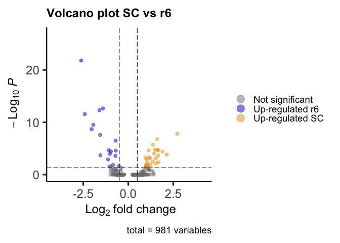

R HB13 Volcano plots
================

``` r
suppressPackageStartupMessages({
  library(Seurat)
  library(Signac)
  library(EnhancedVolcano)
  library(ggsci)
})
```

``` r
seurat <- readRDS(file = "../data/HB13hpf_neural.RDS")
DefaultAssay(seurat) <- "SCT"
Idents(seurat) <- "Clusters"
DimPlot(seurat, reduction = "wnn.umap") + scale_color_igv()
```

<!-- -->

``` r
seurat <- RenameIdents(seurat,
                       "CHB.1" = "CHB",
                       "CHB.2" = "CHB",
                       "CHB.3" = "CHB",
                       "SC.1" = "SC",
                       "SC.2" = "SC",
                       "SC.3" = "SC")
DimPlot(seurat) + scale_color_igv()
```

<!-- -->

``` r
markers.SCvsr6 <- FindMarkers(seurat, ident.1 = "SC", ident.2 = "r6", verbose = F, recorrect_umi = F)
markers.SCvsr6
```

    ##                          p_val avg_log2FC pct.1 pct.2    p_val_adj
    ## mafba             8.548102e-27 -2.6158634 0.022 0.974 1.565243e-22
    ## cxcl12a           1.218438e-17 -1.4085287 0.120 0.921 2.231081e-13
    ## skia              2.649121e-17 -1.6026158 0.130 0.895 4.850805e-13
    ## cyp26c1           1.521542e-16 -2.4144621 0.065 0.737 2.786096e-12
    ## tenm4             1.661633e-14 -1.9425903 0.565 1.000 3.042616e-10
    ## adgrl1a           1.125989e-13 -2.0315298 0.098 0.711 2.061798e-09
    ## hoxc3a            8.709824e-13  2.7197341 0.772 0.026 1.594856e-08
    ## epha7             1.388850e-12 -1.5603639 0.120 0.711 2.543123e-08
    ## raraa             9.059744e-12  1.5988347 0.837 0.211 1.658930e-07
    ## abcc8             1.813722e-11 -0.6983255 0.022 0.500 3.321107e-07
    ## arhgap29a         1.063022e-10  1.3724381 0.717 0.053 1.946500e-06
    ## hoxc6b            9.310751e-10  1.6363094 0.620 0.000 1.704892e-05
    ## igsf9a            9.660402e-10  1.4841025 0.859 0.474 1.768916e-05
    ## tmsb4x            1.137854e-09 -1.0751699 0.576 0.868 2.083524e-05
    ## cdx4              1.259646e-09  1.1346495 0.609 0.000 2.306538e-05
    ## tanc2a            1.396207e-09  1.6551029 0.750 0.158 2.556595e-05
    ## csmd2             1.488299e-09 -0.6906719 0.011 0.395 2.725225e-05
    ## pkd1b             2.007472e-09  1.9030078 0.761 0.289 3.675882e-05
    ## fgfrl1a           2.175716e-09 -0.9647053 0.043 0.474 3.983954e-05
    ## nfia              4.782178e-09  1.4358605 0.630 0.053 8.756646e-05
    ## si:dkey-157g16.6  6.164334e-09 -1.0228684 0.174 0.658 1.128751e-04
    ## XKR4              8.188551e-09  2.1385011 0.717 0.184 1.499406e-04
    ## dbn1              1.075119e-08 -1.5503913 0.380 0.763 1.968651e-04
    ## prickle2b         1.208317e-08  1.6640461 0.783 0.368 2.212550e-04
    ## mtus1a            1.474469e-08 -0.7130398 0.033 0.421 2.699899e-04
    ## phldb1b           3.000293e-08  1.1450276 0.717 0.263 5.493837e-04
    ## ldlrad2           3.348657e-08  0.9440436 0.533 0.000 6.131725e-04
    ## zgc:110158        3.893727e-08  1.2079939 0.902 0.684 7.129804e-04
    ## mllt3             4.277113e-08  1.5317205 0.533 0.000 7.831822e-04
    ## magi2a            6.939361e-08 -1.1236313 0.261 0.684 1.270666e-03
    ## cdon              8.042084e-08  1.0230239 0.663 0.132 1.472586e-03
    ## nradd             1.787335e-07  1.3424949 0.587 0.079 3.272789e-03
    ## adamts3           2.494754e-07  1.6829456 0.707 0.289 4.568144e-03
    ## sox5              3.603170e-07  1.0911479 0.478 0.000 6.597764e-03
    ## col28a2a          3.814824e-07  1.5317205 0.478 0.000 6.985323e-03
    ## apcdd1l           5.457173e-07  0.9921379 0.467 0.000 9.992629e-03
    ## col5a2a           7.768580e-07  1.2333792 0.489 0.026 1.422505e-02
    ## wwtr1             7.914049e-07 -0.8493697 0.304 0.711 1.449141e-02
    ## dacha             1.124475e-06  1.1090294 0.880 0.711 2.059025e-02
    ## ror1              1.251327e-06  0.9858578 0.478 0.026 2.291304e-02
    ## hoxb7a            1.254232e-06  0.9921379 0.446 0.000 2.296624e-02
    ## hpcal4            1.267970e-06 -0.5189056 0.043 0.368 2.321780e-02
    ## efnb3b            1.542431e-06 -1.0352362 0.576 0.895 2.824346e-02
    ## dnmt3ab           2.699131e-06  0.9686728 0.533 0.079 4.942379e-02
    ## bcam              2.731246e-06  1.0462937 0.424 0.000 5.001184e-02
    ## ptn               2.794014e-06 -0.3803318 0.011 0.263 5.116119e-02
    ## amot              3.213247e-06 -0.8929147 0.478 0.842 5.883776e-02
    ## nr2f5             3.239585e-06 -0.9448825 0.489 0.868 5.932004e-02
    ## nbeaa             4.631625e-06 -0.7376694 0.326 0.789 8.480968e-02
    ## wrn               5.145873e-06 -0.4306091 0.043 0.342 9.422608e-02
    ## foxp1b            5.593344e-06  1.1250952 0.696 0.342 1.024197e-01
    ## ncam1b            5.609684e-06  1.1585966 0.793 0.421 1.027189e-01
    ## CU639469.1        5.793385e-06  1.1485747 0.609 0.184 1.060827e-01
    ## hoxa4a            6.252340e-06 -0.7720603 0.576 0.947 1.144866e-01
    ## palm1b            6.410644e-06 -0.6626576 0.087 0.421 1.173853e-01
    ## notch3            6.667498e-06  0.8776118 0.902 0.711 1.220885e-01
    ## si:ch73-364h19.1  7.798919e-06 -0.6562384 0.120 0.474 1.428060e-01
    ## wnt4              8.644321e-06  1.1405297 0.804 0.500 1.582862e-01
    ## CT990561.1        8.926617e-06 -0.7789585 0.120 0.447 1.634553e-01
    ## RIMBP2            9.826469e-06  1.3187268 0.620 0.263 1.799325e-01
    ## nck2a             9.979927e-06 -0.9861278 0.359 0.684 1.827424e-01
    ## ptbp1b            1.033417e-05 -0.5815243 0.511 0.921 1.892290e-01
    ## shroom4           1.072725e-05 -0.6484437 0.413 0.789 1.964266e-01
    ## bcar3             1.356938e-05  0.9215120 0.761 0.421 2.484690e-01
    ## fam171a2a         1.423534e-05  0.7418530 0.478 0.079 2.606633e-01
    ## si:ch73-252p3.1   1.440228e-05 -0.4036421 0.054 0.342 2.637202e-01
    ## notch1b           1.559171e-05  0.8222129 0.924 0.684 2.854998e-01
    ## arhgef10          1.592726e-05  0.8259036 0.609 0.211 2.916441e-01
    ## robo3             1.708136e-05  0.8009868 0.728 0.342 3.127768e-01
    ## negr1             1.786832e-05 -0.8893158 0.707 0.868 3.271868e-01
    ## sorbs2b           2.060662e-05 -0.8123879 0.250 0.658 3.773278e-01
    ## ptprna            2.331518e-05 -0.6394466 0.196 0.579 4.269242e-01
    ## plxna3            2.360320e-05  0.6976482 1.000 0.763 4.321982e-01
    ## stm               2.725378e-05  1.4080620 0.424 0.053 4.990439e-01
    ## nat8l             3.432200e-05 -0.7811625 0.511 0.868 6.284701e-01
    ## wnt11             4.102029e-05  0.7514338 0.761 0.368 7.511225e-01
    ## madd              4.406218e-05  0.7006495 0.533 0.132 8.068226e-01
    ## fat1a             4.936384e-05  0.5840610 0.957 0.842 9.039013e-01
    ## zgc:73226         4.962226e-05 -0.5243136 0.065 0.342 9.086332e-01
    ## kif26ab           5.449063e-05  1.1417740 0.337 0.000 9.977779e-01
    ## sfrp5             5.675218e-05 -0.5284005 0.022 0.237 1.000000e+00
    ## mospd2            5.791133e-05 -0.3481469 0.054 0.316 1.000000e+00
    ## prox2             5.918294e-05 -0.3649018 0.022 0.237 1.000000e+00
    ## phc2a             6.306730e-05  1.0012058 0.370 0.026 1.000000e+00
    ## efna5a            6.435554e-05  0.8216628 0.446 0.079 1.000000e+00
    ## col14a1a          6.479537e-05  0.9625253 0.370 0.026 1.000000e+00
    ## aopep             6.504006e-05  1.2144689 0.609 0.289 1.000000e+00
    ## kaznb             6.939335e-05  0.8382565 0.804 0.474 1.000000e+00
    ## s1pr5a            6.944422e-05 -0.3204887 0.033 0.263 1.000000e+00
    ## fscn1a            6.963516e-05 -0.4578378 0.098 0.395 1.000000e+00
    ## dchs1a            7.098773e-05 -0.4336993 0.022 0.237 1.000000e+00
    ## phip              8.940757e-05  0.8548487 0.859 0.711 1.000000e+00
    ## kdm5bb            9.439543e-05 -0.7281466 0.348 0.658 1.000000e+00
    ## ptprnb            9.494378e-05 -0.8359349 0.196 0.500 1.000000e+00
    ## fhod3b            9.572491e-05 -0.6732899 0.326 0.684 1.000000e+00
    ## col11a1b          9.743036e-05 -0.8839474 0.239 0.579 1.000000e+00
    ## agap3             1.006206e-04  0.7371896 0.663 0.316 1.000000e+00
    ## bmp1b             1.047068e-04 -0.2756344 0.000 0.158 1.000000e+00
    ## prmt3             1.209772e-04 -0.5975625 0.120 0.395 1.000000e+00
    ## tmem108           1.384431e-04  0.8720091 0.652 0.289 1.000000e+00
    ## fsta              1.390374e-04 -0.4056950 0.065 0.316 1.000000e+00
    ## nrp2b             1.490127e-04  1.0462937 0.609 0.289 1.000000e+00
    ## hoxb9a            1.496487e-04  0.5532536 0.304 0.000 1.000000e+00
    ## mpz               1.630501e-04 -0.5386688 0.065 0.316 1.000000e+00
    ## igf2b             1.658033e-04 -0.6126694 0.250 0.579 1.000000e+00
    ## pcdh2g28          1.727666e-04  0.7961562 0.554 0.211 1.000000e+00
    ## cdkn1cb           1.732404e-04 -0.4306091 0.054 0.289 1.000000e+00
    ## epha4b            1.790583e-04 -0.6355914 0.674 0.947 1.000000e+00
    ## ZNF335            1.861151e-04  0.7182395 0.652 0.368 1.000000e+00
    ## plod2             1.882161e-04  0.6963512 0.337 0.026 1.000000e+00
    ## pax3a             1.916946e-04  1.4081814 0.467 0.158 1.000000e+00
    ## mmp2              1.950845e-04 -0.2600376 0.011 0.184 1.000000e+00
    ## hoxd4a            2.023663e-04  0.4537180 0.293 0.000 1.000000e+00
    ## bahcc1b           2.088751e-04  0.8038000 0.598 0.263 1.000000e+00
    ## cdk6              2.120650e-04 -0.6727054 0.598 0.842 1.000000e+00
    ## sfrp2             2.124318e-04  0.7618403 0.293 0.000 1.000000e+00
    ## fstl1b            2.181570e-04 -0.5784307 0.435 0.789 1.000000e+00
    ## samd10b           2.286858e-04 -0.5284005 0.022 0.211 1.000000e+00
    ## tshz1             2.426342e-04  0.9973841 0.674 0.395 1.000000e+00
    ## map2              2.660548e-04  0.8099413 0.446 0.105 1.000000e+00
    ## rbms2b            2.814599e-04  0.4764380 0.283 0.000 1.000000e+00
    ## atp13a3           2.831622e-04 -0.4542317 0.261 0.605 1.000000e+00
    ## thsd7ba           3.443727e-04 -0.5613889 0.087 0.342 1.000000e+00
    ## jag2b             3.511159e-04 -0.6715631 0.750 0.974 1.000000e+00
    ## setb              3.595540e-04 -0.4416444 0.272 0.605 1.000000e+00
    ## hoxb1b            3.894355e-04  0.3953013 0.272 0.000 1.000000e+00
    ## nav2a             4.079929e-04 -0.4011653 0.185 0.500 1.000000e+00
    ## meis1b            4.128125e-04  0.8140028 0.761 0.579 1.000000e+00
    ## epha4a            4.388766e-04  0.7976145 0.457 0.132 1.000000e+00
    ## arid3c            4.401255e-04  0.9759043 0.380 0.079 1.000000e+00
    ## serpinh1b         4.430067e-04 -0.4488540 0.902 0.947 1.000000e+00
    ## si:ch211-269k10.2 4.527427e-04 -0.4932259 0.261 0.579 1.000000e+00
    ## dclk2a            4.642286e-04 -0.6250836 0.261 0.553 1.000000e+00
    ## tcirg1b           4.740918e-04  0.5004695 0.348 0.053 1.000000e+00
    ## chst11            4.750808e-04 -0.5042588 0.065 0.289 1.000000e+00
    ## kirrel3l          4.787268e-04 -0.9868369 0.457 0.684 1.000000e+00
    ## ppdpfb            4.955070e-04 -0.4546046 0.109 0.368 1.000000e+00
    ## rps5              5.154568e-04 -0.6103703 0.446 0.711 1.000000e+00
    ## zgc:154058        5.205098e-04  0.5958508 0.467 0.158 1.000000e+00
    ## si:dkey-91m11.5   5.307680e-04  0.6677820 0.304 0.026 1.000000e+00
    ## ptprz1b           5.378915e-04  0.5157789 0.304 0.026 1.000000e+00
    ## hmcn2.1           5.386963e-04  0.5474878 0.304 0.026 1.000000e+00
    ## sb:cb81           5.585222e-04  0.6596599 0.674 0.368 1.000000e+00
    ## si:ch211-212g7.6  5.592181e-04  0.4833575 0.304 0.026 1.000000e+00
    ## myt1a             5.614402e-04  0.6159894 0.261 0.000 1.000000e+00
    ## wnt3              5.713266e-04  0.7243656 0.467 0.158 1.000000e+00
    ## nup188            5.808719e-04 -0.3670575 0.141 0.421 1.000000e+00
    ## pcdh1b            6.096407e-04  0.8645432 0.489 0.184 1.000000e+00
    ## zgc:158689        6.329140e-04  0.5165607 0.348 0.053 1.000000e+00
    ## grwd1             6.381800e-04 -0.3623461 0.152 0.447 1.000000e+00
    ## CR388047.3        6.452994e-04 -0.4105640 0.098 0.342 1.000000e+00
    ## cspg5a            6.597637e-04 -0.6945870 0.511 0.763 1.000000e+00
    ## spsb4a            6.971209e-04  0.6746125 0.641 0.289 1.000000e+00
    ## dtnba             7.105626e-04 -0.7418108 0.554 0.763 1.000000e+00
    ## psip1a            7.152252e-04 -0.4252108 0.174 0.474 1.000000e+00
    ## nfasca            7.506759e-04  0.5682464 0.293 0.026 1.000000e+00
    ## p3h2              7.577958e-04  0.5579044 0.293 0.026 1.000000e+00
    ## TXN               7.752002e-04 -0.4327354 0.217 0.500 1.000000e+00
    ## hsp90b1           7.938244e-04  0.6629650 0.511 0.211 1.000000e+00
    ## rhoj              8.205542e-04  0.5664859 0.337 0.053 1.000000e+00
    ## nxph3             8.251916e-04 -0.3060081 0.011 0.158 1.000000e+00
    ## pms2              8.275608e-04 -0.4998496 0.174 0.447 1.000000e+00
    ## enah              8.285781e-04 -0.5459004 0.522 0.789 1.000000e+00
    ## dnajc24           8.928040e-04 -0.2756344 0.022 0.184 1.000000e+00
    ## rasgrp3           9.075057e-04  0.6095016 0.500 0.211 1.000000e+00
    ## arhgap21b         9.230111e-04 -0.4853530 0.761 0.974 1.000000e+00
    ## ctnnd2b           9.269016e-04  0.8170148 0.533 0.289 1.000000e+00
    ## zgc:158328        9.331152e-04 -0.3596987 0.054 0.263 1.000000e+00
    ## adcy7             9.546675e-04  0.7006495 0.467 0.184 1.000000e+00
    ## numbl             9.672101e-04 -0.4682795 0.272 0.579 1.000000e+00
    ## nectin1b          1.015021e-03  0.6888214 0.837 0.737 1.000000e+00
    ## hoxa9a            1.049100e-03  0.4651227 0.239 0.000 1.000000e+00
    ## ddr2l             1.147733e-03 -0.2904314 0.033 0.211 1.000000e+00
    ## mcm5              1.148413e-03 -0.3875273 0.239 0.526 1.000000e+00
    ## bicc2             1.164074e-03  0.6602352 0.457 0.158 1.000000e+00
    ## tnc               1.228359e-03 -0.6252189 0.185 0.447 1.000000e+00
    ## LO018340.1        1.274550e-03  0.5172693 0.391 0.105 1.000000e+00
    ## atf3              1.344666e-03 -0.8180866 0.543 0.763 1.000000e+00
    ## ptprfa            1.396994e-03  0.8202900 0.304 0.053 1.000000e+00
    ## lypd6b            1.430422e-03  0.4651227 0.228 0.000 1.000000e+00
    ## smtnl             1.458458e-03  0.5050525 0.272 0.026 1.000000e+00
    ## megf6b            1.493674e-03  0.4162433 0.272 0.026 1.000000e+00
    ## usp54a            1.519148e-03  0.4004759 0.467 0.158 1.000000e+00
    ## sox13             1.534559e-03  0.6138072 0.663 0.342 1.000000e+00
    ## plagl2            1.536000e-03 -0.5430143 0.630 0.868 1.000000e+00
    ## nt5dc2            1.591474e-03 -0.3759393 0.272 0.553 1.000000e+00
    ## xylt1             1.637521e-03  0.6944950 0.630 0.421 1.000000e+00
    ## ucp2              1.778697e-03  0.5362932 0.457 0.184 1.000000e+00
    ## dusp4             1.785429e-03 -0.4715547 0.174 0.421 1.000000e+00
    ## asap3             1.799225e-03  0.6419034 0.402 0.132 1.000000e+00
    ## bcar1             1.825966e-03  0.7675776 0.707 0.526 1.000000e+00
    ## azin1a            1.934613e-03 -0.5804890 0.326 0.579 1.000000e+00
    ## etv4              1.935695e-03  0.4942458 0.261 0.026 1.000000e+00
    ## acsl2             1.945508e-03 -0.4932259 0.283 0.553 1.000000e+00
    ## vcana             1.950048e-03  0.3953013 0.217 0.000 1.000000e+00
    ## draxin            1.958553e-03  0.4988059 0.217 0.000 1.000000e+00
    ## col11a1a          1.965654e-03  0.3390754 0.413 0.105 1.000000e+00
    ## kpnb3             1.971974e-03 -0.4562067 0.261 0.500 1.000000e+00
    ## ehbp1             1.976101e-03  0.5647607 0.728 0.500 1.000000e+00
    ## wdhd1             2.032052e-03 -0.4927326 0.196 0.447 1.000000e+00
    ## msh6              2.107267e-03 -0.4880428 0.304 0.579 1.000000e+00
    ## anp32a            2.109495e-03  0.4915314 0.565 0.316 1.000000e+00
    ## spred2b           2.119360e-03  0.5971304 0.772 0.632 1.000000e+00
    ## ssbp4             2.172431e-03  0.5988347 0.783 0.553 1.000000e+00
    ## sept2             2.221577e-03 -0.2606841 0.054 0.237 1.000000e+00
    ## prdx6             2.221577e-03 -0.2606841 0.054 0.237 1.000000e+00
    ## l1cama            2.221577e-03 -0.2904314 0.054 0.237 1.000000e+00
    ## pwp1              2.253742e-03 -0.3345281 0.043 0.211 1.000000e+00
    ## ptprn2            2.317214e-03 -0.3687438 0.272 0.553 1.000000e+00
    ## cited4a           2.359069e-03  0.5227317 0.435 0.158 1.000000e+00
    ## vgll4b            2.366911e-03 -0.3281019 0.152 0.395 1.000000e+00
    ## hoxb2a            2.380581e-03 -0.3704936 0.120 0.342 1.000000e+00
    ## pkn2              2.390297e-03 -0.5100997 0.109 0.316 1.000000e+00
    ## alcamb            2.395197e-03  0.6567675 0.750 0.500 1.000000e+00
    ## kpnb1             2.405301e-03 -0.4651122 0.207 0.447 1.000000e+00
    ## myo1ea            2.464098e-03  0.4248053 0.293 0.053 1.000000e+00
    ## pole4             2.473388e-03 -0.3300822 0.120 0.342 1.000000e+00
    ## kif9              2.506894e-03 -0.3427486 0.141 0.368 1.000000e+00
    ## si:ch211-214c7.4  2.507567e-03 -0.4445114 0.380 0.684 1.000000e+00
    ## ptprua            2.541737e-03 -0.5293910 0.087 0.289 1.000000e+00
    ## lrrtm2            2.624906e-03 -0.3178627 0.065 0.263 1.000000e+00
    ## itih6             2.634632e-03  0.3833286 0.207 0.000 1.000000e+00
    ## pfkfb1            2.646941e-03  0.4071754 0.207 0.000 1.000000e+00
    ## kcnn3             2.656339e-03  0.5208322 0.207 0.000 1.000000e+00
    ## atp8b5a           2.667097e-03 -0.2901340 0.054 0.237 1.000000e+00
    ## kcnab1a           2.701145e-03  0.7899539 0.380 0.132 1.000000e+00
    ## wnt7bb            2.740533e-03 -0.3053818 0.043 0.211 1.000000e+00
    ## fam117bb          2.785582e-03  0.4501906 0.250 0.026 1.000000e+00
    ## hoxb6b            2.809963e-03  0.4162433 0.250 0.026 1.000000e+00
    ## dachb             2.832314e-03  0.4047476 0.250 0.026 1.000000e+00
    ## rgs7a             2.834318e-03 -0.2600376 0.011 0.132 1.000000e+00
    ## wnt7aa            2.870618e-03 -0.3496350 0.033 0.184 1.000000e+00
    ## akap8l            2.911263e-03 -0.4033900 0.141 0.368 1.000000e+00
    ## cdan1             2.946755e-03 -0.2898483 0.087 0.289 1.000000e+00
    ## pdzd2             3.011802e-03  0.5910990 0.522 0.263 1.000000e+00
    ## wnk1a             3.086115e-03  0.3544159 0.337 0.079 1.000000e+00
    ## cyb561a3a         3.088080e-03 -0.2606841 0.043 0.211 1.000000e+00
    ## si:dkey-49n23.1   3.092244e-03 -0.4830765 0.033 0.184 1.000000e+00
    ## cbx1b             3.185929e-03 -0.2603677 0.033 0.184 1.000000e+00
    ## cdca7b            3.205728e-03 -0.3141086 0.174 0.421 1.000000e+00
    ## ece2b             3.206091e-03  0.6265182 0.641 0.447 1.000000e+00
    ## si:ch73-22o12.1   3.349566e-03  0.5063649 0.315 0.079 1.000000e+00
    ## nedd9             3.352306e-03  0.5266849 0.315 0.079 1.000000e+00
    ## si:dkey-195m11.8  3.438771e-03 -0.4820853 0.772 0.921 1.000000e+00
    ## hoxb5b            3.528598e-03  0.3093281 0.196 0.000 1.000000e+00
    ## siva1             3.539162e-03 -0.3440214 0.109 0.316 1.000000e+00
    ## rassf7a           3.545671e-03  0.5643251 0.489 0.237 1.000000e+00
    ## ncl               3.554807e-03 -0.5322711 0.717 0.868 1.000000e+00
    ## lmo4b             3.561964e-03  0.3712558 0.196 0.000 1.000000e+00
    ## BX936418.1        3.574097e-03  0.3953013 0.196 0.000 1.000000e+00
    ## rdh8a             3.576755e-03  0.4189525 0.196 0.000 1.000000e+00
    ## esr1              3.577008e-03  0.3953013 0.196 0.000 1.000000e+00
    ## zfand3            3.618872e-03  0.3566338 0.283 0.053 1.000000e+00
    ## myh14             3.650037e-03 -0.3809874 0.293 0.579 1.000000e+00
    ## map3k14a          3.657176e-03 -0.4205828 0.228 0.474 1.000000e+00
    ## zic2b             3.674130e-03  0.4804400 0.326 0.079 1.000000e+00
    ## ppp2r2ab          3.855964e-03 -0.3751701 0.141 0.368 1.000000e+00
    ## pou2f2a.1         3.944352e-03  0.5512167 0.337 0.105 1.000000e+00
    ## trip12            3.953346e-03  0.5399410 0.533 0.316 1.000000e+00
    ## thoc1             3.994297e-03  0.2844534 0.239 0.026 1.000000e+00
    ## adarb1b           4.045684e-03 -0.4682795 0.717 0.895 1.000000e+00
    ## tnfrsf21          4.069789e-03 -0.4652957 0.163 0.395 1.000000e+00
    ## pelo              4.079323e-03 -0.3300822 0.109 0.316 1.000000e+00
    ## arhgap42a         4.105165e-03  0.4124216 0.402 0.132 1.000000e+00
    ## erfl3             4.107816e-03  0.4865684 0.533 0.263 1.000000e+00
    ## etf1b             4.207337e-03 -0.4888083 0.413 0.658 1.000000e+00
    ## brsk2b            4.334933e-03  0.7758959 0.554 0.289 1.000000e+00
    ## rpl26             4.514359e-03 -0.4011653 0.272 0.500 1.000000e+00
    ## nop16             4.549856e-03 -0.2615593 0.109 0.316 1.000000e+00
    ## brd3b             4.656978e-03  0.5684153 0.663 0.447 1.000000e+00
    ## smarcb1a          4.751326e-03 -0.3047808 0.065 0.237 1.000000e+00
    ## sema6ba           4.818231e-03  0.4306344 0.185 0.000 1.000000e+00
    ## mcm2              4.832331e-03 -0.5353937 0.304 0.553 1.000000e+00
    ## pcdh11.1          4.865701e-03 -0.5651411 0.120 0.316 1.000000e+00
    ## nectin3b          4.925482e-03  0.5935789 0.772 0.605 1.000000e+00
    ## efemp2b           4.968984e-03  0.5063649 0.304 0.079 1.000000e+00
    ## eif4g2a           5.049070e-03 -0.3900932 0.152 0.368 1.000000e+00
    ## sulf1             5.055530e-03  0.8634296 0.293 0.079 1.000000e+00
    ## pcna              5.070825e-03 -0.4660651 0.424 0.658 1.000000e+00
    ## si:dkey-16p21.7   5.160602e-03 -0.3047808 0.065 0.237 1.000000e+00
    ## cemip2            5.162063e-03 -0.3998925 0.522 0.737 1.000000e+00
    ## jmjd1cb           5.255604e-03  0.5499251 0.815 0.737 1.000000e+00
    ## tiparp            5.279656e-03  0.3458539 0.228 0.026 1.000000e+00
    ## mex3b             5.360817e-03 -0.5182047 0.380 0.605 1.000000e+00
    ## stard13b          5.366056e-03  0.6983703 0.326 0.105 1.000000e+00
    ## rpl4              5.400927e-03 -0.3083006 0.337 0.605 1.000000e+00
    ## tubb4b            5.425962e-03 -0.4214853 0.370 0.605 1.000000e+00
    ## hells             5.592537e-03 -0.3417236 0.228 0.500 1.000000e+00
    ## serinc5           5.597358e-03  0.5639009 0.717 0.553 1.000000e+00
    ## sall4             5.690400e-03  0.5432529 0.804 0.711 1.000000e+00
    ## hif1ab            5.895982e-03  0.4672077 0.435 0.184 1.000000e+00
    ## antxr1c           5.930931e-03  0.5630847 0.717 0.474 1.000000e+00
    ## zeb2b             5.997661e-03 -0.3483908 0.196 0.421 1.000000e+00
    ## rhocb             5.999556e-03 -0.3021067 0.130 0.342 1.000000e+00
    ## junbb             6.021117e-03 -0.4420956 0.326 0.579 1.000000e+00
    ## si:ch211-102c2.7  6.041045e-03 -0.4455594 0.207 0.421 1.000000e+00
    ## wnt7ab            6.171668e-03 -0.2612791 0.065 0.237 1.000000e+00
    ## rpf2              6.301972e-03 -0.2606841 0.054 0.211 1.000000e+00
    ## cntfr             6.329744e-03 -0.4913631 0.837 0.921 1.000000e+00
    ## hoxc8a            6.399872e-03  0.2708539 0.174 0.000 1.000000e+00
    ## hoxb6a            6.400539e-03  0.2966170 0.174 0.000 1.000000e+00
    ## BX511034.7        6.420576e-03 -0.3170544 0.098 0.289 1.000000e+00
    ## zgc:109889        6.434543e-03 -0.3496350 0.174 0.395 1.000000e+00
    ## cavin2b           6.460743e-03  0.4189525 0.174 0.000 1.000000e+00
    ## esrrga            6.651340e-03  0.4833575 0.217 0.026 1.000000e+00
    ## fam222ba          6.688939e-03  0.3331748 0.261 0.053 1.000000e+00
    ## isg20             6.721129e-03 -0.3947817 0.435 0.658 1.000000e+00
    ## crb1              6.775201e-03 -0.2845676 0.326 0.632 1.000000e+00
    ## fgfr1b            6.826552e-03 -0.3436987 0.935 1.000 1.000000e+00
    ## CABZ01060373.1    7.008778e-03  0.3697007 0.217 0.026 1.000000e+00
    ## chrd              7.009535e-03  0.4833575 0.217 0.026 1.000000e+00
    ## pcdh19            7.036511e-03 -0.4263134 0.446 0.711 1.000000e+00
    ## fam13a            7.053599e-03 -0.3453434 0.087 0.263 1.000000e+00
    ## prex2             7.054408e-03  0.6449311 0.293 0.079 1.000000e+00
    ## rhbdl3            7.072227e-03  0.3578266 0.217 0.026 1.000000e+00
    ## atp2c1            7.160220e-03  0.3496858 0.413 0.158 1.000000e+00
    ## si:ch211-166g5.4  7.196146e-03  0.2969443 0.217 0.026 1.000000e+00
    ## syne1a            7.207774e-03  0.4743873 0.359 0.132 1.000000e+00
    ## zgc:92107         7.213046e-03  0.5317205 0.793 0.737 1.000000e+00
    ## htr3b             7.225605e-03 -0.3162764 0.120 0.316 1.000000e+00
    ## scml2             7.280890e-03  0.5630847 0.457 0.211 1.000000e+00
    ## camkmt            7.317881e-03  0.3424949 0.304 0.079 1.000000e+00
    ## ttyh3a            7.378112e-03  0.6248299 0.609 0.421 1.000000e+00
    ## vps8              7.413993e-03 -0.4253816 0.196 0.447 1.000000e+00
    ## bmpr1ab           7.479113e-03  0.4637743 0.859 0.737 1.000000e+00
    ## zfhx4             7.514529e-03 -0.4306091 0.522 0.711 1.000000e+00
    ## sulf2b            7.517375e-03 -0.6064589 0.043 0.184 1.000000e+00
    ## mknk1             7.570148e-03 -0.3949334 0.217 0.421 1.000000e+00
    ## BX248501.2        7.780916e-03 -0.2609877 0.054 0.211 1.000000e+00
    ## bmpr1ba           7.784564e-03 -0.2885735 0.109 0.289 1.000000e+00
    ## zgc:63863         7.786594e-03 -0.3453434 0.087 0.263 1.000000e+00
    ## cdc6              7.812356e-03 -0.4624030 0.196 0.421 1.000000e+00
    ## sik2b             8.143522e-03  0.4646063 0.359 0.132 1.000000e+00
    ## kif15             8.146267e-03 -0.4224758 0.196 0.395 1.000000e+00
    ## gli2b             8.146674e-03 -0.5386688 0.293 0.526 1.000000e+00
    ## slco2a1           8.310454e-03 -0.3565544 0.130 0.316 1.000000e+00
    ## rgs12a            8.442458e-03  0.3764423 0.435 0.184 1.000000e+00
    ## si:dkeyp-69b9.6   8.594836e-03 -0.3360071 0.228 0.447 1.000000e+00
    ## tuba1a            8.609526e-03  0.4273838 0.326 0.105 1.000000e+00
    ## ppfia3            8.610696e-03  0.3093281 0.163 0.000 1.000000e+00
    ## zic3              8.625475e-03  0.3833286 0.163 0.000 1.000000e+00
    ## necab2            8.702737e-03  0.3629660 0.304 0.079 1.000000e+00
    ## mpp5a             8.761777e-03 -0.3983170 0.424 0.658 1.000000e+00
    ## tnfrsf19          8.834360e-03  0.4640507 0.533 0.289 1.000000e+00
    ## tead3b            8.913482e-03 -0.4427444 0.446 0.658 1.000000e+00
    ## iffo2a            9.051919e-03  0.5460283 0.337 0.132 1.000000e+00
    ## maml3             9.129589e-03  0.5474878 0.620 0.421 1.000000e+00
    ## ly6pge            9.164644e-03  0.4273838 0.293 0.079 1.000000e+00
    ## itgb4             9.238041e-03  0.4162433 0.207 0.026 1.000000e+00
    ## cdk17             9.324270e-03  0.4804400 0.380 0.158 1.000000e+00
    ## efcc1             9.544324e-03  0.3780408 0.283 0.079 1.000000e+00
    ## ptpn4a            9.668813e-03  0.4782050 0.478 0.237 1.000000e+00
    ## fgfr3             9.684134e-03  0.4991526 0.543 0.289 1.000000e+00
    ## kalrna            9.693895e-03  0.2969443 0.207 0.026 1.000000e+00
    ## krt18a.1          9.694908e-03  0.3578266 0.207 0.026 1.000000e+00
    ## actb2             9.745717e-03 -0.4011653 0.565 0.737 1.000000e+00
    ## aldh4a1           9.774723e-03  0.2718534 0.207 0.026 1.000000e+00
    ## lamc1             9.793782e-03  0.5162574 0.652 0.421 1.000000e+00
    ## uhrf1             9.828987e-03 -0.2966961 0.293 0.526 1.000000e+00
    ## nisch             9.892328e-03 -0.4710301 0.293 0.500 1.000000e+00
    ## sdf2              9.951103e-03 -0.2603677 0.033 0.158 1.000000e+00
    ## elf1              1.004265e-02  0.5487940 0.467 0.263 1.000000e+00
    ## fbrs              1.016766e-02  0.4289097 0.543 0.316 1.000000e+00
    ## si:dkey-151g10.3  1.017236e-02 -0.2973295 0.272 0.526 1.000000e+00
    ## ttc14             1.022514e-02 -0.2756344 0.174 0.395 1.000000e+00
    ## dgkh              1.027902e-02 -0.3031152 0.109 0.289 1.000000e+00
    ## e2f4              1.030712e-02 -0.2998820 0.250 0.474 1.000000e+00
    ## letm2             1.031456e-02 -0.3370350 0.185 0.395 1.000000e+00
    ## zdhhc15a          1.045185e-02 -0.3806040 0.130 0.316 1.000000e+00
    ## si:ch211-210g13.5 1.065269e-02 -0.3761613 0.033 0.158 1.000000e+00
    ## CR848788.1        1.065795e-02 -0.4804542 0.250 0.447 1.000000e+00
    ## sardh             1.070178e-02 -0.4049175 0.293 0.500 1.000000e+00
    ## baz2a             1.075914e-02  0.2986017 0.370 0.132 1.000000e+00
    ## zgc:63587         1.082689e-02 -0.3007254 0.196 0.421 1.000000e+00
    ## ppp1r14bb         1.086015e-02 -0.4183746 0.239 0.447 1.000000e+00
    ## arl8              1.098030e-02  0.4501906 0.500 0.289 1.000000e+00
    ## vdrb              1.107022e-02  0.4792531 0.543 0.342 1.000000e+00
    ## mvp               1.109974e-02  0.4273838 0.283 0.079 1.000000e+00
    ## C7H16orf87        1.123840e-02  0.4882982 0.511 0.289 1.000000e+00
    ## epha2b            1.139496e-02 -0.3496350 0.435 0.684 1.000000e+00
    ## RALGDS            1.148103e-02  0.3324117 0.543 0.263 1.000000e+00
    ## lmo3              1.151804e-02  0.4876653 0.152 0.000 1.000000e+00
    ## hoxa10b           1.152156e-02  0.3833286 0.152 0.000 1.000000e+00
    ## zfhx3             1.157455e-02 -0.2947433 0.304 0.579 1.000000e+00
    ## dusp8a            1.208182e-02 -0.3718498 0.228 0.421 1.000000e+00
    ## si:ch211-285f17.1 1.209312e-02  0.5317205 0.370 0.158 1.000000e+00
    ## tlcd3a            1.223958e-02 -0.3921485 0.163 0.342 1.000000e+00
    ## fhdc1             1.227501e-02  0.4476562 0.500 0.289 1.000000e+00
    ## rpl22l1           1.239532e-02 -0.3271647 0.174 0.368 1.000000e+00
    ## sox21a            1.242850e-02 -0.4422843 0.065 0.211 1.000000e+00
    ## esyt1a            1.242891e-02 -0.3888451 0.065 0.211 1.000000e+00
    ## pxdn              1.251596e-02  0.5157789 0.196 0.026 1.000000e+00
    ## sema3fb           1.251596e-02  0.4276480 0.196 0.026 1.000000e+00
    ## jarid2b           1.257028e-02 -0.4484710 0.859 0.974 1.000000e+00
    ## zgc:171599        1.259710e-02 -0.3021067 0.130 0.316 1.000000e+00
    ## eif4a1a           1.262354e-02  0.3942170 0.533 0.289 1.000000e+00
    ## si:ch73-265d7.2   1.264167e-02  0.3458539 0.196 0.026 1.000000e+00
    ## phf14             1.274368e-02  0.4899003 0.533 0.342 1.000000e+00
    ## si:ch211-170d8.2  1.275366e-02  0.2604185 0.239 0.053 1.000000e+00
    ## ctcf              1.281832e-02  0.4613312 0.370 0.158 1.000000e+00
    ## cdkl1             1.289040e-02  0.3337811 0.196 0.026 1.000000e+00
    ## plekhg4           1.304530e-02  0.4365632 0.380 0.158 1.000000e+00
    ## npc1              1.312041e-02  0.4002366 0.272 0.079 1.000000e+00
    ## angptl2b          1.346319e-02  0.3891814 0.272 0.079 1.000000e+00
    ## gli2a             1.362069e-02  0.4865684 0.935 0.842 1.000000e+00
    ## asb11             1.380920e-02  0.3780408 0.272 0.079 1.000000e+00
    ## ap3b1a            1.381812e-02 -0.2895736 0.120 0.289 1.000000e+00
    ## pkd1a             1.387399e-02 -0.4224758 0.152 0.342 1.000000e+00
    ## gpc4              1.392013e-02 -0.3892912 0.663 0.895 1.000000e+00
    ## mycb              1.396929e-02 -0.3007254 0.152 0.342 1.000000e+00
    ## arih1             1.399378e-02  0.2627855 0.283 0.079 1.000000e+00
    ## col4a5            1.400007e-02  0.3927441 0.533 0.316 1.000000e+00
    ## CABZ01029822.1    1.408183e-02  0.5204347 0.467 0.237 1.000000e+00
    ## supt16h           1.414024e-02 -0.3036488 0.391 0.632 1.000000e+00
    ## plch1             1.416799e-02  0.4355681 0.902 0.711 1.000000e+00
    ## arhgap21a         1.427256e-02  0.4693239 0.467 0.237 1.000000e+00
    ## ppp2r5cb          1.430471e-02 -0.3902770 0.326 0.553 1.000000e+00
    ## epha2a            1.459647e-02  0.5121449 0.413 0.184 1.000000e+00
    ## ppiaa             1.460120e-02 -0.3455365 0.359 0.579 1.000000e+00
    ## rbm14b            1.476409e-02 -0.4276375 0.283 0.500 1.000000e+00
    ## tjp1b             1.488608e-02  0.4173878 0.565 0.368 1.000000e+00
    ## col5a1            1.503277e-02  0.4248053 0.228 0.053 1.000000e+00
    ## cnn3a             1.505518e-02 -0.3734818 0.174 0.368 1.000000e+00
    ## ruvbl1            1.517965e-02 -0.3290737 0.141 0.316 1.000000e+00
    ## nhsl1b            1.521169e-02  0.4275095 0.772 0.632 1.000000e+00
    ## hax1              1.536489e-02 -0.2893094 0.141 0.316 1.000000e+00
    ## nr2f2             1.544105e-02 -0.2952632 0.326 0.526 1.000000e+00
    ## rps21             1.557921e-02 -0.4888083 0.424 0.658 1.000000e+00
    ## map7d1a           1.563635e-02 -0.4011653 0.609 0.842 1.000000e+00
    ## mlf1              1.565500e-02 -0.3670575 0.120 0.289 1.000000e+00
    ## immt              1.602078e-02 -0.2615593 0.098 0.263 1.000000e+00
    ## tet2              1.603018e-02 -0.3103999 0.783 0.947 1.000000e+00
    ## si:dkey-34e4.1    1.613756e-02 -0.3350130 0.196 0.395 1.000000e+00
    ## sdc4              1.621335e-02 -0.4231916 0.598 0.789 1.000000e+00
    ## cdh6              1.632367e-02  0.8372596 0.228 0.053 1.000000e+00
    ## msx1b             1.641378e-02  0.4583839 0.348 0.132 1.000000e+00
    ## rps6kal           1.669866e-02 -0.2987181 0.293 0.500 1.000000e+00
    ## npepps            1.702025e-02  0.3410369 0.337 0.132 1.000000e+00
    ## cox6c             1.705583e-02  0.2969443 0.185 0.026 1.000000e+00
    ## chst10            1.705961e-02  0.3093281 0.185 0.026 1.000000e+00
    ## st13              1.711766e-02 -0.2983545 0.272 0.474 1.000000e+00
    ## scaf4a            1.722484e-02  0.3093281 0.272 0.079 1.000000e+00
    ## oc90              1.730101e-02  0.4112077 0.228 0.053 1.000000e+00
    ## si:ch73-386h18.1  1.736010e-02 -0.3751701 0.500 0.684 1.000000e+00
    ## rpl28             1.745361e-02 -0.3304964 0.283 0.500 1.000000e+00
    ## coq10b            1.757485e-02 -0.3281019 0.141 0.316 1.000000e+00
    ## zranb2            1.762708e-02 -0.3672649 0.272 0.474 1.000000e+00
    ## trim8a            1.765646e-02  0.2862444 0.272 0.079 1.000000e+00
    ## arhgap32b         1.773224e-02 -0.4105640 0.380 0.579 1.000000e+00
    ## ptdss2            1.806366e-02 -0.3170544 0.109 0.263 1.000000e+00
    ## hecw1b            1.817842e-02 -0.2606841 0.054 0.184 1.000000e+00
    ## lonp1             1.836430e-02 -0.3098502 0.272 0.474 1.000000e+00
    ## dym               1.837838e-02  0.3210099 0.261 0.079 1.000000e+00
    ## rab30             1.838100e-02  0.2877949 0.348 0.132 1.000000e+00
    ## rfc5              1.862072e-02 -0.2756344 0.163 0.342 1.000000e+00
    ## mnd1              1.869634e-02 -0.2879128 0.228 0.421 1.000000e+00
    ## smoc1             1.876496e-02 -0.3596987 0.054 0.184 1.000000e+00
    ## mindy1            1.922540e-02 -0.2756344 0.185 0.368 1.000000e+00
    ## adarb1a           1.925510e-02 -0.2609877 0.054 0.184 1.000000e+00
    ## fbxo11a.1         1.941218e-02 -0.3569345 0.337 0.553 1.000000e+00
    ## slit2             1.958417e-02  0.3797174 0.217 0.053 1.000000e+00
    ## gab1              1.973815e-02 -0.3365167 0.685 0.921 1.000000e+00
    ## nrp1a             1.986518e-02  0.4962910 0.424 0.211 1.000000e+00
    ## sp8a              1.999539e-02  0.4248053 0.217 0.053 1.000000e+00
    ## cdc14ab           2.032743e-02  0.3488564 0.402 0.184 1.000000e+00
    ## gdf6b             2.033097e-02  0.2577978 0.130 0.000 1.000000e+00
    ## dhx57             2.033233e-02  0.2577978 0.130 0.000 1.000000e+00
    ## skap2             2.036975e-02  0.3344190 0.130 0.000 1.000000e+00
    ## lifrb             2.037451e-02  0.3590811 0.130 0.000 1.000000e+00
    ## SIPA1             2.068966e-02 -0.3170544 0.087 0.237 1.000000e+00
    ## sox6              2.081872e-02  0.5396257 0.478 0.289 1.000000e+00
    ## dlg1l             2.091577e-02  0.3432754 0.261 0.079 1.000000e+00
    ## ddx46             2.111913e-02 -0.2756344 0.054 0.184 1.000000e+00
    ## h2ax1             2.112856e-02  0.4913884 0.500 0.316 1.000000e+00
    ## ndufa4l           2.114957e-02 -0.2628104 0.174 0.368 1.000000e+00
    ## rpl12             2.140615e-02 -0.3519853 0.620 0.763 1.000000e+00
    ## tuba8l4           2.159452e-02 -0.3400832 0.587 0.816 1.000000e+00
    ## efnb2b            2.179686e-02  0.5925757 0.587 0.474 1.000000e+00
    ## robo2.1           2.180702e-02 -0.3942789 0.109 0.263 1.000000e+00
    ## pik3r2            2.196864e-02 -0.3055877 0.304 0.526 1.000000e+00
    ## pds5a             2.206640e-02 -0.2655102 0.380 0.605 1.000000e+00
    ## snrpb             2.217183e-02 -0.2871301 0.272 0.474 1.000000e+00
    ## bach2b            2.220194e-02 -0.3738148 0.598 0.789 1.000000e+00
    ## zgc:77158         2.254341e-02 -0.3702713 0.141 0.316 1.000000e+00
    ## rps3a             2.270680e-02 -0.4705461 0.402 0.605 1.000000e+00
    ## timeless          2.284908e-02 -0.3496350 0.196 0.368 1.000000e+00
    ## si:dkeyp-87e7.4   2.323593e-02  0.3617955 0.370 0.184 1.000000e+00
    ## nap1l4a           2.325150e-02 -0.3162764 0.087 0.237 1.000000e+00
    ## plxnb1b           2.346165e-02  0.3833286 0.793 0.632 1.000000e+00
    ## fam210aa          2.390130e-02 -0.2756344 0.152 0.316 1.000000e+00
    ## orc3              2.392420e-02 -0.2652178 0.304 0.553 1.000000e+00
    ## pknox2            2.414034e-02  0.3764423 0.283 0.105 1.000000e+00
    ## unc5b             2.416320e-02  0.5231073 0.337 0.158 1.000000e+00
    ## ilf3b             2.441475e-02 -0.2996133 0.522 0.711 1.000000e+00
    ## ubald1a           2.474414e-02  0.4537180 0.511 0.289 1.000000e+00
    ## ogdha             2.497704e-02 -0.4384849 0.424 0.579 1.000000e+00
    ## mrtfab            2.500803e-02  0.3410369 0.348 0.158 1.000000e+00
    ## slc23a2           2.507486e-02 -0.3569345 0.337 0.553 1.000000e+00
    ## stag1a            2.522333e-02 -0.3407295 0.261 0.447 1.000000e+00
    ## ahcyl2b           2.537588e-02  0.3421180 0.522 0.316 1.000000e+00
    ## pvrl2l            2.548162e-02  0.4639051 0.880 0.842 1.000000e+00
    ## lrp5              2.589002e-02 -0.3360071 0.674 0.868 1.000000e+00
    ## tas1r1            2.617649e-02  0.2981008 0.217 0.053 1.000000e+00
    ## mdka              2.623348e-02  0.4510811 0.815 0.658 1.000000e+00
    ## fbrsl1            2.643520e-02  0.4862058 0.380 0.211 1.000000e+00
    ## rnf24             2.646211e-02  0.3493261 0.696 0.474 1.000000e+00
    ## id1               2.682289e-02  0.4525609 0.728 0.579 1.000000e+00
    ## nav2b             2.682483e-02 -0.3168571 0.283 0.500 1.000000e+00
    ## CR382300.2        2.697290e-02  0.2577978 0.120 0.000 1.000000e+00
    ## syne1b            2.699039e-02  0.4024375 0.207 0.053 1.000000e+00
    ## smad3a            2.701594e-02  0.3953013 0.120 0.000 1.000000e+00
    ## srpk1b            2.720176e-02 -0.2650652 0.326 0.553 1.000000e+00
    ## robo4             2.750136e-02  0.3682217 0.207 0.053 1.000000e+00
    ## scube2            2.767294e-02  0.5057253 0.370 0.184 1.000000e+00
    ## fbn2b             2.777095e-02  0.3202164 0.337 0.158 1.000000e+00
    ## arhgef12b         2.840077e-02 -0.4352393 0.707 0.816 1.000000e+00
    ## si:ch211-113e8.10 2.841441e-02  0.2873018 0.293 0.105 1.000000e+00
    ## BX323459.2        2.852700e-02  0.2850805 0.207 0.053 1.000000e+00
    ## ralbp1            2.870875e-02  0.2560860 0.337 0.132 1.000000e+00
    ## rasal2            2.884472e-02 -0.3221770 0.685 0.868 1.000000e+00
    ## cux1a             2.885534e-02  0.2632316 0.337 0.132 1.000000e+00
    ## nacc1a            2.904294e-02  0.2604185 0.207 0.053 1.000000e+00
    ## arf2a             2.904507e-02 -0.2500994 0.207 0.395 1.000000e+00
    ## her15.2           2.919411e-02  0.2594028 0.326 0.132 1.000000e+00
    ## fkbp9             2.964970e-02  0.3320481 0.272 0.105 1.000000e+00
    ## neo1a             2.978532e-02 -0.3730828 0.913 1.000 1.000000e+00
    ## fhl3a             2.985737e-02  0.3216064 0.163 0.026 1.000000e+00
    ## cass4             3.016634e-02  0.3337811 0.163 0.026 1.000000e+00
    ## cep290            3.021561e-02  0.3514535 0.315 0.132 1.000000e+00
    ## wu:fc75a09        3.043535e-02  0.3440935 0.239 0.079 1.000000e+00
    ## muc13b            3.045172e-02 -0.2883455 0.174 0.342 1.000000e+00
    ## zgc:86598         3.054867e-02  0.3902481 0.467 0.289 1.000000e+00
    ## jag1b             3.065354e-02  0.4088637 0.272 0.105 1.000000e+00
    ## tmem9b            3.078443e-02  0.2844534 0.163 0.026 1.000000e+00
    ## igdcc4            3.086616e-02  0.4459011 0.380 0.211 1.000000e+00
    ## setbp1            3.086885e-02  0.3362951 0.478 0.263 1.000000e+00
    ## cad               3.115643e-02 -0.2756344 0.500 0.711 1.000000e+00
    ## suclg2            3.122086e-02  0.3210099 0.239 0.079 1.000000e+00
    ## sec14l1           3.126323e-02 -0.3158235 0.543 0.711 1.000000e+00
    ## specc1la          3.142894e-02  0.3514535 0.315 0.132 1.000000e+00
    ## paxip1            3.158691e-02 -0.3093176 0.283 0.474 1.000000e+00
    ## akap12b           3.176630e-02  0.4330024 0.793 0.763 1.000000e+00
    ## capza1b           3.186199e-02  0.3305445 0.359 0.184 1.000000e+00
    ## gse1              3.187376e-02  0.4792531 0.533 0.368 1.000000e+00
    ## cnot3b            3.188453e-02 -0.2525508 0.250 0.447 1.000000e+00
    ## asap2a            3.281821e-02 -0.2579324 0.435 0.632 1.000000e+00
    ## rps28             3.324546e-02 -0.3898055 0.543 0.737 1.000000e+00
    ## h3f3b.1           3.344302e-02 -0.3644437 0.272 0.447 1.000000e+00
    ## bmp2k             3.360159e-02 -0.3083006 0.293 0.500 1.000000e+00
    ## rpl6              3.361072e-02 -0.3996232 0.478 0.632 1.000000e+00
    ## ddx39b            3.371358e-02  0.2627855 0.272 0.105 1.000000e+00
    ## rpl5a             3.377812e-02 -0.3771725 0.565 0.737 1.000000e+00
    ## gsk3ab            3.382644e-02 -0.2560056 0.359 0.553 1.000000e+00
    ## myef2             3.396676e-02 -0.3098502 0.293 0.474 1.000000e+00
    ## nck1b             3.423148e-02  0.2572395 0.337 0.132 1.000000e+00
    ## slc9a3r1a         3.445178e-02 -0.4858522 0.109 0.237 1.000000e+00
    ## macf1a            3.449303e-02  0.4352807 0.924 0.947 1.000000e+00
    ## tnrc18            3.453530e-02  0.3539971 0.457 0.263 1.000000e+00
    ## mtss1la           3.482938e-02  0.3887625 0.467 0.289 1.000000e+00
    ## herc4             3.483134e-02 -0.5046600 0.522 0.658 1.000000e+00
    ## slc29a1a          3.484737e-02 -0.3787279 0.141 0.289 1.000000e+00
    ## rps18             3.546342e-02 -0.4455594 0.630 0.737 1.000000e+00
    ## pim1              3.560324e-02 -0.2661741 0.380 0.605 1.000000e+00
    ## lrig2             3.565528e-02 -0.3221770 0.283 0.447 1.000000e+00
    ## zgc:162200        3.654899e-02 -0.2618286 0.120 0.263 1.000000e+00
    ## matr3l1.1.1       3.662825e-02 -0.2862817 0.326 0.553 1.000000e+00
    ## zbtb16b           3.696011e-02 -0.4112895 0.761 0.868 1.000000e+00
    ## rerea             3.696111e-02  0.2686861 0.663 0.500 1.000000e+00
    ## abr               3.761624e-02  0.2728022 0.196 0.053 1.000000e+00
    ## fam49al           3.761823e-02  0.2972552 0.196 0.053 1.000000e+00
    ## mat2b             3.785285e-02 -0.2901340 0.065 0.184 1.000000e+00
    ## FRMD1             3.792825e-02  0.3410369 0.337 0.158 1.000000e+00
    ## clip2             3.799304e-02  0.3191091 0.391 0.211 1.000000e+00
    ## htr3a             3.822132e-02 -0.2756344 0.120 0.263 1.000000e+00
    ## ephb2b            3.836778e-02 -0.3397648 0.272 0.447 1.000000e+00
    ## ccna2             3.850045e-02 -0.2513869 0.239 0.421 1.000000e+00
    ## dnah2             3.865718e-02  0.4220960 0.196 0.053 1.000000e+00
    ## pard6gb           3.879381e-02  0.3883996 0.587 0.421 1.000000e+00
    ## cacnb1            3.882442e-02  0.2856768 0.228 0.079 1.000000e+00
    ## lamb2             3.917654e-02 -0.4932259 0.424 0.553 1.000000e+00
    ## rnd1b             3.934254e-02 -0.2500994 0.174 0.342 1.000000e+00
    ## sema6e            3.966702e-02  0.4191513 0.457 0.263 1.000000e+00
    ## glt8d2            3.995601e-02  0.2844534 0.152 0.026 1.000000e+00
    ## si:dkeyp-84f3.5   3.996488e-02  0.3432754 0.261 0.105 1.000000e+00
    ## ek1               4.019848e-02  0.4509892 0.228 0.079 1.000000e+00
    ## relch             4.071202e-02  0.3197447 0.359 0.184 1.000000e+00
    ## arhgef10la        4.082810e-02  0.3992702 0.478 0.289 1.000000e+00
    ## pnn               4.088210e-02 -0.3073433 0.359 0.526 1.000000e+00
    ## zfand4            4.089223e-02  0.2856768 0.228 0.079 1.000000e+00
    ## FRMD4A            4.093203e-02  0.2638851 0.272 0.105 1.000000e+00
    ## slc4a7            4.133436e-02  0.4613312 0.587 0.447 1.000000e+00
    ## nup153            4.145273e-02 -0.2875085 0.272 0.447 1.000000e+00
    ## cdk5rap1          4.190431e-02  0.3662304 0.543 0.342 1.000000e+00
    ## si:dkey-100n23.3  4.208558e-02 -0.2994812 0.228 0.395 1.000000e+00
    ## znf609a           4.216258e-02  0.3499700 0.707 0.579 1.000000e+00
    ## ndnf              4.217560e-02  0.3505507 0.348 0.184 1.000000e+00
    ## adam10a           4.290098e-02  0.3889452 0.391 0.237 1.000000e+00
    ## SBNO2             4.357924e-02  0.3478022 0.554 0.368 1.000000e+00
    ## rfx4              4.382379e-02 -0.3405240 0.891 0.921 1.000000e+00
    ## tpm1              4.425235e-02 -0.2612791 0.087 0.211 1.000000e+00
    ## INSYN2A           4.438911e-02 -0.3141086 0.185 0.342 1.000000e+00
    ## rpl29             4.442398e-02 -0.2585609 0.457 0.684 1.000000e+00
    ## gtdc1             4.444640e-02 -0.3509226 0.163 0.316 1.000000e+00
    ## xrn2              4.473654e-02 -0.3204887 0.587 0.789 1.000000e+00
    ## vaspb             4.488539e-02  0.3093281 0.359 0.184 1.000000e+00
    ## plcb3             4.491058e-02  0.2737041 0.196 0.053 1.000000e+00
    ## eya2              4.516507e-02  0.2728022 0.152 0.026 1.000000e+00
    ## lmbr1             4.528429e-02  0.2745626 0.261 0.105 1.000000e+00
    ## ctbp2a            4.542575e-02  0.3093281 0.663 0.421 1.000000e+00
    ## ndrg3a            4.546768e-02 -0.3530389 0.283 0.447 1.000000e+00
    ## bmp1a             4.554991e-02  0.2769066 0.326 0.158 1.000000e+00
    ## bcl2a             4.582924e-02 -0.3704936 0.087 0.211 1.000000e+00
    ## tdp1              4.594455e-02 -0.3674269 0.304 0.474 1.000000e+00
    ## smarce1           4.605876e-02  0.3093281 0.446 0.289 1.000000e+00
    ## wls               4.610194e-02  0.3093281 0.326 0.158 1.000000e+00
    ## shdb              4.673961e-02  0.3797174 0.185 0.053 1.000000e+00
    ## stk39             4.688949e-02 -0.3134365 0.163 0.316 1.000000e+00
    ## hspa8b            4.690676e-02 -0.5851178 0.380 0.553 1.000000e+00
    ## rpn2              4.706144e-02 -0.2689707 0.609 0.789 1.000000e+00
    ## ccng2             4.718095e-02 -0.3672649 0.239 0.395 1.000000e+00
    ## tle3b             4.769448e-02 -0.2628104 0.141 0.289 1.000000e+00
    ## immp2l            4.787522e-02  0.3505507 0.370 0.211 1.000000e+00
    ## hoxd3a            4.795484e-02  0.3716939 0.750 0.579 1.000000e+00
    ## greb1             4.839711e-02  0.3406922 0.783 0.658 1.000000e+00
    ## samd4a            4.873728e-02 -0.2525508 0.272 0.447 1.000000e+00
    ## svild             4.875070e-02  0.2795807 0.380 0.211 1.000000e+00
    ## mcm4              4.887502e-02 -0.3448971 0.217 0.368 1.000000e+00
    ## znf318            4.889553e-02 -0.2756344 0.228 0.395 1.000000e+00
    ## tead1b            4.891128e-02 -0.3427486 0.511 0.711 1.000000e+00
    ## FO704772.3        4.892239e-02 -0.2671729 0.522 0.711 1.000000e+00
    ## enox1             4.899736e-02 -0.3195778 0.054 0.158 1.000000e+00
    ## enox2             4.901385e-02  0.3670436 0.402 0.237 1.000000e+00
    ## suco              4.902722e-02 -0.3345281 0.391 0.579 1.000000e+00
    ## smc4              4.906612e-02 -0.2955340 0.380 0.553 1.000000e+00
    ## abca4a            4.938558e-02  0.2604185 0.185 0.053 1.000000e+00
    ## pspc1             5.010732e-02 -0.4531726 0.489 0.632 1.000000e+00
    ## hist1h4l.3        5.027207e-02 -0.2615593 0.109 0.237 1.000000e+00
    ## nktr              5.050803e-02  0.3093281 0.315 0.158 1.000000e+00
    ## flrt3             5.066024e-02 -0.2994812 0.239 0.395 1.000000e+00
    ## ralgps1           5.066440e-02  0.3891814 0.217 0.079 1.000000e+00
    ## elp3              5.104667e-02 -0.2756344 0.109 0.237 1.000000e+00
    ## msi2a             5.127820e-02 -0.3011695 0.152 0.289 1.000000e+00
    ## plxna1a           5.130095e-02  0.5252655 0.554 0.447 1.000000e+00
    ## crkl              5.141332e-02  0.2753807 0.261 0.105 1.000000e+00
    ## nrarpa            5.154908e-02  0.3437616 0.587 0.421 1.000000e+00
    ## ppp1r12a          5.172591e-02 -0.2500994 0.533 0.737 1.000000e+00
    ## fam102aa          5.180594e-02  0.5276736 0.391 0.237 1.000000e+00
    ## unm-hu7910        5.217667e-02 -0.2609877 0.054 0.158 1.000000e+00
    ## nek2              5.237360e-02 -0.2509724 0.207 0.368 1.000000e+00
    ## foxp4             5.240369e-02  0.3446611 0.902 0.842 1.000000e+00
    ## caprin1a          5.311970e-02  0.2548803 0.326 0.158 1.000000e+00
    ## si:ch211-191i18.2 5.387145e-02 -0.5531684 0.076 0.184 1.000000e+00
    ## zeb1b             5.463875e-02  0.3882451 0.739 0.658 1.000000e+00
    ## lmnb1             5.473232e-02  0.2718534 0.446 0.263 1.000000e+00
    ## si:dkey-67c22.2   5.505254e-02  0.3015507 0.598 0.395 1.000000e+00
    ## mindy2            5.513114e-02  0.2627855 0.250 0.105 1.000000e+00
    ## arid3b            5.515701e-02  0.4263675 0.641 0.500 1.000000e+00
    ## pgrmc2            5.527407e-02 -0.2615593 0.109 0.237 1.000000e+00
    ## cdh11             5.542592e-02  0.6718981 0.304 0.158 1.000000e+00
    ## myl9b             5.613181e-02 -0.2883455 0.207 0.342 1.000000e+00
    ## rif1              5.658960e-02 -0.2756344 0.283 0.447 1.000000e+00
    ## rpl36a            5.667286e-02 -0.4105640 0.598 0.737 1.000000e+00
    ## AL935186.10       5.684937e-02  0.2627855 0.250 0.105 1.000000e+00
    ## stimate           5.741563e-02 -0.2620879 0.130 0.263 1.000000e+00
    ## BX640512.3        5.770393e-02  0.3093281 0.315 0.158 1.000000e+00
    ## BX470137.2        5.790246e-02 -0.2521755 0.261 0.421 1.000000e+00
    ## papola            5.849812e-02  0.3533832 0.272 0.132 1.000000e+00
    ## si:ch73-335l21.4  5.853536e-02  0.2789544 0.293 0.132 1.000000e+00
    ## si:ch211-266o15.1 5.870416e-02 -0.2659193 0.413 0.579 1.000000e+00
    ## agrn              5.960275e-02  0.2656456 0.978 0.895 1.000000e+00
    ## MPRIP             5.974976e-02  0.2873018 0.304 0.158 1.000000e+00
    ## ppp1r9ala         5.975418e-02  0.2776192 0.348 0.184 1.000000e+00
    ## bub3              6.012461e-02 -0.2618286 0.130 0.263 1.000000e+00
    ## sgsm2             6.017273e-02 -0.3262605 0.185 0.316 1.000000e+00
    ## chd2              6.019217e-02  0.2591423 0.880 0.763 1.000000e+00
    ## smarca2           6.048407e-02 -0.2881254 0.228 0.368 1.000000e+00
    ## pou3f3a           6.067204e-02 -0.2615593 0.109 0.237 1.000000e+00
    ## lgr4              6.099168e-02  0.2923550 0.478 0.316 1.000000e+00
    ## gfra1a            6.113663e-02  0.3911221 0.174 0.053 1.000000e+00
    ## itsn2b            6.219509e-02  0.2649339 0.283 0.132 1.000000e+00
    ## ackr3b            6.230796e-02 -0.2976607 0.239 0.395 1.000000e+00
    ## arvcfb            6.251342e-02  0.3631508 0.848 0.763 1.000000e+00
    ## rwdd1             6.256331e-02 -0.2609877 0.076 0.184 1.000000e+00
    ## usp10             6.269532e-02 -0.3531710 0.467 0.579 1.000000e+00
    ## cercam            6.309189e-02 -0.3496350 0.315 0.447 1.000000e+00
    ## si:ch73-138e16.6  6.361253e-02 -0.3926739 0.359 0.526 1.000000e+00
    ## her12             6.447631e-02  0.4321848 0.304 0.158 1.000000e+00
    ## ANOS1             6.468948e-02 -0.2620879 0.130 0.263 1.000000e+00
    ## arf5              6.475897e-02  0.2686861 0.402 0.237 1.000000e+00
    ## wdr18             6.491517e-02 -0.2676417 0.478 0.658 1.000000e+00
    ## mxi1              6.572166e-02  0.2728022 0.174 0.053 1.000000e+00
    ## tmcc3             6.577338e-02  0.3829851 0.598 0.474 1.000000e+00
    ## mphosph8          6.607087e-02 -0.2636618 0.207 0.368 1.000000e+00
    ## kif13ba           6.628540e-02 -0.2983545 0.217 0.368 1.000000e+00
    ## actn4             6.650269e-02  0.3317829 0.750 0.579 1.000000e+00
    ## nhsl1a            6.683581e-02 -0.2756344 0.043 0.132 1.000000e+00
    ## efcab11           6.692711e-02 -0.3335154 0.457 0.605 1.000000e+00
    ## ZNF423            6.693281e-02  0.2595750 0.500 0.316 1.000000e+00
    ## tuba8l            6.709530e-02 -0.2967991 0.630 0.737 1.000000e+00
    ## ctnnal1           6.724830e-02  0.3906282 0.304 0.158 1.000000e+00
    ## ssbp3a            6.735077e-02  0.2975509 0.207 0.079 1.000000e+00
    ## hs2st1b           6.829627e-02 -0.3700991 0.326 0.474 1.000000e+00
    ## utp25             6.842965e-02  0.2776192 0.315 0.158 1.000000e+00
    ## ctsla             6.856278e-02  0.2807589 0.446 0.289 1.000000e+00
    ## ralgapa2          6.867329e-02  0.2776192 0.337 0.184 1.000000e+00
    ## plxna2            6.898025e-02  0.4405726 0.359 0.211 1.000000e+00
    ## tex264a           6.898278e-02 -0.3237287 0.239 0.368 1.000000e+00
    ## nxn               6.901338e-02  0.3539971 0.413 0.263 1.000000e+00
    ## rgl1              6.959359e-02  0.3410369 0.598 0.447 1.000000e+00
    ## tsc22d2           6.960248e-02 -0.2505435 0.152 0.289 1.000000e+00
    ## ccdc102a          7.051847e-02  0.4321848 0.315 0.184 1.000000e+00
    ## fhdc2             7.072999e-02  0.2737041 0.207 0.079 1.000000e+00
    ## zbtb2b            7.096231e-02  0.2795807 0.348 0.184 1.000000e+00
    ## cep192            7.147293e-02  0.3764423 0.478 0.342 1.000000e+00
    ## megf10            7.171905e-02  0.2591423 0.130 0.026 1.000000e+00
    ## cactin            7.194572e-02 -0.2612791 0.098 0.211 1.000000e+00
    ## slka              7.206920e-02 -0.3718498 0.217 0.342 1.000000e+00
    ## slc38a5b          7.210673e-02  0.3019106 0.620 0.474 1.000000e+00
    ## lig1              7.229665e-02 -0.2843517 0.467 0.632 1.000000e+00
    ## dvl2              7.234984e-02  0.3010128 0.489 0.316 1.000000e+00
    ## itga6a            7.267491e-02  0.4134365 0.402 0.263 1.000000e+00
    ## si:ch211-286o17.1 7.330813e-02 -0.3397648 0.250 0.395 1.000000e+00
    ## BX284638.2        7.353716e-02 -0.2756344 0.489 0.658 1.000000e+00
    ## zeb1a             7.459163e-02 -0.2885735 0.185 0.316 1.000000e+00
    ## pip5k1aa          7.476825e-02 -0.2875085 0.250 0.395 1.000000e+00
    ## rnf165a           7.508758e-02 -0.3610259 0.467 0.579 1.000000e+00
    ## cnot10            7.521430e-02  0.2659355 0.304 0.158 1.000000e+00
    ## si:ch211-13k12.2  7.598628e-02  0.3316959 0.587 0.368 1.000000e+00
    ## phf21aa           7.626783e-02  0.3093281 0.424 0.263 1.000000e+00
    ## tiam1b            7.676391e-02  0.4024375 0.163 0.053 1.000000e+00
    ## ube4b             7.728728e-02  0.3300866 0.348 0.211 1.000000e+00
    ## itga9             7.757379e-02  0.2873018 0.272 0.132 1.000000e+00
    ## atrn              7.762512e-02  0.3093281 0.554 0.395 1.000000e+00
    ## wdr26b            7.853892e-02  0.3410369 0.522 0.421 1.000000e+00
    ## chtf18            7.943890e-02 -0.2630344 0.185 0.316 1.000000e+00
    ## knop1             8.002392e-02 -0.3060081 0.370 0.526 1.000000e+00
    ## e2f3              8.008392e-02 -0.4397538 0.446 0.553 1.000000e+00
    ## si:ch211-155k24.9 8.009111e-02 -0.2849123 0.424 0.553 1.000000e+00
    ## bahcc1a           8.060574e-02  0.3846162 0.511 0.421 1.000000e+00
    ## gnb1b             8.089358e-02 -0.2895736 0.652 0.737 1.000000e+00
    ## sltm              8.143499e-02  0.2623306 0.446 0.289 1.000000e+00
    ## ntn1a             8.151806e-02 -0.5408731 0.413 0.579 1.000000e+00
    ## nasp              8.222498e-02  0.2695271 0.380 0.237 1.000000e+00
    ## atp2b4            8.260693e-02  0.2850805 0.543 0.395 1.000000e+00
    ## tpra              8.297614e-02  0.3516389 0.511 0.395 1.000000e+00
    ## lamb1a            8.318530e-02  0.5853891 0.348 0.211 1.000000e+00
    ## tet3              8.357117e-02 -0.2500994 0.761 0.895 1.000000e+00
    ## crema             8.415596e-02 -0.2850331 0.446 0.579 1.000000e+00
    ## rps6kb1b          8.440307e-02  0.3193121 0.370 0.237 1.000000e+00
    ## kcnk5b            8.518369e-02 -0.2620879 0.141 0.263 1.000000e+00
    ## fosl2             8.521522e-02 -0.4491707 0.250 0.395 1.000000e+00
    ## dnajb1a           8.598129e-02 -0.3724960 0.391 0.500 1.000000e+00
    ## hspa4l            8.621747e-02 -0.2630344 0.185 0.316 1.000000e+00
    ## her4.2            8.643454e-02  0.4419658 0.293 0.158 1.000000e+00
    ## rims1b            8.689318e-02 -0.2866056 0.239 0.368 1.000000e+00
    ## ptprga            8.784179e-02  0.5105351 0.359 0.237 1.000000e+00
    ## arhgef4           8.897898e-02  0.3210099 0.196 0.079 1.000000e+00
    ## eef1a1l1          8.904486e-02 -0.2609877 0.837 0.921 1.000000e+00
    ## wu:fi36a10        8.909067e-02  0.3093281 0.163 0.053 1.000000e+00
    ## yap1              8.992523e-02  0.2516126 0.935 0.921 1.000000e+00
    ## rock2a            9.009872e-02 -0.2756344 0.283 0.421 1.000000e+00
    ## depdc1a           9.054748e-02 -0.4323599 0.239 0.342 1.000000e+00
    ## sh3kbp1           9.079112e-02 -0.2525508 0.272 0.421 1.000000e+00
    ## thrab             9.108858e-02  0.2751798 0.424 0.263 1.000000e+00
    ## atp2b1a           9.112754e-02  0.2616313 0.196 0.079 1.000000e+00
    ## ccnjl             9.142681e-02  0.3267101 0.457 0.316 1.000000e+00
    ## cenpf             9.153191e-02  0.2539850 0.446 0.289 1.000000e+00
    ## nphp4             9.163837e-02 -0.2650652 0.326 0.474 1.000000e+00
    ## ccnf              9.300670e-02 -0.3286528 0.467 0.605 1.000000e+00
    ## smim13            9.317686e-02 -0.2756344 0.065 0.158 1.000000e+00
    ## hpca              9.341190e-02 -0.2756344 0.174 0.289 1.000000e+00
    ## dnah11            9.389645e-02  0.3093281 0.196 0.079 1.000000e+00
    ## trit1             9.403212e-02 -0.2842476 0.522 0.658 1.000000e+00
    ## hsp90aa1.2        9.412409e-02 -0.2968509 0.957 0.895 1.000000e+00
    ## robo1             9.428598e-02  0.2743519 0.935 0.895 1.000000e+00
    ## pola1             9.490838e-02 -0.5007010 0.620 0.684 1.000000e+00
    ## uba52             9.498781e-02 -0.3088013 0.489 0.684 1.000000e+00
    ## nkd1              9.499590e-02  0.3977660 0.522 0.421 1.000000e+00
    ## BX548028.1        9.567997e-02 -0.3904984 0.402 0.579 1.000000e+00
    ## hmga2             9.631579e-02 -0.2650652 0.315 0.474 1.000000e+00
    ## mfhas1            9.713276e-02  0.3296480 0.293 0.158 1.000000e+00
    ## lin28b            9.812154e-02 -0.3855121 0.359 0.500 1.000000e+00
    ## evx1              9.853576e-02  0.6093730 0.522 0.421 1.000000e+00
    ## stox2b            9.945861e-02 -0.3385657 0.435 0.579 1.000000e+00
    ## cgnl1             9.992611e-02  0.3093281 0.880 0.895 1.000000e+00
    ## nckap5l           1.004171e-01  0.2613936 0.435 0.289 1.000000e+00
    ## mxd3              1.006025e-01 -0.2867750 0.293 0.447 1.000000e+00
    ## sf3b6             1.009111e-01 -0.2756344 0.087 0.184 1.000000e+00
    ## rnpc3             1.011327e-01 -0.3448971 0.239 0.368 1.000000e+00
    ## pik3r3b           1.015296e-01  0.2638851 0.228 0.105 1.000000e+00
    ## rps26             1.015565e-01 -0.2756344 0.239 0.368 1.000000e+00
    ## arid1b            1.020209e-01  0.3019106 0.598 0.474 1.000000e+00
    ## pax2a             1.022848e-01 -0.3031152 0.087 0.184 1.000000e+00
    ## haus6             1.030055e-01 -0.4031845 0.228 0.342 1.000000e+00
    ## meis2a            1.032425e-01  0.3838750 0.250 0.132 1.000000e+00
    ## ddx24             1.035740e-01 -0.2756344 0.174 0.289 1.000000e+00
    ## rps11             1.040558e-01 -0.2935564 0.500 0.658 1.000000e+00
    ## eif4g3b           1.044911e-01 -0.2756344 0.304 0.421 1.000000e+00
    ## brd2a             1.045984e-01  0.2614995 0.783 0.632 1.000000e+00
    ## cyth1a.1          1.049430e-01 -0.2862817 0.315 0.447 1.000000e+00
    ## igf1ra            1.055072e-01  0.3219281 0.641 0.553 1.000000e+00
    ## mki67             1.056152e-01  0.3298650 0.717 0.711 1.000000e+00
    ## fam49a            1.059607e-01  0.3848791 0.565 0.447 1.000000e+00
    ## zswim5            1.063039e-01  0.3040914 0.761 0.684 1.000000e+00
    ## hsp90ab1          1.067292e-01 -0.2560056 0.859 0.947 1.000000e+00
    ## ubr5              1.077910e-01  0.4279726 0.641 0.579 1.000000e+00
    ## tspan17           1.084977e-01  0.3239748 0.761 0.658 1.000000e+00
    ## sf3b1             1.089076e-01 -0.2521755 0.283 0.421 1.000000e+00
    ## ccdc28b           1.091291e-01 -0.2618286 0.130 0.237 1.000000e+00
    ## tacc3             1.102024e-01  0.2917340 0.402 0.263 1.000000e+00
    ## eif2s3            1.102183e-01 -0.3083006 0.337 0.447 1.000000e+00
    ## eif3s10           1.118150e-01 -0.3121603 0.565 0.684 1.000000e+00
    ## rab10             1.120883e-01  0.2917340 0.489 0.368 1.000000e+00
    ## actb1             1.134162e-01 -0.2581470 0.511 0.632 1.000000e+00
    ## eif2s2            1.142435e-01 -0.3779962 0.348 0.474 1.000000e+00
    ## tra2a             1.153216e-01  0.2604185 0.413 0.289 1.000000e+00
    ## fxr2              1.155632e-01 -0.3016297 0.185 0.289 1.000000e+00
    ## scaf4b            1.167439e-01 -0.2988418 0.630 0.711 1.000000e+00
    ## kif14             1.177943e-01  0.2903450 0.348 0.211 1.000000e+00
    ## ip6k2a            1.181417e-01 -0.2877073 0.217 0.342 1.000000e+00
    ## pcsk5b            1.182589e-01 -0.3505965 0.380 0.500 1.000000e+00
    ## myo18ab           1.209852e-01 -0.2756344 0.446 0.605 1.000000e+00
    ## pou3f2b           1.218966e-01  0.2895648 0.380 0.263 1.000000e+00
    ## pfn2              1.226947e-01 -0.3935978 0.652 0.711 1.000000e+00
    ## nsd1a             1.227784e-01 -0.2756344 0.326 0.447 1.000000e+00
    ## rassf8b           1.230991e-01  0.3232002 0.598 0.500 1.000000e+00
    ## ddr1              1.238160e-01  0.3123119 0.902 0.868 1.000000e+00
    ## dnajb2            1.243559e-01 -0.2846796 0.337 0.474 1.000000e+00
    ## marcksl1b         1.254384e-01 -0.3929914 0.543 0.579 1.000000e+00
    ## itpr2             1.255622e-01  0.2873018 0.272 0.158 1.000000e+00
    ## si:dkey-205h13.1  1.258582e-01 -0.3043934 0.337 0.474 1.000000e+00
    ## mt-cyb            1.265018e-01 -0.4031845 0.217 0.342 1.000000e+00
    ## ccnd1             1.273387e-01  0.2544018 0.880 0.789 1.000000e+00
    ## baz1a.1           1.282705e-01 -0.2632507 0.250 0.368 1.000000e+00
    ## pdcd4b            1.294949e-01 -0.2756344 0.489 0.632 1.000000e+00
    ## zeb2a             1.305608e-01  0.3230030 0.793 0.711 1.000000e+00
    ## gas1b             1.329130e-01  0.2583441 0.348 0.211 1.000000e+00
    ## prr12b            1.343998e-01 -0.2542608 0.326 0.447 1.000000e+00
    ## scfd2             1.344559e-01 -0.3281019 0.174 0.263 1.000000e+00
    ## elavl3            1.352090e-01  0.3942170 0.348 0.211 1.000000e+00
    ## msna              1.355697e-01 -0.3417236 0.326 0.421 1.000000e+00
    ## cblb              1.374055e-01  0.2867855 0.239 0.132 1.000000e+00
    ## dock7             1.374231e-01  0.3171902 0.543 0.447 1.000000e+00
    ## pdik1l            1.375098e-01 -0.2653661 0.304 0.421 1.000000e+00
    ## ppp6r2b           1.386707e-01 -0.2756344 0.076 0.158 1.000000e+00
    ## epc2              1.413637e-01 -0.2505435 0.239 0.342 1.000000e+00
    ## ash1l             1.414669e-01  0.2568606 0.478 0.342 1.000000e+00
    ## farp2             1.416333e-01 -0.2557349 0.413 0.526 1.000000e+00
    ## cntn1a            1.418038e-01 -0.2521755 0.283 0.395 1.000000e+00
    ## ttyh2             1.426760e-01  0.3523968 0.467 0.368 1.000000e+00
    ## tpm4a             1.465282e-01  0.2613065 0.848 0.868 1.000000e+00
    ## tcf12             1.465362e-01  0.2891502 0.293 0.184 1.000000e+00
    ## MYO9B             1.467168e-01  0.3582377 0.511 0.421 1.000000e+00
    ## setd3             1.468603e-01 -0.3340511 0.228 0.342 1.000000e+00
    ## kcnma1a           1.488335e-01  0.2737041 0.174 0.079 1.000000e+00
    ## gpc6a             1.503586e-01 -0.2756344 0.413 0.526 1.000000e+00
    ## cecr2             1.504222e-01 -0.2532666 0.304 0.421 1.000000e+00
    ## xbp1              1.512466e-01  0.3726540 0.402 0.316 1.000000e+00
    ## arhgap29b         1.516419e-01 -0.2674605 0.500 0.605 1.000000e+00
    ## si:ch211-185a18.2 1.524116e-01 -0.2961958 0.620 0.658 1.000000e+00
    ## jag1a             1.524396e-01  0.3093281 0.141 0.053 1.000000e+00
    ## arfgef2           1.526523e-01 -0.2525508 0.283 0.395 1.000000e+00
    ## exd3              1.527883e-01  0.2627855 0.174 0.079 1.000000e+00
    ## tln2a             1.537088e-01  0.2594028 0.304 0.184 1.000000e+00
    ## ppp3ccb           1.560498e-01 -0.2536081 0.250 0.368 1.000000e+00
    ## mia3              1.575349e-01  0.3014229 0.522 0.421 1.000000e+00
    ## cers2b            1.578262e-01  0.2649339 0.239 0.132 1.000000e+00
    ## ireb2             1.591669e-01  0.2572395 0.304 0.184 1.000000e+00
    ## col18a1a          1.626171e-01  0.2508324 0.913 0.842 1.000000e+00
    ## rb1               1.646952e-01 -0.3287458 0.435 0.553 1.000000e+00
    ## BX908731.1        1.666166e-01  0.3523968 0.228 0.132 1.000000e+00
    ## ripor1            1.667585e-01 -0.3141086 0.554 0.632 1.000000e+00
    ## dennd5a           1.676359e-01 -0.2858302 0.337 0.447 1.000000e+00
    ## lrp1ab            1.732500e-01  0.3252696 0.707 0.737 1.000000e+00
    ## grb10b            1.736651e-01 -0.2756344 0.457 0.553 1.000000e+00
    ## acsl3b            1.749164e-01 -0.2618286 0.120 0.211 1.000000e+00
    ## waca              1.753025e-01 -0.2666457 0.467 0.553 1.000000e+00
    ## u2surp            1.756866e-01  0.2732588 0.446 0.368 1.000000e+00
    ## dnah5             1.769810e-01  0.3384744 0.261 0.158 1.000000e+00
    ## zgc:171772        1.775763e-01 -0.3255103 0.652 0.763 1.000000e+00
    ## srrm4             1.780967e-01  0.2604185 0.130 0.053 1.000000e+00
    ## uba2              1.801592e-01 -0.2625783 0.207 0.289 1.000000e+00
    ## ddx5              1.805988e-01  0.3000502 0.413 0.316 1.000000e+00
    ## cfap57            1.811109e-01  0.2850805 0.130 0.053 1.000000e+00
    ## slc38a10          1.814916e-01 -0.2756344 0.130 0.211 1.000000e+00
    ## peli1b            1.837012e-01  0.3191091 0.348 0.263 1.000000e+00
    ## brwd1             1.837167e-01  0.2910659 0.402 0.289 1.000000e+00
    ## cables2a          1.838093e-01  0.5410583 0.239 0.158 1.000000e+00
    ## rabgap1           1.838796e-01 -0.2500994 0.196 0.289 1.000000e+00
    ## mrgbp             1.855147e-01 -0.2500994 0.196 0.289 1.000000e+00
    ## tnfrsfa           1.863697e-01 -0.3141086 0.359 0.447 1.000000e+00
    ## rpl24             1.874187e-01 -0.3036488 0.467 0.553 1.000000e+00
    ## thrb              1.886216e-01  0.2737041 0.163 0.079 1.000000e+00
    ## boc               1.893462e-01  0.2997738 0.750 0.684 1.000000e+00
    ## hspa5             1.906237e-01  0.3236834 0.837 0.737 1.000000e+00
    ## si:dkey-71b5.7    1.928834e-01 -0.3290737 0.152 0.237 1.000000e+00
    ## rasa1a            1.973563e-01  0.2914062 0.707 0.658 1.000000e+00
    ## ahctf1            1.995407e-01 -0.3200286 0.315 0.395 1.000000e+00
    ## ywhabl            2.037975e-01 -0.2521755 0.293 0.395 1.000000e+00
    ## arid4a            2.043477e-01 -0.2829392 0.609 0.632 1.000000e+00
    ## ebf2              2.091042e-01  0.2776192 0.250 0.158 1.000000e+00
    ## hsph1             2.102063e-01 -0.3328593 0.435 0.526 1.000000e+00
    ## si:dkey-6e2.2     2.181444e-01  0.3093281 0.315 0.237 1.000000e+00
    ## LO018148.1        2.184828e-01 -0.3652717 0.500 0.553 1.000000e+00
    ## npr1a             2.237540e-01  0.3093281 0.293 0.211 1.000000e+00
    ## spock1            2.245803e-01  0.3000502 0.337 0.237 1.000000e+00
    ## crtc3             2.267968e-01  0.3093281 0.370 0.289 1.000000e+00
    ## ctnna2            2.318406e-01 -0.4397538 0.402 0.474 1.000000e+00
    ## eif4g1a           2.323396e-01  0.2589545 0.609 0.553 1.000000e+00
    ## ghrh              2.323480e-01 -0.3565544 0.109 0.184 1.000000e+00
    ## rnf44             2.328403e-01 -0.2547758 0.696 0.684 1.000000e+00
    ## osbpl10b          2.339157e-01  0.2524657 0.500 0.395 1.000000e+00
    ## efnb1             2.477507e-01 -0.3380985 0.174 0.237 1.000000e+00
    ## notch1a           2.477865e-01  0.2837930 0.717 0.605 1.000000e+00
    ## uso1              2.500325e-01  0.3488564 0.337 0.263 1.000000e+00
    ## cdc14b            2.512433e-01  0.2682521 0.641 0.632 1.000000e+00
    ## sipa1l1           2.516634e-01 -0.3955951 0.511 0.553 1.000000e+00
    ## efl1              2.543796e-01 -0.2505435 0.185 0.263 1.000000e+00
    ## fam76b            2.553518e-01  0.2783012 0.304 0.237 1.000000e+00
    ## ank2b             2.568949e-01  0.3093281 0.728 0.737 1.000000e+00
    ## plxnb3            2.615077e-01 -0.2990934 0.272 0.342 1.000000e+00
    ## rps8a             2.620678e-01 -0.2606841 0.587 0.684 1.000000e+00
    ## ephb4a            2.632267e-01 -0.2545728 0.565 0.658 1.000000e+00
    ## mylk3             2.650131e-01 -0.3088013 0.250 0.316 1.000000e+00
    ## arhgef6           2.653053e-01 -0.2844583 0.391 0.474 1.000000e+00
    ## lzts2a            2.661782e-01  0.2891502 0.283 0.211 1.000000e+00
    ## slc7a3b           2.685703e-01 -0.3337374 0.337 0.447 1.000000e+00
    ## ube2q2            2.696608e-01 -0.3397648 0.543 0.579 1.000000e+00
    ## rps17             2.701637e-01 -0.2970081 0.326 0.395 1.000000e+00
    ## reep3b            2.707227e-01  0.3182062 0.446 0.395 1.000000e+00
    ## mvb12ba           2.707471e-01 -0.2536081 0.315 0.395 1.000000e+00
    ## chl1a             2.749027e-01  0.7162377 0.511 0.526 1.000000e+00
    ## atp2a2a           2.778667e-01  0.2807589 0.348 0.263 1.000000e+00
    ## hivep2a           2.796390e-01 -0.3245440 0.489 0.526 1.000000e+00
    ## eif4ebp3l         2.810552e-01 -0.3843407 0.207 0.263 1.000000e+00
    ## ext1a             2.817515e-01 -0.3004378 0.511 0.605 1.000000e+00
    ## lpp               2.884838e-01  0.3093281 0.446 0.342 1.000000e+00
    ## strn3             2.892101e-01 -0.2871301 0.261 0.342 1.000000e+00
    ## ccnt1             2.963196e-01 -0.3471877 0.228 0.289 1.000000e+00
    ## si:ch211-40k21.5  3.043927e-01  0.2695271 0.326 0.263 1.000000e+00
    ## kansl1a           3.051552e-01  0.2595750 0.500 0.474 1.000000e+00
    ## nkain2            3.072808e-01  0.3873306 0.163 0.105 1.000000e+00
    ## dnajb1b           3.106286e-01 -0.2664159 0.435 0.526 1.000000e+00
    ## srgap3            3.124454e-01  0.2724285 0.554 0.500 1.000000e+00
    ## gbf1              3.128278e-01  0.3173208 0.457 0.395 1.000000e+00
    ## rps10             3.240951e-01 -0.3596987 0.641 0.684 1.000000e+00
    ## stau2             3.258042e-01  0.2827338 0.598 0.526 1.000000e+00
    ## rybpb             3.282218e-01 -0.2625783 0.174 0.237 1.000000e+00
    ## gnb1a             3.378062e-01  0.3005578 0.402 0.342 1.000000e+00
    ## tmeff1b           3.418236e-01  0.2923550 0.435 0.368 1.000000e+00
    ## fkbp4             3.536776e-01 -0.2852846 0.435 0.474 1.000000e+00
    ## sema3ga           3.566664e-01  0.3424949 0.185 0.132 1.000000e+00
    ## raver1            3.625915e-01 -0.2551703 0.370 0.447 1.000000e+00
    ## fam133b           3.751213e-01 -0.3051787 0.348 0.421 1.000000e+00
    ## pms1              3.784467e-01 -0.2875085 0.185 0.237 1.000000e+00
    ## lsp1b             3.863921e-01  0.3093281 0.239 0.184 1.000000e+00
    ## trioa             3.887925e-01 -0.2605276 0.598 0.579 1.000000e+00
    ## rarga             3.960483e-01  0.2862444 0.152 0.105 1.000000e+00
    ## kif2c             3.980070e-01  0.2833328 0.402 0.342 1.000000e+00
    ## myo10l3           3.986527e-01  0.3267101 0.402 0.368 1.000000e+00
    ## rps27.1           4.160074e-01 -0.2503972 0.543 0.632 1.000000e+00
    ## pappab            4.187758e-01  0.5086369 0.207 0.158 1.000000e+00
    ## rps26l            4.486729e-01 -0.2756344 0.478 0.474 1.000000e+00
    ## rbms1a            4.729369e-01  0.4428517 0.380 0.342 1.000000e+00
    ## tns2a             4.812798e-01  0.2745626 0.120 0.079 1.000000e+00
    ## znf536            5.262418e-01  0.2522971 0.141 0.105 1.000000e+00
    ## cadm3             5.362418e-01  0.2668928 0.217 0.184 1.000000e+00
    ## klf7a             5.455105e-01 -0.3418681 0.326 0.342 1.000000e+00
    ## rpl35             5.465884e-01 -0.2602044 0.630 0.632 1.000000e+00
    ## asap1a            5.471533e-01 -0.2756344 0.457 0.474 1.000000e+00
    ## mt-atp6           5.485471e-01 -0.2536081 0.293 0.342 1.000000e+00
    ## cacna1ba          5.616564e-01  0.2737041 0.109 0.079 1.000000e+00
    ## zgc:173552.3      5.779090e-01 -0.2583565 0.511 0.474 1.000000e+00
    ## dlg1              6.401467e-01  0.2595750 0.402 0.421 1.000000e+00
    ## mt-co3            6.796238e-01 -0.2966961 0.283 0.316 1.000000e+00
    ## mt-nd1            6.852382e-01 -0.2620879 0.163 0.184 1.000000e+00
    ## lin28a            7.288996e-01 -0.2584252 0.783 0.816 1.000000e+00
    ## hnrnpaba          7.365081e-01 -0.3137025 0.652 0.684 1.000000e+00
    ## slc44a5b          7.406648e-01 -0.2628104 0.196 0.211 1.000000e+00
    ## mt-co1            8.731210e-01 -0.3146286 0.326 0.342 1.000000e+00
    ## kdm7ab            9.095115e-01 -0.2756344 0.457 0.421 1.000000e+00

``` r
markers.SCvsCHB <- FindMarkers(seurat, ident.1 = "SC", ident.2 = "CHB", verbose = F, recorrect_umi = F)
markers.SCvsCHB
```

    ##                          p_val avg_log2FC pct.1 pct.2    p_val_adj
    ## hoxc6b            2.368855e-25  1.6363094 0.620 0.000 4.337611e-21
    ## hoxc3a            3.011188e-22  2.3664189 0.772 0.185 5.513786e-18
    ## XKR4              5.321023e-22  2.2625172 0.717 0.126 9.743325e-18
    ## tanc2a            6.507534e-22  1.6426887 0.750 0.133 1.191594e-17
    ## cdx4              1.306462e-21  1.0415401 0.609 0.030 2.392263e-17
    ## ldlrad2           1.147069e-19  0.9123347 0.533 0.015 2.100399e-15
    ## mllt3             2.828621e-19  1.4895950 0.533 0.022 5.179488e-15
    ## hoxb7a            1.930978e-17  0.9921379 0.446 0.000 3.535815e-13
    ## hoxb3a            1.114140e-16  1.3071693 0.804 0.296 2.040102e-12
    ## aopep             2.603403e-15  1.4848667 0.609 0.148 4.767091e-11
    ## raraa             3.827306e-15  1.1671952 0.837 0.444 7.008180e-11
    ## skia              1.311611e-14 -1.0691836 0.130 0.659 2.401690e-10
    ## col5a2a           2.262295e-14  1.1479972 0.489 0.059 4.142489e-10
    ## RIMBP2            1.602888e-13  1.3688291 0.620 0.193 2.935048e-09
    ## apcdd1l           1.675022e-13  0.8990285 0.467 0.059 3.067133e-09
    ## dnmt3ab           4.260959e-13  0.9419507 0.533 0.104 7.802241e-09
    ## adgrl1a           4.650245e-13 -2.2423879 0.098 0.541 8.515063e-09
    ## zgc:110158        1.068841e-12  1.0495188 0.902 0.681 1.957155e-08
    ## hoxd3a            1.361034e-12  0.9174100 0.750 0.319 2.492190e-08
    ## evx1              3.182405e-12  1.0978367 0.522 0.111 5.827301e-08
    ## wnt4              3.753957e-12  1.2145303 0.804 0.452 6.873871e-08
    ## pkd1b             7.841843e-12  1.3038022 0.761 0.422 1.435920e-07
    ## hoxb9a            9.514573e-12  0.5532536 0.304 0.000 1.742213e-07
    ## kif26ab           1.207319e-11  1.1205575 0.337 0.015 2.210722e-07
    ## stm               1.529685e-11  1.3397097 0.424 0.059 2.801007e-07
    ## CU639469.1        1.893870e-11  1.1575444 0.609 0.215 3.467865e-07
    ## nradd             5.598469e-11  1.1300422 0.587 0.207 1.025136e-06
    ## spred2b           1.416816e-10  0.8536012 0.772 0.422 2.594333e-06
    ## nfia              1.518822e-10  0.9573200 0.630 0.230 2.781116e-06
    ## plod2             2.608800e-10  0.6813585 0.337 0.030 4.776974e-06
    ## arid3c            4.829145e-10  1.0172007 0.380 0.059 8.842648e-06
    ## rorcb             9.607728e-10 -0.6962227 0.054 0.422 1.759271e-05
    ## hoxb6b            1.027319e-09  0.4537180 0.250 0.000 1.881124e-05
    ## phip              1.102983e-09  0.9272938 0.859 0.630 2.019673e-05
    ## dusp4             3.588662e-09 -1.0096826 0.174 0.519 6.571199e-05
    ## adamts3           4.517279e-09  0.9918267 0.707 0.326 8.271589e-05
    ## zfhx4             4.695661e-09 -0.6477334 0.522 0.837 8.598224e-05
    ## ece2b             6.784215e-09  0.7279322 0.641 0.274 1.242258e-04
    ## pdzd2             7.852355e-09  0.7087082 0.522 0.170 1.437845e-04
    ## tcirg1b           1.332828e-08  0.4914144 0.348 0.059 2.440541e-04
    ## hoxa9a            1.396182e-08  0.4544755 0.239 0.007 2.556550e-04
    ## mdka              2.655511e-08  0.7782200 0.815 0.526 4.862505e-04
    ## col28a2a          3.032035e-08  1.1822713 0.478 0.178 5.551959e-04
    ## ehbp1             3.591484e-08  0.7327375 0.728 0.415 6.576367e-04
    ## arhgef10          3.837256e-08  0.6623253 0.609 0.267 7.026399e-04
    ## megf6b            6.978475e-08  0.4115925 0.272 0.030 1.277829e-03
    ## tnfrsf19          1.199931e-07  0.5862310 0.533 0.207 2.197194e-03
    ## ly6pge            1.219677e-07  0.5429853 0.293 0.044 2.233351e-03
    ## arhgap29a         1.278077e-07  0.6519876 0.717 0.378 2.340288e-03
    ## nrp2b             1.423670e-07  0.8024254 0.609 0.274 2.606882e-03
    ## serinc5           2.002731e-07  0.7338259 0.717 0.415 3.667201e-03
    ## phc2a             2.222278e-07  0.8487095 0.370 0.096 4.069214e-03
    ## sema3ga           2.286797e-07  0.5208322 0.185 0.000 4.187354e-03
    ## greb1l            2.789994e-07 -0.7724495 0.609 0.830 5.108758e-03
    ## hs6st1a           3.032075e-07 -0.7365308 0.467 0.793 5.552033e-03
    ## esrrga            3.537670e-07  0.4996157 0.217 0.015 6.477828e-03
    ## ddr1              4.004498e-07  0.6679859 0.902 0.719 7.332636e-03
    ## fam171a2a         4.172069e-07  0.5445888 0.478 0.170 7.639475e-03
    ## tenm4             4.404442e-07 -1.1374183 0.565 0.748 8.064973e-03
    ## bcar3             5.094243e-07  0.7198118 0.761 0.430 9.328069e-03
    ## hoxc8a            5.433100e-07  0.2708539 0.174 0.000 9.948549e-03
    ## hoxb6a            5.433653e-07  0.2966170 0.174 0.000 9.949563e-03
    ## cdkl1             6.071103e-07  0.3500393 0.196 0.007 1.111680e-02
    ## angptl2b          7.913470e-07  0.4360701 0.272 0.044 1.449035e-02
    ## kcnn3             8.844498e-07  0.4996157 0.207 0.015 1.619516e-02
    ## LO018340.1        8.851560e-07  0.4962978 0.391 0.119 1.620809e-02
    ## il17rd            1.061639e-06  0.4943600 0.348 0.089 1.943968e-02
    ## macf1a            1.095438e-06  0.6466723 0.924 0.859 2.005856e-02
    ## jag2b             1.254544e-06 -0.5803618 0.750 0.963 2.297196e-02
    ## ppfia3            1.304703e-06  0.3093281 0.163 0.000 2.389042e-02
    ## BX640512.3        1.468348e-06  0.4719535 0.315 0.074 2.688692e-02
    ## tmsb4x            1.973207e-06 -0.7702333 0.576 0.778 3.613139e-02
    ## oc90              1.975694e-06  0.4787067 0.228 0.030 3.617694e-02
    ## prickle2b         2.063680e-06  0.8550601 0.783 0.600 3.778805e-02
    ## zbtb16b           2.150840e-06 -0.5786975 0.761 0.948 3.938403e-02
    ## BX936418.1        2.189604e-06  0.3740848 0.196 0.015 4.009383e-02
    ## rdh8a             2.190744e-06  0.3977361 0.196 0.015 4.011471e-02
    ## nxph3             2.456828e-06 -0.6064030 0.011 0.237 4.498698e-02
    ## itpr2             2.472826e-06  0.4157501 0.272 0.052 4.527992e-02
    ## hoxa10b           3.107011e-06  0.3833286 0.152 0.000 5.689249e-02
    ## kaznb             3.202340e-06  0.6265026 0.804 0.556 5.863806e-02
    ## lypd6b            3.250627e-06  0.3921912 0.228 0.030 5.952224e-02
    ## rasgrp3           3.560480e-06  0.5532536 0.500 0.222 6.519594e-02
    ## madd              4.034861e-06  0.4832439 0.533 0.230 7.388234e-02
    ## pim1              5.611359e-06 -0.5945000 0.380 0.659 1.027496e-01
    ## bicc2             5.684927e-06  0.6376458 0.457 0.200 1.040967e-01
    ## dachb             5.877314e-06  0.3591666 0.250 0.044 1.076195e-01
    ## hpcal4            6.167937e-06 -0.4686611 0.043 0.281 1.129411e-01
    ## robo3             6.786894e-06  0.5470485 0.728 0.437 1.242748e-01
    ## epha4a            7.146983e-06  0.6416095 0.457 0.193 1.308684e-01
    ## efnb3b            8.245586e-06 -0.6929069 0.576 0.785 1.509849e-01
    ## piwil1            8.741387e-06  0.2819516 0.228 0.037 1.600635e-01
    ## plxna3            9.641491e-06  0.5199336 1.000 0.837 1.765453e-01
    ## tenm3             9.941588e-06 -0.5753306 0.446 0.719 1.820404e-01
    ## pxdn              9.963296e-06  0.5007862 0.196 0.022 1.824379e-01
    ## rhoj              1.071188e-05  0.4768016 0.337 0.104 1.961452e-01
    ## igsf9a            1.108794e-05  0.5858952 0.859 0.741 2.030312e-01
    ## itih6             1.259864e-05  0.3412032 0.207 0.030 2.306937e-01
    ## si:ch211-176l24.4 1.332318e-05  0.2881116 0.174 0.015 2.439607e-01
    ## ctps1a            1.333979e-05 -0.5346729 0.511 0.785 2.442649e-01
    ## qki2              1.401138e-05  0.5532536 0.663 0.422 2.565624e-01
    ## gfra1a            1.472174e-05  0.4229973 0.174 0.015 2.695699e-01
    ## chrd              1.629056e-05  0.4683647 0.217 0.037 2.982965e-01
    ## pld1b             1.631908e-05 -0.3607065 0.033 0.244 2.988186e-01
    ## ptprnb            1.639973e-05 -0.5864711 0.196 0.452 3.002955e-01
    ## mycn              1.656019e-05 -0.6469430 0.315 0.541 3.032336e-01
    ## adgrd2            1.661028e-05  0.2731457 0.152 0.007 3.041509e-01
    ## gdf6b             1.722137e-05  0.2577978 0.130 0.000 3.153404e-01
    ## col14a1a          1.757173e-05  0.7369656 0.370 0.133 3.217559e-01
    ## aff2              1.985767e-05  0.6236430 0.467 0.222 3.636137e-01
    ## si:dkey-91m11.5   2.010866e-05  0.5341448 0.304 0.089 3.682097e-01
    ## EPB41L2           2.037547e-05  0.3593739 0.457 0.185 3.730952e-01
    ## antxr1c           2.125294e-05  0.6005594 0.717 0.467 3.891626e-01
    ## CABZ01060373.1    2.185305e-05  0.3342439 0.217 0.037 4.001512e-01
    ## pcdh2g28          2.282726e-05  0.5186550 0.554 0.289 4.179900e-01
    ## ptprz1b           2.516433e-05  0.4206159 0.304 0.096 4.607840e-01
    ## mtus1a            2.602605e-05 -0.4616967 0.033 0.237 4.765629e-01
    ## ndnf              2.621094e-05  0.3720839 0.348 0.119 4.799485e-01
    ## dnah5             2.653033e-05  0.5726190 0.261 0.067 4.857970e-01
    ## mfhas1            2.743544e-05  0.5134526 0.293 0.089 5.023703e-01
    ## FRMD1             2.745150e-05  0.3763759 0.337 0.104 5.026644e-01
    ## jmjd1cb           2.769724e-05  0.5397494 0.815 0.593 5.071641e-01
    ## etv4              2.816179e-05  0.4088637 0.261 0.067 5.156706e-01
    ## cass4             2.937928e-05  0.3500393 0.163 0.015 5.379641e-01
    ## hoxb5b            3.163304e-05  0.2672026 0.196 0.030 5.792325e-01
    ## dennd5b           3.242051e-05  0.6857039 0.543 0.296 5.936520e-01
    ## arhgef4           3.280805e-05  0.3781669 0.196 0.030 6.007482e-01
    ## fbrsl1            3.333800e-05  0.4988059 0.380 0.148 6.104522e-01
    ## exo5              3.412234e-05  0.2760254 0.239 0.052 6.248142e-01
    ## notch3            3.557763e-05  0.5607288 0.902 0.741 6.514619e-01
    ## mex3b             3.820963e-05 -0.5015704 0.380 0.630 6.996566e-01
    ## CR382300.2        4.032887e-05  0.2577978 0.120 0.000 7.384619e-01
    ## qkia              4.736639e-05  0.4983274 0.848 0.733 8.673260e-01
    ## sorbs2b           4.751355e-05 -0.5731236 0.250 0.533 8.700206e-01
    ## selenon           4.962579e-05  0.2681623 0.250 0.059 9.086979e-01
    ## ek1               4.986364e-05  0.5022697 0.228 0.052 9.130530e-01
    ## ppp1r9ala         5.200958e-05  0.3632827 0.348 0.126 9.523474e-01
    ## npr1a             5.348791e-05  0.4043903 0.293 0.089 9.794172e-01
    ## cavin2b           5.435240e-05  0.3664851 0.174 0.022 9.952469e-01
    ## hoxa4a            5.441605e-05  0.5924242 0.576 0.333 9.964123e-01
    ## necab2            5.489603e-05  0.3938979 0.304 0.096 1.000000e+00
    ## prkd2             5.828404e-05  0.2738712 0.217 0.044 1.000000e+00
    ## fat1a             6.693854e-05  0.3610370 0.957 0.844 1.000000e+00
    ## pik3r3b           8.448503e-05  0.3292134 0.228 0.052 1.000000e+00
    ## abca4a            9.038412e-05  0.2614875 0.185 0.030 1.000000e+00
    ## ptpn4a            9.861840e-05  0.4481369 0.478 0.237 1.000000e+00
    ## sall3b            1.006608e-04  0.2716833 0.196 0.037 1.000000e+00
    ## rfx1a             1.022823e-04  0.2582468 0.250 0.067 1.000000e+00
    ## itgb4             1.024784e-04  0.3807864 0.207 0.044 1.000000e+00
    ## abr               1.039930e-04  0.2738712 0.196 0.037 1.000000e+00
    ## rps5              1.041954e-04 -0.5358299 0.446 0.674 1.000000e+00
    ## plp1a             1.144183e-04 -0.4629263 0.283 0.519 1.000000e+00
    ## lamb1a            1.144443e-04  0.6714351 0.348 0.133 1.000000e+00
    ## fam222ba          1.173373e-04  0.2745376 0.261 0.074 1.000000e+00
    ## si:dkey-56m15.2   1.183919e-04  0.3308612 0.370 0.148 1.000000e+00
    ## pard6gb           1.282357e-04  0.5661349 0.587 0.370 1.000000e+00
    ## peli2             1.303713e-04  0.4100590 0.739 0.452 1.000000e+00
    ## phldb1b           1.333940e-04  0.4874158 0.717 0.533 1.000000e+00
    ## sox5              1.335025e-04  0.5386069 0.478 0.237 1.000000e+00
    ## hspg2             1.338613e-04  0.4951507 0.761 0.593 1.000000e+00
    ## ttyh3a            1.345543e-04  0.5468274 0.609 0.400 1.000000e+00
    ## cdh11             1.349248e-04  0.6397626 0.304 0.104 1.000000e+00
    ## map2              1.482543e-04  0.6149826 0.446 0.230 1.000000e+00
    ## zgc:154058        1.545852e-04  0.4084371 0.467 0.230 1.000000e+00
    ## col11a1a          1.590199e-04  0.6365820 0.413 0.193 1.000000e+00
    ## crabp2a           1.694424e-04 -0.3678909 0.022 0.185 1.000000e+00
    ## ssbp4             1.765669e-04  0.4916345 0.783 0.585 1.000000e+00
    ## CABZ01029822.1    1.770413e-04  0.5532536 0.467 0.244 1.000000e+00
    ## lfng              1.846992e-04  0.5026276 0.707 0.481 1.000000e+00
    ## usp54a            1.948572e-04  0.2771926 0.467 0.222 1.000000e+00
    ## sema6e            1.958795e-04  0.4441819 0.457 0.222 1.000000e+00
    ## cdon              2.045092e-04  0.4083053 0.663 0.407 1.000000e+00
    ## myo16             2.193581e-04  0.2760254 0.185 0.037 1.000000e+00
    ## sema3gb           2.197022e-04 -0.5416580 0.250 0.467 1.000000e+00
    ## thsd7ba           2.290553e-04 -0.4259878 0.087 0.289 1.000000e+00
    ## smad3a            2.291839e-04  0.3635924 0.120 0.007 1.000000e+00
    ## strbp             2.326412e-04  0.3726814 0.402 0.185 1.000000e+00
    ## greb1             2.414081e-04  0.4437553 0.783 0.607 1.000000e+00
    ## hif1ab            2.430335e-04  0.4432001 0.435 0.237 1.000000e+00
    ## pcdh1b            2.589316e-04  0.6007820 0.489 0.267 1.000000e+00
    ## sb:cb81           2.734928e-04  0.3498944 0.674 0.407 1.000000e+00
    ## kalrna            2.818606e-04  0.2614875 0.207 0.052 1.000000e+00
    ## abca1b            2.818710e-04 -0.6311709 0.065 0.244 1.000000e+00
    ## ahcyl2b           2.848350e-04  0.4216568 0.522 0.304 1.000000e+00
    ## si:ch211-212g7.6  2.866274e-04  0.3215234 0.304 0.111 1.000000e+00
    ## rxraa             2.876284e-04 -0.3200544 0.109 0.326 1.000000e+00
    ## nat8l             2.925257e-04 -0.5189747 0.511 0.689 1.000000e+00
    ## tpm4a             3.224389e-04  0.4097095 0.848 0.674 1.000000e+00
    ## rbms2b            3.309645e-04  0.3053261 0.283 0.096 1.000000e+00
    ## rps28             3.380685e-04 -0.4802989 0.543 0.733 1.000000e+00
    ## rpl37.1           3.567154e-04 -0.4962150 0.696 0.822 1.000000e+00
    ## fsta              3.996799e-04 -0.2886815 0.065 0.244 1.000000e+00
    ## tspan17           3.999298e-04  0.4961097 0.761 0.681 1.000000e+00
    ## kcnab1a           4.159652e-04  0.5215448 0.380 0.170 1.000000e+00
    ## rassf7a           5.156592e-04  0.4077128 0.489 0.274 1.000000e+00
    ## itga9             5.241194e-04  0.3182336 0.272 0.096 1.000000e+00
    ## fbn2b             5.703802e-04  0.3047553 0.337 0.148 1.000000e+00
    ## sox13             5.835490e-04  0.3904390 0.663 0.430 1.000000e+00
    ## spry4             6.055032e-04  0.3922618 0.359 0.178 1.000000e+00
    ## wnt11f2           6.451511e-04 -0.3642842 0.043 0.207 1.000000e+00
    ## bmp1a             6.459856e-04  0.2847648 0.326 0.141 1.000000e+00
    ## ppp2r2ab          6.504397e-04 -0.3118168 0.141 0.356 1.000000e+00
    ## dzip1             6.691632e-04  0.3282873 0.489 0.274 1.000000e+00
    ## alcamb            6.723615e-04  0.4755313 0.750 0.496 1.000000e+00
    ## sulf1             6.784195e-04  0.7009308 0.293 0.133 1.000000e+00
    ## lin28a            6.974428e-04 -0.5244487 0.783 0.867 1.000000e+00
    ## rps21             7.152450e-04 -0.4695382 0.424 0.652 1.000000e+00
    ## stard13b          7.161082e-04  0.5620239 0.326 0.148 1.000000e+00
    ## ucp2              7.164167e-04  0.3492397 0.457 0.237 1.000000e+00
    ## actn4             7.436742e-04  0.4356356 0.750 0.600 1.000000e+00
    ## abcb5             7.652092e-04  0.4792531 0.500 0.289 1.000000e+00
    ## ptprna            7.999375e-04 -0.3662564 0.196 0.422 1.000000e+00
    ## si:dkey-177p2.6   8.019937e-04 -0.4313163 0.326 0.533 1.000000e+00
    ## negr1             8.436212e-04 -0.3691255 0.707 0.889 1.000000e+00
    ## mark3b            8.576646e-04  0.3454488 0.359 0.170 1.000000e+00
    ## tnfrsf21          8.700261e-04 -0.5777317 0.163 0.356 1.000000e+00
    ## lgr4              9.031475e-04  0.3842775 0.478 0.281 1.000000e+00
    ## smtnl             9.783097e-04  0.3247221 0.272 0.104 1.000000e+00
    ## pvrl2l            1.011183e-03  0.4538894 0.880 0.815 1.000000e+00
    ## si:ch211-285f17.1 1.094283e-03  0.4918531 0.370 0.193 1.000000e+00
    ## wwtr1             1.116543e-03 -0.3721570 0.304 0.504 1.000000e+00
    ## mpp5a             1.175445e-03 -0.3266377 0.424 0.637 1.000000e+00
    ## si:dkey-79d12.5   1.176971e-03  0.3330554 0.511 0.296 1.000000e+00
    ## mvp               1.198942e-03  0.3074972 0.283 0.119 1.000000e+00
    ## agap3             1.215283e-03  0.3847479 0.663 0.459 1.000000e+00
    ## cnn3a             1.252935e-03 -0.3212155 0.174 0.378 1.000000e+00
    ## rpl4              1.254694e-03 -0.4467464 0.337 0.519 1.000000e+00
    ## cdh7a             1.318751e-03  0.6140788 0.413 0.230 1.000000e+00
    ## foxo3b            1.329248e-03  0.4778014 0.304 0.148 1.000000e+00
    ## ctnnal1           1.338239e-03  0.4211501 0.304 0.141 1.000000e+00
    ## chst11            1.359519e-03 -0.3172356 0.065 0.222 1.000000e+00
    ## ralgps1           1.365552e-03  0.3759491 0.217 0.074 1.000000e+00
    ## slc29a1a          1.476432e-03 -0.3139107 0.141 0.319 1.000000e+00
    ## id1               1.497176e-03  0.4472813 0.728 0.533 1.000000e+00
    ## iqca1             1.503826e-03  0.3227698 0.239 0.089 1.000000e+00
    ## si:dkey-151g10.6  1.522776e-03 -0.4768760 0.913 0.889 1.000000e+00
    ## sox19a            1.555332e-03  0.2529484 0.239 0.089 1.000000e+00
    ## bmpr2b            1.634094e-03  0.3322268 0.380 0.193 1.000000e+00
    ## myo1ea            1.774248e-03  0.2627385 0.293 0.126 1.000000e+00
    ## akap13            1.793011e-03 -0.5850034 0.478 0.607 1.000000e+00
    ## rps6              1.839324e-03 -0.4199226 0.587 0.741 1.000000e+00
    ## chtf18            1.880268e-03 -0.2665922 0.185 0.385 1.000000e+00
    ## efnb2b            1.942015e-03  0.4978769 0.587 0.430 1.000000e+00
    ## msi2a             1.956842e-03 -0.3398312 0.152 0.333 1.000000e+00
    ## ncoa3             2.004520e-03 -0.3940233 0.565 0.733 1.000000e+00
    ## cbfa2t2           2.005974e-03  0.2886064 0.380 0.193 1.000000e+00
    ## efcc1             2.238398e-03  0.2515979 0.283 0.119 1.000000e+00
    ## dnah11            2.257411e-03  0.3506245 0.196 0.067 1.000000e+00
    ## pcdh11.1          2.333786e-03 -0.5056400 0.120 0.281 1.000000e+00
    ## si:ch73-22o12.1   2.351779e-03  0.3091007 0.315 0.148 1.000000e+00
    ## stt3b             2.435288e-03 -0.3622501 0.478 0.681 1.000000e+00
    ## tcf7l1a           2.488272e-03  0.4424469 0.630 0.452 1.000000e+00
    ## prex2             2.530607e-03  0.5262866 0.293 0.141 1.000000e+00
    ## myt1a             2.582299e-03  0.4074028 0.261 0.111 1.000000e+00
    ## brsk2b            2.613165e-03  0.4377764 0.554 0.333 1.000000e+00
    ## ank2b             2.614295e-03  0.4991770 0.728 0.556 1.000000e+00
    ## cngb1b            2.649083e-03  0.2802351 0.196 0.067 1.000000e+00
    ## ccnd2a            2.652608e-03  0.4336720 0.402 0.230 1.000000e+00
    ## ccnd1             2.656311e-03 -0.3761417 0.880 0.904 1.000000e+00
    ## arid4a            2.685803e-03 -0.3205496 0.609 0.733 1.000000e+00
    ## plekhh1           2.692674e-03 -0.3565486 0.870 0.941 1.000000e+00
    ## arhgap21a         2.804100e-03  0.4756707 0.467 0.304 1.000000e+00
    ## crema             2.820793e-03  0.2949416 0.446 0.274 1.000000e+00
    ## rpl22             2.830794e-03 -0.3605284 0.565 0.689 1.000000e+00
    ## asb11             2.834357e-03  0.3070931 0.272 0.119 1.000000e+00
    ## cd81a             2.836369e-03  0.3261038 0.859 0.719 1.000000e+00
    ## plekhg4           2.839117e-03  0.3854120 0.380 0.207 1.000000e+00
    ## nfyc              2.928788e-03 -0.3844621 0.380 0.548 1.000000e+00
    ## slc4a7            2.933872e-03  0.5161006 0.587 0.452 1.000000e+00
    ## sfrp2             2.992209e-03  0.3792242 0.293 0.133 1.000000e+00
    ## rpl17             3.072836e-03 -0.4160028 0.467 0.659 1.000000e+00
    ## foxp4             3.079340e-03  0.3308612 0.902 0.830 1.000000e+00
    ## hmgn2             3.138684e-03 -0.3749136 0.435 0.622 1.000000e+00
    ## dgkh              3.164502e-03 -0.3085491 0.109 0.267 1.000000e+00
    ## hmgb2a            3.210620e-03 -0.3155018 0.620 0.748 1.000000e+00
    ## efnb1             3.218174e-03 -0.4013545 0.174 0.341 1.000000e+00
    ## si:ch1073-440b2.1 3.280437e-03 -0.3507195 0.250 0.430 1.000000e+00
    ## skap2             3.339553e-03  0.2716833 0.130 0.030 1.000000e+00
    ## tinagl1           3.395152e-03  0.5004662 0.283 0.141 1.000000e+00
    ## crb2a             3.421066e-03 -0.5160674 0.457 0.622 1.000000e+00
    ## adcy7             3.473423e-03  0.4531867 0.467 0.326 1.000000e+00
    ## rrm2.1            3.484056e-03 -0.4911405 0.685 0.770 1.000000e+00
    ## actb2             3.497352e-03 -0.3386438 0.565 0.719 1.000000e+00
    ## dlg1              3.599300e-03  0.4872904 0.402 0.252 1.000000e+00
    ## fxyd6l            3.708246e-03 -0.3274474 0.228 0.407 1.000000e+00
    ## map7d1a           3.778690e-03 -0.3430136 0.609 0.763 1.000000e+00
    ## si:ch211-286o17.1 3.791900e-03 -0.3092428 0.250 0.437 1.000000e+00
    ## zfhx3             3.805105e-03 -0.3212155 0.304 0.511 1.000000e+00
    ## draxin            3.895696e-03  0.2627385 0.217 0.081 1.000000e+00
    ## nckap5l           4.101541e-03  0.2708539 0.435 0.267 1.000000e+00
    ## epha7             4.116278e-03 -0.4919351 0.120 0.274 1.000000e+00
    ## sptbn1            4.174689e-03  0.2951015 0.402 0.230 1.000000e+00
    ## rnf220a           4.233576e-03  0.5073284 0.652 0.519 1.000000e+00
    ## lmo3              4.257813e-03  0.4046096 0.152 0.044 1.000000e+00
    ## mia3              4.261049e-03  0.2928640 0.522 0.333 1.000000e+00
    ## plch1             4.347591e-03 -0.3098276 0.902 0.933 1.000000e+00
    ## ywhaqa            4.440947e-03  0.3081411 0.315 0.163 1.000000e+00
    ## htatsf1           4.513736e-03  0.2544092 0.283 0.133 1.000000e+00
    ## wdhd1             4.547515e-03 -0.3043021 0.196 0.363 1.000000e+00
    ## syne1a            4.827990e-03  0.3364423 0.359 0.207 1.000000e+00
    ## pfkfb1            4.877282e-03  0.2745376 0.207 0.081 1.000000e+00
    ## fhl3a             4.886380e-03  0.2659717 0.163 0.052 1.000000e+00
    ## ssbp3a            4.891350e-03  0.2745376 0.207 0.081 1.000000e+00
    ## h3f3b.1           4.919523e-03 -0.3459834 0.272 0.437 1.000000e+00
    ## rasgef1ba         4.934281e-03  0.3459774 0.685 0.526 1.000000e+00
    ## slc1a8b           4.996718e-03  0.3394232 0.467 0.296 1.000000e+00
    ## adam10a           5.074926e-03  0.2966887 0.391 0.230 1.000000e+00
    ## gulp1a            5.091193e-03  0.2971553 0.304 0.156 1.000000e+00
    ## rpl22l1           5.133945e-03 -0.3092428 0.174 0.333 1.000000e+00
    ## ptpn13            5.177029e-03  0.3911969 0.717 0.600 1.000000e+00
    ## p3h4              5.326618e-03  0.2808814 0.674 0.496 1.000000e+00
    ## tjp1b             5.344656e-03  0.3202765 0.565 0.415 1.000000e+00
    ## cspg5a            5.346236e-03 -0.3867088 0.511 0.652 1.000000e+00
    ## plppr3a           5.518695e-03  0.3536891 0.511 0.348 1.000000e+00
    ## trip12            5.791378e-03  0.2984397 0.533 0.348 1.000000e+00
    ## rbm14b            5.861236e-03 -0.2768214 0.283 0.459 1.000000e+00
    ## atf3              5.931947e-03 -0.4517644 0.543 0.667 1.000000e+00
    ## dedd1             5.987194e-03  0.2973087 0.457 0.296 1.000000e+00
    ## sdk1b             5.995165e-03 -0.3429105 0.130 0.274 1.000000e+00
    ## dock7             6.178216e-03  0.3694565 0.543 0.400 1.000000e+00
    ## epb41l5           6.191593e-03  0.2637470 0.543 0.378 1.000000e+00
    ## ndfip2            6.209707e-03  0.2656771 0.337 0.178 1.000000e+00
    ## rpl7a             6.289342e-03 -0.3254401 0.663 0.793 1.000000e+00
    ## tbl1xr1a          6.846227e-03  0.3136782 0.848 0.704 1.000000e+00
    ## syne1b            7.208707e-03  0.3535813 0.207 0.089 1.000000e+00
    ## gna11b            7.280738e-03  0.2595224 0.457 0.289 1.000000e+00
    ## pkp3b             7.326870e-03  0.3171863 0.261 0.126 1.000000e+00
    ## pcna              7.482680e-03 -0.2828935 0.424 0.607 1.000000e+00
    ## gga1              7.514071e-03  0.2567223 0.424 0.259 1.000000e+00
    ## tuba1a            7.645708e-03  0.2816572 0.326 0.178 1.000000e+00
    ## chrm4a            7.733124e-03  0.3187884 0.261 0.126 1.000000e+00
    ## met               7.787055e-03 -0.2903448 0.293 0.489 1.000000e+00
    ## sntb1             7.794351e-03 -0.3592835 0.087 0.215 1.000000e+00
    ## hivep1            7.944828e-03  0.3694565 0.478 0.341 1.000000e+00
    ## ncam1a            7.990393e-03 -0.3647691 0.848 0.941 1.000000e+00
    ## cadm4             8.065726e-03 -0.2603332 0.043 0.156 1.000000e+00
    ## nedd9             8.184910e-03  0.3555730 0.315 0.178 1.000000e+00
    ## gli2a             8.197831e-03  0.3225460 0.935 0.926 1.000000e+00
    ## pax2a             8.349238e-03 -0.3536370 0.087 0.215 1.000000e+00
    ## siva1             8.394150e-03 -0.2680405 0.109 0.244 1.000000e+00
    ## tsc22d1           8.414959e-03 -0.3558720 0.511 0.622 1.000000e+00
    ## ttyh2             8.441344e-03  0.3260200 0.467 0.296 1.000000e+00
    ## si:dkey-157g16.6  8.481624e-03 -0.3258920 0.174 0.319 1.000000e+00
    ## SLC39A11          8.704983e-03 -0.2976029 0.163 0.311 1.000000e+00
    ## arf5              8.849050e-03  0.2562719 0.402 0.244 1.000000e+00
    ## mcm5              8.971685e-03 -0.3127290 0.239 0.393 1.000000e+00
    ## vmp1              9.244824e-03 -0.3886434 0.130 0.274 1.000000e+00
    ## lpp               9.308153e-03  0.4059119 0.446 0.296 1.000000e+00
    ## nectin1b          9.468691e-03  0.3294599 0.837 0.800 1.000000e+00
    ## plxna2            9.660597e-03 -0.3919539 0.359 0.511 1.000000e+00
    ## zswim5            9.847593e-03  0.3122455 0.761 0.637 1.000000e+00
    ## ptges3a           9.860724e-03 -0.2541013 0.239 0.400 1.000000e+00
    ## kcnma1a           9.874042e-03  0.2703197 0.174 0.067 1.000000e+00
    ## nbn               9.947156e-03 -0.2649080 0.163 0.311 1.000000e+00
    ## rpl5a             1.011030e-02 -0.3253082 0.565 0.704 1.000000e+00
    ## cdk5rap1          1.040856e-02  0.2651970 0.543 0.370 1.000000e+00
    ## rps12             1.042669e-02 -0.3901628 0.717 0.822 1.000000e+00
    ## epha2a            1.045134e-02  0.4250973 0.413 0.252 1.000000e+00
    ## cntfr             1.046434e-02 -0.3422158 0.837 0.919 1.000000e+00
    ## rps27a            1.052301e-02 -0.3699892 0.609 0.696 1.000000e+00
    ## pappab            1.056394e-02  0.3781669 0.207 0.089 1.000000e+00
    ## si:dkey-12j5.1    1.068744e-02 -0.2937944 0.446 0.615 1.000000e+00
    ## ppan              1.090942e-02 -0.3451482 0.293 0.430 1.000000e+00
    ## pcca              1.103570e-02 -0.6388449 0.391 0.526 1.000000e+00
    ## SBNO2             1.106920e-02  0.4031501 0.554 0.415 1.000000e+00
    ## arhgap21b         1.110421e-02 -0.2859930 0.761 0.874 1.000000e+00
    ## gli3              1.111254e-02  0.2699967 0.957 0.956 1.000000e+00
    ## si:dkeyp-87e7.4   1.120683e-02  0.2562719 0.370 0.222 1.000000e+00
    ## asb7              1.132898e-02  0.2725172 0.315 0.178 1.000000e+00
    ## ror2              1.179616e-02 -0.2967839 0.326 0.489 1.000000e+00
    ## rarab             1.190964e-02  0.2934576 0.707 0.504 1.000000e+00
    ## lrp2a             1.202443e-02  0.2557857 0.870 0.756 1.000000e+00
    ## bcl9              1.244930e-02  0.2557097 0.565 0.393 1.000000e+00
    ## vaspb             1.253960e-02  0.2523872 0.359 0.215 1.000000e+00
    ## ogdha             1.254486e-02 -0.3087891 0.424 0.563 1.000000e+00
    ## rcor2             1.269136e-02  0.2665402 0.348 0.207 1.000000e+00
    ## si:ch211-168f7.5  1.273916e-02 -0.3429105 0.359 0.511 1.000000e+00
    ## gas1b             1.279450e-02 -0.2526178 0.348 0.489 1.000000e+00
    ## zgc:86598         1.316298e-02  0.3122455 0.467 0.333 1.000000e+00
    ## qkib              1.327910e-02  0.4108094 0.685 0.533 1.000000e+00
    ## rpl36a            1.341428e-02 -0.3890309 0.598 0.696 1.000000e+00
    ## rpf1              1.347202e-02 -0.3809443 0.457 0.563 1.000000e+00
    ## flvcr1            1.372677e-02 -0.3843805 0.283 0.415 1.000000e+00
    ## fermt2            1.398061e-02 -0.3189908 0.239 0.370 1.000000e+00
    ## pho               1.401172e-02 -0.3453011 0.380 0.541 1.000000e+00
    ## fhdc1             1.413952e-02  0.3109778 0.500 0.356 1.000000e+00
    ## mn1a              1.443960e-02 -0.2741669 0.098 0.215 1.000000e+00
    ## galnt7            1.469841e-02 -0.3738148 0.359 0.496 1.000000e+00
    ## zgc:92107         1.559169e-02  0.2847648 0.793 0.711 1.000000e+00
    ## hipk3a            1.604579e-02  0.2609443 0.587 0.452 1.000000e+00
    ## rpl11             1.627409e-02 -0.3536370 0.609 0.726 1.000000e+00
    ## atf6              1.627802e-02  0.2646275 0.370 0.237 1.000000e+00
    ## elavl3            1.633567e-02  0.4809028 0.348 0.215 1.000000e+00
    ## auts2a            1.645367e-02  0.2788145 0.587 0.430 1.000000e+00
    ## fasn              1.653485e-02  0.2810007 0.272 0.156 1.000000e+00
    ## dlg1l             1.703728e-02  0.2698601 0.261 0.141 1.000000e+00
    ## map3k14a          1.717738e-02 -0.2855916 0.228 0.370 1.000000e+00
    ## gnao1a            1.744597e-02  0.3195813 0.446 0.296 1.000000e+00
    ## rpl39             1.748434e-02 -0.3840908 0.630 0.711 1.000000e+00
    ## slc25a25a         1.777815e-02 -0.3187387 0.120 0.237 1.000000e+00
    ## insra             1.786362e-02  0.2523872 0.315 0.185 1.000000e+00
    ## mcm4              1.787813e-02 -0.2574760 0.217 0.363 1.000000e+00
    ## ankmy1            1.823735e-02  0.4059119 0.457 0.326 1.000000e+00
    ## foxp1b            1.823829e-02  0.4074950 0.696 0.659 1.000000e+00
    ## znf536            1.848932e-02  0.2882814 0.141 0.052 1.000000e+00
    ## sub1a             1.864738e-02 -0.2600917 0.120 0.237 1.000000e+00
    ## megf8             1.910367e-02  0.3177656 0.315 0.193 1.000000e+00
    ## celf3a            1.916468e-02  0.2592624 0.402 0.259 1.000000e+00
    ## plxnb1b           1.929259e-02  0.2942323 0.793 0.667 1.000000e+00
    ## spsb4a            2.002887e-02  0.2986808 0.641 0.489 1.000000e+00
    ## abcf1             2.005716e-02 -0.2896454 0.250 0.400 1.000000e+00
    ## atp6v0e1          2.016358e-02 -0.3043021 0.207 0.341 1.000000e+00
    ## specc1la          2.036455e-02  0.2971553 0.315 0.193 1.000000e+00
    ## kpnb3             2.046767e-02 -0.3212155 0.261 0.378 1.000000e+00
    ## dnah2             2.083936e-02  0.3797174 0.196 0.096 1.000000e+00
    ## ctbp2a            2.090203e-02  0.2637470 0.663 0.526 1.000000e+00
    ## ebf2              2.119595e-02  0.2637470 0.250 0.133 1.000000e+00
    ## rplp1             2.119935e-02 -0.3596607 0.739 0.807 1.000000e+00
    ## ptprfa            2.159822e-02  0.4953727 0.304 0.200 1.000000e+00
    ## smurf2            2.200332e-02  0.2574293 0.380 0.244 1.000000e+00
    ## si:ch211-169p10.1 2.215178e-02 -0.2603332 0.076 0.178 1.000000e+00
    ## iffo2a            2.218105e-02  0.3013353 0.337 0.215 1.000000e+00
    ## myh14             2.236579e-02 -0.2727170 0.293 0.437 1.000000e+00
    ## jarid2b           2.246768e-02 -0.2849953 0.859 0.919 1.000000e+00
    ## bcas3             2.264859e-02  0.3438003 0.380 0.259 1.000000e+00
    ## rpl10             2.303917e-02 -0.3312691 0.587 0.667 1.000000e+00
    ## CU459186.2        2.310905e-02 -0.2579847 0.109 0.222 1.000000e+00
    ## klf6a             2.315571e-02 -0.4070973 0.489 0.578 1.000000e+00
    ## slc12a2           2.324938e-02 -0.3001214 0.207 0.341 1.000000e+00
    ## wnt5b             2.325863e-02  0.2938670 0.228 0.119 1.000000e+00
    ## ncl               2.350726e-02 -0.3781115 0.717 0.793 1.000000e+00
    ## sh3pxd2aa         2.369265e-02  0.2678514 0.217 0.111 1.000000e+00
    ## znrf3             2.381781e-02 -0.3110197 0.761 0.837 1.000000e+00
    ## mpz               2.431564e-02 -0.2541013 0.065 0.163 1.000000e+00
    ## reep3b            2.435113e-02  0.3020690 0.446 0.311 1.000000e+00
    ## sema6dl           2.448602e-02 -0.4202741 0.500 0.585 1.000000e+00
    ## nectin3b          2.459930e-02  0.3248562 0.772 0.659 1.000000e+00
    ## rpl28             2.475338e-02 -0.2810092 0.283 0.422 1.000000e+00
    ## rps18             2.517414e-02 -0.3576389 0.630 0.704 1.000000e+00
    ## atrn              2.520070e-02  0.2902192 0.554 0.422 1.000000e+00
    ## gphna             2.562427e-02 -0.2559909 0.141 0.259 1.000000e+00
    ## cct4              2.599739e-02 -0.2958045 0.435 0.541 1.000000e+00
    ## rarga             2.602252e-02  0.3275409 0.152 0.067 1.000000e+00
    ## rpl19             2.631291e-02 -0.2759057 0.598 0.733 1.000000e+00
    ## rps4x             2.650136e-02 -0.2964121 0.565 0.711 1.000000e+00
    ## atp2a2a           2.651093e-02  0.3063389 0.348 0.222 1.000000e+00
    ## rundc3b           2.656155e-02 -0.2776881 0.098 0.207 1.000000e+00
    ## tiam1a            2.673272e-02 -0.2960407 0.663 0.756 1.000000e+00
    ## nxn               2.676863e-02 -0.3792132 0.413 0.541 1.000000e+00
    ## vash2             2.693979e-02 -0.3137442 0.478 0.600 1.000000e+00
    ## jag1b             2.699672e-02  0.2902192 0.272 0.156 1.000000e+00
    ## sik2b             2.761602e-02  0.3017149 0.359 0.237 1.000000e+00
    ## ggnbp2            2.766947e-02 -0.2947433 0.228 0.341 1.000000e+00
    ## psmd1             2.784319e-02 -0.3293894 0.315 0.430 1.000000e+00
    ## rps3a             2.809949e-02 -0.2836105 0.402 0.556 1.000000e+00
    ## wdr18             2.819291e-02 -0.3306048 0.478 0.593 1.000000e+00
    ## tnrc6b            2.925602e-02 -0.2713044 0.315 0.444 1.000000e+00
    ## fam49a            2.925945e-02  0.3099825 0.565 0.422 1.000000e+00
    ## eef1a1l1          3.028688e-02 -0.3172356 0.837 0.896 1.000000e+00
    ## dvl2              3.048435e-02  0.2599614 0.489 0.356 1.000000e+00
    ## nhsl1b            3.131257e-02  0.2830327 0.772 0.652 1.000000e+00
    ## eef1g             3.303661e-02 -0.2688286 0.533 0.667 1.000000e+00
    ## TXN               3.322622e-02 -0.3200544 0.217 0.326 1.000000e+00
    ## dusp19b           3.365814e-02 -0.4467464 0.652 0.793 1.000000e+00
    ## syne2b            3.379266e-02  0.3063389 0.326 0.207 1.000000e+00
    ## nrarpa            3.409506e-02 -0.3408777 0.587 0.674 1.000000e+00
    ## bahcc1a           3.445161e-02  0.2526749 0.511 0.385 1.000000e+00
    ## cux1a             3.452050e-02  0.3043403 0.337 0.230 1.000000e+00
    ## col4a6            3.507993e-02  0.2761897 0.793 0.681 1.000000e+00
    ## gtdc1             3.521518e-02 -0.3258920 0.163 0.274 1.000000e+00
    ## hist1h4l.11       3.541567e-02 -0.2974808 0.196 0.304 1.000000e+00
    ## palld             3.555189e-02  0.3172988 0.652 0.548 1.000000e+00
    ## nop2              3.650954e-02 -0.2541013 0.326 0.459 1.000000e+00
    ## azin1a            3.700641e-02 -0.3422771 0.326 0.444 1.000000e+00
    ## dbn1              3.723095e-02 -0.4109963 0.380 0.467 1.000000e+00
    ## pdlim4            3.760804e-02 -0.3023564 0.272 0.385 1.000000e+00
    ## nus1              3.770866e-02  0.2511340 0.489 0.378 1.000000e+00
    ## marcksl1a         3.852931e-02 -0.4135795 0.413 0.496 1.000000e+00
    ## tox3              3.875161e-02  0.2670967 0.543 0.437 1.000000e+00
    ## lamc1             3.945214e-02  0.2716833 0.652 0.541 1.000000e+00
    ## brwd3             4.005942e-02 -0.2645430 0.217 0.333 1.000000e+00
    ## cxadr             4.050890e-02 -0.3827657 0.696 0.726 1.000000e+00
    ## scml2             4.083124e-02  0.3509455 0.457 0.341 1.000000e+00
    ## crtc3             4.086588e-02  0.2742777 0.370 0.259 1.000000e+00
    ## myo10l3           4.090668e-02  0.3076013 0.402 0.281 1.000000e+00
    ## lrp1ab            4.170229e-02  0.2753234 0.707 0.659 1.000000e+00
    ## rpl26             4.261802e-02 -0.2625927 0.272 0.378 1.000000e+00
    ## maml3             4.271183e-02  0.3708377 0.620 0.570 1.000000e+00
    ## zeb1a             4.271710e-02 -0.2961867 0.185 0.289 1.000000e+00
    ## peli1b            4.334179e-02  0.3032754 0.348 0.252 1.000000e+00
    ## ccne2             4.364258e-02 -0.4053264 0.380 0.481 1.000000e+00
    ## asap3             4.383932e-02  0.2973087 0.402 0.289 1.000000e+00
    ## sulf2b            4.398096e-02 -0.3225669 0.043 0.119 1.000000e+00
    ## add3a             4.435191e-02  0.2933185 0.641 0.541 1.000000e+00
    ## plagl2            4.453630e-02 -0.3241797 0.630 0.719 1.000000e+00
    ## si:dkey-239h2.3   4.459296e-02 -0.2674227 0.467 0.570 1.000000e+00
    ## fam167ab          4.584941e-02  0.2796056 0.424 0.296 1.000000e+00
    ## igsf3             4.664590e-02 -0.2692505 0.511 0.630 1.000000e+00
    ## plekha6           4.685821e-02 -0.2665922 0.152 0.259 1.000000e+00
    ## GK3P              4.716392e-02  0.2776192 0.489 0.385 1.000000e+00
    ## notch1a           4.794401e-02  0.3651240 0.717 0.637 1.000000e+00
    ## si:dkey-253i9.4   4.805544e-02  0.2637470 0.391 0.267 1.000000e+00
    ## mknk2b            4.864275e-02 -0.2729169 0.522 0.622 1.000000e+00
    ## rpl23a            4.905106e-02 -0.3087554 0.391 0.496 1.000000e+00
    ## rpl32             4.939554e-02 -0.2907302 0.674 0.733 1.000000e+00
    ## zgc:114188        5.083896e-02 -0.2820016 0.348 0.459 1.000000e+00
    ## si:dkey-6e2.2     5.163257e-02  0.2969139 0.315 0.222 1.000000e+00
    ## tmpoa             5.415314e-02 -0.3063312 0.250 0.341 1.000000e+00
    ## hdgfl2            6.044228e-02 -0.2677762 0.250 0.348 1.000000e+00
    ## blmh              6.124055e-02  0.2640816 0.880 0.830 1.000000e+00
    ## xylt1             6.197195e-02  0.2544481 0.630 0.585 1.000000e+00
    ## rab11fip4a        6.299703e-02 -0.2788692 0.304 0.407 1.000000e+00
    ## CR352220.2        6.417433e-02 -0.2921344 0.250 0.356 1.000000e+00
    ## slc25a21          6.467790e-02 -0.2864993 0.446 0.541 1.000000e+00
    ## ubald1a           6.756009e-02  0.3275935 0.511 0.400 1.000000e+00
    ## hist1h4l.6        6.865190e-02 -0.2957705 0.478 0.563 1.000000e+00
    ## uba52             7.125147e-02 -0.2731470 0.489 0.570 1.000000e+00
    ## fgfr3             7.363006e-02 -0.3085839 0.543 0.681 1.000000e+00
    ## fgfr4             7.468869e-02 -0.2541013 0.337 0.430 1.000000e+00
    ## col18a1a          7.748764e-02  0.2547302 0.913 0.852 1.000000e+00
    ## rpl6              7.959057e-02 -0.2750863 0.478 0.563 1.000000e+00
    ## mt-co1            8.183887e-02 -0.4218287 0.326 0.452 1.000000e+00
    ## arid3b            8.265934e-02  0.2501846 0.641 0.511 1.000000e+00
    ## amot              8.268822e-02 -0.2561009 0.478 0.607 1.000000e+00
    ## gdf11             8.393039e-02 -0.3398312 0.185 0.267 1.000000e+00
    ## col5a1            8.549114e-02  0.2627385 0.228 0.148 1.000000e+00
    ## pdcd4b            8.878246e-02 -0.2684091 0.489 0.563 1.000000e+00
    ## cntln             8.885826e-02  0.2524996 0.370 0.281 1.000000e+00
    ## tmcc3             9.393175e-02  0.2750670 0.598 0.511 1.000000e+00
    ## tnfrsfa           9.762792e-02 -0.3194420 0.359 0.444 1.000000e+00
    ## ccdc102a          9.816124e-02  0.2771926 0.315 0.230 1.000000e+00
    ## mt-cyb            1.005782e-01 -0.3911324 0.217 0.296 1.000000e+00
    ## rpl24             1.025294e-01 -0.3031007 0.467 0.556 1.000000e+00
    ## kdm5bb            1.030398e-01 -0.2802072 0.348 0.415 1.000000e+00
    ## hnrnpa0l.1        1.050854e-01 -0.2655060 0.402 0.459 1.000000e+00
    ## rpl23             1.060119e-01 -0.3494492 0.620 0.652 1.000000e+00
    ## fam49al           1.062643e-01 -0.2592877 0.196 0.281 1.000000e+00
    ## zgc:173552.3      1.073826e-01 -0.2735975 0.511 0.578 1.000000e+00
    ## asap2a            1.109510e-01 -0.2888667 0.435 0.511 1.000000e+00
    ## osbpl10b          1.162579e-01  0.3133613 0.500 0.430 1.000000e+00
    ## bcam              1.171628e-01  0.2776192 0.424 0.370 1.000000e+00
    ## zgc:171772        1.184124e-01 -0.3019748 0.652 0.711 1.000000e+00
    ## cecr2             1.217045e-01 -0.2823595 0.304 0.378 1.000000e+00
    ## mt-co3            1.241945e-01 -0.4834048 0.283 0.356 1.000000e+00
    ## maptb             1.306843e-01 -0.2804970 0.359 0.444 1.000000e+00
    ## spock1            1.308480e-01  0.2671356 0.337 0.259 1.000000e+00
    ## rbm28             1.372392e-01 -0.2627144 0.500 0.570 1.000000e+00
    ## brd7              1.397064e-01  0.2771926 0.326 0.259 1.000000e+00
    ## meis1b            1.484180e-01  0.2558677 0.761 0.785 1.000000e+00
    ## rps14             1.575585e-01 -0.2502074 0.652 0.741 1.000000e+00
    ## cables2a          1.589763e-01  0.3864346 0.239 0.178 1.000000e+00
    ## tax1bp1b          1.614880e-01  0.3063389 0.576 0.504 1.000000e+00
    ## uso1              1.632020e-01  0.2788912 0.337 0.267 1.000000e+00
    ## rps10             1.656117e-01 -0.2664145 0.641 0.719 1.000000e+00
    ## rps24             1.667219e-01 -0.3642842 0.533 0.533 1.000000e+00
    ## adgrl2a           1.714605e-01 -0.2930369 0.739 0.807 1.000000e+00
    ## rps16             1.874280e-01 -0.3105863 0.489 0.526 1.000000e+00
    ## chsy1             1.941285e-01  0.2743331 0.696 0.674 1.000000e+00
    ## rps23             1.964785e-01 -0.2574760 0.533 0.578 1.000000e+00
    ## pola1             1.986223e-01 -0.2744774 0.620 0.674 1.000000e+00
    ## si:dkey-205h13.1  2.104617e-01 -0.2610008 0.337 0.385 1.000000e+00
    ## pleca             2.124510e-01 -0.3335357 0.630 0.615 1.000000e+00
    ## tns2a             2.220826e-01  0.2863148 0.120 0.074 1.000000e+00
    ## tiam1b            2.392323e-01  0.2864671 0.163 0.119 1.000000e+00
    ## rps25             2.664509e-01 -0.2582174 0.609 0.630 1.000000e+00
    ## disp1             2.687238e-01  0.2607001 0.196 0.148 1.000000e+00
    ## tnrc6c1           2.830637e-01 -0.2669983 0.500 0.511 1.000000e+00
    ## nkain2            2.888870e-01  0.3324117 0.163 0.126 1.000000e+00
    ## pax3a             3.067545e-01  0.3612058 0.467 0.459 1.000000e+00
    ## rps29             3.104961e-01 -0.2873637 0.598 0.630 1.000000e+00
    ## cacna1ba          3.249011e-01  0.2604719 0.109 0.074 1.000000e+00
    ## rpl30             3.687738e-01 -0.2526178 0.380 0.400 1.000000e+00
    ## plekha5           3.958765e-01 -0.2768214 0.337 0.363 1.000000e+00
    ## cdh6              4.249062e-01  0.4630558 0.228 0.200 1.000000e+00
    ## mt-co2            7.389977e-01 -0.2658977 0.424 0.400 1.000000e+00
    ## mt-atp6           7.845893e-01 -0.3623542 0.293 0.289 1.000000e+00

``` r
markers.r6vsCHB <- FindMarkers(seurat, ident.1 = "r6", ident.2 = "CHB", verbose = F, recorrect_umi = F)
markers.r6vsCHB
```

    ##                          p_val avg_log2FC pct.1 pct.2    p_val_adj
    ## mafba             7.925257e-30  2.3486664 0.974 0.059 1.451194e-25
    ## cyp26c1           8.037094e-24  2.4575211 0.737 0.030 1.471672e-19
    ## cxcl12a           5.542260e-18  1.3189389 0.921 0.193 1.014843e-13
    ## hoxa4a            1.707325e-14  1.3644845 0.947 0.333 3.126282e-10
    ## fgfrl1a           5.096079e-12  0.9931175 0.474 0.044 9.331431e-08
    ## hoxb3a            9.073435e-12  1.2569817 0.842 0.296 1.661437e-07
    ## prdx6             7.241778e-09  0.3370350 0.237 0.000 1.326042e-04
    ## hoxb2a            1.338895e-08  0.4809648 0.342 0.030 2.451651e-04
    ## epha7             4.483297e-08  1.0684288 0.711 0.274 8.209365e-04
    ## shroom4           1.286984e-07  0.7389067 0.789 0.400 2.356596e-03
    ## bahcc1b           2.392733e-07 -0.9862233 0.263 0.719 4.381334e-03
    ## magi2a            2.710178e-07  0.9617238 0.684 0.281 4.962607e-03
    ## palm1b            2.924395e-07  0.6779462 0.421 0.081 5.354859e-03
    ## tshz1             6.082718e-07 -1.1529646 0.395 0.748 1.113806e-02
    ## ptn               6.341949e-07  0.3642198 0.263 0.022 1.161274e-02
    ## abcc8             8.006287e-07  0.5207658 0.500 0.126 1.466031e-02
    ## dacha             8.357350e-07 -1.1564651 0.711 0.896 1.530314e-02
    ## prox2             8.621612e-07  0.3642198 0.237 0.015 1.578703e-02
    ## efna5a            1.898892e-06 -0.8792735 0.079 0.526 3.477062e-02
    ## dbn1              2.206018e-06  1.1393950 0.763 0.467 4.039439e-02
    ## csmd2             3.337717e-06  0.4976822 0.395 0.089 6.111694e-02
    ## dennd5b           3.401989e-06  0.7431582 0.711 0.296 6.229382e-02
    ## tenm4             4.775038e-06  0.8051720 1.000 0.748 8.743571e-02
    ## samd10b           4.775266e-06  0.5382109 0.211 0.015 8.743990e-02
    ## fscn1a            5.861402e-06  0.4923626 0.395 0.096 1.073281e-01
    ## nck2a             6.985480e-06  0.8918979 0.684 0.341 1.279111e-01
    ## nr2f5             7.770318e-06  0.8602036 0.868 0.570 1.422823e-01
    ## akt3b             1.024589e-05  0.3571362 0.342 0.067 1.876124e-01
    ## greb1l            1.039334e-05 -0.9437014 0.579 0.830 1.903125e-01
    ## fam210aa          1.147984e-05  0.3868835 0.316 0.059 2.102073e-01
    ## plch1             1.258754e-05 -0.7453956 0.711 0.933 2.304904e-01
    ## bcam              1.263398e-05 -0.7686745 0.000 0.370 2.313408e-01
    ## evx1              1.275760e-05  0.4884636 0.421 0.111 2.336044e-01
    ## si:ch73-252p3.1   1.410773e-05  0.3768994 0.342 0.074 2.583267e-01
    ## igsf9a            2.308727e-05 -0.8982073 0.474 0.741 4.227511e-01
    ## col11a1b          2.360939e-05  0.9604478 0.579 0.244 4.323116e-01
    ## kirrel3l          2.764319e-05  1.0748673 0.684 0.385 5.061744e-01
    ## kif9              2.990801e-05  0.3718431 0.368 0.089 5.476456e-01
    ## hecw1b            3.253012e-05  0.3158185 0.184 0.015 5.956591e-01
    ## zgc:63863         3.516517e-05  0.4172572 0.263 0.044 6.439094e-01
    ## adgrg6            3.800774e-05  0.2544180 0.158 0.007 6.959597e-01
    ## si:dkey-157g16.6  4.834468e-05  0.6969764 0.658 0.319 8.852395e-01
    ## crema             5.204084e-05  0.5799748 0.579 0.274 9.529198e-01
    ## ror1              5.530031e-05 -0.7744529 0.026 0.363 1.000000e+00
    ## tnc               6.305924e-05  0.7489645 0.447 0.163 1.000000e+00
    ## fhod3b            6.990266e-05  0.6560515 0.684 0.356 1.000000e+00
    ## mob2b             7.198995e-05  0.3214043 0.289 0.059 1.000000e+00
    ## ncam1b            7.267687e-05 -1.0124142 0.421 0.726 1.000000e+00
    ## fgfr3             8.662303e-05 -0.8077365 0.289 0.681 1.000000e+00
    ## epha4b            9.121790e-05  0.6663051 0.947 0.741 1.000000e+00
    ## tet2              1.116117e-04  0.5407204 0.947 0.644 1.000000e+00
    ## tmtc3             1.165089e-04  0.3528600 0.368 0.104 1.000000e+00
    ## hoxd4a            1.177082e-04 -0.4777733 0.000 0.304 1.000000e+00
    ## stmn4             1.177485e-04  0.2641035 0.263 0.052 1.000000e+00
    ## exo5              1.222784e-04  0.3128729 0.263 0.052 1.000000e+00
    ## amot              1.246106e-04  0.6368138 0.842 0.607 1.000000e+00
    ## arhgap29a         1.443762e-04 -0.7204505 0.053 0.378 1.000000e+00
    ## dnajc24           1.503531e-04  0.2749525 0.184 0.022 1.000000e+00
    ## hs6st1a           1.851091e-04 -0.8043806 0.553 0.793 1.000000e+00
    ## mark3b            2.037918e-04  0.4713361 0.447 0.170 1.000000e+00
    ## stk38l            2.123570e-04  0.2544180 0.158 0.015 1.000000e+00
    ## zgc:174944        2.262925e-04  0.3005091 0.316 0.081 1.000000e+00
    ## foxp1b            2.308415e-04 -0.7176003 0.342 0.659 1.000000e+00
    ## chgb              2.373983e-04  0.2736729 0.237 0.044 1.000000e+00
    ## pole4             3.076484e-04  0.2799948 0.342 0.096 1.000000e+00
    ## lonp1             3.139021e-04  0.4451838 0.474 0.200 1.000000e+00
    ## CT990561.1        3.170698e-04  0.5840844 0.447 0.178 1.000000e+00
    ## rasgef1ba         3.352016e-04  0.5518416 0.816 0.526 1.000000e+00
    ## plxna2            3.402686e-04 -0.8325265 0.211 0.511 1.000000e+00
    ## CR388047.3        3.617912e-04  0.3788552 0.342 0.104 1.000000e+00
    ## ccnd1             3.693048e-04 -0.6305435 0.789 0.904 1.000000e+00
    ## prmt3             4.103917e-04  0.5025277 0.395 0.148 1.000000e+00
    ## pax3a             4.160391e-04 -1.0469756 0.158 0.459 1.000000e+00
    ## ppdpfb            4.170704e-04  0.4503765 0.368 0.126 1.000000e+00
    ## phldb1b           4.287371e-04 -0.6576118 0.263 0.533 1.000000e+00
    ## ctnnd2b           4.343681e-04 -0.8043296 0.289 0.533 1.000000e+00
    ## spry4             4.410761e-04  0.4979712 0.421 0.178 1.000000e+00
    ## igf2b             4.512967e-04  0.5138464 0.579 0.274 1.000000e+00
    ## smoc1             4.993992e-04  0.4275255 0.184 0.030 1.000000e+00
    ## nr2f2             5.015693e-04  0.4384286 0.526 0.237 1.000000e+00
    ## notch1b           5.173790e-04 -0.5837746 0.684 0.911 1.000000e+00
    ## dclk2a            5.241791e-04  0.5898169 0.553 0.289 1.000000e+00
    ## htr3b             5.299884e-04  0.3646071 0.316 0.096 1.000000e+00
    ## ackr3b            5.690503e-04  0.5245540 0.395 0.156 1.000000e+00
    ## zgc:162879        5.854603e-04  0.2541939 0.184 0.030 1.000000e+00
    ## si:dkey-49n23.1   5.868589e-04  0.4864959 0.184 0.030 1.000000e+00
    ## dchs1a            5.950745e-04  0.3376400 0.237 0.052 1.000000e+00
    ## zgc:158328        6.083630e-04  0.3571362 0.263 0.067 1.000000e+00
    ## nrarpa            6.156940e-04 -0.6846393 0.421 0.674 1.000000e+00
    ## tmem108           6.184417e-04 -0.7054483 0.289 0.593 1.000000e+00
    ## hoxd3a            7.195544e-04  0.5457160 0.579 0.319 1.000000e+00
    ## ubn2b             7.266234e-04  0.3870505 0.421 0.170 1.000000e+00
    ## vdrb              7.371998e-04 -0.6766399 0.342 0.593 1.000000e+00
    ## ccnd2a            8.084162e-04  0.6173840 0.474 0.230 1.000000e+00
    ## zgc:73226         8.311072e-04  0.4048618 0.342 0.111 1.000000e+00
    ## ptprua            8.548482e-04  0.5542657 0.289 0.089 1.000000e+00
    ## si:ch73-364h19.1  8.789498e-04  0.4455594 0.474 0.200 1.000000e+00
    ## nxn               8.828727e-04 -0.7332103 0.263 0.541 1.000000e+00
    ## zic2b             9.047697e-04 -0.5619019 0.079 0.363 1.000000e+00
    ## sema3gb           9.418869e-04 -0.6772190 0.184 0.467 1.000000e+00
    ## nbeaa             9.566348e-04  0.4904088 0.789 0.467 1.000000e+00
    ## wnt7bb            9.758509e-04  0.2938508 0.211 0.044 1.000000e+00
    ## rnmt              9.892325e-04  0.2983734 0.368 0.133 1.000000e+00
    ## sox5              9.945654e-04 -0.5525410 0.000 0.237 1.000000e+00
    ## ptbp1b            1.029089e-03  0.3535501 0.921 0.733 1.000000e+00
    ## nos1apa.1         1.073533e-03  0.3823724 0.947 0.733 1.000000e+00
    ## acsl2             1.093860e-03  0.4356550 0.553 0.259 1.000000e+00
    ## atp8b5a           1.108139e-03  0.3028193 0.237 0.059 1.000000e+00
    ## bcar1             1.111258e-03 -0.5763684 0.526 0.719 1.000000e+00
    ## cdon              1.159901e-03 -0.6147186 0.132 0.407 1.000000e+00
    ## rgs7a             1.179631e-03  0.2544180 0.132 0.015 1.000000e+00
    ## si:dkey-151g10.3  1.253099e-03  0.3635958 0.526 0.252 1.000000e+00
    ## FQ377603.1        1.270264e-03  0.2854449 0.132 0.015 1.000000e+00
    ## enah              1.447314e-03  0.4926047 0.789 0.578 1.000000e+00
    ## serpinh1b         1.461827e-03  0.4431044 0.947 0.881 1.000000e+00
    ## mycn              1.470040e-03 -0.6498441 0.289 0.541 1.000000e+00
    ## dtnba             1.503470e-03  0.6375894 0.763 0.570 1.000000e+00
    ## zgc:109889        1.507747e-03  0.3870505 0.395 0.163 1.000000e+00
    ## prickle2b         1.514251e-03 -0.8089859 0.368 0.600 1.000000e+00
    ## npc1              1.528003e-03 -0.4859853 0.079 0.333 1.000000e+00
    ## sardh             1.580457e-03  0.4424713 0.500 0.244 1.000000e+00
    ## skia              1.587908e-03  0.5334322 0.895 0.659 1.000000e+00
    ## gas1b             1.629637e-03 -0.5109619 0.211 0.489 1.000000e+00
    ## bmpr2b            1.656194e-03  0.4987395 0.421 0.193 1.000000e+00
    ## zeb2b             1.657739e-03  0.3673080 0.421 0.185 1.000000e+00
    ## itpk1a            1.876776e-03  0.2641035 0.211 0.052 1.000000e+00
    ## meis1b            1.918963e-03 -0.5581350 0.579 0.785 1.000000e+00
    ## nav2a             1.977292e-03  0.3654876 0.500 0.252 1.000000e+00
    ## mindy1            2.015965e-03  0.2793309 0.368 0.141 1.000000e+00
    ## cdca7b            2.108175e-03  0.2694607 0.421 0.170 1.000000e+00
    ## wdr82             2.176543e-03  0.2629087 0.316 0.111 1.000000e+00
    ## negr1             2.314752e-03  0.5201903 0.868 0.889 1.000000e+00
    ## wnt11             2.346622e-03 -0.7079184 0.368 0.607 1.000000e+00
    ## fstl1b            2.489280e-03  0.4819656 0.789 0.504 1.000000e+00
    ## nudt9             2.537587e-03  0.2730719 0.237 0.067 1.000000e+00
    ## tead1b            2.571256e-03  0.5216068 0.711 0.459 1.000000e+00
    ## fam49al           2.638722e-03 -0.5565430 0.053 0.281 1.000000e+00
    ## myl9b             2.655204e-03  0.3130499 0.342 0.133 1.000000e+00
    ## rxraa             2.669792e-03 -0.4722815 0.079 0.326 1.000000e+00
    ## mknk1             2.732818e-03  0.4138506 0.421 0.207 1.000000e+00
    ## mycb              2.736033e-03  0.4014669 0.342 0.141 1.000000e+00
    ## pax2b             2.769823e-03  0.2541939 0.158 0.030 1.000000e+00
    ## st3gal3b          2.807355e-03  0.4798805 0.658 0.444 1.000000e+00
    ## tmsb4x            2.828694e-03  0.3049366 0.868 0.778 1.000000e+00
    ## qki2              3.018081e-03  0.4000448 0.684 0.422 1.000000e+00
    ## arhgap32b         3.045024e-03  0.4864959 0.579 0.333 1.000000e+00
    ## nutf2             3.134290e-03  0.3416223 0.342 0.141 1.000000e+00
    ## reps1             3.161026e-03  0.2859896 0.395 0.163 1.000000e+00
    ## nisch             3.354285e-03  0.5420069 0.500 0.296 1.000000e+00
    ## paxip1            3.417155e-03  0.3674401 0.474 0.230 1.000000e+00
    ## plekhh1           3.419792e-03 -0.5317837 0.947 0.941 1.000000e+00
    ## wwtr1             3.630629e-03  0.4772126 0.711 0.504 1.000000e+00
    ## cercam            3.670632e-03  0.4743553 0.447 0.237 1.000000e+00
    ## il17rd            3.758170e-03  0.3279898 0.263 0.089 1.000000e+00
    ## lipib             3.805598e-03  0.3214043 0.211 0.059 1.000000e+00
    ## msx1b             3.823797e-03 -0.6805234 0.132 0.385 1.000000e+00
    ## ntn1a             3.843511e-03  0.7854955 0.579 0.341 1.000000e+00
    ## bloc1s4           3.872798e-03  0.2539792 0.211 0.059 1.000000e+00
    ## rorcb             4.005753e-03 -0.5117361 0.184 0.422 1.000000e+00
    ## letm2             4.030438e-03  0.3520744 0.395 0.178 1.000000e+00
    ## fgfr1b            4.085535e-03  0.3592181 1.000 0.941 1.000000e+00
    ## ccdc85b           4.086203e-03  0.2920199 0.474 0.222 1.000000e+00
    ## cdk6              4.199806e-03  0.5047922 0.842 0.681 1.000000e+00
    ## ppp1r14bb         4.214791e-03  0.4698070 0.447 0.244 1.000000e+00
    ## si:ch211-102c2.7  4.271905e-03  0.3967771 0.421 0.200 1.000000e+00
    ## chsy1             4.280414e-03  0.4775591 0.842 0.674 1.000000e+00
    ## isg20             4.349069e-03  0.3409500 0.658 0.422 1.000000e+00
    ## igf1ra            4.569505e-03 -0.4623432 0.553 0.741 1.000000e+00
    ## grhl2a            4.604548e-03  0.2730719 0.237 0.074 1.000000e+00
    ## gpr146            4.753141e-03  0.2719400 0.289 0.104 1.000000e+00
    ## lin28b            4.875652e-03  0.5185480 0.500 0.267 1.000000e+00
    ## gab1              4.885272e-03  0.3214866 0.921 0.644 1.000000e+00
    ## fbxo11a.1         5.375351e-03  0.4040028 0.553 0.319 1.000000e+00
    ## col4a6            5.379890e-03  0.3982537 0.868 0.681 1.000000e+00
    ## col28a2a          5.405159e-03 -0.3494492 0.000 0.178 1.000000e+00
    ## qkia              5.631442e-03  0.3517289 0.868 0.733 1.000000e+00
    ## rab11fip4a        5.835602e-03 -0.5240669 0.184 0.407 1.000000e+00
    ## hivep1            5.857790e-03  0.4069312 0.579 0.341 1.000000e+00
    ## fxyd6l            6.012945e-03 -0.4441304 0.158 0.407 1.000000e+00
    ## raraa             6.073558e-03 -0.4316395 0.211 0.444 1.000000e+00
    ## si:ch73-138e16.6  6.082177e-03  0.5182458 0.526 0.311 1.000000e+00
    ## kdm5bb            6.182301e-03  0.4479395 0.658 0.415 1.000000e+00
    ## myo16             6.477290e-03  0.4503765 0.158 0.037 1.000000e+00
    ## cngb1b            6.517445e-03  0.3214043 0.211 0.067 1.000000e+00
    ## ccdc187           6.605377e-03 -0.3068887 0.000 0.170 1.000000e+00
    ## sema6dl           6.618524e-03 -0.6529809 0.421 0.585 1.000000e+00
    ## sema3fb           6.628110e-03 -0.4555653 0.026 0.215 1.000000e+00
    ## tead3b            6.643429e-03  0.3749316 0.658 0.437 1.000000e+00
    ## mfn2              6.708855e-03 -0.3329996 0.026 0.222 1.000000e+00
    ## palld             7.090718e-03  0.4155370 0.711 0.548 1.000000e+00
    ## BX470182.3        7.359394e-03  0.2708926 0.289 0.111 1.000000e+00
    ## hnrnpd            7.472413e-03  0.3143149 0.342 0.156 1.000000e+00
    ## zic3              8.053427e-03 -0.2541013 0.000 0.163 1.000000e+00
    ## ctnna2            8.065139e-03  0.6401264 0.474 0.274 1.000000e+00
    ## nfasca            8.115049e-03 -0.3935043 0.026 0.207 1.000000e+00
    ## pcdh19            8.169526e-03  0.5189326 0.711 0.541 1.000000e+00
    ## psip1a            8.198009e-03  0.3186934 0.474 0.244 1.000000e+00
    ## bicd1a            8.265667e-03 -0.3369208 0.026 0.207 1.000000e+00
    ## nop2              8.304409e-03 -0.4081511 0.237 0.459 1.000000e+00
    ## epha2b            8.312641e-03  0.3263877 0.684 0.437 1.000000e+00
    ## chp1              8.484232e-03  0.2730719 0.211 0.067 1.000000e+00
    ## met               8.559907e-03 -0.4496474 0.237 0.489 1.000000e+00
    ## cemip2            8.659405e-03  0.3454636 0.737 0.548 1.000000e+00
    ## si:ch211-269k10.2 9.021604e-03  0.3434613 0.579 0.356 1.000000e+00
    ## ppp1r12a          9.099330e-03  0.2963930 0.737 0.459 1.000000e+00
    ## vezf1b            9.732420e-03  0.2535758 0.263 0.104 1.000000e+00
    ## grb2a             9.736834e-03  0.2994207 0.289 0.119 1.000000e+00
    ## rnf220a           9.898983e-03  0.7315033 0.684 0.519 1.000000e+00
    ## igdcc3            9.947126e-03 -0.3410369 0.000 0.156 1.000000e+00
    ## hspa8b            1.029690e-02  0.6353505 0.553 0.333 1.000000e+00
    ## plxna1a           1.034909e-02 -0.5762534 0.447 0.622 1.000000e+00
    ## aff2              1.036060e-02  0.4455594 0.421 0.222 1.000000e+00
    ## lfng              1.042609e-02  0.2928352 0.711 0.481 1.000000e+00
    ## ubr5              1.051035e-02 -0.4255332 0.579 0.726 1.000000e+00
    ## fgfr4             1.057241e-02 -0.4378985 0.211 0.430 1.000000e+00
    ## ndrg3a            1.061674e-02  0.3871826 0.447 0.237 1.000000e+00
    ## si:ch211-13c6.2   1.077238e-02  0.2863608 0.579 0.326 1.000000e+00
    ## sdk1b             1.102668e-02 -0.4298462 0.079 0.274 1.000000e+00
    ## atp13a3           1.103343e-02  0.2840030 0.605 0.378 1.000000e+00
    ## zgc:158689        1.109696e-02 -0.2892933 0.053 0.244 1.000000e+00
    ## wnt3              1.110313e-02 -0.6334551 0.158 0.356 1.000000e+00
    ## rps6kal           1.140635e-02  0.2515792 0.500 0.289 1.000000e+00
    ## pms2              1.148175e-02  0.3654876 0.447 0.237 1.000000e+00
    ## klc1a             1.185313e-02  0.2708926 0.289 0.119 1.000000e+00
    ## kif15             1.193027e-02  0.3236528 0.395 0.200 1.000000e+00
    ## dact2             1.213001e-02 -0.2719126 0.000 0.148 1.000000e+00
    ## cdh7a             1.215345e-02  0.4965684 0.447 0.230 1.000000e+00
    ## cygb1             1.215499e-02 -0.3155018 0.000 0.148 1.000000e+00
    ## smarcb1a          1.221332e-02  0.2632909 0.237 0.089 1.000000e+00
    ## slc23a2           1.226104e-02  0.3392325 0.553 0.319 1.000000e+00
    ## nfia              1.228145e-02 -0.4785404 0.053 0.230 1.000000e+00
    ## tle3b             1.242923e-02  0.2875149 0.289 0.119 1.000000e+00
    ## slc44a1b          1.255835e-02 -0.2694140 0.026 0.193 1.000000e+00
    ## rhocb             1.261350e-02  0.2526958 0.342 0.156 1.000000e+00
    ## ctdspl3           1.263501e-02 -0.2694140 0.026 0.193 1.000000e+00
    ## pak2a             1.296184e-02 -0.3449414 0.053 0.237 1.000000e+00
    ## alx4a             1.339688e-02  0.2641035 0.158 0.044 1.000000e+00
    ## bmpr1ba           1.360666e-02  0.2963930 0.289 0.126 1.000000e+00
    ## creb5b            1.406886e-02  0.3776770 0.395 0.200 1.000000e+00
    ## si:ch211-214c7.4  1.420616e-02  0.3482622 0.684 0.430 1.000000e+00
    ## mki67             1.423021e-02 -0.4067402 0.711 0.793 1.000000e+00
    ## sfrp5             1.423997e-02  0.3324623 0.237 0.089 1.000000e+00
    ## dnmt3aa           1.428440e-02  0.2636888 0.184 0.059 1.000000e+00
    ## arhgef12b         1.443911e-02  0.4236316 0.816 0.770 1.000000e+00
    ## pbx2              1.458582e-02 -0.2526418 0.079 0.281 1.000000e+00
    ## hoxc3a            1.488654e-02 -0.3533152 0.026 0.185 1.000000e+00
    ## arid5b            1.501242e-02  0.3143149 0.342 0.163 1.000000e+00
    ## fam117bb          1.509966e-02 -0.3286532 0.026 0.185 1.000000e+00
    ## hmcn2.1           1.520153e-02 -0.3203379 0.026 0.185 1.000000e+00
    ## adgrv1            1.524148e-02  0.2945517 0.842 0.689 1.000000e+00
    ## slit3             1.576644e-02  0.3088810 0.158 0.044 1.000000e+00
    ## crb1              1.603969e-02  0.2558488 0.632 0.393 1.000000e+00
    ## pcca              1.607565e-02 -0.8226420 0.368 0.526 1.000000e+00
    ## rnf165a           1.618826e-02  0.4263415 0.579 0.400 1.000000e+00
    ## fgfr2             1.651621e-02  0.3566257 0.921 0.889 1.000000e+00
    ## robo4             1.682909e-02 -0.4490967 0.053 0.215 1.000000e+00
    ## hspa4l            1.683670e-02  0.3398500 0.316 0.156 1.000000e+00
    ## si:dkeyp-69b9.6   1.721799e-02  0.3001938 0.447 0.259 1.000000e+00
    ## nasp              1.722209e-02 -0.3508179 0.237 0.444 1.000000e+00
    ## eif4g2a           1.747341e-02  0.3278268 0.368 0.193 1.000000e+00
    ## pou2f2a.1         1.808108e-02 -0.4861536 0.105 0.281 1.000000e+00
    ## sfrp2             1.810450e-02 -0.3826160 0.000 0.133 1.000000e+00
    ## lamb2             1.817218e-02  0.4897507 0.553 0.393 1.000000e+00
    ## nktr              1.821344e-02 -0.3587389 0.158 0.356 1.000000e+00
    ## glt8d2            1.832412e-02 -0.2951006 0.026 0.178 1.000000e+00
    ## rp9               1.838092e-02 -0.3023564 0.079 0.259 1.000000e+00
    ## efcab11           1.860355e-02  0.4037547 0.605 0.422 1.000000e+00
    ## zdhhc15a          1.886098e-02  0.3488951 0.316 0.156 1.000000e+00
    ## adgrl3.1          1.901908e-02  0.3654876 0.395 0.215 1.000000e+00
    ## rgs12a            1.934581e-02 -0.3179533 0.184 0.393 1.000000e+00
    ## ephb4a            1.942845e-02  0.4845051 0.658 0.526 1.000000e+00
    ## zeb1b             1.956415e-02 -0.5273915 0.658 0.726 1.000000e+00
    ## ubp1              1.997099e-02  0.2530278 0.289 0.133 1.000000e+00
    ## ddr1              2.005965e-02  0.3556739 0.868 0.719 1.000000e+00
    ## C2H1orf35         2.015309e-02 -0.2565034 0.053 0.222 1.000000e+00
    ## rab6a             2.037030e-02 -0.2585748 0.053 0.215 1.000000e+00
    ## ift172            2.038312e-02  0.3401409 0.368 0.193 1.000000e+00
    ## arl8              2.068444e-02 -0.3471891 0.289 0.496 1.000000e+00
    ## chl1a             2.077792e-02 -0.7934106 0.526 0.630 1.000000e+00
    ## junbb             2.081539e-02  0.3133904 0.579 0.363 1.000000e+00
    ## knop1             2.141620e-02  0.3477614 0.526 0.326 1.000000e+00
    ## ap2a1             2.144375e-02 -0.3447600 0.079 0.259 1.000000e+00
    ## utp25             2.176636e-02 -0.2769066 0.158 0.363 1.000000e+00
    ## ern1              2.198230e-02 -0.3213546 0.079 0.244 1.000000e+00
    ## arrdc3b           2.201142e-02 -0.2982238 0.000 0.126 1.000000e+00
    ## hiat1b            2.219263e-02 -0.3199753 0.184 0.378 1.000000e+00
    ## ankrd12           2.251738e-02  0.3361841 0.763 0.637 1.000000e+00
    ## rgl1              2.264155e-02 -0.2506323 0.447 0.689 1.000000e+00
    ## SLC39A11          2.278144e-02 -0.3698918 0.132 0.311 1.000000e+00
    ## tiparp            2.300666e-02 -0.2520319 0.026 0.170 1.000000e+00
    ## numbl             2.311412e-02  0.2502671 0.579 0.341 1.000000e+00
    ## grb10b            2.322245e-02  0.3598916 0.553 0.356 1.000000e+00
    ## slc30a1a          2.342400e-02  0.2662934 0.500 0.281 1.000000e+00
    ## ZNF335            2.358898e-02 -0.4733442 0.368 0.526 1.000000e+00
    ## cadm1a            2.392115e-02  0.2578648 0.921 0.859 1.000000e+00
    ## lrrtm2            2.447225e-02  0.2532034 0.263 0.111 1.000000e+00
    ## def8              2.448525e-02 -0.2687227 0.184 0.370 1.000000e+00
    ## gpc4              2.456288e-02  0.3341234 0.895 0.726 1.000000e+00
    ## clcn7             2.458001e-02  0.3076512 0.263 0.119 1.000000e+00
    ## smim7             2.468390e-02  0.2909231 0.237 0.104 1.000000e+00
    ## epc2              2.510965e-02  0.3042261 0.342 0.185 1.000000e+00
    ## metap1            2.535831e-02 -0.3070896 0.132 0.304 1.000000e+00
    ## zfyve9a           2.548174e-02  0.2826061 0.447 0.267 1.000000e+00
    ## rundc3aa          2.550847e-02  0.2900220 0.263 0.126 1.000000e+00
    ## C7H16orf87        2.576125e-02 -0.4031934 0.289 0.474 1.000000e+00
    ## cdkn1cb           2.587770e-02  0.2983734 0.289 0.141 1.000000e+00
    ## cfap45            2.597678e-02  0.2537734 0.184 0.067 1.000000e+00
    ## qkib              2.618856e-02  0.4069839 0.684 0.533 1.000000e+00
    ## haus6             2.637734e-02  0.4589385 0.342 0.193 1.000000e+00
    ## ephb2b            2.650809e-02  0.3007879 0.447 0.244 1.000000e+00
    ## pdgfaa            2.676997e-02 -0.2630344 0.000 0.119 1.000000e+00
    ## ilk               2.690354e-02  0.2618475 0.289 0.133 1.000000e+00
    ## pik3r2            2.725842e-02  0.3252257 0.526 0.333 1.000000e+00
    ## cyth1a.1          2.727335e-02  0.3464953 0.447 0.281 1.000000e+00
    ## CR388132.2        2.728206e-02  0.3021402 0.368 0.200 1.000000e+00
    ## hsp90b1           2.738168e-02 -0.5861494 0.211 0.378 1.000000e+00
    ## eif4g1a           2.794664e-02 -0.4100786 0.553 0.689 1.000000e+00
    ## gas1a             2.805775e-02 -0.4294239 0.237 0.415 1.000000e+00
    ## polr2gl           2.832345e-02 -0.2921273 0.053 0.200 1.000000e+00
    ## arhgap23a         2.842088e-02 -0.2520319 0.026 0.163 1.000000e+00
    ## kat2b             2.845807e-02  0.2530278 0.289 0.141 1.000000e+00
    ## akap8l            2.868358e-02  0.3106517 0.368 0.207 1.000000e+00
    ## xylt1             2.886470e-02 -0.4400469 0.421 0.585 1.000000e+00
    ## cx43.4            2.933326e-02 -0.3077745 0.553 0.726 1.000000e+00
    ## bub3              2.942928e-02  0.2532034 0.263 0.119 1.000000e+00
    ## baiap2a           2.943343e-02  0.2530278 0.263 0.119 1.000000e+00
    ## si:dkey-225f5.4   2.946372e-02 -0.2670363 0.053 0.200 1.000000e+00
    ## eif3g             2.973592e-02 -0.2565034 0.079 0.237 1.000000e+00
    ## insra             2.981631e-02  0.2774781 0.342 0.185 1.000000e+00
    ## slc4a4b           2.983545e-02 -0.2500633 0.053 0.200 1.000000e+00
    ## ptprfa            2.984694e-02 -0.3249173 0.053 0.200 1.000000e+00
    ## eif4a1a           3.000604e-02 -0.3026415 0.289 0.504 1.000000e+00
    ## ppan              3.015936e-02 -0.3628727 0.237 0.430 1.000000e+00
    ## ubald2            3.017288e-02 -0.2840060 0.105 0.274 1.000000e+00
    ## ptpn13            3.020131e-02  0.3398500 0.842 0.600 1.000000e+00
    ## srgap1a           3.048478e-02  0.4103867 0.684 0.504 1.000000e+00
    ## slco2a1           3.052163e-02  0.2703978 0.316 0.163 1.000000e+00
    ## bach2b            3.077449e-02  0.2867387 0.789 0.585 1.000000e+00
    ## smarca2           3.079621e-02  0.2522409 0.368 0.200 1.000000e+00
    ## usp6nl            3.134932e-02  0.3175484 0.474 0.289 1.000000e+00
    ## arhgef10la        3.200570e-02 -0.4096843 0.289 0.474 1.000000e+00
    ## p3h2              3.224267e-02 -0.5150663 0.026 0.156 1.000000e+00
    ## hpca              3.248757e-02  0.2793309 0.289 0.148 1.000000e+00
    ## hist1h2a11.1      3.263367e-02 -0.2754486 0.026 0.163 1.000000e+00
    ## robo2.1           3.292078e-02  0.3579973 0.263 0.126 1.000000e+00
    ## epc1a             3.353946e-02 -0.3238822 0.184 0.370 1.000000e+00
    ## lef1              3.354826e-02 -0.2892933 0.079 0.230 1.000000e+00
    ## spred2b           3.421292e-02  0.2564708 0.632 0.422 1.000000e+00
    ## BX548028.1        3.427167e-02  0.3721356 0.579 0.356 1.000000e+00
    ## rhbdl3            3.438660e-02 -0.2520319 0.026 0.156 1.000000e+00
    ## cdh6              3.464313e-02 -0.3742038 0.053 0.200 1.000000e+00
    ## pkn2              3.472164e-02  0.3782267 0.316 0.170 1.000000e+00
    ## ip6k2a            3.544131e-02  0.3520744 0.342 0.193 1.000000e+00
    ## ripor1            3.634193e-02  0.4329594 0.632 0.489 1.000000e+00
    ## sec14l1           3.648502e-02  0.2652204 0.711 0.556 1.000000e+00
    ## fam102aa          3.729107e-02 -0.4412011 0.237 0.400 1.000000e+00
    ## farp2             3.785010e-02  0.2777139 0.526 0.341 1.000000e+00
    ## ptges3a           3.786131e-02 -0.2706476 0.211 0.400 1.000000e+00
    ## fam76b            3.795000e-02 -0.3512327 0.237 0.393 1.000000e+00
    ## ppp2r5cb          3.813780e-02  0.3193330 0.553 0.363 1.000000e+00
    ## CR848788.1        3.853489e-02  0.3694565 0.447 0.289 1.000000e+00
    ## aopep             3.854679e-02  0.2703978 0.289 0.148 1.000000e+00
    ## otub1b            3.872984e-02  0.2730719 0.184 0.074 1.000000e+00
    ## cgnl1             3.876423e-02 -0.3369730 0.895 0.933 1.000000e+00
    ## robo1             3.923597e-02 -0.3928871 0.895 0.956 1.000000e+00
    ## ssuh2rs1          3.926317e-02  0.2781955 0.526 0.341 1.000000e+00
    ## cited4a           3.932769e-02 -0.4223370 0.158 0.319 1.000000e+00
    ## rpl22             3.963498e-02 -0.3752865 0.579 0.689 1.000000e+00
    ## fip1l1b           4.000205e-02 -0.2762286 0.132 0.289 1.000000e+00
    ## hnrnpm            4.081031e-02 -0.3428783 0.632 0.800 1.000000e+00
    ## igdcc4            4.130570e-02 -0.2960032 0.211 0.378 1.000000e+00
    ## noc3l             4.143128e-02 -0.3445947 0.184 0.341 1.000000e+00
    ## asap3             4.182439e-02 -0.3445947 0.132 0.289 1.000000e+00
    ## tnrc18            4.194314e-02 -0.3197084 0.263 0.452 1.000000e+00
    ## chd9              4.198129e-02  0.2983734 0.237 0.111 1.000000e+00
    ## enc1              4.212517e-02  0.3461060 0.553 0.385 1.000000e+00
    ## rpl17             4.242895e-02 -0.3656607 0.500 0.659 1.000000e+00
    ## si:ch211-266o15.1 4.302291e-02  0.3036318 0.579 0.444 1.000000e+00
    ## mat2b             4.329547e-02  0.2632909 0.184 0.074 1.000000e+00
    ## trib3             4.330620e-02 -0.2500633 0.053 0.185 1.000000e+00
    ## kif4              4.373351e-02 -0.2889484 0.184 0.356 1.000000e+00
    ## ap2m1a            4.378885e-02  0.2838920 0.368 0.215 1.000000e+00
    ## si:ch211-284f22.3 4.382383e-02 -0.3555365 0.079 0.230 1.000000e+00
    ## cnot10            4.416693e-02 -0.3657593 0.158 0.311 1.000000e+00
    ## g3bp1             4.433395e-02 -0.3070896 0.132 0.281 1.000000e+00
    ## dixdc1b           4.439334e-02 -0.3516842 0.158 0.311 1.000000e+00
    ## AL935186.10       4.444149e-02 -0.3023564 0.105 0.252 1.000000e+00
    ## nrf1              4.484853e-02  0.2859896 0.342 0.200 1.000000e+00
    ## rpl29             4.532107e-02  0.2554212 0.684 0.489 1.000000e+00
    ## nr2f6b            4.558453e-02 -0.3100100 0.211 0.370 1.000000e+00
    ## spsb4a            4.624130e-02 -0.3759317 0.289 0.489 1.000000e+00
    ## eif2s3            4.625453e-02  0.3100148 0.447 0.296 1.000000e+00
    ## sall4             4.630093e-02 -0.4602501 0.711 0.756 1.000000e+00
    ## stk39             4.655894e-02  0.3293171 0.316 0.178 1.000000e+00
    ## si:ch211-210g13.5 4.665017e-02  0.3494187 0.158 0.059 1.000000e+00
    ## rps27.2           4.674632e-02 -0.3208590 0.237 0.393 1.000000e+00
    ## hbs1l             4.692146e-02  0.2797263 0.500 0.333 1.000000e+00
    ## zranb2            4.707927e-02  0.2738271 0.474 0.296 1.000000e+00
    ## mpz               4.737090e-02  0.2845676 0.316 0.163 1.000000e+00
    ## dpysl5a           4.819960e-02  0.2615196 0.289 0.148 1.000000e+00
    ## her15.2           4.856523e-02 -0.3956059 0.132 0.289 1.000000e+00
    ## lamb2l            4.890161e-02  0.3037970 0.579 0.407 1.000000e+00
    ## nudc              4.931698e-02  0.3016411 0.474 0.326 1.000000e+00
    ## chm               4.935787e-02 -0.2951006 0.026 0.141 1.000000e+00
    ## appa              4.972094e-02 -0.2811655 0.079 0.215 1.000000e+00
    ## peli2             5.073521e-02  0.2831469 0.632 0.452 1.000000e+00
    ## ulk1b             5.141646e-02  0.3434613 0.395 0.237 1.000000e+00
    ## si:ch211-169p10.1 5.168446e-02 -0.2921273 0.053 0.178 1.000000e+00
    ## etf1b             5.219291e-02  0.3198744 0.658 0.519 1.000000e+00
    ## hist1h4l.3        5.220605e-02  0.2533859 0.237 0.119 1.000000e+00
    ## meis2a            5.224036e-02 -0.3337321 0.132 0.281 1.000000e+00
    ## igsf3             5.273064e-02 -0.4110244 0.474 0.630 1.000000e+00
    ## C18H7H19orf12     5.284417e-02  0.2537734 0.184 0.081 1.000000e+00
    ## adarb1b           5.284511e-02  0.2901486 0.895 0.778 1.000000e+00
    ## mtus1a            5.284750e-02  0.2513431 0.421 0.237 1.000000e+00
    ## tox2              5.287577e-02  0.3584375 0.553 0.415 1.000000e+00
    ## ptprna            5.326031e-02  0.2731902 0.579 0.422 1.000000e+00
    ## nrp1a             5.327967e-02 -0.3380092 0.211 0.378 1.000000e+00
    ## smarca5           5.355343e-02 -0.2914062 0.184 0.341 1.000000e+00
    ## msh6              5.362051e-02  0.3385625 0.579 0.407 1.000000e+00
    ## hspa4a            5.410875e-02  0.2988920 0.711 0.607 1.000000e+00
    ## brd3b             5.413222e-02 -0.4102996 0.447 0.585 1.000000e+00
    ## col4a5            5.440530e-02 -0.3524417 0.316 0.459 1.000000e+00
    ## mn1a              5.457613e-02 -0.2786404 0.079 0.215 1.000000e+00
    ## boc               5.486094e-02 -0.3234721 0.684 0.778 1.000000e+00
    ## dusp4             5.499429e-02 -0.5381279 0.421 0.519 1.000000e+00
    ## otud7b            5.568340e-02 -0.2786404 0.105 0.244 1.000000e+00
    ## tox3              5.598903e-02  0.4037547 0.553 0.437 1.000000e+00
    ## unc5b             5.609625e-02 -0.5168868 0.158 0.296 1.000000e+00
    ## slka              5.664582e-02  0.3568196 0.342 0.215 1.000000e+00
    ## schip1            5.720731e-02  0.2581394 0.500 0.319 1.000000e+00
    ## ncalda            5.724459e-02  0.3921555 0.632 0.533 1.000000e+00
    ## tgif1             5.759765e-02 -0.3569785 0.421 0.556 1.000000e+00
    ## plekha6           5.779236e-02 -0.2818590 0.105 0.259 1.000000e+00
    ## abhd6a            5.807253e-02 -0.2840060 0.079 0.215 1.000000e+00
    ## rac1a             5.857970e-02 -0.2585748 0.132 0.281 1.000000e+00
    ## pkd1b             5.861019e-02 -0.5992056 0.289 0.422 1.000000e+00
    ## RALGDS            5.882011e-02 -0.3461986 0.263 0.437 1.000000e+00
    ## rplp1             5.916266e-02 -0.2569727 0.684 0.807 1.000000e+00
    ## nectin1b          5.956882e-02 -0.3593616 0.737 0.800 1.000000e+00
    ## si:ch211-168f7.5  6.017295e-02 -0.4298462 0.421 0.511 1.000000e+00
    ## ccnjl             6.028950e-02 -0.3263901 0.316 0.481 1.000000e+00
    ## faf1              6.067567e-02  0.2950644 0.447 0.304 1.000000e+00
    ## angptl4           6.089876e-02 -0.2780271 0.237 0.415 1.000000e+00
    ## lrp5              6.093963e-02  0.2557997 0.868 0.689 1.000000e+00
    ## hectd1            6.136929e-02  0.2525387 0.316 0.185 1.000000e+00
    ## hs2st1b           6.164131e-02  0.3492786 0.474 0.319 1.000000e+00
    ## arhgap29b         6.180344e-02  0.3225354 0.605 0.481 1.000000e+00
    ## si:ch211-185a18.2 6.188237e-02  0.3522374 0.658 0.563 1.000000e+00
    ## fus               6.237865e-02 -0.2786404 0.105 0.237 1.000000e+00
    ## rb1               6.243508e-02  0.4357432 0.553 0.422 1.000000e+00
    ## znf318            6.246408e-02  0.2838920 0.395 0.259 1.000000e+00
    ## tcf7l1a           6.331196e-02  0.3151166 0.632 0.452 1.000000e+00
    ## atp1b2a           6.418989e-02  0.2603200 0.368 0.222 1.000000e+00
    ## lin28a            6.585984e-02 -0.2660236 0.816 0.867 1.000000e+00
    ## dnajb2            6.607261e-02  0.3499163 0.474 0.326 1.000000e+00
    ## ankib1b           6.712175e-02 -0.2865891 0.158 0.304 1.000000e+00
    ## gtf3c3            6.781258e-02 -0.2642213 0.158 0.304 1.000000e+00
    ## mdka              6.838279e-02  0.3271390 0.658 0.526 1.000000e+00
    ## LO018148.1        6.879945e-02  0.3459465 0.553 0.400 1.000000e+00
    ## tiam1a            6.904967e-02 -0.3838109 0.684 0.756 1.000000e+00
    ## cdk12             6.922999e-02  0.2767155 0.684 0.578 1.000000e+00
    ## myo18ab           6.926421e-02  0.3116124 0.605 0.422 1.000000e+00
    ## tenm3             7.018821e-02 -0.3922622 0.658 0.719 1.000000e+00
    ## sirt6             7.131770e-02  0.2867387 0.316 0.178 1.000000e+00
    ## agap3             7.274853e-02 -0.3524417 0.316 0.459 1.000000e+00
    ## efnb3b            7.298075e-02  0.3423293 0.895 0.785 1.000000e+00
    ## slc25a5           7.475802e-02 -0.2699976 0.526 0.644 1.000000e+00
    ## h2ax1             7.545973e-02 -0.4980932 0.316 0.430 1.000000e+00
    ## ezh2              7.659320e-02 -0.3003949 0.184 0.319 1.000000e+00
    ## cdc42bpaa         7.814990e-02 -0.2941703 0.447 0.615 1.000000e+00
    ## arfgef2           7.878551e-02  0.2517029 0.395 0.259 1.000000e+00
    ## bmpr1ab           8.047292e-02 -0.3218919 0.737 0.874 1.000000e+00
    ## rpl37.1           8.063369e-02 -0.2822729 0.737 0.822 1.000000e+00
    ## pknox2            8.100992e-02 -0.2626103 0.105 0.230 1.000000e+00
    ## lmnb1             8.122483e-02 -0.3098760 0.263 0.407 1.000000e+00
    ## tsc2              8.188423e-02  0.2621878 0.237 0.126 1.000000e+00
    ## ctcf              8.190453e-02 -0.3303105 0.158 0.289 1.000000e+00
    ## asap1a            8.271212e-02  0.3660975 0.474 0.326 1.000000e+00
    ## si:dkey-177p2.6   8.357901e-02 -0.3410369 0.421 0.533 1.000000e+00
    ## rps15a            8.474460e-02 -0.2654393 0.526 0.659 1.000000e+00
    ## tmem198a          8.476494e-02 -0.3645916 0.316 0.444 1.000000e+00
    ## tspan14           8.514257e-02 -0.2865891 0.184 0.311 1.000000e+00
    ## si:ch73-138n13.1  8.647735e-02  0.2983734 0.237 0.126 1.000000e+00
    ## mindy3            8.663811e-02  0.3210934 0.632 0.489 1.000000e+00
    ## plp1a             8.728171e-02 -0.3118369 0.368 0.519 1.000000e+00
    ## setbp1            8.752866e-02 -0.3011725 0.263 0.415 1.000000e+00
    ## notch3            8.825340e-02 -0.3168831 0.711 0.741 1.000000e+00
    ## bcl2a             8.827910e-02  0.3434613 0.211 0.111 1.000000e+00
    ## si:dkey-102m7.3   8.876722e-02  0.2845676 0.526 0.370 1.000000e+00
    ## mipol1            8.892455e-02  0.2928352 0.342 0.222 1.000000e+00
    ## sp8a              8.900339e-02 -0.2500633 0.053 0.156 1.000000e+00
    ## usp10             8.973580e-02  0.2778729 0.579 0.474 1.000000e+00
    ## si:dkey-195m11.8  9.092760e-02  0.2535758 0.921 0.763 1.000000e+00
    ## u2af2b            9.158520e-02 -0.2818590 0.184 0.319 1.000000e+00
    ## tmpoa             9.192783e-02 -0.3999306 0.237 0.341 1.000000e+00
    ## pclaf             9.275002e-02 -0.3199753 0.184 0.311 1.000000e+00
    ## hmga2             9.325729e-02  0.2581394 0.474 0.311 1.000000e+00
    ## her12             9.421237e-02 -0.3374703 0.158 0.281 1.000000e+00
    ## rpl39             9.548138e-02 -0.3260477 0.632 0.711 1.000000e+00
    ## akap12b           9.584339e-02 -0.3528624 0.763 0.844 1.000000e+00
    ## tmem47            9.593674e-02 -0.2630344 0.289 0.437 1.000000e+00
    ## mcm2              9.599183e-02  0.2996350 0.553 0.400 1.000000e+00
    ## sntb1             9.635658e-02 -0.3637570 0.105 0.215 1.000000e+00
    ## pcsk5b            9.716702e-02  0.3578818 0.500 0.393 1.000000e+00
    ## strn3             9.734353e-02  0.3467364 0.342 0.222 1.000000e+00
    ## tcf7l2            9.851890e-02 -0.2840060 0.105 0.222 1.000000e+00
    ## txnrd3            1.001426e-01  0.2752898 0.395 0.267 1.000000e+00
    ## crb2a             1.008236e-01 -0.4930400 0.526 0.622 1.000000e+00
    ## si:ch211-161h7.4  1.012901e-01 -0.2520319 0.263 0.407 1.000000e+00
    ## hnrnpl            1.018985e-01 -0.2940934 0.421 0.526 1.000000e+00
    ## pho               1.019866e-01 -0.2802336 0.395 0.541 1.000000e+00
    ## tmc5              1.022613e-01  0.3327348 0.395 0.289 1.000000e+00
    ## hmgn2             1.026722e-01 -0.2837037 0.474 0.622 1.000000e+00
    ## kif20a            1.046384e-01 -0.2547698 0.421 0.563 1.000000e+00
    ## map4k3a           1.052175e-01  0.2600452 0.632 0.526 1.000000e+00
    ## zcchc2            1.054922e-01 -0.2729915 0.079 0.185 1.000000e+00
    ## ncoa3             1.056121e-01 -0.3338948 0.711 0.733 1.000000e+00
    ## chaf1a            1.058182e-01 -0.2565034 0.526 0.674 1.000000e+00
    ## efnb2a            1.061700e-01 -0.2508391 0.079 0.193 1.000000e+00
    ## gse1              1.069440e-01 -0.3971800 0.368 0.459 1.000000e+00
    ## cdc14b            1.074709e-01 -0.2736817 0.632 0.689 1.000000e+00
    ## gpc6a             1.079537e-01  0.2508120 0.526 0.378 1.000000e+00
    ## lmx1bb            1.083610e-01 -0.3119745 0.026 0.111 1.000000e+00
    ## ctps1a            1.089935e-01 -0.3153066 0.789 0.785 1.000000e+00
    ## abcb5             1.099294e-01  0.3143149 0.421 0.289 1.000000e+00
    ## cspg5a            1.100374e-01  0.3078782 0.763 0.652 1.000000e+00
    ## si:dkey-219c3.2   1.113528e-01 -0.2535741 0.500 0.578 1.000000e+00
    ## larp1b            1.129964e-01 -0.2769066 0.211 0.326 1.000000e+00
    ## pim1              1.131319e-01 -0.3283259 0.605 0.659 1.000000e+00
    ## eif4g3b           1.141770e-01  0.2797263 0.421 0.319 1.000000e+00
    ## rims1b            1.143883e-01  0.2883197 0.368 0.259 1.000000e+00
    ## si:dkey-67c22.2   1.163499e-01 -0.2937312 0.395 0.533 1.000000e+00
    ## arid1b            1.165413e-01 -0.3630632 0.474 0.563 1.000000e+00
    ## si:ch211-13k12.2  1.171525e-01 -0.2848541 0.368 0.526 1.000000e+00
    ## efemp2b           1.193113e-01 -0.2729915 0.079 0.178 1.000000e+00
    ## rnpc3             1.194102e-01  0.3290422 0.368 0.259 1.000000e+00
    ## brf1b             1.198271e-01  0.2571614 0.500 0.378 1.000000e+00
    ## scube2            1.200184e-01 -0.3477006 0.184 0.296 1.000000e+00
    ## pkd1a             1.201999e-01  0.3073510 0.342 0.222 1.000000e+00
    ## itga6a            1.202632e-01 -0.2911117 0.263 0.370 1.000000e+00
    ## phf21aa           1.203914e-01 -0.3654900 0.263 0.370 1.000000e+00
    ## gli2b             1.204316e-01  0.3891885 0.526 0.422 1.000000e+00
    ## erfl3             1.247725e-01 -0.2668709 0.263 0.385 1.000000e+00
    ## dennd5a           1.250192e-01  0.2991551 0.447 0.326 1.000000e+00
    ## capza1b           1.286787e-01 -0.2566876 0.184 0.289 1.000000e+00
    ## phf14             1.300736e-01 -0.2723953 0.342 0.459 1.000000e+00
    ## tdp1              1.308605e-01  0.3044671 0.474 0.370 1.000000e+00
    ## enox2             1.308990e-01 -0.3443046 0.237 0.348 1.000000e+00
    ## chd1              1.335050e-01  0.2798026 0.658 0.541 1.000000e+00
    ## ptprga            1.336230e-01 -0.3045949 0.237 0.348 1.000000e+00
    ## brd2a             1.337465e-01 -0.3375479 0.632 0.770 1.000000e+00
    ## ddx5              1.338548e-01 -0.3098760 0.316 0.422 1.000000e+00
    ## rtn4a             1.342651e-01  0.2759157 0.553 0.430 1.000000e+00
    ## anp32a            1.355085e-01 -0.2780271 0.316 0.407 1.000000e+00
    ## edrf1             1.355929e-01  0.2539792 0.711 0.600 1.000000e+00
    ## zgc:110425        1.378533e-01 -0.2662691 0.132 0.237 1.000000e+00
    ## rps16             1.392979e-01 -0.2573443 0.395 0.526 1.000000e+00
    ## mylipa            1.411634e-01 -0.3374703 0.158 0.259 1.000000e+00
    ## spop              1.424424e-01  0.2606043 0.632 0.533 1.000000e+00
    ## epb41l5           1.433861e-01  0.2508120 0.447 0.378 1.000000e+00
    ## zfand4            1.438842e-01 -0.2892933 0.079 0.170 1.000000e+00
    ## prpf3             1.439068e-01  0.2747865 0.395 0.289 1.000000e+00
    ## opa1              1.454742e-01  0.2612036 0.263 0.170 1.000000e+00
    ## tln2a             1.458220e-01 -0.2775013 0.184 0.304 1.000000e+00
    ## si:ch211-191i18.2 1.474047e-01  0.4689921 0.184 0.104 1.000000e+00
    ## atf3              1.476334e-01  0.3663222 0.763 0.667 1.000000e+00
    ## pleca             1.510864e-01 -0.3935043 0.526 0.615 1.000000e+00
    ## arid3a            1.512355e-01  0.2792011 0.447 0.333 1.000000e+00
    ## stat6             1.554887e-01 -0.2531477 0.184 0.296 1.000000e+00
    ## cyth1b            1.555974e-01  0.2592735 0.368 0.267 1.000000e+00
    ## srgap3            1.560621e-01 -0.2966428 0.500 0.556 1.000000e+00
    ## si:dkey-151g10.6  1.562701e-01 -0.2585748 0.895 0.889 1.000000e+00
    ## abcf1             1.567463e-01 -0.2908512 0.289 0.400 1.000000e+00
    ## sufu              1.574899e-01 -0.2845700 0.342 0.452 1.000000e+00
    ## rpl23             1.592064e-01 -0.2754486 0.526 0.652 1.000000e+00
    ## lin52             1.593277e-01  0.2714063 0.184 0.104 1.000000e+00
    ## xbp1              1.596424e-01 -0.2650881 0.316 0.422 1.000000e+00
    ## otud5a            1.603550e-01  0.2587989 0.421 0.296 1.000000e+00
    ## meis2a.1          1.605505e-01 -0.2503386 0.395 0.496 1.000000e+00
    ## ankmy1            1.634289e-01  0.3712062 0.421 0.326 1.000000e+00
    ## scfd2             1.644543e-01  0.2612036 0.263 0.178 1.000000e+00
    ## strbp             1.655407e-01  0.2523872 0.289 0.185 1.000000e+00
    ## cdk17             1.660731e-01 -0.2642213 0.158 0.259 1.000000e+00
    ## chtopa            1.667071e-01 -0.2611441 0.474 0.548 1.000000e+00
    ## mybl2a            1.670286e-01  0.2519629 0.316 0.222 1.000000e+00
    ## immp2l            1.680935e-01 -0.3479897 0.211 0.296 1.000000e+00
    ## ube2q2            1.684146e-01  0.3924481 0.579 0.511 1.000000e+00
    ## kif13ba           1.700199e-01  0.2742992 0.368 0.274 1.000000e+00
    ## cct4              1.742100e-01 -0.3278374 0.500 0.541 1.000000e+00
    ## atp2b4            1.774444e-01 -0.2810296 0.395 0.489 1.000000e+00
    ## cry3a             1.778802e-01 -0.2865891 0.395 0.452 1.000000e+00
    ## nat8l             1.788415e-01  0.2621878 0.868 0.689 1.000000e+00
    ## fbxo5             1.800670e-01 -0.3354987 0.395 0.467 1.000000e+00
    ## kansl1a           1.816654e-01 -0.3163749 0.474 0.519 1.000000e+00
    ## zcchc7            1.833595e-01 -0.3205728 0.526 0.600 1.000000e+00
    ## pfn2              1.848260e-01  0.2883197 0.711 0.652 1.000000e+00
    ## maff              1.863304e-01 -0.2601169 0.342 0.444 1.000000e+00
    ## ubtd2             1.869075e-01  0.3324623 0.211 0.133 1.000000e+00
    ## srgap2            1.883816e-01  0.2613077 0.842 0.837 1.000000e+00
    ## hmgn6             1.884265e-01 -0.2731329 0.447 0.504 1.000000e+00
    ## cxadr             1.885729e-01 -0.3427595 0.711 0.726 1.000000e+00
    ## insrb             1.895420e-01  0.2670092 0.947 0.933 1.000000e+00
    ## robo3             1.930978e-01 -0.2539383 0.342 0.437 1.000000e+00
    ## ccnf              1.945358e-01  0.2995179 0.605 0.541 1.000000e+00
    ## smarcc1a          1.969693e-01 -0.2904108 0.395 0.467 1.000000e+00
    ## marcksl1b         1.985026e-01  0.2794243 0.579 0.519 1.000000e+00
    ## nectin3b          1.985710e-01 -0.2687227 0.605 0.659 1.000000e+00
    ## si:ch1073-440b2.1 2.042492e-01 -0.2614982 0.342 0.430 1.000000e+00
    ## GK3P              2.095341e-01  0.2851482 0.474 0.385 1.000000e+00
    ## slc9a3r1a         2.106321e-01  0.3106517 0.237 0.163 1.000000e+00
    ## si:dkey-79d12.5   2.117111e-01  0.3020285 0.395 0.296 1.000000e+00
    ## sox21a            2.181486e-01  0.2793309 0.211 0.133 1.000000e+00
    ## tinagl1           2.192138e-01  0.4451838 0.211 0.141 1.000000e+00
    ## akap13            2.233968e-01 -0.4124625 0.605 0.607 1.000000e+00
    ## ZNF423            2.262625e-01 -0.3437513 0.316 0.385 1.000000e+00
    ## paics             2.280600e-01 -0.2865891 0.237 0.326 1.000000e+00
    ## pspc1             2.281575e-01  0.2954559 0.632 0.585 1.000000e+00
    ## elavl1a           2.288411e-01  0.2888380 0.605 0.511 1.000000e+00
    ## jak1              2.316246e-01  0.2825284 0.605 0.533 1.000000e+00
    ## depdc1a           2.323084e-01  0.3389221 0.342 0.289 1.000000e+00
    ## wnt11f2           2.351139e-01 -0.2917416 0.132 0.207 1.000000e+00
    ## dtx4a             2.395831e-01 -0.2996961 0.395 0.459 1.000000e+00
    ## gbf1              2.419101e-01 -0.3675091 0.395 0.452 1.000000e+00
    ## cdc6              2.470742e-01  0.2508120 0.421 0.319 1.000000e+00
    ## pcdh1b            2.490416e-01 -0.2637612 0.184 0.267 1.000000e+00
    ## nap1l4a           2.501189e-01  0.2528587 0.237 0.163 1.000000e+00
    ## elf1              2.564292e-01 -0.3543337 0.263 0.319 1.000000e+00
    ## plxnb3            2.644184e-01  0.2752898 0.342 0.274 1.000000e+00
    ## herc4             2.764879e-01  0.2796598 0.658 0.637 1.000000e+00
    ## nxph3             2.793752e-01 -0.3003949 0.158 0.237 1.000000e+00
    ## sulf2b            2.808673e-01  0.2838920 0.184 0.119 1.000000e+00
    ## col11a1a          2.818914e-01  0.2975066 0.105 0.193 1.000000e+00
    ## ahctf1            2.846238e-01  0.2659519 0.395 0.333 1.000000e+00
    ## caprin2           2.913969e-01  0.2537734 0.132 0.081 1.000000e+00
    ## pcdh2g28          2.964746e-01 -0.2775013 0.211 0.289 1.000000e+00
    ## sox6              2.980413e-01 -0.2972207 0.289 0.348 1.000000e+00
    ## nfyc              3.002669e-01 -0.2585748 0.526 0.548 1.000000e+00
    ## tcf3b             3.024945e-01  0.2779874 0.605 0.637 1.000000e+00
    ## ghrh              3.033736e-01  0.2883197 0.184 0.119 1.000000e+00
    ## tmeff1b           3.097848e-01 -0.2570851 0.368 0.437 1.000000e+00
    ## kif2c             3.117598e-01 -0.2525002 0.342 0.407 1.000000e+00
    ## abca1b            3.128838e-01 -0.4303043 0.184 0.244 1.000000e+00
    ## BX324110.1        3.210091e-01  0.2719400 0.132 0.081 1.000000e+00
    ## mbd3b             3.222968e-01 -0.2561009 0.789 0.748 1.000000e+00
    ## znf609a           3.366680e-01 -0.2512823 0.579 0.578 1.000000e+00
    ## fkbp4             3.369096e-01  0.2763471 0.474 0.422 1.000000e+00
    ## BX908731.1        3.475169e-01 -0.2585748 0.132 0.193 1.000000e+00
    ## arhgef28a         3.558139e-01 -0.2726499 0.158 0.222 1.000000e+00
    ## adamts3           3.559169e-01 -0.6911190 0.289 0.326 1.000000e+00
    ## rpf1              3.587442e-01 -0.3124678 0.632 0.563 1.000000e+00
    ## fosl2             3.603761e-01  0.2698042 0.395 0.319 1.000000e+00
    ## rbms1a            3.888714e-01 -0.4121200 0.342 0.378 1.000000e+00
    ## her4.2            3.913211e-01 -0.4003580 0.158 0.207 1.000000e+00
    ## mdm2              4.113081e-01  0.3106517 0.237 0.200 1.000000e+00
    ## sb:cb81           4.237996e-01 -0.3097655 0.368 0.407 1.000000e+00
    ## brsk2b            4.286117e-01 -0.3381194 0.289 0.333 1.000000e+00
    ## kcnab1a           4.602979e-01 -0.2684091 0.132 0.170 1.000000e+00
    ## slc7a3b           4.683305e-01  0.2889130 0.447 0.378 1.000000e+00
    ## fam133b           4.745222e-01  0.2767902 0.421 0.378 1.000000e+00
    ## foxo3b            4.959084e-01  0.2891548 0.184 0.148 1.000000e+00
    ## hyou1             4.978264e-01 -0.2532610 0.395 0.437 1.000000e+00
    ## ccne2             5.185400e-01 -0.2726499 0.447 0.481 1.000000e+00
    ## rrm2.1            5.344716e-01 -0.2520319 0.816 0.770 1.000000e+00
    ## si:ch73-376l24.3  5.659231e-01  0.2514593 0.342 0.326 1.000000e+00
    ## eif4ebp3l         5.717819e-01  0.2992686 0.263 0.252 1.000000e+00
    ## sipa1l1           6.080375e-01  0.2645359 0.553 0.563 1.000000e+00
    ## dusp19b           7.902949e-01 -0.4368969 0.842 0.793 1.000000e+00

``` r
keyvals <- ifelse(
   markers.SCvsr6$avg_log2FC < -0.5 & markers.SCvsr6$p_val_adj < 0.05, 'blue3',
   ifelse(markers.SCvsr6$avg_log2FC > 0.5 & markers.SCvsr6$p_val_adj < 0.05, 'orange2',
   'grey50'))
keyvals[is.na(keyvals)]<-'grey50'
names(keyvals)[keyvals == 'blue3'] <- 'Up-regulated r6'
names(keyvals)[keyvals == 'orange2'] <- 'Up-regulated SC'
names(keyvals)[keyvals == 'grey50'] <- 'Not significant'

p1 <- EnhancedVolcano(markers.SCvsr6 , 
                rownames(markers.SCvsr6 ),
                x ="avg_log2FC", 
                y ="p_val_adj",
                pCutoff = 0.05,
                FCcutoff = 0.5,
                title = "Volcano plot SC vs r6",
                legendPosition = "right",
                lab = NA,
                subtitle = NULL,
                gridlines.minor = FALSE, gridlines.major = FALSE,
                #selectLab = rownames(markers.SCvsr6[which(names(keyvals) %in% c('Down-regulated','Up-regulated'))]),
                colCustom = keyvals)
p1
```

<!-- -->

``` r
keyvals <- ifelse(
   markers.SCvsCHB$avg_log2FC < -0.5 & markers.SCvsCHB$p_val_adj < 0.05, 'green3',
   ifelse(markers.SCvsCHB$avg_log2FC > 0.5 & markers.SCvsCHB$p_val_adj < 0.05, 'orange2',
   'grey50'))
keyvals[is.na(keyvals)]<-'grey50'
names(keyvals)[keyvals == 'orange2'] <- 'Up-regulated SC'
names(keyvals)[keyvals == 'green3'] <- 'Up-regulated CHB'
names(keyvals)[keyvals == 'grey50'] <- 'Not significant'

p2 <- EnhancedVolcano(markers.SCvsCHB , 
                rownames(markers.SCvsCHB ),
                x ="avg_log2FC", 
                y ="p_val_adj",
                pCutoff = 0.05,
                FCcutoff = 0.5,
                title = "Volcano plot SC vs CHB",
                legendPosition = "right",
                lab = NA,
                subtitle = NULL,
                gridlines.minor = FALSE, gridlines.major = FALSE,
                #selectLab = rownames(markers.SCvsr6[which(names(keyvals) %in% c('Down-regulated','Up-regulated'))]),
                colCustom = keyvals)
p2
```

<!-- -->

``` r
keyvals <- ifelse(
   markers.r6vsCHB$avg_log2FC < -0.5 & markers.r6vsCHB$p_val_adj < 0.05, 'green3',
   ifelse(markers.r6vsCHB$avg_log2FC > 0.5 & markers.r6vsCHB$p_val_adj < 0.05, 'blue3',
   'grey50'))
keyvals[is.na(keyvals)]<-'grey50'
names(keyvals)[keyvals == 'blue3'] <- 'Up-regulated r6'
names(keyvals)[keyvals == 'green3'] <- 'Up-regulated CHB'
names(keyvals)[keyvals == 'grey50'] <- 'Not significant'

p3 <- EnhancedVolcano(markers.r6vsCHB , 
                rownames(markers.r6vsCHB ),
                x ="avg_log2FC", 
                y ="p_val_adj",
                pCutoff = 0.05,
                FCcutoff = 0.5,
                title = "Volcano plot r6 vs CHB",
                legendPosition = "right",
                lab = NA,
                subtitle = NULL,
                gridlines.minor = FALSE, gridlines.major = FALSE,
                #selectLab = rownames(markers.SCvsr6[which(names(keyvals) %in% c('Down-regulated','Up-regulated'))]),
                colCustom = keyvals)
p3
```

<!-- -->

``` r
p <- p1 + p2 + p3 + patchwork::plot_layout(guides = "collect")
p
```

<!-- -->

``` r
ggsave(filename = "Plots/SCvsCHBvsR6_volcanoPlots.png", width = 25, height = 7, plot = p)
saveRDS(p, file = "Plots/HB13_volcanoPlots.RDS")
```

``` r
sessionInfo()
```

    ## R version 4.2.3 (2023-03-15)
    ## Platform: aarch64-apple-darwin20 (64-bit)
    ## Running under: macOS Monterey 12.6.2
    ## 
    ## Matrix products: default
    ## BLAS:   /Library/Frameworks/R.framework/Versions/4.2-arm64/Resources/lib/libRblas.0.dylib
    ## LAPACK: /Library/Frameworks/R.framework/Versions/4.2-arm64/Resources/lib/libRlapack.dylib
    ## 
    ## locale:
    ## [1] en_US.UTF-8/en_US.UTF-8/en_US.UTF-8/C/en_US.UTF-8/en_US.UTF-8
    ## 
    ## attached base packages:
    ## [1] stats     graphics  grDevices utils     datasets  methods   base     
    ## 
    ## other attached packages:
    ## [1] ggsci_3.0.0            EnhancedVolcano_1.16.0 ggrepel_0.9.3         
    ## [4] ggplot2_3.4.2          Signac_1.10.0          SeuratObject_4.1.3    
    ## [7] Seurat_4.3.0.1        
    ## 
    ## loaded via a namespace (and not attached):
    ##   [1] fastmatch_1.1-3        systemfonts_1.0.4      plyr_1.8.8            
    ##   [4] igraph_1.4.2           lazyeval_0.2.2         sp_1.6-0              
    ##   [7] splines_4.2.3          BiocParallel_1.32.6    listenv_0.9.0         
    ##  [10] scattermore_1.0        GenomeInfoDb_1.34.9    digest_0.6.31         
    ##  [13] htmltools_0.5.5        fansi_1.0.4            magrittr_2.0.3        
    ##  [16] tensor_1.5             cluster_2.1.4          ROCR_1.0-11           
    ##  [19] limma_3.54.2           globals_0.16.2         Biostrings_2.66.0     
    ##  [22] matrixStats_0.63.0     spatstat.sparse_3.0-1  colorspace_2.1-0      
    ##  [25] textshaping_0.3.6      xfun_0.39              dplyr_1.1.2           
    ##  [28] crayon_1.5.2           RCurl_1.98-1.12        jsonlite_1.8.4        
    ##  [31] progressr_0.13.0       spatstat.data_3.0-1    survival_3.5-5        
    ##  [34] zoo_1.8-12             glue_1.6.2             polyclip_1.10-4       
    ##  [37] gtable_0.3.3           zlibbioc_1.44.0        XVector_0.38.0        
    ##  [40] leiden_0.4.3           future.apply_1.10.0    BiocGenerics_0.44.0   
    ##  [43] abind_1.4-5            scales_1.2.1           spatstat.random_3.1-4 
    ##  [46] miniUI_0.1.1.1         Rcpp_1.0.10            viridisLite_0.4.2     
    ##  [49] xtable_1.8-4           reticulate_1.28        stats4_4.2.3          
    ##  [52] htmlwidgets_1.6.2      httr_1.4.6             RColorBrewer_1.1-3    
    ##  [55] ellipsis_0.3.2         ica_1.0-3              pkgconfig_2.0.3       
    ##  [58] farver_2.1.1           uwot_0.1.14            deldir_1.0-6          
    ##  [61] utf8_1.2.3             tidyselect_1.2.0       labeling_0.4.2        
    ##  [64] rlang_1.1.1            reshape2_1.4.4         later_1.3.1           
    ##  [67] munsell_0.5.0          tools_4.2.3            cli_3.6.1             
    ##  [70] generics_0.1.3         ggridges_0.5.4         evaluate_0.21         
    ##  [73] stringr_1.5.0          fastmap_1.1.1          yaml_2.3.7            
    ##  [76] ragg_1.2.5             goftest_1.2-3          knitr_1.42            
    ##  [79] fitdistrplus_1.1-11    purrr_1.0.1            RANN_2.6.1            
    ##  [82] pbapply_1.7-0          future_1.32.0          nlme_3.1-162          
    ##  [85] mime_0.12              RcppRoll_0.3.0         compiler_4.2.3        
    ##  [88] rstudioapi_0.14        plotly_4.10.1          png_0.1-8             
    ##  [91] spatstat.utils_3.0-2   tibble_3.2.1           stringi_1.7.12        
    ##  [94] highr_0.10             lattice_0.21-8         Matrix_1.6-1.1        
    ##  [97] vctrs_0.6.2            pillar_1.9.0           lifecycle_1.0.3       
    ## [100] spatstat.geom_3.1-0    lmtest_0.9-40          RcppAnnoy_0.0.20      
    ## [103] data.table_1.14.8      cowplot_1.1.1          bitops_1.0-7          
    ## [106] irlba_2.3.5.1          httpuv_1.6.9           patchwork_1.1.2       
    ## [109] GenomicRanges_1.50.2   R6_2.5.1               promises_1.2.0.1      
    ## [112] KernSmooth_2.23-21     gridExtra_2.3          IRanges_2.32.0        
    ## [115] parallelly_1.35.0      codetools_0.2-19       MASS_7.3-60           
    ## [118] withr_2.5.0            sctransform_0.3.5      Rsamtools_2.14.0      
    ## [121] S4Vectors_0.36.2       GenomeInfoDbData_1.2.9 parallel_4.2.3        
    ## [124] grid_4.2.3             tidyr_1.3.0            rmarkdown_2.21        
    ## [127] Rtsne_0.16             spatstat.explore_3.1-0 shiny_1.7.4
